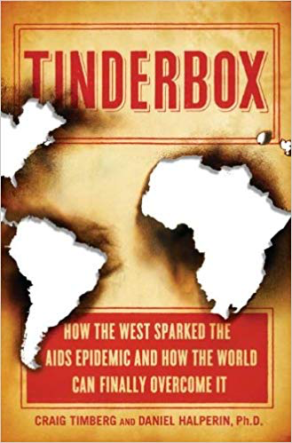
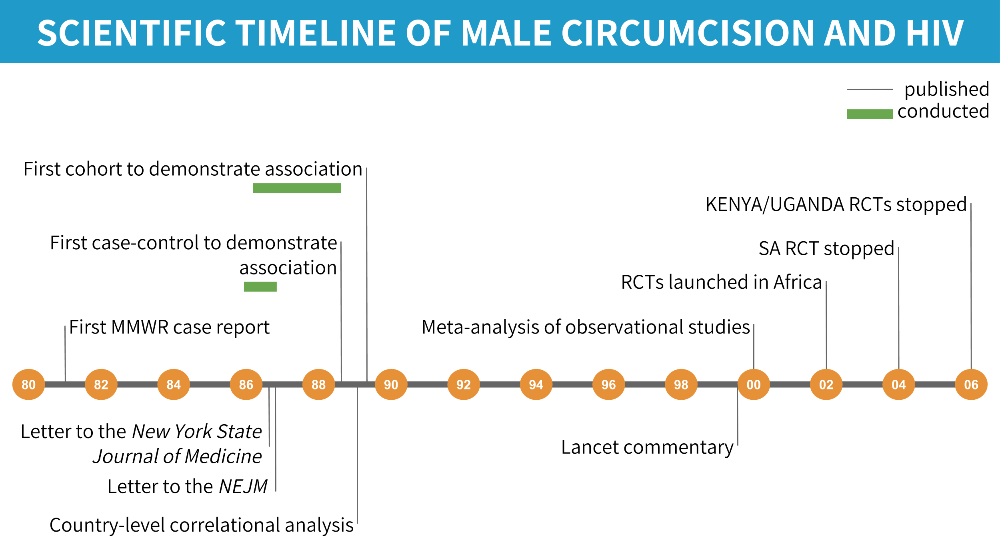
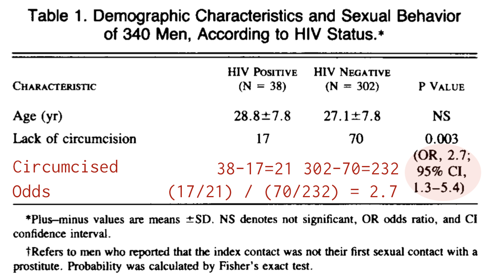
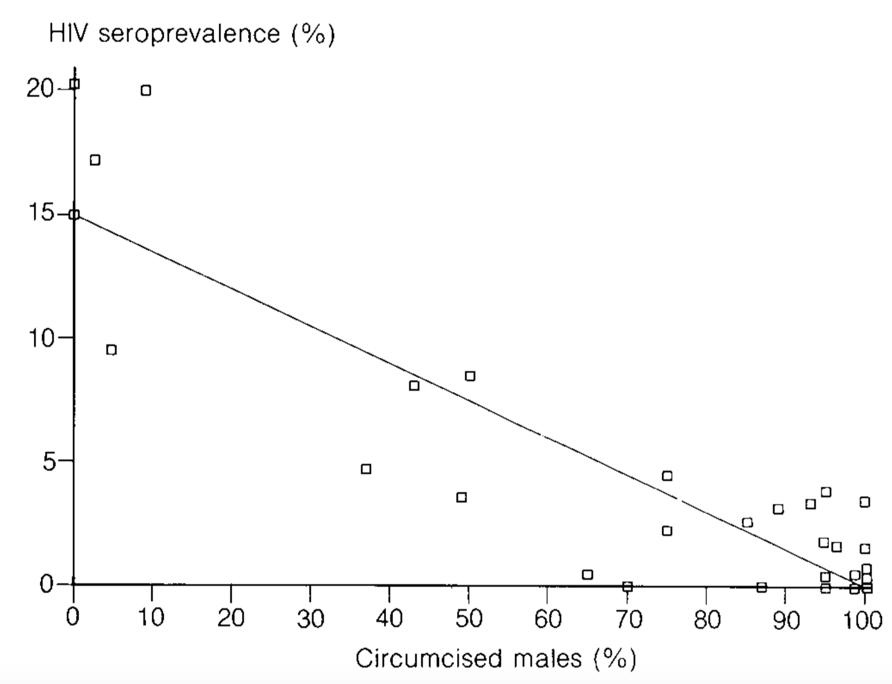
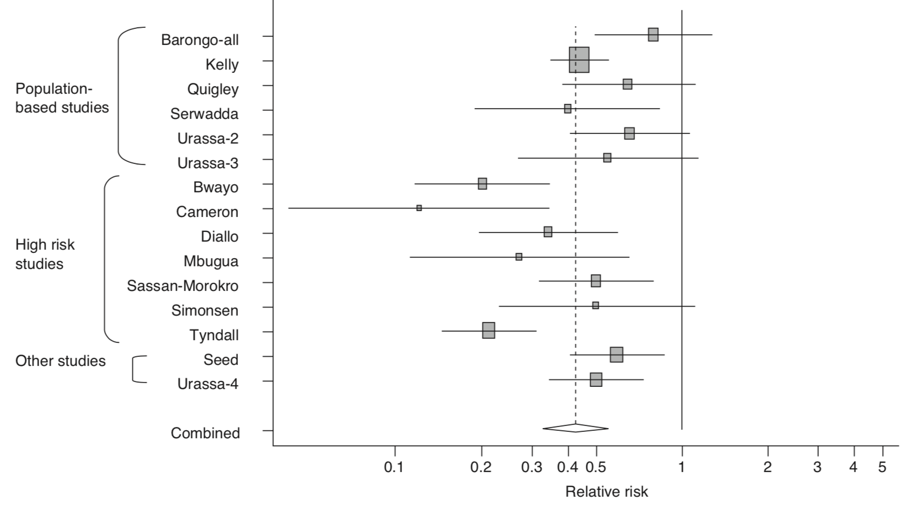

--- 
knit: "bookdown::preview_chapter"
---

# Introduction {-}


```{r mmwr, fig.margin=TRUE, echo=FALSE, fig.cap="The [*Morbidity and Mortality Weekly Report *](https://www.cdc.gov/mmwr/about.html) is a weekly series published by the CDC that disseminates critical public health information and recommendations."}
knitr::include_graphics("images/mmwr1981.png")
```

On June 5, 1981, the US Centers for Disease Control and Prevention  [published a **case report**](https://www.cdc.gov/mmwr/preview/mmwrhtml/june_5.htm) that would mark the start of a global pandemic that no one saw coming. This 1-page bulletin described five men in Los Angeles who had developed a rare lung infection called *Pneumocystis carinii* pneumonia.

> In the period October 1980-May 1981, 5 young men, all active homosexuals, were treated for biopsy-confirmed *Pneumocystis carinii* pneumonia at 3 different hospitals in Los Angeles, California. Two of the patients died. All 5 patients had laboratory-confirmed previous or current cytomegalovirus (CMV) infection and candidal mucosal infection.

> **Pneumocystis pneumonia in the United States is almost exclusively limited to severely immunosuppressed patients.** The occurrence of pneumocystosis in these 5 previously healthy individuals without a clinically apparent underlying immunodeficiency is unusual. **The fact that these patients were all homosexuals suggests an association between some aspect of a homosexual lifestyle or disease acquired through sexual contact and *Pneumocystis* pneumonia in this population.**  

Three thousand miles away, doctors in New York observed a cluster of similar cases. @hymes1981 described these patients in an article published in the September 19 issue of *The Lancet*, the first article on the disease to appear in the **scientific literature**.

```{marginfigure}
News outlets including the *Associated Press*, the *Los Angeles Times*, and the *San Francisco Chronicle* covered the release of the June 5 MMWR. The [*New York Times*](https://www.nytimes.com/1981/07/03/us/rare-cancer-seen-in-41-homosexuals.html) published its first article on the epidemic, "Rare Cancer Seen in 41 Homosexuals", about a month later. AIDS would not make the [front page of the *New York Times*](https://www.nytimes.com/times-insider/2014/10/30/1983-having-claimed-558-lives-aids-finally-made-it-to-the-front-page/) until May 25, 1983.
```

As clinicians and researchers began to connect the dots between the likely presence of an infectious agent and opportunistic infections among gay men, the public came to know this crisis as the "gay cancer" and eventually "Gay-Related Immune Deficiency" or GRID. On June 17, 1982, the National Broadcasting Company, an American English-language television network, broadcast a report on the evening news about a new study showing how the "lifestyle" of some homosexual men had created an "epidemic" of a "rare form of cancer". By the time this report aired, there were 413 reported cases in the US, a third of whom had already died. The CDC estimated that thousands more might be affected.

<iframe width="690" height="388" src="https://www.youtube.com/embed/t5GZGWgvha8" frameborder="0" allow="accelerometer; autoplay; encrypted-media; gyroscope; picture-in-picture" allowfullscreen></iframe>

It would be a few more months until the CDC used the term AIDS (Acquired Immune Deficiency Syndrome) for the first time in September 1982, and nearly another 2 years until researchers identified the retrovirus that causes AIDS, HTLV-III, now known as HIV (human immunodeficiency virus). 

No one in the early 1980s could fathom that more than 70 million people worldwide would contract HIV over the next few decades, or that more than 35 million people would die [@whogho:2019].

## The HIV/AIDS Pandemic: A Microcosm of Global Health Research {-}

The scientific story of the HIV/AIDS pandemic can teach us a lot about the full spectrum of global health research, and in particular highlights the typical sequence of work that follows the outbreak of a new disease. 

First came the case reports that alerted the medical and research communities to the new disease and described its onset and clinical features. These reports provided the motivation for future studies and generated hypotheses about the causative agents.

```{r rogers, fig.margin=TRUE, echo=FALSE, fig.cap="Results from @rogers1983 showing that cases have deficiency in T-Helper cells compared to controls. Figure reproduced by Yours Truly based on reported results."}
rogers <- data.frame(group = c("Cases", "Controls"),
                     thelper = c(333, 928),
                     tlower = c(333-96, 928-86),
                     tupper = c(333+96, 928+86))

rogers %>%
  ggplot(., aes(group, thelper)) +
    geom_col(fill="#1f9ac9ff") +  
    geom_errorbar(aes(ymin = tlower, ymax = tupper), width=0.2) +
    theme_classic() +
    ylab(expression("T-Helper cells (/mm"*{}^{3}*")")) +
    xlab("Group") +
    theme(text = element_text(size=20))
```

Then came a **case-control** study that pointed to the role of cellular immune deficiency in the development of opportunistic infections [@rogers1983;@jaffe1983]. As we'll discuss in a later chapter, case-control studies are often the first designs that public health researchers employ when studying a new topic because they are *relatively* easy to conduct. In the first HIV case-control study, researchers recruited homosexual men with biopsy-confirmed Kaposi's sarcoma or *Pneumocystis carinii* pneumonia as **cases** and identified homosexuals without either condition from nearby clinics and friend networks as **controls**. Researchers took biological samples and asked participants about their past sexual behavior, looking for associations with the presence of disease. 

```{r jaffe, eval=FALSE, fig.margin=TRUE, echo=FALSE, fig.cap="Chart from [@jaffe1985] showing the percentage of men in the sample with HIV (solid line) and the cumulative number of AIDS cases by year of diagnosis (dashed line). (Note: [Don't use dual axis charts](http://tinyurl.com/y3vb4j2b).)"}
knitr::include_graphics("images/jaffecohort.png")
```
```{marginfigure}
Typically a cohort study like this would not be possible to complete so quickly, but @jaffe1985 were 'fortunate' in that they had access to a group of nearly 7,000 homosexual and bisexual men who enrolled in Hepatitis B studies (and provided blood samples) between 1970 and 1980—*before we knew anything about HIV*. That meant that the researchers were able to establish the percentage of men in the sample who tested positive for HIV as far back as 1978 and followed them forward in time to see who developed AIDS and when.
```

A potentially more informative observational design is the **cohort study**, but this design requires researchers to follow a group of people over time and observe who develops the condition. This 'wait and see' approach takes time, money, and a good bit of coordination. @jaffe1985 published the first AIDS cohort study, finding that there was a long incubation time from infection to development of AIDS. The authors reported that for every person in the sample with AIDS, there were 30 with HIV. This suggested to them that even if transmission of HIV stopped right then, there would be several hundred thousand infected Americans who were likely to develop AIDS eventually, representing a major public health concern.

From this point on, the scholarly literature on HIV and AIDS exploded. @lakeh2017 estimated that the annual publication rate was more than 14,000 papers per year by 2012. Observational studies like these conducted in the early 1980s were followed over the next few decades by bench science on the virus and on drug candidates, diagnostic validity studies of rapid HIV tests, the establishment of demographic surveillance sites, drug and prevention trials, and many, many other types. The literature today is a microcosm of global health research. Experts from just about every discipline have contributed to our knowledge. Biology, economics, psychology, biostatistics, medicine, law, and so on.

```{r hivpubs, fig.margin=FALSE, echo=FALSE, fig.cap="Global trend in HIV/AIDS publications [@lakeh2017]. Figure reproduced by Yours Truly based on WebPlotDigitizer extraction of published image.", fig.height=4}
pubs <- structure(list(Year = c("1985-01-01", "1986-01-01", "1986-10-01", "1987-05-01", "1988-01-01", "1988-10-01", "1989-05-01", "1990-01-01", "1990-09-01", "1991-06-01", "1992-01-01", "1992-10-01", "1993-08-01", "1994-05-01", "1995-01-01", "1995-06-01", "1996-01-01", "1996-10-01", 
"1997-07-01", "1998-03-01", "1999-01-01", "1999-09-01", "2000-06-01", "2001-03-01", "2001-10-01", "2002-08-01", "2003-05-01", "2004-01-01", "2004-08-01", "2005-06-01", "2006-01-01", "2006-11-01", "2007-08-01", "2008-04-01", "2009-07-01", "2009-10-01", "2010-06-01", "2011-01-01", 
"2012-01-01"), Publications = c(0.216156803, 0.470117468, 0.962958743, 1.514617306, 2.080110394, 2.647546135, 3.20936627, 3.780105309, 4.212946688, 4.645285423, 5.100790141, 5.584094038, 6.111413304, 6.613249988, 7.1111506, 7.669093293, 8.244485548, 8.368716708, 8.423449918, 8.401735384, 8.231758558, 8.270275579, 8.144314121, 7.944221517, 8.010537719, 8.262181785, 8.700351341, 9.257633374, 9.802598112, 10.17470529, 10.54198694, 11.15065813, 11.50423252, 11.69101183, 11.98203807, 12.43109564, 13.00876374, 13.62206813, 14.08279949)), class = "data.frame", row.names = c(NA, -39L))
pubs %>%
  mutate(Year = lubridate::ymd(Year)) %>%
  ggplot(., aes(Year, Publications)) +
    geom_line(color="#1f9ac9ff", size=3) +
    scale_x_date(breaks = as.Date(c("1985-01-01", "1988-01-01",
                                    "1991-01-01", "1994-01-01",
                                    "1997-01-01", "2000-01-01",
                                    "2003-01-01", "2006-01-01",
                                    "2009-01-01", "2012-01-01")),
                 date_labels = "%Y") +
  theme_classic() +
  theme(text = element_text(size=20)) +
  ylab("Publications (in thousands)")
```

Throughout this book, I'll return to the HIV/AIDS pandemic as well as introduce many other global health challenges, such as Zika, malaria, and depression, to teach you about how research problems and questions are identified, how studies are designed to provide answers, and how scientists make a difference with their work.

<iframe src="https://webplayer.whooshkaa.com/episode/417872?theme=dark&background-color=%231F9AC9&waveform-base-color=%23E69138&waveform-progress-color=%23FFFFFF" height="190" width="50%" scrolling="no" frameborder="0" allow="autoplay"></iframe>

## The Long Road from Evidence to Practice {-}

This last idea—making your work have an impact—is one that we will revisit throughout this book. Most researchers will, I assume, tell you that they did not pursue careers in science to publish papers as *the* end goal. They got into research to make a difference. To change the way we think about a topic, or to change policy or practice. To improve lives, or possibly even to save lives.

But science is often incremental, with one study building on another, and publishing scientific papers is one important piece of the puzzle. While there are examples of individual studies pushing a field to change, overnight it might seem in some cases, these studies are frequently the culmination of years or decades of prior work. The road to impact can be long, hard, and often fraught with skepticism and self-doubt.

```{r tinderbox, fig.margin=TRUE, echo=FALSE, fig.cap="[*Tinderbox*](https://amzn.to/2FTyi31), by Daniel Halperin and Craig Timberg [-@tinderbox]. Learn more by listening to an episode of NPR's [*Fresh Air*](https://tinyurl.com/yy536msg) or reading reviews in the [*Washington Post*](https://www.washingtonpost.com/entertainment/books/tinderbox--how-the-west-sparked-the-aids-epidemic-and-how-the-world-can-finally-overcome-it-by-craig-timberg-and-daniel-halperin/2012/04/07/gIQAux551S_story.html?noredirect=on&utm_term=.9c13514ec861) and [*New York Times*](https://www.nytimes.com/2012/04/29/books/review/tinderbox-by-craig-timberg-and-daniel-halperin.html)."}

```

Few people know this better than Dr. Daniel Halperin, an epidemiologist, medical anthropologist, and author of the 2012 book, *Tinderbox: How the West Sparked the AIDS Epidemic and How the World Can Finally Overcome It*. Halperin's co-author, journalist Craig Timberg, describes him as follows:

> Halperin is tall, dark haired, and lean, and his smile is disarming. This is good, because he has made a career of telling people that most of what they think they know about HIV is wrong. When I met him while working on a story in 2005, he immediately departed from the script of most experts I had met. While their conversations had focused mainly on condoms, HIV testing, or the distant hope of a breakthrough vaccine, Halperin veered quickly into the realm of the impolite. **He insisted that the two most important factors in understanding the spread of AIDS through African societies were sexual behavior and male circumcision.**

Halperin was not the first to posit a link between male circumcision and HIV transmission, but he was one of the more vocal advocates of this idea during a time when few wanted to consider it fully. Halperin and other advocates of male circumcision as a prevention strategy would eventually be proven correct, but it would take nearly two decades (Figure \@ref(fig:mctimeline)).

```{r mctimeline, fig.cap="Scientific timeline of male circumcision and HIV/AIDS.", fig.fullwidth = TRUE, echo=F}

```

### THE FIRST HINTS THAT MALE CIRCUMCISION MIGHT BE PROTECTIVE AGAINST HIV {-}

#### Expert Opinion, 1986{-}

```{marginfigure}
Letters to the Editor, often published under the heading "Correspondence", are short pieces usually under 400 words about an article published in the journal or topic of interest to the author.
```
The story started in 1986 with two letters published in medical journals in which the authors raised the possibility that uncircumcised men could be at higher risk of transmission because of the delicate nature of the foreskin of the penis [@alcena1986;@fink1986]. Timberg and Halperin explain the biological mechanism:

> The reason is simple—if rather graphic—anatomy. The skin on the shaft of a man’s penis is, like that on most of his body, relatively thick and tough, allowing it to serve as a natural barrier against infection. But the foreskin of an uncircumcised man is unusually vulnerable, because it is soft, thin, and a bit moist, making it easier for pathogens to penetrate. HIV targets certain types of immune cells that are close to the surface in foreskin tissue. During erection the foreskin is stretched back down to cover the upper part of the penis shaft, turning this most vulnerable skin outward, where it can come into contact with fluids that may contain the virus. The penis of a circumcised man, by contrast, presents a daunting challenge to HIV. There is no inner foreskin to turn outward and fewer easily accessible immune cells that the virus could infect. The man is much safer, and so are his future sex partners. With fewer infections, the overall community is safer too.

#### Case-Control, 1988{-}

When these letters made their way into print, a study that would provide the first (and unexpected) **empirical evidence** of a potential link between male circumcision and HIV transmission was already underway in the Pumwani slum of Kenya's capital Nairobi. At this time in 1986, researchers knew that HIV causes AIDS and that HIV was not limited to homosexuals in the United States, but there was a puzzle. In the US and Europe, HIV mainly affected homosexual men. But in Africa, HIV transmission was most common among heterosexual partners. So Allan Ronald, Francis Plummer, and a team that included Peter Piot, who would eventually become the Executive Director of UNAIDS, began recruiting men who frequented a group of Pumwani prostitutes who had an HIV rate of 85%(!) to study transmission dynamics.

```{r pumwanior, fig.cap="Abbreviated results from @simonsen1988 showing that uncircumcised men were more likely to have HIV.", fig.margin=TRUE, echo=F}

```

In the first article they published, a case-control study of 340 men, 11% of whom had HIV, the team found that the odds of being uncircumcised were 2.7 times higher among HIV-positive men (cases) compared to the HIV-negative controls [@simonsen1988]. The authors were surprised:

> The association between HIV infection and lack of circumcision is **interesting an unexpected**...However, since 85 percent of American white men are circumcised, the foreskin may have been overlooked as a risk factor...

#### Prospective Cohort, 1989{-}

The team followed these men over two years, ultimately recruiting and following a cohort of 293 men who were seronegative (HIV-negative) at enrollment [@cameron1989]. 24 (8.2%) of these men seroconverted to HIV-I during the follow-up period, which means they went from being HIV-negative to HIV-positive. 

When the team looked at the circumcision numbers, they were astonished. As told in *Tinderbox*, Plummer, the lead author of the study, was running the analysis from the University of Manitoba one night and called his colleague Allan Ronald, exclaiming, "Allan, you won't believe what we found!"

Plummer was amazed because he found that 18 (23%) of the 79 uncircumcised men got HIV, compared to only 6 (3%) of the 214 circumcised men. The odds of being uncircumcised were 10.2 times higher among men who got HIV! 

This study was important because it confirmed the unexpected results of the case-control (cross-sectional) study with a stronger, prospective ('wait-and-see') design, and it suggested the link between circumcision and HIV might be even stronger than expected.

```{r bongaarts, fig.cap="Estimated HIV seroprevalence in capital city and percentage of males who are circumcised for 37 African countries [@bongaarts1989].", fig.margin=TRUE, echo=F}

```

#### Correlational, 1989{-}

A few months before the results of the Pumwani cohort study would go to press, the esteemed demographer John Bongaarts and several co-authors combined ethnographic data on circumcision practices from the 1950s and 1960s with the best estimates of seroprevalence in African capital cities to look for a pattern. The relationship was unmistakable. When circumcision was high, seroprevalence was low, and vice versa. The data underlying the analysis were not perfect, but a compelling story was coming together on the basis of these observational studies.

### "DON'T TALK ABOUT CIRCUMCISION ANYMORE" {-}

```{r caldwell, fig.cap="Overlap between regions where men are typically uncircumcised and the 'AIDS Belt' (red outline), where HIV rates are highest [@caldwell1996].", fig.margin=TRUE, echo=F}
knitr::include_graphics("images/caldwells2.png")
```

As Halperin recounts in *Tinderbox*, he first learned about the possible role of male circumcision in 1996 when his mother visited the dentist and picked up the March issue of *Scientific American*. This issue featured an article by John and Pat Caldwell [-@caldwell1996] that reviewed evidence for explanations for why half of all cases of HIV worldwide were concentrated in a chain of countries in eastern and southern Africa known as the *AIDS Belt*. In the years since the first observational studies suggesting a link were published in the late 1980s, the global health community largely ignored male circumcision as a possible explanation for varying seroprevalence rates across Africa. But as the Caldwells saw it, the evidence pointed convincingly to the combination of risky sexual behavior and a lack of male circumcision.

```{r halperin, fig.margin=TRUE, echo=FALSE, fig.cap="Data on male circumcision and seroprevalence from @halperin1999, visualized by Yours Truly."}
halperin <- data.frame(Country = c("Zimbabwe", "Botswana",
                                   "Namibia", "Zambia",
                                   "Swaziland", "Malawi",
                                   "Mozambique", "Rwanda", 
                                   "Kenya", "Congo",
                                   "Cameroon", "Nigeria", "Gabon",
                                   "Liberia", "Sierra Leone", 										        "Ghana", "Gambia", "Guinea",  
                                   "Benin"),
                       Circumcised = c(rep("<20% circumcised", 8),
                                       rep(">80% circumcised", 11)),
                       Seroprevalence = c(25.84, 25.10, 19.94, 19.07,
                                          18.50, 14.92, 14.17, 12.75,
                                          11.64, 7.64, 4.89, 4.12,
                                          4.25, 3.65, 3.17, 2.38, 2.24,
                                          2.09, 2.06))

halperin$Country <- as.character(halperin$Country)
maxchar <- max(nchar(halperin$Country))
halperin$Country <- stringr::str_pad(halperin$Country, maxchar, "left") 

low <- 
halperin %>%
  filter(Circumcised=="<20% circumcised") %>%
  ggplot(., aes(reorder(Country, Seroprevalence), Seroprevalence)) +
    geom_point(size=3, color="#1f9ac9ff") +
    geom_segment(aes(x=Country,
                     xend=Country,
                     y=0,
                     yend=Seroprevalence),
                 linetype = "dotted",
                 color = "#1f9ac9ff") +
    ylim(0, 30) +
    coord_flip() +
    theme_classic() +
    ggtitle("<20% circumcised") +
    theme(axis.title.y = element_blank(),
          text = element_text(size=20),
          title = element_text(size=12),
          axis.text.y = element_text(family="Inconsolata"))

high <- 
halperin %>%
  filter(Circumcised==">80% circumcised") %>%
  ggplot(., aes(reorder(Country, Seroprevalence), Seroprevalence)) +
    geom_point(size=3, color="#6aa84fff") +
    geom_segment(aes(x=Country,
                     xend=Country,
                     y=0,
                     yend=Seroprevalence),
                 linetype = "dotted",
                 color = "#6aa84fff") +
    ylim(0, 30) +
    coord_flip() +
    theme_classic() +
    ggtitle(">80% circumcised") +
    theme(axis.title.y = element_blank(),
          text = element_text(size=20),
          title = element_text(size=12),
          axis.text.y = element_text(family="Inconsolata"))

grid.arrange(low, high, nrow = 1)
```

Halperin said that this article "altered the trajectory of his professional life". Three years later—a full decade since @cameron1989 published the results of the Pumwani cohort study—Halperin teamed up with anthropologist and epidemiologist Robert Bailey to write a commentary for *The Lancet* called "Male circumcision and HIV infection: 10 years and counting" [@halperin1999]. Their article was a not-so-gentle call to action.

> By avoiding [male circumcision] altogether, medical professionals and public-health authorities may inadvertently be harming the very individuals whom they are trying to help...The hour has passed for the international health community to recognise the compelling evidence that show a significant association between lack of male circumcision and HIV infection.

A couple years after this article came out, Halperin took a job in Washington, DC with the US Agency for International Development, or USAID, as an "HIV Prevention Advisor". As he describes in *Tinderbox*, his ideas did not sit well with most of his new colleagues. Superiors scolded him, "Don't talk about circumcision anymore", and "We do condoms!" 

### IN SEARCH OF A DEFINITIVE ANSWER {-}

```{r weiss, fig.cap="Forest plot showing the results of 15 (of 27) studies that estimated the association between male circumcision and HIV transmission and adjusted for potential confounding [@weiss2000]. We'll discuss systematic reviews, meta-analysis, and forest plots like this one in a later chapter.", fig.margin=TRUE, echo=F}

```

When Halperin worked at USAID, it was condoms or bust. But things were starting to change, in part due to the publication of an influential **systematic review** and **meta-analysis** of studies on male circumcision and the risk of HIV infection in sub-Saharan Africa [@weiss2000]. The authors included 27 observational studies in the review and found that 21 reported a lower risk of HIV among circumcised men. Among the 15 studies that adjusted for potential confounding, all 15 reported that circumcision was effective (adjusted relative risk = 0.42, CI 0.34±0.54). @weiss2000 concluded:

> The data from observational studies provide **compelling evidence** of a substantial protective effect of male circumcision against HIV infection in sub-Saharan Africa, especially in populations at high risk of HIV/ STD. The continuing rapid spread of HIV infection, especially in eastern and southern Africa, suggests that the potential public health benefit of introducing safe services for male circumcision on a wider scale should be explored.

But in the eyes of many, "compelling" is not the same as "definitive". Before male circumcision could become part of the HIV prevention toolbox, people wanted experimental evidence. And they were about to get it.  

Three large-scale **trials** of male circumcision got underway in Africa in 2002. Different teams of researchers independently enrolled 3,274 uncircumcised, HIV-negative men in South Africa, 4,996 in Uganda, and 2,784 in Kenya in separate studies. Half of the participants in each study were randomized to be circumcised, with their consent of course. The rest formed the uncircumcised control group. As we will explore together in later chapters, this design, the **randomized controlled trial**, is often held up as the best source of evidence. There is nuance to this idea that we must unpack, but it's safe to say that these trials were created to provide a definitive answer about the link between male circumcision and HIV.

The results were astonishing.

```{marginfigure}
While these studies closed one chapter, they did not close the book on male circumcision. One big question for **implementation science** was how to incorporate male circumcision into the broader public health response. Other researchers began to focus on the potential unintended consequences of male circumcision.
```

In trials like these, it's common to plan **interim analyses** where a board of advisors takes a scheduled peek at the data at certain points before the trial is over to make sure that the treatment group is not getting too much worse—or too much better. The latter is exactly what happened in the South Africa trial when the team took their peek in 2004. Circumcised men had a relative risk of HIV acquisition of 0.4, suggesting that circumcision offered a protective effect of 60%. The **data and safety monitoring board** decided to stop the trial early and offer the treatment to every man in the control group. The other two trials experienced the same fate because interim analyses suggested a similar effect.

```{r mctrials, fig.cap="Randomized controlled trials of male circumcision.", fig.fullwidth = TRUE, echo=F}
knitr::include_graphics("images/mctrials.png")
```

```{marginfigure}
In his book with Stephen Inrig, *The AIDS Pandemic: Searching for a Global Response* [-@merson2018, pp. 378], former Director of the World Health Organization's Global Programme on AIDS (GPA), Michael Merson, offers a reflection on this period and concludes in retrospect that GPA should have funded more research on male circumcision when it had the chance.
```

And like that, the question of **efficacy** was put to rest. After nearly two decades—and many preventable infections and deaths—it became clear to everyone that male circumcision helps to prevent HIV transmission.

## The Takeaway {-}

The road from research question to policy impact can be long. Decades, in fact, as demonstrated by the scientific history of male circumcision and HIV prevention. But for researchers and advocates who are willing doggedly follow the data wherever it leads, real change is possible. As of 2017, nearly 15 million men living in the AIDS Belt have been circumcised, potentially averting more than 500,000 new HIV infections through 2030 [@whomc2017].

###### Share Your Feedback{-}

This book is a work in progress, so I'd really appreciate your feedback on this chapter.

<iframe height="600" width="690" src="https://duke.qualtrics.com/jfe/form/SV_bse5EAEbXf9Zz3T" frameborder="0"></iframe>
