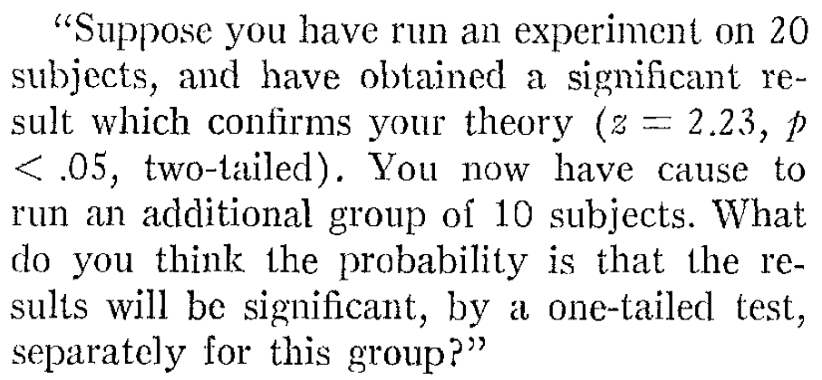

```{r, include = FALSE}
knitr::opts_chunk$set(error = FALSE, warning = FALSE, message = FALSE, out.width  = '100%', fig.width  = 8, fig.height = 5, fig.align  = 'center')
backgroundcolor <- "#fffafa"
```

```{r, include = FALSE}
library(tidyverse)
library(gridExtra)
library(kableExtra)
library(ggrepel)
library(grid)
library(magrittr)
library(pwr)
library(Superpower)
library(ggplot2)
library(patchwork)
library(MASS)
library(viridis)
library(TOSTER)
library(BEST)
library(metafor)
library(MOTE)
library(binom)
library(MASS)
library(gsDesign)
library(rpact)
library(BUCSS)
library(flextable)
```

# Using *p*-values to test a hypothesis {#pvalue}

Scientists can attempt to answer a wide range of questions by collecting data. One question that interests scientists is whether measurements that have been collected under different conditions differ, or not. The answer to such a question is an *ordinal claim*, where a researchers states the average of the measurements is larger, or smaller, or the same, when comparing conditions. For example, a researcher might be interested in the hypothesis students learn better if they do tests, during which they need to retrieve information they have learned (condition A), compared to not getting tests, but spending all of their time studying (condition B). After collecting data, and observing that the mean grade is higher for students who spent part of their time doing tests, the researcher can make the ordinal claim that student performance was *better* in condition A compared to condition B. Ordinal claims can only be used to state there is a difference between conditions. They do not quantify the **size of the effect**.

To make ordinal claims, researchers typically rely on a methodological procedure known as a **hypothesis test**. One part of a hypothesis test consists of computing a ***p*-value** and examining whether there is a statistically **significant** difference. 'Significant' means that something is worthy of attention. A hypothesis test is used to distinguish a signal (that is worth paying attention to) from random noise in empirical data. It is worth distinguishing **statistical significance**, which is only used to claim whether an observed effect is a signal or noise, from **practical significance**, which depends on whether the size of the effect is large enough to have any worthwhile consequences in real life. Researchers use a methodological procedure to decide whether to make an ordinal claim or not as a safeguard against confirmation bias. In an internal report for Guinness brewery on the use of statistical tests in an applied setting, William Gosset (or 'Student', who developed the *t*-test) already wrote [-@gosset_application_1904]:

> On the other hand, it is generally agreed that to leave the rejection of experiments entirely to the discretion of the experimenter is dangerous, as he is likely to be biassed. Hence it has been proposed to adopt a criterion depending on the probability of such a wide error occurring in the given number of observations.

Depending on their desires, scientists might be tempted to interpret data as support for their hypothesis, even when it is not. A hypothesis test, when used correctly, controls the amount of time researchers will fool themselves when they make ordinal claims.

## Philosophical approaches to *p*-values

Before we look at how *p*-values are computed, it is important to examine how they are supposed to help us make ordinal claims when testing hypotheses. The definition of a *p*-value is the probability of observing the sample data, or more extreme data, assuming the null hypothesis is true. But this definition does not tell us much about how we should interpret a *p*-value. 

The interpretation of a *p*-value depends on the statistical philosophy one subscribes to. [Ronald Fisher](https://en.wikipedia.org/wiki/Ronald_Fisher) published 'Statistical Methods for Research Workers' in 1925 which popularized the use of *p*-values. In a Fisherian framework a *p*-value is interpreted as a descriptive continuous measure of compatibility between the observed data and the null hypothesis [@greenland_statistical_2016]. The compatibility of observed data with the null model falls between 1 (perfectly compatible) and 0 (extremely incompatible), and every individual can interpret the *p*-value with “statistical thoughtfulness". According to Fisher [-@fisher_statistical_1956], *p*-values "do not generally lead to any probability statement about the real world, but to a rational and well-defined measure of the reluctance to accept the hypotheses they test". Fisher tried to formalize his philosophy in an approach called 'fiducial inference', but this has not received the same widespread adoption of other approaches, such as decision theory, likelihoods, and Bayesian inference. Indeed, Zabell [-@zabell_r_1992] writes "The fiducial argument stands as Fisher's one great failure", although others have expressed the hope that it might be developed into a useful approach in the future [@schweder_confidence_2016]. A Fisherian *p*-value describes the incompatibility of the data with a single hypothesis, and is known as *significance testing*. The main reason a *significance test* is limited is because researchers only specify a null hypothesis ($H_0$), but not the alternative hypothesis ($H_1$). 

Neyman and Pearson built on insights about *p*-values by William Gosset and Ronald Fisher, and developed an approached called *statistical hypothesis testing*. The main difference with the significance testing approach developed by Fisher was that in a statistical hypothesis test both a null hypothesis and an alternative hypothesis is specified. In a Neyman-Pearson framework the goal of statistical tests is to guide the behavior of researchers with respect to these two hypotheses. Based on the results of a statistical test, and without ever knowing whether the hypothesis is true or not, researchers choose to tentatively act as if the null hypothesis or the alternative hypothesis is true. In psychology, researchers often use an imperfect hybrid of the Fisherian and Neyman-Pearson frameworks, but the Neyman-Pearson approach is, according to Dienes @dienes_understanding_2008 “the logic underlying all the statistics you see in the professional journals of psychology”.

When a Neyman-Pearson hypothesis test is performed the observed *p*-value is only used to check if it is smaller than the chosen alpha level, but it does not matter how much smaller it is. For example, if an alpha level of 0.01 is used, both a *p* = 0.006 and a *p* = 0.000001 will lead  researchers to decide to act as if the state of the world is best described by the alternative hypothesis. This differs from a Fisherian approach to *p*-values, where the lower the *p*-value, the greater the psychological reluctance of a researcher to accept the null hypothesis they are testing. A Neyman-Pearson hypothesis test does not see the goal of an inference as quantifying a continuous measure of compatibility or evidence. Instead, as Neyman [-@neyman_inductive_1957] writes: 

>The content of the concept of inductive behavior is the recognition that the purpose of every piece of serious research is to provide grounds for the selection of one of several contemplated courses of action.

Intuitively, one might feel like decisions about how to act should not be based on the results of a single statistical test, and this point is often raised as a criticism of a Neyman-Pearson approach to statistical inferences. However, such criticisms rarely use the same definition of an ‘act’ as Neyman used. It is true that, for example, the decision to implement a new government policy should not be based on a single study result. However, Neyman considered making a scientific claim an ‘act’ as well, and wrote (1957, p. 10) that the concluding phase of a study involves:

>an act of will or a decision to take a particular action, perhaps to assume a particular attitude towards the various sets of hypotheses

Cox [-@cox_problems_1958] writes: 

>it might be argued that in making an inference we are 'deciding' to make a statement of a certain type about the populations and that therefore, provided that the word decision is not interpreted too narrowly, the study of statistical decisions embraces that of inference. The point here is that one of the main general problems of statistical inference consists in deciding what types of statement can usefully be made and exactly what they mean.

Thus, in a Neyman-Pearson approach, *p*-values form the basis of decisions about which claims to make. In science, such claims underly most novel experiments in the form of **auxiliary hypotheses**, or the assumptions about underlying hypotheses that are assumed to be accurate in order for a test to work as planned. For example, if it is important that participants can see color in a planned experiment, we assume it is true that the [Ishihara test](https://en.wikipedia.org/wiki/Ishihara_test) successfully identifies which participants are colorblind. 

## Creating a null model

Assume I ask two groups of 10 people how much they liked the extended directors cut of the Lord of the Rings (LOTR) trilogy. This means our **total sample size** (*N*) is 20, and the sample size in each group (*n*) is 10. The first group consists of my friends, and the second groups consists of friends of my wife. Our friends rate the trilogy on a score from 1 to 10. We can calculate the average rating by my friends, which is 8.7, and the average rating by my wife’s friends, which is 7.7. We can compare the scores in both groups by looking at the raw data, and by plotting the data.

```{r friends, echo=F, tab.cap = "Ratings for the Lord of the Rings extended trilogy by two groups of friends."}

friends <- c("friend_1", "friend_2", "friend_3", "friend_4", "friend_5", "friend_6", "friend_7", "friend_8", "friend_9", "friend_10")
friends_daniel <- c(9, 7, 8, 9, 8, 9, 9, 10, 9, 9)
friends_kyra <- c(9, 6, 7, 8, 7, 9, 8, 8, 8, 7)
df <- data.frame(friends, friends_daniel, friends_kyra)
colnames(df) <- c("", "Friends Daniel", "Friends Kyra")

kable_styling(kable(df, caption = 'Ratings for the Lord of the Rings extended trilogy by two groups of friends.', align = c("l", "c", "c"), booktabs = TRUE), bootstrap_options = "striped", full_width = FALSE, position = "left")
```

```{r, echo = FALSE}
# Get data frame in long format for plotting
df_long <- tidyr::gather(df, "Friend Group", rating, "Friends Daniel":"Friends Kyra", factor_key = TRUE)

# Plot the data
ggplot(df_long, aes(x = rating, fill = `Friend Group`)) +
  geom_density(alpha = .3) +
  theme_bw() + 
  theme(plot.background = element_rect(fill = backgroundcolor))  + 
  theme(panel.background = element_rect(fill = backgroundcolor))
```

We can see the groups overlap but the mean ratings differ by 1 whole point. The question we are no faced with is the following: Is the difference between the two groups just random variation, or can we claim that my friends like the extended directors cut of the Lord of the Rings (LOTR) trilogy more than my wife’s friends?

In a **null hypothesis significance test** we try to answer this question by calculating the probability of the observed difference (in this case, a mean difference of 1) or a more extreme difference, under the assumption that there is no real difference between how much my friends and my wife’s friends like the extended directors cut of LOTR, and we are just looking at random noise. This probability is called the *p*-value. If this probability is low enough, we decide to claim there is a difference. If this probability is not low enough, we refrain from making a claim about a difference. 

The null hypothesis assumes that if we would ask an infinite number of my friends  and an infinite number of my wife’s friends how much they like LOTR, the difference between these huge groups is exactly 0. However, in any sample drawn from the population, random variation is very likely to lead to a difference somewhat larger or smaller than 0. We can create a **null model** that quantifies the expected variation in the observed data, just due to random noise, to tell us what constitutes a reasonable expectation about how much the differences between groups can vary if there is no difference in the population.

It is practical to create a null model in terms of a **standardized** distribution, as this makes it easier to calculate the probability that specific values will occur, regardless of the scale that is used to collect the measurements. One version of a null model for differences is the *t*-distribution, which can be used to describe which differences should be expected when drawing samples from a population. Such a null model is built on **assumptions**. In the case of the *t*-distribution, the assumption is that scores are normally distributed. In reality, the assumptions upon which statistical methods are built are never met perfectly, which is why statisticians examine the impact of violations of assumptions on methodological procedures. Statistical tests are still useful in practice when the impact of violations on statistical inferences is small enough.

We can quantify the distribution of *t*-values that is expected when there is no difference in the population by a *probability density function*. Below is a plot of the probability density function for a *t*-distribution with 18 **degrees of freedom** (df), which corresponds to our example where we collect data from 20 friends (df = N - 2 for two independent groups). For a continuous distribution, where probabilities are defined for an infinite number of points, the probability of observing any single point (e.g., *t* = 2.5) is always zero. Probabilities are measured over intervals. For this reason, when a *p*-value is computed, it is not defined as 'the probability of observing the data', but as 'the probability of observed the data, *or more extreme data*'. This creates an interval (a tail of a distribution) for which a probability can be calculated.

## Calculating a *p*-value

A *t*-value can be computed from the mean in the sample, the mean in the population, the standard deviation in the sample, and the sample size. By then computing the probability of observing a *t*-value as extreme or more extreme as the one observed, we get a *p*-value. For the comparison of the movie ratings for the two groups of friends above, performing a two-sided Student's *t*-test yields a *t*-value of 2.5175 and a *p*-value of 0.02151. 

```{r}
t.test(df_long$rating ~ df_long$`Friend Group`, var.equal = TRUE)
```

We can graph the *t*-distribution (for df = 18) and highlight the two tail areas that start at the t-values of 2.5175 and -2.5175. 

```{r, tdist, echo = FALSE, out.width='100%', fig.cap="A *t*-distribution with 18 degrees of freedom."}
par(bg = backgroundcolor)
x <- seq(-5, 5, length = 100)
plot(x, dt(x, df = 18), col = "black", type = "l", xlab = "t-value", ylab = "Density", main = "t-distribution", lwd = 2)
x <- seq(2.5175, 5, length = 100)
z <- (dt(x, df = 18))
polygon(c(2.5175, x, 8), c(0, z, 0), col = rgb(1, 0, 0, 1))
x <- seq(-5, -2.5175, length = 100)
z <- (dt(x, df = 18))
polygon(c(-8, x, -2.5175), c(0, z, 0), col = rgb(1, 0, 0, 1))
```

## Which *p*-values can you expect?

In a very educational video about the '[Dance of the *p*-values](https://www.youtube.com/watch?v=5OL1RqHrZQ8)', Geoff Cumming explains that *p*-values vary from experiment to experiment. However, this is not a reason to 'not trust p' as he mentions in the video. Instead, it is important to clearly understand ***p*-value distributions** to prevent misconceptions. Because *p*-values are part of frequentist statistics, we need to examine what we can expect *in the long run*. Because we never do the same experiment hundreds of times, and we do only a very limited number of studies in our lifetime, the best way to learn about what we should expect in the long run is through computer simulations. 

Take a moment to try to answer the following two questions. Which *p*-values can you expect to observe if there is a true effect, and you repeat the same study one-hundred thousand times? And which *p*-values can you expect if there is no true effect, and you repeat the same study one-hundred thousand times? If you don't know the answer, don't worry - you will learn it now. But if you don't know the answer, it is worth reflecting on why you don't know the answer about such an essential aspect of *p*-values. If you are like me, you were simply never taught this. But as we will see, it is essential to a solid understanding of how to interpret *p*-values. 

Which *p*-values you can expect is completely determined by the statistical power of the study, or the probability that you will observe a significant effect, if there is a true effect. The statistical power ranges from 0 to 1. We can illustrate this by simulating one-sample *t*-tests. The idea is that we simulate IQ scores for a group of people. We know the standard deviation of IQ scores is 15. For now, we will set the mean IQ score in the simulated group to 105, which we will compare to the average IQ score of all people (which is known to be 100 – that’s how IQ tests are normalized). We are testing if the people in our simulated sample have an IQ that differs from the average (and we know the correct answer is ‘yes’, because we made it so in the simulation).

```{r, eval = FALSE, cache = TRUE}
p <- numeric(100000) # store all simulated *p*-values

for (i in 1:100000) { # for each simulated experiment
  x <- rnorm(n = 71, mean = 100, sd = 15) # Simulate data
  y <- rnorm(n = 71, mean = 105, sd = 15) # Simulate data
  p[i] <- t.test(x, y)$p.value # store the *p*-value
}

(sum(p < 0.05) / 100000) # compute power
par(bg = backgroundcolor)
hist(p, breaks = 20) # plot a histogram
```

In the simulation, we generate n = 71 normally distributed IQ scores with a mean of M (106 by default) and a standard deviation of 15. We then perform a one-sample *t*-test, store the *p*-value, and generate a plot of the *p*-value distribution.

```{r, pdistr1, cache = TRUE, echo=FALSE, fig.cap="Distribution of *p*-values when power = 50%."}

#Set number of simulations
nSims <- 100000 #number of simulated experiments
p <-numeric(nSims) #set up empty variable to store all simulated *p*-values
bars<-20

for (i in 1:nSims) { # for each simulated experiment
  x <- rnorm(n = 71, mean = 100, sd = 15) # Simulate data
  y <- rnorm(n = 71, mean = 105, sd = 15) # Simulate data
  p[i] <- t.test(x, y)$p.value # store the *p*-value
}
  
#Plot figure
op <- par(mar = c(5,7,4,4)) #change white-space around graph
hist(p, breaks=bars, xlab="P-values", ylab="number of p-values\n", axes=FALSE,
     main=paste("P-value Distribution with 50% power"),
     col="grey", xlim=c(0,1),  ylim=c(0, nSims))
axis(side=1, at=seq(0,1, 0.1), labels=seq(0,1,0.1))
axis(side=2, at=seq(0,nSims, nSims/4), labels=seq(0,nSims, nSims/4), las=2)
abline(h=nSims/bars, col = "red", lty=3)

```

On the x-axis we see *p*-values from 0 to 1 in 20 bars, and on the y-axis we see how frequently these *p*-values were observed. There is a horizontal red dotted line that indicates an alpha of 5% (located at a frequency of 100.000*0.05 = 5000) – but you can ignore this line for now. In the title of the graph, the statistical power that is achieved in the simulated studies is given (assuming an alpha of 0.05): The studies have 50% power. 

The simulation result illustrates the **probability density function** of *p*-values. A probability density function provides the probability that a random variable has a specific value (such as Figure \@ref(fig:tdist) of the *t*-distribution). Because the *p*-value is a random variable, we can use it's probability density function to plot the *p*-value distribution [@hung_behavior_1997; @ulrich_properties_2018], as in Figure \@ref(fig:pdft). You can vary the sample size, effect size, and alpha level in [this online Shiny app](http://shiny.ieis.tue.nl/d_p_power/). Increasing the sample size or the effect size will increase the steepness of the *p*-value distribution, which means that the probability to observe small *p*-values increases. The *p*-value distribution is a function of the statistical power of the test. 

```{r, pdft, echo = FALSE, fig.cap="Probability density function for p-values from a two-sided t-test."}

n <- 71 # sample size per independent group
d <- 0.33 # effect size
se <- sqrt(2 / n) # standard error
ncp <- (d * sqrt(n / 2)) # non-centrality parameter d

pdf2_t <- function(p) { #probability density function
  0.5 * dt(qt(p / 2, 2 * n - 2, 0), 2 * n - 2, ncp) / 
      dt(qt(p / 2, 2 * n - 2, 0), 2 * n - 2, 0) +
    dt(qt(1 - p / 2, 2 * n - 2, 0), 2 * n - 2, ncp) / 
      dt(qt(1 - p / 2, 2 * n - 2, 0), 2 * n - 2, 0)
}

par(bg = backgroundcolor)
plot(-10, xlab = "P-value", ylab = "Density", axes = FALSE,
     main = "P-value distribution", xlim = c(0, 1), ylim = c(0, 50), 
     cex.lab = 1.5, cex.main = 1.5, cex.sub = 1
)
curve(pdf2_t, 0, 1, n = 1000, col = "black", lty = 1, lwd = 3, add = TRUE)
axis(side = 1, at = seq(0, 1, 0.05), 
     labels = formatC(seq(0, 1, 0.05), format = "f", digits = 2), cex.axis = 1)
```

When there is no true effect, *p*-values are **uniformly distributed**. This means that every *p*-value is equally likely to be observed when the null hypothesis is true. In other words, when there is no true effect, a *p*-value of 0.08 is just as likely as a *p*-value of 0.98. I remember thinking this was very counterintuitive when I first learned it (well after completing a PhD), but it makes sense when we think of the goal to guarantee that when $H_0$ is true, alpha % of the *p*-values fall below the alpha level. If we set alpha to 0.01, 1% of the observed *p*-values should fall below 0.01, and if we set alpha to 0.12, 12% of the observed *p*-values should fall below 0.12. This can only happen if *p*-values are uniformly distributed when the null hypothesis is true.   

```{r pdistr2, cache = TRUE, echo=FALSE, fig.cap="Distribution of *p*-values when power = 50%."}

#Set number of simulations
nSims <- 100000 #number of simulated experiments
p <-numeric(nSims) #set up empty variable to store all simulated *p*-values

for (i in 1:nSims) { # for each simulated experiment
  x <- rnorm(n = 71, mean = 100, sd = 15) # Simulate data
  y <- rnorm(n = 71, mean = 100, sd = 15) # Simulate data
  p[i] <- t.test(x, y)$p.value # store the *p*-value
}
  
bars<-20
#Plot figure
op <- par(mar = c(5,7,4,4)) #change white-space around graph
par(bg = backgroundcolor)
hist(p, breaks=bars, xlab="P-values", ylab="number of p-values\n", axes=FALSE,
     main=paste("P-value distribution when the null hypothesis is true"),
     col="grey", xlim=c(0,1),  ylim=c(0, nSims))
axis(side=1, at=seq(0,1, 0.1), labels=seq(0,1,0.1))
axis(side=2, at=seq(0,nSims, nSims/4), labels=seq(0,nSims, nSims/4), las=2)
abline(h=nSims/bars, col = "red", lty=3)

```

## Lindley's paradox {#lindley}

As the statistical power increases, some *p*-values below 0.05 (e.g., *p* = 0.04) can be more likely when there is *no* effect than when there *is* an effect. This is known as Lindley's paradox [@lindley_statistical_1957], or sometimes the Jeffreys-Lindley paradox [@spanos_who_2013]. Because the distribution of *p*-values is a function of the statistical power [@cumming_replication_2008], the higher the power, the more right-skewed the distribution becomes (i.e., the more likely it becomes that small *p*-values are observed). When there is no true effect, *p*-values are uniformly distributed, and 1% of observed *p*-values fall between 0.04 and 0.05. When the statistical power is extremely high, not only will most *p*-values fall below 0.05, most *p*-values will fall below 0.01. In Figure \@ref(fig:paradox) we see that with high power very small *p*-values (e.g., 0.001) are more likely to be observed when there *is* an effect than when there is *no* effect (e.g., the dotted black curve representing 99% power falls above the grey horizontal line representing the uniform distribution when the null is true for a *p*-value of 0.01). 

Yet perhaps surprisingly, observing a *p*-value of 0.04 is more likely when the null hypothesis ($H_0$) is true than when the alternative hypothesis ($H_1$) is true and we have very high power, as illustrated by the fact that in Figure \@ref(fig:paradox) the density of the *p*-value distribution is higher when the null is true, than when a test has 99% power, at 0.04. Lindley's paradox shows that a *p*-value of for example 0.04 can be statistically significant, but at the same time is evidence for the null hypothesis. From a Neyman-Pearson approach we have made a claim that has a maximum error rate of 5%, but from a likelihood of Bayesian approach, we should conclude our data supports the null. Lindley's paradox illustrates when different statistical philosophies would reach different conclusions, and why a *p*-value can not directly be interpreted as a measure of evidence, without taking the power of the test into account. Although it is not necessary, researchers might desire to prevent situations where a frequentist rejects the null hypothesis based on *p* < 0.05, when the evidence in the test favors the null hypothesis over the alternative hypothesis. This can be achieved by lowering the alpha level as a function of the sample size [@leamer_specification_1978; @maier_justify_2022; @good_bayesnon-bayes_1992], as explained in the chapter on [error control](#errorcontrol).

```{r, paradox, echo=FALSE, fig.cap="*P*-value distribution for 0 (grey horizontal line, 50% power (black solid curve), and 99% power (black dotted curve, where *p*-values just below 0.05 are more likely when $H_0$ is true than when $H_1$ is true)."}
# Lindley plot

n <- 150
p <- 0.05
ymax <- 25 # Maximum value y-scale (only for p-curve)

# Calculations

# p-value function
pdf2_t <- function(p) 0.5 * dt(qt(p / 2, 2 * n - 2, 0), 2 * n - 2, ncp) / dt(qt(p / 2, 2 * n - 2, 0), 2 * n - 2, 0) + dt(qt(1 - p / 2, 2 * n - 2, 0), 2 * n - 2, ncp) / dt(qt(1 - p / 2, 2 * n - 2, 0), 2 * n - 2, 0)

par(bg = backgroundcolor)
plot(-10,
  xlab = "P-value", ylab = "Density", axes = FALSE,
  main = "P-value distribution for d = 0, 50% power, and 99% power", xlim = c(0, 1), ylim = c(0, ymax), cex.lab = 1.2, cex.main = 1.2, cex.sub = 1
)
axis(side = 1, at = seq(0, 1, 0.05), labels = formatC(seq(0, 1, 0.05), format = "f", digits = 2), cex.axis = 1)
# Draw null line
ncp <- (0 * sqrt(n / 2)) # Calculate non-centrality parameter d
curve(pdf2_t, 0, 1, n = 1000, col = "grey", lty = 1, lwd = 2, add = TRUE)
# Draw 50% low power line
n <- 146
d <- 0.23
se <- sqrt(2 / n) # standard error
ncp <- (d * sqrt(n / 2)) # Calculate non-centrality parameter d
curve(pdf2_t, 0, 1, n = 1000, col = "black", lwd = 3, add = TRUE)
# Draw 99% power line
n <- 150
d <- 0.5
se <- sqrt(2 / n) # standard error
ncp <- (d * sqrt(n / 2)) # Calculate non-centrality parameter d
curve(pdf2_t, 0, 1, n = 1000, col = "black", lwd = 3, lty = 3, add = TRUE)


```

## Correctly reporting and interpreting *p*-values

Although from a strict Neyman-Pearson perspective it is sufficient to report that *p* < $\alpha$ or that *p* > $\alpha$, researchers should report exact *p*-values. This facilitates the re-use of results for secondary analyses [@appelbaum_journal_2018], and allows other researchers to compare the *p*-value to an alpha level they would have preferred to use [@lehmann_testing_2005]. Because claims are made using a methodological procedure with known maximum error rates, a *p*-value never allows you state anything with certainty. Even if we set the alpha level to 0.000001 any single claim can be an error, Fisher [-@fisher_design_1935] reminds us, 'for the “one chance in a million” will undoubtedly occur, with no less and no more than its appropriate frequency, however surprised we may be that it should occur to *us*”. This uncertainty is sometimes not reflected in academic writing, where researchers can be seen using words as 'prove', 'show', or 'it is known'. A slightly longer but more accurate statement after a hypothesis test would read:  

>We claim there is an/no meaningful effect, while acknowledging that if scientists make claims using this methodological procedure, they will be misled, in the long run, at most alpha % or beta % of the time, which we deem acceptable. We will for the foreseeable future, until new data or information emerges that proves us wrong, assume this claim is correct.

Remember that in a Neyman-Pearson framework researchers make claims, but do not necessarily *believe* in the truth of these claims. For example, the OPERA collaboration reported in 2011 that they had observed data that seemed to suggest neutrinos traveled faster than the speed of light. This claim was made with a with a 0.2-in-a-million Type 1 error rate, *assuming the error was purely due to random noise*. However, none of the researchers actually believed this claim was true, because it is theoretically impossible for neutrinos to move faster than the speed of light. Indeed, it was later confirmed that equipment failures were the cause of the anomalous data: a fiber optic cable had been attached improperly, and a clock oscillator was ticking too fast. Nevertheless, the claim was made with the explicit invitation to the scientific community to provide new data or information that would prove this claim wrong. 

When researchers “accept” or “reject” a hypothesis in a Neyman-Pearson approach to statistical inferences, they do not communicate any belief or conclusion about the substantive hypothesis. Instead, they utter a Popperian **basic statement** based on a prespecified decision rule that the observed data reflect a certain state of the world. Basic statements describe an observation that has been made (e.g., "I have observed a black swan") or an event that has occurred (e.g., "students performed better at the exam when being trained in spaced practice, than when not").

The claim is about the data we have observed, but not about the theory we used to make predictions. The claim is about observed data, as it is a statistical inference, and not about the theory, which requires a theoretical inference. Data never 'proves' a theory is true or false. A basic statement can **corroborate** a prediction derived from a theory, or not. If many predictions deduced from a theory are corroborated, we can become increasingly convinced the theory is close to the truth. This 'truth-likeness' of theories is called **verisimilitude** [@niiniluoto_verisimilitude_1998; @popper_logic_2002]. A shorter statement when a hypothesis test is presented would therefore read 'p = .xx, which corroborates our prediction, at an alpha level of y%', or 'p = .xx, which does not corroborate our prediction, at a statistical power of y% for our effect size of interest'. Often, the alpha level or the statistical power is only mentioned in the experimental design section of an article, but repeating them in the results section might remind readers of the error rates associated with your claims. 

Even when we have made correct claims, the underlying theory can be false. Popper [-@popper_logic_2002] reminds us that “The empirical basis of objective science has thus nothing ‘absolute’ basis about it”. He argues science is not built on a solid bedrock, but on piles driven in a swamp and notes that “We simply stop when we are satisfied that the piles are firm enough to carry the structure, at least for the time being.” As Hacking [-@hacking_logic_1965] writes: “Rejection is not refutation. Plenty of rejections must be only tentative.” So when we reject the null model, we do so tentatively, aware of the fact we might have done so in error, without necessarily believing the null model is false, and without believing the theory we have used to make predictions is true. For Neyman [-@neyman_inductive_1957] inferential behavior is an: “act of will to behave in the future (perhaps until new experiments are performed) in a particular manner, conforming with the outcome of the experiment”. All knowledge in science is provisional.

Some statisticians recommend interpreting *p*-values as measures of *evidence*. For example, Bland [-@bland_introduction_2015] teaches that *p*-values can be interpreted as a 'rough and ready' guide for the strength of evidence, and that *p* > 0.1 indicates 'little or no evidence', 0.01 < *p* < 0.05 indicates 'evidence', *p* < 0.001 is 'very strong evidence'. This is incorrect [@lakens_why_2022], as is clear from the previous discussions of Lindley's paradox and uniform *p*-value distributions. If you want to quantify *evidence*, see the chapters on [likelihoods](#likelihoods) or [Bayesian statistics](#bayes).

## Preventing common misconceptions about *p*-values{#misconceptions}

A *p*-value is the probability of the observed data, or more extreme data, under the assumption that the null hypothesis is true. To understand what this means, it might be especially useful to know what this doesn’t mean. First, we need to know what ‘the assumption that the null hypothesis is true’ looks like, and which data we should expect if the null hypothesis is true. Although the null hypothesis can be any value, in this assignment we will assume the null hypothesis is specified as a mean difference of 0. For example, we might be interested in calculating the difference between a control condition and an experimental condition on a dependent variable. 

It is useful to distinguish the null hypothesis (the prediction that the mean difference in the population is exactly 0) and the null model (a model of the data we should expect when we collect data when the null hypothesis is true). The null hypothesis is a point at 0, but the null model is a distribution. It is visualized in textbooks or power analysis software using pictures as you can see below, with *t*-values on the horizontal axis, and a critical *t*-value somewhere between 1.96 – 2.00 (depending on the sample size). This is done because the statistical test when comparing two groups is based on the *t*-distribution, and the *p*-value is statistically significant when the *t*-value is larger than a critical *t*-value.
  
I personally find things become a lot clearer if you plot the null model as mean differences instead of *t*-values. So below, you can see a null model for the mean differences we can expect when compare two groups of 50 observations where the true difference between the two groups is 0, and the standard deviation is in each group is 1. Because the standard deviation is 1, you can also interpret the mean differences as a Cohen’s *d* effect size. So this is also the distribution you can expect for a Cohen's *d* of 0, when collecting 50 observations per group in an independent *t*-test.

```{r, fig131, echo = FALSE, fig.cap="Distribution of observed Cohen's d effect sizes when collecting 50 observations per group in an independent t-test"}
# Figure 1 & 2 (set to N <- 5000 for Figure 2)
# Set x-axis upper and lower scale points
low_x <- -1
high_x <- 1
y_max <- 2

# Set sample size per group and effect size d (assumes equal sample sizes per group)
N <- 50 # sample size per group for independent t-test
d <- 0.5 # please enter positive d only
# Calculate non-centrality parameter - equals t-value from sample
ncp <- d * sqrt(N / 2)

# # or Cumming, page 305
# ncp <- d / (sqrt((1 / N) + (1 / N)))

# calc d-distribution
x <- seq(low_x, high_x, length = 10000) # create x values
d_dist <- dt(x * sqrt(N / 2), df = (N * 2) - 2, ncp = ncp) * sqrt(N / 2) # calculate distribution of d based on t-distribution

# Set max Y
y_max <- max(d_dist) + 0.5

# create plot
par(bg = backgroundcolor)
plot(-10, xlim = c(low_x, high_x), ylim = c(0, y_max), xlab = "Difference", ylab = "", main = paste("null hypothesis for N = ", N))

d_dist <- dt(x * sqrt(N / 2), df = (N * 2) - 2, ncp = 0) * sqrt(N / 2)
lines(x, d_dist, col = "black", type = "l", lwd = 2)

# Add Type 1 error rate right
crit_d <- abs(qt(0.05 / 2, (N * 2) - 2)) / sqrt(N / 2)
y <- seq(crit_d, 10, length = 10000)
z <- (dt(y * sqrt(N / 2), df = (N * 2) - 2) * sqrt(N / 2)) # determine upperbounds polygon
polygon(c(crit_d, y, 10), c(0, z, 0), col = rgb(1, 0, 0, 1))

# Add Type 1 error rate left
crit_d <- -abs(qt(0.05 / 2, (N * 2) - 2)) / sqrt(N / 2)
y <- seq(-10, crit_d, length = 10000)
z <- (dt(y * sqrt(N / 2), df = (N * 2) - 2) * sqrt(N / 2)) # determine upperbounds polygon
polygon(c(y, crit_d, crit_d), c(z, 0, 0), col = rgb(1, 0, 0, 1))

```

The first thing to notice is that we expect that the mean of the null model is 0. Looking at the x-axis, we see the plotted distribution is centered on 0. But even if the mean difference in the population is 0 that does not imply every sample we draw from the population will give a mean difference of exactly zero. There is variation around the population value, as a function of the standard deviation and the sample size.

The y-axis of the graph represents the density, which provides an indication of the relative likelihood of measuring a particular value of a continuous distribution. We can see that the most likely mean difference is the true population value of zero, and that larger differences from zero become increasingly less likely. The graph has two areas that are colored red. These areas represent 2.5% of the most extreme values in the left tail of the distribution, and 2.5% of the most extreme values in the right tail of the distribution. Together, they make up 5% of the most extreme mean differences we would expect to observe, given our number of observations, when the true mean difference is exactly 0. When a mean difference in the red area is observed, the corresponding statistical test will be statistically significant at a 5% alpha level. In other words, not more than 5% of the observed mean differences will be far enough away from 0 to be considered surprising. Because the null hypothesis is true, observing a ‘surprising’ mean difference in the red areas is a Type 1 error.

Let’s assume that the null model in the Figure above is true, and that we observe a mean difference of 0.5 between the two groups. This observed difference falls in the red area in the right tail of the distribution. This means that the observed mean difference is relatively surprising, under the assumption that the true mean difference is 0. If the true mean difference is 0, the probability density functions shows that we should not expect a mean difference of 0.5 very often. If we calculate a *p*-value for this observation, it would be lower than 5%. The probability of observing a mean difference that is at least far away from 0 as 0.5 (either to the left from the mean, or to the right, when we do a two-tailed test) is less than 5%.

One reason why I prefer to plot the null model in raw scores instead of *t*-values is that you can see how the null model changes when the sample size increases. When we collect 5000 instead of 50 observations, we see the null model is still centered on 0 – but in our null model we now expect most values will fall very close around 0. 

```{r, fig132, echo = FALSE, fig.cap= "Distribution of observed Cohen's d effect sizes when collecting 5000 observations per group in an independent t-test when d = 0."}
low_x <- -1
high_x <- 1
y_max <- 2

# Set sample size per group and effect size d (assumes equal sample sizes per group)
N <- 5000 # sample size per group for independent t-test
d <- 0.5 # please enter positive d only
# Calculate non-centrality parameter - equals t-value from sample
ncp <- d * sqrt(N / 2)

# calc d-distribution
x <- seq(low_x, high_x, length = 10000) # create x values
d_dist <- dt(x * sqrt(N / 2), df = (N * 2) - 2, ncp = ncp) * sqrt(N / 2) # calculate distribution of d based on t-distribution

# Set max Y
y_max <- max(d_dist) + 0.5

# create plot
par(bg = backgroundcolor)
plot(-10, xlim = c(low_x, high_x), ylim = c(0, y_max), xlab = "Difference", ylab = "", main = paste("null hypothesis for N = ", N))

d_dist <- dt(x * sqrt(N / 2), df = (N * 2) - 2, ncp = 0) * sqrt(N / 2)
lines(x, d_dist, col = "black", type = "l", lwd = 2)

# Add Type 1 error rate right
crit_d <- abs(qt(0.05 / 2, (N * 2) - 2)) / sqrt(N / 2)
y <- seq(crit_d, 10, length = 10000)
z <- (dt(y * sqrt(N / 2), df = (N * 2) - 2) * sqrt(N / 2)) # determine upperbounds polygon
polygon(c(crit_d, y, 10), c(0, z, 0), col = rgb(1, 0, 0, 1))

# Add Type 1 error rate left
crit_d <- -abs(qt(0.05 / 2, (N * 2) - 2)) / sqrt(N / 2)
y <- seq(-10, crit_d, length = 10000)
z <- (dt(y * sqrt(N / 2), df = (N * 2) - 2) * sqrt(N / 2)) # determine upperbounds polygon
polygon(c(y, crit_d, crit_d), c(z, 0, 0), col = rgb(1, 0, 0, 1))

```

The distribution is much narrower because the distribution of mean differences is based on the standard error of the difference between means. This value is calculated based on the standard deviation and the sample size, as follows:

$$\sqrt{\frac{\sigma_{1}^{2}}{n_{1}}+\frac{\sigma_{2}^{2}}{n_{2}}}$$

This formula shows that the standard deviations of each group (σ) are squared and divided by the sample size of that group, added together, after which the square root is taken. The larger the sample size the bigger the number we divide by, and thus the smaller standard error of the difference between means.  In our n = 50 example this is:

$$\sqrt{\frac{1^{2}}{50}+\frac{1^{2}}{50}}$$

The standard error of the differences between means is thus 0.2 for n = 50 in each group, and for n = 5000 it is 0.02. Assuming a normal distribution 95% of the observations fall between 1.96 SE. So for 50 samples per group, the mean differences should fall between -1.96 * 0.2 = -0.392, and +1.96 * 0.2 = 0.392, and we can see the red areas start from approximately -0.392 to 0.392 for n = 50. For 5000 samples per group, the mean differences should fall between -1.96 * 0.02, and +1.96 * 0.02; in other words between -0.0392 to 0.0392 for n = 5000. Due to the larger sample size with n = 5000 observations per group, we should expect to observe mean differences in our sample closer to 0 compared to our null model when we had only 50 observations. 

If we collected n = 5000, and we would again observe a mean difference of 0.5, it should be clear that this same difference is even more surprising than it was when we collected 50 observations. We are now almost ready to address common misconceptions about *p*-values, but before we can do this, we need to introduce a model of the data when the null is not true. If we are not sampling data from a model where the true mean difference is 0, what does our alternative model look like? Some software (such as G\*power, see Figure \@ref(fig:gpower-screenshot)) will visualize both the null model (red curve) and the alternative model (blue curve) in their output:

```{r gpower-screenshot, echo=FALSE, fig.cap="Screenshot from G*power software"}
knitr::include_graphics("images/1.3.3.png")
```

When we do a study, we rarely already know what the true mean difference is (if we already knew, why would we do the study?). But let’s assume there is an all-knowing entity. Following Paul Meehl, we will call this all-knowing entity ‘Omniscient Jones’. Before we collect our sample of 50 observations, Omniscient Jones already knows that the true mean difference in the population is 0.5. Again, we should expect some variation around 0.5 in this alternative model. The figure below shows the expected data pattern when the null hypothesis is true (now indicated by a grey line) and it shows an alternative model, assuming a true mean difference of 0.5 exists in the population (indicated by a black line).

```{r fig134, echo = FALSE, fig.cap="Distribution of observed Cohen's d effect sizes when collecting 50 observations per group in an independent t-test when d = 0."}
#Figure 3 & 4 (set d <- 1.5 and high_x <- 1.5 for figure 4)-----
low_x <- -1
high_x <- 3
y_max <- 2

# Set sample size per group and effect size d (assumes equal sample sizes per group)
N <- 50 # sample size per group for indepndent t-test
d <- 0.5 # please enter positive d only
# Calculate non-centrality parameter - equals t-value from sample
ncp <- d * sqrt(N / 2)

# or Cumming, page 305
ncp <- d / (sqrt((1 / N) + (1 / N)))

# calc d-distribution
x <- seq(low_x, high_x, length = 10000) # create x values
d_dist <- dt(x * sqrt(N / 2), df = (N * 2) - 2, ncp = ncp) * sqrt(N / 2) # calculate distribution of d based on t-distribution

# Set max Y
y_max <- max(d_dist) + 0.5

par(bg = backgroundcolor)
plot(-10, xlim = c(low_x, high_x), ylim = c(0, y_max), xlab = "Difference", ylab = "", main = paste("Null and alternative hypothesis for N = ", N))
# abline(v = seq(low_x,high_x,0.1), h = seq(0,0.5,0.1), col = "lightgray", lty = 1)
lines(x, d_dist, col = "black", type = "l", lwd = 2)
# add d = 0 line
d_dist <- dt(x * sqrt(N / 2), df = (N * 2) - 2, ncp = 0) * sqrt(N / 2)
lines(x, d_dist, col = "darkgrey", type = "l", lwd = 2)

# Add Type 1 error rate right
crit_d <- abs(qt(0.05 / 2, (N * 2) - 2)) / sqrt(N / 2)
y <- seq(crit_d, 10, length = 10000)
z <- (dt(y * sqrt(N / 2), df = (N * 2) - 2) * sqrt(N / 2)) # determine upperbounds polygon
polygon(c(crit_d, y, 10), c(0, z, 0), col = rgb(1, 0, 0, 1))

# Add Type 1 error rate left
crit_d <- -abs(qt(0.05 / 2, (N * 2) - 2)) / sqrt(N / 2)
y <- seq(-10, crit_d, length = 10000)
z <- (dt(y * sqrt(N / 2), df = (N * 2) - 2) * sqrt(N / 2)) # determine upperbounds polygon
polygon(c(y, crit_d, crit_d), c(z, 0, 0), col = rgb(1, 0, 0, 1))

```

But Omniscient Jones could have said the true difference was much larger. Let’s assume we do another study, but now before we collect our 50 observations, Omniscient Jones tells us that the true mean difference is 1.5. The null model does not change, but the alternative model now moves over to the right. 

```{r fig135, echo = FALSE, include = FALSE, fig.cap="Distribution of observed Cohen's d effect sizes when collecting 50 observations per group in an independent t-test for d = 0 and d = 0.5."}
low_x <- -1
high_x <- 1.5
y_max <- 2

# Set sample size per group and effect size d (assumes equal sample sizes per group)
N <- 50 # sample size per group for independent t-test
d <- 1.5 # please enter positive d only
# Calculate non-centrality parameter - equals t-value from sample
ncp <- d * sqrt(N / 2)

# # or Cumming, page 305
# ncp <- d / (sqrt((1 / N) + (1 / N)))

# calc d-distribution
x <- seq(low_x, high_x, length = 10000) # create x values
d_dist <- dt(x * sqrt(N / 2), df = (N * 2) - 2, ncp = ncp) * sqrt(N / 2) # calculate distribution of d based on t-distribution

# Set max Y
y_max <- max(d_dist) + 0.5

par(bg = backgroundcolor)
plot(-10, xlim = c(low_x, high_x), ylim = c(0, y_max), xlab = "Difference", ylab = "", main = paste("Null and alternative hypothesis for N = ", N))
lines(x, d_dist, col = "black", type = "l", lwd = 2)
# add d = 0 line
d_dist <- dt(x * sqrt(N / 2), df = (N * 2) - 2, ncp = 0) * sqrt(N / 2)
lines(x, d_dist, col = "darkgrey", type = "l", lwd = 2)

# Add Type 1 error rate right
crit_d <- abs(qt(0.05 / 2, (N * 2) - 2)) / sqrt(N / 2)
y <- seq(crit_d, 10, length = 10000)
z <- (dt(y * sqrt(N / 2), df = (N * 2) - 2) * sqrt(N / 2)) # determine upperbounds polygon
polygon(c(crit_d, y, 10), c(0, z, 0), col = rgb(1, 0, 0, 1))

# Add Type 1 error rate left
crit_d <- -abs(qt(0.05 / 2, (N * 2) - 2)) / sqrt(N / 2)
y <- seq(-10, crit_d, length = 10000)
z <- (dt(y * sqrt(N / 2), df = (N * 2) - 2) * sqrt(N / 2)) # determine upperbounds polygon
polygon(c(y, crit_d, crit_d), c(z, 0, 0), col = rgb(1, 0, 0, 1))

```

You can play around with the alternative and null models in this online app: http://shiny.ieis.tue.nl/d_p_power/. The app allows you to specify the sample size in each group of an independent *t*-test (from 2 to infinity), the mean difference (from 0 to 2), and the alpha level. In the plot, the red areas visualize Type 1 errors. The blue area visualizes the Type 2 error rate (which we will discuss below). The app also tells you the critical value: There is a vertical line (with n = 50 this line falls at a mean difference of 0.4) and a sentence that says: “Effects larger than 0.4 will be statistically significant”. Note that the same is true for effects smaller than -0.4, even though there is no second label there, but the app shows the situation for a two-sided independent *t*-test.

You can see that on the left of the vertical line that indicates the critical mean difference there is a blue area that is part of the alternative model. This is the Type 2 error rate (or 1 - the power of the study). If a study has 80% power, 80% of the mean differences we will observe should fall on the right of the critical value indicated by the line. If the alternative model is true, but we observe an effect smaller than the critical value, the observed *p*-value will be larger than 0.05, even when there is a true effect. You can check in the app that the larger the sample size, the further to the right the entire alternative distribution falls, and thus the higher the power. You can also see that the larger the sample size, the narrower the distribution, and the less of the distribution will fall below the critical value (as long as the true population mean is larger than the critical value). Finally, the larger the alpha level, the further to the left the critical mean difference moves, and the smaller the area of the alternative distribution that falls below the critical value. 

The app also plots 3 graphs that illustrate the power curves as a function of different alpha levels, sample sizes, or true mean differences. Play around in the app by changing the values. Get a feel for how each variable impacts the null and alternative models, the mean difference that will be statistically significant, and the Type 1 and Type 2 error rates.

So far, several aspects of null models should have become clear. First of all, the population value in a traditional null hypothesis is a value of 0, but in any sample you draw, the observed difference falls in a distribution centered on 0, and will thus most often be slightly larger or smaller than 0. Second, the width of this distribution depends on the sample size and the standard deviation. The larger the sample size in the study, the narrower the distribution will be around 0. Finally, when a mean difference is observed that falls in the tails of the null model, this can be considered surprising. The further away from the null value, the more surprising this result is. But when the null model is true, these surprising values will happen with a probability specified by the alpha level (and are called Type 1 errors). Remember that a Type 1 error occurs when a researcher concludes there is a difference in the population, while the true mean difference in the population is zero.

We are now finally ready to address some common misconceptions about *p*-values. Let’s go through a list of common misconceptions that have been reported in the scientific literature. Some of these examples might sounds like semantics. It is easy to at first glance think that the statement communicates the right idea, even if the written version is not formally correct. However, when a statement is not formally correct, it is wrong. And exactly because people so often misunderstand *p*-values, it is worth it to be formally correct about how they should be interpreted.

### Misunderstanding 1: A non-significant *p*-value means that the null hypothesis is true {#misconception1}

A common version of this misconception is reading a sentence such as ‘because *p* > 0.05 we can conclude that there is no effect’. Another version of such a sentence is ‘there was no difference, (*p* > 0.05)’. 

Before we look at this misconception in some detail, I want to remind you of one fact that is easy to remember, and will enable you to recognize many misconceptions about *p*-values: *p*-values are a statement about the probability of data, not a statement about the probability of a hypothesis or the probability of a theory. Whenever you see *p*-values interpreted as a probability of a theory or a hypothesis, you know something is not right. Examples of statements about a hypothesis are ‘The null hypothesis is true’, or ‘The alternative hypothesis is true’, because both these statements say that the probability that the null or alternative model is true is 100%. A subtler version is a statement such as ‘the observed difference is not due to chance’. The observed difference is only ‘due to chance’ (instead of due to the presence of a real difference) when the null hypothesis is true, and as before, this statement implies it is 100% probable that the null hypothesis is true.

When you conclude that ‘there is no effect’ or that ‘there is no difference’ you are similarly claiming that it is 100% probable that the null hypothesis is true. But since *p*-values are statements about the probability of data, you should refrain from making statements about the probability of a theory solely based on a *p*-value. That’s ok. *p*-values were designed to help you identify surprising results from a noisy data generation process (aka the real world). They were not designed to quantify the probability that a hypothesis is true.

Let’s take a concrete example that will illustrate why a non-significant result does not mean that the null hypothesis is true. In the figure below, Omniscient Jones tells us the true mean difference is 0.5. We can see this, because the alternative distribution which visualizes the probability of the mean differences we should expect when the alternative hypothesis is true is centered on 0.5. We have observed a mean difference of 0.35. This value is not extreme enough to be statistically different from 0. We can see this, because the value does not fall within the red area of the null model (and hence, the *p*-value is not smaller than our alpha level). 

Nevertheless, we see that observing a mean difference of 0.35 is not only quite likely given that the true mean difference is 0.5, but observing a mean difference of 0.35 is much more likely under the alternative model, than under the null model. You can see this by comparing the height of the density curve at a difference of 0.35 for the null model, which is approximately 0.5, and the height of the density curve for the alternative model, which is approximately 1.5. See the chapter on [likelihoods](#likettest) for further details.

```{r fig136, echo = FALSE, fig.cap = "Distribution of observed Cohen's d effect sizes when collecting 50 observations per group in an independent t-test for d = 0 and d = 0.5 when observing d = 0.35."}
low_x <- -1
high_x <- 1.5
y_max <- 2

# Set sample size per group and effect size d (assumes equal sample sizes per group)
N <- 50 # sample size per group for independent t-test
d <- 0.5 # please enter positive d only
# Calculate non-centrality parameter - equals t-value from sample
ncp <- d * sqrt(N / 2)

# #or Cumming, page 305
# ncp<-d/(sqrt((1/N)+(1/N)))

# calc d-distribution
x <- seq(low_x, high_x, length = 10000) # create x values
d_dist <- dt(x * sqrt(N / 2), df = (N * 2) - 2, ncp = ncp) * sqrt(N / 2) # calculate distribution of d based on t-distribution

# Set max Y
y_max <- max(d_dist) + 0.5

par(bg = backgroundcolor)
plot(-10, xlim = c(low_x, high_x), ylim = c(0, y_max), xlab = "Difference", ylab = "", main = paste("Null and alternative hypothesis for N = ", N))
lines(x, d_dist, col = "black", type = "l", lwd = 2)
# add d = 0 line
d_dist <- dt(x * sqrt(N / 2), df = (N * 2) - 2, ncp = 0) * sqrt(N / 2)
lines(x, d_dist, col = "darkgrey", type = "l", lwd = 2)

# Add Type 1 error rate right
crit_d <- abs(qt(0.05 / 2, (N * 2) - 2)) / sqrt(N / 2)
y <- seq(crit_d, 10, length = 10000)
z <- (dt(y * sqrt(N / 2), df = (N * 2) - 2) * sqrt(N / 2)) # determine upperbounds polygon
polygon(c(crit_d, y, 10), c(0, z, 0), col = rgb(1, 0, 0, 1))

# Add Type 1 error rate left
crit_d <- -abs(qt(0.05 / 2, (N * 2) - 2)) / sqrt(N / 2)
y <- seq(-10, crit_d, length = 10000)
z <- (dt(y * sqrt(N / 2), df = (N * 2) - 2) * sqrt(N / 2)) # determine upperbounds polygon
polygon(c(y, crit_d, crit_d), c(z, 0, 0), col = rgb(1, 0, 0, 1))

segments(0.35, 0, 0.35, 2.2, col = "black", lwd = 2)
text(0.35, 2.4, paste("Observed mean difference"), cex = 1)

```

All the *p*-value tells us is that a mean difference of 0.35 is not extremely surprising, if we assume the null hypothesis is true. There can be many reasons for this. In the real world, where we have no Omniscient Jones to tell us about the true mean difference, it is possible that there is a true effect, as illustrated in the figure above. 

So what should we say instead? The solution is subtle, but important. Let’s revisit the two examples of incorrect statements we made earlier. First, ‘because *p* > 0.05 we can conclude that there is no effect’ is incorrect, because there might very well be an effect (and remember *p*-values are statements about data, not about the probability that there is an effect or is no effect). Fisher’s interpretation of a *p*-value was that we can conclude a rare event has happened, or that the null hypothesis is false (he writes literally: “Either an exceptionally rare chance has occurred, or the theory of random distribution is not true”). This might sound like it is a statement about the probability of a theory, but it is really just stating the two possible scenarios under which low *p*-values occur (when you have made a Type 1 error, or when the alternative hypothesis is true). Both remain possible, and we do not quantify the probability of either possible reality (e.g., we are not saying it is 95% probable that the null hypothesis is false). From a Neyman-Pearson perspective a *p* > .05 means that we can not act as if the null hypothesis can be rejected, without maintaining our desired error rate of 5%.

If you are interested in concluding an effect is absent, null hypothesis testing is not the tool to use. A null hypothesis test answers the question ‘can I reject the null hypothesis with a desired error rate’. If you can not do this, and p > 0.05, no conclusion can be drawn based only on the *p*-value (remember the concept of 無 ‘mu’: the answer is neither yes nor no). Luckily, statistical approaches have been developed to ask questions about the absence of an effect such as [equivalence testing](#equivalencetest), Bayes factors, and Bayesian estimation (see @harms_making_2018, for an overview).

The second incorrect statement was ‘there was no difference’. This statement is somewhat easier to correct. You can instead write ‘there was no statistically significant difference’. Granted, this is a bit tautological, because you are basically saying that the *p*-value was larger than the alpha level in two different ways, but at least this statement is formally correct. The difference between ‘there was no difference’ and ‘there was no statistically significant difference’ might sound like semantics, but in the first case you are formally saying ‘the difference was 0’ while in the second you are saying ‘there was no difference large enough to yield a *p* < .05’. Although I have never seen anyone do this, a more informative message might be ‘because given our sample size of 50 per group, and our alpha level of 0.05, only observed differences more extreme than 0.4 could be statistically significant, and our observed mean difference was 0.35, we could not reject the null hypothesis’. If this feels like a very unsatisfactory conclusion, remember that a null hypothesis test was not designed to draw interesting conclusions about the absence of effects – you will need to learn about equivalence tests to get a more satisfactory answers about null effects. 

### Misunderstanding 2: A significant *p*-value means that the null hypothesis is false.

This is the opposite misconception from the one we discussed previously. Examples of incorrect statements based on this misconception are ‘*p* < .05, therefore there is an effect’, or ‘there is a difference between the two groups, *p* < .05’. As before, both these statements imply it is 100% probable that the null model is false, and an alternative model is true.

As a simple example of why such extreme statements are incorrect, imagine we generate a series of numbers in R using the following command: 

```{r}
rnorm(n = 50, mean = 0, sd = 1)
```

This command generates 50 random observations from a distribution with a mean of 0 and a standard deviation of 1 (in the long run – the mean and standard deviation will vary in each sample that is generated). Imagine we run this command once, and we observe a mean of 0.5. The figure below visualizes this scenario. We can perform a one-sample *t*-test against 0, and this test tells us, with a *p* < .05, that the data we have observed is surprisingly different from 0, assuming the random number generator in R functions as it should and generates data with a true mean of 0. 

```{r fig137, echo = FALSE, fig.cap="Distribution of observed Cohen's d effect sizes when collecting 50 observations per group in an independent t-test when d = 0 and observing d = 0.5."}
# Set x-axis upper and lower scalepoint
low_x <- -1
high_x <- 1
y_max <- 2.5

# Set sample size per group and effect size d (assumes equal sample sizes per group)
N <- 50 # sample size per group for independent t-test
d <- 0.0 # please enter positive d only
# Calculate non-centrality parameter - equals t-value from sample
ncp <- d * sqrt(N / 2)
# # or Cumming, page 305
# ncp <- d / (sqrt((1 / N) + (1 / N)))

# calc d-distribution
x <- seq(low_x, high_x, length = 10000) # create x values
d_dist <- dt(x * sqrt(N / 2), df = (N * 2) - 2, ncp = ncp) * sqrt(N / 2) # calculate distribution of d based on t-distribution

par(bg = backgroundcolor)
plot(-10, xlim = c(low_x, high_x), ylim = c(0, y_max), xlab = "Difference", ylab = "", main = paste("Null hypothesis for N = ", N))
d_dist <- dt(x * sqrt(N / 2), df = (N * 2) - 2, ncp = 0) * sqrt(N / 2)
lines(x, d_dist, col = "black", type = "l", lwd = 2)

# Add Type 1 error rate right
crit_d <- abs(qt(0.05 / 2, (N * 2) - 2)) / sqrt(N / 2)
y <- seq(crit_d, 10, length = 10000)
z <- (dt(y * sqrt(N / 2), df = (N * 2) - 2, ncp = 0) * sqrt(N / 2)) # determine upperbounds polygon
polygon(c(crit_d, y, 10), c(0, z, 0), col = rgb(1, 0, 0, 1))

# Add Type 1 error rate left
crit_d <- -abs(qt(0.05 / 2, (N * 2) - 2)) / sqrt(N / 2)
y <- seq(-10, crit_d, length = 10000)
z <- (dt(y * sqrt(N / 2), df = (N * 2) - 2, ncp = 0) * sqrt(N / 2)) # determine upperbounds polygon
polygon(c(y, crit_d, crit_d), c(z, 0, 0), col = rgb(1, 0, 0, 1))

segments(0.5, 0, 0.5, 2.2, col = "black", lwd = 2)
text(0.5, 2.4, paste("Observed mean difference"), cex = 1)

```

The significant *p*-value does not allow us to conclude that the null hypothesis (“the random number generator works”) is false. It is true that the mean of the 50 samples we generated was surprisingly extreme. But a low *p*-value simply tells us that an observation is surprising. We should observe such surprising observations with a low probability when the null hypothesis is true – but they still happen. Therefore, a significant result does not mean an alternative hypothesis is true – the result can also be a Type 1 error, and in the example above, Omniscient Jones knows that this is the case. 

Let’s revisit the incorrect statement ‘*p* < .05, therefore there is an effect’. A correct interpretation of a significant *p*-value requires us to acknowledge the possibility that our significant result might be a Type 1 error. Remember that Fisher would conclude that “Either an exceptionally rare chance has occurred, or the theory of random distribution is not true”. A correct interpretation in terms of Neyman-Pearson statistics would be: “we can act as if the null hypothesis is false, and we would not be wrong more than 5% of the time in the long run”. Note the specific use of the word ‘act’, which does not imply anything about whether this specific hypothesis is true or false, but merely states that if we act as if the null hypothesis is false any time we observe *p* < alpha, we will not make an error more than alpha percent of the time.

Both these formally correct statements are a bit long. In scientific articles, we often read a shorter statement such as: ‘we can reject the null hypothesis’, or ‘we can accept the alternative hypothesis’. These statements might be made with the assumption that readers will themselves add ‘with a 5% probability of being wrong, in the long run’. But it might be useful to add ‘with a 5% long run error rate’ at least the first time you make such a statement in your article to remind readers.

In the example above we have a very strong subjective prior probability that the random number generator in R works. Alternative statistical procedures to incorporate such prior beliefs are [Bayesian statistics](#bayes) or [false positive report probabilities](#ppv). In frequentist statistics, the idea is that you need to replicate your study several times. You will observe a Type 1 error every now and then, but you are unlikely to observe a Type 1 error three times in a row. Alternatively, you can lower the alpha level in a single study to reduce the probability of a Type 1 error rate. 

### Misunderstanding 3: A significant *p*-value means that a practically important effect has been discovered

A common concern when interpreting *p*-values is that ‘significant’ in normal language implies ‘important’, and thus a ‘significant’ effect is interpreted as an ‘important’ effect. However, the question whether an effect is important is completely orthogonal to the question whether it is different from zero, or even how large the effect is. Not all effects have practical impact. The smaller the effect, the less likely such effects will be noticed by individuals, but such effects might still have a large impact on a societal level. Therefore, the general take home message is that statistical significance does not answer the question whether an effect matters in practice, or is ‘practically important’. To answer the question whether an effect matters, you need to present a cost-benefit analysis. 

This issue of practical significance most often comes up in studies with a very large sample size. As we have seen before, with an increasing sample size, the width of the density distribution around the null value becomes more and more narrow, and the values that are considered surprising fall closer and closer to zero.

If we plot the null model for a very large sample size (e.g., n = 10000 per group) we see that even very small mean differences (differences more extreme than a mean difference of 0.04) will be considered ‘surprising’. This still means that if there really is no difference in the population, you will observe differences larger than 0.04 less than 5% of the time, in the long run, and 95% of the observed differences will be smaller than a mean difference of 0.04. But it becomes more difficult to argue for the practical significance of such effects. Imagine that a specific intervention is successful in changing people’s spending behavior, and when implementing some intervention people save 12 cents per year. It is difficult to argue how this effect will make any individual happier. However, if this money is combined, it will yield over 2 million, which could be used to treat diseases in developing countries, where it would have a real impact. The cost of the intervention might be considered too high if the goal is to make individuals happier, but it might be consider worthwhile if the goal is to raise 2 million for charity.

Not all effects in psychology are additive (we can not combine or transfer an increase in happiness of 0.04 scale points), so it is often more difficult to argue for the importance of small effects in subjective feelings [@anvari_not_2021]. A cost-benefit analysis might show small effects matter a lot, but whether or not this is the case can not be inferred from a *p*-value.

Note that nothing about this is a problem with the interpretation of a *p*-value per se: A *p* < 0.05 still correctly indicates that, if the null hypothesis is true, we have observed data that should be considered surprising. However, just because data is surprising, does not mean we need to care about it. It is mainly the verbal label ‘significant’ that causes confusion here – it is perhaps less confusing to think of a ‘significant’ effect as a ‘surprising’ effect, but not necessarily as an ‘important’ effect.

### Misunderstanding 4: If you have observed a significant finding, the probability that you have made a Type 1 error (a false positive) is 5%.{#misconception4}

This misinterpretation is one possible explanation of the incorrect statement that a *p*-value is ‘the probability that the data are observed by chance.’ Assume we collect 20 observations, and Omniscient Jones tells us the null hypothesis is true (as in the example above where we generated random numbers in R). This means we are sampling from the distribution in the figure below.

```{r fig138, echo = FALSE, fig.cap="Distribution of observed Cohen's d effect sizes when collecting 20 observations per group in an independent t-test when d = 0."}
# Set x-axis upper and lower scale points
low_x <- -1
high_x <- 1
y_max <- 2.5

# Set sample size per group and effect size d (assumes equal sample sizes per group)
N <- 20 # sample size per group for independent t-test
d <- 0.0 # please enter positive d only
# Calculate non-centrality parameter - equals t-value from sample
ncp <- d * sqrt(N / 2)
# # or Cumming, page 305
# ncp <- d / (sqrt((1 / N) + (1 / N)))

# calc d-distribution
x <- seq(low_x, high_x, length = 10000) # create x values
d_dist <- dt(x * sqrt(N / 2), df = (N * 2) - 2, ncp = ncp) * sqrt(N / 2) # calculate distribution of d based on t-distribution

par(bg = backgroundcolor)
plot(-10, xlim = c(low_x, high_x), ylim = c(0, y_max), xlab = "Difference", ylab = "", main = paste("Null hypothesis for N = ", N))
d_dist <- dt(x * sqrt(N / 2), df = (N * 2) - 2, ncp = 0) * sqrt(N / 2)
lines(x, d_dist, col = "black", type = "l", lwd = 2)

# Add Type 1 error rate right
crit_d <- abs(qt(0.05 / 2, (N * 2) - 2)) / sqrt(N / 2)
y <- seq(crit_d, 10, length = 10000)
z <- (dt(y * sqrt(N / 2), df = (N * 2) - 2, ncp = 0) * sqrt(N / 2)) # determine upperbounds polygon
polygon(c(crit_d, y, 10), c(0, z, 0), col = rgb(1, 0, 0, 1))

# Add Type 1 error rate left
crit_d <- -abs(qt(0.05 / 2, (N * 2) - 2)) / sqrt(N / 2)
y <- seq(-10, crit_d, length = 10000)
z <- (dt(y * sqrt(N / 2), df = (N * 2) - 2, ncp = 0) * sqrt(N / 2)) # determine upperbounds polygon
polygon(c(y, crit_d, crit_d), c(z, 0, 0), col = rgb(1, 0, 0, 1))

segments(0.5, 0, 0.5, 2.2, col = "black", lwd = 2)
text(0.5, 2.4, paste("Observed mean difference"), cex = 1)

```

If this is our reality, it means that 100% of the time that we observe a significant result, it is a false positive (or Type I error). Thus, 100% of our significant results are Type 1 errors. 

It is important to distinguish probabilities before collecting the data and analyzing the result, and probabilities after collecting data and analyzing the results. What the Type 1 error rate controls, is that from all studies we will perform in the future where the null hypothesis is true, not more than 5% of our observed mean differences will fall in the red tail areas. But after we have seen that our data falls in the tail areas with *p* < alpha, and we know that the null hypothesis is true, these observed significant effects are always a Type 1 error. If you read carefully, you will notice that this misunderstanding is cause by differences in the question that is asked. "If I have observed a *p* < .05, what is the probability that the null hypothesis is true?" is a different question than "If the null hypothesis is true, what is the probability of observing this (or more extreme) data”. Only the latter question is answered by a *p*-value. The first question can not be answered without making a subjective judgment about the probability that the null hypothesis is true prior to collecting the data. 

### Misunderstanding 5: One minus the *p*-value is the probability that the effect will replicate when repeated.

It is impossible to calculate the probability that an effect will replicate, based on only the *p*-value. The main reason for this is that we do not know the true mean difference. If we were Omniscient Jones, and we knew the true mean difference (e.g., a difference between the two groups of 0.5 scale points) we would know the statistical power of our test. The statistical power is the probability that we will find a significant result, if the alternative model is true (i.e. if there is a true effect). For example, reading the text in the left bar in the app, we see that with N = 50 per group, and alpha level of 0.05, and a true mean difference of 0.5, the probability of finding a significant result (or the statistical power) is 69.69%. If we would observe a significant effect in this scenario (e.g., *p* = 0.03) it is not true that there is a 97% probability that an exact replication of the study (with the same sample size) would again yield a significant effect. The probability that a study yields a significant effect is determined by the statistical power - not by the *p*-value in a previous study.

What we can generally take away from this last misunderstanding is the fact that the probability of replication depends on the presence versus the absence of a true effect. In other words, as stated above, if a true effect exists then the level of statistical power informs us about how frequently we should yield a significant result (e.g., 80% power means we should observe significant result 80% of the time). On the other hand, if the effect is null (or non-existent) then significant results will be observed only 5% of the time in the long run (i.e. the Type 1 error rate given an alpha of 0.05). Therefore, either the statistical power or the alpha level equals the probability of replication, depending on if there is or isn’t a true effect. 

## Test Yourself

### Questions about which *p*-values you can expect

Copy the code below to R and run the code. 

```{r, q1, echo = TRUE}

nsims <- 100000 # number of simulations

m <- 106 # mean sample
n <- 26 # set sample size
sd <- 15 # SD of the simulated data

p <- numeric(nsims) # set up empty vector
bars <- 20

for (i in 1:nsims) { # for each simulated experiment
  x <- rnorm(n = n, mean = m, sd = sd)
  z <- t.test(x, mu = 100) # perform the t-test
  p[i] <- z$p.value # get the p-value
}
power <- round((sum(p < 0.05) / nsims), 2) # power

# Plot figure
hist(p,
  breaks = bars, xlab = "P-values", ylab = "number of p-values\n", 
  axes = FALSE,  main = paste("P-value Distribution with", 
                              round(power * 100, digits = 1), "% Power"),
  col = "grey", xlim = c(0, 1), ylim = c(0, nsims))
axis(side = 1, at = seq(0, 1, 0.1), labels = seq(0, 1, 0.1))
axis(side = 2, at = seq(0, nsims, nsims / 4), 
     labels = seq(0, nsims, nsims / 4), las = 2)
abline(h = nsims / bars, col = "red", lty = 3)

```

On the x-axis we see *p*-values from 0 to 1 in 20 bars, and on the y-axis we see how frequently these *p*-values were observed. There is a horizontal red dotted line that indicates an alpha of 5% (located at a frequency of 100.000\*0.05 = 5000) – but you can ignore this line for now. In the title of the graph, the statistical power that is achieved in the simulated studies is given (assuming an alpha of 0.05): The studies have 50% power (with minor variations for each simulation).

**Q1**: Since the statistical power is the probability of observing a statistically significant result, if there is a true effect, we can also see the power in the figure itself. Where?

A) We can calculate the number of *p*-values larger than 0.5, and divide them by the number of simulations.
B) We can calculate the number of *p*-values in the first bar (which contains all ‘significant’ *p*-values from 0.00 to 0.05) and divide the *p*-values in this bar by the total number of simulations.
C) We can calculate the difference between *p*-values above 0.5 minus the *p*-values below 0.5, and divide this number by the total number of simulations.
D) We can calculate the difference between *p*-values above 0.5 minus the *p*-values below 0.05, and divide this number by the number of simulations.

**Q2**: Change the sample size from n \<- 26 to n \<- 51. Run the simulation by selecting all lines and pressing CTRL+Enter. What is the power in the simulation now that we have increased the sample size from 26 people to 51 people?

A) 55% 
B) 60% 
C) 80%
D) 95%

**Q3**: If you look at the distribution of *p*-values, what do you notice?

A) The *p*-value distribution is exactly the same as with 50% power
B) The *p*-value distribution is much steeper than with 50% power
C) The *p*-value distribution is much flatter than with 50% power
D) The *p*-value distribution is much more normally distributed than with 50% power

Feel free to increase and decrease the sample size and see what happens if you run the simulation. When you are done exploring, make sure that n \<- 51 again.

**Q4**: What would happen when there is no true difference between our simulated samples and the average IQ score? In this situation, we have no probability to observe an effect, so you might say we have ‘0 power’. Formally, power is not defined when there is no true effect. However, we can casually refer to this as 0 power. Change the mean in the sample to 100 (set m \<- 106 to m \<- 100) There is now no difference between the mean in our sample, and the population value we are testing against in the one-sample *t*-test. Run the script again. What do you notice?

A) The *p*-value distribution is exactly the same as with 50% power
B) The *p*-value distribution is much steeper than with 50% power
C) The *p*-value distribution is basically completely flat (ignoring some minor variation due to random noise in the simulation)
D) The *p*-value distribution is normally distributed

The question below builds on the simulation above where there was no true difference between the groups.

**Q5**: Look at the leftmost bar in the plot produced for Q4, and look at the frequency of *p*-values in this bar. What is the formal name for this bar?

A) The power (or true positives)
B) The true negatives
C) The Type 1 error (or false positives)
D) The Type 2 error (or false negatives)

Let’s take a look at just the *p*-values below 0.05. Bear with me for the next few steps – it will be worth it. Find the variable that determines how many bars there are, in the statement bars \<- 20. Change it to bars \<- 100. We will now get 1 bar for *p*-values between 0 and 0.01, one bar for *p*-values between 0.01 and 0.02, and 100 bars in total. The red dotted line will now indicate the frequency of *p*-values when the null hypothesis is true, where every bar contains 1% of the total number of *p*-values. We only want to look at *p*-values below 0.05, and we will cut off the plot at 0.05. Change xlim = c(0, 1) to xlim = c(0, 0.05). Instead of seeing all *p*-values between 0 and 1, we will only see *p*-values between 0 and 0.05. Re-run the simulation (still with m \<- 100). We see the same uniform distribution, but now every bar contains 1% of the *p*-values, so the *p*-value distribution is very flat and almost impossible to see (we will zoom in on the y-axis later this assignment). The red line now clearly gives the frequency for each bar, assuming the null hypothesis is true.

Change the mean in the simulation in line 9 to m \<- 107 (remember n is still 51). Re-run the simulation. It’s clear we have very high power. Most *p*-values are in the left-most bar, which contains all *p*-values between 0.00 and 0.01.

**Q6**: The plot from the last simulation tells you we have 90.5% power. This is the power if we use an alpha of 5%. But we can also use an alpha of 1%. What is the statistical power we have in the simulated studies when we would use an alpha of 1%, looking at the graph? Pick the answer closest to the answer from your simulations.

A) \~90%
B) \~75%
C) \~50%
D) \~5%

To be able to look at the *p*-values around 0.03 and 0.04, we will zoom in on the y-axis as well. In the part of the code where the plot is draw, change ylim = c(0, nSims) to ylim = c(0, 10000). Re-run the script. 

Change the mean in the sample to 108 in m \<- 108), and leave the sample size at 51. Run the simulation. Look at how the distribution has changed compared to the graph above.

Look at the fifth bar from the left. This bar now contains all the *p*-values between 0.04 and 0.05. You will notice something peculiar. Remember that the red dotted line indicates the frequency in each bar, assuming the null hypothesis is true. See how the bar with *p*-values between 0.04 and 0.05 is lower than the red line. We have simulated studies with 96% power. When power is very high, *p*-values between 0.04 and 0.05 are very rare – they occur less than 1% of the time (most *p*-values are smaller than 0.01). When the null hypothesis is true, *p*-values between 0.04 and 0.05 occur exactly 1% of the time (because *p*-values are uniformly distributed). Now ask yourself: When you have very high power, and you observe a *p*-value between 0.04 and 0.05, is it more likely that the null hypothesis is true, or that the alternative hypothesis is true? Given that you are more likely to observe *p*-values between 0.04 and 0.05 when the null hypothesis is true, than when the alternative hypothesis is true, you should interpret a *p*-value significant with an alpha of 0.05 as more likely when the null hypothesis is true, than when the alternative hypothesis is true.

In our simulations, we know there is a true effect or not, but in the real world, you don’t know. When you have very high power, use an alpha level of 0.05, and find a *p*-value of *p* = .045, the data is surprising, assuming the null hypothesis is true, but it is even *more* surprising, assuming the alternative hypothesis is true. This shows how a significant *p*-value is not always evidence for the alternative hypothesis.

**Q7**: When you know you have very high (e.g., 98%) power for the smallest effect size you care about, and you observe a *p*-value of 0.045, what is the correct conclusion?

A) The effect is significant, and provides strong support for the alternative hypothesis.
B) The effect is significant, but it is without any doubt a Type 1 error.
C) With high power, you should use an alpha level that is smaller than 0.05, and therefore, this effect can not be considered significant. 
D) The effect is significant, but the data are more likely under the null hypothesis than under the alternative hypothesis.

**Q8**: Play around with the sample size (n) and the mean (m) by changing the numerical values or both (and thus, vary the statistical power in the simulated studies). Look at the simulation result for the bar that contains *p*-values between 0.04 and 0.05. The red line indicates how many *p*-values would be found in this bar if the null hypothesis was true (and is always at 1%). At the very best, how much more likely is a *p*-value between 0.04 and 0.05 to come from a *p*-value distribution representing a true effect, than it is to come from a *p*-value distribution when there is no effect? You can answer this question by seeing how much higher the bar of *p*-values between 0.04 and 0.05 can become. If at best the bar in the simulation is five times as high at the red line (so the bar shows 5% of *p*-values end up between 0.04 and 0.05, while the red line remains at 1%), then at best *p*-values between 0.04 and 0.05 are five times as likely when there is a true effect than when there is no true effect. 

A) At best, *p*-values between 0.04 and 0.05 are equally likely under the
alternative hypothesis, and under the null hypothesis.
B) At best, *p*-values between 0.04 and 0.05 are approximately 4 times more
likely under the alternative hypothesis, than under the null hypothesis.
C) At best, *p*-values between 0.04 and 0.05 are \~10 times more likely under the alternative hypothesis, than under the null hypothesis.
D) At best, *p*-values between 0.04 and 0.05 are \~30 times more likely under the alternative hypothesis, than under the null hypothesis.

For this reason, statisticians warn that *p*-values just below 0.05 (e.g.,
between 0.04 and 0.05) are at the very best weak support for the alternative
hypothesis. If you find *p*-values in this range, consider replicating the
study, or if that’s not possible, interpret the result at least a bit
cautiously.

### Questions about *p*-value misconceptions

**Q1**: When the sample size in each group of an independent *t*-test is 50
observations (see Figure \@ref(fig:fig131)), which statement is correct?

A) The mean of the differences you will observe between the two groups is always 0.
B) The mean of the differences you will observe between the two groups is always different from 0.
C) Observing a mean difference of +0.5 or -0.5 is considered surprising, assuming the null hypothesis is true.
D) Observing a mean difference of +0.1 or -0.1 is considered surprising, assuming the null hypothesis is true.

**Q2:** In what sense are the null models in the figures (Figure \@ref(fig:fig131) and \@ref(fig:fig132)) similar, and in what sense are they different?

A) In both cases, the distributions are centered on zero, and the critical
*t*-value is between 1.96 and 2 (for a two-sided test, depending on the sample size). But the larger the sample size, the closer to 0 the mean differences fall that are considered ‘surprising’.
B) In both cases, a *t*-value of 0 is the most likely outcome, but the critical *t*-value is around 0.4 for n = 50, and around 0.05 for n = 5000.
C) In both cases, means will vary in exactly the same way around 0, but the Type 1 error rate is much smaller when n = 5000 than when n = 50.
D) Because the standard error is much larger for n = 50 than for n = 5000, it is much more likely that the null hypothesis is true for n = 50.

**Q3:** You can play around with the alternative and null models in this online app: <http://shiny.ieis.tue.nl/d_p_power/>. The app allows you to specify the sample size in each group of an independent *t*-test (from 2 to infinity), the mean difference (from 0 to 2), and the alpha level. In the plot, the red areas visualize Type 1 errors. The blue area visualizes the Type 2 error rate (which we will discuss below). The app also tells you the critical value: There is a vertical line (with n = 50 this line falls at a mean difference of 0.4) and a verbal label that says: “Effects larger than 0.4 will be statistically significant”. Note that the same is true for effects smaller than -0.4, even though there is no second label there, but the app shows the situation for a two-sided independent *t*-test.

You can see that on the left of the vertical line that indicates the critical mean difference there is a blue area that is part of the alternative model. This is the Type 2 error rate (or 1 - the power of the study). If a study has 80% power, 80% of the mean differences we will observe should fall on the right of the critical value indicated by the line. If the alternative model is true, but we observe an effect smaller than the critical value, the observed *p*-value will be larger than 0.05, even when there is a true effect. You can check in the app that the larger the effect size, the further to the right the entire alternative distribution falls, and thus the higher the power. You can also see that the larger the sample size, the narrower the distribution, and the less of the distribution will fall below the critical value (as long as the true population mean is larger than the critical value). Finally, the larger the alpha level, the further to the left the critical mean difference moves, and the smaller the area of the alternative distribution that falls below the critical value.

The app also plots 3 graphs that illustrate the power curves as a function of different alpha levels, sample sizes, or true mean differences. Play around in the app by changing the values. Get a feel for how each variable impacts the null and alternative models, the mean difference that will be statistically significant, and the Type 1 and Type 2 error rates.

Open the app, and make sure it is set to the default settings of a sample size of 50 and an alpha level of 0.05. Look at the distribution of the null model. Set the sample size to 2. Set the sample size to 5000. The app will not allow you to plot data for a ‘group’ size of 1, but with n = 2 you will get a pretty good idea of the range of values you can expect when the true effect is 0, and when you collect single observations (n = 1). Given your experiences with the app as you change different parameters, which statement is true? 

A) When the null hypothesis is true and the standard deviation is 1, if you randomly take 1 observation from each group and calculate the difference score, the differences will fall between -0.4 and 0.4 for 95% of the pairs of observations you will draw.
B) When the null hypothesis is true and the standard deviation is 1, with n = 50 per group, 95% of studies where data is collected will observe in the long run a mean difference between -0.4 and 0.4.
C) In any study with n = 50 per group, even when the SD is unknown and it is not known if the null hypothesis is true, you should rarely observe a mean difference more extreme than -0.4 or 0.4.
D) As the sample size increases, the expected distribution of means become narrower for the null model, but not for the alternative model.

**Q4:** Open the app once more with the default settings. Set the slider for the alpha level to 0.01 (while keeping the mean difference at 0.5 and the sample size at 50). Compared to the critical value when alpha = 0.05, which statement is true?

A) Compared to an alpha of 0.05, only *less* extreme values are considered surprising when an alpha of 0.01 is used, and only differences larger than 0.53 scale points (or smaller than -0.53) will now be statistically significant.
B) Compared to an alpha of 0.05, only *less* extreme values are considered surprising when an alpha of 0.01 is used, and only differences larger than 0.33 scale points (or smaller than -0.33) will now be statistically significant.
C) Compared to an alpha of 0.05, only *more* extreme values are considered surprising when an alpha of 0.01 is used, and only differences larger than 0.53 scale points (or smaller than -0.53) will be statistically significant.
D) Compared to an alpha of 0.05, only *more* extreme values are considered surprising when an alpha of 0.01 is used, and only differences larger than 0.33 scale points (or smaller than -0.33) will now be statistically significant.

**Q5:** Why can’t you conclude that the null hypothesis is true, when you observe a statistically non-significant *p*-value (*p* \> alpha)?

A) When calculating *p*-values you always need to take the prior probability into account.
B) You need to acknowledge the probability that you have observed a Type 1 error.
C) The null hypothesis is never true.
D) You need to acknowledge the probability that you have observed a Type 2 error.

**Q6:** Why can’t you conclude that the alternative hypothesis is true, when you observe a statistically significant *p*-value (*p* \< alpha)?

A) When calculating *p*-values you always need to take the prior probability into account.
B) You need to acknowledge the probability that you have observed a Type 1 error.
C) The alternative hypothesis is never true.
D) You need to acknowledge the probability that you have observed a Type 2 error.

**Q7:** A common concern when interpreting *p*-values is that ‘significant’ in normal language implies ‘important’, and thus a ‘significant’ effect is interpreted as an ‘important’ effect. However, **the question whether an effect is important is completely orthogonal to the question whether it is different from zero, or even how large the effect is**. Not all effects have practical impact. The smaller the effect, the less likely such effects will be noticed by individuals, but such effects might still have a large impact on a societal level. Therefore, the general take home message is that **statistical significance does not answer the question whether an effect matters in practice, or is ‘practically important’**. To answer the question whether an effect matters, you need to present a **cost-benefit analysis**.

Go to the app: <http://shiny.ieis.tue.nl/d_p_power/>. Set the sample size to 50000, the mean difference to 0.5, and the alpha level to 0.05. Which effects will, when observed, be statistically different from 0?

A) Effects more extreme than -0.01 and 0.01
B) Effects more extreme than -0.04 and 0.04
C) Effects more extreme than -0.05 and 0.05
D) Effects more extreme than -0.12 and 0.12

If we plot the null model for a very large sample size (e.g., n = 10000 per group) we see that even very small mean differences (differences more extreme than a mean difference of 0.04) will be considered ‘surprising’. This still means that if there really is no difference in the population, you will observe differences larger than 0.04 less than 5% of the time, in the long run, and 95% of the observed differences will be smaller than a mean difference of 0.04. But it becomes more difficult to argue for the practical significance of such effects. Imagine that a specific intervention is successful in changing people’s spending behavior, and when implementing some intervention people save 12 cents per year. It is difficult to argue how this effect will make any individual happier. However, if this money is combined, it will yield over 2 million, which could be used to treat diseases in developing countries, where it would have a real impact. The cost of the intervention might be considered too high if the goal is to make individuals happier, but it might be consider worthwhile if the goal is to raise 2 million for charity.

Not all effects in psychology are additive (we can not combine or transfer an increase in happiness of 0.04 scale points), so it is often more difficult to argue for the importance of small effects in subjective feelings. A cost-benefit analysis might show small effects matter a lot, but whether or not this is the case can not be inferred from a *p*-value. Instead, you need to report and interpret the [effect size](#effectsize),

**Q8:** Let’s assume that the random number generator in R works, and we use rnorm(n = 50, mean = 0, sd = 1) to generate 50 observations, and the mean of these observations is 0.5, which in a one-sample *t*-test against an effect of 0 yields a *p*-value of 0.03, which is smaller than the alpha level (which we have set to 0.05). What is the probability that we have observed a significant difference (*p* \< alpha) just by chance?

A) 3%
B) 5%
C) 95%
D) 100%

**Q9:** Which statement is true?

A) The probability that a replication study will yield a significant result is 1-*p*.
B) The probability that a replication study will yield a significant result is 1-*p* multiplied by the probability that the null hypothesis is true.
C) The probability that a replication study will yield a significant result is equal to the statistical power of the replication study (if there is a true effect), or the alpha level (if there is no true effect).
D) The probability that a replication study will yield a significant result is equal to the statistical power of the replication study + the alpha level.

This question is conceptually very similar to that asked by Tversky and Kahneman [-@tversky_belief_1971] in article 'Belief in the law of small numbers': 

```{r smallnumbers, echo=FALSE, fig.cap="Screenshot of first paragraph in Tversky and Kahneman, 1971"}

```

> Suppose you have run an experiment on 20 subjects, and have obtained a significant result which confirms your theory (*z* = 2.23, *p* < .05, two-tailed). You now have cause to run an additional group of 10 subjects. What do you think the probability is that the results will be significant, by a one-tailed test, separately for this group?

Tversky and Kahneman argue a reasonable answer is 48%, but the only correct response is the same as the correct response to question 9, and the exact probability can not be known [@miller_what_2009]. 

**Q10:** Does a non-significant *p*-value (i.e., *p* = 0.65) mean that the null hypothesis is true?

A) No - the result could be a Type 2 error, or a false negative.
B) Yes, because it is a true negative.
C) Yes, if the *p*-value is larger than the alpha level the null hypothesis is true.
D) No, because you need at least two non-significant *p*-values to conclude the null hypothesis is true.

**Q11:** What is a correct way to present a non-significant *p*-value (e.g., *p* = 0.34 assuming an alpha level of 0.05 is used in an independent *t*-test)?

A) The null hypothesis was confirmed, *p* \> 0.05
B) There was no difference between the two conditions, *p* \> 0.05
C) The observed difference was not statistically different from 0.
D) The null hypothesis is true.

**Q12:** Does observing a significant *p*-value (*p* \< .05) mean that the null hypothesis is false?

A) No, because *p* \< .05 only means that the alternative is true, not that the null hypothesis is wrong.
B) No, because *p*-values are never a statement about the probability of a hypothesis or theory.
C) Yes, because an exceptionally rare event has occurred.
D) Yes, because the difference is statistically significant.

**Q13:** Is a statistically significant effect always a practically important effect?

A) No, because in extremely large samples, extremely small effects can be statistically significant, and small effects are never practically important.
B) No, because the alpha level could in theory be set to 0.20, and in that case a significant effect is not practically important.
C) No, because how important an effect is depends on a cost-benefit analysis, not on how surprising the data is under the null hypothesis.
D) All of the above are true.

**Q14:** What is the correct definition of a *p*-value?

A) A *p*-value is the probability that the null hypothesis is true, given data that is as extreme or more extreme than the data you have observed.
B) A *p*-value is the probability that the alternative hypothesis is true, given data that is as extreme or more extreme than the data you have observed.
C) A *p*-value is the probability of observing data that is as extreme or more extreme than the data you have observed, assuming the alternative hypothesis is true.
D) A *p*-value is the probability of observing data that is as extreme or more extreme than the data you have observed, assuming the null hypothesis is true.

### Open Questions

1. What determines the shape of the *p*-value distribution?

2. How does the shape of the *p*-value distribution change when there is a true effect and the sample size increases? 

3. What is Lindley’s paradox? 

4. How are *p*-values distributed when there is no true effect? 

5. What is the correct definition of a *p*-value?

6. Why is it incorrect to think that a non-significant *p*-value means that the null hypothesis is true?

7. Why is it incorrect to think that a significant *p*-value means that the null hypothesis is false?

8. Why is it incorrect to think that a significant *p*-value means that a practically important effect has been discovered?

9. Why is it incorrect to think that if you have observed a significant finding, the probability that you have made a Type 1 error (a false positive) is 5%?

10. Why is it incorrect to think that 1 – *p* (e.g., 1 – 0.05 = 0.95) is the probability that the effect will replicate when repeated?

