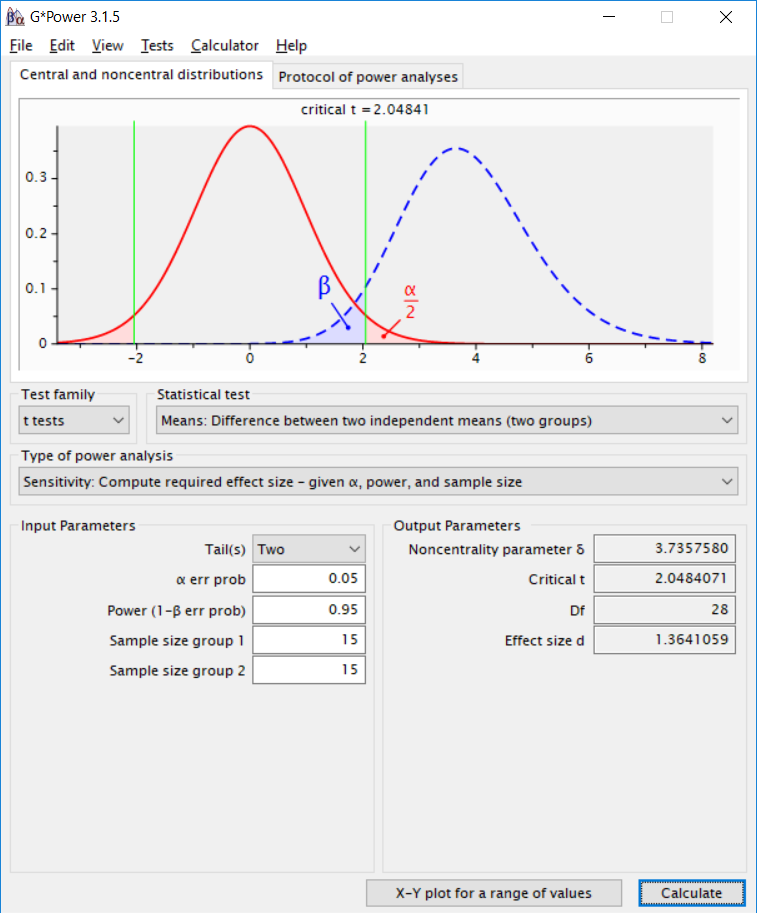
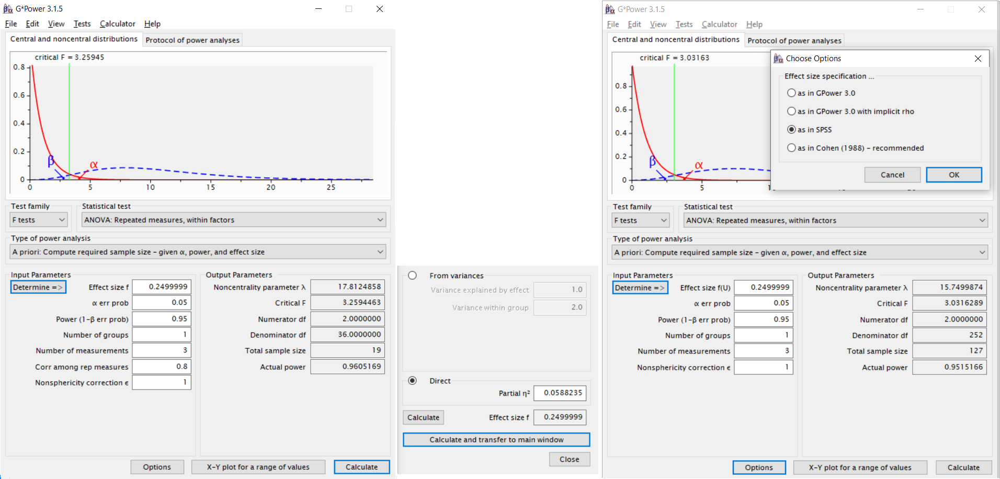

--- 
knit: "bookdown::preview_chapter"
editor_options: 
  chunk_output_type: console
---

```{r, include = FALSE}
library(tidyverse)
library(gridExtra)
library(kableExtra)
library(ggrepel)
library(grid)
library(magrittr)
library(kableExtra)
library(tidyverse)
library(pwr)
library(Superpower)
library(ggplot2)
library(patchwork)
library(MASS)
library(viridis)
library(TOSTER)
library(BEST)
library(metafor)
library(MOTE)
library(binom)
library(MASS)
library(BUCSS)
knitr::opts_chunk$set(error = FALSE, warning = FALSE, message = FALSE)
```

# Sample size justification {#power}

When you perform an experiment, you want it to provide an answer to your research question that is as informative as possible. However, since all scientists are faced with resource limitations, you need to balance the cost of collecting each additional datapoint against the increase in information that datapoint provides. In economics, this is known as the Value of Information [@eckermann_value_2010]. Calculating the value of information is notoriously difficult. You need to specify the costs and benefits of possible outcomes of the study, and quantifying a utility function for scientific research is not easy. 

Because of the difficulty of quantifying the value of information, scientists use less formal approaches to justify the amount of data they set out to collect. That is, if they provide a justification for the number of observations to begin with. Even though in some fields a justification for the number of observations is required when submitting a grant proposal to a science funder, a research proposal to an ethical review board, or a manuscript for submission to a journal. In some research fields, the number of observations is *stated*, but not *justified*. This makes it difficult to evaluate how informative the study was. Referees can't just assume the number of observations is sufficient to provide an informative answer to your research question, so leaving out a justification for the number of observations is not best practice, and a reason reviewers can criticize your submitted article.

Researchers often find it difficult to justify their sample size, and a simple and efficient alternative is to only specify a maximum sample size, and analyse results as data comes in using [sequential analyses](#sequential) instead. Below, several possible justifications to decide upon a specific sample size when designing an experiment are discussed. 

```{r table-pow-just, echo = FALSE}

table_pow_justifications <- data.frame(c(
  "Measure the entire population", 
  "Feasibility", 
  "Accuracy", 
  "A-priori power analysis", 
  "Heuristics", 
  "No justification"), 
  c("You can specify the entire population, it is finite, and you are able to measure every entity in the population.", 
    "Limited resources are the primary reason for your choice of the sample size you can collect.", 
    "Your research question focusses on the size of a parameter, and you plan to collect sufficient data to have an estimate with a desired level of accuracy.", 
    "Your research question focusses on rejecting certain effect sizes (e.g., effects ≤ 0 in a directional NHST) and you want to achieve a desired probability of a correct rejection.", 
    "You rely on a benchmark, heuristic, general rule, or other convention that is either described in the literature or communicated orally.",
    "You do not have any reason to choose a specific sample size, and you are simply collecting some data that seems sufficient to increase your understanding of the topic you are studying."))

colnames(table_pow_justifications) <- c("Type of Justification", "In which situations is this justification relevant?")

knitr::kable(table_pow_justifications, caption = "Overview of recommendations when reporting an a-prior power analysis.")
```

All of these sample size justification, even the 'no justification' category, are valid justifications in the sense that they give others insight into the underlying reasons that lead to your decision for a sample size in your study. However, it should not be surprising that the 'heuristics' and 'no justification' categories are unlikely to impress other scholars. What is perhaps more surprising is that, except for measuring the entire population, the other justifications might also not impress other scholars. The extent to which these justifications make other researchers judge the data you have collected as *informative* depends on the details of the question you aimed to answer, and the parameters you choose when determining the sample size for your study. 

## Measuring the Entire Population

In some instances it might be possible to collect data from the entire population under examination. For example, you might be interested in the average amount of time people spend on the moon, whenever they visit it. Since there are only 12 people who have ever been on the moon, we can calculate the average time people have spent on the moon by collecting data from the entire population. Whenever it is possible to measure the entire population, the justification for the sample size is that you collected all the data that is available. This is the simplest, and most straightforward, justification for the sample size. However, it is also quite rare that we are able to measure the entire population.

The the entire population is measured, there is no need to perform a hypothesis test. After all, there is no population to generalize to, and any differences between two populations are, except for the possibility of measurement inaccuracy, true differences. In these cases, the question whether there is a true difference, or if the difference is noise becomes uninteresting, and we should mainly be interested in whether the observed difference is large enough to be meaningful. 

If we have sampled the entire population, the mean is measured with absolute precision, and there is no confidence interval. If the total population size is known, but not measured completely, then the confidence interval width interval should shrink to zero the closer we get to measuring the entire population. This is known as the **finite population correction factor** for the variance of the estimator [@thompson_sampling_2012]. The variance of a sample mean is $\frac{\sigma^2}{n}$, and the finite population correction factor is $1 - \frac{n}{N}$. When N is massively larger than n, the correction factor will be close to 1, and not have a noticeable effect on the variance. However, is the total population is measured, the correction factor is 0. The `superb` R package can compute population corrected confidence intervals [@cousineau_superb_2019]. 

## Feasibility

A common reason why a specific number of observations is collected is because collecting more data was not feasible. Note that all decisions for the sample size we collect in a study are based on the resources we have available in some way. A **feasibility justification** makes these resource limitations the primary reason for the sample size that is collected. Because we always have resource limitations in science, even when feasibility is not our primary justification for the number of observations we plan to collect, it is always a secondary reason. Despite the omnipresence of resource limitations, the topic often receives very little attention in texts on experimental design. This might make it feel like a feasibility justification is not appropriate, and you should perform an a-priori power analysis or plan for a desired precision instead. But feasibility always plays a secondary role, and therefore regardless of which justification for the sample size you provide, you will almost always need to include a feasibility justification as well.

Time and money are the two main resource limitations a scientist faces. Our master students write their thesis in 6 months, and therefore their data collection is necessarily limited in whatever can be collected in 6 months, minus the time needed to formulate a research question, design an experiment, analyze the data, and write up the thesis. A PhD student at our department would have 4 years to complete their thesis, but is also expected to complete multiple research lines in this time. In addition to limitations on time, we have limited financial resources. Although nowadays it is possible to collect data online quickly, if you offer participants a decent pay (as you should) most researchers do not have the financial means to collect thousands of datapoints.

A feasibility justification puts the limited resources at the center of the justification for the sample size that will be collected. For example, one might argue that 120 observations is the most that can be collected in the three weeks a master student has available to collect data, when each observation takes an hour to collect. A PhD student might collect data until the end of the academic year, and then needs to write up the results over the summer to stay on track to complete the thesis in time.

A feasibility justification thus *starts* with the expected number of observations (N) that a researcher expects to be able to collect. The challenge is to evaluate whether collecting N observations is worthwhile. The answer should sometimes be that data collection is *not* worthwhile. For example, assume I plan to manipulate the mood of participants using funny cartoons and then measure the effect of mood on some dependent variable - say the amount of money people donate to charity. I should expect an effect size around d = 0.31 for the mood manipulation [@joseph_manipulation_2020], and seems unlikely that the effect on donations will be larger than the effect size of the manipulation. If I can only collect mood data from 30 participants in total, how do we decide if this study will be informative?

If we want to evaluate whether the feasibility limitations make data collection uninformative, we need to think about what the goal of data collection is. First of all, having data always provide more knowledge than not having data, so in an absolute sense, all additional data that is collected is better than not collecting data. However, in line with the idea that we need to take into account costs and benefits, it is possible that the cost of data collection outweighs the benefits. To determine this, one needs to think about what the benefits of having the data are. The benefits are clearest when we know for certain that someone is going to make a decision, with or without data. If this is the case, then any data you collect will reduce the error rates of a well-calibrated decision process, even if only ever so slightly. In these cases, the value of information might be positive, as long as the reduction in error rates is more beneficial than the costs of data collection. If your sample size is limited and you know you will make a decision anyway, perform a [compromise power analysis](#compromisepower), where you balance the error rates, given a specified effect size and sample size.

Another way in which a small dataset can be valuable is if its existence makes it possible to combine several small datasets into a meta-analysis. This argument in favor of collecting a small dataset requires 1) that you share the results in a way that a future meta-analyst can find them, and 2) that there is a decent probability that someone will perform a meta-analysis in the future which inclusion criteria would contain your study, because a sufficient number of small studies exist. The uncertainty about whether there will ever be such a meta-analysis should be weighed against the costs of data collection. One way to increase the probability of a future meta-analysis is if you commit to performing this yourself in the future. For example, you might plan to repeat a study for the next 12 years in a class you teach, with the expectation that a meta-analysis of 360 participants would be sufficient to achieve around 90% power for d = 0.31. If it is not plausible you will collect all the required data by yourself, you can attempt to set up a collaboration, where fellow researchers in your field commit to collecting similar data, with identical measures, over the next years. If it is not likely sufficient data will emerge over time, we will not be able to draw informative conclusions from the data, and it might be more beneficial to not collect the data to begin with, and examine an alternative research question with a larger effect size instead.

Even if you believe over time sufficient data will emerge, you will most likely compute statistics after collecting a small sample size. Before embarking on a study where your main justification for the sample size is based on feasibility, you can expect. I propose that a feasibility justification for the sample size is always accompanied by three statistics, detailed in the following three sections.

### The smallest effect size that can be statistically significant

In Figure \@ref(fig:power-effect1) the distribution of Cohen’s d given 15 participants per group is plotted when the true effect size is 0 (or the null-hypothesis is true), and when the true effect size is d = 0.5. The blue area is the Type 2 error rate (the probability of not finding p < α, when there is a true effect, and α = 0.05). 1 - Type 2 error is the **statistical power**, or the probability of a test to yield a statistically significant result if the alternative hypothesis is true [@aberson_applied_2019; @cohen_statistical_1988]. Power depends on the Type 1 error rate (α), the true effect size in the population, and the number of observations. 

```{r, power-effect1, fig.margin=FALSE, echo=FALSE, fig.cap="Null and alternative distribution, assuming d = 0.5, alpha = 0.05, and N = 15 per group."}
N <- 15
d <- 0.5
p_upper <- 0.05
ncp <- (d * sqrt(N / 2)) # Calculate non-centrality parameter d
crit_d <- abs(qt(p_upper / 2, (N * 2) - 2)) / sqrt(N / 2)
low_x <- min(-1 - crit_d)
high_x <- max(d + 1 + crit_d)
# calc d-distribution
x <- seq(low_x, high_x, length = 10000) # create x values
d_dist <- dt(x * sqrt(N / 2), df = (N * 2) - 2, ncp = ncp) * sqrt(N / 2) # calculate distribution of d based on t-distribution
# Set max Y for graph
y_max <- max(d_dist) + 1
# create plot
par(bg = "aliceblue")
d <- round(d, 2)
plot(-10, xlim = c(low_x, high_x), ylim = c(0, y_max), xlab = substitute(paste("Cohen's ", delta == 0.5)), ylab = "Density", main = substitute(paste("Distribution of Cohen's ", delta == 0.5, ", N = 15 per group")))
# abline(v = seq(low_x,high_x,0.1), h = seq(0,0.5,0.1), col = "lightgray", lty = 1)
#    axis(side = 1, at = seq(low_x,high_x,0.1), labels = FALSE)
lines(x, d_dist, col = "black", type = "l", lwd = 2)
# add d = 0 line
d_dist <- dt(x * sqrt(N / 2), df = (N * 2) - 2, ncp = 0) * sqrt(N / 2)
lines(x, d_dist, col = "grey", type = "l", lwd = 1)
# Add Type 1 error rate right
crit_d <- abs(qt(p_upper / 2, (N * 2) - 2)) / sqrt(N / 2)
y <- seq(crit_d, 10, length = 10000)
z <- (dt(y * sqrt(N / 2), df = (N * 2) - 2) * sqrt(N / 2)) # determine upperbounds polygon
polygon(c(crit_d, y, 10), c(0, z, 0), col = rgb(1, 0, 0, 0.5))
# Add Type 1 error rate left
crit_d <- -abs(qt(p_upper / 2, (N * 2) - 2)) / sqrt(N / 2)
y <- seq(-10, crit_d, length = 10000)
z <- (dt(y * sqrt(N / 2), df = (N * 2) - 2) * sqrt(N / 2)) # determine upperbounds polygon
polygon(c(y, crit_d, crit_d), c(z, 0, 0), col = rgb(1, 0, 0, 0.5))
# Add Type 2 error rate
crit_d <- abs(qt(p_upper / 2, (N * 2) - 2)) / sqrt(N / 2)
y <- seq(-10, crit_d, length = 10000)
z <- (dt(y * sqrt(N / 2), df = (N * 2) - 2, ncp = ncp) * sqrt(N / 2)) # determine upperbounds polygon
polygon(c(y, crit_d, crit_d), c(0, z, 0), col = rgb(0, 0, 1, 0.5))
segments(crit_d, 0, crit_d, y_max - 0.8, col = "black", lwd = 2)
text(crit_d, y_max - 0.5, paste("Effects larger than d = ", round(crit_d, 2), "will be statistically significant"), cex = 1)
```

Because the true effect size is typically unknown, it makes most sense to speak about the power function. In Figure \@ref(fig:power-1) you see a power curve for an independent *t*-test, with an alpha level of 0.05. We see that as the effect size (in Cohen's d) increases, power increases. If the effect you study has an effect size of 0.5, you would have almost 70% power with 50 observations in each independent group (indicated by the red dot). If the true effect size is smaller, power is lower, and as the effect size is larger, power is larger.

```{r, power-1, fig.margin=FALSE, echo=FALSE, fig.cap="Power curve for an independent *t*-test as a function of the true effect size."}
N <- 50
d <- 0.5
p_upper <- 0.05
ncp <- (d * sqrt(N / 2)) # Calculate non-centrality parameter d
plot_power_d <- (function(d, N, p_upper) {
  ncp <- d * (N * N / (N + N))^0.5 # formula to calculate t from d from Dunlap, Cortina, Vaslow, & Burke, 1996, Appendix B
  t <- qt(1 - (p_upper / 2), df = (N * 2) - 2)
  1 - (pt(t, df = N * 2 - 2, ncp = ncp) - pt(-t, df = N * 2 - 2, ncp = ncp))
})
par(bg = "aliceblue")
plot(-10,
  xlab = expression(paste("Cohen's ", delta)), ylab = "Power", axes = FALSE,
  main = substitute(paste("Power for independent t-test with N = 50 per group")), xlim = c(0, 2), ylim = c(0, 1)
)
abline(v = seq(0, 2, 0.2), h = seq(0, 1, 0.1), col = "lightgray", lty = 1)
axis(side = 1, at = seq(0, 2, 0.2), labels = seq(0, 2, 0.2))
axis(side = 2, at = seq(0, 1, 0.2), labels = seq(0, 1, 0.2))
curve(plot_power_d(d = x, N = N, p_upper = p_upper), 0, 2, type = "l", lty = 1, lwd = 2, ylim = c(0, 1), xlim = c(0, 2), add = TRUE)
points(x = d, y = (1 + pt(qt(p_upper / 2, 2 * N - 2, 0), 2 * N - 2, ncp) - pt(qt(1 - p_upper / 2, 2 * N - 2, 0), 2 * N - 2, ncp)), cex = 2, pch = 19, col = rgb(1, 0, 0, 0.5))

```

**Power analysis** is the practice of computing the effect size, desired power, sample size, or alpha level from the other three values. Computing the required sample size is commonly referred to as **a-priori** power analysis, computing the smallest effect size you have the desired power for is called **sensitivity** power analysis, computing the alpha level is called **criterion** power analysis, and computing the achieved power is called **post-hoc** power analysis.

You might seen graphs like Figure \@ref(fig:power-effect1) before. The only thing I have done is to transform the *t*-value distribution that is commonly used in these graphs, and calculated the distribution for Cohen’s d. This is a straightforward transformation, but instead of presenting the critical *t*-value the figure provides the critical *d*-value. For a two-sided independent *t*-test, this is calculated as: 

```{r, eval = FALSE}
qt(1-(a / 2), (n1 + n2) - 2) * sqrt(1/n1 + 1/n2)
```

where 'a' is the alpha level (e.g., 0.05) and N is the sample size in each independent group. For the example above, where alpha is 0.05 and n = 15: 

```{r, eval = TRUE}
qt(1-(0.05 / 2), (15 * 2) - 2) * sqrt(1/15 + 1/15)
```

The critical *t*-value (2.0484071) is also provided in commonly used power analysis software such as G\*Power. We can compute the critical Cohen's d from the *t*-value and sample size using: $d = t{\sqrt{1/n_1 + 1/n_2}}$.

```{r gcrit1, fig.margin=FALSE, echo=FALSE, fig.cap="The critical *t*-value is provided by G\\*Power software."}

```

When you will test an association between variables with a correlation, G\*Power will directly provide you with the critical effect size. When you compute a correlation based on a two-sided test, your alpha level is 0.05, and you have 30 observations, only effects larger than r = 0.361 will be statistically significant. In other words, the effect needs to be quite large to even have the mathematical possibility of becoming statistically significant.

```{r gcrit2, fig.margin=FALSE, echo=FALSE, fig.cap="The critical r is provided by G\\*Power software."}
knitr::include_graphics("images/gpowcrit2.png")
```

The critical effect size gives you information about the smallest effect size that, if observed, would by statistically significant. If you observe a smaller effect size, the *p*-value will be larger than your significance threshold. You always have some probability of observing effects larger than the critical effect size. After all, even if the null hypothesis is true, 5% of your tests will yield a significant effect. But what you should ask yourself is whether the effect sizes that could be statistically significant are realistically what you would expect to find. If this is not the case, it should be clear that there is little (if any) use in performing a significance test. Mathematically, when the critical effect size is larger than effects you expect, your statistical power will be less than 50% (see the section on [observed power](#observedpower)). If you perform a statistical test with less than 50% power, your single study is not very informative. Reporting the critical effect size in a feasibility justification should make you reflect on whether a hypothesis test will yield an informative answer to your research question.

### Compute the width of the confidence interval around the effect size

The second statistic to report alongside a feasibility justification is the width of the 95% confidence interval around the effect size. As we saw in the section on [confidence intervals](#confint) they represent a range that is wide enough so that in the long run in 95% of repetitions of the same experiment the true population parameter falls within each confidence interval calculated around the observed effect size. Cumming -@cumming_understanding_2013 calls the difference between the observed effect size and the upper 95% confidence interval (or the lower 95% confidence interval) the margin of error (MOE).

```{r MOTE-CI-1, echo = TRUE}
# Compute the effect size d and 95% CI
res <- d.ind.t(m1 = 0, m2 = 0, sd1 = 1, sd2 = 1, n1 = 15, n2 = 15, a = .05)
# Print the result
res$estimate
# Compute the average Margin of Error (MOE)
(res$dhigh - res$dlow)/2
# For non-zero effects the CI is based on the non-central t
# The MOE is then asymmetric (but differences are very small)
(res$d - res$dlow)
(res$dhigh - res$d)

```

If we compute the 95% CI for an effect size of 0, we see that with 15 observations in each condition of an independent *t*-test the 95% CI ranges from -0.72 to 0.72. The MOE is half the width of the 95% CI, 0.72. This clearly shows we have a very imprecise estimate. A Bayesian estimator who uses an uninformative prior would compute a credible interval with the same upper and lower bound [@albers_credible_2018], and might conclude they personally believe there is a 95% chance the true effect size lies in this interval. A frequentist would reason more hypothetically: If the observed effect size in the data I plan to collect is 0, I could only reject effects more extreme than d = 0.72 in an equivalence test with a 5% alpha level (even though if such a test would be performed, power might be low, depending on the true effect size). Regardless of the statistical philosophy you plan to rely on when analyzing the data, our evaluation of what we can conclude based on the width of our interval tells us we will not learn a lot. Effect sizes in the range of d = 0.7 are findings such as "People become aggressive when they are provoked", "People prefer their own group to other groups", and "Romantic partners resemble one another in physical attractiveness" [@richard_one_2003]. The width of the confidence interval tells you that you can only reject the presence of effects that are so large, if they existed, you would probably already have noticed them. It might still be important to establish these large effects in a well-controlled experiment. But since most effect sizes in we should realistically expect are much smaller, we do not learn something we didn't already know from the data that plan to collect. Even without data, we would exclude effects larger than d = 0.7 in most research lines.  

We see this the MOE is almost, but not exactly, the same as the critical effect size d we observed above (d = 0.7479725). The reason for this is that the 95% confidence interval is calculated based on the *t*distribution. If the true effect size is not zero, the confidence interval is calculated based on the non-central *t*distribution, and the 95% CI is asymmetric. Figure \@ref(fig:noncentralt) vizualizes three *t*-distributions, one symmetric at 0, and two asymmetric distributions with a noncentrality parameter of 2 and 3. The asymmetry is most clearly visible in very small samples (the distribution in the plot have 5 degrees of freedom) but remain noticeable when calculating confidence intervals and statistical power. For example, for a true effect size of d = 0.5 the 95% CI is $d_s$ = 0.50, 95\\% CI [-0.23, 1.22]. The MOE based on the lower bound is 0.7317584 and based on the upper bound is 0.7231479. If we compute the 95% CI around the critical effect size (d = 0.7479725) we see the 95% CI ranges from exactly 0.00 to 1.48. As explained in the section on the relation between a [confidence interval and a *p*-value](#relatCIp), if the 95% CI excludes zero, the test is statistically significant. In this case the lowerbound of the confidence interval exactly touches 0, which means we would observe a *p* = 0.05 if we exactly observed the critical effect size.

```{r noncentralt, fig.margin = FALSE, echo = FALSE, fig.cap="Central (black) and 2 non-central (red and blue) *t*-distributions."}
x <- seq(-12, 12, length = 10000)
y <- dt(x, df = 5, 0)
plot(x, y, type = "l", col = "black", lwd = 3, xlab = "t", ylab = "", main = "Central and non-central t-distributions")
lines(x, dt(x, df = 5, 2), col = "#E69F00", type = "l", lwd = 3)
lines(x, dt(x, df = 5, 3), col = "#56B4E9", type = "l", lwd = 3)
legend(-12, 0.38, # places a legend at the appropriate place
       c("t(5, ncp = 0)", "t(5, ncp = 2)", "t(5, ncp = 3)"), # puts text in the legend
       lty = c(1, 1), # gives the legend appropriate symbols (lines)
       lwd = c(2.5, 2.5, 2.5), col = c("black", "#E69F00", "#56B4E9")
) # format lines and colors
```

Where computing the critical effect size can make it clear that a *p*-value is of little interest, computing the 95% CI around the effect size can make it clear that the effect size estimate is of little value. It will often be so uncertain, and the range of effect sizes you will not be able to reject if there is no effect is so large, the effect size estimate is not very useful. This is also the reason why performing a pilot study to estimate an effect size for an a-priori power analysis is not a sensible strategy [@albers_when_2018; @leon_role_2011]. However, it is possible that the sample size is large enough to exclude some effect sizes that are still a-priori plausible. For example, with 50 observations in each independent group, you have 82% [power for an equivalence test](#powerequiv) with bounds of -0.6 and 0.6, and if effect larger than 0.6 can be rejected, this might be sufficient to tentatively start to question claims of even larger effects in the literature.

### Plot a sensitivity power analysis {#sensitivitypower}

In a **sensitivity power analysis** the sample size and the alpha level are fixed, and you compute the effect size you have the desired statistical power to detect. For example, in Figure \@ref(fig:gsens0) the sample size in each group is set to 15, the alpha level is 0.05, and the desired power is set to 90%. The sensitivity power analysis shows we have 90% power to detect an effect of d = 1.23. 

```{r gsens0, fig.margin=FALSE, echo=FALSE, fig.cap="Sensitivity power analysis in G\\*Power software."}
knitr::include_graphics("images/sensitivity0.png")
```

Perhaps you feel a power of 90% is a bit high, and you would be happy with 80% power. We can plot a sensitivity curve across all possible levels of statistical power. In Figure \@ref(fig:gsens1) we see that if we desire 80% power, the effect size should be d = 1.06. The smaller the true effect size, the lower the power we have. This plot should again remind us not to put too much faith in a significance test when are sample size is small, since for 15 observations in each condition, statistical power is very low for anything but extremely large effect sizes.

```{r gsens1, fig.margin=FALSE, echo=FALSE, fig.cap="Plot of the effect size against the desired power when n = 15 per group and alpha = 0.05."}
knitr::include_graphics("images/sensitivity1.png")
```

If we look at the effect size that we would have 50% power for, we see it is d = 0.7411272. This is very close to our critical effect size of d = 0.7479725 (the smallest effect size that, if observed, would be significant). The difference is due to the non-central *t*-distribution (see Figure \@ref(fig:noncentralt). If the distribution was symmetric, observing an effect size exactly on the critical value would mean half of the distribution is smaller than the critical effect size, and half of the distribution is larger, and we would have exactly 50% power for the critical effect size. Because the distribution is not symmetrical, we need to find the critical effect size for which it *is* true that half the distribution falls below it, and half the distribution falls above it. This value can't be calculated directly, and requires an iterative procedure that optimizes the values of the non-centrality parameter such that power is exactly 50% [@smithson_confidence_2003]. The `pwr` package in R can calculate this effect size in a sensitivity analysis where we enter the sample size (per group), the alpha level, and the desired power for a two-sided independent *t*-test, which will return d = 0.7411272. We can check this true effect size would indeed give with 50% power.

```{r, echo = TRUE}
# Sensitivity power analysis
pwr::pwr.t.test(n = 15, 
                sig.level = 0.05, 
                power = 0.5, 
                type = "two.sample",
                alternative = "two.sided")

# d = 0.7411272 - let's check this indeed gives 50% power
# We compute the non-centrality parameter delta as 2.0296604
# delta <- 0.7411272 * sqrt(15/2)

# For a 2-sided test power is the probability of finding a result that is
# 1) larger than the critical value of 2.0484071, which is: 0.4999563
# 2) We need to add the tiny probability that we find a significant result in
# the opposite direction. This will rarely happen: 0.00004372648
# Together these two probabilities make exactly 50%:
# 1-pt(2.0484071, 28, 2.0296604) + pt(-2.0484071, 28, 2.0296604)
```

### Reporting a feasibility justification.

To summarize, I recommend addressing the following components in a feasibility sample size justification. Addressing these points explicitly will allow you to evaluate for yourself if collecting the data will have scientific value. If not, there might be other reasons to collect the data. For example, at our department, students often collect data as part of their education. However, if the primary goal of data collection is educational, the sample size that is collected can be very small. It is often educational to collect data from a small number of participants to experience what data collection looks like in practice, but there is often no educational value in collecting data from more than 10 participants. Despite the small sample size, we often require students to report statistical analyses as part of their education, which is fine as long as it is clear the numbers that are calculated can not meaningfully be interpreted. Table \@ref(tab:table-pow-rec) should help to evaluate if the interpretation of statistical tests has any value, or not.

```{r table-pow-rec, echo = FALSE}

table_pow_rec <- data.frame(c("Will a future meta-analysis be performed?", "Will a decision be made, regardless of the amount of data that is available?", "What is the critical effect size?", "What is the width of the confidence interval?", "Which effect sizes would you have decent power to detect?"), c("Consider the plausibility that sufficient highly similar studies will be performed in the future to, eventually, make a meta-analysis possible", "If it is known that a decision will be made, with or without data, then any data you collect will reduce error rates.", "Report and interpret the critical effect size, with a focus on whether a hypothesis test would even be significant for expected effect sizes. If not, indicate you will not interpret the data based on *p*-values.", "Report and interpret the width of the confidence interval. What will an estimate with this much uncertainty be useful for? If the null hypothesis is true, would rejecting effects outside of the confidence interval be worthwhile (ignoring you might have low power to actually test against these values)?", "Report a sensitivity power analysis, and report the effect sizes you could detect across a range of desired power levels (e.g., 80%, 90%, and 95%), or plot a sensitivity curve of effect sizes against desired power."))
colnames(table_pow_rec) <- c("What to address", "Example?")

knitr::kable(table_pow_rec, caption = "Overview of recommendations when reporting a sample size justification based on feasibility.")
```

If the study is not performed for educational purposes, but the goal is answer a research question, the feasibility justification might indicate that there is no value in collecting the data. If it wasn't possible to conclude that one should not proceed with the data collection, there is no use of justifying the sample size. There should be cases where it is unlikely there will ever be enough data to perform a meta-analysis (for example because of a lack of general interest in the topic), the information will not be used to make any decisions, and the statistical tests do not allow you to test a hypothesis or estimate an effect size estimate with any useful accuracy. It should be a feasibility justification - not a feasibility excuse. If there is no good justification to collect the maximum number of observations that is feasible, performing the study nevertheless is a waste of participants time, and/or a waste of money if data collection has associated costs. Collecting data without a good justification why the planned sample size will yield worthwhile information has an ethical component. As Button and colleagues @button_power_2013 write: 

>Low power therefore has an ethical dimension — unreliable research is inefficient and wasteful. This applies to both human and animal research. 

Think carefully if you can defend data collection based on a feasibility justification. Sometimes data collection is just not feasible, and we should accept this.

## A-priori power analysis

When designing a study where the goal is to observe a statistically significant effect, researchers often want to make sure their sample size is large enough to have sufficient power to detect effects they expect, or effects they are interested in observing. This is done by performing an *a-priori* power analysis. Given a specified effect size, alpha level, and desired power, an a-priori power analysis will inform you about the sample size you need to collect. In Figure \@ref(fig:power-2) you see how the statistical power increases as the number of observations (per group) in an independent *t*-test with an alpha level of 0.05 increases.

It is important to highlight what the goal of a power analysis is, and what isn't the goal. The goal of an a-priori power analysis is not to achieve sufficient power for the true effect size. The true effect size is unknown. **The goal of an a-priori power analysis to achieve sufficient power given a specific assumption of the true effect size**. Researchers often complain that a-priori power analysis is impossible given uncertainty about the true effect size. But when we design a study, we are uncertain about many things. We are not sure our data will be normally distributed, whether there will be a floor or ceiling effect, whether our manipulation works in a specific population, or whether our theory is true. We design studies based on assumptions. If our assumptions are wrong, we learn from our data.

This goal of a-priori power analysis is perhaps best illustrated by the useful recommendation to make sure your study is well powered to demonstrate the presence, [and the absence](#powerforabsence), of an effect. For example, you might want to perform an a-priori power analysis for an equivalence test that has has sufficient power to reject an effect size observed in an earlier study using the [small telescopes approach](#smalltelescopes), while also having sufficient power for a smallest effect size that would theoretically be predicted. We compute power, assuming either of these two effect sizes are the true effect size, and aim to collect the largest sample size that either of these analyses indicate. This does not guarantee we have sufficient power for the true effect size - it simply means we have sufficient power given an assumption of what the true effect size might be. After collecting the data, we draw inferences about what we have learn, under the assumption of a true effect of a specific size. We do not draw conclusions about the (always unknown) 'true' effect size. Therefore, an a-priori power analysis is useful, as long as we have interesting assumptions about what effect sizes we might be interested in.  

```{r, power-2, fig.margin=FALSE, echo=FALSE, fig.cap="Power curve for an independent *t*-test as a function of the sample size."}
N <- 50
d <- 0.5
p_upper <- 0.05
ncp <- (d * sqrt(N / 2)) # Calculate non-centrality parameter d
plot_power_custom <- (function(d, N, p_upper) {
  ncp <- d * (N * N / (N + N))^0.5 # formula to calculate t from d from Dunlap, Cortina, Vaslow, & Burke, 1996, Appendix B
  t <- qt(1 - (p_upper / 2), df = (N * 2) - 2)
  1 - (pt(t, df = N * 2 - 2, ncp = ncp) - pt(-t, df = N * 2 - 2, ncp = ncp))
})
par(bg = "aliceblue")
plot(-10,
  xlab = "sample size (per group)", ylab = "Power", axes = FALSE,
  main = expression(paste("Power for independent t-test and ", delta, " = ", 0.5)), xlim = c(0, N * 2), ylim = c(0, 1)
)
abline(v = seq(0, N * 2, (2 * N) / 10), h = seq(0, 1, 0.1), col = "lightgray", lty = 1)
axis(side = 1, at = seq(0, 2 * N, (2 * N) / 10), labels = seq(0, 2 * N, (2 * N) / 10))
axis(side = 2, at = seq(0, 1, 0.2), labels = seq(0, 1, 0.2))
curve(plot_power_custom(d=d, N=x, p_upper=p_upper), 3, 2*N, type="l", lty=1, lwd=2, ylim=c(0,1), xlim=c(0,N), add=TRUE)
points(x = N, y = (1 + pt(qt(p_upper / 2, 2 * N - 2, 0), 2 * N - 2, ncp) - pt(qt(1 - p_upper / 2, 2 * N - 2, 0), 2 * N - 2, ncp)), cex = 2, pch = 19, col = rgb(1, 0, 0, 0.5))

```

A-priori power calculations are performed under the assumption that there is an effect. In practice, it is of course also possible that there is no effect (e.g., d = 0). If there is no true effect, and you want to use formally correct language, power is *undefined*. Statistical power is a concept that can only be computed assuming there is a true effect. If there is no true effect, you will still observe significant effects, but these ar *Type 1 errors*, or false positives. These occur at your chosen alpha level (e.g., 5% of the time). If you perform a hypothesis test, there are four possible outcomes:

1. False positives or Type 1 errors, indicated by α (you observe a significant test result when H0 is true)
2. False negatives or Type 2 errors, indicated by β (you observe a non-significant result when H1 is true)
3. True negatives, indicated by 1-α (a non-significant result when H0 is true) 
4. True positives, indicated by 1-β (a significant test result when H1 is true)

```{r NHST-outcomes, fig.margin=TRUE, echo=FALSE, fig.cap="Four possible outcomes in a null hypothesis significance test."}
knitr::include_graphics("images/2.1.1.png")
```

The goal of an a-priori power analysis is to increase the sample size up to the level that the desired power, the probability of finding a significant result if there is a true effect, or 1-β, is at a desired level for an effect size one is interested in detecting, given a specific alpha level.

In Figure \@ref(fig:power-3) you see two distributions. The left (grey) distribution is centered at 0. This is our model for the null hypothesis. If the null hypothesis is true we can find statistically significant results if the effect size is extreme enough (in a two-sided test either in the positive or negative direction), but these would be Type 1 errors (the red areas under the curve). 

The right (black) distribution is centered at an effect of d = 0.5. This is our model for the alternative hypothesis, where we expect a true effect in the population of d = 0.5. Even though there is a true effect, we will not always find a statistically significant result. This happens when, due to random variation, the observed effect size is too close to 0 to be statistically significant. These results would be false negative results (the blue area under the curve).

```{r, power-3, fig.margin=FALSE, echo=FALSE, fig.cap="Null and alternative distribution, assuming d = 0.5, alpha = 0.05, and N = 86 per group."}
N <- 86
d <- 0.5
p_upper <- 0.05
ncp <- (d * sqrt(N / 2)) # Calculate non-centrality parameter d
crit_d <- abs(qt(p_upper / 2, (N * 2) - 2)) / sqrt(N / 2)
low_x <- min(-1 - crit_d)
high_x <- max(d + 1 + crit_d)
# calc d-distribution
x <- seq(low_x, high_x, length = 10000) # create x values
d_dist <- dt(x * sqrt(N / 2), df = (N * 2) - 2, ncp = ncp) * sqrt(N / 2) # calculate distribution of d based on t-distribution
# Set max Y for graph
y_max <- max(d_dist) + 1
# create plot
par(bg = "aliceblue")
d <- round(d, 2)
plot(-10, xlim = c(low_x, high_x), ylim = c(0, y_max), xlab = substitute(paste("Cohen's ", delta == 0.5)), ylab = "Density", main = substitute(paste("Distribution of Cohen's ", delta == 0.5, ", N = 86 per group")))
# abline(v = seq(low_x,high_x,0.1), h = seq(0,0.5,0.1), col = "lightgray", lty = 1)
#    axis(side = 1, at = seq(low_x,high_x,0.1), labels = FALSE)
lines(x, d_dist, col = "black", type = "l", lwd = 2)
# add d = 0 line
d_dist <- dt(x * sqrt(N / 2), df = (N * 2) - 2, ncp = 0) * sqrt(N / 2)
lines(x, d_dist, col = "grey", type = "l", lwd = 1)
# Add Type 1 error rate right
crit_d <- abs(qt(p_upper / 2, (N * 2) - 2)) / sqrt(N / 2)
y <- seq(crit_d, 10, length = 10000)
z <- (dt(y * sqrt(N / 2), df = (N * 2) - 2) * sqrt(N / 2)) # determine upperbounds polygon
polygon(c(crit_d, y, 10), c(0, z, 0), col = rgb(1, 0, 0, 0.5))
# Add Type 1 error rate left
crit_d <- -abs(qt(p_upper / 2, (N * 2) - 2)) / sqrt(N / 2)
y <- seq(-10, crit_d, length = 10000)
z <- (dt(y * sqrt(N / 2), df = (N * 2) - 2) * sqrt(N / 2)) # determine upperbounds polygon
polygon(c(y, crit_d, crit_d), c(z, 0, 0), col = rgb(1, 0, 0, 0.5))
# Add Type 2 error rate
crit_d <- abs(qt(p_upper / 2, (N * 2) - 2)) / sqrt(N / 2)
y <- seq(-10, crit_d, length = 10000)
z <- (dt(y * sqrt(N / 2), df = (N * 2) - 2, ncp = ncp) * sqrt(N / 2)) # determine upperbounds polygon
polygon(c(y, crit_d, crit_d), c(0, z, 0), col = rgb(0, 0, 1, 0.5))

```

If we want to increase the statistical power, we are trying to reduce the size of the blue area. One way to do this would be to increase the effect size. This would shift the entire distribution to the right, and reduce the size of the blue area. Although there are ways in controlled experiments to increase the standardized effect size (e.g., by reducing statistical variation in the data), often the effect size is what it is. All we can do is increase the sample size. This will make the distribution around 0.5 more narrow, and this reduces the blue area. You can check this in an online shiny app that [reproduces the plot](http://shiny.ieis.tue.nl/d_p_power/).

### Performing a power analysis. 

There is a wide range of software tools that can help you to perform an a-priori power analysis. Sometimes statistical power can be analytically computed based on closed formulas, and in other situations power can be computed by performing simulations. If we simulate thousands of studies, and count the percentage of studies that are statistically significant, we have an estimate of the statistical power of the test. The code below computes the statistical power (using the `power.t.test` in base R) assuming an effect size of d = 0.5, and alpha level of 0.05, and a desired power of 90%. 

```{r, echo = TRUE}
power.t.test(delta = 0.5, 
             sig.level = 0.05,
             power = 0.9,
             type = "two.sample",
             alternative = "two.sided")
```

The output tells us we need to collect 85.03 observations. Because observations do not come in decimals (we can hardly cut 0.03 from a participant) we need to collect 86 observations. We could also get this answer through simulations. 

```{r, echo = TRUE, cache = TRUE}
set.seed(600746) #set a seed for reproducible simulations
p <- numeric(100000) #set up empty variable to store all simulated p-values

#Run simulation
for(i in 1:100000){ #for each simulated experiment
  x <- rnorm(n = 85, mean = 0, sd = 1) #Simulate data group 1
  y <- rnorm(n = 85, mean = 0.5, sd = 1) #Simulate data group 2
  z <- t.test(x, y) #perform the t-test
  p[i] <- z$p.value #get the p-value and store it
}

#Calculate power: sum significant p-values, divide by 100000 simulations
(sum(p < 0.05)/100000) #power
```

We see that after 100000 simulations with 85 participants, the estimated power is 0.90015 with 85 participants in each group. The analytic solution tells us power is 0.899894. The more simulations you perform, the more accurate the power estimate will be (as we see, 100000 simulations gives very accurate results).

The way you perform the power analysis depends on the software you use. There are excellent software packages for power analysis, such as [PASS](https://www.ncss.com/software/pass/) or [SAS](https://stats.idre.ucla.edu/sas/seminars/proc-power/), but these solutions are rather expensive. There are also freeware solutions, such as the widely used [G\*Power](https://gpower.hhu.de), [MorePower](https://wiki.usask.ca/pages/viewpageattachments.action?pageId=420413544) by Campbell and Thompson, and [PANGEA](https://jakewestfall.shinyapps.io/pangea/) by Jake Westfall. 
There is also a range of options in R. The default `stats` package has power functions for *t*-tests, proportions, and ANOVA, the `pwr` package has a wider range of options, `pwr2ppl` by Chris Aberson accompanies his excellent book on power analyses [@aberson_applied_2019], `powerlmm` by Kristoffer Magnusson performs power analyses for [two- and three-level linear mixed models](https://github.com/rpsychologist/powerlmm), and [Superpower](https://aaroncaldwell.us/SuperpowerBook/) created by Aaron Caldwell and myself does power analyses for complex ANOVA designs.

It takes time to learn to use this software correctly. You will need to sit down for a few hours and go through vignettes or read the accompanying publications, before you know what to do. In our online manual for Superpower, we compare Superpower against G\*Power, `pwr`, `pwr2ppl` and MorePower. Each software package will have slightly different design philosophies. In G\*Power you are expected to enter the standardized effect size d, while in MorePower we enter the mean difference and the standard deviation, and in Superpower we need to enter the means and standard deviations for each condition. In general I recommend to always think about the raw pattern of means you expect, before you perform a power analysis. This typically leads to more realistic effect sizes estimates than the use of standardized effect sizes (where researchers all too often 'expect' a d = 0.5 just because that is the default value in G\*Power).

```{r powerex1, fig.margin=FALSE, echo=FALSE, fig.cap="Example of a power analysis in G\\*Power."}
knitr::include_graphics("images/powerex1.png")
```

```{r powerex2, fig.margin=FALSE, echo=FALSE, fig.cap="Example of a power analysis in MorePower."}
knitr::include_graphics("images/powerex2.png")
```

```{r, echo = TRUE}
pwr::pwr.t.test(d = 0.5, 
                sig.level = 0.05,
                power = 0.8,
                type = "two.sample",
                alternative = "two.sided")
```

```{r, powerex3, fig.margin = FALSE, fig.cap="Example of a power analysis plot in Superpower.", echo = TRUE, cache = TRUE}

design_result <- Superpower::ANOVA_design(design = "2b",
                                          n = 86,
                                          mu = c(0.5, 0),
                                          sd = c(1, 1),
                                          plot = FALSE)

# Plot power curve (from 5 to 200)
Superpower::plot_power(design_result, max_n = 200, verbose = FALSE)

```

### Justifying the effect size used in an a-priori power analysis{#justifyeffectsize}

One challenge in power analysis is that you never know the true effect size. This leads to the ‘sample size samba’ [@schulz_sample_2005]. Researchers go back and forth between the effect size they expect, and the sample size they are willing to collect, until they 'expect' the effect size that, in an a-priori power analysis, leads to the sample size they are willing to collect. This practice obviously makes a power analysis a useless procedure. If you perform an a-priori power analysis, it is essential that you have a good justification for the effect size you rely on, or the result of the power analysis has no value.

#### Using a smallest effect size of interest

Best practice is to justify an a-priori power analysis based on a smallest effect size of interest. Because the population effect size is always uncertain (indeed, estimating this is typically one of the goals of the study) this means there is considerable uncertainty about the achieved power in any study (see Figure \@ref(fig:power-1)). However, there the smallest effect size of interest is not uncertain. A smallest effect of interest may be subjective (one researcher might find effect sizes smaller than d = 0.3 meaningless, while another researcher might still be interested in effects up to d = 0.1), but it does not have uncertainty. This means that if you enter it in an a-priori power analyses, you will be guaranteed to have the desired power (or higher power) for the smallest effect size you care about. The topic of how to justify a smallest effect size of interest is discussed in a [dedicated chapter](#sesoi).

#### Using an estimate of a meta-analysis

As we will see in the chapter on [bias](#bias) it is regrettably not true that effect size estimates from meta-analyses are always accurate. They can be biased, sometimes substantially so. Furthermore, meta-analyses typically have considerable [heterogeneity](#heterogeneity), which means that the meta-analytic effect size estimate differs for subsets of studies that make up the meta-analysis. So, although it might seem useful to enter a meta-analytic effect size estimate in your power analysis, you need to take great care before doing so. 

If you want to enter a meta-analytic effect size estimate in an a-priori power analysis, you need to consider three things. First, the studies included in the meta-analysis should be similar enough to the study you are performing that it is reasonable to expect a similar effect size. In essence, this requires evaluating the generalizability of the effect size estimate to your study. Carefully consider differences between the meta-analysed studies and your study, with respect to the manipulation, the measure, the population, and any other relevant variables. Second, check whether the effect sizes reported in the meta-analysis are homogeneous. If not, and there is considerable heterogeneity in the meta-analysis, it means not all included studies can be expected to have the same true effect size estimate. This is almost always true. Choose the meta-analytic estimate for the subset of studies that most closely represent your planned study (this is why it is important to make sure others can [reproduce your meta-analysis](#metareporting). Third, the meta-analytic effect size estimate should not be biased. Check the bias detection tests that are reported in the meta-analysis, and consider bias corrected effect size estimates (even though these estimates might still be biased, and not reflect the true population effect size).  

```{r tablemetajust, echo = FALSE}

table_meta_just <- data.frame(c(
  "Are the studies in the meta-analysis similar?",
  "Are the studies in the meta-analysis homogeneous?", 
  "Is the effect size estimate unbiased?"), 
  c("Are the studies in the meta-analyses very similar in design, measure, an population to the study you are planning? Evalaute the generalizability of the effect size estimate to your study.", 
    "Is there heterogeneity in the meta-analysis? If so, use the meta-analytic effect size estimate of the most relevant homogenous subsample.",
    "Did the original study report bias detection tests, and was there bias? If so, it might be wise to use a more conservative effect size estimate, based on bias correction techniques (e.g., PET-PEESE) while acknowledging these corrected effect size estimates might not represent the true meta-analytic effect size estimate."))

colnames(table_meta_just) <- c("What to take into account", "How to take it into account?")

knitr::kable(table_meta_just, caption = "Overview of recommendations when justifying the use of a meta-analytic effect size estimate for a power analysis.")
```

#### Using an estimate from a previous study

Statisticians have warned against using effect size estimates from small samples in power analyses. Leon, Davis, and Kraemer -@leon_role_2011 write: 

>Contrary to tradition, a pilot study does not provide a meaningful effect size estimate for planning subsequent studies due to the imprecision inherent in data from small samples.

The two main reasons researchers should be careful when using effect sizes from the published literature in power analyses is that effect size estimates from small studies are inaccurate, and that publication bias inflates effect sizes. Bias can even emerge when researchers do not take an effect size estimate from the literature, but perform the pilot study themselves, due to **follow-up bias** [@albers_when_2018]. Figure \@ref(fig:follow-up-bias) illustrates that for a 3 group ANOVA with 15 participants in each group, only effects with a partial eta squared larger than 0.133 will be statistically significant. But even if researchers are willing to follow up on smaller effect sizes, entering an effect size estimate of $\eta_p^2$ = 0.01 in an a-priori power analysis would require a total sample size of 957 observations for 80% power. If researchers only follow up on pilot studies when they leads to feasible sample sizes, their effect size estimates will be biased. 

```{r follow-up-bias, fig.margin = FALSE, fig.cap="Distribution of partial eta squared under H0 (grey curve) and a true effect of 0.0588 (black curve).", echo = FALSE, cache = TRUE}
N <- 15
J <- 3
eta_pop <- 0.0588
alpha_level <- 0.05
xmax <- 0.5
ymax <- 0.5

xmin <- -2
# Calculations
df1 <- J - 1
df2 <- J * (N - 1)
Ntot <- N * J
ncp <- Ntot / (1 / eta_pop - 1)
crit_f <- qf(1 - alpha_level, df1, df2)

x <- seq(xmin, xmax, length = 1000)
# F-value function
eta_pop_dist <- function(x) df((x * df2) / (df1 - x * df1), df1, df2, ncp)
par(bg = "aliceblue")
plot(-10,
  xlab = substitute(paste(eta[p]^2)), ylab = "Density", axes = FALSE,
  main = substitute(paste("distribution for ", eta[p]^2 == 0.0588, " for 3 groups and 50 observations per group.")), xlim = c(0, xmax), ylim = c(0, ymax)
)
axis(side = 1, at = seq(0, xmax, 0.1), labels = seq(0, xmax, 0.1))
axis(side = 2)
ncp <- 0
eta_pop_crit <- (crit_f * df1) / (crit_f * df1 + df2)

curve(eta_pop_dist, 0.00000000001, 1, n = 10000, col = "grey", lwd = 2, add = TRUE)
x <- seq(eta_pop_crit, xmax, length = 10000)
z <- df((x * df2) / (df1 - x * df1), df1, df2) # determine upperbounds polygon
polygon(c(eta_pop_crit, x, 1), c(0, z, 0), col = rgb(1, 0, 0, 0.5)) # draw polygon
# Add Type 2 error rate
ncp <- Ntot / (1 / eta_pop - 1)
curve(eta_pop_dist, 0.00000000001, 1, n = 10000, col = "black", lwd = 2, add = TRUE)
y <- seq(0.00000000001, eta_pop_crit, length = 10000)
z <- df((y * df2) / (df1 - y * df1), df1, df2, ncp) # determine upperbounds polygon
polygon(c(y, eta_pop_crit, eta_pop_crit), c(0, z, 0), col = rgb(0, 0, 1, 0.5))
segments(eta_pop_crit, 0, eta_pop_crit, ymax - 0.03, col = "black", lwd = 2)
text(eta_pop_crit, pos = 4, ymax - 0.02, paste("Effects observed in the sample that are larger than ", round(eta_pop_crit, 3), "will be statistically significant"), cex = 1)
```

In essence, the problem illustrated in Figure \@ref(fig:follow-up-bias) is that the effect sizes we end up using four our power analysis do not come from a full *f*-distribution, but that we ignore small effect sizes, and thus perform power analyses based on a **truncated *F*-distribution**.  It is possible to correct for bias, using some assumptions about bias. For example, imagine we observe a result in the literature for a One-Way ANOVA with 3 conditions, reported as *F*(2, 42) = 0.017, $\eta_p^2$ = 0.176. Taking this effect size at face value, entering it in an a-priori power analysis would suggest we need to collect 27 observations in each condition. However, using the `BUCSS` R package [@anderson_sample-size_2017], we can perform a power analysis that attempts to correct for bias.

```{r}
library(BUCSS)
ss.power.ba(
  F.observed = 4.5,
  N = 45,
  levels.A = 3,
  effect = c("factor.A"),
  alpha.prior = 0.05,
  alpha.planned = 0.05,
  assurance = 0.5,
  power = 0.8,
  step = 0.001
)
```

This analysis suggests collecting 73 participants in each condition, based on a bias corrected (under a specific model of publication bias assuming only significant effects ( with *p* < 0.05) being published) non-centrality parameter of 2.012. It is possible that the bias corrected non-centrality parameter is zero, in which case it is not possible to correct for bias (or the true effect size might be 0).

Instead of formally modeling a correction for publication bias, researchers can simply use a more conservative effect size estimate, for example by computing power based on the lower limit of 60% two-sided confidence interval around the effect size estimate [@perugini_safeguard_2014], which they refer to as **safeguard power**. 

Both these approaches lead to a more conservative power analysis, but not necessarily a more accurate power analysis. It is simply not possible to perform an accurate power analysis on the basis of an effect size estimate from a study that might be biased and had a small sample size. 

A sample size from a single study can be used if two conditions are met. First, there was a low risk of bias (e.g., the effect size estimate comes from a Registered Report, or from an analysis which results would not have impacted the likelihood of publication). Second, the sample size is large enough to yield relatively accurate effect size estimate, based on the width of a 95% CI around the observed effect size estimate. There is always uncertainty around the effect size estimate, and entering the upper and lower limit of the 95% CI around the effect size estimate might be educational about the consequences of the uncertainty that is present for an a-priori power analysis.

```{r table-es-just, echo = FALSE}

table_es_just <- data.frame(c(
  "Is there a risk of bias?",
  "How large is the uncertainty?"), 
  c("Evaluate the possibility that you would not have used, or had access to, the effect size estimate if had been smaller. Examine the difference when entering the reported, and a bias corrected, effect sizes estimate in a power analysis.", 
    "Studies with a small number of observations have large uncertainty. Consider the possibility of using a more conservative effect sizes estimate to reduce the possibility of an underpowered study for the true effect size (such as a safeguard power analysis)."))

colnames(table_es_just) <- c("What to take into account", "How to take it into account?")

knitr::kable(table_es_just, caption = "Overview of recommendations when justifying the use of an effect size estimate from a single study.")
```

#### Using a heuristic

The most commonly entered effect size estimate in an a-priori power analysis for an independent *t*-test is d = 0.5. The reason is that it is the default in G\*Power. It is also an effect size that Cohen -@cohen_statistical_1988 referred to as a 'medium' effect size, which seems less pretentious than expecting a 'large' effect size (d = 0.8) and leads to a required sample size that is substantially more manageable than when entering a 'small' effect size (d = 0.2). Cohen would probably not have chosen d = 0.5 as a default option for a power analysis tool designed for psychologists, as he wrote (1988, p. 13):

>Many effects sought in personality, social, and clinical-psychological research are likely to be small effects as here defined, both because of the attenutation in validity of the measures employed and the subtlety of the issues frequently involved.

The large variety in research topics in psychology means that any 'default' or 'heuristic' you use in an a-priori power analysis is wrong, and more importantly, it is likely to be more substantially wrong than using any of the other strategies outlines here. Cohen's benchmarks should not be used in a-priori power analysis [@correll_avoid_2020]. 

Some researchers have wondered what a better default would be, if researchers have no other basis to decide upon an effect size for an a-priori power analysis. For example, sometimes it is recommended to perform a power analysis based on an average effect size in psychology. For example, Brysbaert -@brysbaert_how_2019-1 recommends d = 0.4 as a default, which is approximately the average effect size in meta-meta-analyses, analysing effect sizes in entire scientific disciplines. However, such meta-analytic effect sizes estimated might be inflated due to publication bias, and there is huge heterogeneity in each field, so the average will often not be close to the effect size in the research line your are performing. As such, the use of such estimates is also not recommended. 

### Justifying the error rates used in an a-priori power analysis

TOO BE COMPLETED

### Some advice when using G\*Power

G\*Power is one of the most widely used software tools for power analysis [@bakker_recommendations_2020]. The option for power analysis for a Pearson's correlation coefficient is under the Exact test family (Correlation: Bivariate normal model). The "Correlation: Point biserial model" option under the *t*-tests family is for correlations where one variable is dichotomous. The difference is small, but the required sample size is typically a few observations larger for Pearson's correlation coefficient. 

```{r gpowcor, fig.margin=FALSE, echo=FALSE, fig.cap="The options for a power analysis for Pearson's correlation(above) and the point biserial correlation (when one variable is dichotomous)."}
knitr::include_graphics("images/gpowcor.png")
```

Although the effect size for an independent *t*-test and dependent *t*-test are often both referred to as Cohen's d, they differ, and are calculated in different ways. Cohen himself distinguished between $d_s$ and $d_z$ [@lakens_calculating_2013]. You should not enter Cohen's d for a power analysis for a dependent *t*-test (nor should you directly compared Cohen's d from a between design with Cohen's d for a within design, nor should you use the benchmarks Cohen provided for a small (0.2), medium (0.5), and large (0.8) effect be used for Cohen's $d_z$). Make sure you are entering the correct effect size. Cohen's $d_z$ can be calculated from the *t*-value for a dependent *t*-test and the sample size as follows: 

$$d_z = {\frac{t}{\sqrt{n}}} $$

```{r gpowdzd, fig.margin=FALSE, echo=FALSE, fig.cap="Power for a dependent and independent *t*-test require entering Cohen's dz and d, respectively."}
knitr::include_graphics("images/gpowdzd.png")
```

The third issue that researchers often miss is that G\*Power has a very unfortunate default setting for power analyses for within subject ANOVA tests. In Figure \@ref(fig:gpowdwithin2) we see on the left how we can directly calculate Cohen's $f$ (the effect size one needs to enter for ANOVA power analyses) from partial eta squared. A medium effect size for $\eta^2_p$ of 0.588 equals a Cohen's $f$ of 0.25. If we specify an expected correlation between dependent variables of 0.8, have 3 repeated measurements, one condition, and want to achieve 95% power with an alpha level of 0.05, we need a sample size of 19. However, if out value for $\eta^2_p$ comes from the scientific literature or statistical software such as SPSS, this effect size measure already has the correlation between observation incorporated. If we would simply enter it in G\*Power, we take into account the correlation twice, which leads to a massively smaller sample size. Instead, we need to click on the "Options" button and check the radiobutton before "As in SPSS". We see that "Effect size f" changes into "Effect size f(U)", and the box "Corr among rep measures" has disappeared on the right. This is because the correlation no longer needs to be entered separately - it is already taken into account in the $\eta^2_p$ as SPSS computes it. Most importantly, we now see that the sample size we need to achieve 95% power has changed to 127. This is a big difference, and I have seen people make this mistake very often. If you use G\*power for power analyses for ANOVA designs, I recommend always double checking the Options setting (and maybe repeat your analysis in software such as Superpower just to double check). 

```{r gpowdwithin2, fig.margin=FALSE, echo=FALSE, fig.cap="Power analysis for repeated ANOVA in G\\*Power by default expects a partial eta squared effect size that does not take the correlation between measurements into account."}

```

### A-priori power analysis for the absence of an effect {#powerforabsence}

It is 

### Reporting an a-priori power analysis.

As with all the analyses you rely on in your work, make sure the power analysis is computationally reproducible. If you performed power analyses in R, you can store the script. In G\*Power, you can save the several power analyses you performed consecutively in the app under the 'protocol of power analysis' tab by saving them as a .rtf file or printing them as a pdf file. 

```{r gpowprotocol, fig.margin = FALSE, echo = FALSE, fig.cap="G\\*Power allows you to easily save all details about the power analysis you performed."}
knitr::include_graphics("images/gpowprotocol.png")
```

If you use the [Superpower Shiny app](https://arcstats.io/shiny/anova-exact/) for more complex ANOVA designs, you can print a pdf file with all detailed about the power analysis you performed. Sharing the code or a printout of the power analysis will capture all required information about the power analysis you performed, which is often preferable over attempting to communicate all this information verbally.

```{r superpowerreport, fig.margin = FALSE, echo = FALSE, fig.cap="Superpower allows you to print a report with all information about the power analysis you performed."}
knitr::include_graphics("images/superpowerreport.png")
```

Providing a reproducible report is sufficient to clarify the power calculation, but not the reasons behind the power calculations. Your decision for the desired Type 1 and Type 2 error rate needs a justification, and most importantly, the effect size you have powered for needs to be justified. If your effect size estimate is based on the existing literature, provide a full citation, and preferably a direct quote from the article. If your effect size is based on an empirical estimate from the scientific literature, you will need to address 1) uncertainty, and 2) bias [@anderson_sample-size_2017; @taylor_bias_1996]. If your effect size is based on a smallest effect size of interest, this value should not just be stated, but [justified](#justifysesoi) (e.g., based on theoretical predictions, practical implications, or effect sizes observed or detectable in the literature). 

```{r table-pow-rec-2, echo = FALSE}

table_pow_rec_2 <- data.frame(c("List all primary analyses you plan to do.", "Specify the alpha level for each analysis", "What is the desired power?", "For each power analysis, specify the effect size metric, the effect size, and the justification for powering for the effect size.", "Make sure the power analysis is reproducible."), c("Following JARS guidelines, specify all primary analyses for which you want to control Type 1 and Type 2 error rates", "List and justify the chosen alpha level for each analysis. Make sure to correct for multiple comparisons where needed.", "List and justify the desired power for each analysis", "Report the effect size metric (e.g., Cohen's $d_z$,  Cohen's f), the effect size (e.g., 0.3). and the justification for the effect size, whether it is based on a smallest effect size of interest, a meta-analytic effect size estimate, or the estimate of a single previous study.", "Include the code used to run the power analysis, or print a report containing the details about the power analyses you performed."))
colnames(table_pow_rec_2) <- c("What to address?", "How to address it?")

knitr::kable(table_pow_rec_2, caption = "Overview of recommendations when reporting an a-prior power analysis.")
```


## Compromise power analysis {#compromisepower}

Sometimes researchers are brave enough *not* to fix their alpha level to 0.05. There are two situations where it is sensible to use a different alpha level, even if you want to follow current conventions. The first situation is when you are fortunate enough to be able to collect so many observations that the statistical power for your test is very high. For example, imagine you have access to 2000 employees who are all required to answer questions during a yearly evaluation in a company where you are testing an intervention that should reduce subjectively reported stress levels. You are quite confident that an effect smaller than d = 0.2 is not large enough to be subjectively noticeable for individuals [@jaeschke_measurement_1989]. With an alpha level of 0.05 you would have a statistical power of 0.994, or a Type 2 error rate of 0.006. This means that for a smallest effect size of interest of d = 0.2 we are 8.3 times more likely to make a Type 1 error than a Type 2 error. 

This is a reversal of the normal balance of Type 1 and Type 2 error rates, where the minimum desired power is 0.8, and a Type 1 error (0.05) is 4 times as unlikely as a Type 2 error (20%). The default use of 80% power (or a 20% Type 2, or beta ($\beta$) error) is based on nothing more than a personal preference by @cohen_statistical_1988, who writes: 

>It is proposed here as a convention that, when the investigator has no other basis for setting the desired power value, the value .80 be used. This means that $\beta$ is set at .20. This arbitrary but reasonable value is offered for several reasons (Cohen, 1965, pp. 98-99). The chief among them takes into consideration the implicit convention for $\alpha$ of .05. The $\beta$ of .20 is chosen with the idea that the general relative seriousness of these two kinds of errors is of the order of .20/.05, i.e., that Type I errors are of the order of four times as serious as Type II errors. This .80 desired power convention is offered with the hope that it will be ignored whenever an investigator can find a basis in his substantive concerns in his specific research investigation to choose a value ad hoc.

We see that conventions are built on conventions: the norm to aim for 80% power is built on the norm to set the alpha level at 5%. What we should take away from Cohen is not that we should aim for 90% power, but that we should justify our error rates based on the relative seriousness of each error. If our Type 1 error is 4 times as serious as a Type 2 error, and our Type 2 error is very low for all effects we care about, we should adjust our Type 1 error rate [@erdfelder_gpower_1996]. G\*Power allows us to perform such a **compromise power analysis**, as illustrated in In Figure \@ref(fig:gpowcompromise) 

```{r gpowcompromise, fig.margin = FALSE, echo = FALSE, fig.cap="Compromise power analysis in G\\*Power."}
knitr::include_graphics("images/compromise1.png")
```

Of course you do not need to follow conventions. If you believe Type 1 errors and Type 2 errors are equally problematic (which is often at least as defensible as arguing a Type 1 error is exactly 4 times as bad as a Type 2 error) you would weigh both types of errors equally, and use α = 0.01785. 

As Faul, Erdfelder, Lang, and Buchner -@faul_gpower_2007 write:

>Of course, compromise power analyses can easily result in unconventional significance levels greater than $\alpha$ = .05 (in the case of small samples or effect sizes) or less than $\alpha$ = .001 (in the case of large samples or effect sizes). However, we believe that the benefit of balanced Type I and Type II error risks often offsets the costs of violating significance level conventions

This brings us to the second situation where we want to deviate from α = 0.05, while still following the underlying convention proposed by Cohen to weigh a Type 1 error 4 times as serious as a Type 2 error: The situation where power is lower than 80%. Although it is highly undesireable to make decisions when error rates are so very high, if one finds oneself in a situation where a decision must be made based on little data, @winer_statistical_1962 writes: 

>The frequent use of the .05 and .01 levels of significance is a matter of convention having little scientific or logical basis. When the power of tests is likely to be low under these levels of significance, and when Type 1 and Type 2 errors are of approximately equal importance, the .30 and .20 levels of significance may be more appropriate than the .05 and .01 levels. 

If we plan to perform a two-sided *t*-test, and can collect at most 50 observations in each independent group, and we want to have 90% power, and expect a population effect size of 0.5, we would have 70% power if we set our alpha level to 0.05. If we can not increase our sample size beyond 50 per group, and we need to make a decision based on the data we will collect, we could set our alpha level to 0.065 to have a Type 1 error rate 4 times as high as our Type 2 error rate (0.262). Alternatively, we can choose to weigh both types of error equally, and set the alpha level to 0.149. The choice of α and β can be further improved by taking priors probabilities of H0 and H1 into account [@miller_quest_2019] In the end, as Neyman and Pearson @neyman_problem_1933 write: 

>The use of these statistical tools in any given case, in determining just how the balance should be struck, must be left to the investigator.

### Reporting a compromise power analysis

A compromise power analysis requires you to specify the sample size. This sample size itself requires a justification, so a compromise power analysis will typically be performed together with a feasibility justification for a sample size. It is especially important to perform a compromise power analysis if your feasibility justification is strongly based on the fact that a decision is made, in which case you will want to think carefully about the Type 1 and Type 2 error rates you are willing to accept. However, a compromise power analysis also makes sense if the sample size is very large, but you did not have the freedom to set the sample size. This might happen if, for example, your research is part of a larger international survey and the sample size is based on other research questions.

Furthermore, a compromise power analysis still needs a [justification for the effect size](#justifyeffectsize). After all, it computes the levels for the Type 1 and Type 2 error rate, based on a specific sample size, effect size, and relative seriousness of both Types of errors.

```{r table-compromise-just, echo = FALSE}

table_compromise <- data.frame(c(
  "What is the justification for the sample size?",
  "What is the justification for the effect size?",
  "What is the relative seriousness of Type 1 vs Type 2 error rates?"), 
  c("Specify the justification for the sample size, for example based on feasibility, or that the sample size was fixed based on reasons outside of your control", 
    "Justify the effect size, whether it is based on a smallest effect size of interest, a meta-analytic effect size estimate, or the estimate of a single previous study.",
  "How much more serious are the consequences of making one type of error, compared to the other type of error? Cohen believed a Type 1 error was 4 times as serious as a Type 2 error, but both types of errors can also be equally serious, or a Type 2 error can be more problematic than a Type 1 error."))

colnames(table_compromise) <- c("What to take into account", "How to take it into account?")

knitr::kable(table_compromise, caption = "Overview of recommendations when justifying error rates based on a compromise power analysis.")
```


## Observed (post-hoc) power analysis {#observedpower}

Observed power (or post-hoc power) is the statistical power of the test you have performed, based on the effect size estimate from your data. **Observed power** differs from the **true power** of your test, because the true power depends on the (true)unknown) population effect size, while observed power is computed based on the (unlikely) assumption that the effect size you observed in your sample is the true effect size. SPSS (which still hasn't included useful statistics such as effect sizes for *t*-tests) provides users with the option to report observed power by clicking a checkbox. You should never calculate the observed power. Observed power, computed based on the observed effect size, is a useless statistical concept. Despite this fact, editors and reviewers often ask authors to perform post-hoc power analysis to make a statement about the statistical power a study had. You should never comply with this request. The correct approach to evaluate the statistical power of a study after the data is collected is a [sensitivity power analysis](#sensitivitypower). 

Observed (or post-hoc) power and *p*-values are directly related [@hoenig_abuse_2001]. For a *Z*-test where the *p*-value is exactly 0.05, the perfectly symmetric alternative distribution falls exactly on top of the critical value. This means that half the distribution falls to the right of the critical value, and half falls on the left, and we have exactly 50% power.

<!-- ```{r obs-power-plot-1, echo = FALSE, fig.width = 8, fig.height = 8, fig.cap="Relationship between p-values and power for a Z-test."} -->
<!-- # For simplicity, take a one-sided test -->
<!-- # compute z value from p: -->
<!-- # p_val = 0.05 -->
<!-- # z <- qnorm(1-p_val) -->
<!-- # z -->
<!-- #  -->
<!-- # # compute p-value from z -->
<!-- # 1-pnorm(z) -->

<!-- # computing the Type 1 error rate: -->
<!-- # old, two-sided: 1-pnorm(q = 1.959964) + pnorm(q = -1.959964) -->

<!-- # Moving the mean from 0.  -->
<!-- # Because the normal distribution is symmetric, if we observe a p-value on top of the critical value (p = 0.05) we have 50% power. -->

<!-- # pnorm(q = 1.644854, mean = 1.644854) -->

<!-- # We can plot this across a range of observe p-values -->

<!-- plot_obs_pow <- (function(alpha_level, p_val) { -->
<!--   1 - pnorm(q = qnorm(1-alpha_level), mean = qnorm(1-p_val)) -->
<!-- }) -->


<!-- par(bg = "aliceblue", pty = "s") -->
<!-- plot(-10, -->
<!--   xlab = "p-value", ylab = "Observed power", axes = FALSE, -->
<!--   main = substitute(paste("Relationship between p-value and observed power")), xlim = c(0, 1), ylim = c(0, 1) -->
<!-- ) -->
<!-- abline(v = seq(0, 1, 0.1), h = seq(0, 1, 0.1), col = "lightgray", lty = 1) -->
<!-- axis(side = 1, at = seq(0, 1, 0.1), labels = seq(0, 1, 0.1)) -->
<!-- axis(side = 2, at = seq(0, 1, 0.1), labels = seq(0, 1, 0.1)) -->
<!-- curve(plot_obs_pow(alpha_level = 0.05, p_val = x), 0, 1, add = TRUE, lwd = 2) -->
<!-- points(x = 0.05, y = 0.5, cex = 2, pch = 19, col = rgb(1, 0, 0, 0.5)) -->
<!-- abline(v = 0.05, h = 0.5, col = rgb(1, 0, 0, 0.5), lty = 1) -->


<!-- ``` -->

For an independent *t*-test the noncentral *t*-distribution is not perfectly symmetric. We can compute observe power in R based on the formula below, where `alpha_level` is the alpha level, `n`is the sample size in each group, and `p_val` is the observed *p*-value. In Figure \@ref(fig:obs-power-plot-2) we see that for a *p* = 0.05 observed power is ever so slightly larger than 50%, but the observed power value is very close. 

```{r obs_power-plot-2, echo = TRUE, eval = FALSE}
1 - pt(q = qt(1 - alpha_level/2, 2 * n - 2), 
       df = 2 * n - 2, 
       ncp = qt(1 - p_val/2, 2 * n - 2))
```

Plotting observe power for the *p*-value across the range from 0 to 1, we see that observed power is completely determined, and provides no additional value beyond, reporting the *p*-value. If your *p*-value is non-significant, observed power will be less than approximately 50% in a *Z*-test and *t*-test. As Lenth -@lenth_post_2007 shows, observed power is also completely determined by the observed *p*-value for *F*-tests, although the relationship between *p* = 0.05 and 50% power no longer holds. 

```{r, echo = FALSE, fig.width = 8, fig.height = 8, fig.cap="Relationship between p-values and power for an independent t-test."}

# # compute t value from p and N:
# p_val = 0.05
# n = 100
# z <- qt(1 - p_val/2, 2 * n - 2)
# z
# 
# # compute p-value from z
# 1-pt(z, 2 * n - 2) + pt(-z, 2 * n - 2)
# 
# # Moving the mean from 0. 
# # Because the normal distribution is symmetric, if we observe a p-value on top of the ncp (which we get from G*power) we have 50% power.
# 
# 1 - pt(q = 1.972017, df = 2 * n - 2, ncp = 1.9694098)

# We can plot this across a range of observe p-values

plot_obs_pow_t <- (function(alpha_level, n, p_val) {
  1 - pt(q = qt(1 - alpha_level/2, 2 * n - 2), df = 2 * n - 2, ncp = qt(1 - p_val/2, 2 * n - 2))
})


par(bg = "aliceblue", pty = "s")
plot(-10,
  xlab = "p-value", ylab = "Observed power", axes = FALSE,
  main = substitute(paste("Relationship between p-value and observed power for an independe t-test with n = 100")), xlim = c(0, 1), ylim = c(0, 1)
)
abline(v = seq(0, 1, 0.1), h = seq(0, 1, 0.1), col = "lightgray", lty = 1)
axis(side = 1, at = seq(0, 1, 0.1), labels = seq(0, 1, 0.1))
axis(side = 2, at = seq(0, 1, 0.1), labels = seq(0, 1, 0.1))
curve(plot_obs_pow_t(alpha_level = 0.05, n = 10, p_val = x), 0, 1, add = TRUE, lwd = 2)
points(x = 0.05, y = 0.5, cex = 2, pch = 19, col = rgb(1, 0, 0, 0.5))
abline(v = 0.05, h = 0.5, col = rgb(1, 0, 0, 0.5), lty = 1)


```

### What to do if your editor asks for post-hoc power?

Editors sometimes ask researchers to report post-hoc power analyses when authors report a test result of *p* > 0.05, and when authors want to conclude there is no effect. In such situations, editors would like to distinguish between true negatives (concluding there is no effect, when there is no effect) and false negatives (concluding there is no effect, when there actually is an effect, or a Type 2 error). As the preceding explanation of post-hoc power illustrates, reporting post-hoc power is nothing more than a different way of reporting the *p*-value, and will therefore not answer the question editors want to know [@hoenig_abuse_2001; @lenth_post_2007; @yuan_post_2005].

What you should do instead is report a [sensitivity power analysis](#sensitivitypower), preferably by plotting power across a wide range of possible true effect sizes. Many of the recommendations in Table \@ref(tab:table-pow-rec) apply if one wants to evaluate power after the data has been collected. The best solution is, not surprisingly, to design a study that will yield informative results regardless of whether the alternative hypothesis is true or the null hypothesis is true, by performing an a-priori power analysis both for the NHST and for an equivalence test. 


## Designing efficient studies

So far, we have focused on how to perform a power analysis based on assumptions about what the true effect size is. Although the true effect size is unknown, there is a true effect size in the population, and it has an impact on our statistical power. It is therefore useful to consider how we can design studies that will be optimally efficient to answer our research question. There are some ways in which we can increase the power of our test that are worth exploring. 

### Use directional tests where relevant. 

Researchers often make directional predictions, such as ‘we predict X is larger than Y’. The statistical test that logically follows from this prediction is a directional (or one-sided) *t*-test. A directional test moves the Type 1 error rate to one side of the tail, which lowers the critical value, and requires less observations to achieve the same statistical power. Although there is some discussion about when directional tests are appropriate, they are perfectly defensible from a Neyman-Pearson perspective on hypothesis testing. However, there might be situations where you do not want to ask a directional test. Sometimes it might be important for an effect opposite to your prediction to also reach statistical significance. For example, when you are evaluating a recently introduced educational intervention, and you predict the intervention will increase the performence of students, you might want to remain open to the possibility that students perform worse, to be able to recommend abandoning the new intervention. It is also possible to distribute the error rate in a 'lop-sided' manner, for example assigning a stricter error rate to effects in the negative than in the positive direction [@rice_heads_1994].

### Use sequential analysis whenever possible

[Sequential analyses](##sequential) greatly increase the efficiency of tests [@lakens_performing_2014]. For any of the ways in which you determined the sample size of your study that have been discussed here, a sequential design, where error rates are controlled as you repeatedly analyze the data that comes in, will on average decrease the sample size you will collect. 

### Increase your alpha level

As explained in the section on [compromise power analysis](#compromisepower) balancing error rates by increasing your alpha level also increases the statistical power (or reduces the Type 2 error rate). Obviously this comes at an increased probability of fooling yourself. The risk of doing so should be carefully weighed, which typically requires taking into account the prior probability that the null-hypothesis is true [@miller_quest_2019]. If you *have* to make a decision, and the data you can feasibly collect is limited, a compromise power analysis is justified, and so is increasing the alpha level.

### Use within designs where possible

One widely recommended approach to increase power is using a within subject design. Indeed, you need fewer observations to detect a mean difference between two conditions in a within-subjects design (in a dependent *t*-test) than in a between-subjects design (in an independent t-test). The reason is straightforward, but not always explained, and even less often expressed in the easy equation below. The sample size needed in within-designs (NW) relative to the sample needed in between-designs (NB), assuming normal distributions, is (from Maxwell & Delaney, 2004, p. 561, formula 45): 

NW = NB (1-ρ)/2

The “/2” part of the equation is due to the fact that in a two-condition within design every participant provides two data-points. The extent to which this reduces the sample size compared to a between-subject design depends on the correlation between the two dependent variables, as indicated by the (1-ρ) part of the equation. If the correlation is 0, a within-subject design simply needs half as many observations as a between-subject design (e.g., 64 instead 128 observations). The higher the correlation, the larger the relative benefit of within designs, and whenever the correlation is negative (up to -1) the relative benefit disappears. Note than when the correlation is -1, you need 128 observations in a within-design and 128 observations in a between-design, but in a within-design you will need to collect two measurements from each participant, making a within design more work than a between-design. However, negative correlations between dependent variables in psychology are rare, and perfectly negative correlations will probably never occur.

So what does the correlation do so that it increases the power of within designs, or reduces the number of observations you need? Let’s see what effect the correlation has on power by simulating and plotting correlated data. In the R script below, I’m simulating two measurements of IQ scores with a specific sample size (i.e., 10000), mean (i.e., 100 vs 106), standard deviation (i.e., 15), and correlation between the two measurements. The script generates three plots.

We will start with a simulation where the correlation between measurements is 0. First, we see the two normally distributed IQ measurements, with means of 100 and 106, and standard deviations of 15 (due to the large sample size, the numbers equal the input in the simulation, although small variation might still occur). 

```{r, plot-1, fig.margin=FALSE, echo=FALSE, fig.cap="Distributions of two dependent groups with means 100 and 106 and a standard deviation of 15."}
set.seed(419)
#Set color palette
cbbPalette <- c("#E69F00", "#56B4E9", "#009E73", "#F0E442", "#0072B2", "#D55E00", "#CC79A7")

n <- 10000 # set the sample size for each group
mx <- 100 # set the mean in group 1
sdx <- 15 # set the standard deviation in group 1
my <- 106 # set the mean in group 2
sdy <- 15 # set the standard deviation in group 2
cor.true <- 0.0 # set true correlation
# randomly draw data
cov.mat <- matrix(c(1.0, cor.true, cor.true, 1.0), nrow = 2, byrow = T)
mu <- c(0, 0)
mat <- mvrnorm(n, Sigma = cov.mat, mu = mu, empirical = FALSE)
x <- mat[, 1] * sdx + mx
y <- mat[, 2] * sdy + my
dif <- x - y
dataset <- data.frame(x, y)
DV <- c(x, y) # combine the two samples into a single variable
IV <- as.factor(c(rep("1", n), rep("2", n))) # create the independent variable (1 and 2)
datasetplot <- data.frame(IV, DV) # create a dataframe (to make the plot)

# plot graph two groups
p1 <- ggplot(datasetplot, aes(DV, fill = as.factor(IV))) +
  geom_histogram(alpha = 0.4, binwidth = 2, position = "identity", colour = "black", aes(y = ..density..)) +
  scale_fill_manual(values = cbbPalette, name = "Condition") +
  stat_function(fun = dnorm, args = c(mean = mx, sd = sdx), size = 1, color = "#E69F00", lty = 2) +
  stat_function(fun = dnorm, args = c(mean = my, sd = sdy), size = 1, color = "#56B4E9", lty = 2) +
  xlab("IQ") +
  ylab("number of people") +
  ggtitle("Data") +
  theme_bw(base_size = 20) +
  theme(panel.grid.major.x = element_blank(), axis.text.y = element_blank(), panel.grid.minor.x = element_blank()) +
  geom_vline(xintercept = mean(x), colour = "black", linetype = "dashed", size = 1) +
  geom_vline(xintercept = mean(y), colour = "black", linetype = "dashed", size = 1) +
  coord_cartesian(xlim = c(50, 150)) +
  scale_x_continuous(breaks = c(50, 60, 70, 80, 90, 100, 110, 120, 130, 140, 150)) +
  annotate("text", x = 70, y = 0.02, label = paste("Mean X = ", round(mean(x)), "\n", "SD = ", round(sd(x)), sep = "")) +
  annotate("text", x = 130, y = 0.02, label = paste("Mean Y = ", round(mean(y)), "\n", "SD = ", round(sd(y)), sep = "")) +
  theme(plot.title = element_text(hjust = 0.5))


# plot data differences
p2 <- ggplot(as.data.frame(dif), aes(dif)) +
  geom_histogram(colour = "black", fill = "grey", aes(y = ..density..), binwidth = 2) +
  #  geom_density(fill=NA, colour="black", size = 1) +
  xlab("IQ dif") +
  ylab("number of people") +
  ggtitle("Data") +
  theme_bw(base_size = 20) +
  theme(panel.grid.major.x = element_blank(), axis.text.y = element_blank(), panel.grid.minor.x = element_blank()) +
  geom_vline(xintercept = mean(dif), colour = "gray20", linetype = "dashed") +
  coord_cartesian(xlim = c(-80, 80)) +
  scale_x_continuous(breaks = c(seq(-80, 80, 10))) +
  annotate("text", x = mean(dif), y = 0.01, label = paste("Mean = ", round(mean(dif)), "\n", "SD = ", round(sd(dif)), sep = "")) +
  theme(plot.title = element_text(hjust = 0.5))

# Plot correlation
p3 <- ggplot(dataset, aes(x = x, y = y)) +
  geom_point(size = 2) + # Use hollow circles
  geom_smooth(method = lm, colour = "#E69F00", size = 1, fill = "#56B4E9") + # Add linear regression line
  coord_cartesian(xlim = c(40, 160), ylim = c(40, 160)) +
  scale_x_continuous(breaks = c(seq(40, 160, 20))) +
  scale_y_continuous(breaks = c(seq(40, 160, 20))) +
  xlab("IQ twin 1") +
  ylab("IQ twin 2") +
  ggtitle(paste("Correlation = ", round(cor(x, y), digits = 2), sep = "")) +
  theme_bw(base_size = 20) +
  theme(panel.grid.major.x = element_blank(), panel.grid.minor.x = element_blank()) +
  coord_fixed(ratio = 1) +
  theme(plot.title = element_text(hjust = 0.5))


p1
```
In the scatter plot, we can see that the correlation between the measurements is indeed 0.
```{r, plot-2, fig.margin=FALSE, echo=FALSE, fig.cap="Correlation between two dependent groups."}
p3
```
Now, let’s look at the distribution of the mean differences. The mean difference is -6 (in line with the simulation settings), and the standard deviation is 21. This is also as expected. The standard deviation of the difference scores is √2 times as large as the standard deviation in each measurement, and indeed, 15*√2 = 21.21, which is rounded to 21. This situation where the correlation between measurements is zero equals the situation in an independent t-test, where the correlation between measurements is not taken into account. 

```{r, plot-3, fig.margin=FALSE, echo=FALSE, fig.cap="Distributions of difference scores between two dependent groups."}
p2
```

Now let’s increase the correlation between dependent variables to 0.7.

Nothing has changed when we plot the means:


```{r, plot-4, fig.margin=FALSE, echo=FALSE, fig.cap="Distributions of two independent groups with means 100 and 106 and a standard deviation of 15."}
set.seed(419)
#Set color palette
cbbPalette<-c("#E69F00", "#56B4E9", "#009E73", "#F0E442", "#0072B2", "#D55E00", "#CC79A7")

n<-10000  #set the sample size for each group
mx<-100  #set the mean in group 1
sdx<-15  #set the standard deviation in group 1
my<-106  #set the mean in group 2
sdy<-15  #set the standard deviation in group 2
cor.true <- 0.7 #set true correlation
#randomly draw data
cov.mat <- matrix(c(1.0, cor.true, cor.true, 1.0), nrow = 2, byrow = T)
mu <- c(0,0)
mat <- mvrnorm(n, Sigma = cov.mat, mu = mu, empirical = FALSE)
x<-mat[,1]*sdx+mx
y<-mat[,2]*sdy+my
dif<-x-y
dataset<-data.frame(x,y)
DV<-c(x,y) #combine the two samples into a single variable
IV<-as.factor(c(rep("1", n), rep("2", n))) #create the independent variable (1 and 2) 
datasetplot<-data.frame(IV,DV) #create a dataframe (to make the plot)
t.test(x, y, alternative = "two.sided", paired = FALSE, var.equal = TRUE, conf.level = 0.95) #t-test

#plot graph two groups
p1 <- ggplot(datasetplot, aes(DV, fill = as.factor(IV)))  + 
  geom_histogram(alpha=0.4, binwidth=2, position="identity", colour="black", aes(y = ..density..)) +
  scale_fill_manual(values=cbbPalette, name = "Condition") +
  stat_function(fun=dnorm, args=c(mean=mx,sd=sdx), size=1, color="#E69F00", lty=2) +
  stat_function(fun=dnorm, args=c(mean=my,sd=sdy), size=1, color="#56B4E9", lty=2) +
  xlab("IQ") + ylab("number of people")  + ggtitle("Data") + theme_bw(base_size=20) + 
  theme(panel.grid.major.x = element_blank(), axis.text.y = element_blank(), panel.grid.minor.x = element_blank()) + 
  geom_vline(xintercept=mean(x), colour="black", linetype="dashed", size=1) + 
  geom_vline(xintercept=mean(y), colour="black", linetype="dashed", size=1) + 
  coord_cartesian(xlim=c(50,150)) + scale_x_continuous(breaks=c(50,60,70,80,90,100,110,120,130,140,150)) +
  annotate("text", x = 70, y = 0.02, label = paste("Mean X = ",round(mean(x)),"\n","SD = ",round(sd(x)),sep="")) +
  annotate("text", x = 130, y = 0.02, label = paste("Mean Y = ",round(mean(y)),"\n","SD = ",round(sd(y)),sep="")) +
  theme(plot.title = element_text(hjust = 0.5))


#plot data differences
p2 <- ggplot(as.data.frame(dif), aes(dif))  + 
  geom_histogram(colour="black", fill="grey", aes(y=..density..), binwidth=2) +
  #  geom_density(fill=NA, colour="black", size = 1) +
  xlab("IQ dif") + ylab("number of people")  + ggtitle("Data") + theme_bw(base_size=20) + 
  theme(panel.grid.major.x = element_blank(), axis.text.y = element_blank(), panel.grid.minor.x = element_blank()) + 
  geom_vline(xintercept=mean(dif), colour="gray20", linetype="dashed") + 
  coord_cartesian(xlim=c(-80,80)) + scale_x_continuous(breaks=c(seq(-80, 80, 10))) +
  annotate("text", x = mean(dif), y = 0.01, label = paste("Mean = ",round(mean(dif)),"\n","SD = ",round(sd(dif)),sep="")) +
  theme(plot.title = element_text(hjust = 0.5))

#Plot correlation
p3 <- ggplot(dataset, aes(x=x, y=y)) +
  geom_point(size=2) +    # Use hollow circles
  geom_smooth(method=lm, colour="#E69F00", size = 1, fill = "#56B4E9") + # Add linear regression line
  coord_cartesian(xlim=c(40,160), ylim=c(40,160)) +
  scale_x_continuous(breaks=c(seq(40, 160, 20))) + scale_y_continuous(breaks=c(seq(40, 160, 20))) +
  xlab("IQ twin 1") + ylab("IQ twin 2")  + ggtitle(paste("Correlation = ",round(cor(x,y),digits=2),sep="")) + theme_bw(base_size=20) + 
  theme(panel.grid.major.x = element_blank(), panel.grid.minor.x = element_blank()) +
  coord_fixed(ratio = 1)  +
  theme(plot.title = element_text(hjust = 0.5))


p1
```

The correlation between measurements is now strongly positive:

```{r, plot-5, fig.margin=FALSE, echo=FALSE, fig.cap="Correlation between two dependent groups."}
p3
```

The important difference lies in the standard deviation of the difference scores. The SD = 11 instead of 21 in the simulation above. Because the standardized effect size is the difference divided by the standard deviation, the effect size (Cohen’s dz in within designs) is larger in this test than in the test above.

```{r, plot-6, fig.margin=FALSE, echo=FALSE, fig.cap="Difference scores between two dependent groups."}
p2
```

If you set the correlation to a negative value, the standard deviation of the difference scores would increase. I like to think of dependent variables in within-designs as dance partners. If they are well-coordinated (or highly correlated), one person steps to the left, and the other person steps to the left the same distance. If there is no coordination (or no correlation), when one dance partner steps to the left, the other dance partner is just as likely to move to the wrong direction as to the right direction. Such a dance couple will take up a lot more space on the dance floor.

You see that the correlation between dependent variables is an important aspect of within designs. I recommend explicitly reporting the correlation between dependent variables in within designs (e.g., participants responded significantly slower (*M* = 390, *SD* = 44) when they used their feet than when they used their hands (*M* = 371, *SD* = 44, *r* = .953), *t*(17) = 5.98, *p* < 0.001, Hedges' g = 0.43, M_diff = 19, 95% CI [12; 26]). 

Since most dependent variables in within designs in psychology are positively correlated, within designs will greatly increase the power you can achieve given the sample size you have available. Use within-designs when possible, but weigh the benefits of higher power against the downsides of order effects or carryover effects that might be problematic in a within-subject design [@maxwell_designing_2017].

You can use this [Shiny app](http://shiny.ieis.tue.nl/within_between/) to play around with different means, sd's, and correlations, and see the effect of the distribution of the difference scores.

<!-- ```{r shiny2, echo=F} -->
<!-- knitr::include_app('http://shiny.ieis.tue.nl/within_between/', height = '4000px') -->
<!-- ``` -->

### Remove statistical variation where possible

The smaller the variation, the larger the standardized effect size (because we are dividing the raw effect by a smaller denominator) and thus the higher the power given the same number of observations. For an overview of different approaches to reduce the variance, see @allison_power_1997. They discuss:

1. Better ways to screen participants for studies where participants need to be screened before participation.
2. Assigning participants unequally to conditions (if the control condition is much cheaper than the experimental condition, for example). 
3. Using multiple measurements to increase measurement reliability (or use well-validated measures, if I may add).
4. Smart use of (preregistered, I’d recommend) covariates.

Another approach they do not mention is to, where possible, collect multiple observations from the same participant. This can also increase power, especially if there is variation at the individual level, and you analyze data with hierarchical models.

### Use Bayesian statistics with informed priors

Regrettably, almost all approaches to statistical inferences become very limited when the number of observations is small. If you are very confident in your predictions (and your peers agree), incorporating prior information will give you a benefit. For a discussion of the benefits and risks of such an approach, see @van_de_schoot_analyzing_2015.

## What to do if best practices in study design won’t save you?

In the end, getting an informative answer requires designing an informative experiment, and sometimes no matter how efficient you design your experiment, you will need to collect more data. Sometimes. there are no secret tricks or magical solutions. So what should we do then? The solutions below are, regrettably, a lot more work than making a small change to the design of your study. But it is about time we start to take them seriously.

### Ask for a lot more money in your grant proposals

Some grant organizations distribute funds to be awarded as a function of how much money is requested. If you need more money to collect informative data, ask for it. Obviously grants are incredibly difficult to get, but if you ask for money, include a budget that acknowledges that data collection is not as cheap as you hoped some years ago. In my experience, psychologists are often asking for much less money to collect data than other scientists. Increasing the requested funds for participant payment by a factor of 10 is often reasonable, given the requirements of journals to provide a solid sample size justification, and the more realistic effect size estimates that are emerging from preregistered studies.

### Improve management

If the implicit or explicit goals that you should meet are still the same now as they were 10 years ago, and you did not receive a miraculous increase in money and time to do research, then an update of the evaluation criteria is long overdue. I sincerely hope your manager is capable of this, but some ‘upward management’ might be needed. In the coda of Lakens & Evers (2014) we wrote:

>All else being equal, a researcher running properly powered studies will clearly contribute more to cumulative science than a researcher running underpowered studies, and if researchers take their science seriously, it should be the former who is rewarded in tenure systems and reward procedures, not the latter.

### Change what is expected from PhD students

When I did my PhD, there was the assumption that you performed enough research in the 4 years you are employed as a full-time researcher to write a thesis with 3 to 5 empirical chapters (with some chapters having multiple studies). These studies were ideally published, but at least publishable. If we consider it important for PhD students to produce multiple publishable scientific articles during their PhD’s, this will greatly limit the types of research they can do. Instead of evaluating PhD students based on their publications, we can see the PhD as a time where researchers learn skills to become an independent researcher, and evaluate them not based on publishable units, but in terms of clearly identifiable skills. I personally doubt data collection is particularly educational after the 20th participant, and I would probably prefer to  hire a post-doc who had well-developed skills in programming, statistics, and who broadly read the literature, then someone who used that time to collect participant 21 to 200. If we make it easier for PhD students to demonstrate their skills level we can evaluate what they have learned in a more sensible manner than by counting the number of publications they wrote. Currently, difference in the resources PhD students have at their disposal are a huge confound as we try to judge their skill based on their resume. Researchers at rich universities obviously have more resources – it should not be difficult to develop tools that allow us to judge the skills of people where resources are much less of a confound.

### Think about the questions we collectively want answered, instead of the questions we can individually answer

Our society has some serious issues that psychologists can help address. These questions are incredibly complex. I have long lost faith in the idea that a bottom-up organized scientific discipline that rewards individual scientists will manage to generate reliable and useful knowledge that can help to solve these societal issues. For some of these questions we need well-coordinated research lines where hundreds of scholars work together, pool their resources and skills, and collectively pursuit answers to these important questions. And if we are going to limit ourselves in our research to the questions we can answer in our own small labs, these big societal challenges are not going to be solved. Call me a pessimist. 

There is a reason we resort to forming unions and organizations that have to goal to collectively coordinate what we do. If you greatly dislike team science, don’t worry – there will always be options to make scientific contributions by yourself. But now, there are almost no ways for scientists who want to pursue huge challenges in large well-organized collectives of hundreds or thousands of scholars (for a recent exception that proves my rule by remaining unfunded: see the [Psychological Science Accelerator](https://psysciacc.org/)). If you honestly believe your research question is important enough to be answered, then get together with everyone who also thinks so, and pursue answers collectively.

## Planning for precision

NOT COMPLETED YET.

<!-- Imagine we want to learn about the average reading speed. This is important information when we present written information on dynamic displays (e.g., subtitles under movies, transit information in subways). We want to make sure that most people will be able to read the text we present before it is gone. The number of words we read isn't fixed, but depends on what we read, and individual differences [@brysbaert_how_2019].  -->

