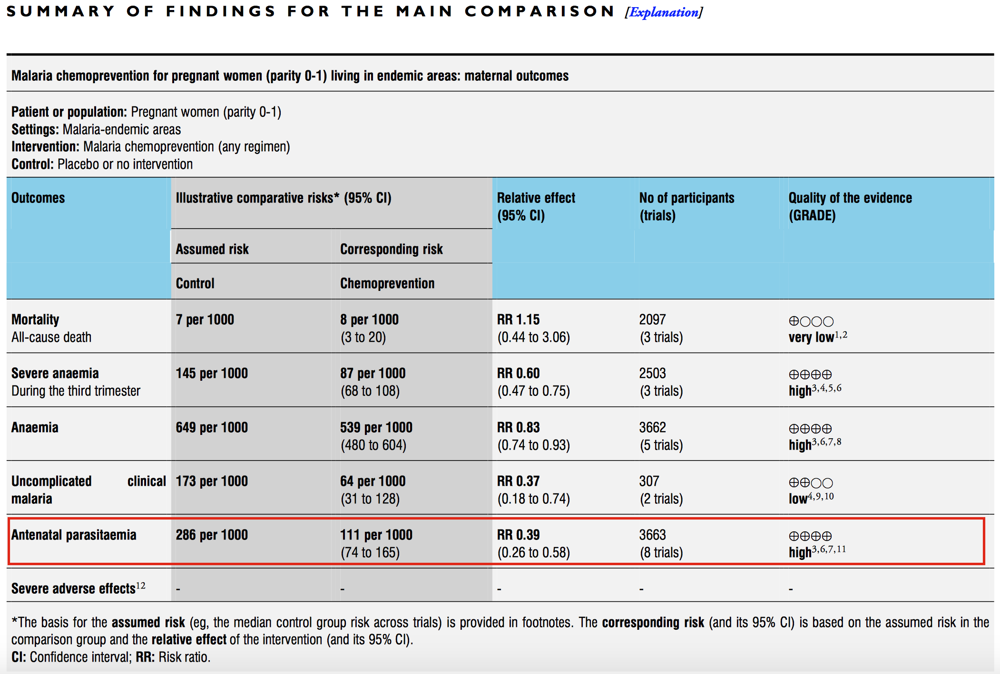
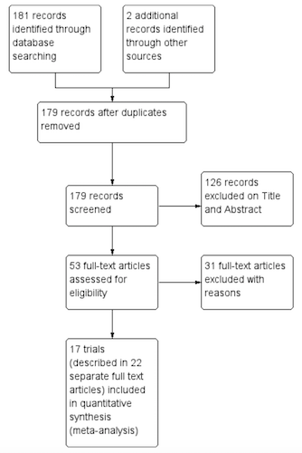

--- 
knit: "bookdown::preview_chapter"
---

# Systematic Reviews and Meta-Analyses {#filtered}

You will query the scientific literature hundreds or thousands of times in your career, so learning how to run effective searches is essential. But sometimes, it pays to let someone else do the work for you. I'm talking about systematic reviews and meta-analyses.

## Systematic Reviews

If you are interested in the impact (efficacy) of interventions—and I use the term broadly to mean clinical treatments, prevention interventions, social programs, and policies—then there might be a fast track to your learning called a systematic review.

```{r reviewcircles, fig.cap="Literature reviews, systematic reviews, and meta-analyses", echo=F, fig.margin=TRUE}
knitr::include_graphics("images/reviewcircles.png", dpi = NA)
```

A **systematic review** is a type of literature review in which the goal is to summarize all of the relevant evidence about the impact of an intervention on some outcome. Scholars who conduct systematic reviews register their research protocols in advance to clearly state the literature search strategy, rules for including and excluding studies, and a plan for the analysis. Some systematic reviews include a **meta-analysis**, which is quantitative technique for combining the results of multiple studies to estimate a pooled effect size that takes variations in study size and quality into consideration.

It is likely you've written literature reviews for class or maybe your own academic manuscripts, so some aspects of systematic reviews will be familiar. Let's consider systematic and literature reviews side-by-side to understand how systematic reviews are unique. 

<br>

```{r sysrev, echo=F}
sysrev <- data.frame(sr=c(
"The goal of a systematic review is to be comprehensive and to include every relevant article.",
"For this reason, most systematic reviews are conducted by teams, given the large scope of the data initially collected for most research topics.",
"Like any other aspect of research, however, systematic reviews must define and follow a method that can be replicated.",
"Most systematic reviews preregister the research plan, meaning that the authors submit their planned methods to a registry like [PROSPERO](http://www.crd.york.ac.uk/PROSPERO/) prior to conducting the study. Preregistration gives other researchers confidence that the team is not selectively choosing advantageous results at the end to make an interesting paper. This registration informs other researchers that a group is working on a certain area of study, which can discourage duplicate research efforts that may, therefore, fail to be published.",
"These preregistration plans include a specific search strategy using specific search terms for individual scholarly databases so other researchers can recreate the search.",
"Importantly, both inclusion criteria and exclusion criteria must be clearly outlined when a systematic review is undertaken. One inclusion criteria might be that assignment to study arms had to be random; an exclusion criteria might be all studies without a control arm that used a placebo. Most systematic searches specify several, if not many, criteria regarding which studies to include or exclude. Team members screen the search results and sort them according to these criteria, beginning with titles and abstract reviews and moving to full-text reviews later.",
"In systematic reviews, specific details are extracted from every study included, such as numbers of participants, methods, analysis techniques, and key outcomes.",
"In addition, the research team formally assesses the quality of each study, including the potential for bias, and these assessments are considered when the results are synthesized."),
lr=c("Literature reviews, on the other hand, do not follow such rigid or explicit methods. They are not expected to be exhaustive.",
"Literature reviews can usually be conducted by a single person rather than a team",
"Literature reviews don't have to follow such rigid methods or make the methods explicit.",
"Not the case for literature reviews.",
"It's a good idea to do the same for a literature review, even if not a strict requirement.",
"Screening for a literature review is typically less intensive.",
"An annotated bibliography might suffice for a literature review.",
"This process is more ad hoc for literature reviews."))
names(sysrev) <- c("Systematic Reviews", "Literature Reviews")

knitr::kable(sysrev, format = "html", 
caption = 'Comparing systematic reviews and literature reviews.'
) %>%
  html_table_width(c(400,400)) %>%
  kable_styling(bootstrap_options = c("striped"), full_width = FALSE, position = "left")
```
 
<br>

### WHERE TO FIND SYSTEMATIC REVIEWS

Three excellent sources for finding systematic reviews (and meta-analyses) in global health are the [Cochrane Library](http://www.cochranelibrary.com/), the [Campbell Collaboration](http://www.campbellcollaboration.org/), and [3ie](http://www.3ieimpact.org/evidence/systematic-reviews/). Many of the reviews in these databases can be accessed by searching within PubMed using the [Clinical Queries](http://www.ncbi.nlm.nih.gov/pubmed/clinical/) feature.

### HOW TO READ SYSTEMATIC REVIEWS

```{r rpcochrane, fig.cap="[Go to PubMed and download](https://www.ncbi.nlm.nih.gov/pubmed/25300703) 'Drugs for preventing malaria in pregnant women in endemic areas: any drug regimen versus placebo or no treatment' by @radevapetrova:2014.", echo=F, fig.margin=TRUE}
knitr::include_graphics("images/rpcochrane.png", dpi = NA)
```

Throughout this chapter, we'll use use a systematic review of the effects of chemoprevention on malaria by @radevapetrova:2014 as a learning example. Please take a moment and use the link to the right to download and skim through the article. It's open access. 

@radevapetrova:2014 set out to answer this basic question: 

> Do women who take antimalarial medication during pregnancy have a lower risk of getting infected with malaria, and thus a lower risk of experiencing the bad health outcomes associated with malaria?

One **indicator** of malaria infection is parasitemia, or the presence of malaria parasites in the blood. If chemoprevention has some preventive effect, less parasitemia should be observed among women exposed to the medication (i.e., treatment). Few interventions are 100% effective, so scientists often talk about reductions in the risk of bad outcomes like malaria. 

So what did they find when they looked across the universe of published studies?

<iframe src="https://webplayer.whooshkaa.com/episode/421503?theme=dark&button-color=%23FFFFFF&background-color=%231F9AC9&waveform-base-color=%23E69138&waveform-progress-color=%23FFFFFF" height="190" width="50%" scrolling="no" frameborder="0" allow="autoplay"></iframe>

#### Abstract and plain language summary{-}

Cochrane reviews follow a standard format that can look overwhelming, but this format makes them easy to read and understand. As with most journal articles, Cochrane reviews begin with an *Abstract* and a *Plain language summary*, which can be helpful for newcomers to a the topic. For example, @radevapetrova:2014 include the following passage in their plain language summary:

> For women in their first or second pregnancy, malaria chemoprevention prevents moderate to severe anemia (high quality evidence); and prevents malaria parasites being detected in the blood (high quality evidence). It may also prevent malaria illness. We don't know if it prevents maternal deaths, as this would require very large studies to detect an effect.

This paragraph brings us up to speed with the state of the science for preventing malaria and its effects among pregnant women living in malaria-endemic areas (and points to some gaps in the literature). Google does not filter the evidence in this manner. Starting with a systematic review pays off almost every time one is available.

#### Summary tables{-}

Next come the *Summary tables*, such as the one presented below from @radevapetrova:2014. These tables provide enough information to make an initial judgment about the intervention.

```{r summary1, fig.cap="Malaria chemoprevention for pregnant women living in endemic areas. Source: @radevapetrova:2014, http://bit.ly/1U3q2Oj", echo=F}

```

Let's use the summary table from @radevapetrova:2014 as an example. Start by focusing on the red box and examine the comparative risk column that shows the assumed risk among the control group. The risk of antenatal parasitemia is 286 events per every 1,000 people. This is the median control group risk across 8 trials of 3,663 women. The relative risk is 0.39, which means that malaria chemoprevention is associated with a 61% decrease in parasitemia. This is the pooled, or "meta," effect size from an included meta-analysis (we'll come to meta-analysis shortly). The corresponding risk among the intervention group is `286*0.39=111` per 1,000 people. 

As shown in the final column, the quality of this evidence is rated "high." This is a reference to [GRADE criteria](http://www.gradeworkinggroup.org), a systematic approach to evaluating the quality of empirical evidence:

1. **High**—Further research is very unlikely to change our confidence in the estimate of effect.
2. **Moderate**—Further research is likely to have an important impact on our confidence in the estimate of effect and may change the estimate.
3. **Low**—Further research is very likely to have an important impact on our confidence in the estimate of effect and is likely to change the estimate.
4. **Very Low**—We are very uncertain about the estimate.

#### Background{-}

The *Background* section introduces the intervention and explains which knowledge gaps the review is intended to fill. @radevapetrova:2014 summarized the problem of malaria during pregnancy, explained the hypothesized mechanism by which chemoprevention prevents malaria, framed why this review is important, and listed the objectives of the study. 

```{r concept, fig.cap="Drugs for preventing malaria in pregnancy: conceptual framework. Source: @radevapetrova:2014, http://bit.ly/1U3q2Oj", echo=F}
knitr::include_graphics("images/concept.png")
```

#### Methods{-}

```{marginfigure}
See the [PRISMA Statement](http://www.equator-network.org/reporting-guidelines/prisma/) for a checklist of details to report in a systematic review.
```

The *Methods* section details how the review was organized and conducted. The purpose of this section is to provide enough detail to enable other researchers to replicate the review. These are the main components:

1. A description of the population and intervention
2. The key outcomes of interest
3. The search strategy and databases
4. Inclusion and exclusion criteria for studies reviewed
5. Procedures for extracting information from each study
6. Procedures for assessing bias and conducting a meta-analysis (if one is included)

#### Results{-}

```{r flowdiag, fig.cap="Study flow diagram. Source: @radevapetrova:2014, http://bit.ly/1U3q2Oj", echo=F, fig.margin=TRUE}

```

The *Results* section typically begins with details about how many primary articles were identified, screened, and excluded. This information is often presented graphically in a flow diagram like this one from @radevapetrova:2014.

The *Results* section will also summarize what we learn when looking across all of the included studies. Not every study is designed or implemented equally, however, so review authors must also evaluate the potential for bias in each study to help the reader make sense of the findings. Bias is a topic we will come to in a later chapter, but for now you can think of bias as anything that systematically takes us away from the "truth". A small number of high quality studies with a low risk of bias is preferable to lots of poorly reported or conducted studies.

```{r bias, fig.cap="Risk of bias summary: review authors’ judgements about each risk of bias item for each included trial. Source: @radevapetrova:2014, http://bit.ly/1U3q2Oj", echo=F, fig.margin=TRUE}
knitr::include_graphics("images/bias.png")
```

This heatmap from @radevapetrova:2014 shows how authors summarize the risk of bias in Cochrane reviews. The rows represent each study included in the review, and the columns indicate the review authors' determination about potential bias in each study. Each study is labeled as having a low risk of bias (green +), high risk of bias (red -), or not enough information to decide (yellow ?). As we move forward in the book, we'll consider why a study like @villegas2007 was judged to have a low risk of bias across all dimensions, where as a study like @cot1995 was classified as having a high risk of bias and flagged for not providing enough information.

#### Discussion and conclusions{-}

The *Discussion* section provides a short summary of the findings, commentary on the quality of the evidence, and thoughts about what the review adds to the existing literature on the topic. In the *Conclusion*, the authors frame the overall results in terms of their implications for practice and research.

@radevapetrova:2014 conclude:

> Routine chemoprevention to prevent malaria and its consequences has been extensively tested in RCTs, with clinically important benefits on anemia and parasitaemia in the mother, and on birth-weight in infants.

Or, "chemoprevention works."

```{marginfigure}
**"Help! My mentor wants me to conduct a systematic review."** 
<br>
Stay calm. Your first move should be to check the [Prospero database](https://www.crd.york.ac.uk/prospero/) to see if anyone has registered your research question. If so, you might consider proposing a collaboration or modifying your aims. Your second move should be to consult a clinical librarian or someone with experience conducting a systematic review for tips on setting up your project. Remember, working on a systematic reviews is a team sport.
``` 

#### Appendices{-}

Often, systematic reviews will include appendices that print table after table of data on included and excluded studies and forest plots if the review includes a meta-analysis. A good appendix is a treasure trove of information. @radevapetrova:2014 wrap up on page 120!

## Meta-Analysis

```{marginfigure}
@lewis:2001 discovered that the first forest plot was published in 1978, and first used in a meta-analysis in 1982. The name lagged behind, appearing first in 1996, apparently referring to the tree-line optics typical of most forest plots.
```

Many systematic reviews feature a **meta-analysis** that combines the results from multiple studies to estimate an overall effect size. The results of a meta-analysis are typically summarized in a **forest plot** like the one shown in Figure \@ref(fig:forestguide). Let's take a look at this helpful guide from @ried:2006 that breaks it all down.

```{r forestguide, fig.cap="Source: Ried (2006), http://bit.ly/2j9pfSz", echo=F, fig.fullwidth = TRUE}
knitr::include_graphics("images/forestguide.png", dpi = NA)
```

A forest plot summarizes the results of several studies that measured the effect of the same intervention on the same outcome. One study result is described and plotted per row, and the overall effect (i.e., the "pooled" or "meta" effect) of all the studies is displayed at the bottom. 

In each row, the study sample is divided into an intervention arm and a control arm, presented in the `n/N` format where `n` represents the number of participants who experienced a certain outcome and `N` is the total number of participants in the study arm. In this example, 141 were people assigned to the intervention group in Study A. Of these 141 people, 1 person experienced the adverse outcome that the forest plot summarizes. 

Next, a plot of the **effect size** and the **confidence interval** is created. An effect size is a measure of the strength or magnitude of a relationship, such as the relationship between taking a medicine and experiencing a bad outcome. This example shows a specific type of effect size: relative risk. Each study's point estimate of the relative risk is plotted around a line of "no effect." A risk of 1 means that there is no difference between the intervention and control groups. When the outcome is something bad, like death, the intervention should be designed to reduce the risk, which is represented by a risk ratio less than 1.

The size of the effect estimate is based on how much the study contributed to the meta-analysis. Studies are not created equal, and the weight parameter lets researchers account for these differences in the analysis.

Each point estimate is surrounded by a confidence interval (typically 95%) that is summarized numerically in the final column. Basically, if a study is repeated 100 times, the effect size is expected to be within this interval 95% of the time. When this interval crosses the line of no effect, the effect could be null or could even run in the opposite direction. In this case, the result is considered not "statistically significant."

Finally, the test for **heterogeneity** is presented toward the bottom. Heterogeneity means diversity (and is the opposite of homogeneity). Heterogeneity in a forest plot refers to the diversity in effect size estimates across studies. Heterogeneity complicates the interpretation of a meta-analysis; it signals that we might be comparing apples and oranges. For instance, the intervention may work differently in different contexts, and the included studies were gathered from all over the world. In such a case, it might not make sense to attempt to determine one overall meta effect size from a comparison of the studies.

The first way to assess heterogeneity is to consider the plots. Do the confidence intervals from each study form a vertical column, even if the point estimates shift between them? If so, heterogeneity is probably low. Heterogeneity can also be summarized numerically. Two estimates of heterogeneity are often presented: chi-square (χ2) and I^2, which is generally preferred. Values greater than 75% may indicate that a change in the meta-analysis method (random vs fixed effects) is needed. If heterogeneity is reported with a high I^2 value, authors should address this in the methods or limitations section of the study.

### CHEMOPREVENTION EXAMPLE

Now let's consider the meta-analysis by @radevapetrova:2014. The forest plot shown in Figure \@ref(fig:malariaforest) displays the results of 10 studies (8 trials) of cases of parasitemia among 3,663 pregnant women who were randomized to an **intervention group** (*n*=2,053) that received a preventive antimalarial drug or to a control group (*n*=1,610) that received a **placebo** (no drug). These details should look familiar from the summary of results table.

```{r malariaforest, fig.cap="Source: Radeva-Petrova et al. (2014), http://bit.ly/1U3q2Oj", echo=F, fig.fullwidth = TRUE}
knitr::include_graphics("images/rpforest.png", dpi = NA)
```

Details about each study are reported in separate rows in this figure. The study by @shulman:1999 in row 6 found that 30 of the 567 women in the intervention group tested positive for parasitemia (i.e., malaria). Comparing this number to 199 of the 564 woman in the control group yields a risk ratio of 0.15, i.e., (30/567)/(199/564) = 0.15. In other words, the chemoprevention reduced the risk of parasitemia by 85%. This is a huge effect size!

The effect size for each study is presented in the far-right column and is depicted graphically in the size of the point estimate square. All point estimates fall to the left of the line of no effect (<1), thus indicating a favorable effect of the chemoprevention intervention, i.e., reduced risk of parasitemia. A risk ratio of 1 would indicate no difference in risk, and a ratio >1 would mean the risk was higher among the intervention group, thus favoring the control group (with no treatment). The overall (pooled) effect size is 0.39, or a 61% reduction in the risk of parasitemia.

Calculating this pooled effect size is not as simple as averaging the effects of the 10 studies because the studies were not given equal weight, as shown in the "weight" column. For instance, @greenwood:1989 had a sample size of only 34 children (i.e., 21+13=34). As a result, the effect size estimate is very noisy. The 95% confidence interval is very large and crosses 1. Consequently, the weight of this study is only 6.7%, which is lower than the others. Simply put, studies with weaker research designs, such as this one, have less weight in the pooled analysis.

A single forest plot provides a summary of the best available evidence and an estimate of the overall effect size, along with uncertainty intervals. A Google search cannot begin to offer that!

## The Takeaway

Systematic reviews and meta-analyses are great resources for discovering the best scientific evidence about the impact of an intervention on specific clinical, behavioral, or social outcomes. Finding a good review can save you hours of searching and will give you a ready-made search strategy to update or modify. 

###### Share Your Feedback{-}

This book is a work in progress, so I’d really appreciate your feedback on this chapter.

<iframe height="600" width="690" src="https://duke.qualtrics.com/jfe/form/SV_brBF5xkpmpBDJpb" frameborder="0"></iframe>
