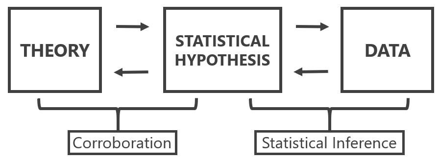
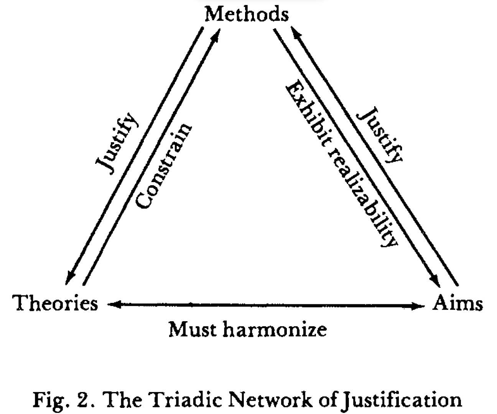
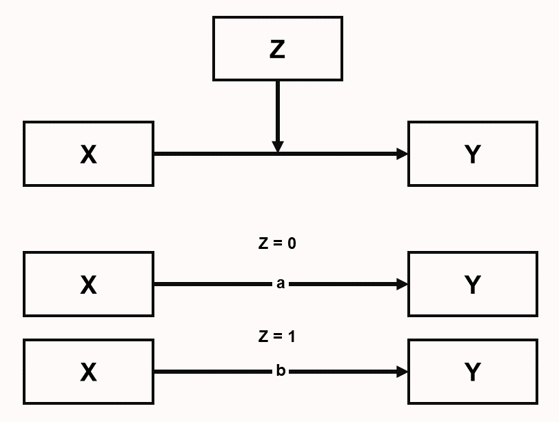

```{r, include = FALSE}
source("include/globals.R")

# needed for chapter
library(pwr)
library(ggplot2)
```

# Asking Statistical Questions{#questions}

At the core of the design of a new study is the evaluation of its **information quality**: the potential of a particular dataset for achieving a given analysis goal by employing data analysis methods and considering a given utility 
[@kenett_information_2016]. The goal of data collection is to gain information through **empirical research** where observations are collected and analyzed, often through statistical models. Three approaches to statistical modelling can be distinguished @shmueli_explain_2010: Description, explanation, and prediction, which are discussed below. The utility often depends on which effects are deemed interesting. A thorough evaluation of the information quality of a study therefore depends on clearly specifying the goal of data collection, the statistical modelling approach that is chosen, and the usefulness of the data to draw conclusions about effects of interest with the chosen analysis method. A study with low information quality might not be worth performing, as the data that will be collected has low potential to achieve the analysis goal. 

## Description

Description aims to answer questions about features of the empirical manifestation of some phenomenon. Description can involve unique events (e.g., case studies of single patients) and classes of events (e.g., patients with a certain disease). Examples of features of interest are duration (how long), quantity (how many), location (where), etc.

An example of a descriptive question is research by [Kinsey](https://en.wikipedia.org/wiki/Kinsey_Reports), who studied the sexual behavior and experiences of Americans in a time that very little scientific research was available on this topic. He used interviews that provided the statistical basis to draw conclusions about sexuality in the United States, which, at the time, challenged conventional beliefs about sexuality.

Descriptive research questions are answered through **estimation statistics**. The informational value of an estimation study is determined by the amount of observations (the more observations, the higher the **precision** of the estimates) and the sampling plan (the more representative the sample, the lower the **sample selection bias**, which increases the ability to generalize from the sample to the population), and the reliability of the measure. 

Descriptive research questions are sometimes seen as less exciting than explanation or prediction questions [@gerring_mere_2012], but they are an essential building block of theory formation [@scheel_why_2021]. Although estimation question often focus on the mean score of a measure, accurate estimates of the variance of a measure are extremely valuable as well. The variance of a measure is essential information in a well-informed sample size justification, both when planning for accuracy, as when performing an a-priori power analysis. 

## Prediction

The goal in predictive modeling is to apply an algorithm or a statistical model to predict future observations [@shmueli_explain_2010]. For example, during the COVID-9 pandemic a large number of models were created that combined variables to estimate the risk that people would be infected with COVID, or that people who were infected would experience negative effects on their health [@wynants_prediction_2020]. Ideally, the goal is to develop a prediction model that accurately captures the regularities in its training data, and that generalizes well to unseen data. There is a **bias-variance tradeoff** between these two goals, and researchers need to decide how much bias should be reduced which increases the variance, or vice-versa [@yarkoni_choosing_2017]. The goal in prediction is to minimize prediction error. A common method to evaluate prediction errors is **cross-validation**, where it is examined whether a model developed on a training dataset generalizes to a holdout dataset. The development of prediction models is becoming increasingly popular with the rise of machine learning approaches.

## Explanation

The use of statistical models concerns tests of explanatory theories. In this case, statistical models are used to test causal assumptions, or explanations that we derive from theories.
Meehl [-@meehl_appraising_1990] reminds us of the important distinction between a substantive theory, a statistical hypothesis, and observations. Statistical inference is only involved in drawing conclusions about the statistical hypothesis. Observations can lead to the conclusion that the statistical hypothesis is confirmed (or not), but this conclusion does not directly translate into corroboration for the theory. 

We never test a theory in isolation, but always include auxiliary hypotheses about the measures and instruments that are used in a study, the conditions realized in the experiment, up to the **ceteris paribus** clause that assumes "all other things are equal". The best experimental set-up can rarely by 'deduced' from theory, and requires premisses that are tacitly taken for granted. As Hempel [-@hempel_philosophy_1966] states: "Reliance on auxiliary hypotheses, as we shall see, is the rule rather than the exception in the testing of scientific hypotheses; and it has an important consequence for the question whether an unfavorable test finding, i.e., one that shows I to be false, can be held to disprove the hypothesis under investigation." Therefore, it is never clear if a failure to corroborate a theoretical prediction should be blamed on the theory or the auxiliary hypotheses. To generate reliable explanatory theories, researchers therefore have to perform lines of research in which auxiliary hypotheses are systematically tested  [@uygun_tunc_falsificationist_2022].

(ref:meehl1990lab) Distinction between a theoretical hypothesis, a statistical hypothesis, and observations. Figure based on Meehl, 1990.

```{r meehl1990, echo=FALSE, fig.cap="(ref:meehl1990lab)"}

```

## Loosening and Tightening

For each of the three questions above, we can ask questions about description, prediction, and explanation during a **loosening** phase when doing research, or during a **tightening** phase [@fiedler_tools_2004]. The distinction is relative. During the loosening stage, the focus is on creating variation that provides the source for new ideas. During the tightening stage, selection takes place with the goal to distinguish useful variants from less useful variants. In descriptive research, an unstructured interview is more aligned with the loosening phase, while a structured interview is more aligned with the tightening phase. In prediction, building a prediction model based on the training set is the loosening phase, while evaluation the prediction error in the holdout dataset is the tightening phase. In explanation, exploratory experimentation functions to generate hypotheses, while hypothesis tests function to distinguish theories that make predictions that are corroborated from those theories which predictions are not corroborated. 

It is important to realize whether your goal is to generate new ideas, or to test new ideas. Researchers are often not explicit about the stage their research is in, which runs the risk of trying to test hypotheses prematurely [@scheel_why_2021]. Clinical trials research is more explicit about the different phases of research, and distinguishes Phase 1, Phase 2, Phase 3, and Phase 4 trials. In a Phase 1 trial researchers evaluate the safety of a new drug or intervention in a small group of non-randomized (often healthy) volunteers, by examining how much of a drug is safe to give, while monitoring a range of possible side effects. A phase 2 trial are often performed with patients as participants, and can focus in more detail on finding the definite dose. The goal is to systematically explore a range of parameters (e.g., the intensity of a stimulus) to identify boundary conditions [@dubin_theory_1969]. A phase 3 trial is a large randomized controlled trial with the goal to test the effectiveness of the new intervention in practice. Phase 3 trials require a prespecified statistical analysis plan that strictly controls error rates. Finally, a Phase 4 trial examines long term safety and generalizability. Compared to a Phase 3 trial, there is more loosening, as researchers explore the possibility of interactions with other drugs, or moderating effects in certain subgroups of the population. In clinical trials, a Phase 3 trial requires a huge amount of preparation, and is not undertaken lightly. 

```{r trialphase, echo=FALSE, fig.cap='Four phases of clinical research. <a href="https://clinicalinfo.hiv.gov/en/glossary/phase-1-trial">Source</a>.'}
knitr::include_graphics("images/trialphase.jpg")
```

## Three Statistical Philosophies

Royall [-@royall_statistical_1997] distinguishes three questions one can ask:

1. What do I believe, now that I have this observation?
2. What should I do, now that I have this observation?
3. What does this observation tell me about A versus B? (How should I interpret this observation as evidence regarding A versus B?)

One useful metaphor for thinking about these differences is if we look at Hinduism, where there are three ways to reach enlightenment: The Bhakti yoga, or the Path of Devotion, the Karma yoga, or the Path of Action, the Jnana yoga, or the Path of Knowledge. The three corresponding statistical paths are Bayesian statistics, which focuses on updating beliefs, Neyman-Pearson statistics, which focuses on making decisions about how to act, and likelihood approaches, which focus on quantifying the evidence or knowledge gained from the data. Just like in Hinduism the different paths are not mutually exclusive, and the emphasis on these three yoga's differs between individuals, so will scientists differ in their emphasis of their preferred approach to statistics. 

The three approaches to statistical modelling (description, prediction, and explanation) can be examined from each the three statistical philosophies (e.g., frequentist estimation, maximum likelihood estimation, and Bayesian estimation, or Neyman-Pearson hypothesis tests, likelihood ratio tests, and Bayes factors). Bayesian approaches start from a specified prior belief, and  use the data to update their belief. Frequentist procedures focus on methodological procedures that allow researchers to make inferences that control the probability of error in the long run. Likelihood approaches focus on quantifying the evidential value in the observed data. When used knowledgeably, these approaches often yield very similar inferences [@dongen_multiple_2019; @lakens_improving_2020; @tendeiro_review_2019]. Jeffreys [-@jeffreys_theory_1939], who developed a Bayesian hypothesis test, noted the following when comparing his Bayesian hypothesis test against frequentist methods proposed by Fisher:

>I have in fact been struck repeatedly in my own work, after being led on general principles to a solution of a problem, to find that Fisher had already grasped the essentials by some brilliant piece of common sense, and that his results would be either identical with mine or would differ only in cases where we should both be very doubtful. As a matter of fact I have applied my significance tests to numerous applications that have also been worked out by Fisher’s, and have not yet found a disagreement in the actual decisions reached.

At the same time, each approach is based on different principles, and allows for specific inferences. For example, a Neyman-Pearson approach does not quantify evidence, and a Bayesian approach can lead conclusions about the relative support for one over another hypothesis, given specified priors, while ignoring the rate at which such a conclusion would be misleading. Understanding these basic principles is useful, as criticisms on statistical practices (e.g., computing *p*-values) always boil down to a disagreement about the principles that different statistical philosophies are built on. However, when we survey the literature, we rarely see the viewpoint that all approaches to statistical inferences, including p values, provide answers to specific questions a researcher might want to ask. Instead, statisticians often engage in what I call the **statistician’s
fallacy** — a declaration of what they believe researchers really “want to know” without limiting the usefulness of their preferred statistical question to a specific context [@lakens_practical_2021]. The most well-known example of the statistician’s fallacy is provided by Cohen [-@cohen_earth_1994] when discussing null-hypothesis significance testing:

> What’s wrong with NHST? Well, among many other things, it does not tell us what we want to know, and we so much want to know what we want to know that, out of desperation, we nevertheless believe that it does! What we want to know is ‘Given these data, what is the probability that H0 is true?’

Different statisticians will argue what you actually "want to know" is the posterior probability of a hypothesis, the false-positive risk, the effect size and its confidence interval, the likelihood, the Bayes factor, or the severity with which a hypothesis has been tested. However, it is up to you to choose a statistical strategy that matches the question you want the ask [@hand_deconstructing_1994].  

## Do You Really Want to Test a Hypothesis?

::: {.small_right}

:::
A hypothesis test is a very specific answer to a very specific question. We can use a dart game as a metaphor for the question a hypothesis test aims to answer. In essence, both a dart game and a hypothesis test are a methodological procedure to make a directional prediction: Is A better or worse than B? In a dart game we very often compare two players, and the question is whether we should act as if player A is the best, or player B is the best. In a hypothesis test, we compare two hypotheses, and the question is whether we should act as if the null hypothesis is true, or whether the alternative hypothesis is true. 

Historically, researchers have often been interested in testing hypotheses to examine whether predictions that are derived from a scientific theory hold up under scrutiny. Some philosophies of science (but not all) value theories that are able to make predictions. If a darter wants to convince you they are a good player, they can make a prediction (‘the next arrow will hit the bulls-eye’), throw a dart, and impress you by hitting the bulls-eye. When a researcher uses a theory to make a prediction, collects data, and observes can claim based on a predefined methodological procedure that the results confirm their prediction, the idea is you are impressed by the **predictive validity of a theory** [@de_groot_methodology_1969]. The test supports the idea that the theory is a useful starting point to generate predictions about reality. Philosophers of science such as Popper call this ‘verisimilitude’– the theory is in some way related to the truth, and it has some ‘truth-likeness’.

In order to be impressed when a prediction is confirmed, the prediction must be able to be wrong. In other words, a theoretical prediction needs to be falsifiable. If our predictions concern the presence or absence of clearly observable entities (e.g., the existence of a black swan) it is relatively straightforward to divide all possible states of the world into a set that is predicted by our theory (e.g., all swans are white), and a set that is not predicted by our theory (e.g., swans can have other colors than white). However, many scientific questions concern probabilistic events where single observations contain noise due to random variation – rats have a certain probability to develop a tumor, people have a certain probability to buy a product, or particles have a certain probability to appear after a collision. If we want to forbid certain outcomes of our test when measuring probabilistic events, we can divide the states of the world based on the probability that some result will be observed.

(ref:blackwhitelab) Some fields make black and white predictions about the presence or absence of observables, but in many sciences, predictions are probabilistic, and shades of grey.

```{r blackwhite, fig.margin=TRUE, echo=FALSE, fig.cap="(ref:blackwhitelab)"}
knitr::include_graphics("images/blackwhite.png")
```

Just because a hypothesis test can be performed, does not mean it is interesting. A hypothesis test is most useful when 1) both data generating models that are decided between have some plausibility, and 2) it is possible to apply an informative methodological procedure. 

First, the two competing models should both be good players. Just as in a dart game there would be very little interest if I played Michael van Gerwen (the world champion at the time of writing) to decide who the better dart player is. Since I do not play darts very well, a game between the two of us would not be interesting to watch. Similarly, it is sometimes completely uninteresting to compare two data generating models, one representing the state of the world when there is no effect, and another representing the state of the world when there is some effect, because in some cases the absence of an effect is extremely implausible.

Second, for a hypothesis test to be interesting you need to have designed an informative study. When designing a study, you need to be able to make sure that the methodological rule provides a severe test, where you are likely to corroborate a prediction if it is correct, while at the same time fail to corroborate a prediction when it is wrong [@mayo_statistical_2018]. If the world champion in darts and I stand 20 inches away from a dart board and can just push the dart in the location where we want it to end up, it is not possible to show my lack of skill. If we are both are blindfolded and throwing the darts from 100 feet, it is not possible for the world champion to display their skill. In a hypothesis test, the statistical severity of a test is determined by the error rates. Therefore, a researcher needs to be able to adequately control error rates to perform a test of a hypothesis with high informational value. 

By now it is hopefully clear that hypothesis tests are a very specific tool, that answer a very specific question: After applying a methodological rule to observed data, which decision should I make if I do not want to make incorrect decisions too often? If you have no desire to use a methodological procedure to decide between competing theories, there is no real reason to report the results of a hypothesis test. Even though it might feel like you should test a hypothesis when doing research, carefully thinking about the statistical question you want to ask might reveal that alternative statistical approaches, such as describing the data you have observed, quantifying your personal beliefs about hypotheses, or reporting the relative likelihood of data under different hypotheses might be the approach that answers the question you really want to know. 

## Directional (One-Sided) versus Non-Directional (Two-Sided) Tests{#onesided}

Interestingly, there is quite some disagreement about whether the statistical question you ask in a study should be **directional** (meaning that only effects in a predicted direction will lead to rejection of the null hypothesis) or **non-directional** (meaning that effects in either direction will lead to the rejection of the null-hypothesis). For example, @baguley_serious_2012 writes "one-sided tests should typically be avoided" because researchers are rarely willing to claim an effect in the non-predicted direction is non-significant, regardless of how large it is. At the same time, @jones_test_1952 has stated: “Since the test of the null hypothesis against a one-sided alternative is the most powerful test for all directional hypotheses, it is strongly recommended that the one-tailed model be adopted wherever its use is appropriate”, and @cho_is_2013 complain about the "widespread overuse of two-tailed testing for directional research hypotheses tests". Let's reflect on some arguments for or against the choice to perform a one-sided test. 

First, it is clear that a directional test provides a clear advantage in statistical power. As Figure \@ref(fig:onesidedtwosidedratio) shows, the ratio of the sample for a non-directional versus a directional test means that approximately 80% of the sample size of a non-directional test is required to achieve the same power in a directional test (the exact benefit depends on the power and effect size, as seen in the figure below).

(ref:onesidedtwosidedratiolab) Ratio of the required sample size for a one-sample *t*-test for a non-directional/directional test to achieve 50%, 80% or 95% power.

```{r, onesidedtwosidedratio, echo = FALSE, fig.cap="(ref:onesidedtwosidedratiolab)"}
# Code by Chelsea Parlett-Pelleriti and Daniel Lakens

# set up vector of effect sizes
es <- seq(0.1, 3, length = 1000)
# specify power for test

# calculate ns (sample size for xx% power in two-sided test)
n2_50 <- sapply(es, function(x) {
  pwr.t.test(
    d = x,
    power = 0.5,
    sig.level = 0.05,
    type = "one.sample",
    alternative = "two.sided"
  )$n
})

# calculate ns (sample size for xx% power in one-sided test)
n1_50 <- sapply(es, function(x) {
  pwr.t.test(
    d = x,
    power = 0.5,
    sig.level = 0.05,
    type = "one.sample",
    alternative = "greater"
  )$n
})

# calculate ns (sample size for xx% power in two-sided test)
n2_80 <- sapply(es, function(x) {
  pwr.t.test(
    d = x,
    power = 0.8,
    sig.level = 0.05,
    type = "one.sample",
    alternative = "two.sided"
  )$n
})

# calculate ns (sample size for xx% power in one-sided test)
n1_80 <- sapply(es, function(x) {
  pwr.t.test(
    d = x,
    power = 0.8,
    sig.level = 0.05,
    type = "one.sample",
    alternative = "greater"
  )$n
})

# calculate ns (sample size for xx% power in two-sided test)
n2_95 <- sapply(es, function(x) {
  pwr.t.test(
    d = x,
    power = 0.95,
    sig.level = 0.05,
    type = "one.sample",
    alternative = "two.sided"
  )$n
})

# calculate ns (sample size for xx% power in one-sided test)
n1_95 <- sapply(es, function(x) {
  pwr.t.test(
    d = x,
    power = 0.95,
    sig.level = 0.05,
    type = "one.sample",
    alternative = "greater"
  )$n
})

ratio <- c(n1_50 / n2_50, n1_80 / n2_80, n1_95 / n2_95)

df_1_vs_2 <- data.frame(
  effect_size = c(es, es, es),
  ratio = ratio,
  power = c(rep("50", 1000), rep("80", 1000), rep("95", 1000))
)

ggplot(df_1_vs_2, aes(x = effect_size, y = ratio, color = power)) +
  geom_line(size = 1.5) +
  labs(x = "Effect size (d)", y = "Ratio One-sided/Two-sided Sample Size") +
  theme(
    legend.position = "bottom", legend.direction = "horizontal",
    legend.title = element_blank()
  ) +
  theme_bw() +
  scale_color_manual(values = c("#E69F00", "#56B4E9", "#009E73")) + 
  theme(plot.background = element_rect(fill = backgroundcolor))  + 
  theme(panel.background = element_rect(fill = backgroundcolor))

```

Because in a directional test the alpha level is used for only one tail of the distribution, the critical test value is lower, and all else equal, power is higher. This reduction of the critical value required to declare a statistically significant effect has been criticized because it leads to weaker evidence. For example, @schulz_sample_2005 write: "Using a one-sided test in sample size calculations to reduce required sample sizes stretches credulity.". This is trivially true: Any change to the design of a study that requires a smaller sample size reduces the strength of the evidence you collect, since the strength of evidence is inherently tied to the total number of observations. However, it conflates two types of statistical philosophies, namely a likelihoodist approach, which aims to quantify relative evidence, and a frequentist approach, which aims to provide a procedure to make claims with a maximum error rate. There is a difference between designing a study that yields a certain level of evidence, and a study that adequately controls the error rates when performing a hypothesis test. If you desire a specific level of evidence, design a study that provides this desired level of evidence. If you desire to control the error rate of claims, then that error rate is at most 5% as long as the alpha level is 5%, regardless of whether a one-sided or two-sided test is performed.

Note that there is a subtle distinction between a directional and a one-sided test [@baguley_serious_2012]. Although the two terms overlap when performing a *t*-test, they do not overlap for an *F*-test.  The *F*-value and the *t*-value are related: $t^2 = F$. This holds as long as the df1 = 1 (e.g., F(1, 100), or in other words as long as only two groups are compared. We can see in Figure \@ref(fig:fandt) that the two distributions touch at t = 1 (as 1^2 = 1), and that the *F*-test has no negative values due to the squared nature of the distribution. The critical *t*-value, squared, of a non-directional *t*-test with a 5% error rate equals the critical *F*-value for an *F*-test, which is always one-sided, with a 5% error rate. Due to the 'squared' nature of an *F*-test, an *F*-test is always non-directional. You can logically not halve the *p*-value in an *F*-test to perform a 'one-sided' test, because you can't have a directional *F*-test. When comparing two groups, you can use a *t*-test instead of an *F*-test, which can be directional.

(ref:fandtlab) Distribution and rejection areas for a two-sided *t*-test and the corresponding *F*-test with df1 = 1 and df2 = 100.

```{r, fandt, echo = FALSE, fig.cap="(ref:fandtlab)"}
df1 <- 1
df2 <- 100
critF <- qf(.95, df1 = df1, df2 = df2) # determine critical F-value
critT <- qt(.975, df2) # determine critical F-value
# critF # critical F-value
# critT^2 # Critical t squared is the same as critical F-value
# critT # critical t-value

x <- seq(0, 10, length = 10000)
maxy <- ifelse(max(df(x, df1, df2)) == Inf, 1, max(df(x, df1, df2))) # set maximum y axis

plot(x, df(x, df1, df2), col = "skyblue", type = "l", lwd = 3, xlim = c(-5, 8), ylim = c(0, maxy), xlab = "F- or t-value", ylab = "Density", main = paste("F-distribution, df1 = ", df1, ", df2 = ", df2), xaxt = "n", yaxt = "n")
x <- seq(critF, 10, length = 10000)
z <- (df(x, df1, df2)) # determine upperbounds polygon
polygon(c(critF, x, 10), c(0, z, 0), col = "skyblue") # draw polygon
x <- seq(-5, 8, length = 10000)
lines(x, dt(x, df = df2), col = "palegreen4", type = "l", lwd = 3)
x <- seq(critT, 10, length = 10000)
z <- (dt(x, df = df2)) # determine upperbounds polygon
polygon(c(critT, x, 10), c(0, z, 0), col = "palegreen2")
x <- seq(-10, -critT, length = 10000)
z <- (dt(x, df = df2)) # determine upperbounds polygon
polygon(c(x, -critT, -critT), c(z, 0, 0), col = "palegreen2")
axis(1, at = seq(-5, 8, by = 1))

```

A final concern raised against one-sided tests is that surprising findings in the opposite direction might be meaningful, and should not be ignored. I agree, but this is not an argument against one-sided testing. The goal in hypothesis testing is, not surprisingly, to test a hypothesis. If you have a directional hypothesis, a result in the opposite direction can never confirm your hypothesis. It can lead one to create a new hypothesis, but this new hypothesis should be tested on a new dataset [@de_groot_methodology_1969]. 
It makes sense to *describe* an unexpected effect in the opposite direction of your prediction, but there is a difference between describing data, and testing a hypothesis. A one-sided hypothesis test does not prohibit researchers from describing unexpected data patterns. And if you really want to test if there is an effect in either direction, simply preregister a two-sided test. 

## Systematic Noise, or the Crud Factor{#crud}

Meehl [-@meehl_theoretical_1978] believes “the almost universal reliance on merely refuting the null hypothesis as the standard method for corroborating substantive theories in the soft areas is a terrible mistake, is basically unsound, poor scientific strategy, and one of the worst things that ever happened in the history of psychology”. At the same time, he also wrote: “When I was a rat psychologist, I unabashedly employed significance testing in latent-learning experiments; looking back I see no reason to fault myself for having done so in the light of my present methodological views” [@meehl_appraising_1990]. When he asks ‘Is it ever correct to use null-hypothesis significance tests?’ his own answer is:

>Of course it is. I do not say significance testing is never appropriate or helpful; there are several contexts in which I would incline to criticize a researcher who failed to test for significance.

Meehl is not of the opinion that null hypothesis significance tests are not useful at all, but that the question if *any* difference from zero exists is sometimes not a very interesting question to ask. Crucially, Meehl is especially worried about the widespread use of null hypothesis significance tests where there is room for **systematic noise**, or the **crud factor** in the data that are analyzed. The presence of systematic noise in data means that it is extremely unlikely that the null hypothesis is true, and combined with a large enough dataset, the question whether the null hypothesis can be rejected is uninteresting. 

Systematic noise can only be excluded in an ideal experiment. In this ideal experiment, only one single factor can lead to an effect, such as in a perfect **randomized controlled trial**. Perfection is notoriously difficult to achieve in practice. In any not perfect experiment, there can be tiny causal factors that, although not being the main goal of the experiment, lead to differences between the experimental and control condition. Participants in the experimental condition might read more words, answer more questions, need more time, have to think more deeply, or process more novel information. Any of these things could slightly move the true effect size away from zero – without being related to the independent variable the researchers aimed to manipulate. The difference is reliable, but not caused by anything the researcher is **theoretically interested** in. In real life, experiments are not even close to perfect. Consequently, there is always some room for systematic noise, although there is no way to know how large this systematic noise is in any specific study. 

Systematic noise is especially a problem in studies where there is no randomization, such as in correlational studies. As an example of correlational data, think about research that examines differences between women and men. In such a study the subjects cannot be randomly assigned to each condition. In such non-experimental studies, it is possible that ‘**everything is correlated to everything**’. Or slightly more formally, crud can be defined as the epistemological concept that, in correlational research, all variables are connected through multivariate causal structures which result in real non-zero correlations between all variables in any given dataset [@orben_crud_2020]. For example, men are on average taller than women, and as a consequence men will be asked by strangers to pick an object from a high shelf in a supermarket a bit more often tham women. If we ask men and women ‘how often do you help strangers’ this average difference in height has some tiny but systematic effect on their responses, even though a researcher might be theoretically interested in differences unrelated to height. In this specific case, systematic noise moves the mean difference from zero to a slightly higher value for men – but an unknown number of other sources of systematic noise are at play, and these all interact, leading to an unknown final true population difference that is very unlikely to be exactly zero.

As a consequence, some scientific fields find tests of correlations relatively uninteresting. Researchers in these fields might find it interesting to *estimate* the size of correlations, but they might not find it worthwhile to perform a null hypothesis significance *test* for a correlation, as with a large enough dataset, statistical significance is practically guaranteed. This is increasingly true, the bigger the dataset. As an anecdote, while working on a paper on [sequential analysis](#sequential), I asked my collaborator Prof. Wassmer why the `rpact` package did not have a module for tests of correlations. He replied that there was not enough interest in null hypothesis significance tests for correlations in biopharmaceutical statistics, because as everything correlates with everything anyway, why would anyone want to test it?

When you perform a nil null hypothesis test, you should justify why the nil null hypothesis is an interesting hypothesis to test against. This is not always self-evident, and sometimes the nil null hypothesis is simply not very interesting. Is it plausible that the nil null hypothesis is true? If not, then it is more interesting to perform a [minimal effect test](#MET). For a concrete example of how to determine if the presence of crud warrants the use of minimal effect tests in a literature, see @ferguson_providing_2021.

Several Many Lab Registered Replication Reports in psychology, where randomized experiments with very large sample sizes are performed that revisit published findings,  have shown that for for all practical purposes, and given the sample sizes psychologists are able to collect, it has proven surprisingly difficult to find significant effects. A multilab replication study examining the action-sentence compatibility effect showed an average effect on the logarithm of the lift-off times close to 0 [-0.006, 0.004] in 903 native English speakers [@morey_pre-registered_2021]. A Registered Replication Report examining the effect of priming participants with either professor or hooligan related concepts yielded a non-significant difference in the number of general knowledge questions answered of a difference of 0.14% [−0.71%, 1.00%] in a sample of 4493 participants [@odonnell_registered_2018]. A Registered Replication Report examining the effect of recalling the ten commandments or 10 books read in highschool on how often people cheated on a problem-solving task showed a non-significant difference of 0.11 [-0.09; 0.31] matrices in a sample of 4674 participants [@verschuere_registered_2018]. A Registered Replication Report testing the facial feedback hypothesis showed a non-significant effect on funniness ratings between conditions where participants were manipulated to move muscles related to smiling or pouting of 0.03 [−0.11; 0.16] scale units in a sample of 1894 participants [@wagenmakers_registered_2016]. A multi-lab replication study of the ego-depletion effect (which will feature more prominently in the chapter on [bias](#bias)) observed an effect of *d* = 0.04 [−0.07, 0.15] in a sample of 2141 participants [@hagger_multilab_2016]. These studies suggest that sometimes the nil null hypothesis is a plausible model to test against, and that even with sample sizes much larger than are typically collected in psychological research, the nil null is surprisingly difficult to reject. 

Other multi-lab studies provide indications of tiny true effects, which could be due to the crud factor. @colling_registered_2020 observed congruency effects in the attentional SNARC effect for four inter-stimulus interval conditions (250, 500, 750, and 1000 ms) of -0.05 ms [-0.82l; 0.71], 1.06 ms [0.34; 1.78], 0.19 ms [-0.53; 0.90], and 0.18 ms [-0.51; 0.88] with a sample size of 1105 participants. For the statistically significant effect in the 500 ms ISI condition (which might be crud) they conclude: "we view a difference of about 1 ms, even if “real,” as too small for any neurally or psychologically plausible mechanism—particularly one constrained to operate only within a narrow time window of 500 ms after the stimulus." @mccarthy_registered_2018 observed a difference of 0.08 [0.004; 0.16] in how hostile ambiguous behavior in a vignette was rated after a priming task where more or less words were related to hostility, and conclude "Our results suggest that the procedures we used in this replication study are unlikely to produce an assimilative priming effect that researchers could practically and routinely detect." In these instances, the null-hypothesis can be rejected, but the observed effect size is deemed too small to matter. As discussed in the chapter on equivalence testing and interval hypotheses, the solution to this problem is to specify a [smallest effect size of interest](#sesoi).
  
## Dealing with Inconsistencies in Science{#inconsistencies}

We might prefer clear answers from scientific research, but in practice we are often presented with inconsistent results in a scientific literature. What should we do when 'even scientists can't agree'? 

According to Karl Popper the ability of scientists to reach consensus about basic statements is key criteria of science: 

>If some day it should no longer be possible for scientific observers to reach agreement about basic statements this would amount to a failure of language as a means of universal communication. It would amount to a new ‘Babel of Tongues’: scientific discovery would be reduced to absurdity. In this new Babel, the soaring edifice of science would soon lie in ruins.

Other philosophers of science, such as Thomas Kuhn, viewed different paradigms in science as **incommensurable**. Because research Kuhn believed paradigms change dramatically over time (which he calls scientific revolutions) advocates of competing theories can not directly compare and discuss their theories [@kuhn_structure_1962]. Kuhn acknowledges that scientists do reach consensus within a particular research tradition (which he calls 'normal science'):

>Men whose research is based on shared paradigms are committed to the same rules and standards for scientific practice. That commitment and the apparent consensus it produces are prerequisites for normal science, i.e., for the genesis and continuation of a particular research tradition.

Harry Laudan aims to resolve these different views on whether scientists can or can not reach consensus by distinguishing disagreements on three levels [@laudan_science_1986]. The first level involves claims about theoretical or observable entities, where scientists can have factual disagreements or factual consensus. These can be resolved by methodological rules. However, scientists can also have disagreements about which methods or procedures should be used. These disagreements on the methodological level can only be resolve by discussing the aims of science, as the methods we use should be optimal techniques to achieve our aims in science. Laudan calls this the axiological level. According to Laudan, there is a mutual justification process between these three levels, and even though there are different aims, methods, and theories, scientists need to be able to justify how their approach is coherent. 

```{r laudan, echo=FALSE, fig.cap="The interrelationship between the methdological level, theories that explain factual observation, and the aims of science according to Laudan's reticulated model of scientific rationality."}

```

Factual inconsistencies can emerge in different ways. First, the support for a specific scientific claim can be mixed, in that some studies show statistically significant results (*p* < .05), while other studies do not (*p* > 0.05). We have seen that [mixed results](#mixedresults) are expected in sets of studies. It is possible (and sometimes likely) that the statistical power of studies is low. If 60% of studies yield *p* < .05 and 40% of studies yield *p* > .05 this might seem inconsistent, but in reality the pattern of results would be perfectly consistent with the expected long run Type 2 error rates in a set of studies with low statistical power. We will see later that combining all studies in a [meta-analysis](#meta) can yield more clarity when individual studies have low statistical power.

As Popper [-@popper_logic_2002] writes: "a few stray basic statements contradicting a theory will hardly induce us to reject it as falsified. We shall take it as falsified only if we discover a reproducible effect which refutes the theory." Remember that any claim of rejecting or accepting a hypothesis is done with a certain error rate, and that close replication studies are the only way to distinguish erroneous from correct dichotomous claims in statistical hypothesis tests. If the null hypothesis is true, the alpha level determines how many false positive results will be observed. Again, these errors should occur as often as the Type 1 error rate a study was designed to have. In a two-sided test performed with an alpha level of 5%, 2.5% of all studies will lead to a claim about an effect in the positive direction, and 2.5% of the studies will lead to a claim about an effect in the negative direction (when in reality the null hypothesis is true). Seeing statistically significant effects in the literature in both the positive and negative direction might seem inconsistent, but if all these findings are Type 1 errors, they should occur exactly as often as expected based on the chosen alpha level. 

Even if there is a true effect, just because of random variation it is possible to very rarely observe a statistically significant effect in the opposite direction, which has been called an 'error of the third kind' [@kaiser_directional_1960] or a Type S error [@altoe_enhancing_2020; @gelman_beyond_2014]. Although such results are rare, you are much more likely to hear about them because a newspaper article that reads 'as opposed to what researchers believed for the last decades, a new study suggests that spending *less* time studying might lead to better exam results' makes for a very attention-grabbing headline. Because there is a real risk that counter-intuitive findings are actually just flukes, it would be good if science journalists spent more time reporting on meta-analyses, and less time reporting on surprising novel findings.

If all research results are transparently reported, multiple studies should quickly indicate whether we were dealing with a relatively rare Type 1 error, or a true finding. However, as we will see in the chapter on [bias](#bias) not all research findings are shared. As explained in the section on the [positive predictive value](#ppv) this can lead to a literature where many Type 1 errors are published, which makes it difficult to determine if there is a true effect or not. The combination of random variation and bias in the scientific literature can make it easy to find a single study that can be used to support any viewpoint or argument. To prevent confirmation bias, you should actively search for studies that contradict the point you want to make, and evaluate the evidence across multiple studies. If this larger literature shows inconsistencies, bias detection tests might provide a first indication that the cause of the inconsistency is a biased literature. To resolve inconsistencies due to bias in the literature new studies should be performed - preferably Registered Reports that have a preregistered statistical analysis plan and are published regardless of whether results are significant or not. 

A second type of inconsistency occurs when two conflicting claims have been supported by an unbiased literature. In this case, different researchers might argue that one or the other claim is true, but it is most likely that both are false, as both are only true *under specific conditions*. One might argue that in some research fields, like psychology, there are always some conditions under which a claim is true, and some conditions under which the same claim is false. Indeed, if one wanted to summarize all knowledge generated by psychologists in two words, it would be "it depends". McGuire [-@mcguire_perspectivist_2004] refers to this as ‘perspectivism’, and proposed it as a fruitful approach when theorizing: “all hypotheses, even pairs of contraries, are true (at least from some perspective).” Thinking in advance about when a prediction might hold and when not is a good approach to theorize about boundary conditions and other types of **moderators**. If two conflicting claims have received reliable support, the presence of a moderator means that a statistical relationship between two variables depends on a third variable. In Figure \@ref(fig:moderation) we see that the effect of X and Y depends on the level of Z (Z impacts the relationship between X and Y). For example, an effect of winning the lottery on how happy you are depends on whether your friends and family are happy for you (let's call this condition Z = 0), or whether arguments about money ruin your personal relationships (Z = 1). The effect (indicated as *a* and *b*) might be positive in one condition of Z, and absent or even negative in another condition of Z. As there are many possible moderators, and studying moderation effects typically requires more resources than studying main effects, it is possible there is relatively little empirical research that examines moderators, in which case inconsistencies remain unresolved. 

(ref:moderation) Path model of a moderation effect where the effect of X on Y depends on Z, where the effect sizes a and b differ from each other depending on the level of Z.

```{r moderation, echo=FALSE, fig.cap="(ref:moderation)"}

```

Some researchers strongly believe failures to replicate published findings can be explained by the presence of hitherto unidentified, or 'hidden', moderators [@stroebe_alleged_2014]. There has been at least one example of researchers who were able to provide modest support for the idea that a previous failure to replicate a finding was due to how personally relevant a message in the study was [@luttrell_replicating_2017]. It is difficult to reliably identify moderator variables that explain failures to replicate published findings, but easy to raise them as an explanation when replication studies do not observe the same effect as the original study. Especially in the social sciences it is easy to point to moderators that are practically impossible to test, such as the fact that society has changed over time, or that effects that work in one culture might not replicate in different cultures. This is an age-old problem, already identified by Galileo in [The Assayer](https://web.archive.org/web/https://web.stanford.edu/~jsabol/certainty/readings/Galileo-Assayer.pdf), one of the first books on the scientific method. In this book, Galileo discusses the claim that Babylonians cooked eggs by whirling them in a sling, which is impossible to replicate, and writes: 

>‘If we do not achieve an effect which others formerly achieved, it must be that we lack something in our operation which was the cause of this effect succeeding, and if we lack one thing only, then this alone can be the true cause. Now we do not lack eggs, or slings, or sturdy fellows to whirl them, and still they do not cook, but rather cool down faster if hot. And since we lack nothing except being Babylonians, then being Babylonian is the cause of the egg hardening.’

Resolving inconsistencies in science is an effortful process that can be facilitated by engaging in an **adversarial collaboration**, where two teams join forces to resolve inconsistencies [@mellers_frequency_2001]. It requires first establishing a reliable empirical basis by reducing the probability of Type 1 and Type 2 errors and bias, and then systematically testing hypotheses that are proposed to explain inconsistencies [@uygun_tunc_falsificationist_2022].

<!-- ## Statistical Decision Theory -->

