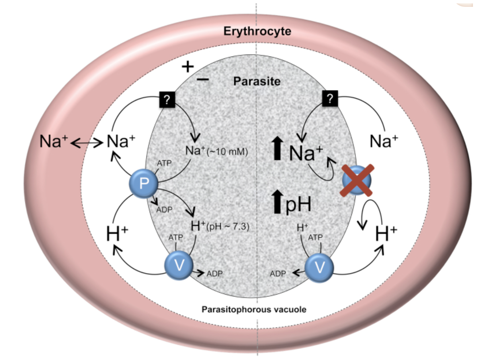
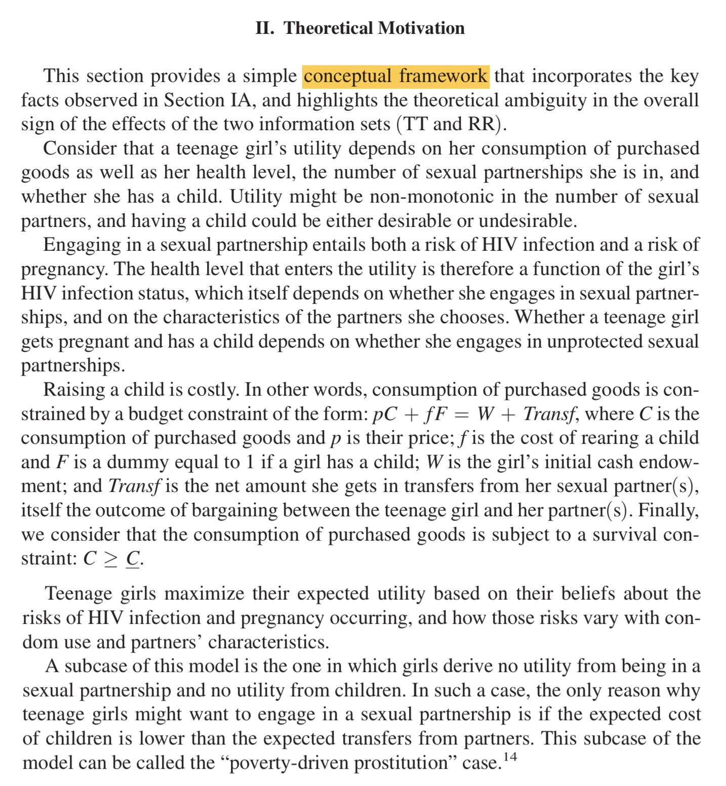
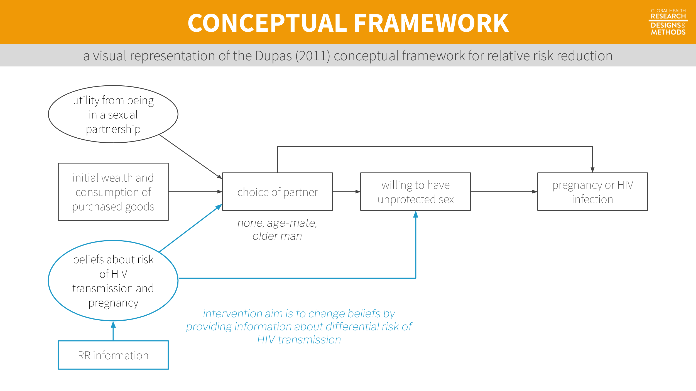
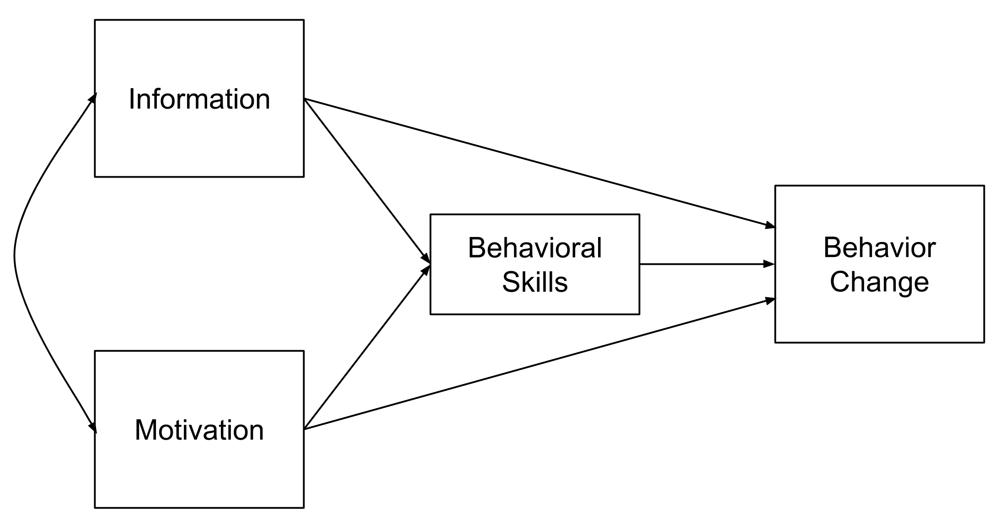
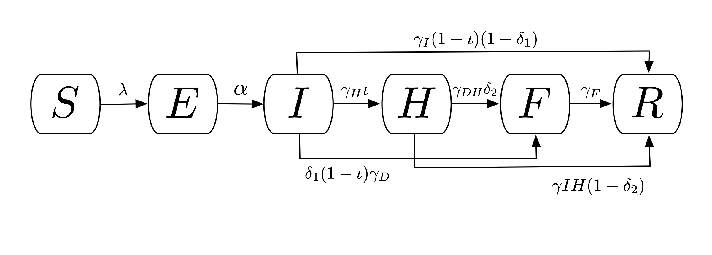
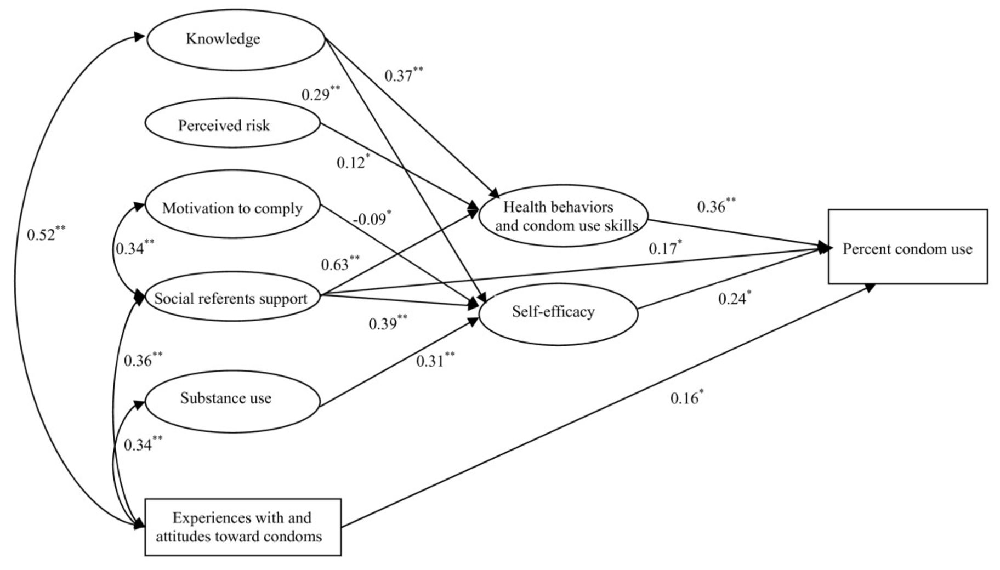
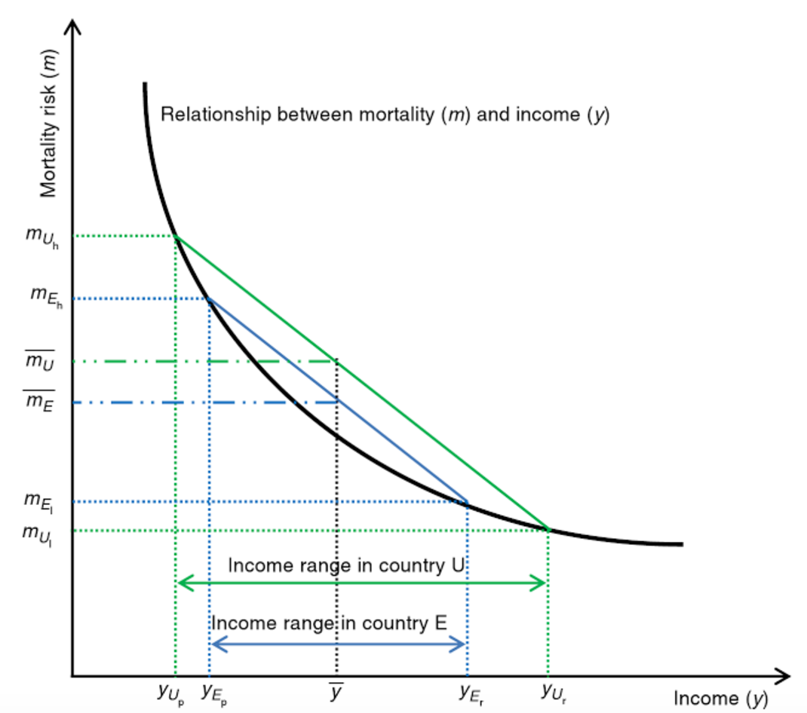

--- 
knit: "bookdown::preview_chapter"
---

# The Role of Theory in Global Health {#theory}

> **Global health, many would agree, is more a bunch of problems than a discipline.** As such it lacks theories that can generalise findings—through an iterative process of knowledge construction, empirical testing, critique, new generalisation, and so on—into durable intellectual frameworks that can be applied not only to distinctive health problems, but to different contexts and future scenarios.

That's psychiatrist and medical anthropologist [Arthur Kleinman](kleinman2010) writing in *The Lancet* about the atheoretical approach that characterizes much of global health research [@kleinman2010]. Rather than test and build theory though the hypothetico-deductive model—that is, making predictions based on theory and collecting data to test these predictions—global health scholars and practitioners mostly solve problems. 

Yes, you'll find a veneer of the hypothetico-deductive model in our work, a hypothesis here and there, but across a large swath of the research landscape in global health, we test empty hypotheses that do not put theory to the test. We ask questions like, "Does `MY PROGRAM` improve `IMPORTANT HEALTH OUTCOME`?" We then hypothesize that, yes, `MY PROGRAM` will improve health compared to `NOT MY PROGRAM`, and use a statistical model to test whether the improvement is equal to zero.[^notstated]

[^notstated]: Frequently you'll find that authors do not even explicitly state this type of hypothesis.

Skeptical? Let's put this claim to the test. Based on the Kleinman theory of the atheoretical  practice of global health[^kleinman], I hypothesize that a search of recent research articles published in a leading global health journal will turn up no evidence that the studies sought to contribute to theory. To test this hypothesis, I found the latest issue of *The Lancet Global Health* ([July 2019, Vol 7, Num 7](https://www.thelancet.com/journals/langlo/issue/vol7no7/PIIS2214-109X(19)X0008-X)) and searched the 13 original research articles for the words `theor*`, `conceptual`, `hypoth*`, and `mechanis*`. Here's what I found: nothing. None of the articles had anything to say about theory.[^weak] Should we have expected something different?

[^kleinman]: Apologies to Professor Kleinman. If you read his article, you'll see that he goes on from this observation to offer four social theories for global health that could help us critically reflect on illness and the practice of medicine.

[^weak]: But of course we don't say the results of any one study, especially one as poor as this, "prove" a hypothesis.

Several studies were descriptive in nature, so we might not expect them to have much of a theoretical basis or any hypothesis testing to falsify a theory. For instance, @blencowe2019 estimated prevalence of low birth weight for 195 countries from 2000 to 2015. @hsia2019 described the use of antibiotics to treat pediatric patients across 56 countries. And @ahmed2019 estimated modern contraceptive prevalence rates across eight sub-Saharan African countries. To use Kleinman's phrase, these articles reported on a bunch of problems.[^kleinmanbunch]

[^kleinmanbunch]: And good that they did. Descriptive work like this helps us to understand problems.

```{marginfigure}
I don't intend to pick on these studies. Each one makes an important contribution to the literature. @wagg2019 find that a simple group-exercise intervention helps manage urinary incontinence in rural, older Bangladeshi women who might not be able to access pharmaceutical or surgical interventions. @sullender2019 report that vaccinating children in India against influenza had short-term, indirect protective effects for unvaccinated household members. And @gureje2019 show that a stepped care intervention for depression delivered by community health workers did not result in a clinically significant benefit compared to enhanced usual care, but might be more cost-effective to implement for the same outcome.
```

The collection of articles did, however, include several intervention trials [@wagg2019; @sullender2019; @gureje2019] that had the potential to contribute to theory, but did not (at least not directly). Instead, these trials sought only to estimate the effect of each intervention on the primary outcome and make an evidence-based claim about whether the intervention "worked", but not why or why not. Some would call these trials examples of **"black box" evaluations**. A black box evaluation is one that looks to see if `X` leads to `Y`—does the intervention improve some health outcome—but does not explore the mechanisms of this change (or the failure to change).

```{r bb, fig.cap="Black box evaluations.", echo=F, fig.margin=FALSE, fig.fullwidth = FALSE}
knitr::include_graphics("images/blackbox.png")
```

Scholars have been lamenting this black box trend for some time, and not just in global health. @chen1989 wrote about the need for *theory-driven evaluation* and criticized theoretically-empty program evaluations as being "at best social accounting studies that enumerate clients, describe programs and sometimes count outcomes".[^stame] Writing about evaluation in international development, @white:2009 called for *theory-based impact evaluation* to open the black box approach. More recently, @wilke2019 observed the same trend in political science and economics with the rise of black box field experiments.

[^stame]: See @stame2004 for an interesting discussion of black box evaluations in the program evaluation literature.

Is theory dead? Does it even matter?

## Theory, what is it good for? (supposedly somethin')

@wilke2019 consider this question and make a strong, affirmative case for theory. Citing economist, Nobel laureate, and black box evaluation critic Sir Angus Deaton [-@deaton2010], the authors remind us that many scholars believe the whole point of research is to learn about theories—to understand *how* the world works. Let's consider a few roles for theory before turning to an example of theory in action.[^leavingout]

[^leavingout]: Items 2-5 in this list come from @wilke2019. I leave out two additional items from the authors' original list: denying that we need theory in the first place and using experiments to estimate structural models. Read their paper to learn what you missed.

**1. Use theory to improve intervention design**

You'd be surprised how often organizations get funding to implement a Program `X` that promises to make Outcome `Y` better without very much thought about how doing `X` will bring about change in `Y`. In the second half of this chapter, my aim will be to convince you that it's easy and worthwhile to think critically about this issue and develop what we call a theory of change.

**2. Use theory to improve research design**

For reasons that are a bit too technical for this point in our journey, theory can help us design better experiments. For instance, theory can inform the choices we make about where to conduct a study, which treatments to examine, how to recruit participants and randomize them to different study arms, and what variables to measure alongside the outcome of interest. We'll focus on this last point in the next chapter.

**3. Use theory to improve inferences**

Imagine that you are a policymaker in Pakistan interested in geriatric health and you come across the paper by @wagg2019 in *The Lancet Global Health* (discussed above). You want to know whether the group-exercise intervention they tested in rural Bangladesh is a good use of public funds in Pakistan. @wagg2019 reported good effects in the Bangladesh trial and, despite listing several limitations, concluded (without evidence or justification) that "these results would likely be generalisable to other communities with few resources in which physiotherapists are working with groups of older people in the community". But you might wonder if the results will really travel to your setting and hold despite some necessary contextual changes to the program design you'll need to make. @wilke2019 suggest that drawing your assumptions in a causal model could help to extend the inferences you can make from this one study in Bangladesh.

**4. Use empirical studies to BUILD theory**

In the same way that we can use qualitative research to observe the world and, through induction, generate ideas we can test in future studies, we can also use quantitative evaluations to *generate* theory. On this point you might find authors of black box evaluations quick to say, "But we do this!" In some cases this is probably true, at least in their own minds. I know that I accumulate ideas generated from my work that I do not formally document as theoretical ideas in a *Discussion* section of any particular article.[^conceptual] My reading of @wilke2019 is a reminder that empirical work is important for theory generation, even if not explicitly linked to published study results.

[^conceptual]: To find writing about theory generation, look for articles with the word "conceptual" in the title [e.g., @li2015].

**5. Use empirical studies to TEST theory**

This brings us back to the hypothetico-deductive model of science: use theory to generate falsifiable predictions and collect data to test these hypotheses. This is the classic deductive approach to science that some would argue is missing from global health studies. 

## An example of theory in action

```{r PfATP4, fig.cap="The putative role of PfATP4 in Na+ homeostasis in the malaria parasite, *P. falciparum*. Source: @spillman2015.", echo=F, fig.margin=TRUE, fig.fullwidth = FALSE}

```

While much of global health might be described as atheoretical, you can find good examples of theory-informed research if you know where to look. One area to explore is basic science and early phase clinical trials where scientists develop theories about the [**mechanism of action**](https://en.wikipedia.org/wiki/Mechanism_of_action) of drug candidates. For instance, @spillman2015 reviewed studies that have tested hypotheses derived from a theory that the protein 'PfATP4' plays a role in helping malaria parasites to maintain a low cytosolic Na+ concentration and receive energy.

Another area is development economics. Let's consider an experiment from Dr. Pascaline Dupas on HIV education in Kenya [@dupas:2011]. I consider it to be an interesting example of theory building and testing. Download your copy [here](https://tinyurl.com/yyog2w59).

### EVALUATING WHAT WORKS IN HIV EDUCATION

In 2014, an [estimated 1.4 million](http://www.unaids.org/en/regionscountries/countries/kenya) people in Kenya were living with HIV, a prevalence rate of 5.3% among adults aged 15 to 49. Without a cure for AIDS, prevention remains critical to ending the epidemic.

Starting in 2001, Kenya integrated HIV/AIDS education into the primary school curriculum as a new prevention strategy [@jpal:2007]. At the time, the focus of this program—and many other programs across sub-Saharan Africa—was complete *risk avoidance*, otherwise known as abstinence. Information on *risk reduction* was limited. Specifically, students were not learning about the differential prevalence of HIV infection by age and gender. Girls were not learning that the older "sugar daddies" who provide nice things like phones and airtime in return for sex are more likely than the girls' goofy age mates to be infected.

An organization called [International Child Support (ICS) Africa](http://www.ics.nl/en/home/) aimed to change this by rolling out a "Relative Risk Information Campaign" in Kenya. The intervention was brilliant in its simplicity. A program staffer would talk with students for 40 minutes. During this time, the staffer showed the class a 10-minute video on sugar daddies and led a discussion about cross-generational sex. During the session, the staffer reviewed results of recent studies and wrote facts about the distribution of HIV prevalence on the chalk board.

Researchers from the Abdul Latif Jameel Poverty Action Lab (JPAL) tested ICS Africa's risk reduction strategy in a randomized experiment in Western Kenya. In the first phase (2003), 328 schools were randomized to teacher training on the national HIV prevention curriculum [@duflo:2006]. In the second phase (2004), 71 of these schools were stratified and randomized to receive the sugar daddy intervention [@dupas:2011]. In total, there were 4 study arms: (1) teacher training only, (2) sugar daddy only, (3) teacher training and sugar daddy, and (4) nothing.

The results were shocking. Teacher training was a bust. Although the training led to a change in teaching practices—notably that trained teachers mentioned HIV in class more often than nontrained teachers—it had little effect on HIV knowledge or childbearing rates.

```{marginfigure}
Increasing knowledge about HIV makes intuitive sense as an outcome for a study about HIV prevention. But why childbearing? \*thinks\*. Because it is harder to lie about having a baby than it is to lie about private sexual behavior, childbearing is considered a more objective measure of unprotected sex. Unprotected sex is also a main driver of HIV transmission, so childbearing serves as a proxy for HIV risk from unprotected sex.
```

In contrast, the 40-minute sugar daddy discussion and video reduced childbearing with men at least 5 years older by 65%—and not because girls started having babies with males their own age. The overall incidence of childbearing fell by 28%. With a cost of $28.20 USD per school and $0.80 per student, the cost per childbirth averted was $91 [@jpal:2007].

### THE THEORY BEHIND THE RELATIVE RISK REDUCTION CAMPAIGN

```{r rrcftext, fig.cap="Written description of the relative risk reduction conceptual framework. Source: @dupas:2011.", echo=F, fig.margin=TRUE, fig.fullwidth = FALSE}

```

Unlike *The Lancet Global Health* articles referenced above, @dupas:2011, which was published in the *American Economic Journal: Applied Economics*, includes a long *Introduction* to set up the paper, a thorough background section that discusses HIV education in Kenya, and a section called "Theoretical Motivation".

In this section, Dupas proposes a conceptual framework that I have attempted to present visually in the figure below. This framework puts forward a theory of why teenage girls engage in unprotected sex with older men. Core to the theory is an assumption that girls do not have information about the relative risk of contracting HIV from older men compared to their male peers. As Dupas explains:

> Teenage girls maximize their expected utility based on their beliefs about the risks of HIV infection and pregnancy occurring, and how those risks vary with condom use and partners' characteristics.

```{r rrc, fig.cap="A visual representation of the @dupas:2011 conceptual framework for relative risk reduction. Visualization by Yours Truly, not necessarily endorsed by Dupas.", echo=F, fig.margin=FALSE, fig.fullwidth = TRUE}

```

Dupas goes on to derive several predictions from this framework (sounds very hypothetico-deductive, right?). Here is one such prediction:

> If all men have the same reservation price for sex with teenage girls (...), information on the distribution of [HIV] prevalence among men unambiguously leads teenage girls to move toward lower-risk partners (teenage boys) and thus reduce the rate of cross-generational transmission of HIV.[^probtheory]

[^probtheory]: Outside of the physical sciences, most theories are probabilistic. Rather than hypothesizing that what goes up must come down, we hypothesize that coming down will be more likely. 

In other words, all else equal, telling girls that older men are riskier sexual partners should lead them to have less sex with older men. That is a testable hypothesis. So what did she find?[^solo]

> in response to the RR information, teenage girls substituted away from older partners and toward protected sex with teenage partners, but not more than one-for-one.

[^solo]: Econ papers are different in more ways than just structure and length. Solo authored papers like this one are very uncommon in other disciplines like public health and medicine.

And there you have it: proof that global health is not completely atheoretical! 

## Get to know a conceptual framework/model

Your exposure to conceptual models—and your ideas about what makes a good model—will depend in part on the disciplinary home of the literature you read most often. But at the core, every **model** is a simplified representation of a more complex reality. A plastic replica of the human heart is a model. So is an epidemic model of Ebola transmission. Neither one is perfect, but both are valuable tools for teaching and learning. As the mathematician and statistician George Box famously wrote, "Essentially, all models are wrong, but some are useful" [@box:1987]. Let's take a discipline-specific tour of conceptual models before landing on one of my favorites, the theory of change.

### IN PSYCHOLOGY AND RELATED DISCIPLINES

```{r hbm, fig.cap="Health belief model. Source: http://bit.ly/2i9Lw0Ehbm.jpg", echo=F, fig.margin=TRUE, fig.fullwidth = FALSE}
knitr::include_graphics("images/hbm.jpg")
```

Conceptual models are very common in psychology, public health, and related fields. One of the most commonly used conceptual models in the study of health behavior change is the health belief model (Figure \@ref(fig:hbm)). The health belief model was developed in the 1950s when researchers in the U.S. Public Health Service were trying to understand why people were reluctant to engage in preventive health behaviors [@rosenstock:1974]. This model suggests that health behaviors are explained by a person's (a) perception of the benefits versus risks of action, (b) perceived threat from the health issue, (c) self-efficacy for change, and (d) cues to take action.

```{r imb, fig.cap="Information-motivation-behavioral skills model", echo=F, fig.margin=TRUE, fig.fullwidth = FALSE}

```

Another example is the information-motivation-behavioral skills (IMB) model proposed by @fisher:1992 to explain HIV-related risk behaviors (Figure \@ref(fig:imb)). Conceptual models like this one can be tested empirically (i.e., with data). For instance, @zhang:2011 explored the fit of the IMB model to data on condom use among female commercial sex workers in China. Figure \@ref(fig:imbmodel) (below) is a **path diagram** showing the results of a structural equation model that was fit to the data. 

### IN EPIDEMIOLOGY

#### Directed Acyclic Graphs (Causal diagrams) {-}

```{r dag, fig.cap="Graphical presentation of confounding in directed acyclic graphs. Identification of a minimal set of factors to resolve confounding. In (a), the backdoor path from chronic kidney disease (CKD) to mortality can be blocked by just conditioning on age, as depicted by the box around age. However if we assume that cancer also causes CKD (b), the backdoor paths can only be closed by conditioning on two factors, either age and cancer (as depicted) or cancer and dementia. Source: @suttorp:2015.", echo=F, fig.margin=TRUE, fig.fullwidth = FALSE}
knitr::include_graphics("images/dag.jpg")
```

A related type of causal diagram is the directed acyclic graph, or DAG (or causal diagram/graph). This idea from mathematics and computer science has been applied to observational research to identify potential confounding variables that need to be addressed to make valid causal inferences [@greenland:1999]. Figure \@ref(fig:dag) shows two DAGs. In this example, @suttorp:2015 shows that, at a minimum, it is necessary to control for age when estimating the relationship between chronic kidney disease and mortality (a). But if we also assume that cancer is directly related to kidney disease (b), it is also important to control for cancer. Drawing out these relationships helps clarify that it may not be necessary to control for dementia because there is no direct relationship between dementia and kidney disease. We'll review causal diagrams in more detail in [**Chapter 8**](observational).

#### Epidemic model {-}

```{r ebolamodel, fig.cap="Compartmental flow of a mathematical model of the Ebola Epidemic in Liberia and Sierra Leone, 2014. Source: @rivers:2014.", echo=F, fig.margin=TRUE, fig.fullwidth = FALSE}

```

Epidemic models are used to explain or predict the spread of an epidemic. @kermack:1927 proposed a deterministic compartmental model called SIR that consists of the number of uninfected people susceptible to the disease (S), the number of infected (I), and the number of people removed (R) through death or immunization. @rivers:2014 used this basic framework to create a compartmental model of the 2014 Ebola outbreak in Liberia and Sierra Leone (Figure \@ref(fig:ebolamodel)):

* Susceptible (S)
* Exposed (E)
* Infectious (I)
* Hospitalized (H)
* Funeral (F; handling bodies) 
* Recovered/Removed (R)

### IN STATISTICS

```{r imbmodel, fig.cap="Information-Motivation-Behavioral Skills structural equation model. Source: @zhang:2011.", echo=F, fig.margin=TRUE, fig.fullwidth = FALSE}

```

Statistical models are nondeterministic and thus incorporate stochastic variables. In other words, some of the variables being modeled have probability distributions rather than constant inputs like those in physics or mathematics. Statistical models are typically communicated as a set of equations and are visualized as a set of results. An exception is the path diagram represented visually in Figure \@ref(fig:imbmodel).

### IN ECONOMICS

```{r economic, fig.cap="Effect of increased inequality on population mortality. Source: @wildman:2014.", echo=F, fig.margin=TRUE, fig.fullwidth = FALSE}

```

Economic models can be stochastic or nonstochastic. The field of econometrics shares much in common with statistics, including a focus on stochastic models. Economics more broadly, however, also uses nonstochastic models. For instance, Figure \@ref(fig:economic) shows the hypothesized mathematical relationship between mortality and income [@wildman:2014]. This graph is based on theory and does not plot actual empirical data collected in a particular setting.

## Theory of change

```{marginfigure}
<iframe width="300" height="169" src="https://www.youtube.com/embed/wUiKdwgJpD8" frameborder="0" allow="accelerometer; autoplay; encrypted-media; gyroscope; picture-in-picture" allowfullscreen></iframe> Theory of Change: It's Easier Than You Think. Chemonics International (2018). Source: [https://tinyurl.com/y5fc8m6l](https://tinyurl.com/y5fc8m6l).
```

Underneath any good claim of causal inference is a theoretical model of how the researcher thinks `X` actually causes `Y`. Few studies set out to test a specific mechanism of impact, but many impact evaluations are designed around a theory about how the world works. This is called a theory of change. It's a type of conceptual model used extensively in the evaluation literature.

A **theory of change** articulates how an intervention—or a policy, program, or treatment—is expected to impact an outcome. It explains how `X` causes `Y`, and what is needed for this to happen. This concept may be referred to as a theory of change, a mechanism of change, a logic model, a logical framework, a causal model, a results chain, a pipeline model, a results framework, a program theory, or one of several other combinations of these terms. Let's review strategies for creating a theory of change diagram and its cousin the logic model as a precursor to thinking about study measurement.

### DEVELOPING A THEORY OF CHANGE

Theory of change diagrams can be designed in various ways. There is no RIGHT WAY™ to create one, as long as the fundamentals of how `X` leads to `Y` are conveyed. If the diagram is easy to understand, it is a good diagram.

```{marginfigure}
<iframe width="300" height="169" src="https://www.youtube.com/embed/urU-a_FsS5Y" frameborder="0" allow="accelerometer; autoplay; encrypted-media; gyroscope; picture-in-picture" allowfullscreen></iframe> Building Adult Capabilities to Improve Child Outcomes: A Theory of Change. 
Center on the Developing Child at Harvard University (2013). Source: [https://tinyurl.com/y4a3n25a](https://tinyurl.com/y4a3n25a).
```

Most theory of change diagrams include a few common elements. The United Kingdom's Department for International Development, commonly known as DFID or UK Aid, commissioned [a report](https://www.gov.uk/government/news/dfid-research-review-of-the-use-of-theory-of-change-in-international-development) on the uses of theories of change in international development that identified several common components:

* Influence of context
* Discussion of long-term change
* Process/sequence of change explained
* Underlying assumptions
* Presented as a diagram and narrative summary

My preferred approach to outlining a theory of change is to follow this template from the [W.K. Kellogg Foundation](http://www.wkkf.org/resource-directory/resource/2006/02/wk-kellogg-foundation-logic-model-development-guide). Here is an [editable Google Docs version](https://docs.google.com/presentation/d/1VImOlbPeZm-SmBoPewzvuomWEblbf2BzKBl30IqYUwY/edit?usp=sharing).

```{r tfttemplate, fig.cap="Theory of change template. Source: W.K. Kellogg Foundation, http://bit.ly/1My75Ay.", echo=F, fig.margin=FALSE, fig.fullwidth = TRUE}
knitr::include_graphics("images/kellogg.png", dpi = NA)
```

Start with the (research) problem statement (**Box 1**). This box gets at the heart of the reason the intervention exists. What is the problem to solve? Although this seems obvious, too often there is a disconnect between the primary aim—solving a problem or answering a research question—and the intervention strategy.

Next, take and inventory of the assets that already exist and the needs that remain (**Box 2**). There is always something to build upon, so it is important to look for strengths in addition to challenges. This process is best conducted in collaboration with people impacted by the problem so that the proposed solution is grounded in their reality. If available, descriptive data sources like the DHS can help to outline boxes 1 and 2. For a more local perspective, it is often beneficial to conduct a brief needs assessment in partnership with representatives from the local community if resources permit.

**Box 3** jumps to the desired results. If the program works, what will change? With the results articulated, reconsider the factors that might affect the program's success positively or negatively (**Box 4**).

The next step is to outline strategies for achieving the desired results, accounting for potential barriers and facilitators (**Box 5**). At this point, what the program will actually do should be stated clearly.

Finally, **Box 6** reminds us that every theory of change is built on a set of assumptions. It is important to be thorough and transparent when considering the hidden beliefs that underlie the ideas about how this program will achieve results.

### THEORY OF CHANGE EXAMPLE: HIV RISK REDUCTION

Let's return to our relative risk reduction example from @dupas:2011 and use this template to create a theory of change. Take a moment to compare this theory of change diagram to the previous conceptual framework.  

```{r sugar, fig.cap="Sugar daddy awareness theory of change.", echo=F, fig.margin=FALSE, fig.fullwidth = TRUE}
knitr::include_graphics("images/sugardaddytoc.png", dpi = NA)
```

## Logic model

While a theory of change tends to be a high-level depiction of the "why", a **logic model**—or [logframe](https://www.gov.uk/government/publications/dfid-how-to-note-guidance-on-using-the-revised-logical-framework)—is more detailed and focuses on the "how". Logical models are useful tools for program planning, monitoring program implementation, and program evaluation and reporting. 

### DEVELOPING A LOGIC MODEL

```{marginfigure}
If you leave school and take a job in global health or international development—especially if you work at USAID, DFID, or one of their grantees/contractors—you'll become very familiar with theory of change diagrams and logic models. The most common thing that former students write to tell me is that they impressed the boss by knowing how to create a logic model on Day 1. You're welcome.
```

Logic models are often presented in the "results chain" or "pipeline" format shown in Figure \@ref(fig:logicmodel). Inputs and activities represent the planned work. Outputs, outcomes, and impact are the intended results.

```{r logicmodel, fig.cap="Logic model. Source: W.K. Kellogg Foundation, http://bit.ly/1My75Ay.", echo=F, fig.margin=FALSE, fig.fullwidth = FALSE}
knitr::include_graphics("images/wkkflog.png", dpi = NA)
```

**Inputs** are the resources needed to implement the program, most often including people, money, program materials, and time. **Activities** comprise what the program will do, like trainings, events, and distribution of goods. 

**Outputs** are counts of what the program did, such as the number of people trained, number of events held, number of goods delivered and number of people who benefitted. Conversely, **outcomes** are expected indicators of change—the short- and medium-term results of the program. Examples of outcomes include increased knowledge, decreased risky behavior, and improved functioning. Similar to outcomes, **impacts** are what you expect will happen in the long-run as a result of the program. Things like lower HIV prevalence and reduced mortality.

Judging by the eyerolls I observe in class, it must seem redundant to students to further explain the difference between outputs and outcomes. But judging by historical performance on the midterm, a bit of redundancy is warranted.

So think of it this way: 

* If you have money, trainers, and a curriculum (the inputs) and use these resources to deliver a program (the activity) to groups of people, outputs are the count of how many times you delivered the program and how many people you reached. 
* Outcomes are the changes that happen as a result of delivering the program.[^outcomenote]

[^outcomenote]: Whether or not you can attribute these changes to your program is a matter of your research design. That will be our major focus in Chapters 8-11.

So what's the difference between an outcome and impact? Generally speaking, impacts are longer-term changes to population-level indicators. Most studies are too small and short to actually detect any change in "impacts". For instance, in the Kenya HIV risk reduction program the ultimate goal was to reduce HIV transmission, but the study "only" estimated the impact of the program on unprotected sex (the outcome). The assumption is that reducing unprotected sex in the short-term will reduce HIV transmission over the longer term if the program were to be scaled-up.

### LOGIC MODEL EXAMPLE: HIV RISK REDUCTION

Figure \@ref(fig:sugar2) shows what a logic model might look like for the relative risk reduction program.

```{r sugar2, fig.cap="Sugar daddy awareness logic model.", echo=F, fig.margin=FALSE, fig.fullwidth = TRUE}
knitr::include_graphics("images/sugarlogic.png", dpi = NA)
```

## The Takeaway 

It's been said that global health is more a bunch of problems than a discipline. If you pick up a recent article on a global health topic, chances are good that you won't find much, if any, reference to theory. Instead, black box evaluations are the norm. These studies ask "does my intervention work, and to what degree", but not why, why not, or how. There are compelling reasons to think that more fully integrating theory into our work would benefit our studies in terms of design and inference, while also advancing the progress of science. As shown in the Kenya relative risk reduction evaluation, a good conceptual framework can clarify the theoretical motivation underlying your intervention. One common form of conceptual model in the evaluation literature is called a theory of change. A theory of change lifts the lid on the black box and states how intervention activities are hypothesized to generate outcomes, and what assumptions must hold for this to happen. Another way to draw these assumptions is called a logic model. Both models serve as an excellent bridge to our next topic: measurement.

###### Share Your Feedback{-}

This book is a work in progress, so I'd really appreciate your feedback on this chapter.

<iframe height="600" width="690" src="https://duke.qualtrics.com/jfe/form/SV_bgAb10is71e6zRz" frameborder="0"></iframe>
