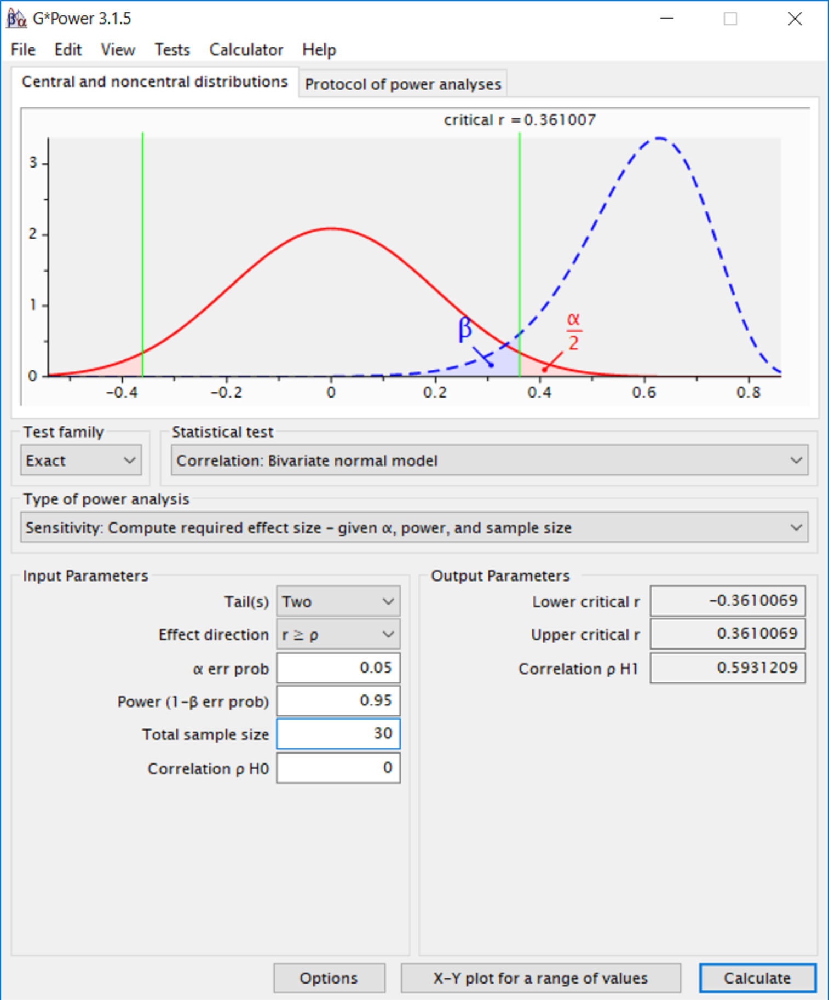

```{r, include = FALSE}
source("include/globals.R")

# needed to make the chapter (not visible)
library(pwr)
library(BUCSS)
library(TOSTER)
library(MASS)
library(MOTE)
library(ggplot2)
library(patchwork)

# library(Superpower) # not used?

```

# Sample Size Justification {#power}

*You can listen to an audio recording of this chapter [here](https://soundcloud.com/lakens/sample-size-justification-by-daniel-lakens).*

Scientists perform empirical studies to collect data that helps to answer a research question. The more data that is collected, the more informative the study will be with respect to its inferential goals. A sample size justification should consider how informative the data will be given an inferential goal, such as estimating an effect size, or testing a hypothesis. Even though a sample size justification is sometimes requested in manuscript submission guidelines, when submitting a grant to a funder, or submitting a proposal to an ethical review board, the number of observations is often simply *stated*, but not *justified*. This makes it difficult to evaluate how informative a study will be. To prevent such concerns from emerging when it is too late (e.g., after a non-significant hypothesis test has been observed), researchers should carefully justify their sample size before data is collected. In this chapter, which is largely identical to @lakens_sample_2022, we will explore in detail how to justify your sample size. 

```{r table-pow-just, echo = FALSE, results = 'asis'}

table_pow_justifications <- data.frame(c(
  "Measure entire population", 
  "Resource constraints",
  "Accuracy",
  "A-priori power analysis",
  "Heuristics",
  "No justification"), 
  c("A researcher can specify the entire population, it is finite, and it is possible to measure (almost) every entity in the population.", 
    "Limited resources are the primary reason for the choice of the sample size a researcher can collect.", 
    "The research question focusses on the size of a parameter, and a researcher collects sufficient data to have an estimate with a desired level of accuracy.",
    "The research question aims to test whether certain effect sizes can be statistically rejected with a desired statistical power.", 
    "A researcher decides upon the sample size based on a heuristic, general rule or norm that is described in the literature, or communicated orally.",
    "A researcher has no reason to choose a specific sample size, or does not have a clearly specified inferential goal and wants to communicate this honestly."))
colnames(table_pow_justifications) <- c("Type of justification", "When is this justification applicable?")

table_print <- knitr::kable(table_pow_justifications, booktabs = T, caption = "Overview of possible justifications for the sample size in a study.") 

table_print <- kableExtra::column_spec(table_print, 1, width = "5cm")
table_print <- kableExtra::column_spec(table_print, 2, width = "10cm")
table_print
```

## Six Approaches to Justify Sample Sizes

Researchers often find it difficult to justify their sample size (i.e., a number of participants, observations, or any combination thereof). In this review article six possible approaches are discussed that can be used to justify the sample size in a quantitative study (see Table \@ref(tab:table-pow-just)). This is not an exhaustive overview, but it includes the most common and applicable approaches for single studies. The topic of power analysis for meta-analyses is outside the scope of this manuscript, but see @hedges_power_2001 and @valentine_how_2010. The first justification is that data from (almost) the entire population has been collected. The second justification centers on resource constraints, which are almost always present, but rarely explicitly evaluated. The third and fourth justifications are based on a desired statistical power or a desired accuracy. The fifth justification relies on heuristics, and finally, researchers can choose a sample size without any justification. Each of these justifications can be stronger or weaker depending on which conclusions researchers want to draw from the data they plan to collect.

All of these approaches to the justification of sample sizes, even the 'no justification' approach, give others insight into the reasons that led to the decision for a sample size in a study. It should not be surprising that the 'heuristics' and 'no justification' approaches are often unlikely to impress peers. However, it is important to note that the value of the information that is collected depends on the extent to which the final sample size allows a researcher to achieve their inferential goals, and not on the sample size justification that is chosen. 

The extent to which these approaches make other researchers judge the data that is collected as *informative* depends on the details of the question a researcher aimed to answer and the parameters they chose when determining the sample size for their study. For example, a badly performed a-priori power analysis can quickly lead to a study with very low informational value. These six justifications are not mutually exclusive, and multiple approaches can be considered when designing a study.

## Six Ways to Evaluate Which Effect Sizes are Interesting

The informativeness of the data that is collected depends on the inferential goals a researcher has, or in some cases, the inferential goals scientific peers will have. A shared feature of the different inferential goals considered in this review article is the question which effect sizes a researcher considers meaningful to distinguish. This implies that researchers need to evaluate which effect sizes they consider interesting. These evaluations rely on a combination of statistical properties and domain knowledge. In Table \@ref(tab:table-effect-eval) six possibly useful considerations are provided. This is not intended to be an exhaustive overview, but it presents common and useful approaches that can be applied in practice. Not all evaluations are equally relevant for all types of sample size justifications. The online Shiny app accompanying this manuscript provides researchers with an interactive form that guides researchers through the considerations for a sample size justification. These considerations often rely on the same information (e.g., effect sizes, the number of observations, the standard deviation, etc.) so these six considerations should be seen as a set of complementary approaches that can be used to evaluate which effect sizes are of interest.

To start, researchers should consider what their smallest effect size of interest is. Second, although only relevant when performing a hypothesis test, researchers should consider which effect sizes could be statistically significant given a choice of an alpha level and sample size. Third, it is important to consider the (range of) effect sizes that are expected. This requires a careful consideration of the source of this expectation and the presence of possible biases in these expectations. Fourth, it is useful to consider the width of the confidence interval around possible values of the effect size in the population, and whether we can expect this confidence interval to reject effects we considered a-priori plausible. Fifth, it is worth evaluating the power of the test across a wide range of possible effect sizes in a sensitivity power analysis. Sixth, a researcher can consider the effect size distribution of related studies in the literature.  

```{r table-effect-eval, echo = FALSE, results = 'asis'}

table_effect_eval <- data.frame(c(
  "Smallest effect size of interest", 
  "The minimal statistically detectable effect",
  "Expected effect size", 
  "Width of confidence interval",
  "Sensitivity power analysis",
  "Distribution of effect sizes in a research area"), 
  c("What is the smallest effect size that is considered theoretically or practically interesting?", 
    "Given the test and sample size, what is the critical effect size that can be statistically significant?", 
    "Which effect size is expected based on theoretical predictions or previous research?", 
    "Which effect sizes are excluded based on the expected width of the confidence interval around the effect size?", 
    "Across a range of possible effect sizes, which effects does a design have sufficient power to detect when performing a hypothesis test?",
    "What is the empirical range of effect sizes in a specific research area and which effects are a priori unlikely to be observed?"))

colnames(table_effect_eval) <- c("Type of evaluation", "Which question should a researcher ask?")

table_print <- knitr::kable(table_effect_eval, caption = "Overview of possible ways to evaluate which effect sizes are interesting.")

table_print <- kableExtra::column_spec(table_print, 1, width = "5cm")
table_print <- kableExtra::column_spec(table_print, 2, width = "10cm")
table_print


```

## The Value of Information

Since all scientists are faced with resource limitations, they need to balance the cost of collecting each additional datapoint against the increase in information that datapoint provides. This is referred to as the *value of information* [@eckermann_value_2010]. Calculating the value of information is notoriously difficult [@detsky_using_1990]. Researchers need to specify the cost of collecting data, and weigh the costs of data collection against the increase in utility that having access to the data provides. From a value of information perspective not every data point that can be collected is equally valuable [@wilson_practical_2015; @halpern_sample_2001]. Whenever additional observations do not change inferences in a meaningful way, the costs of data collection can outweigh the benefits.

The value of additional information will in most cases be a non-monotonic function, especially when it depends on multiple inferential goals. A researcher might be interested in comparing an effect against a previously observed large effect in the literature, a theoretically predicted medium effect, and the smallest effect that would be practically relevant. In such a situation the expected value of sampling information will lead to different optimal sample sizes for each inferential goal. It could be valuable to collect informative data about a large effect, with additional data having less (or even a negative) marginal utility, up to a point where the data becomes increasingly informative about a medium effect size, with the value of sampling additional information decreasing once more until the study becomes increasingly informative about the presence or absence of a smallest effect of interest.

<!-- ```{r, non-monotonic, fig.cap="(Example of a non-monotonically increasing value of information as a function of the sample size.)"} -->
<!-- plot(-1000, xlim = c(0,1600), ylim = c(0,1000), xlab = "Sample Size", ylab = "Value of Information", main = "", cex.lab = 1.3, cex.axis = 1.2, yaxt ='n') -->
<!-- g <- function(x) x/2 + 110 * sin(0.01 * x) -->
<!-- curve(g, 0, 1600, lwd = 3, add = TRUE) -->
<!-- ``` -->

Because of the difficulty of quantifying the value of information, scientists typically use less formal approaches to justify the amount of data they set out to collect in a study. Even though the cost-benefit analysis is not always made explicit in reported sample size justifications, the value of information perspective is almost always implicitly the underlying framework that sample size justifications are based on. Throughout the subsequent discussion of sample size justifications, the importance of considering the value of information given inferential goals will repeatedly be highlighted.

## Measuring (Almost) the Entire Population

In some instances it might be possible to collect data from (almost) the entire population under investigation. For example, researchers might use census data, are able to collect data from all employees at a firm or study a small population of top athletes. Whenever it is possible to measure the entire population, the sample size justification becomes straightforward: the researcher used all the data that is available.

## Resource Constraints

A common reason for the number of observations in a study is that resource constraints limit the amount of data that can be collected at a reasonable cost  [@lenth_practical_2001]. In practice, sample sizes are always limited by the resources that are available. Researchers practically always have resource limitations, and therefore even when resource constraints are not the primary justification for the sample size in a study, it is always a secondary justification. 

Despite the omnipresence of resource limitations, the topic often receives little attention in texts on experimental design (for an example of an exception, see @bulus_bound_2021). This might make it feel like acknowledging resource constraints is not appropriate, but the opposite is true: Because resource limitations always play a role, a responsible scientist carefully evaluates resource constraints when designing a study. Resource constraint justifications are based on a trade-off between the costs of data collection, and the value of having access to the information the data provides. Even if researchers do not explicitly quantify this trade-off, it is revealed in their actions. For example, researchers rarely spend all the resources they have on a single study. Given resource constraints, researchers are confronted with an optimization problem of how to spend resources across multiple research questions.

Time and money are two resource limitations all scientists face. A PhD student has a certain time to complete a PhD thesis, and is typically expected to complete multiple research lines in this time. In addition to time limitations, researchers have limited financial resources that often directly influence how much data can be collected. A third limitation in some research lines is that there might simply be a very small number of individuals from whom data can be collected, such as when studying patients with a rare disease. A resource constraint justification puts limited resources at the center of the justification for the sample size that will be collected, and *starts* with the resources a scientist has available. These resources are translated into an expected number of observations (*N*) that a researcher expects they will be able to collect with an amount of money in a given time. The challenge is to evaluate whether collecting *N* observations is worthwhile. How do we decide if a study will be informative, and when should we conclude that data collection is *not* worthwhile?

When evaluating whether resource constraints make data collection uninformative, researchers need to explicitly consider which inferential goals they have when collecting data [@parker_sample_2003]. Having data always provides more knowledge about the research question than not having data, so in an absolute sense, all data that is collected has value. However, it is possible that the benefits of collecting the data are outweighed by the costs of data collection.

It is most straightforward to evaluate whether data collection has value when we know for certain that someone will make a decision, with or without data. In such situations any additional data will reduce the error rates of a well-calibrated decision process, even if only ever so slightly. For example, without data we will not perform better than a coin flip if we guess which of two conditions has a higher true mean score on a measure. With some data, we can perform better than a coin flip by picking the condition that has the highest mean. With a small amount of data we would still very likely make a mistake, but the error rate is smaller than without any data. In these cases, the value of information might be positive, as long as the reduction in error rates is more beneficial than the cost of data collection. 

Another way in which a small dataset can be valuable is if its existence eventually makes it possible to perform a meta-analysis [@maxwell_ethics_2011]. This argument in favor of collecting a small dataset requires 1) that researchers share the data in a way that a future meta-analyst can find it, and 2) that there is a decent probability that someone will perform a high-quality meta-analysis that will include this data in the future [@halpern_continuing_2002]. The uncertainty about whether there will ever be such a meta-analysis should be weighed against the costs of data collection.

One way to increase the probability of a future meta-analysis is if researchers commit to performing this meta-analysis themselves, by combining several studies they have performed into a small-scale meta-analysis [@cumming_new_2014]. For example, a researcher might plan to repeat a study for the next 12 years in a class they teach, with the expectation that after 12 years a meta-analysis of 12 studies would be sufficient to draw informative inferences (but see @ter_schure_accumulation_2019). If it is not plausible that a researcher will collect all the required data by themselves, they can attempt to set up a collaboration where fellow researchers in their field commit to collecting similar data with identical measures. If it is not likely that sufficient data will emerge over time to reach the inferential goals, there might be no value in collecting the data.

Even if a researcher believes it is worth collecting data because a future meta-analysis will be performed, they will most likely perform a statistical test on the data. To make sure their expectations about the results of such a test are well-calibrated, it is important to consider which effect sizes are of interest, and to perform a sensitivity power analysis to evaluate the probability of a Type II error for effects of interest. From the six ways to evaluate which effect sizes are interesting that will be discussed in the second part of this review, it is useful to consider the smallest effect size that can be statistically significant, the expected width of the confidence interval around the effect size, and effects that can be expected in a specific research area, and to evaluate the power for these effect sizes in a sensitivity power analysis. If a decision or claim is made, a compromise power analysis is worthwhile to consider when deciding upon the error rates while planning the study. When reporting a resource constraints sample size justification it is recommended to address the five considerations in Table \@ref(tab:table-pow-rec). Addressing these points explicitly facilitates evaluating if the data is worthwhile to collect. To make it easier to address all relevant points explicitly, an interactive form to implement the recommendations in this manuscript can be found at https://shiny.ieis.tue.nl/sample_size_justification/.

```{r table-pow-rec, echo = FALSE}

table_pow_rec <- data.frame(c(
  "Will a future meta-analysis be performed?", 
  "Will a decision or claim be made regardless of the amount of data that is available?",
  "What is the critical effect size?", 
  "What is the width of the confidence interval?", 
  "Which effect sizes will a design have decent power to detect?"), 
  c(
    "Consider the plausibility that sufficient highly similar studies will be performed in the future to make a meta-analysis possible.", 
    "If a decision is made then any data that is collected will reduce errorates. Consider using a compromise power analysis to determine Type I and Type II error rates. Are the costs worth the reduction in errors?", 
    "Report and interpret the critical effect size, with a focus on whether a expected effect sizes could yield significant results. If not indicate the interpretation of the data will not be based on p values.", 
    "Report and interpret the width of the confidence interval. What will an estimate with this much uncertainty be useful for? If the null hypothesis is true, would rejecting effects outside of the confidence interval be worthwhile (ignoring how a design might have low power to actually test against these values)?", 
    "Report a sensitivity power analysis, and report the effect sizes that can be detected across a range of desired power levels (e.g., 80%, 90%, and 95%) or plot a sensitivity analysis."
    )
  )

colnames(table_pow_rec) <- c("What to address", "How to address it?")

table_print <- knitr::kable(table_pow_rec, caption = "Overview of recommendations when reporting a sample size justification based on resource constraints.")

table_print <- kableExtra::column_spec(table_print, 1, width = "5cm")
table_print <- kableExtra::column_spec(table_print, 2, width = "10cm")
table_print

```

## A-priori Power Analysis

When designing a study where the goal is to test whether a statistically significant effect is present, researchers often want to make sure their sample size is large enough to prevent erroneous conclusions for a range of effect sizes they care about. In this approach to justifying a sample size, the value of information is to collect observations up to the point that the probability of an erroneous inference is, in the long run, not larger than a desired value. If a researcher performs a hypothesis test, there are four possible outcomes:

1. A false positive (or Type I error), determined by the $\alpha$ level. A test yields a significant result, even though the null hypothesis is true.
2. A false negative (or Type II error), determined by $\beta$, or 1 - power. A test yields a non-significant result, even though the alternative hypothesis is true.
3. A true negative, determined by 1-$\alpha$. A test yields a non-significant result when the null hypothesis is true.
4. A true positive, determined by 1-$\beta$. A test yields a significant result when the alternative hypothesis is true.

Given a specified effect size, alpha level, and power, an a-priori power analysis can be used to calculate the number of observations required to achieve the desired error rates, given the effect size. Power analyses can be performed based on standardized effect sizes or effect sizes expressed on the original scale. It is important to know the standard deviation of the effect (see the 'Know Your Measure' section) but I find it slightly more convenient to talk about standardized effects in the context of sample size justifications. Figure \@ref(fig:power-2) illustrates how the statistical power increases as the number of observations (per group) increases in an independent *t* test with a two-sided alpha level of 0.05. If we are interested in detecting an effect of *d* = 0.5, a sample size of 90 per condition would give us more than 90% power. Statistical power can be computed to determine the number of participants, or the number of items [@westfall_statistical_2014] but can also be performed for single case studies [@ferron_power_1996; @mcintosh_power_2020]


Although it is common to set the Type I error rate to 5% and aim for 80% power, error rates should be justified [@lakens_justify_2018]. As explained in the section on compromise power analysis, the default recommendation to aim for 80% power lacks a solid justification. In general, the lower the error rates (and thus the higher the power), the more informative a study will be, but the more resources are required. Researchers should carefully weigh the costs of increasing the sample size against the benefits of lower error rates, which would probably make studies designed to achieve a power of 90% or 95% more common for articles reporting a single study. An additional consideration is whether the researcher plans to publish an article consisting of a set of replication and extension studies, in which case the probability of observing multiple Type I errors will be very low, but the probability of observing mixed results even when there is a true effect increases [@lakens_too_2017], which would also be a reason to aim for studies with low Type II error rates, perhaps even by slightly increasing the alpha level for each individual study.


(ref:power-2lab) Power curve for an independent *t* test with an effect of *d* = 0.5 and α = 0.05 as a function of the sample size.

```{r, power-2, echo=FALSE, fig.width  = 8, fig.height = 8, fig.cap="(ref:power-2lab)"}
N <- 50
d <- 0.5
p_upper <- 0.05
ncp <- (d * sqrt(N / 2)) # Calculate non-centrality parameter d
plot_power_custom <- (function(d, N, p_upper) {
  ncp <- d * (N * N / (N + N))^0.5 # formula to calculate t from d from Dunlap, Cortina, Vaslow, & Burke, 1996, Appendix B
  t <- qt(1 - (p_upper / 2), df = (N * 2) - 2)
  1 - (pt(t, df = N * 2 - 2, ncp = ncp) - pt(-t, df = N * 2 - 2, ncp = ncp))
})
par(bg = backgroundcolor)
plot(-10,
  xlab = "sample size (per group)", ylab = "Power", axes = FALSE,
  main = "", xlim = c(0, N * 2), ylim = c(0, 1), cex.lab = 1.3
)
abline(v = seq(0, N * 2, (2 * N) / 10), h = seq(0, 1, 0.1), col = "lightgrey", lty = 1)
axis(side = 1, at = seq(0, 2 * N, (2 * N) / 10), labels = seq(0, 2 * N, (2 * N) / 10), cex.axis = 1.2)
axis(side = 2, at = seq(0, 1, 0.1), labels = seq(0, 1, 0.1), cex.axis = 1.2)
curve(plot_power_custom(d=d, N=x, p_upper=p_upper), 3, 2*N, type="l", lty=1, lwd=3, ylim=c(0,1), xlim=c(0,N), add=TRUE)
# points(x = N, y = (1 + pt(qt(p_upper / 2, 2 * N - 2, 0), 2 * N - 2, ncp) - pt(qt(1 - p_upper / 2, 2 * N - 2, 0), 2 * N - 2, ncp)), cex = 2, pch = 19, col = rgb(1, 0, 0, 0.5))

```

Figure \@ref(fig:power-3) visualizes two distributions. The left distribution (dashed line) is centered at 0. This is a model for the null hypothesis. If the null hypothesis is true a statistically significant result will be observed if the effect size is extreme enough (in a two-sided test either in the positive or negative direction), but any significant result would be a Type I error (the dark grey areas under the curve). If there is no true effect, formally statistical power for a null hypothesis significance test is undefined. Any significant effects observed if the null hypothesis is true are Type I errors, or false positives, which occur at the chosen alpha level. The right distribution (solid line) is centered on an effect of *d* = 0.5. This is the specified model for the alternative hypothesis in this study, illustrating the expectation of an effect of *d* = 0.5 if the alternative hypothesis is true. Even though there is a true effect, studies will not always find a statistically significant result. This happens when, due to random variation, the observed effect size is too close to 0 to be statistically significant. Such results are false negatives (the light grey area under the curve on the right). To increase power, we can collect a larger sample size. As the sample size increases, the distributions become more narrow, reducing the probability of a Type II error. These figures can be reproduced and adapted in an online shiny app: http://shiny.ieis.tue.nl/d_p_power/.

(ref:echolab) Null (*d* = 0, grey dashed line) and alternative (*d* = 0.5, solid black line) hypothesis, with α = 0.05 and n = 80 per group.

```{r, echo = FALSE, power-3, fig.cap="(ref:echolab)"}

N <- 50
d <- 0.5
p_upper <- 0.05
ncp <- (d * sqrt(N / 2)) # Calculate non-centrality parameter d
crit_d <- abs(qt(p_upper / 2, (N * 2) - 2)) / sqrt(N / 2)
low_x <- min(-1 - crit_d)
high_x <- max(d + 1 + crit_d)
# calc d-distribution
x <- seq(low_x, high_x, length = 10000) # create x values
# Set max Y for graph
d_dist <- dt(x * sqrt(N / 2), df = (N * 2) - 2, ncp = ncp) * sqrt(N / 2) # calculate distribution of d based on t-distribution
y_max <- max(d_dist) + 1
# create plot
par(bg = backgroundcolor)
d <- round(d, 2)
plot(-10, xlim = c(low_x, high_x), ylim = c(0, y_max), xlab = substitute(paste("Cohen's d")), ylab = "Density", main = "", cex.lab = 1.3, cex.axis = 1.2)
# abline(v = seq(low_x,high_x,0.1), h = seq(0,0.5,0.1), col = "lightgrey", lty = 1)
#    axis(side = 1, at = seq(low_x,high_x,0.1), labels = FALSE)
# Add Type I error rate right
crit_d <- abs(qt(p_upper / 2, (N * 2) - 2)) / sqrt(N / 2)
y <- seq(crit_d, 10, length = 10000)
z <- (dt(y * sqrt(N / 2), df = (N * 2) - 2) * sqrt(N / 2)) # determine upperbounds polygon
polygon(c(crit_d, y, 10), c(0, z, 0), col = rgb(0.3, 0.3, 0.3), border = rgb(0.3, 0.3, 0.3))
# Add Type I error rate left
crit_d <- -abs(qt(p_upper / 2, (N * 2) - 2)) / sqrt(N / 2)
y <- seq(-10, crit_d, length = 10000)
z <- (dt(y * sqrt(N / 2), df = (N * 2) - 2) * sqrt(N / 2)) # determine upperbounds polygon
polygon(c(y, crit_d, crit_d), c(z, 0, 0), col = rgb(0.3, 0.3, 0.3), border = rgb(0.3, 0.3, 0.3))
# Add Type II error rate
crit_d <- abs(qt(p_upper / 2, (N * 2) - 2)) / sqrt(N / 2)
y <- seq(-10, crit_d, length = 10000)
z <- (dt(y * sqrt(N / 2), df = (N * 2) - 2, ncp = ncp) * sqrt(N / 2)) # determine upperbounds polygon
polygon(c(y, crit_d, crit_d), c(0, z, 0), col = rgb(0.7, 0.7, 0.7), border = rgb(0.7, 0.7, 0.7))
# add d = 0 line
d_dist <- dt(x * sqrt(N / 2), df = (N * 2) - 2, ncp = 0) * sqrt(N / 2)
lines(x, d_dist, col = "grey40", type = "l", lwd = 3, lty = 5)
# add effect line
d_dist <- dt(x * sqrt(N / 2), df = (N * 2) - 2, ncp = ncp) * sqrt(N / 2) # calculate distribution of d based on t-distribution
lines(x, d_dist, col = "black", type = "l", lwd = 3)
```

It is important to highlight that the goal of an a-priori power analysis is *not* to achieve sufficient power for the true effect size. The true effect size is unknown. The goal of an a-priori power analysis is to achieve sufficient power, given a specific *assumption* of the effect size a researcher wants to detect. Just like a Type I error rate is the maximum probability of making a Type I error conditional on the assumption that the null hypothesis is true, an a-priori power analysis is computed under the assumption of a specific effect size. It is unknown if this assumption is correct. All a researcher can do is to make sure their assumptions are well justified. Statistical inferences based on a test where the Type II error rate is controlled are conditional on the assumption of a specific effect size. They allow the inference that, assuming the true effect size is at least as large as that used in the a-priori power analysis, the maximum Type II error rate in a study is not larger than a desired value.

```{r, echo = FALSE}
pow_nhst <- power.t.test(
   sig.level = 0.05,
   power = .9, 
   delta = 0.4)
```

```{r, results = 'hide', echo = FALSE}
pow_eq <- TOSTER::power_t_TOST(
  alpha = 0.05, 
  power = 0.9, 
  low_eqbound = -0.4, 
  high_eqbound = 0.4)$n
```

This point is perhaps best illustrated if we consider a study where an a-priori power analysis is performed both for a test of the *presence* of an effect, as for a test of the *absence* of an effect. When designing a study, it essential to consider the possibility that there is no effect (e.g., a mean difference of zero). An a-priori power analysis can be performed both for a null hypothesis significance test, as for a test of the absence of a meaningful effect, such as an equivalence test that can statistically provide support for the null hypothesis by rejecting the presence of effects that are large enough to matter [@meyners_equivalence_2012; @lakens_equivalence_2017; @rogers_using_1993]. When multiple primary tests will be performed based on the same sample, each analysis requires a dedicated sample size justification. If possible, a sample size is collected that guarantees that all tests are informative, which means that the collected sample size is based on the largest sample size returned by any of the a-priori power analyses. 

For example, if the goal of a study is to detect or reject an effect size of *d* = 0.4 with 90% power, and the alpha level is set to 0.05 for a two-sided independent *t* test, a researcher would need to collect `r ceiling(pow_nhst$n)` participants in each condition for an informative null hypothesis test, and `r ceiling(pow_eq)` participants in each condition for an informative equivalence test. Therefore, the researcher should aim to collect `r ceiling(pow_eq) * 2` participants in total for an informative result for both tests that are planned. This does not guarantee a study has sufficient power for the true effect size (which can never be known), but it guarantees the study has sufficient power given an assumption of the effect a researcher is interested in detecting or rejecting. Therefore, an a-priori power analysis is useful, as long as a researcher can justify the effect sizes they are interested in. 

If researchers correct the alpha level when testing multiple hypotheses, the a-priori power analysis should be based on this corrected alpha level. For example, if four tests are performed, an overall Type I error rate of 5% is desired, and a Bonferroni correction is used, the a-priori power analysis should be based on a corrected alpha level of .0125.  

An a-priori power analysis can be performed analytically, or by performing computer simulations. Analytic solutions are faster but less flexible. A common challenge researchers face when attempting to perform power analyses for more complex or uncommon tests is that available software does not offer analytic solutions. In these cases simulations can provide a flexible solution to perform power analyses for any test [@morris_using_2019]. The following code is an example of a power analysis in R based on 10000 simulations for a one-sample *t* test against zero for a sample size of 20, assuming a true effect of *d* = 0.5. All simulations consist of first randomly generating data based on assumptions of the data generating mechanism (e.g., a normal distribution with a mean of 0.5 and a standard deviation of 1), followed by a test performed on the data. By computing the percentage of significant results, power can be computed for any design. 

```{r, echo = TRUE, eval = FALSE}
p <- numeric(10000)   # to store p-values
for (i in 1:10000) {  #simulate 10k tests
  x <- rnorm(n = 20, mean = 0.5, sd = 1)
  p[i] <- t.test(x)$p.value # store p-value
}
sum(p < 0.05) / 10000 # Compute power
```

There is a wide range of tools available to perform power analyses. Whichever tool a researcher decides to use, it will take time to learn how to use the software correctly to perform a meaningful a-priori power analysis. Resources to educate psychologists about power analysis consist of book-length treatments [@aberson_applied_2019; @cohen_statistical_1988; @murphy_statistical_2014; @julious_sample_2004], general introductions [@maxwell_sample_2008; @brysbaert_how_2019-1; @perugini_practical_2018; @faul_gpower_2007; @baguley_understanding_2004], and an increasing number of applied tutorials for specific tests [@debruine_understanding_2021; @lakens_simulation-based_2021; @green_simr_2016; @brysbaert_power_2018; @westfall_statistical_2014; @schoemann_determining_2017; @kruschke_bayesian_2013]. It is important to be trained in the basics of power analysis, and it can be extremely beneficial to learn how to perform simulation-based power analyses. At the same time, it is often recommended to enlist the help of an expert, especially when a researcher lacks experience with a power analysis for a specific test.

When reporting an a-priori power analysis, make sure that the power analysis is completely reproducible. If power analyses are performed in R it is possible to share the analysis script and information about the version of the package. In many software packages it is possible to export the power analysis that is performed as a PDF file. For example, in G\*Power analyses can be exported under the 'protocol of power analysis' tab. If the software package provides no way to export the analysis, add a screenshot of the power analysis to the supplementary files.


(ref:gpowprotocollab) All details about the power analysis that is performed can be exported in G*Power.

```{r gpowprotocol, echo = FALSE, fig.cap="(ref:gpowprotocollab)"}
knitr::include_graphics("images/gpowprotocol.png")
```

The reproducible report needs to be accompanied by justifications for the choices that were made with respect to the values used in the power analysis. If the effect size used in the power analysis is based on previous research the factors presented in Table \@ref(tab:tablemetajust) (if the effect size is based on a meta-analysis) or Table \@ref(tab:table-es-just) (if the effect size is based on a single study) should be discussed. If an effect size estimate is based on the existing literature, provide a full citation, and preferably a direct quote from the article where the effect size estimate is reported. If the effect size is based on a smallest effect size of interest, this value should not just be stated, but justified (e.g., based on theoretical predictions or practical implications, see @lakens_equivalence_2018). For an overview of all aspects that should be reported when describing an a-priori power analysis, see Table \@ref(tab:table-pow-rec-2).

```{r table-pow-rec-2, echo = FALSE}

table_pow_rec_2 <- data.frame(c(
  "List all primary analyses that are planned.", 
  "Specify the alpha level for each analysis", 
  "What is the desired power?", 
  "For each power analysis, specify the effect size metric, the effect size, and the justification for powering for this effect size.", 
  "Consider the possibility that the null hypothesis is true.",
  "Make sure the power analysis is reproducible."), 
  c(
    "Specify all planned primary analyses that test hypotheses for which Type I and Type II error rates should be controlled.", 
    "List and justify the Type I error rate for each analysis. Make sure to correct for multiple comparisons where needed.", 
    "List and justify the desired power (or Type II error rate) for each analysis.", 
    "Report the effect size metric (e.g., Cohen's d, Cohen's f), the effect size (e.g., 0.3). and the justification for the effect size, and whether it is based is based on a smallest effect size of interest, a meta-analytic effect size estimate, the estimate of a single previous study, or some other source.",
    "Perform a power analysis for the test that is planned to examine the absence of a meaningful effect (e.g., power for an equivalence test).",
    "Include the code used to run the power analysis, or print a report containing the details about the power analyses that has been performed."))
colnames(table_pow_rec_2) <- c("What to take into account?", "How to take it into account?")

table_print <- knitr::kable(table_pow_rec_2, caption = "Overview of recommendations when reporting an a-priori power analysis.")

table_print <- kableExtra::column_spec(table_print, 1, width = "5cm")
table_print <- kableExtra::column_spec(table_print, 2, width = "10cm")
table_print

```

## Planning for Precision

Some researchers have suggested to justify sample sizes based on a desired level of precision of the estimate [@cumming_introduction_2016; @maxwell_sample_2008; @kruschke_rejecting_2018]. The goal when justifying a sample size based on precision is to collect data to achieve a desired width of the confidence interval around a parameter estimate. The width of the confidence interval around the parameter estimate depends on the standard deviation and the number of observations. The only aspect a researcher needs to justify for a sample size justification based on accuracy is the desired width of the confidence interval with respect to their inferential goal, and their assumption about the population standard deviation of the measure.

If a researcher has determined the desired accuracy, and has a good estimate of the true standard deviation of the measure, it is straightforward to calculate the sample size needed for a desired level of accuracy. For example, when measuring the IQ of a group of individuals a researcher might desire to estimate the IQ score within an error range of 2 IQ points for 95% of the observed means, in the long run. The required sample size to achieve this desired level of accuracy (assuming normally distributed data) can be computed by:

$$N = \left(\frac{z \cdot sd}{error}\right)^2$$

where *N* is the number of observations, *z* is the critical value related to the desired confidence interval, *sd* is the standard deviation of IQ scores in the population, and *error* is the width of the confidence interval within which the mean should fall, with the desired error rate. In this example, (1.96 × 15 / 2)^2 = 216.1 observations. If a researcher desires 95% of the means to fall within a 2 IQ point range around the true population mean, 217 observations should be collected. If a desired accuracy for a non-zero mean difference is computed, accuracy is based on a non-central *t*-distribution. For these calculations an expected effect size estimate needs to be provided, but it has relatively little influence on the required sample size [@maxwell_sample_2008]. It is also possible to incorporate uncertainty about the observed effect size in the sample size calculation, known as *assurance* [@kelley_sample_2006]. The MBESS package in R provides functions to compute sample sizes for a wide range of tests [@kelley_confidence_2007].

What is less straightforward is to justify how a desired level of accuracy is related to inferential goals. There is no literature that helps researchers to choose a desired width of the confidence interval. Morey [-@morey_power_2020] convincingly argues that most practical use-cases of planning for precision involve an inferential goal of distinguishing an observed effect from other effect sizes (for a Bayesian perspective, see @kruschke_rejecting_2018). For example, a researcher might expect an effect size of *r* = 0.4 and would treat observed correlations that differ more than 0.2 (i.e., 0.2 < *r* < 0.6) differently, in that effects of *r* = 0.6 or larger are considered too large to be caused by the assumed underlying mechanism [@hilgard_maximal_2021], while effects smaller than *r* = 0.2 are considered too small to support the theoretical prediction. If the goal is indeed to get an effect size estimate that is precise enough so that two effects can be differentiated with high probability, the inferential goal is actually a hypothesis test, which requires designing a study with sufficient power to reject effects (e.g., testing a range prediction of correlations between 0.2 and 0.6). 

If researchers do not want to test a hypothesis, for example because they prefer an estimation approach over a testing approach, then in the absence of clear guidelines that help researchers to justify a desired level of precision, one solution might be to rely on a generally accepted norm of precision to aim for. This norm could be based on ideas about a certain resolution below which measurements in a research area no longer lead to noticeably different inferences. Just as researchers normatively use an alpha level of 0.05, they could plan studies to achieve a desired confidence interval width around the observed effect that is determined by a norm. Future work is needed to help researchers choose a confidence interval width when planning for accuracy (see also the section on which confidence interval to use in Bayesian tests of [range predictions](#whichinterval)).

## Heuristics

When a researcher uses a heuristic, they are not able to justify their sample size themselves, but they trust in a sample size recommended by some authority. When I started as a PhD student in 2005 it was common to collect 15 participants in each between subject condition. When asked why this was a common practice, no one was really sure, but people trusted there was a justification somewhere in the literature. Now, I realize there was no justification for the heuristics we used. As @berkeley_defence_1735 already observed: "Men learn the elements of science from others: And every learner hath a deference more or less to authority, especially the young learners, few of that kind caring to dwell long upon principles, but inclining rather to take them upon trust: And things early admitted by repetition become familiar: And this familiarity at length passeth for evidence."

Some papers provide researchers with simple rules of thumb about the sample size that should be collected. Such papers clearly fill a need, and are cited a lot, even when the advice in these articles is flawed. For example, @wilson_vanvoorhis_understanding_2007 translate an absolute *minimum* of 50+8 observations for regression analyses suggested by a rule of thumb examined in @green_how_1991 into the recommendation to collect ~50 observations. Green actually concludes in his article that "In summary, no specific minimum number of subjects or minimum ratio of subjects-to-predictors was supported". He does discuss how a general rule of thumb of N = 50 + 8 provided an accurate minimum number of observations for the 'typical' study in the social sciences because these have a 'medium' effect size, as Green claims by citing Cohen (1988). Cohen actually didn't claim that the typical study in the social sciences has a 'medium' effect size, and instead said (1988, p. 13): "Many effects sought in personality, social, and clinical-psychological research are likely to be small effects as here defined". We see how a string of mis-citations eventually leads to a misleading rule of thumb.

Rules of thumb seem to primarily emerge due to mis-citations and/or overly simplistic recommendations. Simonsohn, Nelson, and Simmons [-@simmons_false-positive_2011] recommended that "Authors must collect at least 20 observations per cell". A later recommendation by the same authors presented at a conference suggested to use n > 50, unless you study large effects [@simmons_life_2013]. Regrettably, this advice is now often mis-cited as a justification to collect no more than 50 observations per condition without considering the expected effect size. If authors justify a specific sample size (e.g., n = 50) based on a general recommendation in another paper, either they are mis-citing the paper, or the paper they are citing is flawed.

Another common heuristic is to collect the same number of observations as were collected in a previous study. This strategy is not recommended in scientific disciplines with widespread publication bias, and/or where novel and surprising findings from largely exploratory single studies are published. Using the same sample size as a previous study is only a valid approach if the sample size justification in the previous study also applies to the current study. Instead of stating that you intend to collect the same sample size as an earlier study, repeat the sample size justification, and update it in light of any new information (such as the effect size in the earlier study, see Table \@ref(tab:table-es-just)). 

Peer reviewers and editors should carefully scrutinize rules of thumb sample size justifications, because they can make it seem like a study has high informational value for an inferential goal even when the study will yield uninformative results. Whenever one encounters a sample size justification based on a heuristic, ask yourself: 'Why is this heuristic used?' It is important to know what the logic behind a heuristic is to determine whether the heuristic is valid for a specific situation. In most cases, heuristics are based on weak logic, and not widely applicable. It might be possible that fields develop valid heuristics for sample size justifications. For example, it is possible that a research area reaches widespread agreement that effects smaller than *d* = 0.3 are too small to be of interest, and all studies in a field use sequential designs (see below) that have 90% power to detect a *d* = 0.3. Alternatively, it is possible that a field agrees that data should be collected with a desired level of accuracy, irrespective of the true effect size. In these cases, valid heuristics would exist based on generally agreed goals of data collection. For example, @simonsohn_small_2015 suggests to design replication studies that have 2.5 times as large sample sizes as the original study, as this provides 80% power for an equivalence test against an equivalence bound set to the effect the original study had 33% power to detect, assuming the true effect size is 0. As original authors typically do not specify which effect size would falsify their hypothesis, the heuristic underlying this 'small telescopes' approach is a good starting point for a replication study with the inferential goal to reject the presence of an effect as large as was described in an earlier publication. It is the responsibility of researchers to gain the knowledge to distinguish valid heuristics from mindless heuristics, and to be able to evaluate whether a heuristic will yield an informative result given the inferential goal of the researchers in a specific study, or not.

## No Justification

It might sound like a *contradictio in terminis*, but it is useful to distinguish a final category where researchers explicitly state they do not have a justification for their sample size. Perhaps the resources were available to collect more data, but they were not used. A researcher could have performed a power analysis, or planned for precision, but they did not. In those cases, instead of pretending there was a justification for the sample size, honesty requires you to state there is no sample size justification. This is not necessarily bad. It is still possible to discuss the smallest effect size of interest, the minimal statistically detectable effect, the width of the confidence interval around the effect size, and to plot a sensitivity power analysis, in relation to the sample size that was collected. If a researcher truly had no specific inferential goals when collecting the data, such an evaluation can perhaps be performed based on reasonable inferential goals peers would have when they learn about the existence of the collected data.

Do not try to spin a story where it looks like a study was highly informative when it was not. Instead, transparently evaluate how informative the study was given effect sizes that were of interest, and make sure that the conclusions follow from the data. The lack of a sample size justification might not be problematic, but it might mean that a study was not informative for most effect sizes of interest, which makes it especially difficult to interpret non-significant effects, or estimates with large uncertainty. 

## What is Your Inferential Goal?

The inferential goal of data collection is often in some way related to the size of an effect. Therefore, to design an informative study, researchers will want to think about which effect sizes are interesting. First, it is useful to consider three effect sizes when determining the sample size. The first is the smallest effect size a researcher is interested in, the second is the smallest effect size that can be statistically significant (only in studies where a significance test will be performed), and the third is the effect size that is expected. Beyond considering these three effect sizes, it can be useful to evaluate ranges of effect sizes. This can be done by computing the width of the expected confidence interval around an effect size of interest (for example, an effect size of zero), and examine which effects could be rejected. Similarly, it can be useful to plot a sensitivity curve and evaluate the range of effect sizes the design has decent power to detect, as well as to consider the range of effects for which the design has low power. Finally, there are situations where it is useful to consider a range of effects that is likely to be observed in a specific research area. 

## What is the Smallest Effect Size of Interest?

The strongest possible sample size justification is based on an explicit statement of the smallest effect size that is considered interesting. A smallest effect size of interest can be based on theoretical predictions or practical considerations. For a review of approaches that can be used to determine a smallest effect size of interest in randomized controlled trials, see @cook_assessing_2014 and @keefe_defining_2013, for reviews of different methods to determine a smallest effect size of interest, see @king_point_2011 and @copay_understanding_2007, and for a discussion focused on psychological research, see @lakens_equivalence_2018. 

It can be challenging to determine the smallest effect size of interest whenever theories are not very developed, or when the research question is far removed from practical applications, but it is still worth thinking about which effects would be too small to matter. A first step forward is to discuss which effect sizes are considered meaningful in a specific research line with your peers. Researchers will differ in the effect sizes they consider large enough to be worthwhile [@murphy_statistical_2014]. Just as not every scientist will find every research question interesting enough to study, not every scientist will consider the same effect sizes interesting enough to study, and different stakeholders will differ in which effect sizes are considered meaningful [@kelley_effect_2012].

Even though it might be challenging, there are important benefits of being able to specify a smallest effect size of interest. The population effect size is always uncertain (indeed, estimating this is typically one of the goals of the study), and therefore whenever a study is powered for an expected effect size, there is considerable uncertainty about whether the statistical power is high enough to detect the true effect in the population. However, if the smallest effect size of interest can be specified and agreed upon after careful deliberation, it becomes possible to design a study that has sufficient power (given the inferential goal to detect or reject the smallest effect size of interest with a certain error rate). A smallest effect of interest may be subjective (one researcher might find effect sizes smaller than *d* = 0.3 meaningless, while another researcher might still be interested in effects larger than *d* = 0.1), and there might be uncertainty about the parameters required to specify the smallest effect size of interest (e.g., when performing a cost-benefit analysis), but after a smallest effect size of interest has been determined, a study can be designed with a known Type II error rate to detect or reject this value. For this reason an a-priori power based on a smallest effect size of interest is generally preferred, whenever researchers are able to specify one [@brown_errors_1983; @aberson_applied_2019; @albers_when_2018; @cascio_open_1983; @dienes_using_2014; @lenth_practical_2001].

## The Minimal Statistically Detectable Effect{#minimaldetectable}

The minimal statistically detectable effect, or the critical effect size, provides information about the smallest effect size that, if observed, would be statistically significant given a specified alpha level and sample size [@cook_assessing_2014]. For any critical *t* value (e.g., *t* = 1.96 for $\alpha$ = 0.05, for large sample sizes) we can compute a critical mean difference [@phillips_statistical_2001], or a critical standardized effect size. For a two-sided independent *t* test the critical mean difference is:

$$M_{crit} = t_{crit}{\sqrt{\frac{sd_1^2}{n_1} + \frac{sd_2^2}{n_2}}}$$

and the critical standardized mean difference is: 

$$d_{crit} = t_{crit}{\sqrt{\frac{1}{n_1} + \frac{1}{n_2}}}$$

In Figure \@ref(fig:power-effect1) the distribution of Cohen’s *d* is plotted for 15 participants per group when the true effect size is either *d* = 0 or *d* = 0.5. This figure is similar to Figure \@ref(fig:power-3), with the addition that the critical *d* is indicated. We see that with such a small number of observations in each group only observed effects larger than *d* = 0.75 will be statistically significant. Whether such effect sizes are interesting, and can realistically be expected, should be carefully considered and justified.


(ref:power-effect1lab) Critical effect size for an independent *t* test with n = 15 per group and $\alpha$ = 0.05.

```{r, power-effect1, fig.margin=FALSE, echo=FALSE, fig.cap="(ref:power-effect1lab)"}
N <- 15
d <- 0.5
p_upper <- 0.05
ncp <- (d * sqrt(N / 2)) # Calculate non-centrality parameter d
crit_d <- abs(qt(p_upper / 2, (N * 2) - 2)) / sqrt(N / 2)
low_x <- min(-1 - crit_d)
high_x <- max(d + 1 + crit_d)
# calc d-distribution
x <- seq(low_x, high_x, length = 10000) # create x values
# Set max Y for graph
d_dist <- dt(x * sqrt(N / 2), df = (N * 2) - 2, ncp = ncp) * sqrt(N / 2) # calculate distribution of d based on t-distribution
y_max <- max(d_dist) + 1
# create plot
par(bg = backgroundcolor)
d <- round(d, 2)
plot(-10, xlim = c(low_x, high_x), ylim = c(0, y_max), xlab = substitute(paste("Cohen's d")), ylab = "Density", main = "", cex.lab = 1.3, cex.axis = 1.2)
# abline(v = seq(low_x,high_x,0.1), h = seq(0,0.5,0.1), col = "lightgrey", lty = 1)
#    axis(side = 1, at = seq(low_x,high_x,0.1), labels = FALSE)
# Add Type I error rate right
crit_d <- abs(qt(p_upper / 2, (N * 2) - 2)) / sqrt(N / 2)
y <- seq(crit_d, 10, length = 10000)
z <- (dt(y * sqrt(N / 2), df = (N * 2) - 2) * sqrt(N / 2)) # determine upperbounds polygon
polygon(c(crit_d, y, 10), c(0, z, 0), col = rgb(0.3, 0.3, 0.3), border = rgb(0.3, 0.3, 0.3))
# Add Type I error rate left
crit_d <- -abs(qt(p_upper / 2, (N * 2) - 2)) / sqrt(N / 2)
y <- seq(-10, crit_d, length = 10000)
z <- (dt(y * sqrt(N / 2), df = (N * 2) - 2) * sqrt(N / 2)) # determine upperbounds polygon
polygon(c(y, crit_d, crit_d), c(z, 0, 0), col = rgb(0.3, 0.3, 0.3), border = rgb(0.3, 0.3, 0.3))
# Add Type II error rate
crit_d <- abs(qt(p_upper / 2, (N * 2) - 2)) / sqrt(N / 2)
y <- seq(-10, crit_d, length = 10000)
z <- (dt(y * sqrt(N / 2), df = (N * 2) - 2, ncp = ncp) * sqrt(N / 2)) # determine upperbounds polygon
polygon(c(y, crit_d, crit_d), c(0, z, 0), col = rgb(0.7, 0.7, 0.7), border = rgb(0.7, 0.7, 0.7))
segments(crit_d, 0, crit_d, y_max - 0.7, col = "black", lwd = 3, lty = 2)
text(crit_d, y_max - 0.4, paste("Critical d = ", round(crit_d, 2)), cex = 1.3)
# add d = 0 line
d_dist <- dt(x * sqrt(N / 2), df = (N * 2) - 2, ncp = 0) * sqrt(N / 2)
lines(x, d_dist, col = "grey40", type = "l", lwd = 3, lty = 5)
# add effect line
d_dist <- dt(x * sqrt(N / 2), df = (N * 2) - 2, ncp = ncp) * sqrt(N / 2) # calculate distribution of d based on t-distribution
lines(x, d_dist, col = "black", type = "l", lwd = 3)
```

G\*Power provides the critical test statistic (such as the critical *t* value) when performing a power analysis. For example, Figure \@ref(fig:gcrit2) shows that for a correlation based on a two-sided test, with $\alpha$ = 0.05, and *N* = 30, only effects larger than *r* = 0.361 or smaller than *r* = -0.361 can be statistically significant. This reveals that when the sample size is relatively small, the observed effect needs to be quite substantial to be statistically significant.


(ref:gcrit2lab) The critical correlation of a test based on a total sample size of 30 and α = 0.05 calculated in G*Power.

```{r gcrit2, echo = FALSE, fig.cap="(ref:gcrit2lab)"}

```

It is important to realize that due to random variation each study has a probability to yield effects larger than the critical effect size, even if the true effect size is small (or even when the true effect size is 0, in which case each significant effect is a Type I error). Computing a minimal statistically detectable effect is useful for a study where no a-priori power analysis is performed, both for studies in the published literature that do not report a sample size justification [@lakens_equivalence_2018], as for researchers who rely on heuristics for their sample size justification. 

It can be informative to ask yourself whether the critical effect size for a study design is within the range of effect sizes that can realistically be expected. If not, then whenever a significant effect is observed in a published study, either the effect size is surprisingly larger than expected, or more likely, it is an upwardly biased effect size estimate. In the latter case, given publication bias, published studies will lead to biased effect size estimates. If it is still possible to increase the sample size, for example by ignoring rules of thumb and instead performing an a-priori power analysis, then do so. If it is not possible to increase the sample size, for example due to resource constraints, then reflecting on the minimal statistically detectable effect should make it clear that an analysis of the data should not focus on *p* values, but on the effect size and the confidence interval (see Table \@ref(tab:table-pow-rec)).

It is also useful to compute the minimal statistically detectable effect if an 'optimistic' power analysis is performed. For example, if you believe a best case scenario for the true effect size is *d* = 0.57 and use this optimistic expectation in an a-priori power analysis, effects smaller than *d* = 0.4 will not be statistically significant when you collect 50 observations in a two independent group design. If your worst case scenario for the alternative hypothesis is a true effect size of *d* = 0.35 your design would not allow you to declare a significant effect if effect size estimates close to the worst case scenario are observed. Taking into account the minimal statistically detectable effect size should make you reflect on whether a hypothesis test will yield an informative answer, and whether your current approach to sample size justification (e.g., the use of rules of thumb, or letting resource constraints determine the sample size) leads to an informative study, or not.

## What is the Expected Effect Size?

Although the true population effect size is always unknown, there are situations where researchers have a reasonable expectation of the effect size in a study, and want to use this expected effect size in an a-priori power analysis. Even if expectations for the observed effect size are largely a guess, it is always useful to explicitly consider which effect sizes are expected. A researcher can justify a sample size based on the effect size they expect, even if such a study would not be very informative with respect to the smallest effect size of interest. In such cases a study is informative for one inferential goal (testing whether the expected effect size is present or absent), but not highly informative for the second goal (testing whether the smallest effect size of interest is present or absent). 

There are typically three sources for expectations about the population effect size: a meta-analysis, a previous study, or a theoretical model. It is tempting for researchers to be overly optimistic about the expected effect size in an a-priori power analysis, as higher effect size estimates yield lower sample sizes, but being too optimistic increases the probability of observing a false negative result. When reviewing a sample size justification based on an a-priori power analysis, it is important to critically evaluate the justification for the expected effect size used in power analyses.

## Using an Estimate from a Meta-Analysis

In a perfect world effect size estimates from a meta-analysis would provide researchers with the most accurate information about which effect size they could expect. Due to widespread publication bias in science, effect size estimates from meta-analyses are regrettably not always accurate. They can be biased, sometimes substantially so. Furthermore, meta-analyses typically have considerable heterogeneity, which means that the meta-analytic effect size estimate differs for subsets of studies that make up the meta-analysis. So, although it might seem useful to use a meta-analytic effect size estimate of the effect you are studying in your power analysis, you need to take great care before doing so. 

If a researcher wants to enter a meta-analytic effect size estimate in an a-priori power analysis, they need to consider three things (see Table \@ref(tab:tablemetajust)). First, the studies included in the meta-analysis should be similar enough to the study they are performing that it is reasonable to expect a similar effect size. In essence, this requires evaluating the generalizability of the effect size estimate to the new study. It is important to carefully consider differences between the meta-analyzed studies and the planned study, with respect to the manipulation, the measure, the population, and any other relevant variables. 

Second, researchers should check whether the effect sizes reported in the meta-analysis are homogeneous. If not, and there is considerable heterogeneity in the meta-analysis, it means not all included studies can be expected to have the same true effect size estimate. A meta-analytic estimate should be used based on the subset of studies that most closely represent the planned study. Note that heterogeneity remains a possibility (even direct replication studies can show heterogeneity when unmeasured variables moderate the effect size in each sample [@kenny_unappreciated_2019; @olsson-collentine_heterogeneity_2020]), so the main goal of selecting similar studies is to use existing data to increase the probability that your expectation is accurate, without guaranteeing it will be. 

Third, the meta-analytic effect size estimate should not be biased. Check if the bias detection tests that are reported in the meta-analysis are state-of-the-art, or perform multiple bias detection tests yourself [@carter_correcting_2019], and consider bias corrected effect size estimates (even though these estimates might still be biased, and do not necessarily reflect the true population effect size).

```{r tablemetajust, echo = FALSE}

table_meta_just <- data.frame(c(
  "Are the studies in the meta-analysis similar?",
  "Are the studies in the meta-analysis homogeneous?", 
  "Is the effect size estimate unbiased?"), 
  c("Are the studies in the meta-analyses very similar in design, measures, and the population to the study you are planning? Evaluate the generalizability of the effect size estimate to your study.", 
  "Is there heterogeneity in the meta-analysis? If so, use the meta-analytic effect size estimate of the most relevant homogenous subsample.",
  "Did the original study report bias detection tests, and was there bias? If so, it might be wise to use a more conservative effect size estimate, based on bias correction techniques while acknowledging these corrected effect size estimates might not represent the true meta-analytic effect size estimate."))

colnames(table_meta_just) <- c("What to take into account", "How to take it into account?")

table_print <- knitr::kable(table_meta_just, caption = "Overview of recommendations when justifying the use of a meta-analytic effect size estimate for a power analysis.")

table_print <- kableExtra::column_spec(table_print, 1, width = "5cm")
table_print <- kableExtra::column_spec(table_print, 2, width = "10cm")
table_print


```

## Using an Estimate from a Previous Study

If a meta-analysis is not available, researchers often rely on an effect size from a previous study in an a-priori power analysis. The first issue that requires careful attention is whether the two studies are sufficiently similar. Just as when using an effect size estimate from a meta-analysis, researchers should consider if there are differences between the studies in terms of the population, the design, the manipulations, the measures, or other factors that should lead one to expect a different effect size. For example, intra-individual reaction time variability increases with age, and therefore a study performed on older participants should expect a smaller standardized effect size than a study performed on younger participants. If an earlier study used a very strong manipulation, and you plan to use a more subtle manipulation, a smaller effect size should be expected. Finally, effect sizes do not generalize to studies with different designs. For example, the effect size for a comparison between two groups is most often not similar to the effect size for an interaction in a follow-up study where a second factor is added to the original design [@lakens_simulation-based_2021].

Even if a study is sufficiently similar, statisticians have warned against using effect size estimates from small pilot studies in power analyses. Leon, Davis, and Kraemer [-@leon_role_2011] write: 

>Contrary to tradition, a pilot study does not provide a meaningful effect size estimate for planning subsequent studies due to the imprecision inherent in data from small samples.

The two main reasons researchers should be careful when using effect sizes from studies in the published literature in power analyses is that effect size estimates from studies can differ from the true population effect size due to random variation, and that publication bias inflates effect sizes. Figure \@ref(fig:follow-up-bias) shows the distribution for $\eta_p^2$ for a study with three conditions with 25 participants in each condition when the null hypothesis is true and when there is a 'medium' true effect of $\eta_p^2$ = 0.0588 [@richardson_eta_2011]. As in Figure \@ref(fig:power-effect1) the critical effect size is indicated, which shows observed effects smaller than $\eta_p^2$ = 0.08 will not be significant with the given sample size. If the null hypothesis is true effects larger than $\eta_p^2$ = 0.08 will be a Type I error (the dark grey area), and when the alternative hypothesis is true effects smaller than $\eta_p^2$ = 0.08 will be a Type II error (light grey area). It is clear all significant effects are larger than the true effect size ($\eta_p^2$ = 0.0588), so power analyses based on a significant finding (e.g., because only significant results are published in the literature) will be based on an overestimate of the true effect size, introducing bias. 

But even if we had access to all effect sizes (e.g., from pilot studies you have performed yourself) due to random variation the observed effect size will sometimes be quite small. Figure \@ref(fig:follow-up-bias) shows it is quite likely to observe an effect of $\eta_p^2$ = 0.01 in a small pilot study, even when the true effect size is 0.0588. Entering an effect size estimate of $\eta_p^2$ = 0.01 in an a-priori power analysis would suggest a total sample size of 957 observations to achieve 80% power in a follow-up study. If researchers only follow up on pilot studies when they observe an effect size in the pilot study that, when entered into a power analysis, yields a sample size that is feasible to collect for the follow-up study, these effect size estimates will be upwardly biased, and power in the follow-up study will be systematically lower than desired [@albers_when_2018]. 

(ref:follow-up-biaslab) Distribution of partial eta squared under the null hypothesis (dotted grey curve) and a medium true effect of 0.0588 (solid black curve) for 3 groups with 25 observations.

```{r follow-up-bias, fig.cap="(ref:follow-up-biaslab", echo = FALSE, cache = TRUE}
N <- 25
J <- 3
eta_pop <- 0.0588
alpha_level <- 0.05
xmax <- 0.4
ymax <- 0.5

xmin <- -2
# Calculations
df1 <- J - 1
df2 <- J * (N - 1)
Ntot <- N * J
ncp <- Ntot / (1 / eta_pop - 1)
crit_f <- qf(1 - alpha_level, df1, df2)

x <- seq(xmin, xmax, length = 1000)
# F-value function
eta_pop_dist <- function(x) df((x * df2) / (df1 - x * df1), df1, df2, ncp)
par(bg = backgroundcolor)
plot(-10,
  xlab = substitute(paste(eta[p]^2)), ylab = "Density", axes = FALSE,
  main = "", xlim = c(0, xmax), ylim = c(0, ymax), cex.lab = 1.3
)
axis(side = 1, at = seq(0, xmax, 0.1), labels = seq(0, xmax, 0.1), cex.axis = 1.2)
axis(side = 2, cex.axis = 1.2)

eta_pop_crit <- (crit_f * df1) / (crit_f * df1 + df2)

# Add Type II error rate
ncp <- Ntot / (1 / eta_pop - 1)
curve(eta_pop_dist, 0.00000000001, 1, n = 10000, col = "black", lwd = 3, add = TRUE)
y <- seq(0.00000000001, eta_pop_crit, length = 10000)
z <- df((y * df2) / (df1 - y * df1), df1, df2, ncp) # determine upperbounds polygon
polygon(c(y, eta_pop_crit, eta_pop_crit), c(0, z, 0), col = rgb(0.7, 0.7, 0.7, 0.5), lwd = 3)
segments(eta_pop_crit, 0, eta_pop_crit, ymax - 0.03, col = "black", lwd = 3, lty = 2)
text(eta_pop_crit, pos = 4, ymax - 0.02, paste("Critical effect size = ", round(eta_pop_crit, 3)), cex = 1.3)

ncp <- 0
x <- seq(eta_pop_crit, xmax, length = 10000)
z <- df((x * df2) / (df1 - x * df1), df1, df2) # determine upperbounds polygon
polygon(c(eta_pop_crit, x, 1), c(0, z, 0), col = rgb(0.3, 0.3, 0.3, 0.5)) # draw polygon
curve(eta_pop_dist, 0.00000000001, 1, n = 10000, col = "grey33", lwd = 3, lty = 5, add = TRUE)


```

```{r, echo = FALSE}
# convert eta of 0.176 to f of 0.4621604
pwr_res <- pwr::pwr.anova.test(k = 3,  
               f = 0.4621604, 
               sig.level = 0.05, 
               power = 0.8)$n


BUCSS_res <- BUCSS::ss.power.ba(
  F.observed = 4.5,
  N = 45,
  levels.A = 3,
  effect = c("factor.A"),
  alpha.prior = 0.05,
  alpha.planned = 0.05,
  assurance = 0.5,
  power = 0.8,
  step = 0.001
)
```

In essence, the problem with using small studies to estimate the effect size that will be entered into an a-priori power analysis is that due to publication bias or follow-up bias the effect sizes researchers end up using for their power analysis do not come from a full *F* distribution, but from what is known as a *truncated* *F* distribution [@taylor_bias_1996]. For example, imagine if there is extreme publication bias in the situation illustrated in Figure \@ref(fig:follow-up-bias). The only studies that would be accessible to researchers would come from the part of the distribution where $\eta_p^2$ > 0.08, and the test result would be statistically significant. It is possible to compute an effect size estimate that, based on certain assumptions, corrects for bias. For example, imagine we observe a result in the literature for a One-Way ANOVA with 3 conditions, reported as *F*(2, 42) = 0.017, $\eta_p^2$ = 0.176. If we would take this effect size at face value and enter it as our effect size estimate in an a-priori power analysis, the suggested sample size to achieve 80% power would suggest we need to collect `r ceiling(pwr_res)` observations in each condition. 

However, if we assume bias is present, we can use the `BUCSS` R package [@anderson_sample-size_2017] to perform a power analysis that attempts to correct for bias. A power analysis that takes bias into account (under a specific model of publication bias, based on a truncated *F* distribution where only significant results are published) suggests collecting `r BUCSS_res[[1]][1]` participants in each condition. It is possible that the bias corrected estimate of the non-centrality parameter used to compute power is zero, in which case it is not possible to correct for bias using this method. As an alternative to formally modeling a correction for publication bias whenever researchers assume an effect size estimate is biased, researchers can simply use a more conservative effect size estimate, for example by computing power based on the lower limit of a 60% two-sided confidence interval around the effect size estimate, which @perugini_safeguard_2014 refer to as *safeguard power*. Both these approaches lead to a more conservative power analysis, but not necessarily a more accurate power analysis. It is simply not possible to perform an accurate power analysis on the basis of an effect size estimate from a study that might be biased and/or had a small sample size [@teare_sample_2014]. If it is not possible to specify a smallest effect size of interest, and there is great uncertainty about which effect size to expect, it might be more efficient to perform a study with a sequential design (discussed below). 

To summarize, an effect size from a previous study in an a-priori power analysis can be used if three conditions are met (see Table \@ref(tab:table-es-just)). First, the previous study is sufficiently similar to the planned study. Second, there was a low risk of bias (e.g., the effect size estimate comes from a Registered Report, or from an analysis for which results would not have impacted the likelihood of publication). Third, the sample size is large enough to yield a relatively accurate effect size estimate, based on the width of a 95% CI around the observed effect size estimate. There is always uncertainty around the effect size estimate, and entering the upper and lower limit of the 95% CI around the effect size estimate might be informative about the consequences of the uncertainty in the effect size estimate for an a-priori power analysis.

```{r table-es-just, echo = FALSE}

table_es_just <- data.frame(c(
  
  "Is the study sufficiently similar?",
  "Is there a risk of bias?",
  "How large is the uncertainty?"), 
  c("Consider if there are differences between the studies in terms of the population, the design, the manipulations, the measures, or other factors that should lead one to expect a different effect size.", 
  "Evaluate the possibility that if the effect size estimate had been smaller you would not have used it (or it would not have been published). Examine the difference when entering the reported, and a bias corrected, effect size estimate in a power analysis.", 
  "Studies with a small number of observations have large uncertainty. Consider the possibility of using a more conservative effect size estimate to reduce the possibility of an underpowered study for the true effect size (such as a safeguard power analysis)."))

colnames(table_es_just) <- c("What to take into account", "How to take it into account?")

table_print <- knitr::kable(table_es_just, caption = "Overview of recommendations when justifying the use of an effect size estimate from a single study.")

table_print <- kableExtra::column_spec(table_print, 1, width = "5cm")
table_print <- kableExtra::column_spec(table_print, 2, width = "10cm")
table_print

```

## Using an Estimate from a Theoretical Model

When your theoretical model is sufficiently specific such that you can build a computational model, and you have knowledge about key parameters in your model that are relevant for the data you plan to collect, it is possible to estimate an effect size based on the effect size estimate derived from a computational model. For example, if one had strong ideas about the weights for each feature stimuli share and differ on, it could be possible to compute predicted similarity judgments for pairs of stimuli based on Tversky's contrast model [@tversky_features_1977], and estimate the predicted effect size for differences between experimental conditions. Although computational models that make point predictions are relatively rare, whenever they are available, they provide a strong justification of the effect size a researcher expects.

## Compute the Width of the Confidence Interval around the Effect Size

If a researcher can estimate the standard deviation of the observations that will be collected, it is possible to compute an a-priori estimate of the width of the 95% confidence interval around an effect size [@kelley_confidence_2007]. Confidence intervals represent a range around an estimate that is wide enough so that in the long run the true population parameter will fall inside the confidence intervals 100 - $\alpha$ percent of the time. In any single study the true population effect either falls in the confidence interval, or it doesn't, but in the long run one can *act* as if the confidence interval includes the true population effect size (while keeping the error rate in mind). Cumming [-@cumming_understanding_2013] calls the difference between the observed effect size and the upper bound of the 95% confidence interval (or the lower bound of the 95% confidence interval) the margin of error.

```{r MOTE-CI-1, echo = FALSE}
# Compute the effect size d and 95% CI
res <- MOTE::d.ind.t(m1 = 0, m2 = 0, sd1 = 4, sd2 = 4, 
                     n1 = 15, n2 = 15, a = .05)
# Print the result
# res$estimate
# Compute the average Margin of Error (MOE)
# (res$dhigh - res$dlow)/2
# For non-zero effects the CI is based on the non-central t
# The MOE is then asymmetric (but differences are very small)
# (res$d - res$dlow)
# (res$dhigh - res$d)

res2 <- MOTE::d.ind.t(m1 = 0.5, m2 = 0, sd1 = 1, sd2 = 1, n1 = 15, n2 = 15, a = .05)

res3 <- MOTE::d.ind.t(m1 = 0.7479725, m2 = 0, sd1 = 1, sd2 = 1, n1 = 15, n2 = 15, a = .05)

```

If we compute the 95% CI for an effect size of *d* = 0 based on the *t* statistic and sample size [@smithson_confidence_2003], we see that with 15 observations in each condition of an independent *t* test the 95% CI ranges from *d* = `r round(res$dlow, 3)` to *d* = `r round(res$dhigh, 3)`. Confidence intervals around effect sizes can be computed using the MOTE Shiny app: https://www.aggieerin.com/shiny-server/. The margin of error is half the width of the 95% CI, `r round((res$dhigh - res$dlow)/2, 3)`. A Bayesian estimator who uses an uninformative prior would compute a credible interval with the same (or a very similar) upper and lower bound [@albers_credible_2018; @kruschke_bayesian_2011], and might conclude that after collecting the data they would be left with a range of plausible values for the population effect that is too large to be informative. Regardless of the statistical philosophy you plan to rely on when analyzing the data, the evaluation of what we can conclude based on the width of our interval tells us that with 15 observation per group we will not learn a lot. 

```{r, results = 'hide', echo = FALSE}
power_tost <- TOSTER::power_t_TOST(
  alpha = 0.05, 
  n = 50, 
  low_eqbound = -0.6, 
  high_eqbound = 0.6)$power
```

One useful way of interpreting the width of the confidence interval is based on the effects you would be able to reject if the true effect size is 0. In other words, if there is no effect, which effects would you have been able to reject given the collected data, and which effect sizes would not be rejected, if there was no effect? Effect sizes in the range of *d* = 0.7 are findings such as "People become aggressive when they are provoked", "People prefer their own group to other groups", and "Romantic partners resemble one another in physical attractiveness" [@richard_one_2003]. The width of the confidence interval tells you that you can only reject the presence of effects that are so large, if they existed, you would probably already have noticed them. If it is true that most effects that you study are realistically much smaller than *d* = 0.7, there is a good possibility that we do not learn anything we didn't already know by performing a study with n = 15. Even without data, in most research lines we would not consider certain large effects plausible (although the effect sizes that are plausible differ between fields, as discussed below). On the other hand, in large samples where researchers can for example reject the presence of effects larger than *d* = 0.2, if the null hypothesis was true, this analysis of the width of the confidence interval would suggest that peers in many research lines would likely consider the study to be informative. 

We see that the margin of error is almost, but not exactly, the same as the minimal statistically detectable effect (*d* = `r round(qt(1-(0.05/2), (15*2)-2) * sqrt(1/15+1/15), 3)`). The small variation is due to the fact that the 95% confidence interval is calculated based on the *t* distribution. If the true effect size is not zero, the confidence interval is calculated based on the non-central *t* distribution, and the 95% CI is asymmetric. Figure \@ref(fig:noncentralt) visualizes three *t* distributions, one symmetric at 0, and two asymmetric distributions with a noncentrality parameter (the normalized difference between the means) of 2 and 3. The asymmetry is most clearly visible in very small samples (the distributions in the plot have 5 degrees of freedom) but remains noticeable in larger samples when calculating confidence intervals and statistical power. For example, for a true effect size of *d* = 0.5 observed with 15 observations per group would yield `r res2$estimate`. If we compute the 95% CI around the critical effect size, we would get `r res3$estimate`. We see the 95% CI ranges from exactly `r round(res3$dlow, 3)` to `r round(res3$dhigh, 3)`, in line with the relation between a confidence interval and a *p* value, where the 95% CI excludes zero if the test is statistically significant. As noted before, the different approaches recommended here to evaluate how informative a study is are often based on the same information.

(ref:noncentraltlab) Central (black) and 2 non-central (darkgrey and lightgrey) *t* distributions.

```{r noncentralt, echo = FALSE, fig.cap="(ref:noncentraltlab)"}
x <- seq(-12, 12, length = 10000)
y <- dt(x, df = 5, 0)
par(bg = backgroundcolor)
plot(x, 
     y, 
     type = "l", 
     col = "black", 
     lwd = 3, 
     xlab = substitute({italic(t)}), 
     ylab = "", 
     main = substitute("Central and non-central " * {italic(t)} * " distributions"), 
     cex.lab = 1.3, 
     cex.axis = 1.2)

lines(x, dt(x, df = 5, 2), col = "dimgrey", type = "l", lwd = 3, lty = 2)
lines(x, dt(x, df = 5, 3), col = "darkgrey", type = "l", lwd = 3, lty = 5)
legend(-12, 0.38, # places a legend at the appropriate place
       c("t(5, ncp = 0)", "t(5, ncp = 2)", "t(5, ncp = 3)"), # puts text in the legend
       lty = c(1, 2, 4), # gives the legend appropriate symbols (lines)
       lwd = c(2.5, 2.5, 2.5), col = c("black", "dimgrey", "darkgrey")
) # format lines and colors

```

## Plot a Sensitivity Power Analysis

```{r, echo = FALSE}
pow_es <- pwr::pwr.t.test(
  sig.level = 0.05,
  n = 15,
  power = 0.9,
  type = "two.sample",
  alternative = "two.sided")$d
```


A sensitivity power analysis fixes the sample size, desired power, and alpha level, and answers the question which effect size a study could detect with a desired power. A sensitivity power analysis is therefore performed when the sample size is already known. Sometimes data has already been collected to answer a different research question, or the data is retrieved from an existing database, and you want to perform a sensitivity power analysis for a new statistical analysis. Other times, you might not have carefully considered the sample size when you initially collected the data, and want to reflect on the statistical power of the study for (ranges of) effect sizes of interest when analyzing the results. Finally, it is possible that the sample size will be collected in the future, but you know that due to resource constraints the maximum sample size you can collect is limited, and you want to reflect on whether the study has sufficient power for effects that you consider plausible and interesting (such as the smallest effect size of interest, or the effect size that is expected). 

Assume a researcher plans to perform a study where 30 observations will be collected in total, 15 in each between participant condition. Figure \@ref(fig:gsens0) shows how to perform a sensitivity power analysis in G\*Power for a study where we have decided to use an alpha level of 5%, and desire 90% power. The sensitivity power analysis reveals the designed study has 90% power to detect effects of at least *d* = `r round(pow_es, 2)`. Perhaps a researcher believes that a desired power of 90% is quite high, and is of the opinion that it would still be interesting to perform a study if the statistical power was lower. It can then be useful to plot a sensitivity curve across a range of smaller effect sizes.

(ref:gsens0lab) Sensitivity power analysis in G*Power software.

```{r gsens0, echo = FALSE, fig.cap="(ref:gsens0lab)"}
knitr::include_graphics("images/gpow_sensitivity_1.png")
```

The two dimensions of interest in a sensitivity power analysis are the effect sizes, and the power to observe a significant effect assuming a specific effect size. These two dimensions can be plotted against each other to create a sensitivity curve. For example, a sensitivity curve can be plotted in G\*Power by clicking the 'X-Y plot for a range of values' button, as illustrated in Figure \@ref(fig:gsens1). Researchers can examine which power they would have for an a-priori plausible range of effect sizes, or they can examine which effect sizes would provide reasonable levels of power. In simulation-based approaches to power analysis, sensitivity curves can be created by performing the power analysis for a range of possible effect sizes. Even if 50% power is deemed acceptable (in which case deciding to act as if the null hypothesis is true after a non-significant result is a relatively noisy decision procedure), Figure \@ref(fig:gsens1) shows a study design where power is extremely low for a large range of effect sizes that are reasonable to expect in most fields. Thus, a sensitivity power analysis provides an additional approach to evaluate how informative the planned study is, and can inform researchers that a specific design is unlikely to yield a significant effect for a range of effects that one might realistically expect. 

(ref:gsens1lab) Plot of the effect size against the desired power when n = 15 per group and alpha = 0.05.

```{r gsens1, echo=FALSE, fig.cap="(ref:gsens1lab)"}
knitr::include_graphics("images/sensitivity1.png")
```

If the number of observations per group had been larger, the evaluation might have been more positive. We might not have had any specific effect size in mind, but if we had collected 150 observations per group, a sensitivity analysis could have shown that power was sufficient for a range of effects we believe is most interesting to examine, and we would still have approximately 50% power for quite small effects. For a sensitivity analysis to be meaningful, the sensitivity curve should be compared against a smallest effect size of interest, or a range of effect sizes that are expected. A sensitivity power analysis has no clear cut-offs to examine [@bacchetti_current_2010]. Instead, the idea is to make a holistic trade-off between different effect sizes one might observe or care about, and their associated statistical power. 

<!-- If we look at the effect size that we would have 50% power for, we see it is *d* = 0.7411272. This is very close to our critical effect size of *d* = 0.7479725 (the smallest effect size that, if observed, would be significant). The difference is due to the non-central *t*-distribution (see Figure \@ref(fig:noncentralt). If the distribution was symmetric, observing an effect size exactly on the critical value would mean half of the distribution is smaller than the critical effect size, and half of the distribution is larger, and we would have exactly 50% power for the critical effect size. Because the distribution is not symmetrical, we need to find the critical effect size for which it *is* true that half the distribution falls below it, and half the distribution falls above it. This value can't be calculated directly, and requires an iterative procedure that optimizes the values of the non-centrality parameter such that power is exactly 50% [@smithson_confidence_2003]. The `pwr` package in R can calculate this effect size in a sensitivity analysis where we enter the sample size (per group), the alpha level, and the desired power for a two-sided independent *t* test, which will return *d* = 0.7411272. We can check this true effect size would indeed give with 50% power. -->

<!-- ```{r, echo = TRUE} -->
<!-- # Sensitivity power analysis -->
<!-- pwr::pwr.t.test( -->
<!--   n = 15,  -->
<!--   sig.level = 0.05,  -->
<!--   power = 0.5,  -->
<!--   type = "two.sample", -->
<!--   alternative = "two.sided") -->
<!-- ``` -->

## The Distribution of Effect Sizes in a Research Area

In my personal experience the most commonly entered effect size estimate in an a-priori power analysis for an independent *t* test is Cohen's benchmark for a 'medium' effect size, because of what is known as the *default effect*. When you open G\*Power, a 'medium' effect is the default option for an a-priori power analysis. Cohen's benchmarks for small, medium, and large effects should not be used in an a-priori power analysis [@cook_assessing_2014; @correll_avoid_2020], and Cohen regretted having proposed these benchmarks [@funder_evaluating_2019]. The large variety in research topics means that any 'default' or 'heuristic' that is used to compute statistical power is not just unlikely to correspond to your actual situation, but it is also likely to lead to a sample size that is substantially misaligned with the question you are trying to answer with the collected data. 

Some researchers have wondered what a better default would be, if researchers have no other basis to decide upon an effect size for an a-priori power analysis. Brysbaert [-@brysbaert_how_2019-1] recommends *d* = 0.4 as a default in psychology, which is the average observed in replication projects and several meta-analyses. It is impossible to know if this average effect size is realistic, but it is clear there is huge heterogeneity across fields and research questions. Any average effect size will often deviate substantially from the effect size that should be expected in a planned study. Some researchers have suggested to change Cohen's benchmarks based on the distribution of effect sizes in a specific field [@bosco_correlational_2015; @hill_empirical_2008; @kraft_interpreting_2020; @lovakov_empirically_2017; @funder_evaluating_2019]. As always, when effect size estimates are based on the published literature, one needs to evaluate the possibility that the effect size estimates are inflated due to publication bias. Due to the large variation in effect sizes within a specific research area, there is little use in choosing a large, medium, or small effect size benchmark based on the empirical distribution of effect sizes in a field to perform a power analysis.

Having some knowledge about the distribution of effect sizes in the literature can be useful when interpreting the confidence interval around an effect size. If in a specific research area almost no effects are larger than the value you could reject in an equivalence test (e.g., if the observed effect size is 0, the design would only reject effects larger than for example *d* = 0.7), then it is a-priori unlikely that collecting the data would tell you something you didn't already know. 

It is more difficult to defend the use of a specific effect size derived from an empirical distribution of effect sizes as a justification for the effect size used in an a-priori power analysis. One might argue that the use of an effect size benchmark based on the distribution of effects in the literature will outperform a wild guess, but this is not a strong enough argument to form the basis of a sample size justification. There is a point where researchers need to admit they are not ready to perform an a-priori power analysis due to a lack of clear expectations [@scheel_why_2021]. Alternative sample size justifications, such as a justification of the sample size based on resource constraints, perhaps in combination with a sequential study design, might be more in line with the actual inferential goals of a study.

## Additional Considerations When Designing an Informative Study

So far, the focus has been on justifying the sample size for quantitative studies. There are a number of related topics that can be useful to design an informative study. First, in addition to a-priori or prospective power analysis and sensitivity power analysis, it is important to discuss compromise power analysis (which is useful) and post-hoc or retrospective power analysis (which is not useful, e.g., @zumbo_note_1998, @lenth_post_2007). When sample sizes are justified based on an a-priori power analysis it can be very efficient to collect data in sequential designs where data collection is continued or terminated based on interim analyses of the data. Furthermore, it is worthwhile to consider ways to increase the power of a test without increasing the sample size. An additional point of attention is to have a good understanding of your dependent variable, especially it's standard deviation. Finally, sample size justification is just as important in qualitative studies, and although there has been much less work on sample size justification in this domain, some proposals exist that researchers can use to design an informative study. Each of these topics is discussed in turn.

## Compromise Power Analysis

In a compromise power analysis the sample size and the effect are fixed, and the error rates of the test are calculated, based on a desired ratio between the Type I and Type II error rate. A compromise power analysis is useful both when a very large number of observations will be collected, as when only a small number of observations can be collected.

```{r, echo = FALSE}
pow_n <- pwr::pwr.t.test(
  d = 0.2, 
  sig.level = 0.05,
  n = 1000,
  type = "two.sample",
  alternative = "two.sided")$power
```

In the first situation a researcher might be fortunate enough to be able to collect so many observations that the statistical power for a test is very high for all effect sizes that are deemed interesting. For example, imagine a researcher has access to 2000 employees who are all required to answer questions during a yearly evaluation in a company where they are testing an intervention that should reduce subjectively reported stress levels. You are quite confident that an effect smaller than *d* = 0.2 is not large enough to be subjectively noticeable for individuals [@jaeschke_measurement_1989]. With an alpha level of 0.05 the researcher would have a statistical power of `r round (pow_n, 3)`, or a Type II error rate of `r 1-round (pow_n, 3)`. This means that for a smallest effect size of interest of *d* = 0.2 the researcher is `r round(0.05/(1-round (pow_n, 3)), 1)` times more likely to make a Type I error than a Type II error. 

Although the original idea of designing studies that control Type I and Type II error rates was that researchers would need to justify their error rates [@neyman_problem_1933], a common heuristic is to set the Type I error rate to 0.05 and the Type II error rate to 0.20, meaning that a Type I error is 4 times as unlikely as a Type II error. The default use of 80% power (or a 20% Type II or $\beta$ error) is based on a personal preference of @cohen_statistical_1988, who writes: 

>It is proposed here as a convention that, when the investigator has no other basis for setting the desired power value, the value .80 be used. This means that $\beta$ is set at .20. This arbitrary but reasonable value is offered for several reasons (Cohen, 1965, pp. 98-99). The chief among them takes into consideration the implicit convention for $\alpha$ of .05. The $\beta$ of .20 is chosen with the idea that the general relative seriousness of these two kinds of errors is of the order of .20/.05, i.e., that Type I errors are of the order of four times as serious as Type II errors. This .80 desired power convention is offered with the hope that it will be ignored whenever an investigator can find a basis in his substantive concerns in his specific research investigation to choose a value ad hoc.

We see that conventions are built on conventions: the norm to aim for 80% power is built on the norm to set the alpha level at 5%. What we should take away from Cohen is not that we should aim for 80% power, but that we should justify our error rates based on the relative seriousness of each error. This is where compromise power analysis comes in. If you share Cohen's belief that a Type I error is 4 times as serious as a Type II error, and building on our earlier study on 2000 employees, it makes sense to adjust the Type I error rate when the Type II error rate is low for all effect sizes of interest [@cascio_open_1983]. Indeed, @erdfelder_gpower_1996 created the G\*Power software in part to give researchers a tool to perform compromise power analysis. 


(ref:gpowcompromiselab) Compromise power analysis in G*Power.

```{r gpowcompromise, echo = FALSE, fig.cap="(ref:gpowcompromiselab)"}
knitr::include_graphics("images/compromise1.png")
```

Figure \@ref(fig:gpowcompromise) illustrates how a compromise power analysis is performed in G\*Power when a Type I error is deemed to be equally costly as a Type II error, which for a study with 1000 observations per condition would lead to a Type I error and a Type II error of 0.0179. As Faul, Erdfelder, Lang, and Buchner [-@faul_gpower_2007] write:

>Of course, compromise power analyses can easily result in unconventional significance levels greater than $\alpha$ = .05 (in the case of small samples or effect sizes) or less than $\alpha$ = .001 (in the case of large samples or effect sizes). However, we believe that the benefit of balanced Type I and Type II error risks often offsets the costs of violating significance level conventions.

This brings us to the second situation where a compromise power analysis can be useful, which is when we know the statistical power in our study is low. Although it is highly undesirable to make decisions when error rates are high, if one finds oneself in a situation where a decision must be made based on little information, @winer_statistical_1962 writes: 

>The frequent use of the .05 and .01 levels of significance is a matter of convention having little scientific or logical basis. When the power of tests is likely to be low under these levels of significance, and when Type I and Type II errors are of approximately equal importance, the .30 and .20 levels of significance may be more appropriate than the .05 and .01 levels. 

For example, if we plan to perform a two-sided *t* test, can feasibly collect at most 50 observations in each independent group, and expect a population effect size of 0.5, we would have 70% power if we set our alpha level to 0.05. We can choose to weigh both types of error equally, and set the alpha level to 0.149, to end up with a statistical power for an effect of *d* = 0.5 of 0.851 (given a 0.149 Type II error rate). The choice of $\alpha$ and $\beta$ in a compromise power analysis can be extended to take prior probabilities of the null and alternative hypothesis into account [@maier_justify_2022; @murphy_statistical_2014; @miller_quest_2019]. 

A compromise power analysis requires a researcher to specify the sample size. This sample size itself requires a justification, so a compromise power analysis will typically be performed together with a resource constraint justification for a sample size. It is especially important to perform a compromise power analysis if your resource constraint justification is strongly based on the need to make a decision, in which case a researcher should think carefully about the Type I and Type II error rates stakeholders are willing to accept. However, a compromise power analysis also makes sense if the sample size is very large, but a researcher did not have the freedom to set the sample size. This might happen if, for example, data collection is part of a larger international study and the sample size is based on other research questions. In designs where the Type II error rate is very small (and power is very high) some statisticians have also recommended to lower the alpha level to prevent Lindley's paradox, a situation where a significant effect (*p* < $\alpha$) is evidence for the null hypothesis [@jeffreys_theory_1939; @good_bayesnon-bayes_1992]. Lowering the alpha level as a function of the statistical power of the test can prevent this paradox, providing another argument for a compromise power analysis when sample sizes are large [@maier_justify_2022]. Finally, a compromise power analysis needs a justification for the effect size, either based on a smallest effect size of interest or an effect size that is expected. Table \@ref(tab:table-compromise-just) lists three aspects that should be discussed alongside a reported compromise power analysis.

```{r table-compromise-just, echo = FALSE}

table_compromise <- data.frame(c(
  "What is the justification for the sample size?",
  "What is the justification for the effect size?",
  "What is the desired ratio of Type I vs Type II error rates?"), 
  c("Specify why a specific sample size is collected (e.g., based on resource constraints or other factors that determined the sample size).", 
  "Is the effect size based on a smallest effect size of interest or an expected effect size?",
  "Weigh the relative costs of a Type I and a Type II error by carefully evaluating the consequences of each type of error."))

colnames(table_compromise) <- c("What to take into account", "How to take it into account?")

table_print <- knitr::kable(table_compromise, caption = "Overview of recommendations when justifying error rates based on a compromise power analysis.")

table_print <- kableExtra::column_spec(table_print, 1, width = "5cm")
table_print <- kableExtra::column_spec(table_print, 2, width = "10cm")
table_print

```

## What to do if Your Editor Asks for Post-hoc Power?{#posthocpower}

Post-hoc, retrospective, or observed power is used to describe the statistical power of the test that is computed assuming the effect size that has been estimated from the collected data is the true effect size [@zumbo_note_1998; @lenth_post_2007]. Post-hoc power is therefore not performed before looking at the data, based on effect sizes that are deemed interesting, as in an a-priori power analysis, and it is unlike a sensitivity power analysis where a range of interesting effect sizes is evaluated. Because a post-hoc or retrospective power analysis is based on the effect size observed in the data that has been collected, it does not add any information beyond the reported *p* value, but it presents the same information in a different way. Despite this fact, editors and reviewers often ask authors to perform post-hoc power analysis to interpret non-significant results. This is not a sensible request, and whenever it is made, you should not comply with it. Instead, you should perform a sensitivity power analysis, and discuss the power for the smallest effect size of interest and a realistic range of expected effect sizes. 

Post-hoc power is directly related to the *p* value of the statistical test [@hoenig_abuse_2001]. For a *z* test where the *p* value is exactly 0.05, post-hoc power is always 50%. The reason for this relationship is that when a *p* value is observed that equals the alpha level of the test (e.g., 0.05), the observed *z* score of the test is exactly equal to the critical value of the test (e.g., *z* = 1.96 in a two-sided test with a 5% alpha level). Whenever the alternative hypothesis is centered on the critical value half the values we expect to observe if this alternative hypothesis is true fall below the critical value, and half fall above the critical value. Therefore, a test where we observed a *p* value identical to the alpha level will have exactly 50% power in a post-hoc power analysis, as the analysis assumes the observed effect size is true.

For other statistical tests, where the alternative distribution is not symmetric (such as for the *t* test, where the alternative hypothesis follows a non-central *t* distribution, see Figure \@ref(fig:noncentralt)), a *p* = 0.05 does not directly translate to an observed power of 50%, but by plotting post-hoc power against the observed *p* value we see that the two statistics are always directly related. As Figure \@ref(fig:obs-power-plot-2) shows, if the *p* value is non-significant (i.e., larger than 0.05) the observed power will be less than approximately 50% in a *t* test. Lenth [-@lenth_post_2007] explains how observed power is also completely determined by the observed *p* value for *F* tests, although the statement that a non-significant *p* value implies a power less than 50% no longer holds. 

(ref:obs-power-plot-2lab) Relationship between *p* values and power for an independent *t* test with α = 0.05 and n = 10.

```{r obs-power-plot-2, echo = FALSE, fig.width = 7, fig.height = 7, fig.cap="(ref:obs-power-plot-2lab)"}

# # compute t value from p and N:
# p_val = 0.05
# n = 100
# z <- qt(1 - p_val/2, 2 * n - 2)
# z
# 
# # compute p-value from z
# 1-pt(z, 2 * n - 2) + pt(-z, 2 * n - 2)
# 
# # Moving the mean from 0. 
# # Because the normal distribution is symmetric, if we observe a p-value on top of the ncp (which we get from G*power) we have 50% power.
# 
# 1 - pt(q = 1.972017, df = 2 * n - 2, ncp = 1.9694098)

# We can plot this across a range of observe p-values

plot_obs_pow_t <- (function(alpha_level, n, p_val) {
  1 - pt(q = qt(1 - alpha_level/2, 2 * n - 2), df = 2 * n - 2, ncp = qt(1 - p_val/2, 2 * n - 2))
})

par(bg = backgroundcolor, pty = "s")
plot(-10,
  xlab = "p value", 
  ylab = "Observed power", 
  axes = FALSE,
  main = "", 
  xlim = c(0, 1), 
  ylim = c(0, 1),
  cex.lab = 1.3
)
abline(v = seq(0, 1, 0.1), h = seq(0, 1, 0.1), col = "grey", lty = 1)
axis(side = 1, at = seq(0, 1, 0.1), labels = seq(0, 1, 0.1), cex.axis = 1.2)
axis(side = 2, at = seq(0, 1, 0.1), labels = seq(0, 1, 0.1), cex.axis = 1.2)
curve(plot_obs_pow_t(alpha_level = 0.05, n = 10, p_val = x), 0, 1, add = TRUE, lwd = 3)
#abline(v = 0.05, h = 0.5, col = rgb(0.3, 0.3, 0.3, 0.5), lty = 2, lwd = 3)
```


When editors or reviewers ask researchers to report post-hoc power analyses they would like to be able to distinguish between true negatives (concluding there is no effect, when there is no effect) and false negatives (a Type II error, concluding there is no effect, when there actually is an effect). Since reporting post-hoc power is just a different way of reporting the *p* value, reporting the post-hoc power will not provide an answer to the question editors are asking [@hoenig_abuse_2001; @lenth_post_2007; @yuan_post_2005; @schulz_sample_2005]. To be able to draw conclusions about the absence of a meaningful effect, one should perform an [equivalence test](#equivalencetest), and design a study with high power to reject the smallest effect size of interest. Alternatively, if no smallest effect size of interest was specified when designing the study, researchers can report a sensitivity power analysis.

## Sequential Analyses{#sequentialsamplesize}

Whenever the sample size is justified based on an a-priori power analysis it can be very efficient to collect data in a sequential design. Sequential designs control error rates across multiple looks at the data (e.g., after 50, 100, and 150 observations have been collected) and can reduce the average expected sample size that is collected compared to a fixed design where data is only analyzed after the maximum sample size is collected [@wassmer_group_2016; @proschan_statistical_2006]. Sequential designs have a long history [@dodge_method_1929], and exist in many variations, such as the Sequential Probability Ratio Test [@wald_sequential_1945], combining independent statistical tests [@westberg_combining_1985], group sequential designs [@jennison_group_2000], sequential Bayes factors [@schonbrodt_sequential_2017], and safe testing [@grunwald_safe_2019]. Of these approaches, the Sequential Probability Ratio Test is most efficient if data can be analyzed after every observation [@schnuerch_controlling_2020]. Group sequential designs, where data is collected in batches, provide more flexibility in data collection, error control, and corrections for effect size estimates [@wassmer_group_2016]. Safe tests provide optimal flexibility if there are dependencies between observations [@ter_schure_accumulation_2019].

Sequential designs are especially useful when there is considerable uncertainty about the effect size, or when it is plausible that the true effect size is larger than the smallest effect size of interest the study is designed to detect [@lakens_performing_2014]. In such situations data collection has the possibility to terminate early if the effect size is larger than the smallest effect size of interest, but data collection can continue to the maximum sample size if needed. Sequential designs can prevent waste when testing hypotheses, both by stopping early when the null hypothesis can be rejected, as by stopping early if the presence of a smallest effect size of interest can be rejected (i.e., stopping for futility). Group sequential designs are currently the most widely used approach to sequential analyses, and can be planned and analyzed using rpact [@wassmer_rpact_2019] or gsDesign [@anderson_group_2014]. Shiny apps are available for both rpact: https://rpact.shinyapps.io/public/ and gsDesign: https://gsdesign.shinyapps.io/prod/. 

## Increasing Power Without Increasing the Sample Size

The most straightforward approach to increase the informational value of studies is to increase the sample size. Because resources are often limited, it is also worthwhile to explore different approaches to increasing the power of a test without increasing the sample size. The first option is to use directional tests where relevant. Researchers often make directional predictions, such as ‘we predict X is larger than Y’. The statistical test that logically follows from this prediction is a directional (or one-sided) *t* test. A directional test moves the Type I error rate to one side of the tail of the distribution, which lowers the critical value, and therefore requires less observations to achieve the same statistical power. 

Although there is some discussion about when directional tests are appropriate, they are perfectly defensible from a Neyman-Pearson perspective on hypothesis testing [@cho_is_2013], which makes a (preregistered) directional test a straightforward approach to both increase the power of a test, as the riskiness of the prediction. However, there might be situations where you do not want to ask a directional question. Sometimes, especially in research with applied consequences, it might be important to examine if a null effect can be rejected, even if the effect is in the opposite direction as predicted. For example, when you are evaluating a recently introduced educational intervention, and you predict the intervention will increase the performance of students, you might want to explore the possibility that students perform worse, to be able to recommend abandoning the new intervention. In such cases it is also possible to distribute the error rate in a 'lop-sided' manner, for example assigning a stricter error rate to effects in the negative than in the positive direction [@rice_heads_1994]. 

Another approach to increase the power without increasing the sample size, is to increase the alpha level of the test, as explained in the section on compromise power analysis. Obviously, this comes at an increased probability of making a Type I error. The risk of making either type of error should be carefully weighed, which typically requires taking into account the prior probability that the null hypothesis is true [@cascio_open_1983; @mudge_setting_2012; @murphy_statistical_2014; @miller_quest_2019]. If you *have* to make a decision, or want to make a claim, and the data you can feasibly collect is limited, increasing the alpha level is justified, either based on a compromise power analysis, or based on a cost-benefit analysis [@field_minimizing_2004; @baguley_understanding_2004].

Another widely recommended approach to increase the power of a study is use a within participant design where possible. In almost all cases where a researcher is interested in detecting a difference between groups, a within participant design will require collecting less participants than a between participant design. The reason for the decrease in the sample size is explained by the equation below from @maxwell_designing_2017. The number of participants needed in a two group within-participants design (NW) relative to the number of participants needed in a two group between-participants design (NB), assuming normal distributions, is: 

$$NW = \frac{NB (1-\rho)}{2}$$

The required number of participants is divided by two because in a within-participants design with two conditions every participant provides two data points. The extent to which this reduces the sample size compared to a between-participants design also depends on the correlation between the dependent variables (e.g., the correlation between the measure collected in a control task and an experimental task), as indicated by the (1-$\rho$) part of the equation. If the correlation is 0, a within-participants design simply needs half as many participants as a between participant design (e.g., 64 instead 128 participants). The higher the correlation, the larger the relative benefit of within-participants designs, and whenever the correlation is negative (up to -1) the relative benefit disappears. 

In Figure \@ref(fig:plot-1) we see two normally distributed scores with a mean difference of 6, wehere the standard deviation of each mean is 15, and the correlation between the measurements is 0. The standard deviation of the difference score is $\sqrt{2}$ times as large as the standard deviation in each measurement, and indeed, 15×$\sqrt{2}$ = 21.21, which is rounded to 21. This situation where the correlation between measurements is zero equals the situation in an independent *t*-test, where the correlation between measurements is not taken into account. 


(ref:plot-1lab) Distributions of two dependent groups with means 100 and 106 and a standard deviation of 15, distribution of the differences, and correlation of 0.

```{r, plot-1, fig.margin=FALSE, echo=FALSE, fig.height = 2.8, fig.fullwidth = TRUE, fig.cap="(ref:plot-1lab)"}
set.seed(419)
#Set color palette
cbbPalette <- c("#E69F00", "#56B4E9", "#009E73", "#F0E442", "#0072B2", "#D55E00", "#CC79A7")

n <- 10000 # set the sample size for each group
mx <- 100 # set the mean in group 1
sdx <- 15 # set the standard deviation in group 1
my <- 106 # set the mean in group 2
sdy <- 15 # set the standard deviation in group 2
cor.true <- 0.0 # set true correlation
# randomly draw data
cov.mat <- matrix(c(1.0, cor.true, cor.true, 1.0), nrow = 2, byrow = T)
mu <- c(0, 0)
mat <- MASS::mvrnorm(n, Sigma = cov.mat, mu = mu, empirical = FALSE)
x <- mat[, 1] * sdx + mx
y <- mat[, 2] * sdy + my
dif <- x - y
dataset <- data.frame(x, y)
DV <- c(x, y) # combine the two samples into a single variable
IV <- as.factor(c(rep("1", n), rep("2", n))) # create the independent variable (1 and 2)
datasetplot <- data.frame(IV, DV) # create a dataframe (to make the plot)

# plot graph two groups
p1 <- ggplot(datasetplot, aes(DV, fill = as.factor(IV))) +
  geom_histogram(alpha = 0.4, binwidth = 2, position = "identity", colour = "black", aes(y = ..density..)) +
  scale_fill_manual(values = cbbPalette, name = "Condition") +
  stat_function(fun = dnorm, args = c(mean = mx, sd = sdx), size = 1, color = "#E69F00", lty = 2) +
  stat_function(fun = dnorm, args = c(mean = my, sd = sdy), size = 1, color = "#56B4E9", lty = 2) +
  xlab("IQ") +
  ylab("number of people") +
  ggtitle("Data") +
  theme_bw(base_size = 10) + 
  theme(plot.background = element_rect(fill = backgroundcolor))  + 
  theme(panel.background = element_rect(fill = backgroundcolor)) +
  theme(panel.grid.major.x = element_blank(), axis.text.y = element_blank(), panel.grid.minor.x = element_blank()) +
  geom_vline(xintercept = mean(x), colour = "black", linetype = "dashed", size = 1) +
  geom_vline(xintercept = mean(y), colour = "black", linetype = "dashed", size = 1) +
  coord_cartesian(xlim = c(50, 150)) +
  scale_x_continuous(breaks = c(60, 80, 100, 120, 140)) +
  annotate("text", size = 3, x = 70, y = 0.02, label = paste("Mean X = ", round(mean(x)), "\n", "SD = ", round(sd(x)), sep = "")) +
  annotate("text", size = 3, x = 130, y = 0.02, label = paste("Mean Y = ", round(mean(y)), "\n", "SD = ", round(sd(y)), sep = "")) +
  theme(plot.title = element_text(hjust = 0.5), legend.position="none")


# plot data differences
p2 <- ggplot(as.data.frame(dif), aes(dif)) +
  geom_histogram(colour = "black", fill = "grey", aes(y = ..density..), binwidth = 2) +
  #  geom_density(fill=NA, colour="black", size = 1) +
  xlab("IQ dif") +
  ylab("number of people") +
  ggtitle("Data") +
  theme_bw(base_size = 10) + 
  theme(plot.background = element_rect(fill = backgroundcolor))  + 
  theme(panel.background = element_rect(fill = backgroundcolor)) +
  theme(panel.grid.major.x = element_blank(), axis.text.y = element_blank(), panel.grid.minor.x = element_blank()) +
  geom_vline(xintercept = mean(dif), colour = "gray20", linetype = "dashed") +
  coord_cartesian(xlim = c(-80, 80)) +
  scale_x_continuous(breaks = c(seq(-80, 80, 20))) +
  annotate("text", x = mean(dif), y = 0.01, label = paste("Mean = ", round(mean(dif)), "\n", "SD = ", round(sd(dif)), sep = "")) +
  theme(plot.title = element_text(hjust = 0.5))

# Plot correlation
p3 <- ggplot(dataset, aes(x = x, y = y)) +
  geom_point(size = 2) + # Use hollow circles
  geom_smooth(formula = y ~ x, method = lm, colour = "#E69F00", size = 1, fill = "#56B4E9") + # Add linear regression line
  coord_cartesian(xlim = c(40, 160), ylim = c(40, 160)) +
  scale_x_continuous(breaks = c(seq(40, 160, 20))) +
  scale_y_continuous(breaks = c(seq(40, 160, 20))) +
  xlab("IQ twin 1") +
  ylab("IQ twin 2") +
  ggtitle(paste("Correlation = ", round(cor(x, y), digits = 2), sep = "")) +
  theme_bw(base_size = 10) + 
  theme(plot.background = element_rect(fill = backgroundcolor))  + 
  theme(panel.background = element_rect(fill = backgroundcolor)) +
  theme(panel.grid.major.x = element_blank(), panel.grid.minor.x = element_blank()) +
  #coord_fixed(ratio = 1) +
  theme(plot.title = element_text(hjust = 0.5))


#p1

# Use patchwork to combine and plot only 1 legend without title.
combined <- p1 + p2 + p3 & theme(legend.position = "none", 
                            legend.title = element_blank())
combined
```

In Figure \@ref(fig:plot-4) we can see what happens when the two variables are correlated, for example with *r* = 0.7. Nothing has changed when we plot the means. The correlation between measurements is now strongly positive, and the important difference is in the standard deviation of the difference scores, which is 11 instead of 21 in the uncorrelated example. Because the standardized effect size is the difference divided by the standard deviation, the effect size (Cohen’s $d_z$ in within designs) is larger in this test than in the uncorrelated test.


(ref:plot-4lab) Distributions of two independent groups with means 100 and 106 and a standard deviation of 15, distribution of the differences, and correlation of 0.7.

```{r, plot-4, fig.margin=FALSE, echo=FALSE, fig.height = 2.8, fig.fullwidth = TRUE, fig.cap="(ref:plot-4lab)"}
set.seed(419)
#Set color palette
cbbPalette<-c("#E69F00", "#56B4E9", "#009E73", "#F0E442", "#0072B2", "#D55E00", "#CC79A7")

n<-10000  #set the sample size for each group
mx<-100  #set the mean in group 1
sdx<-15  #set the standard deviation in group 1
my<-106  #set the mean in group 2
sdy<-15  #set the standard deviation in group 2
cor.true <- 0.7 #set true correlation
#randomly draw data
cov.mat <- matrix(c(1.0, cor.true, cor.true, 1.0), nrow = 2, byrow = T)
mu <- c(0,0)
mat <- MASS::mvrnorm(n, Sigma = cov.mat, mu = mu, empirical = FALSE)
x<-mat[,1]*sdx+mx
y<-mat[,2]*sdy+my
dif<-x-y
dataset<-data.frame(x,y)
DV<-c(x,y) #combine the two samples into a single variable
IV<-as.factor(c(rep("1", n), rep("2", n))) #create the independent variable (1 and 2) 
datasetplot<-data.frame(IV,DV) #create a dataframe (to make the plot)

#plot graph two groups
p4 <- ggplot(datasetplot, aes(DV, fill = as.factor(IV)))  + 
  geom_histogram(alpha=0.4, binwidth=2, position="identity", colour="black", aes(y = ..density..)) +
  scale_fill_manual(values=cbbPalette, name = "Condition") +
  stat_function(fun=dnorm, args=c(mean=mx,sd=sdx), size=1, color="#E69F00", lty=2) +
  stat_function(fun=dnorm, args=c(mean=my,sd=sdy), size=1, color="#56B4E9", lty=2) +
  xlab("IQ") + ylab("number of people")  + ggtitle("Data") + theme_bw(base_size=12) + 
  theme(plot.background = element_rect(fill = backgroundcolor))  + 
  theme(panel.background = element_rect(fill = backgroundcolor)) + 
  theme(panel.grid.major.x = element_blank(), axis.text.y = element_blank(), panel.grid.minor.x = element_blank()) + 
  geom_vline(xintercept=mean(x), colour="black", linetype="dashed", size=1) + 
  geom_vline(xintercept=mean(y), colour="black", linetype="dashed", size=1) + 
  coord_cartesian(xlim=c(50,150)) + scale_x_continuous(breaks=c(60,80,100,120,140)) +
  annotate("text", size = 3, x = 70, y = 0.02, label = paste("Mean X = ",round(mean(x)),"\n","SD = ",round(sd(x)),sep="")) +
  annotate("text", size = 3, x = 130, y = 0.02, label = paste("Mean Y = ",round(mean(y)),"\n","SD = ",round(sd(y)),sep="")) +
  theme(plot.title = element_text(hjust = 0.5), legend.position="none")


#plot data differences
p5 <- ggplot(as.data.frame(dif), aes(dif))  + 
  geom_histogram(colour="black", fill="grey", aes(y=..density..), binwidth=2) +
  #  geom_density(fill=NA, colour="black", size = 1) +
  xlab("IQ dif") + ylab("number of people")  + ggtitle("Data") + theme_bw(base_size=10) + 
  theme(plot.background = element_rect(fill = backgroundcolor))  + 
  theme(panel.background = element_rect(fill = backgroundcolor)) + 
  theme(panel.grid.major.x = element_blank(), axis.text.y = element_blank(), panel.grid.minor.x = element_blank()) + 
  geom_vline(xintercept=mean(dif), colour="gray20", linetype="dashed") + 
  coord_cartesian(xlim=c(-80,80)) + scale_x_continuous(breaks=c(seq(-80, 80, 20))) +
  annotate("text", x = mean(dif), y = 0.01, label = paste("Mean = ",round(mean(dif)),"\n","SD = ",round(sd(dif)),sep="")) +
  theme(plot.title = element_text(hjust = 0.5))

#Plot correlation
p6 <- ggplot(dataset, aes(x=x, y=y)) +
  geom_point(size=2) +    # Use hollow circles
  geom_smooth(formula = y ~ x, method=lm, colour="#E69F00", size = 1, fill = "#56B4E9") + # Add linear regression line
  coord_cartesian(xlim=c(40,160), ylim=c(40,160)) +
  scale_x_continuous(breaks=c(seq(40, 160, 20))) + scale_y_continuous(breaks=c(seq(40, 160, 20))) +
  xlab("IQ twin 1") + ylab("IQ twin 2")  + ggtitle(paste("Correlation = ",round(cor(x,y),digits=2),sep="")) + theme_bw(base_size=10) + 
  theme(panel.grid.major.x = element_blank(), panel.grid.minor.x = element_blank()) +
  coord_fixed(ratio = 1)  +
  theme(plot.title = element_text(hjust = 0.5)) + 
  theme(plot.background = element_rect(fill = backgroundcolor))  + 
  theme(panel.background = element_rect(fill = backgroundcolor))

# Use patchwork to combine and plot only 1 legend without title.
combined <- p4 + p5 + p6 & theme(legend.position = "none", 
                            legend.title = element_blank())
combined
```

The correlation between dependent variables is an important aspect of within designs. I recommend explicitly reporting the correlation between dependent variables in within designs (e.g., participants responded significantly slower (*M* = 390, *SD* = 44) when they used their feet than when they used their hands (*M* = 371, *SD* = 44, *r* = .953), *t*(17) = 5.98, *p* < 0.001, Hedges' *g* = 0.43, $M_{diff}$ = 19, 95% CI [12; 26]). Since most dependent variables in within designs in psychology are positively correlated, within designs will increase the power you can achieve given the sample size you have available. Use within-designs when possible, but weigh the benefits of higher power against the downsides of order effects or carryover effects that might be problematic in a within-subject design [@maxwell_designing_2017].

You can use this [Shiny app](http://shiny.ieis.tue.nl/within_between/) to play around with different means, sd's, and correlations, and see the effect of the distribution of the difference scores.

In general, the smaller the variation, the larger the standardized effect size (because we are dividing the raw effect by a smaller standard deviation) and thus the higher the power given the same number of observations. Some additional recommendations are provided in the literature [@allison_power_1997; @bausell_power_2002; @hallahan_statistical_1996], such as:

1. Use better ways to screen participants for studies where participants need to be screened before participation.
2. Assign participants unequally to conditions (if data in the control condition is much cheaper to collect than data in the experimental condition, for example). 
3. Use reliable measures that have low error variance [@williams_impact_1995].
4. Smart use of preregistered covariates [@meyvis_increasing_2018].

It is important to consider if these ways to reduce the variation in the data do not come at too large a cost for external validity. For example, in an *intention-to-treat* analysis in randomized controlled trials participants who do not comply with the protocol are maintained in the analysis such that the effect size from the study accurately represents the effect of implementing the intervention in the population, and not the effect of the intervention only on those people who perfectly follow the protocol [@gupta_intention_2011]. Similar trade-offs between reducing the variance and external validity exist in other research areas.

## Know Your Measure

Although it is convenient to talk about standardized effect sizes, it is generally preferable if researchers can interpret effects in the raw (unstandardized) scores, and have knowledge about the standard deviation of their measures [@baguley_standardized_2009; @lenth_practical_2001]. To make it possible for a research community to have realistic expectations about the standard deviation of measures they collect, it is beneficial if researchers within a research area use the same validated measures. This provides a reliable knowledge base that makes it easier to plan for a desired accuracy, and to use a smallest effect size of interest on the unstandardized scale in an a-priori power analysis.

In addition to knowledge about the standard deviation it is important to have knowledge about the correlations between dependent variables (for example because Cohen's *d*~z~ for a dependent *t* test relies on the correlation between means). The more complex the model, the more aspects of the data-generating process need to be known to make predictions. For example, in hierarchical models researchers need knowledge about variance components to be able to perform a power analysis [@westfall_statistical_2014; @debruine_understanding_2021]. Finally, it is important to know the reliability of your measure [@parsons_psychological_2019], especially when relying on an effect size from a published study that used a measure with different reliability, or when the same measure is used in different populations, in which case it is possible that measurement reliability differs between populations. With the increasing availability of open data, it will hopefully become easier to estimate these parameters using data from earlier studies.

If we calculate a standard deviation from a sample, this value is an estimate of the true value in the population. In small samples, our estimate can be quite far off, while due to the law of large numbers, as our sample size increases, we will be measuring the standard deviation more accurately. Since the sample standard deviation is an estimate with uncertainty, we can calculate a confidence interval around the estimate [@smithson_confidence_2003], and design pilot studies that will yield a sufficiently reliable estimate of the standard deviation. The confidence interval for the variance $\sigma^2$ is provided in the following formula, and the confidence for the standard deviation is the square root of these limits:

$$(N - 1)s^2/\chi^2_{N-1:\alpha/2},(N - 1)s^2/\chi^2_{N-1:1-\alpha/2}$$

Whenever there is uncertainty about parameters, researchers can use sequential designs to perform an *internal pilot study* [@wittes_role_1990]. The idea behind an internal pilot study is that researchers specify a tentative sample size for the study, perform an interim analysis, use the data from the internal pilot study to update parameters such as the variance of the measure, and finally update the final sample size that will be collected. As long as interim looks at the data are blinded (e.g., information about the conditions is not taken into account) the sample size can be adjusted based on an updated estimate of the variance without any practical consequences for the Type I error rate [@friede_sample_2006; @proschan_two-stage_2005]. Therefore, if researchers are interested in designing an informative study where the Type I and Type II error rates are controlled, but they lack information about the standard deviation, an internal pilot study might be an attractive approach to consider [@chang_adaptive_2016]. 

## Conventions as meta-heuristics

Even when a researcher might not use a heuristic to directly determine the sample size in a study, there is an indirect way in which heuristics play a role in sample size justifications. Sample size justifications based on inferential goals such as a power analysis, accuracy, or a decision all require researchers to choose values for a desired Type I and Type II error rate, a desired accuracy, or a smallest effect size of interest. Although it is sometimes possible to justify these values as described above (e.g., based on a cost-benefit analysis), a solid justification of these values might require dedicated research lines. Performing such research lines will not always be possible, and these studies might themselves not be worth the costs (e.g., it might require less resources to perform a study with an alpha level that most peers would consider conservatively low, than to collect all the data that would be required to determine the alpha level based on a cost-benefit analysis). In these situations, researchers might use values based on a convention.

When it comes to a desired width of a confidence interval, a desired power, or any other input values required to perform a sample size computation, it is important to transparently report the use of a heuristic or convention (for example by using the accompanying online Shiny app). A convention such as the use of a 5% Type 1 error rate and 80% power practically functions as a lower threshold of the minimum informational value peers are expected to accept *without* any justification (whereas *with* a justification, higher error rates can also be deemed acceptable by peers). It is important to realize that none of these values are set in stone. Journals are free to specify that they desire a higher informational value in their author guidelines (e.g., Nature Human Behavior requires registered reports to be designed to achieve 95% statistical power, and my own department has required staff to submit ERB proposals where, whenever possible, the study was designed to achieve 90% power). Researchers who choose to design studies with a higher informational value than a conventional minimum should receive credit for doing so.

In the past some fields have changed conventions, such as the 5 sigma threshold now used in physics to declare a discovery instead of a 5% Type I error rate. In other fields such attempts have been unsuccessful (e.g., @johnson_revised_2013). Improved conventions should be context dependent, and it seems sensible to establish them through consensus meetings [@mullan_town_1985]. Consensus meetings are common in medical research, and have been used to decide upon a smallest effect size of interest (for an example, see @fried_method_1993). In many research areas current conventions can be improved. For example, it seems peculiar to have a default alpha level of 5% both for single studies and for meta-analyses, and one could imagine a future where the default alpha level in meta-analyses is much lower than 5%. Hopefully, making the lack of an adequate justification for certain input values in specific situations more transparent will motivate fields to start a discussion about how to improve current conventions. The online Shiny app links to good examples of justifications where possible, and will continue to be updated as better justifications are developed in the future.       

## Sample Size Justification in Qualitative Research

A value of information perspective to sample size justification also applies to qualitative research. A sample size justification in qualitative research should be based on the consideration that the cost of collecting data from additional participants does not yield new information that is valuable enough given the inferential goals. One widely used application of this idea is known as *saturation* and is indicated by the observation that new data replicates earlier observations, without adding new information [@morse_significance_1995]. For example, let's imagine we ask people why they have a pet. Interviews might reveal reasons that are grouped into categories, but after interviewing 20 people, no new categories emerge, at which point saturation has been reached. Alternative philosophies to qualitative research exist, and not all value planning for saturation. Regrettably, principled approaches to justify sample sizes have not been developed for these alternative philosophies [@marshall_does_2013].

When sampling, the goal is often not to pick a representative sample, but a sample that contains a sufficiently diverse number of subjects such that saturation is reached efficiently. Fugard and Potts [-@fugard_supporting_2015] show how to move towards a more informed justification for the sample size in qualitative research based on 1) the number of codes that exist in the population (e.g., the number of reasons people have pets), 2) the probability a code can be observed in a single information source (e.g., the probability that someone you interview will mention each possible reason for having a pet), and 3)  the number of times you want to observe each code. They provide an R formula based on binomial probabilities to compute a required sample size to reach a desired probability of observing codes.

A more advanced approach is used in Rijnsoever [-@rijnsoever_i_2017], which also explores the importance of different sampling strategies. In general, purposefully sampling information from sources you expect will yield novel information is much more efficient than random sampling, but this also requires a good overview of the expected codes, and the sub-populations in which each code can be observed. Sometimes, it is possible to identify information sources that, when interviewed, would at least yield one new code (e.g., based on informal communication before an interview). A good sample size justification in qualitative research is based on 1) an identification of the populations, including any sub-populations, 2) an estimate of the number of codes in the (sub-)population, 3) the probability a code is encountered in an information source, and 4) the sampling strategy that is used.

## Discussion

Providing a coherent sample size justification is an essential step in designing an informative study. There are multiple approaches to justifying the sample size in a study, depending on the goal of the data collection, the resources that are available, and the statistical approach that is used to analyze the data. An overarching principle in all these approaches is that researchers consider the value of the information they collect in relation to their inferential goals. 

The process of justifying a sample size when designing a study should sometimes lead to the conclusion that it is not worthwhile to collect the data, because the study does not have sufficient informational value to justify the costs. There will be cases where it is unlikely there will ever be enough data to perform a meta-analysis (for example because of a lack of general interest in the topic), the information will not be used to make a decision or claim, and the statistical tests do not allow you to test a hypothesis with reasonable error rates or to estimate an effect size with sufficient accuracy. If there is no good justification to collect the maximum number of observations that one can feasibly collect, performing the study anyway is a waste of time and/or money [@button_power_2013; @brown_errors_1983; @halpern_continuing_2002].

The awareness that sample sizes in past studies were often too small to meet any realistic inferential goals is growing among psychologists [@lindsay_replication_2015; @sedlmeier_studies_1989; @fraley_n-pact_2014; @button_power_2013]. As an increasing number of journals start to require sample size justifications, some researchers will realize they need to collect larger samples than they were used to. This means researchers will need to request more money for participant payment in grant proposals, or that researchers will need to increasingly collaborate [@moshontz_psychological_2018]. If you believe your research question is important enough to be answered, but you are not able to answer the question with your current resources, one approach to consider is to organize a research collaboration with peers, and pursue an answer to this question collectively.

## Test Yourself

**Q1**: A student has at most 2 months to collect data. They need to pay participants for their participation, and their budget is limited to 250 euro. They decide to collect all the participants they can in the amount of time, and with the money they have available. What type of sample size justification is this? 

A) Collecting the entire population
B) A resource justification
C) A heuristic
D) No justification

**Q2**: What is the goal of an a-priori power analysis? 

A) Achieve a desired statistical power for the true effect size, and controlling the Type 1 error rate. 
B) Achieve a desired statistical power for an effect size of interest, and controlling the Type 1 error rate. 
C) Achieve a desired statistical power for the true effect size, and controlling the Type 2 error rate. 
D) Achieve a desired statistical power for an effect size of interest, and controlling the Type 2 error rate. 

**Q3**: A researcher already knows the sample size they will be able to collect. Given this sample size, they choose to compute equal Type 1 and Type 2 error rates for an effect size of interest. This is known as: 

A) An a-priori power analysis
B) A sensitivity power analysis
C) A post-hoc power analysis
D) A compromise power analysis

**Q4**: Looking at the formula in the section 'Increasing Power Without Increasing the Sample Size'. which two factors contribute to the fact that within subject designs can have much more power, with the same number of participants, than between subject designs? 

A) The fact a participant contributes multiple observations, and the fact that effect sizes within individuals are typically larger than effect sizes between individuals.
B) The fact a participant contributes multiple observations, and the effect of the correlation between measurements.
C) The fact that order effects increase the effect size, and the effect of the correlation between measurements.
D) The fact that order effects increase the effect size, and the fact that effect sizes within individuals are typically larger than effect sizes between individuals.

**Q5**: Which factors determine the minimal statistically detectable effect? 

A) The power of the study
B) The true effect size in the study
C) The sample size and alpha level
D) The observed effect size in the sample

**Q6**: All else equal, if you want to perform a study that has the highest possible informational value, which approach to specifying the effect size of interest is the best choice? 

A) Specify a smallest effect size of interest
B) Compute the minimal statistically detectable effect
C) Use an effect size estimate from a meta-analysis 
D) Perform a sensitivity power analysis

**Q7**: In an a-priori power analysis based on an empirical estimate of the literature, which 2 issues are important to consider, both when using an estimate from a meta-analysis, as from a single study? 

A) Evaluate the risk of bias in the estimate, and evaluate the uncertainty in the effect size estimate. 
B) Evaluate the heterogeneity underlying the effect size estimate, and evaluate the similarity of the study/studies the estimate is based on with the study you plan to perform. 
C) Evaluate the risk of bias in the estimate, and evaluate the similarity of the study/studies the estimate is based on with the study you plan to perform. 
D) Evaluate the heterogeneity underlying the effect size estimate, and evaluate the uncertainty in the effect size estimate. 

**Q8**: Imagine a researcher did not justify their sample size before performing the study, and had no justification for the sample size they choose. After submitting their scientific article to a journal reviewers ask for a justification of the sample size. Of course, honesty requires the authors to write down there was no justification, but how can they still evaluate the informational value of the study for effect sizes of interest? 

A) Perform an a-priori power analysis
B) Perform a compromise power analysis
C) Perform a sensitivity power analysis
D) Perform a post-hoc or retrospective power analysis

**Q9**: Why can it be useful to consider the effect size distribution of findings in a specific research area when evaluating the informational value of the study you are planning? 

A) If your study can only reject effects that are so large that they are very unlikely to be observed in a specific research area, collecting the data will not teach us anything we do not already know. 
B) You can use this information to design a study that has high power for the smallest effect size that is observed in a specific literature, which will lead to a study with high informational value.
C) You can use this information to design a study that has high power to detect the median effect size in this literature, which will lead to a study with high informational value.
D) You can use this information to design a study that has high power to reject the median effect size in this literature, which will lead to a study with high informational value.

**Q10**: Why is it nonsensical to ask researchers to perform a post-hoc or retrospective power analysis, where the observed effect size and the collected sample size is used to calculate the statistical power of a test, when a non-significant finding is observed? 

A) Post-hoc power analyses are always based on assumptions, and therefore, when the assumptions are wrong, the post-hoc power analysis will not be informative. 
B) Due to the relationship between post-hoc power and a *p*-value, whenever an effect is non-significant, post-hoc power will be low, so the post-hoc power analysis does not provide any useful additional information. 
C) A post-hoc power analysis is mathematically identical to a sensitivity power analysis for a specific effect size estimate, and it is better to plot power for a range of effect sizes, than for a specific value. 
D) The question is whether a non-significant effect is a true negative, or a false negative, and the risk of these errors should be controlled in advance through an a-priori power analysis, not after the data is collected through a post-hoc power analysis. 

**Q11**: Researchers should not perform a post-hoc power analysis. What are two solutions, one that can be implemented when designing a study, and one when interpreting a non-significant result after the data is in? 

A) Evaluate the accuracy of the effect size estimate, or perform a sensitivity power analysis. 
B) Plan a study to have high power for an equivalence test, or perform a sensitivity power analysis. 
C) Evaluate the accuracy of the effect size estimate, or perform a compromise power analysis. D) Plan a study to have high power for an equivalence test, or perform a compromise power analysis.  
 
**Q12**: What is a way/are ways to increase the statistical power of a test, without increasing the sample size? 

A) Perform a one-sided test instead of a two-sided test
B) Lower the alpha-level of the test
C) Use measures with higher (compared to lower) error variance
D) All of the other answer options are correct

### Open Questions

1. Why are resource constraints, if not the primary justification, always a secondary justification (if it is not possible to collect data from the entire population)?

2. What is the goal of an a-priori power analysis, and why is the goal not to achieve a desired Type 2 error rate for the true effect size? 

3. What is a benefit of planning for precision, given that the effect size is typically unknown (and might even be 0). Which aspect the decisions required to plan for precision is most difficult to justify?

4. What is a problem of using heuristics as the basis of a sample size justification?

5. It seems counterintuitive to have a ‘no justification’ category in a chapter on sample size justification, but why is it important to explicitly state there was no justification? 

6. From all effect sizes that might be related to the inferential goal in a study, which of the 6 categories in Table 8.2 is the best approach (if it can be specified)?

7. Why can’t you simply take an effect size estimate from a meta-analysis as the basis of an a-priori power analysis for a related study?  

8. Why can’t you simply take an effect size estimate from a single study as the basis of an a-priori power analysis for a related study?

9. What is the goal in a compromise power analysis? 

10. Why is ‘post-hoc’ or ‘retrospective’ power not a useful way to draw inferences about non-significant results? 

11. Why can it be beneficial to use a within-design compared to a between-design (where possible). 
