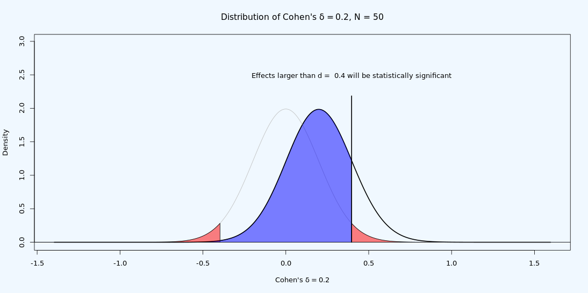

```{r, include = FALSE}
source("include/globals.R")

# needed to make the chapter (not visible)
library(ggplot2)
library(gridExtra)
library(BEST)

# for students
library(TOSTER)
library(pwr)
```

# Equivalence Testing and Interval Hypotheses {#equivalencetest}

Most scientific studies are designed to test the prediction that an effect or a difference exists. Does a new intervention work? Is there a relationship between two variables? These studies are commonly analyzed with a null hypothesis significance test. When a statistically significant *p*-value is observed, the null hypothesis can be rejected, and researchers can claim that the intervention works, or that there is a relationship between two variables, with a maximum error rate. But if the *p*-value is not statistically significant, researchers very often draw a logically incorrect conclusion: They conclude there is no effect based on *p* > 0.05. 

Open a result section of an article you are writing, or the result section of an article you have recently read. Search for "*p* > 0.05", and look carefully what you or the scientists concluded (in the results section, but also check which claim they make the discussion section). If you see the conclusion that there was 'no effect' or there was 'no association between variables', you have found an example where researchers forgot that *absence of evidence is not evidence of absence* [@altman_statistics_1995]. A non-significant result in itself only tells us that we can not reject the null hypothesis. It is tempting to ask after *p* > 0.05 'so, is the true effect zero'? But the *p*-value from a null hypothesis significance test can not answer that question. It might be useful to think of the answer to the question whether an effect is absent after observing *p* > 0.05 as 無 ([mu](https://en.wikipedia.org/wiki/Mu_(negative)#Non-dualistic_meaning)), used as a non-dualistic answer, neither yes nor no, or 'unasking the question'. It is simply not possible to answer the question whether a meaningful effect is absent based on *p* > 0.05. 

There should be many situations where researchers are interested in examining whether a meaningful effect is absent. For example, it can be important to show two groups do not differ on factors that might be a confound in the experimental design (e.g., examining whether a manipulation intended to increase fatigue did not affect the mood of the participants, by showing that positive and negative affect did not differ between the groups). Researchers might want to know if two interventions work equally well, especially when the newer intervention costs less or requires less effort (e.g., is online therapy just as efficient as in person therapy?). And other times we might be interested to demonstrate the absence of an effect because a theoretical model predicts there is no effect, or because we believe a previously published study was a false positive, and we expect to show the absence of an effect in a replication study [@dienes_using_2014]. And yet, when you ask researchers if they have ever designed a study where the goal was to show that there was no effect, for example by predicting that there would be no difference between two conditions, many people say they have never designed a study where their main prediction was that the effect size was 0. Researchers almost always predict there is a difference. One reason might be that many researchers would not even know how to statistically support a prediction of an effect size of 0, because they were not trained in the use of equivalence testing.

It is never possible to show an effect is *exactly* 0. Even if you would collect data from every person in the world, the effect in any single study will randomly vary around the true effect size of 0, you might end up with a mean difference that is very close to, but not exactly, zero, in any finite sample. Hodges and Lehman [@hodges_testing_1954] were the first to discuss the statistical problem of testing whether two populations have the same mean. They suggest (p. 264) to: “test that their means do not differ by more than an amount specified to represent the smallest difference of practical interest.” Nunnally [@nunnally_place_1960] similarly proposed a ‘fixed-increment’ hypothesis where researcher compare an observed effect against a range of values that is deemed too small to be meaningful. Defining a range of values considered practically equivalent to the absence of an effect is known as an **equivalence range** [@bauer_unifying_1996] or a **region of practical equivalence** [@kruschke_bayesian_2013]. The equivalence range should be specified in advance, and requires careful consideration of the smallest effect size of interest. 

Although researchers have repeatedly attempted to introduce test against an equivalence range in the social sciences [@cribbie_recommendations_2004; @levine_communication_2008; @hoenig_abuse_2001; @rogers_using_1993; @quertemont_how_2011], this statistical approach has only recently become popular. During the replication crisis, researchers searched for tools to interpret null results when performing replication studies. Researchers wanted to be able to publish informative null results when replicating findings in the literature that they suspected were false positives. One notable example were the studies on pre-cognition by Daryl Bem, which ostensibly showed that participants were able to predict the future [@bem_feeling_2011]. Equivalence tests were proposed as a statistical approach to answer the question whether an observed effect is small enough to conclude that a previous study could not be replicated [@anderson_theres_2016; @lakens_equivalence_2017; @simonsohn_small_2015]. Researchers specify a smallest effect size of interest (for example an effect of 0.5, so for a two-sided test any value outside a range from -0.5 to 0.5) and test whether effects more extreme than this range can be rejected. If so, they can reject the presence effects that are deemed large enough to be meaningful.

Equivalence tests are a specific implementation of **interval hypothesis tests**, where instead of testing against a null hypothesis of no effect (or an effect size of 0), an effect is tested against a null hypothesis that represents a range of non-zero effect sizes. One can distinguish a **nil null hypothesis**, where the null hypothesis is an effect of 0, from a **non-nil null hypothesis**, where the null hypothesis is any other effect that 0, for example effects more extreme than the smallest effect size of interest [@nickerson_null_2000]. As Nickerson writes: 

>The distinction is an important one, especially relative to the controversy regarding the merits or shortcomings of NHST inasmuch as criticisms that may be valid when applied to nil hypothesis testing are not necessarily valid when directed at null hypothesis testing in the more general sense. 

Indeed, one of the most widely suggested improvements that mitigates the most important limitations of null hypothesis significance testing is to replace the nil null hypothesis with the test of a range prediction (by specifying a non-nil null hypothesis) in an interval hypothesis test [@lakens_practical_2021]. To illustrate the difference, panel A in Figure \@ref(fig:intervaltest) visualizes the results that are predicted in a two-sided null hypothesis test with a nil hypothesis, where the test examines whether an effect of 0 can be rejected. Panel B shows an interval hypothesis where an effect between 0.5 and 2.5 is predicted, where the non-nill null hypothesis consists of values smaller than 0.5 or larger than 2.5, and the interval hypothesis tests examines whether values in these ranges can be rejected. Panel C illustrates an equivalence test, which is basically identical to an interval hypothesis test, but the predicted effects are located in a range around 0, and contain effects that are deemed too small to be meaningful. 


(ref:intervaltestlab) Two-sided null hypothesis test (A), interval hypothesis test (B), equivalence test (C) and minimum effect test (D).

```{r, intervaltest, echo = FALSE, fig.height = 8, fig.cap="(ref:intervaltestlab)"}
plotheight <- 0.9
lowerbound <- -1
upperbound <- 1
df <- data.frame()
####  Base plot ------------------------------------
baseplot <-   ggplot(df) +
  scale_y_continuous(limits = c(0,plotheight+0.02), breaks=NULL) + # no y-axis will be displayed
  theme_classic() + 
  theme(plot.background = element_rect(fill = backgroundcolor))  + 
  theme(panel.background = element_rect(fill = backgroundcolor)) +
  theme(plot.title = element_text(size = rel(1), face = "bold"), #font size & appearance for plot titles
        axis.title.y = element_blank(), #remove title of y-axis
        axis.line.y= element_blank(),
        axis.title.x = element_text(size=rel(1), lineheight = 0.5), #font size for x-axis label
        plot.margin=unit(c(0.5,0.8,0.5,0.8),"cm")) #add padding around each plot to make them look nicer when combined; margin order: top, right, bottom, left

#NHST plot
NHSTplot <- baseplot +
  scale_x_continuous(limits = c(-3, 5), breaks=c(-4, -3, -2, -1, 0, 1, 2, 3, 4),
                     name = "observed difference") +
  ggtitle("A: Two-sided NHST") +
  annotate("segment", x = 0, xend = 0, y = plotheight-plotheight/2, yend = -Inf) + #vertical line at x=0 (H0)
  annotate("rect", xmin = -Inf, xmax = Inf, ymin = -Inf, ymax = 0.9, fill = "red", alpha = .2, color = NA) + #shading for H0 area
  annotate("text", size = rel(3.5), x=0, y = plotheight-plotheight/20, parse=TRUE, label="H0", hjust = 0.6) + #label for point null (H0)
  annotate("segment", x = 0, xend = 0, y = plotheight-plotheight/6, yend=plotheight-plotheight/2.3,
           arrow = arrow(type = "closed", length=unit(2, "mm"))) + #arrow pointing from H0 label to H0 line
  annotate("text", size = rel(3.5), x=-2.8, y=plotheight/3, parse=TRUE, label="H1") + #label for lower area (H1)
  annotate("text", size = rel(3.5), x = 2.8, y=plotheight/3, parse=TRUE, label="H1", hjust = 0.7) #label for upper area (H1)

rangeplot <- baseplot +
  scale_x_continuous(limits = c(-5, 5), breaks=c(-4, -3, -2, -1, 0, 1, 2, 3, 4),
                     name = "observed difference") +
  ggtitle("B: Interval Hypothesis Test") +
  annotate("segment", x = 0.5, xend = 0.5, y = plotheight, yend = -Inf, linetype = "dashed") + #dashed line for lower bound
  annotate("segment", x = 2.5, xend = 2.5, y = plotheight, yend = -Inf, linetype = "dashed") + #dashed line for upper bound
  annotate("rect", xmin = 0.5, xmax = 2.5, ymin = -Inf, ymax = 0.9, fill = "red", alpha = .2, color = NA) + #shading for H0 area
  annotate("text", size = rel(3.5), x=-0.8, y=plotheight/2.5, parse=TRUE, label= "H0") + #label for lower area (H1)
  annotate("text", size = rel(3.5), x=3.8, y=plotheight/2.5, parse=TRUE, label="H0") + #label for upper area (H1)
  annotate("text", size = rel(3.5), x=1.6, y=plotheight/2.5, parse=TRUE, label="H1", hjust = 0.7) #label for minimal effects area (H1)

equivalenceplot <- baseplot +
  scale_x_continuous(limits = c(-5, 5), breaks=c(-4, -3, -2, -1, 0, 1, 2, 3, 4),
                     name = "observed difference") +
  ggtitle("C: Equivalence Test") +
  annotate("segment", x = -1, xend = -1, y = plotheight, yend = -Inf, linetype = "dashed") + #dashed line for lower bound
  annotate("segment", x = 1, xend = 1, y = plotheight, yend = -Inf, linetype = "dashed") + #dashed line for upper bound
  annotate("rect", xmin = -1, xmax = 1, ymin = -Inf, ymax = 0.9, fill = "red", alpha = .2, color = NA) + #shading for H0 area
  annotate("text", size = rel(3.5), x=-2.8, y=plotheight/2.5, parse=TRUE, label= "H0") + #label for lower area (H1)
  annotate("text", size = rel(3.5), x=2.8, y=plotheight/2.5, parse=TRUE, label="H0") + #label for upper area (H1)
  annotate("text", size = rel(3.5), x=0, y=plotheight/2.5, parse=TRUE, label="H1", hjust = 0.7) #label for minimal effects area (H1)

mineffectplot <- baseplot +
  scale_x_continuous(limits = c(-5, 5), breaks=c(-4, -3, -2, -1, 0, 1, 2, 3, 4),
                     name = "observed difference") +
  ggtitle("D: Minimum Effect Test") +
  annotate("segment", x = -1, xend = -1, y = plotheight, yend = -Inf, linetype = "dashed") + #dashed line for lower bound
  annotate("segment", x = 1, xend = 1, y = plotheight, yend = -Inf, linetype = "dashed") + #dashed line for upper bound
  annotate("rect", xmin = -Inf, xmax = -1, ymin = -Inf, ymax = 0.9, fill = "red", alpha = .2, color = NA) + #shading for H0 area
  annotate("rect", xmin = 1, xmax = Inf, ymin = -Inf, ymax = 0.9, fill = "red", alpha = .2, color = NA) + #shading for H0 area
  annotate("text", size = rel(3.5), x=-2.8, y=plotheight/2.5, parse=TRUE, label= "H1") + #label for lower area (H1)
  annotate("text", size = rel(3.5), x=2.8, y=plotheight/2.5, parse=TRUE, label="H1") + #label for upper area (H1)
  annotate("text", size = rel(3.5), x=0, y=plotheight/2.5, parse=TRUE, label="H0", hjust = 0.7) #label for minimal effects area (H1)


gridExtra::grid.arrange(NHSTplot, rangeplot, equivalenceplot, mineffectplot, ncol = 1) #combine plots in one column (all stacked)
```

When an equivalence test is reversed, an a researcher designs a study to reject effect less extreme than a smallest effect size of interest (see Panel D in Figure \@ref(fig:intervaltest)), it is called a **minimum effect test** [@murphy_testing_1999]. A researcher might not just be interested in rejecting an effect of 0 (as in a null hypothesis significance test) but in rejecting effects that are too small to be meaningful. All else equal, a study designed to have high power for a minimum effect requires more observations than if the goal had been to reject an effect of zero. As the confidence interval needs to reject a value that is closer to the observed effect size (e.g., 0.1 instead of 0) it needs to be more narrow, which requires more observations. 

One benefit of a minimum effect test compared to a null hypothesis test is that there is no distinction between statistical significance and practical significance. As the test value is chosen to represent the minimum effect of interest, whenever it is rejected, the effect is both statistically and practically significant [@murphy_statistical_2014]. Another benefit of minimum effect tests is that, especially in correlational studies in the social sciences, variables are often connected through causal structures that result in real but theoretically uninteresting nonzero correlations between variables, which has been labeled the 'crud factor' [@meehl_appraising_1990; @orben_crud_2020]. Because an effect of zero is unlikely to be true in large correlational datasets, rejecting a nil null hypothesis is not a severe test. Even if the hypothesis is incorrect, it is likely that an effect of 0 will be rejected due to ['crud'](#crud). For this reason, some researchers have suggested to test against a minimum effect of *r* = 0.1, as correlations below this threshold are quite common due to theoretically irrelevant correlations between variables [@ferguson_providing_2021].

Figure \@ref(fig:intervaltest) illustrates two-sided tests, but it is often more intuitive and logical to perform one-sided tests. In that case, a minimum effect test would, for example, aim to reject effects smaller than 0.1, and an equivalence test would aim to reject effects larger than for example 0.1. Instead of specifying an upper and lower bound of a range, it is sufficient to specify a single value for one-sided tests. A final variation of a one-sided non-nil null hypothesis test is known as a test for **non-inferiority**, which examines of an effect is larger than the lower bound of an equivalence range. Such a test is for example performed when a novel intervention should not be noticeable worse than an existing intervention - but it can be a tiny bit worse. For example, if a difference between a novel and existing intervention is not smaller than -0.1, and effects smaller than -0.1 can be rejected, one can conclude an effect is non-inferior [@schumi_through_2011; @mazzolari_myths_2022]. We see that extending nil null hypothesis tests to non-nil null hypotheses allow researchers to ask questions that might be more interesting.
 
## Equivalence tests

Equivalence tests were first developed in pharmaceutical sciences [@hauck_new_1984; @westlake_use_1972] and later formalized as the **two one-sided tests (TOST)** approach to equivalence testing [@schuirmann_comparison_1987; @seaman_equivalence_1998; @wellek_testing_2010]. The TOST procedure entails performing two one-sided tests to examine whether the observed data is surprisingly larger than a lower equivalence boundary ($\Delta_{L}$), or surprisingly smaller than an upper equivalence boundary ($\Delta_{U}$):

$$
t_{L} = \frac{{\overline{M}}_{1} - {\overline{M}}_{2} - \Delta_{L}}{\sigma\sqrt{\frac{1}{n_{1}} + \frac{1}{n_{2}}}}
$$

and 

$$
t_{U} = \frac{{\overline{M}}_{1} - {\overline{M}}_{2}{- \Delta}_{U}}{\sigma\sqrt{\frac{1}{n_{1}} + \frac{1}{n_{2}}}}
$$

where *M* indicates the means of each sample, *n* is the sample size, and σ is
the pooled standard deviation:

$$
\sigma = \sqrt{\frac{\left( n_{1} - 1 \right)\text{sd}_{1}^{2} + \left( n_{2} - 1 \right)\text{sd}_{2}^{2}}{n_{1} + \ n_{2} - 2}}
$$

If both one-sided tests are significant, we can reject the presence of effects large enough to be meaningful. The formulas are highly similar to the normal formula for the *t*-statistic. The difference between a NHST *t*-test and the TOST procedure is that the lower equivalence boundary $\Delta_{L}$ and the upper equivalence boundary $\Delta_{U}$ are subtracted from the mean difference between groups (in a normal *t*-test, we compare the mean difference against 0, and thus the delta drops out of the formula because it is 0).

To perform an equivalence test, you don't need to learn any new statistical tests, as it is just the well-known *t*-test against a different value than 0. It is somewhat surprising that the use of *t*tests to perform equivalence tests is not taught alongside their use in null hypothesis significance tests, as there is some indication that this could prevent common misunderstandings of *p*-values [@parkhurst_statistical_2001]. Let's look at an example of an equivalence test using the TOST procedure. 

In a study where researchers are manipulating fatigue by asking participants to carry heavy boxes around, the researchers want to ensure the manipulation does not inadvertently alter participants’ moods. The researchers assess positive and negative emotions in both ocnditions, and want to claim there are no differences in positive mood. Let’s assume that positive mood in the experimental fatigue condition ($m_1$ = 4.55, $sd_1$ = 1.05, $n_1$ = 15) did not differ from the mood in the the control condition ($m_2$ = 4.87, $sd_2$ = 1.11, $n_2$ = 15). The researchers conclude: “Mood did not differ between conditions, *t* = -0.81, *p* = .42”. Of course, mood did differ between conditions, as 4.55 - 4.87 = -0.32. The claim is that there was no *meaningful* difference in mood, but to make such a claim in a correct manner, we first need to specify which difference in mood is large enough to be meaningful. For now, let's assume the researcher consider any effect less extreme half a scale point too small to be meaningful. We test now test if the observed mean difference of -0.32 is small enough such that we can reject the presence of effects that are large enough to matter.  

The TOSTER package (originally created by myself but recently redesigned by [Aaron Caldwell](https://aaroncaldwell.us/)) can be used to plot two *t*-distributions and their critical regions indicating when we can reject the presence of effects smaller than -0.5 and larger than 0.5. It can take some time to get used to the idea that we are rejecting values more extreme than the equivalence bounds. Try to consistently ask in any hypothesis test: Which values can the test reject? In a nil null hypothesis test, we can reject an effect of 0, and in the equivalence test in the Figure below, we can reject values lower than -0.5 and higher than 0.5. In Figure \@ref(fig:tdistequivalence) we see two *t*-distributions centered on the upper and lower bound of the specified equivalence range (-0.5 and 0.5). 

(ref:tdistequivalencelab) The mean difference and its confidence interval plotted below the *t*-distributions used to perform the two-one-sided tests against -0.5 and 0.5.

```{r, tdistequivalence, echo = FALSE, fig.cap="(ref:tdistequivalencelab)"}
res <- TOSTER::tsum_TOST(m1 = 4.55, m2 = 4.87, sd1 = 1.05, sd2 = 1.11,
                  n1 = 15, n2 = 15, low_eqbound = -0.5, high_eqbound = 0.5)

plot(res, type = "tnull")

```

Below the two curves we see a line that represents the confidence interval ranging from `r round(res$effsize$lower.ci[1], 2)` to `r round(res$effsize$upper.ci[1], 2)`, and a dot on the line that indicates the observed mean difference of `r round(res$effsize$estimate[1], 2)`. Let's first look at the left curve. We see the green highlighted area in the tails that highlights which observed mean differences would be extreme enough to statistically reject an effect of -0.5. Our observed mean difference of -0.32 lies very close to 0.5, and if we look at the left distribution, the mean is not far enough away from 0.5 to fall in the green area that indicates when observed differences would be statistically significant. We can also perform the equivalence test using the TOSTER package, and look at the results. 

```{r}
TOSTER::tsum_TOST(m1 = 4.55, 
                  m2 = 4.87, 
                  sd1 = 1.05, 
                  sd2 = 1.11,
                  n1 = 15, 
                  n2 = 15, 
                  low_eqbound = -0.5, 
                  high_eqbound = 0.5)
```

In the line 't-test' the output shows the traditional nil null hypothesis significance test (which we already knew was not statistically significant: *t* = `r round(res$TOST$t[2], 2)`, *p* = `r round(res$TOST$p[1],2)`. Just like the default *t*-test in R, the tsum_TOST function will by default calculate Welch’s *t*-test (instead of Student’s *t*-test), which is a better default [@delacre_why_2017], but you can request Student’s *t*-test by adding `var.equal = TRUE` as an argument to the function.

We also see a test indicated by TOST Lower. This is the first one-sided test examining if we can reject effects lower than -0.5. From the test result, we see this is not the case: *t* = `r round(res$TOST$t[2], 2)`, *p* = `r round(res$TOST$p[2],2)`. This is an ordinary *t*-test, just against an effect of -0.5. Because we can not reject differences more extreme than -0.5, it is possible that a different we consider meaningful (e.g., a difference of -0.60) is present. When we look at the one-sided test against the upper bound of the equivalence range (0.5) we see that we can statistically reject the presence of mood effects larger than 0.5, as in the line TOST Upper we see *t* = `r round(res$TOST$t[3], 2)`, *p* = `r round(res$TOST$p[3],2)`. Our final conclusion is therefore that, even thought we can reject effects more extreme than 0.5 based on the observed mean difference of `r round(res$effsize$estimate[1], 2)`, we can not reject effects more extreme than -0.5. Therefore, we can not completely reject the presence of meaningful mood effects. As the data does not allow us to claim the effect is different from 0, nor that the effect is, if anything, too small to matter (based on an equivalence range from -0.5 to 0.5), the data are **inconclusive**. We can not distinguish between a Type 2 error (there is an effect, but in this study we just did not detect it) or a true negative (there really is no effect large enough to matter).

Note that because we fail to reject the one-sided test against the lower equivalence bound, the possibility remains that there is a true effect size that is large enough to be considered meaningful. This statement is true, even when the effect size we have observed (`r round(res$effsize$estimate[1], 2)`) is closer to zero than to the equivalence bound of -0.5. One might think the observed effect size needs to be more extreme (i.e., < -0.5 or > 0.5) than the equivalence bound to maintain the possibility that there is an effect that is large enough to be considered meaningful. But that is not required. The 90% CI indicates that some values below -0.5 can not be rejected. As we can expect that 90% of confidence intervals in the long run capture the true population parameter, it is perfectly possible that the true effect size is more extreme than -0.5. And, the effect might even be more extreme than the values captured by this confidence interval, as 10% of the time, the computed confidence interval is expected to not contain the true effect size. Therefore, when we fail to reject the smallest effect size of interest, we retain the possibility that an effect of interest exists. If we can reject the nil null hypothesis, but fail to reject values more extreme than the equivalence bounds, then we can claim there is an effect, and it might be large enough to be meaningful. 

```{r, ciequivalencetest1, echo = FALSE}
res <- TOSTER::tsum_TOST(m1 = 4.55, m2 = 4.87, sd1 = 1.05, sd2 = 1.11,
                  n1 = 200, n2 = 200, low_eqbound = -0.5, high_eqbound = 0.5)
```


One way to reduce the probability of an inconclusive effect is to collect sufficient data. Let's imagine the researchers had not collected 15 participants in each condition, but 200 participants. They otherwise observe exactly the same data. As explained in the chapter on [confidence intervals](#confint), as the sample size increases, the confidence interval becomes more narrow. For a TOST equivalence test to be able to reject both the upper and lower bound of the equivalence range, the confidence interval needs to fall completely within the equivalence range. In Figure \@ref(fig:ciequivalence2) we see the same result as in Figure \@ref(fig:tdistequivalence), but now if we had collected 200 observations. Because of the larger sample size, the confidence is more narrow than when we collected 15 participants. We see that the 90% confidence interval around the observed mean difference now excludes both the upper and lower equivalence bound. This means that we can now reject effects outside of the equivalence range (even though barely, with a *p* = `r round(res$TOST$p[2],3)` as the one-sided test against the lower equivalence bound is only just statistically significant).    


(ref:ciequivalence1lab) The mean difference and its confidence interval for an equivalence test with an equivalence range of -0.5 and 0.5.

```{r, ciequivalence1, echo = FALSE, fig.cap="(ref:ciequivalence1lab)"}

plot(res, type = "tnull", estimates = "raw")

print(res) 
```

In Figure \@ref(fig:ciequivalence2) we see the the same results, but now visualized as a confidence density plot [@schweder_confidence_2016], which is a graphical summary of the distribution of confidence. A confidence density plot allows you to see which effects can be rejected with difference confidence interval widths. We see the bounds of the green area (corresponding to a 90% confidence interval) fall inside the equivalence bounds. Thus, the equivalence test is statistically significant, and we can statistically reject the presence of effects outside the equivalence range. We can also see that the 95% confidence interval excludes 0, and therefore, a traditional null hypothesis significance test is also statistically significant. 


(ref:ciequivalence2lab) The mean difference and its confidence interval for an equivalence test with an equivalence range of -0.5 and 0.5.

```{r, ciequivalence2, echo = FALSE, fig.cap="(ref:ciequivalence2lab)"}
res <- TOSTER::tsum_TOST(m1 = 4.55, m2 = 4.87, sd1 = 1.05, sd2 = 1.11,
                  n1 = 200, n2 = 200, low_eqbound = -0.5, high_eqbound = 0.5)

plot(res, type = "cd", estimates = "raw")
```

In other words, both the null hypothesis test as the equivalence test have yielded significant results. This means we can claim that the observed effect is statistically different from zero, and that the effect is statistically smaller than effects we deemed large enough to matter when we specified the equivalence range from -0.5 to 0.5. This illustrates how combining equivalence tests and nil null hypothesis tests can prevent us from mistaking statistically significant effects for practically significant effects. In this case, with 200 participants, we can reject an effect of 0, but the effect, if any, is not large enough to be meaningful.

## Reporting Equivalence Tests 

It is common practice to only report the test yielding the higher *p*-value of the two one-sided tests when reporting an equivalence test. Because both one-sided tests need to be statistically significant to reject the null hypothesis in an equivalence test (i.e., the presence of effects large enough to matter), when the larger of the two hypothesis tests rejects the equivalence bound, so does the other test. Unlike in null hypothesis significance tests it is not common to report standardized effect sizes for equivalence tests, but there can be situations where researchers might want to discuss how far the effect is removed from the equivalence bounds on the raw scale. Prevent the erroneous interpretation to claim there is 'no effect', that an effect is 'absent', that the true effect size is 'zero', or vague verbal descriptions, such as that two groups yielded 'similar' or 'comparable' data. A significant equivalence test rejects effects more extreme that the equivalence bounds. Smaller true effects have not been rejected, and thus it remains possible that there is a true effect. Because a TOST procedure is a frequentist test based on a *p*-value, all other [misconceptions of *p*-values](#misconceptions) should be prevented as well. 

When summarizing the main result of an equivalence test, for example in an abstract, always report the equivalence range that the data is tested against. Reading 'based on an equivalence test we concluded the absence of a meaningful effect' means something very different if the equivalence bounds were *d* =-0.9 to 0.9 than when the bounds were *d* =-0.2 to *d* =0.2. So instead, write "based on an equivalence test with an equivalence range of *d* =-0.2 to 0.2, we conclude the absence of a meaningful effect. Of course, whether peers agree you have correctly concluded the absence of a meaningful effect depends on whether they agree with your justification for a smallest effect of interest! A more neutral conclusion would be a statement such as: 'based on an equivalence test, we rejected the presence of effects more extreme than -0.2 to 0.2, so we can act (with an error rate of alpha) as if the effect, is any, is less extreme than our equivalence range'. Here, you do not use value-laden terms such as 'meaningful'. If both a null hypothesis test and a significant test are non-significant, the findings is best described as 'inconclusive': There is not enough data to reject the null, or the smallest effect size of interest. If both the null hypothesis test and the equivalence test are statistically significant, you can claim there is an effect, but at the same time claim the effect is too small to be of interest (given your justification for the equivalence range).

Equivalence bounds can be specified in raw effect sizes, or in standardized mean differences. It is better to specify the equivalence bounds in terms of raw effect sizes. Setting them in terms of Cohen's *d* leads to bias in the statistical test, as the observed standard deviation has to be used to translate the specified Cohen's *d* into a raw effect size for the equivalence test (and when you set equivalence bounds in standardized mean differences, TOSTER will warn: "Warning: setting bound type to SMD produces biased results!"). The bias is in practice not too problematic in any single equivalence test, and being able to specify the equivalence bounds in standardized mean differences lowers the threshold to perform an equivalence test when they do not know the standard deviation of their measure. But as equivalence testing becomes more popular, and fields establish smallest effect sizes of interest, they should do so in raw effect size differences, not in standardized effect size differences. 

## Minimum Effect Tests{#MET}

If a researcher has specified a smallest effect size of interest, and is interested in testing whether the effect in the population is larger than this smallest effect of interest, a minimum effect test can be performed. As with any hypothesis test, we can reject the smallest effect of interest whenever the confidence interval around the observed effect does not overlap with it. In the case of a minimum effect test, however, the confidence interval should be fall completely beyond the smallest effect size of interest. For example, let's assume a researcher performs a minimum effect test with 200 observations per condition against a smallest effect size of interest of a mean difference of 0.5.


(ref:tmetlab) The mean difference and its confidence interval plotted below the *t*-distributions used to perform the two-one-sided tests against -0.5 and 0.5 when performing a minimum effect test.

```{r, tmet, echo = FALSE, fig.cap="(ref:tmetlab)"}
res <- TOSTER::tsum_TOST(m1 = 5.73, m2 = 4.87, sd1 = 1.05, sd2 = 1.11,
                  n1 = 200, n2 = 200, low_eqbound = -0.5, high_eqbound = 0.5,
                  hypothesis = "MET")

plot(res, type = "tnull")
print(res)
```
Below the two curves we again see a line that represents the confidence interval ranging from `r round(res$effsize$lower.ci[1], 2)` to `r round(res$effsize$upper.ci[1], 2)`, and a dot on the line that indicates the observed mean difference of `r round(res$effsize$estimate[1], 2)`. The entire confidence interval lies well above the minimum effect of 0.5, and we can therefore not just reject the nil null hypothesis, but also effects smaller than the minimum effect of interest. Therefore, we can claim that the effect is large enough to be not just statistically significant, but also practically significant (as long as we have justified our smallest effect size of interest well). Because we have performed a two-sided minimum effect test, the minimum effect test would also have been significant if the confidence interval had been completely on the opposite side of -0.5. 

Earlier we discussed how combining traditional NHST and an equivalence test lead to more informative results, and it is also possible to combine a minimum effect test and an equivalence test. One might even say that such a combination is most informative test of a prediction whenever a smallest effect size of interest can be specified. In principle, this is true. As long as we are able to collect enough data, we will always get an informative and straightforward answer when we combine a minimum effect test with an equivalence test: Either we can reject all effects that are too small to be of interest, or we can reject all effects that are large enough to be of interest. As we will see below in the section on power analysis for interval hypotheses, whenever the true effect size is close to the smallest effect size of interest, a large amount of observations will need to be collected. And if the true effect size happens to be identical to the smallest effect size of interest, neither the minimum effect test nor the equivalence test can be correctly rejected (and any significant test would be a Type 1 error). If a researcher can collect sufficient data (so that the test has high statistical power), and is relatively confident that the true effect size will be larger or smaller than the smallest effect of interest, then the combination of a minimum effect test and an equivalence test can be attractive as such a hypothesis test is likely yield a clear answer to the research question. 

## Power Analysis for Interval Hypothesis Tests

When designing a study it is a sensible strategy to always plan for both the presence, as the absence, of an effect. Several scientific journals require a sample size justification for Registered Reports where the statistical power to reject the null hypothesis is high, but where the study is also capable of demonstrating the absence of an effect, for example by also performing a power analysis for an equivalence test. As we saw in the chapter on [error control](#errorcontrol) and [likelihoods](#likelihoods) null results are to be expected, and if you only think about the possibility of observing a null effect when the data has been collected, it is often too late.

The statistical power for interval hypotheses depend on the alpha level, the sample size, the smallest effect of interest you decide to test against, and the true effect size. For an equivalence test, it is common to perform a power analysis assuming the true effect size is 0, but this might not always be realistic. The closer the expected effect size is to the smallest effect size of interest, the larger the sample size needed to reach a desired power. Don't be tempted to assume a true effect size of 0, if you have good reason to expect a small but non-zero true effect size. The sample size that the power analysis indicates you need to collect might be smaller, but in reality you also have a higher probability of an inconclusive result. Earlier versions of TOSTER only enabled researchers to perform power analyses for equivalence tests assuming a true effect size of 0, but a new power function by Aaron Caldwell allows users to specify `delta`, the expected effect size. 

Assume a researchers desired to achieve 90% power for an equivalence test with an equivalence range from -0.5 to 0.5, with an alpha level of 0.05, and assuming a population effect size of 0. A power analysis for an equivalence test can be performed to examine the required sample size. 

```{r}
TOSTER::power_t_TOST(power = 0.9, delta = 0,
                     alpha = 0.05, type = "two.sample",
                     low_eqbound = -0.5, high_eqbound = 0.5)
```

We see that the required sample size is 88 participants in each condition for the independent *t*-test, Let's compare this power analysis to a situation where the researcher expects a true effect of *d* =0.1, instead of a true effect of 0. To be able to reliable reject effects larger than 0.5, we will need a larger sample size, just as how we need a larger sample size for a null hypothesis test powered to detect a *d* =0.4 than a null hypothesis test powered to detect a *d* =0.5. 

```{r}
TOSTER::power_t_TOST(power = 0.9, delta = 0.1,
                     alpha = 0.05, type = "two.sample",
                     low_eqbound = -0.5, high_eqbound = 0.5)
```

We see the sample size has now increased to 109 participants in each condition. As mentioned before, it is not necessary to perform a two-sided equivalence test. It is also possible to perform a one-sided equivalence test. An example of a situation where such a directional test is appropriate is a replication study. If a previous study observed an effect of *d* =0.48, and you perform a replication study, you might decide to consider any effect smaller than *d* =0.2 a failure to replicate - including any effect in the opposite direction, such as an effect of *d* =-0.3. Although most software for equivalence tests requires you to specify an upper and lower bound for an equivalence range, you can mimic a one-sided test by setting the equivalence bound in the direction you want to ignore to a low value so that the one-sided test against this value will always be statistically significant. This can also be used to perform a power analysis for a minimum effect test, where one bound is the minimum effect of interest, and the other bound is set to an extreme value on the other side of the expected effect size. 

In the power analysis for an equivalence test example below, the lower bound is set to -5 (it should be set low enough such that lowering it even further has no noticeable effect). We see that the new power function in the TOSTER package takes the directional prediction into account, and just as with directional predictions in a nil null hypothesis test, a directional prediction in an equivalence test is more efficient, and only 70 observations are needed to achieve 90% power. 

```{r}
# New TOSTER power functions allows power for expected non-zero effect.
TOSTER::power_t_TOST(power = 0.9, delta = 0,
                     alpha = 0.05, type = "two.sample",
                     low_eqbound = -5, high_eqbound = 0.5)
```

Statistical software offers options for power analyses for some statistical tests, but not for all tests. Just as with power analysis for a nil null hypothesis test, it can be necessary to use a simulation-based approach to power analysis.

## The Bayesian ROPE procedure{#ROPE}

In Bayesian estimation, one way to argue for the absence of a meaningful effect is the **region of practical equivalence** (ROPE) procedure (@kruschke_bayesian_2013), which is “somewhat analogous to frequentist equivalence testing” (@kruschke_bayesian_2017). In the ROPE procedure, an equivalence range is specified, just as in equivalence testing, but the Bayesian highest density interval based on a posterior distribution (as explained in the chapter on [Bayesian statistics](#bayes)) is used instead of the confidence interval. 

If the prior used by Kruschke was perfectly uniform, and the ROPE procedure and an equivalence test used the same confidence interval (e.g., 90%), the two tests would yield  identical results. There would only be philosophical differences in how the numbers are interpreted. The `BEST` package in R that can be used to perform the ROPE procedure by default uses a ‘broad’ prior, and therefore results of the ROPE procedure and an equivalence test are not exactly the same, but they are very close. One might even argue the two tests are 'practically equivalent'. In the R code below random normally distributed data for two conditions is generated (with means of 0 and a standard deviation of 1) and the ROPE procedure and a TOST equivalence test are performed. 

```{r, echo = FALSE, cache = TRUE}
set.seed(1)

x<-rnorm(100) #Generate 100 random normally distributed observations
y<-rnorm(100) #Generate 100 random normally distributed observations

#ROPE test
BESTout<-BEST::BESTmcmc(x,y)
plot(BESTout, ROPE = c(-0.5, 0.5), showCurve = TRUE, xlim = c(-0.5,0.6),
     credMass = 0.90)

#TOST test
TOSTout <- TOSTER::t_TOST(x = x, y = y, low_eqbound = -0.5, high_eqbound = 0.5, alpha = 0.05)

plot(TOSTout, estimates = "raw")

```

The 90% HDI ranges from -0.06 to 0.39, with an estimated mean based on the prior and the data of 0.164. The HDI falls completely between the upper and the lower bound of the equivalence range, and therefore values more extreme than -0.5 or 0.5 are deemed implausible. The 95% CI ranges from `r round(TOSTout$effsize$lower.ci[1], 2)` to `r round(TOSTout$effsize$upper.ci[1], 2)` with an observed mean difference of `r round(TOSTout$effsize$estimate[1], 2)`. We see that the numbers are not identical, because in Bayesian estimation the observed values are combined with a prior, and the mean estimate is not purely based on the data. But the results are very similar, and will in most cases lead to similar inferences. The BEST R package also enables researchers to perform simulation based power analyses, which take a long time but, when using a broad prior, yield a result that is basically identical to the sample size from a power analysis for an equivalence test. The biggest benefit of ROPE over TOST is that it allows you to incorporate prior information. If you have reliable prior information, ROPE can use this information, which is especially useful if you don’t have a lot of data. If you use informed priors, check the robustness of the posterior against reasonable changes in the prior in sensitivity analyses.

## Which interval width should be used?{#whichinterval}

Because the TOST procedure is based on two one-sided tests, a 90% confidence interval is used when the one-sided tests are performed at an alpha level of 5%. Because both the test against the upper bound and the test against the lower bound needs to be statistically significant to declare equivalence (which as explained in the chapter on [error control](#multiplecomparisons) is an intersection-union approach to multiple testing) it is not necessary to correct for the fact that two tests are performed. If the alpha level is adjusted for multiple comparisons, or if the alpha level is justified instead of relying on the default 5% level (or both), the corresponding confidence interval should be used, where CI = 100 - (2 * $\alpha$). Thus, the width of the confidence interval is directly related to the choice for the alpha level, as we are making decisions to reject the smallest effect size of interest, or not, based on whether the confidence interval excluded the effect that is tested against.

When using a Highest Density Interval from a Bayesian perspective, such as the ROPE procedure, the choice for a width of a confidence interval does not follow logically from a desired error rate, or any other principle. Kruschke [-@kruschke_doing_2014] writes: “How should we define 'reasonably credible'? One way is by saying that any points within the 95% HDI are reasonably credible.” McElreath [-@mcelreath_statistical_2016] has recommended the use of 67%, 89%, and 97%, because "No reason. They are prime numbers, which makes them easy to remember.". Both these suggestions lack a solid justification. As Gosset (or Student), observed [-gosset_application_1904]: 

>Results are only valuable when the amount by which they probably differ from the truth is so small as to insignificant for the purposes of the experiment. What the odds selected should be depends-  
1. On the degree of accuracy which the nature of the experiment allows, and  
2. On the importance of the issues at stake.

There are only two principled solutions. First, if a highest density interval width is used to make claims, these claims will be made with certain error rates, and researchers should quantify the risk of erroneous claim by computing frequentist error rates. This would make the ROPE procedure a Bayesian/Frequentist compromise procedure, where the computation of a posterior distribution allows for Bayesian interpretations of which parameters values are believed to be most probable, while decisions based on whether or not the HDI falls within an equivalence range have a formally controlled error rate. Note that when using an informative prior, a HDI does not match a CI, and the error rate when using a HDI can only be derived through simulations. The second solution is to not make any claims, present the full posterior distribution, and let readers draw their own conclusions.

## Setting the Smallest Effect Size of Interest{#sesoi}

To be able to falsify our predictions using an equivalence test is to specify which observed values would be too small to be predicted by our theory. We can never say that an effect is exactly zero, but we can examine whether observed effects are too small to be theoretically or practically interesting. This requires that we specify the **smallest effect size of interest** (SESOI). The same concept goes by many names, such as a minimal important difference, or clinically significant difference [@king_point_2011]. Take a moment to think about what the smallest effect size is that you would still consider theoretically or practically meaningful for the next study you are designing. It might be difficult to determine what the smallest effect size is that you would consider interesting, and the question what the smallest effect size of interest is might be something you have never really thought about to begin with. However, determining your smallest effect size of interest has important practical benefits. First, if researchers in a field are able to specify which effects would be too small to matter, it becomes very straightforward to power a study for the effects that are meaningful. The second benefit of specifying the smallest effect size of interest is that it makes your study falsifiable. Having your predictions falsified by someone else might not feel that great for you personally, but it is quite useful for science as a whole [@popper_logic_2002]. After all, if there is no way a prediction can be wrong, why would anyone be impressed if the prediction is right? 

To start thinking about which effect sizes matter, ask yourself whether *any* effect in the predicted direction is actually support for the alternative hypothesis. For example, would an effect size of a Cohen's *d* of 10 be support for your hypothesis? In psychology, it should be rare that a theory prediucts such a huge effect, and if you observed a *d* = 10, you would probably check for either a computation error, or a confound in the study. On the other end of the scale, would an effect of *d* = 0.001 be in line with the theoretically proposed mechanism? Such an effect is incredibly small, and it well below what an individual would notice, as it would fall below the **just noticeable difference** given perceptual and cognitive limitations. Therefore, a *d* = 0.001 would in most cases lead researchers to conclude "Well, this is really too small to be something that my theory has predicted, and such a small effect is practically equivalent to the absence of an effect." However, when we make a directional prediction, we say that these types of effects all are part of our alternative hypothesis. Even though many researchers would agree such tiny effects are too small to matter, they are still officially support for our alternative hypothesis if we have a directional prediction with a nil null hypothesis. Furthermore, researchers rarely have the resources to statistically reject the presence of effects this small, so the claim that such effects matter would still support a theoretical prediction makes the theory **practically unfalsifiable**: A researcher could simply respond to any replication study showing a non-significant small effect (e.g., *d* =0.05) by saying: "That does not falsify, my prediction, I guess the effect is just a bit smaller than *d* =0.05", without ever having to admit the prediction is falsified. This is problematic, because if we do not have a process of replication and falsification, a scientific discipline risks a slide towards the unfalsifiable [@ferguson_vast_2012]. So whenever possible, when you design an experiment or you have a theory and a theoretical prediction, carefully think about and clearly state, what the smallest effect size of interest is. 

## Specifying a SESOI based on theory 

One example of a theoretically predicted smallest effect size of interest can be found in study by Burriss et al. [-@burriss_changes_2015], who examined whether women displayed increased redness in the face during the fertile phase of their ovulatory cycle. The hypothesis was that a slightly redder skin signals greater attractiveness and physical health, and that sending this signal to men yields an evolutionary advantage. This hypothesis presupposes that men can detect the increase in redness with the naked eye. Burriss et al. collected data from 22 women and showed that the redness of their facial skin indeed increased during their fertile period. However, this increase was not large enough for men to detect with the naked eye, so the hypothesis was falsified. Because the just-noticeable difference in redness of the skin can be measured, it was possible to establish a theoretically motivated SESOI. A theoretically motivated smallest effect size of interest can be derived from just-noticeable differences, which provide a lower bound on effect sizes that can influence individuals, or based on computational models, which can provide a lower bound on parameters in the model that will still be able to explain observed findings in the empirical literature.

## Anchor based methods to set a SESOI

Building on the idea of a just-noticeable difference, psychologists are often interested in effects that are large enough to be noticed by single individuals. One procedure to estimate what constitutes a meaningful change on an individual level is the anchor-based method [@jaeschke_measurement_1989; @norman_truly_2004; @king_point_2011]. Measurements are collected at two time points (e.g., a quality of life measure before and after treatment). At the second time point an independent measure (the anchor) is used to determine if individuals show no change compared to time point 1, or if they have improved, or worsened. Often, the patient is directly asked to answer the anchor question, and indicate if they subjectively feel the same, better, or worse at time point 2 compared to time point 1. @button_minimal_2015 used an anchor-based method to estimate that a minimal clinically important difference on the Beck Depression Inventory corresponded to a 17.5% reduction in scores from baseline.

Anvari and Lakens [-@anvari_using_2021] applied the anchor-based method to examine a smallest effect of interest for affect as measured by the widely used Positive and Negative Affect Scale (PANAS). Participants completed the 20 item PANAS on two time points several days apart (using a Likert scale going from 1 = “very slightly or not at all”, to 5 = “extremely”). At the second time point they were also asked to indicate if their affect had changed a little, a lot, or not at all. When people indicated their affect had changed “a little”, the average change in Likert units was 0.26 scale points for positive affect and 0.28 scale points for negative affect. Thus, an intervention to improve people’s affective state that should lead to what individuals subjectively consider at least a little improvement might set the SESOI at 0.3 units on the PANAS. 

## Specifying a SESOI based on a cost-benefit analysis 

Another principled approach to justify a smallest effect size of interest is to perform a cost-benefit analysis. Research shows that cognitive training may improve mental abilities in older adults which might benefit older drivers [@ball_effects_2002]. Based on these findings, Viamonte, Ball, and Kilgore [-@viamonte_cost-benefit_2006] performed a cost-benefit analysis and concluded that based on the cost of the intervention (\$247.50), the probability of an accident for drivers older than 75 (*p* = 0.0710), and the cost of an accident (\$22.000), performing the intervention on all drivers aged 75 or older was more efficient than not intervening or only intervening after a screening test. Furthermore, sensitivity analyses revealed intervening for all drivers would remain beneficial as long as the reduction in collision risk is 25%. Therefore, a 25% reduction in the probability of elderly above 75 getting into a car accident could be set as the smallest effect size of interest.

For another example, economists have examined the value of a statistical life, based on willingness to pay to reduce the risk of death, at \$1.5 - \$2.5 million (in the year 2000, in western countries, see Mrozek & Taylor [-@mrozek_what_2002]). Building on this work, Abelson [-@abelson_value_2003] calculated the willingness to pay to prevent acute health issues such as eye irritation at about \$40-\$50 per day. A researcher may be examining a psychological intervention that reduces the amount of times people touch their face close to their eyes, thereby reducing eye irritations caused by bacteria. If the intervention costs $20 per year to administer, it therefore should reduce the average number of days with eye irritation in the population by at least 0.5 days for the intervention to be worth the cost. A cost-benefit analysis can also be based on the resources required to empirically study a very small effect when weighed against the value this knowledge would have for the scientific community.

## Specifying the SESOI using the small telescopes approach

Ideally, researchers who publish empirical claims would always specify which observations would falsify their claim. Regrettably, this is not yet common practice. This is particularly problematic when a researcher performs a close replication of earlier work. Because it is never possible to prove an effect is exactly zero, and the original authors seldom specify which range of effect sizes would falsify their hypotheses, it has proven to be very difficult to interpret the outcome of a replication study [@anderson_theres_2016]. When does the new data contradict the original finding?

Consider a study in which you want to test the idea of the wisdom of crowds. You ask 20 people to estimate the number of coins in a jar, expecting the average to be very close to the true value. The research question is whether the people can on average correctly guess the number of coins, which is 500. The observed mean guess by 20 people is 550, with a standard deviation of 100. The observed difference from the true value is statistically significant, *t*(19)=2.37, *p* = 0.0375, with a Cohen’s *d* of 0.5. Can it really be that the group average is so far off? Is there no Wisdom of Crowds? Was there something special about the coins you used that make it especially difficult to guess their number? Or was it just a fluke? You set out to perform a close replication of this study.

You want your study to be informative, regardless of whether there is an effect or not. This means you need to design a replication study that will allow you to draw an informative conclusion, regardless of whether the alternative hypothesis is true (the crowd will not estimate the true number of coins accurately) or whether the null hypothesis is true (the crowd will guess 500 coins, and the original study was a fluke). But since the original researcher did not specify a smallest effect size of interest, when would a replication study allow you to
conclude the original study is contradicted by the new data? Observing a mean of exactly 500 would perhaps by some be considered quite convincing, but due to random variation you will (almost) never find a mean score of exactly 500. A non-significant result can’t be interpreted as the absence of an effect, because your study might have too small a sample size to detect meaningful effects, and the result might be a Type 2 error. So how can we move forward and define an effect size that is meaningful? How can you design a study that has the ability to falsify a previous finding?

Uri Simonsohn [-@simonsohn_small_2015] defines a small effect as “one that would give 33% power to the original study”. In other words, the effect size that would give the original study odds of 2:1 *against* observing a statistically significant result if there was an effect. The idea is that if the original study had 33% power, the probability of observing a significant effect, if there was a true effect, is too low to reliably distinguish signal from noise (or situations where there is a true effect from situations where there is no true effect). Simonsohn (2015, p. 561) calls this the **small telescopes approach**, and writes: “Imagine an astronomer claiming to have found a new planet with a telescope. Another astronomer tries to replicate the discovery using a larger telescope and finds nothing. Although this does not prove that the planet does not exist, it does nevertheless contradict the original findings, because planets that are observable with the smaller telescope should also be observable with the larger one.”

Although this approach to setting a smallest effect size of interest (SESOI) is arbitrary (why not 30% power, or 35%?) it suffices for practical purposes (and you are free to choose a power level you think is too low). The nice thing about this definition of a SESOI is that if you know the sample size of the original study, you can always calculate the effect size that study had 33% power to detect. You can thus always use this approach to set a smallest effect size of interest. If you fail to find support for an effect size the original study has 33% power to detect, it does not mean there is no true effect, and not even that the effect is too small to be of any theoretical or practical interest. But using the small telescopes approach is a good first step, since it will get the conversation started about which effects are meaningful and allows researchers who want to replicate a study to specify when they would consider the original claim falsified.

With the small telescopes approach, the SESOI is based only on the sample size in the original study. A smallest effect size of interest is set only for effects in the same direction. All effects smaller than this effect (including large effects in the opposite direction) are interpreted as a failure to replicate the original results. We see that the small telescopes approach is a **one-sided equivalence test**, where only the upper bound is specified, and the smallest effect size of interest is determined based on the sample size of the original study. The test examines if we can reject effects as large or larger than the effect the original study has 33% power to detect. It is a simple one-sided test, not against 0, but against a SESOI.

For example, consider our study above in which 20 guessers tried to estimate the number of coins. The results were analyzed with a two-sided one-sample *t*-test, using an alpha level of 0.05. To determine the effect size that this study had 33% power for, we can perform a sensitivity analysis. In a sensitivity analysis we compute the required effect size given the alpha, sample size, and desired statistical power. Note that Simonsohn uses a two-sided test in his power analyses, which we will follow here – if the original study reported a pre-registered directional prediction, the power analysis should be based on a one-sided test. In this case, the alpha level is 0.05, the total sample size is 20, and the desired power is 33%. We compute the effect size that gives us 33% power and see that it is a Cohen’s *d* of 0.358. This means we can set our smallest effect size of interest for the replication study to *d* = 0.358. If we can reject effects as large or larger than *d* = 0.358, we can conclude that the effect is smaller than anything the original study had 33% power for. The screenshot below illustrates the correct settings in G\*Power, and the code in R is:

```{r}
library("pwr")

pwr::pwr.t.test(
  n = 20, 
  sig.level = 0.05, 
  power = 0.33, 
  type = "one.sample",
  alternative = "two.sided"
)
```


(ref:smalltelpowerlab) Screenshot illustrating a sensitivity power analysis in G*Power to compute the effect size an original study had 33% power to detect.

```{r smalltelpower, echo = FALSE, fig.cap="(ref:smalltelpowerlab)"}
knitr::include_graphics("images/0deabffd850f7b63c16e41e0af9ae0b6.png")
```

Determining the SESOI based on the effect size the original study had 33% power to detect has an additional convenient property. Imagine the true effect size is actually 0, and you perform a statistical test to see if the data is statistically smaller than the SESOI based on the small telescopes approach (which is called an inferiority test). If you increase the sample size by 2.5 times, you will have approximately 80% power for this one-sided equivalence test, assuming the true effect size is exactly 0 (e.g., *d* = 0). People who do a replication study can follow the small telescope recommendations, and very easily determine both the smallest effect size of interest, and the sample size needed to design an informative replication study, assuming the true effect size is 0 (but see the section above for a-priori power analyses where you want to test for equivalence, but do not expect a true effect size of 0).

The figure below, from Simonsohn (2015) illustrates the small telescopes approach using a real-life example. The original study by Zhong and Liljenquist (2006) had a tiny sample size of 30 participants in each condition and observed an effect size of *d* = 0.53, which was barely statistically different from zero. Given a sample size of 30 per condition, the study had 33% power to detect effects larger than *d* = 0.401. This “small effect” is indicated by the green dashed line. In R, the smallest effect size of interest is calculated using:

```{r}
pwr::pwr.t.test(
  n = 30, 
  sig.level = 0.05, 
  power = 1/3, 
  type = "two.sample",
  alternative = "two.sided"
)
```

Note that 33% power is a rounded value, and the calculation uses 1/3 (or 0.3333333…).


(ref:simonsohnexamplelab) Example used in Simonsohn 2015 of an original study and two replication studies.

```{r simonsohnexample, echo = FALSE, fig.cap="(ref:simonsohnexamplelab)"}
knitr::include_graphics("images/a4aa20a6e2dadfbaa82bc614d40693c7.png")
```

We can see that the first replication by Gámez and colleagues also had a relatively small sample size (N = 47, compared to N = 60 in the original study), and was not designed to yield informative results when interpreted with a small telescopes approach. The confidence interval is very wide and includes the null effect (*d* = 0) and the smallest effect size of interest (*d* = 0.401). Thus, this study is inconclusive. We can’t reject the null, but we can also not reject effect sizes of 0.401 or larger that are still considered to be in line with the original result. The second replication has a much larger sample size, and tells us that we can’t reject the null, but we can reject the smallest effect size of interest, suggesting that the effect is smaller than what is considered an interesting effect based on the small telescopes approach.

Although the *small telescope* recommendations are easy to use, one should take care not to turn any statistical procedure into a heuristic. In our example above with the 20 referees, a Cohen’s *d* of 0.358 would be used as a smallest effect size of interest, and a sample size of 50 would be collected (2.5 times the original 20), but if someone would make the effort to perform a replication study, it would be relatively easy to collect a larger sample size. Alternatively, had the original study been extremely large, it would have had high power for effects that might not be practically significant, and we would not want to collect 2.5 times as many observations in a replication study. Indeed, as Simonsohn writes: “whether we need 2.5 times the original sample size or not depends on the question we wish to answer. If we are interested in testing whether the effect size is smaller than d33%, then, yes, we need about 2.5 times the original sample size no matter how big that original sample was. When samples are very large, however, that may not be the question of interest.” Always think about the question you want to ask, and design the study so that it provides an informative answer for a question of interest. Do not automatically follow a 2.5 times n heuristic, and always reflect on whether the use of a suggested procedure is appropriate in your situation.


## Setting the Smallest Effect Size of Interest to the Minimal Statistically Detectable Effect

Given a sample size and alpha level, every test has a [minimal statistically detectable effect](#minimaldetectable). For example, given a test with 86 participants in each group, and an alpha level of 5%, only *t*-tests which yield a *t* ≥ 1.974 will be statistically significant. In other words, *t* = 1.974 is the **critical *t*-value**. Given a sample size and alpha level, the critical *t*-value can be transformed into a **critical *d*-value**. As visualized in Figure \@ref(fig:distpowerplot1), with n = 50 in each group and an alpha level of 5% the critical *d*-value is 0.4. This means that only effects larger than 0.4 will yield a *p* \< α. The critical *d*-value is influenced by the sample size per group, and the alpha level, but does not depend on the the true effect size.


(ref:distpowerplot1lab) Null and alternative distribution with Type 1 and Type 2 error indicating the smallest effect size that will be statistically significant with n = 50 per condition.

```{r distpowerplot1, echo = FALSE, fig.cap="(ref:distpowerplot1lab)"}
knitr::include_graphics("images/dpplot50.png")
```

It is possible to observe a statistically significant test result if the true effect size is *smaller* than the critical effect size. Due to random variation, it is possible to observe a larger value in a *sample* than is the true value in the population. This is the reason the statistical power of a test is never 0 in a null hypothesis significance test. As illustrated in Figure \@ref(fig:distpowerplot2), even if the true effect size is smaller than the critical value (i.e., if the true effect size is 0.2) we see from the distribution that we can expect some *observed effect sizes* to be larger than 0.4 when the *true population effect size* is *d* = 0.2 – if we compute the statistical power for this test, it turns out we can expect 16.77% of the *observed effect sizes* will be larger than 0.4, in the long run. That is not a lot, but it is something. This is also the reason why publication bias combined with underpowered research is problematic: It leads to a large **overestimation of the true effect size** when only observed effect sizes from statistically significant findings in underpowered studies end up in the scientific literature.


(ref:distpowerplot2lab) Null and alternative distribution with Type 1 and Type 2 error indicating the smallest effect size that will be statistically significant with n = 50 per condition.

```{r distpowerplot2, echo = FALSE, fig.cap="(ref:distpowerplot2lab)"}

```

We can use the minimal statistically detectable effect to set the SESOI for replication studies. If you attempt to replicate a study, one justifiable option when choosing the smallest effect size of interest (SESOI) is to use the smallest observed effect size that could have been statistically significant in the study you are replicating. In other words, you decide that effects that could not have yielded a *p*-value less than α in an original study will not be considered meaningful in the replication study. The assumption here is that the original authors were interested in observing a significant effect, and thus were not interested in observed effect sizes that could not have yielded a significant result. It might be likely that the original authors did not consider which effect sizes their study had good statistical power to detect, or that they were interested in smaller effects but gambled on observing an especially large effect in the sample purely as a result of random variation. Even then, when building on earlier research that does not specify a SESOI, a justifiable starting point might be to set the SESOI to the smallest effect size that, when observed in the original study, **could have been statistically significant**. Not all researchers might agree with this (e.g., the original authors might say they actually cared just as much about an effect of *d* =0.001). However, as we try to change the field from the current situation where no one specifies what would falsify their hypothesis, or what their smallest effect size of interest is, this approach is one way to get started. In practice, as explained in the section on [post-hoc power](#posthoc), due to the relation between *p* = 0.05 and 50% power for the observed effect size, this justification for a SESOI will mean that the SESOI is set to the effect size the original study had 50% power to detect for an independent *t*test. This approach is in some ways similar to the small telescopes approach by Simonsohn (2015), except that it will lead to a somewhat larger SESOI.

Setting a smallest effect size of interest for a replication study is a bit like a tennis match. Original authors serve and hit the ball across the net, saying ‘look, something is going on’. The approach to set the SESOI to the effect size that could have been significant in the original study is a return volley which allows you to say ‘there does not seem to be anything large enough that could have been significant in your own original study’ after performing a well-designed replication study with high statistical power to reject the SESOI. This is never the end of the match – the original authors can attempt to return the ball with a more specific statement about effects their theory predicts, and demonstrate such a smaller effect size is present. But the ball is back in their court, and if they want to continue to claim there is an effect, they will have to support their claim by new data.

Beyond replication studies, the amount of data that is collected limits the inferences one can make. It is also possible to compute a minimal statistically detectable effect based on the sample sizes that are typically used in a research field. For example, imagine a line of research in which a hypothesis has almost always
been tested by performing a one-sample *t*-test, and where the sample sizes that are collected are always smaller than 100 observations. A one-sample *t*-test on 100 observations, using an alpha of .05 (two sided), has 80% power to detect an effect of *d* = 0.28 (as can be calculated in a sensitivity power analysis). In a new study, concluding that one can reliably reject the presence of effects more extreme than *d* = 0.28 suggests that sample sizes of 100 might not be enough to detect effects in such research lines. Rejecting the presence of effects more extreme than *d* = 0.28 does not test a theoretical prediction, but it contributes to the literature by answering a **resource question**. It suggests that future studies in this research line will need to change the design of their studies by substantially increasing the sample size. Setting the smallest effect size of interest based on this approach does not answer any theoretical question (after all, the SESOI is not based on any
theoretical prediction). But informing peers that given the sample size commonly collected in a field in a field, the effect is not large enough so that it can be reliably studies is a useful contribution to the literature. It does not mean that the effect is not interesting per se, and a field might decide that it is time to examine the research question collaboratively, by coordinating research lines, and collecting enough data to reliably study whether a smaller effect is present.


## Test Yourself

### Questions about equivalence tests

**Q1**: When the 90% CI around a mean difference falls just within the equivalence range from -0.4 to 0.4, we can reject the smallest effect size of interest. Based on your knowledge about confidence intervals, when the equivalence range is changed to -0.3 – 0.3, what is needed for the equivalence test to be significant (assuming the effect size estimate and standard deviation remains the same)? 

A) A larger effect size.
B) A lower alpha level.
C) A larger sample size.
D) Lower statistical power.

**Q2**: Why is it incorrect to conclude that there is no effect, when an equivalence test is statistically significant? 

A) An equivalence test is a statement about the data, not about the presence or absence of an effect. 
B) The result of an equivalence test could be a Type 1 error, and therefore, one should conclude that there is no effect, or a Type 1 error has been observed.  
C) An equivalence test rejects values as large or larger than the smallest effect size of interest, so the possibility that there is a small non-zero effect cannot be rejected.  
D) We conclude there is no effect when the equivalence test is non-significant, not when the equivalence test is significant.  

**Q3**: Researchers are interested in showing that students who use an online textbook perform just as well as students who use a paper textbook. If so, they can recommend teachers to allow students to choose their preferred medium, but if there is a benefit, they would recommend the medium that leads to better student performance. They randomly assign students to use an online textbook or a paper textbook, and compare their grades on the exam for the course (from the worst possible grade, 1, to the best possible grade, 10). They find that the both groups of students perform similarly, with for the paper textbook condition *m* = 7.35, *sd* = 1.15, *n* = 50, and the online textbook *m* = 7.13, *sd* = 1.21, *n* = 50). Let’s assume we consider any effect as large or larger than half a grade point (0.5) worthwhile, but any difference smaller than 0.5 too small to matter, and the alpha level is set at 0.05. What would the authors conclude? Copy the code below into R, replacing all zeroes with the correct numbers. Type `?tsum_TOST` for help with the function.

<!-- ```{r eval = FALSE} -->

<!-- TOSTER::tsum_TOST(m1 = 7.35, -->
<!--                   sd1 = 1.15, -->
<!--                   n1 = 50, -->
<!--                   m2 = 7.13, -->
<!--                   sd2 = 1.21, -->
<!--                   n2 = 50, -->
<!--                   low_eqbound = -0.5, -->
<!--                   high_eqbound = 0.5, -->
<!--                   eqbound_type = "raw", -->
<!--                   alpha = 0.05) -->

<!-- ``` -->


```{r eval = FALSE}
TOSTER::tsum_TOST(
  m1 = 0.00,
  sd1 = 0.00,
  n1 = 0,
  m2 = 0.00,
  sd2 = 0.00,
  n2 = 0,
  low_eqbound = -0.0,
  high_eqbound = 0.0,
  eqbound_type = "raw",
  alpha = 0.05
)

```

A) We can **reject** an effect size of zero, and we can **reject** the presence of effects as large or larger than the smallest effect size of interest. 
B) We can **not reject** an effect size of zero, and we can **reject** the presence of effects as large or larger than the smallest effect size of interest. 
C) We can **reject** an effect size of zero, and we can **not reject** the presence of effects as large or larger than the smallest effect size of interest. 
D) We can **not reject** an effect size of zero, and we can **not reject** the presence of effects as large or larger than the smallest effect size of interest. 

**Q4**: If we increase the sample size in question Q3 to 150 participants in each condition, and assuming the observed means and standard deviations would be exactly the same, which conclusion would we draw?

A) We can **reject** an effect size of zero, and we can **reject** the presence of effects as large or larger than the smallest effect size of interest. 
B) We can **not reject** an effect size of zero, and we can **reject** the presence of effects as large or larger than the smallest effect size of interest. 
C) We can **reject** an effect size of zero, and we can **not reject** the presence of effects as large or larger than the smallest effect size of interest. 
D) We can **not reject** an effect size of zero, and we can **not reject** the presence of effects as large or larger than the smallest effect size of interest. 

**Q5**: If we increase the sample size in question Q3 to 500 participants in each condition, and assuming the observed means and standard deviations would be exactly the same, which conclusion would we draw?

A) We can **reject** an effect size of zero, and we can **reject** the presence of effects as large or larger than the smallest effect size of interest. 
B) We can **not reject** an effect size of zero, and we can **reject** the presence of effects as large or larger than the smallest effect size of interest. 
C) We can **reject** an effect size of zero, and we can **not reject** the presence of effects as large or larger than the smallest effect size of interest. 
D) We can **not reject** an effect size of zero, and we can **not reject** the presence of effects as large or larger than the smallest effect size of interest. 

Sometimes the result of a test is **inconclusive**, as both the null hypothesis test, and the equivalence test, of not statistically significant. The only solution in such a case is to collect additional data. Sometimes both the null hypothesis test and the equivalence test are statistically significant, in which case the effect is **statistically different from zero, but practically insignificant** (based on the justification for the SESOI). 

**Q6**: We might wonder what the statistical power was for the test in Q3, assuming there was no true difference between the two groups (so a true effect size of 0). Using the new and improved `power_t_TOST` function in the TOSTER R package, we can compute the power using a sensitivity power analysis (i.e., entering the sample size per group of 50, the assumed true effect size of 0, the equivalence bounds, and the alpha level. Note that because the equivalence bounds were specified on a raw scale in Q3, we will also need to specify an estimate for the true standard deviation in the population. Let's assume this true standard deviation is 1.2. Round the answer to two digits after the decimal. Type `?power_t_TOST` for help with the function. What was the power in Q3?


<!-- ```{r eval = FALSE} -->
<!-- TOSTER::power_t_TOST( -->
<!--   n = 15, -->
<!--   delta = 0.0, -->
<!--   sd = 1.2, -->
<!--   low_eqbound = -0.5, -->
<!--   high_eqbound = 0.5, -->
<!--   alpha = 0.05, -->
<!--   type = "two.sample" -->
<!-- ) -->
<!-- ``` -->

```{r eval = FALSE}
TOSTER::power_t_TOST(
  n = 00,
  delta = 0.0,
  sd = 0.0,
  low_eqbound = -0.0,
  high_eqbound = 0.0,
  alpha = 0.05,
  type = "two.sample"
)
```

A) 0.00
B) 0.05
C) 0.33
D) 0.40

**Q7**: Assume we would only have had 15 participants in each group in Q3, instead of 50. What would be the statistical power of the test with this smaller sample size (keeping all other settings as in Q6)? Round the answer to 2 digits. 

A) 0.00
B) 0.05
C) 0.33
D) 0.40

**Q8**: You might remember from discussions on statistical power for a null hypothesis significance test that the statistical power is never smaller than 5% (if the true effect size is 0, power is formally undefined, but we will observe at least 5% Type 1 errors, and the power increases when introducing a true effect). In a two-sided equivalence tests, power can be lower than the alpha level. Why? 

A) Because in an equivalence test the Type 1 error rate is not bounded at 5%.
B) Because in an equivalence test the null hypothesis and alternative hypothesis are reversed, and therefore the Type 2 error rate does not have a lower bound (just as the Type 1 error rate in NHST has no lower bound).
C) Because the confidence interval needs to fall between the lower and upper bound of the equivalence interval, and with small sample sizes, this probability can be close to one (because the confidence interval is very wide). 
D) Because the equivalence test is based on a confidence interval, and not on a *p*-value, and therefore power is not limited by the alpha level. 

**Q9**: A well designed study has high power to detect an effect of interest, but also to reject the smallest effect size of interest. Perform an a-priori power analysis for the situation described in Q3. Which sample size in **each group** needs to be collected to achieved a desired statistical power of 90% (or 0.9), assuming the true effect size is 0, and we still assume the true standard deviation is 1.2? Use the code below, and round up the sample size (as we can not collect a partial observation). 


<!-- ```{r eval = FALSE} -->
<!-- TOSTER::power_t_TOST( -->
<!--   power = 0.90, -->
<!--   delta = 0.0, -->
<!--   sd = 1.2, -->
<!--   low_eqbound = -0.5, -->
<!--   high_eqbound = 0.5, -->
<!--   alpha = 0.05, -->
<!--   type = "two.sample" -->
<!-- ) -->
<!-- ``` -->


```{r eval = FALSE}
TOSTER::power_t_TOST(
  power = 0.00,
  delta = 0.0,
  sd = 0.0,
  low_eqbound = -0.0,
  high_eqbound = 0.0,
  alpha = 0.05,
  type = "two.sample"
)
```

A) 100
B) 126
C) 200
D) 252

**Q10**: Assume that when performing the power analysis for Q9 we did not expect the true effect size to be 0, but we actually expected a mean difference of 0.1 grade point. Which sample size in **each group** would we need to collect for the equivalence test, now that we expect a true effect size of 0.1? Change the variable `delta` in `power_t_TOST` to answer this question.

<!-- ```{r eval = FALSE} -->
<!-- TOSTER::power_t_TOST( -->
<!--   power = 0.90, -->
<!--   delta = 0.1, -->
<!--   sd = 1.2, -->
<!--   low_eqbound = -0.5, -->
<!--   high_eqbound = 0.5, -->
<!--   alpha = 0.05, -->
<!--   type = "two.sample" -->
<!-- ) -->
<!-- ``` -->

A) 117
B) 157
C) 314
D) 3118

**Q11**: Change the equivalence range to -0.1 and 0.1 for Q9 (and set the expected effect size of `delta` to 0). To be able to reject effects outside such a very narrow equivalence range, you’ll need a large sample size. With an alpha of 0.05, and a desired power of 0.9 (or 90%), how many participants would you need in **each group**?

<!-- ```{r eval = FALSE} -->
<!-- TOSTER::power_t_TOST( -->
<!--   power = 0.90, -->
<!--   delta = 0.0, -->
<!--   sd = 1.2, -->
<!--   low_eqbound = -0.1, -->
<!--   high_eqbound = 0.1, -->
<!--   alpha = 0.05, -->
<!--   type = "two.sample" -->
<!-- ) -->
<!-- ``` -->

A) 1107
B) 1157
C) 2468
D) 3118

You can see it takes a very large sample size to have high power to reliably reject very small effects. This should not be surprising. After all, it also requires a very large sample size to *detect* small effects! This is why we typically leave it to a future meta-analysis to detect, or reject, the presence of small effects.


**Q12**: You can do equivalence tests for all tests. The TOSTER package has functions for *t*-tests, correlations, differences between proportions, and meta-analyses. If the test you want to perform is not included in any software, remember that you can just use a 90% confidence interval, and test whether you can reject the smallest effect size of interest. Let’s perform an equivalence test for a meta-analysis. Hyde, Lindberg, Linn, Ellis, and Williams [-@hyde_gender_2008] report that effect sizes for gender differences
in mathematics tests across the 7 million students in the US represent trivial differences, where a trivial difference is specified as an effect size smaller then *d* =0.1. The table with Cohen’s d and se is reproduced below:

| **Grades**  | **d + se**       |
|-------------|------------------|
| Grade 2     | 0.06 +/- 0.003   |
| Grade 3     | 0.04 +/- 0.002   |
| Grade 4     | \-0.01 +/- 0.002 |
| Grade 5     | \-0.01 +/- 0.002 |
| Grade 6     | \-0.01 +/- 0.002 |
| Grade 7     | \-0.02 +/- 0.002 |
| Grade 8     | \-0.02 +/- 0.002 |
| Grade 9     | \-0.01 +/- 0.003 |
| Grade 10    | 0.04 +/- 0.003   |
| Grade 11    | 0.06 +/- 0.003   |

For grade 2, when we perform an equivalence test with boundaries of *d* =-0.1 and *d* =0.1, using an alpha of 0.01, which conclusion can we draw? Use the TOSTER function TOSTmeta, and enter the alpha, effect size (ES), standard error (se), and equivalence bounds. 

```{r eval = FALSE}
TOSTER::TOSTmeta(
  ES = 0.00,
  se = 0.000,
  low_eqbound_d = -0.0,
  high_eqbound_d = 0.0,
  alpha = 0.05
)
```

A) We can **reject** an effect size of zero, and we can **reject** the presence of effects as large or larger than the smallest effect size of interest. 
B) We can **not reject** an effect size of zero, and we can **reject** the presence of effects as large or larger than the smallest effect size of interest. 
C) We can **reject** an effect size of zero, and we can **not reject** the presence of effects as large or larger than the smallest effect size of interest. 
D) We can **not reject** an effect size of zero, and we can **not reject** the presence of effects as large or larger than the smallest effect size of interest. 

### Questions about the small telescopes approach

**Q13**: What is the smallest effect size of interest based on the small telescopes approach, when the original study collected 20 participants in each condition of an independent *t*-test, with an **alpha level of 0.05**. Note that for this answer, it happens to depend on whether you enter the power as 0.33 or 1/3 (or 0.333). You can use the code below, which relies on the `pwr` package. 

<!-- ```{r} -->
<!-- pwr::pwr.t.test( -->
<!--   n = 20,  -->
<!--   sig.level = 0.05,  -->
<!--   power = 1/3,  -->
<!--   type = "two.sample", -->
<!--   alternative = "two.sided" -->
<!-- ) -->
<!-- ``` -->

```{r, eval = FALSE}
pwr::pwr.t.test(
  n = 0, 
  sig.level = 0.00, 
  power = 0, 
  type = "two.sample",
  alternative = "two.sided"
)
```

A) *d* =0.25 (setting power to 0.33) or 0.26 (setting power to 1/3)
B) *d* =0.33 (setting power to 0.33) or 0.34 (setting power to 1/3)
C) *d* =0.49 (setting power to 0.33) or 0.50 (setting power to 1/3)
D) *d* =0.71 (setting power to 0.33) or 0.72 (setting power to 1/3)

**Q14**: Let’s assume you are trying to replicate a previous result based on a correlation in a two-sided test. The study had 150 participants. Calculate the SESOI using a small telescopes justification for a replication of this study that will use an alpha level of 0.05. Note that for this answer, it happens to depend on whether you enter the power as 0.33 or 1/3 (or 0.333). You can use the code below.


<!-- ```{r, eval = FALSE} -->
<!-- pwr::pwr.r.test( -->
<!--   n = 150,  -->
<!--   sig.level = 0.05,  -->
<!--   power = 1/3,  -->
<!--   alternative = "two.sided") -->
<!-- ``` -->

```{r, eval = FALSE}
pwr::pwr.r.test(
  n = 0, 
  sig.level = 0, 
  power = 0, 
  alternative = "two.sided")
```

A) *r* = 0.124 (setting power to 0.33) or 0.125 (setting power to 1/3)
B) *r* = 0.224 (setting power to 0.33) or 0.225 (setting power to 1/3)
C) *r* = 0.226 (setting power to 0.33) or 0.227 (setting power to 1/3)
D) *r* = 0.402 (setting power to 0.33) or 0.403 (setting power to 1/3)

**Q15**: In the age of big data researchers often have access to large databases, and can run correlations on samples of thousands of observations. Let’s assume the original study in the previous question did not have 150 observations, but 15000 observations. We still use an alpha level of 0.05. Note that for this answer, it happens to depend on whether you enter the power as 0.33 or 1/3 (or 0.333). What is the SESOI based on the small telescopes approach? 

A) *r* = 0.0124 (setting power to 0.33) or 0.0125 (setting power to 1/3)
B) *r* = 0.0224 (setting power to 0.33) or 0.0225 (setting power to 1/3)
C) *r* = 0.0226 (setting power to 0.33) or 0.0227 (setting power to 1/3)
D) *r* = 0.0402 (setting power to 0.33) or 0.0403 (setting power to 1/3)

Is this effect likely to be practically or theoretically significant? Probably not. This would be a situation where the small telescopes approach is not a very useful procedure to determine a smallest effect size of interest.

**Q16**: Using the small telescopes approach, you set the SESOI in a replication study to *d* = 0.35, and set the alpha level to 0.05. After collecting the data in a well-powered replication study that was as close to the original study as practically possible, you find no significant effect, and you can reject effects as large or larger than *d* = 0.35. What is the correct interpretation of this result?

A) There is no effect.
B) We can statistically reject (using an alpha of 0.05) effects anyone would find theoretically meaningful.
C) We can statistically reject (using an alpha of 0.05) effects anyone would find practically relevant.
D) We can statistically reject (using an alpha of 0.05) effects the original study had 33% power to detect.

### Questions about specifying the SESOI as the Minimal Statistically Detectable Effect

**Q17**: Open the online Shiny app that can be used to compute the minimal statistically detectable effect for two independent groups: https://shiny.ieis.tue.nl/d_p_power/. Three sliders influence what the figure looks like: The sample size per condition, the true effect size, and the alpha level. Which statement is true?

A) The critical *d*-value is influenced by the sample size per group, the true effect size, but **not** by the alpha level.
B) The critical *d*-value is influenced by the sample size per group, the alpha level, but **not** by the true effect size.
C) The critical *d*-value is influenced by the alpha level, the true effect size, but **not** by the sample size per group.
D) The critical *d*-value is influenced by the sample size per group, the alpha level, and by the true effect size.


**Q18**: Imagine researchers performed a study with 18 participants in each condition, and performed a *t*-test using an alpha level of 0.01. Using the Shiny app, what is the smallest effect size that could have been statistically significant in this study?

A) *d* = 0.47
B) *d* = 0.56
C) *d* = 0.91
D) *d* = 1

**Q19**: You expect the true effect size in your next study to be *d* = 0.5, and you plan to use an alpha level of 0.05. You collect 30 participants in each group for an independent *t*-test. Which statement is true?

A) You have low power for all possible effect sizes.
B) You have sufficient (i.e., \> 80%) power for all effect sizes you are interested in.
C) Observed effect sizes of *d* = 0.5 will never be statistically significant.
D) Observed effect sizes of *d* = 0.5 will be statistically significant.

The example we have used so far was based on performing an independent *t*-test, but the idea can be generalized. A shiny app for an *F*-test is available here: <http://shiny.ieis.tue.nl/f_p_power/>. The effect size associated to the power of an *F*-test is partial eta squared ($\eta_{p}^{2})$, which for a One-Way ANOVA (visualized in the Shiny app) equals eta-squared.

The distribution for eta-squared looks slightly different from the distribution of Cohen’s *d*, primarily because an *F*-test is a one-directional test (and because of this, eta-squared values are all positive, while Cohen’s *d* can be positive or negative). The light grey line plots the expected distribution of eta-squared when the null is true, with the red area under the curve indicating Type 1 errors, and the black line plots the expected distribution of eta-squared when the true effect size is η = 0.059. The blue area indicates the expected effect sizes smaller that the critical η of 0.04, which will not be statistically significant, and thus will be Type 2 errors.


(ref:critflab) Illustration of the criticial F-value for two groups, 50 observations per group, and an alpha level of 0.05.

```{r critf, echo = FALSE, fig.cap="(ref:critflab)"}
knitr::include_graphics("images/7f6d17dc07bdc9e95ea8944d78b16d7c.png")
```

**Q20**: Set the number of participants (per condition) to 14, and the number of groups to 3. Using the Shiny app at <http://shiny.ieis.tue.nl/f_p_power/> which effect sizes (expressed in partial eta-squared, as indicated on the vertical axis) can be statistically significant with n = 14 per group, and 3 groups?

A) Only effects larger than 0.11
B) Only effects larger than 0.13
C) Only effects larger than 0.14
D) Only effects larger than 0.16

Every sample size and alpha level implies a minimal statistically detectable effect that can be statistically significant in your study. Looking at which observed effects you can detect is a useful way to make sure you could actually detect the smallest
effect size you are interested in.

**Q21**: Using the minimal statistically detectable effect, you set the SESOI in a replication study to *d* = 0.35, and set the alpha level to 0.05. After collecting the data in a well-powered replication study that was as close to the original study as practically possible, you find no significant effect, and you can reject effects as large or larger than *d* = 0.35. What is the correct interpretation of this result?

A) There is no effect.
B) We can statistically reject (using an alpha of 0.05) effects anyone would find theoretically meaningful.
C) We can statistically reject (using an alpha of 0.05) effects anyone would find practically relevant.
D) We can statistically reject (using an alpha of 0.05) effects that could have been statistically significant in the original study.

### Open Questions

1. What is meant with the statement ‘Absence of evidence is not evidence of absence’? 

2. What is the goal of an equivalence test? 

3. What is the difference between a nil null hypothesis and a non-nil null hypothesis?

4. What is a minimal effect test? 

5. What conclusion can we draw if a null-hypothesis significance test and equivalence test 
are performed for the same data, an neither test is statistically significant? 

6. When designing equivalence tests to have a desired statistical power, why do you need a 
larger sample size, the narrower the equivalence range is? 

7. Why is it incorrect to say there is ‘no effect’ when the equivalence test is statistically significant? 

8. Specify one way in which the Bayesian ROPE procedure and an equivalence test are similar, and specify one way in which they are different. 

9. What are two approaches to specify a smallest effect size of interest? 

10. What is the idea behind the ‘small telescopes’ approach to equivalence testing? 
