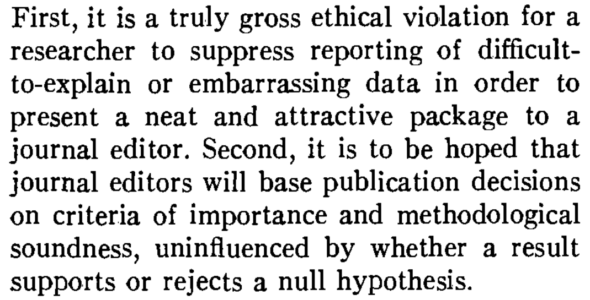
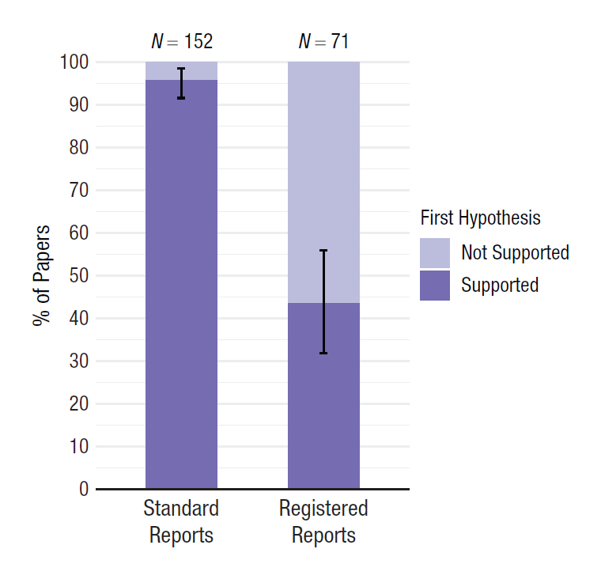
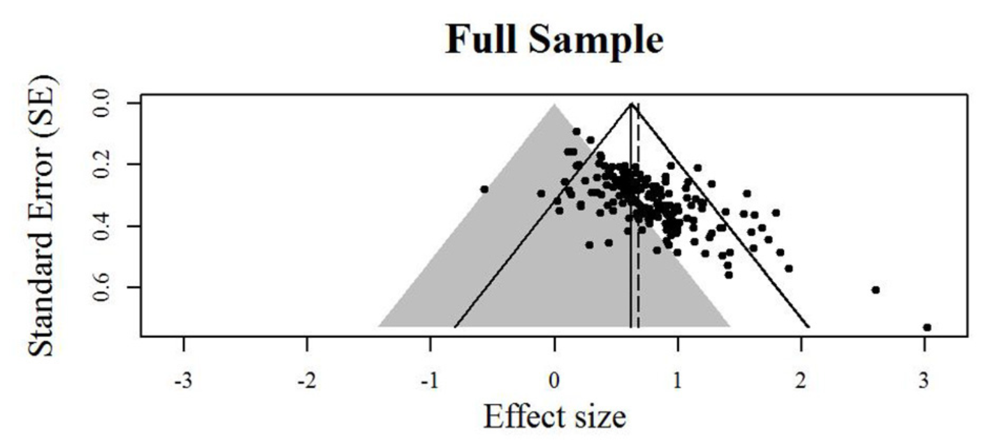
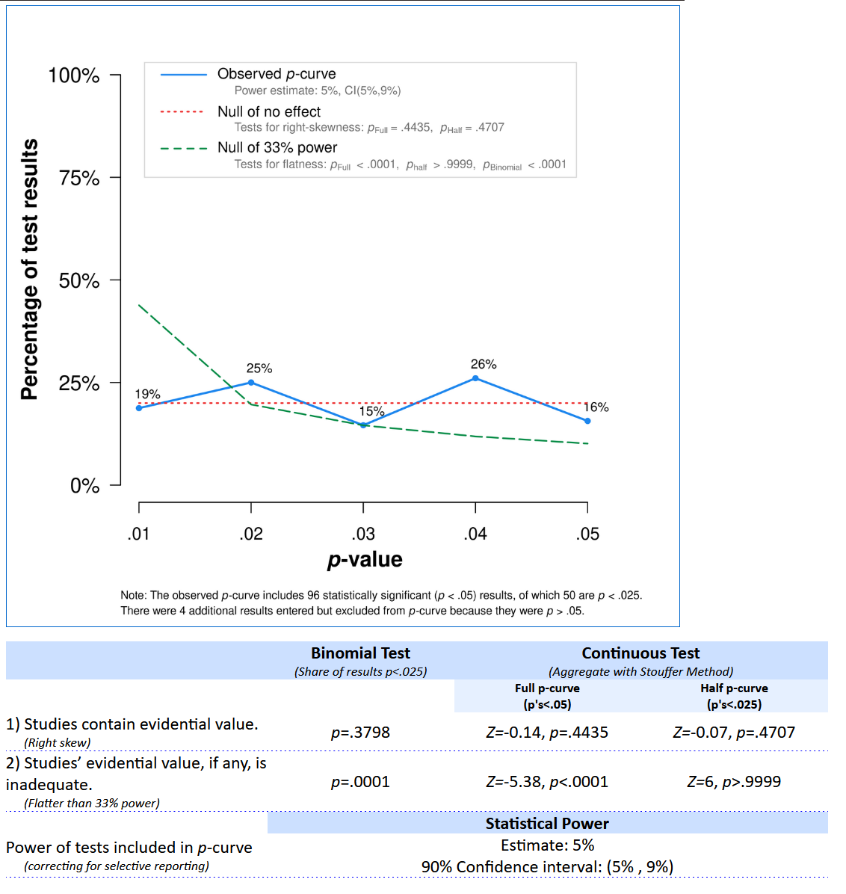

```{r, include = FALSE}
source("include/globals.R")

# for students
library(metafor)
library(truncnorm)
```

# Bias detection{#bias}

Bias can be introduced throughout the research process. It is useful to prevent this or to detect it. Some researchers recommend a skeptical attitude towards any claim you read in the scientific literature. For example, the philosopher of science Deborah Mayo [-@mayo_statistical_2018] writes: "Confronted with the statistical news flash of the day, your first question is: Are the results due to selective reporting, cherry picking, or any number of other similar ruses?". You might not make yourself very popular if this is the first question you ask a speaker at the next scientific conference you are attending, but at the same time it would be naïve to ignore the fact that researchers more or less intentionally introduce bias into their claims.

At the most extreme end of practices that introduce bias into scientific research is **research misconduct**: Making up data or results, or changing or omitting data or results such that the research isn’t accurately represented in the research record. For example, [Andrew Wakefield](https://en.wikipedia.org/wiki/Andrew_Wakefield) authored a fraudulent paper in 1998 that claimed a link between the measles, mumps, and rubella (MMR) vaccine and autism. It was retracted in 2010, but only after it caused damage to trust in vaccines among some parts of the general population. The website Retraction Watch maintains a [database](http://retractiondatabase.org) that tracks reasons why scientific papers are retracted, including data fabrication. It is unknown how often data fabrication occurs in practice, but some estimates suggest that almost 2% of scientists have fabricated, falsified or modified data or results at least once [@fanelli_how_2009].

A different category of mistakes are statistical reporting errors, which range from reporting incorrect degrees of freedom, to reporting *p* = 0.056 as *p* < 0.05 [@nuijten_prevalence_2015]. Although we should do our best to prevent errors, everyone makes them, and data and code sharing become more common, it will become easier to detect errors in the work of other researchers. As Dorothy Bishop [-@bishop_fallibility_2018] writes: "As open science becomes increasingly the norm, we will find that everyone is fallible. The reputations of scientists will depend not on whether there are flaws in their research, but on how they respond when those flaws are noted."

[Statcheck](http://statcheck.io/) is software that automatically extracts statistics from articles and recomputes their *p*-values, as long as statistics are reported following guidelines from the American Psychological Association (APA). It checks if the reported statistics are internally consistent: Given the test statistics and degrees of freedom, is the reported *p*-value accurate? If it is, that makes it less likely that you have made a mistake (although it does not prevent coherent mistakes!) and if it is not, you should check if all the information in your statistical test is accurate. Statcheck is not perfect, and it will make Type 1 errors where it flags something as an error when it actually is not, but it is an easy to use tool to check your articles before you submit them for publication. 

Some inconsistencies in data are less easy to automatically detect, but can be identified manually. For example, @brown_grim_2017 show that many papers report means that are not possible given the sample size (known as the [*GRIM* test](http://nickbrown.fr/GRIM)). For example, Matti Heino noticed in a [blog post](https://mattiheino.com/2016/11/13/legacy-of-psychology/) that three of the reported means in the table in a classic study by Festinger and Carlsmith are mathematically impossible. With 20 observations per condition, and a scale from -5 to 5, all means should end in a multiple of 1/20, or 0.05. The three means ending in X.X8 or X.X2 are not consistent with the reported sample size and scale. Of course, such inconsistencies can be due to failing to report that there was missing data for some of the questions, but the GRIM test has also been used to uncover [scientific misconduct](https://en.wikipedia.org/wiki/GRIM_test). 


(ref:festingerlab) Screenshot of the table reporting the main results from Festinger and Carlsmith, 1959

```{r festinger, echo = FALSE, fig.cap="(ref:festingerlab)"}
knitr::include_graphics("images/festinger_carlsmith.png")
```

## Publication bias

Publication bias is one of the biggest challenges that science faces. **Publication bias** is the practice of selectively submitting and publishing scientific research, often based on whether or not the results are ‘statistically significant’ or not. The scientific literature is dominated by these statistically significant results. At the same time, we know that many studies researchers perform do not yield significant results. When scientists only have access to significant results, but not to all results, they are lacking a complete overview of the evidence for a hypothesis. In extreme cases, selective reporting can lead to a situation where there are hundreds of statistically significant results in the published literature, but no true effect because there are even more non-significant studies that are not shared. This is known as the **file-drawer problem**, when non-significant results are hidden away in file-drawers (or nowadays, folders on your computer) and not available to the scientific community. Every scientist should work towards solving publication bias, because it is extremely difficult to learn what is likely to be true as long as scientists do not share all their results, and because, as Greenwald [-@greenwald_consequences_1975] notes, it is an ethical violation. 


(ref:greenwaldlab) Screenshot of the final sentences of Greenwald, A. G. (1975). Consequences of prejudice against the null hypothesis. Psychological Bulletin, 82(1), 1–20.

```{r greenwald, echo = FALSE, out.width  = '100%', fig.cap="(ref:greenwaldlab)"}

```

Publication bias can only be fixed by making all your research results available to fellow scientists, irrespective of the *p*-value of the main hypothesis test. Registered Reports are one way to combat publication bias, as this type of scientific article is reviewed based on the introduction, method, and statistical analysis plan, before the data is collected [@chambers_past_2022; @nosek_registered_2014]. After peer review by experts in the field, who might suggest improvements to the design and analysis, the article can get an 'in principle acceptance', which means that as long as the research plan is followed, the article will be published, regardless of the results. This should facilitate the publication of null results, and as shown in Figure \@ref(fig:scheel), an analysis of the first published Registered Reports in psychology revealed that 31 out of 71 (44%) articles observed positive results, compared to 146 out of 152 (96%) of comparable standard scientific articles published during the same time period [@scheel_excess_2021].


(ref:scheellab) Positive result rates for standard reports and Registered Reports. Error bars indicate 95% confidence intervals around the observed positive result rate.

```{r scheel, echo = FALSE, out.width  = '75%', fig.cap="(ref:scheellab)"}

```

In the past, Registered Reports did not exist, and scientists did not share all results [@franco_publication_2014; @greenwald_consequences_1975; @sterling_publication_1959], and as a consequence, we have to try to detect the extent to which publication bias impacts our ability to accurately evaluate the literature. Meta-analyses should always carefully examine the impact of publication bias on the meta-analytic effect size estimate - even though only an estimated 57% of meta-analyses published in Psychological Bulletin between 1990 to 2017 report that they assessed publication bias [@polanin_transparency_2020]. In more recent meta-analyses published in educational research 82% used bias detection tests, but the methods used were typically far from the state-of-the-art [@ropovik_neglect_2021]. Several techniques to detect publication bias have been developed, and this continues to be a very active field of research. All techniques are based on specific assumptions, which you should consider before applying a test [@carter_correcting_2019]. There is no silver bullet: None of these techniques can fix publication bias. None of them can tell you with certainty what the true meta-analytic effect size is corrected for publication bias. The best these methods can do is detect publication bias caused by specific mechanisms, under specific conditions. Publication bias can be detected, but it can not be corrected. 

In the chapter on [likelihoods](#likelihoods) we saw how mixed results are to be expected, and can be strong evidence for the alternative hypothesis. It is not only the case that mixed results should be expected, but exclusively observing statistically significant results, especially when the statistical power is low, is very surprising. With the commonly used lower limit for statistical power of 80%, a non-significant result in one out of five studies when there is a true effect. Some researchers have pointed out that *not* finding mixed results can be very unlikely (or ‘too good to be true’) in a set of studies [@francis_frequency_2014; @schimmack_ironic_2012]. We don’t have a very good feeling for what real patterns of studies look like, because we are continuously exposed to a scientific literature that does not reflect reality. Almost all multiple study papers in the scientific literature present only statistically significant results, even though this is unlikely.

The [online Shiny app we used to compute binomial likelihoods](http://shiny.ieis.tue.nl/mixed_results_likelihood/) displays, if you scroll to the bottom of the page, binomial probabilities to find multiple significant findings given a specific assumption about the power of the tests. Francis [@francis_frequency_2014] used these binomial likelihoods to calculate the test of excessive significance [@ioannidis_exploratory_2007] for 44 articles published in the journal Psychological Science between 2009 and 2012 that contained four studies or more. He found that for 36 of these articles, the likelihood of observing four significant results, given the average power computed based on the observed effect sizes, was less than 10%. Given his choice of an alpha level of 0.10, this binomial probability is a hypothesis test, and allows the claims (at a 10% alpha level) that whenever the binomial probability of the number of statistically significant results is lower than 10%, the data is surprising, and we can reject the hypothesis that this is an unbiased set of studies. In other words, it is unlikely that this many significant results would be observed, suggesting that publication bias or other selection effects have played a role in these articles. 

One of these 44 articles had been co-authored by myself [@jostmann_weight_2009]. At this time, I knew little about statistical power and publication bias, and being accused of improper scientific conduct was stressful. And yet, the accusations were correct - we had selectively reported results, and selectively reported analyses that worked. Having received virtually no training on this topic, we educated ourselves, and uploaded an unpublished study to the website psychfiledrawer.org (which no longer exists) to share our filedrawer. Some years later, we assisted when Many Labs 3 included one of the studies we had published in the set of studies they were replicating [@ebersole_many_2016], and when a null result was observed, we wrote "We have had to conclude that there is actually no reliable evidence for the effect" [@jostmann_short_2016]. I hope this educational materials prevents others from making a fool of themselves like we did. 

## Bias detection in meta-analysis

New methods to detect publication bias are continuously developed, and old methods become outdated (even though you can still see them appear in meta-analyses). One outdated method is known as **fail-safe N**. The idea was to calculate the number of non-significant results one would need to have in file-drawers before an observed meta-analytic effect size estimate would no longer be statistically different from 0. It is [no longer recommended](https://handbook-5-1.cochrane.org/chapter_10/10_4_4_3_fail_safe_n.htm), and Becker [-@becker_failsafe_2005] writes "Given the other approaches that now exist for dealing with publication bias, the failsafe N should be abandoned in favor of other, more informative analyses". Currently, the only use fail-safe N has is as a tool to identify meta-analyses that are not state-of-the-art.  

Before we can explain a second method (Trim-and-Fill), it’s useful to explain a common way to visualize meta-analyses, known as a **funnel plot**. In a funnel plot, the x-axis is used to plot the effect size of each study, and the y-axis is used to plot the ‘precision’ of each effect size. Typically, the y-axis is used to plot the standard error of each effect size estimate. The larger the number of observations in a study, the more precise the effect size estimate, the smaller the standard error, and thus the higher up in the funnel plot the study will be. An infinitely precise study (with a standard error of 0) would be at the top of y-axis. 

The script below simulates meta-analyses for `nsims` studies, and stores all the results needed need to examine bias detection tools. In the first section of the script, statistically significant results in the desired direction are simulated, and in the second part null results are generated. The script generates a percentage of significant results as indicated by `pub.bias` - when set to 1, all results are significant. In the code below, `pub.bias` is set to 0.05. Because there is no true effect in the simulation (`m1` and `m2` are equal, so there is no difference between the groups), the only significant results that should be expected are the 5% false positives. Finally, the meta-analysis is performed, the results are printed, and a funnel plot is created.

```{r metasim, eval = FALSE}
library(metafor)
library(truncnorm)

nsims <- 100 # number of simulated experiments
pub.bias <- 0.05 # set percentage of significant results in the literature

m1 <- 0 # too large effects will make non-significant results extremely rare
sd1 <- 1
m2 <- 0
sd2 <- 1
metadata.sig <- data.frame(m1 = NA, m2 = NA, sd1 = NA, sd2 = NA, 
                           n1 = NA, n2 = NA, pvalues = NA, pcurve = NA)
metadata.nonsig <- data.frame(m1 = NA, m2 = NA, sd1 = NA, sd2 = NA, 
                              n1 = NA, n2 = NA, pvalues = NA, pcurve = NA)

# simulate significant effects in the expected direction
if(pub.bias > 0){
for (i in 1:nsims*pub.bias) { # for each simulated experiment
  p <- 1 # reset p to 1
  n <- round(truncnorm::rtruncnorm(1, 20, 1000, 100, 100)) # n based on truncated normal
  while (p > 0.025) { # continue simulating as along as p is not significant
    x <- rnorm(n = n, mean = m1, sd = sd1) 
    y <- rnorm(n = n, mean = m2, sd = sd2) 
    p <- t.test(x, y, alternative = "greater", var.equal = TRUE)$p.value
  }
  metadata.sig[i, 1] <- mean(x)
  metadata.sig[i, 2] <- mean(y)
  metadata.sig[i, 3] <- sd(x)
  metadata.sig[i, 4] <- sd(y)
  metadata.sig[i, 5] <- n
  metadata.sig[i, 6] <- n
  out <- t.test(x, y, var.equal = TRUE)
  metadata.sig[i, 7] <- out$p.value
  metadata.sig[i, 8] <- paste0("t(", out$parameter, ")=", out$statistic)
}}

# simulate non-significant effects (two-sided)
if(pub.bias < 1){
for (i in 1:nsims*(1-pub.bias)) { # for each simulated experiment
  p <- 0 # reset p to 1
  n <- round(truncnorm::rtruncnorm(1, 20, 1000, 100, 100))
  while (p < 0.05) { # continue simulating as along as p is significant
    x <- rnorm(n = n, mean = m1, sd = sd1) # produce  simulated participants
    y <- rnorm(n = n, mean = m2, sd = sd2) # produce  simulated participants
    p <- t.test(x, y, var.equal = TRUE)$p.value
  }
  metadata.nonsig[i, 1] <- mean(x)
  metadata.nonsig[i, 2] <- mean(y)
  metadata.nonsig[i, 3] <- sd(x)
  metadata.nonsig[i, 4] <- sd(y)
  metadata.nonsig[i, 5] <- n
  metadata.nonsig[i, 6] <- n
  out <- t.test(x, y, var.equal = TRUE)
  metadata.nonsig[i, 7] <- out$p.value
  metadata.nonsig[i, 8] <- paste0("t(", out$parameter, ")=", out$statistic)
}}

# Combine significant and non-significant effects
metadata <- rbind(metadata.nonsig, metadata.sig)

# Use escalc to compute effect sizes
metadata <- escalc(n1i = n1, n2i = n2, m1i = m1, m2i = m2, sd1i = sd1, 
  sd2i = sd2, measure = "SMD", data = metadata[complete.cases(metadata),])
# add se for PET-PEESE analysis
metadata$sei <- sqrt(metadata$vi)

#Perform meta-analysis
result <- metafor::rma(yi, vi, data = metadata)
result

# Print a Funnel Plot
metafor::funnel(result, level = 0.95, refline = 0)
abline(v = result$b[1], lty = "dashed") #  vertical line at meta-analytic ES
points(x = result$b[1], y = 0, cex = 1.5, pch = 17) # add point

```

Let’s start by looking at what unbiased research looks like, by running the code, keeping `pub.bias` at 0.05, such that only 5% Type 1 errors enter the scientific literature.

```{r metasim1, echo = FALSE}
library(metafor)
library(truncnorm)

set.seed(52)
nsims <- 100 # number of simulated experiments
pub.bias <- 0.05 # set percentage of significant results in the literature

m1 <- 0 # too large effects will make non-significant results extremely rare
sd1 <- 1
m2 <- 0
sd2 <- 1
metadata.sig <- data.frame(m1 = NA, m2 = NA, sd1 = NA, sd2 = NA, 
                           n1 = NA, n2 = NA, pvalues = NA, pcurve = NA)
metadata.nonsig <- data.frame(m1 = NA, m2 = NA, sd1 = NA, sd2 = NA, 
                              n1 = NA, n2 = NA, pvalues = NA, pcurve = NA)

# simulate significant effects in the expected direction
if(pub.bias > 0){
for (i in 1:nsims*pub.bias) { # for each simulated experiment
  p <- 1 # reset p to 1
  n <- round(truncnorm::rtruncnorm(1, 20, 1000, 100, 100)) # n based on truncated normal
  while (p > 0.025) { # continue simulating as along as p is not significant
    x <- rnorm(n = n, mean = m1, sd = sd1) 
    y <- rnorm(n = n, mean = m2, sd = sd2) 
    p <- t.test(x, y, alternative = "greater", var.equal = TRUE)$p.value
  }
  metadata.sig[i, 1] <- mean(x)
  metadata.sig[i, 2] <- mean(y)
  metadata.sig[i, 3] <- sd(x)
  metadata.sig[i, 4] <- sd(y)
  metadata.sig[i, 5] <- n
  metadata.sig[i, 6] <- n
  out <- t.test(x, y, var.equal = TRUE)
  metadata.sig[i, 7] <- out$p.value
  metadata.sig[i, 8] <- paste0("t(", out$parameter, ")=", out$statistic)
}}

# simulate non-significant effects (two-sided)
if(pub.bias < 1){
for (i in 1:nsims*(1-pub.bias)) { # for each simulated experiment
  p <- 0 # reset p to 1
  n <- round(truncnorm::rtruncnorm(1, 20, 1000, 100, 100))
  while (p < 0.05) { # continue simulating as along as p is significant
    x <- rnorm(n = n, mean = m1, sd = sd1) # produce  simulated participants
    y <- rnorm(n = n, mean = m2, sd = sd2) # produce  simulated participants
    p <- t.test(x, y, var.equal = TRUE)$p.value
  }
  metadata.nonsig[i, 1] <- mean(x)
  metadata.nonsig[i, 2] <- mean(y)
  metadata.nonsig[i, 3] <- sd(x)
  metadata.nonsig[i, 4] <- sd(y)
  metadata.nonsig[i, 5] <- n
  metadata.nonsig[i, 6] <- n
  out <- t.test(x, y, var.equal = TRUE)
  metadata.nonsig[i, 7] <- out$p.value
  metadata.nonsig[i, 8] <- paste0("t(", out$parameter, ")=", out$statistic)
}}

# Combine significant and non-significant effects
metadata <- rbind(metadata.nonsig, metadata.sig)

# Use escalc to compute effect sizes
metadata <- escalc(n1i = n1, n2i = n2, m1i = m1, m2i = m2, sd1i = sd1, 
  sd2i = sd2, measure = "SMD", data = metadata[complete.cases(metadata),])
# add se for PET-PEESE analysis
metadata$sei <- sqrt(metadata$vi)

#Perform meta-analysis
result <- metafor::rma(yi, vi, data = metadata)
result

```

When we examine the results of the meta-analysis we see there are 100 studies in the meta-analysis (`k = 100`), and there is no statistically significant heterogeneity (*p* = `r  round(result$QEp,2)`, which is not too surprising, as we programmed the simulation to have a true effect size of 0, and there is no heterogeneity in effect sizes). We also get the results for the meta-analysis. The meta-analytic estimate is *d* = `r round(result$b[1], 3)`, which is very close to 0 (as it should be, because the true effect size is indeed 0). The standard error around this estimate is `r  round(result$se,3)`. With 100 studies, we have a very accurate estimate of the true effect size. The *Z*-value for the test against *d* = 0 is `r  round(result$zval,3)`, and the *p*-value for this test is `r  round(result$pval,2)`. We can not reject the hypothesis that the true effect size is 0. The CI around the effect size estimate (`r  round(result$ci.lb,3)`, `r  round(result$ci.ub,3)`) includes 0. 

If we examine the funnel plot in Figure \@ref(fig:funnel1) we see each study represented as a dot. The larger the sample size, the higher up in the plot, and the smaller the sample size, the lower in the plot. The white pyramid represent the area within which a study is not statistically significant, because the observed effect size (x-axis) is not far enough removed from 0 such that the confidence interval around the observed effect size would exclude 0. The lower the standard error, the more narrow the confidence interval, and the smaller the effect sizes can can be statistically significant. At the same time, the smaller the standard error, the closer the effect size will be to the true effect size, so the less likely we will see effects far away from 0. We should expect 95% of the effect size estimates to fall within the funnel, if it is centered on the true effect size. We see only a few studies (five, to be exact) fall outside the white pyramid on the right side of the plot. These are the 5% significant results that we programmed in the simulation. Note that all 5 of these studies are false positives, as there is no true effect. If there was a true effect (you can re-run the simulation and set *d* to 0.5 by changing `m1 <- 0` in the simulation to `m1 <- 0.5`) the pyramid cloud of points would move to the right, and be centered on 0.5 instead of 0.  


(ref:funnel1lab) Funnel plot of unbiased null results.

```{r funnel1, echo = FALSE, fig.cap="(ref:funnel1lab)"}
# Print a Funnel Plot
par(bg = backgroundcolor)
metafor::funnel(result, level = 0.95, refline = 0)
abline(v = result$b[1], lty = "dashed") #  vertical line at meta-analytic ES
points(x = result$b[1], y = 0, cex = 1.5, pch = 17) # add point

```

We can now compare the unbiased meta-analysis above with a biased meta-analysis. We can simulate a situation with extreme publication bias. Building on the estimate by @scheel_excess_2021, let's assume 96% of the studies show positive results. We set `pub.bias <- 0.96` in the code. We keep both means at 0, so there still is not real effect, but we will end up with mainly Type 1 errors in the predicted direction in the final set of studies. After simulating biased results, we can perform the meta-analysis to see if the statistical inference based on the meta-analysis is misleading. 

```{r metasim2, echo = FALSE}
set.seed(5)
nsims <- 100 # number of simulated experiments
pub.bias <- 0.96 # set percentage of significant results in the literature

m1 <- 0 # too large effects will make non-significant results extremely rare
sd1 <- 1
m2 <- 0
sd2 <- 1
metadata.sig <- data.frame(m1 = NA, m2 = NA, sd1 = NA, sd2 = NA, 
                           n1 = NA, n2 = NA, pvalues = NA, pcurve = NA)
metadata.nonsig <- data.frame(m1 = NA, m2 = NA, sd1 = NA, sd2 = NA, 
                              n1 = NA, n2 = NA, pvalues = NA, pcurve = NA)

# simulate significant effects in the expected direction
if(pub.bias > 0){
for (i in 1:nsims*pub.bias) { # for each simulated experiment
  p <- 1 # reset p to 1
  n <- round(truncnorm::rtruncnorm(1, 20, 1000, 100, 100)) # n based on truncated normal
  while (p > 0.025) { # continue simulating as along as p is not significant
    x <- rnorm(n = n, mean = m1, sd = sd1) 
    y <- rnorm(n = n, mean = m2, sd = sd2) 
    p <- t.test(x, y, alternative = "greater", var.equal = TRUE)$p.value
  }
  metadata.sig[i, 1] <- mean(x)
  metadata.sig[i, 2] <- mean(y)
  metadata.sig[i, 3] <- sd(x)
  metadata.sig[i, 4] <- sd(y)
  metadata.sig[i, 5] <- n
  metadata.sig[i, 6] <- n
  out <- t.test(x, y, var.equal = TRUE)
  metadata.sig[i, 7] <- out$p.value
  metadata.sig[i, 8] <- paste0("t(", out$parameter, ")=", out$statistic)
}}

# simulate non-significant effects (two-sided)
if(pub.bias < 1){
for (i in 1:nsims*(1-pub.bias)) { # for each simulated experiment
  p <- 0 # reset p to 1
  n <- round(truncnorm::rtruncnorm(1, 20, 1000, 100, 100))
  while (p < 0.05) { # continue simulating as along as p is significant
    x <- rnorm(n = n, mean = m1, sd = sd1) # produce  simulated participants
    y <- rnorm(n = n, mean = m2, sd = sd2) # produce  simulated participants
    p <- t.test(x, y, var.equal = TRUE)$p.value
  }
  metadata.nonsig[i, 1] <- mean(x)
  metadata.nonsig[i, 2] <- mean(y)
  metadata.nonsig[i, 3] <- sd(x)
  metadata.nonsig[i, 4] <- sd(y)
  metadata.nonsig[i, 5] <- n
  metadata.nonsig[i, 6] <- n
  out <- t.test(x, y, var.equal = TRUE)
  metadata.nonsig[i, 7] <- out$p.value
  metadata.nonsig[i, 8] <- paste0("t(", out$parameter, ")=", out$statistic)
}}

# Combine significant and non-significant effects
metadata <- rbind(metadata.nonsig[complete.cases(metadata.nonsig),],
                  metadata.sig[complete.cases(metadata.sig),])

# Use escalc to compute effect sizes
metadata <- metafor::escalc(n1i = n1, n2i = n2, m1i = m1, m2i = m2, sd1i = sd1, 
  sd2i = sd2, measure = "SMD", data = metadata)
# add se for PET-PEESE analysis
metadata$sei <- sqrt(metadata$vi)

#Perform meta-analysis
result.biased <- metafor::rma(yi, vi, data = metadata)
result.biased

```

The biased nature of the set of studies we have analyzed becomes clear if we examine the funnel plot in Figure \@ref(fig:funnel2). The pattern is quite peculiar. We see four unbiased null results, as we programmed into the simulation, but the remainder of the 96 studies are statistically significant, even though the null is true. We see most studies fall just on the edge of the white pyramid. Because *p*-values are uniformly distributed under the null, the Type 1 errors we observe often have *p*-values in the range of 0.02 to 0.05, unlike what we would expect if there was a true effect. These just significant *p*-values fall just outside of the white pyramid. The large the study, the smaller the effect size that is significant. The fact that the effect sizes do not vary around a single true effect size (e.g., *d* = 0 or *d* = 0.5), but that effect sizes become smaller, the larger the sample size (or the smaller the standard error), is a strong indicator of bias. The vertical dotted line and black triangle at the top of the plot illustrate the observed (upwardly biased) meta-analytic effect size estimate. 


(ref:funnel2lab) Funnel plot of biased null results with mostly significant results.

```{r funnel2, echo = FALSE, fig.cap="(ref:funnel2lab)"}
# Print a Funnel Plot
par(bg = backgroundcolor)
metafor::funnel(result.biased, level = 0.95, refline = 0)
abline(v = result.biased$b[1], lty = "dashed") #  vertical line at meta-analytic ES
points(x = result.biased$b[1], y = 0, cex = 1.5, pch = 17) # add point
```

One might wonder if such extreme bias ever really emerges in scientific research. It does. In Figure \@ref(fig:carterbias) we see a funnel plot by @carter_publication_2014 who examined bias in 198 published studies testing the 'ego-depletion' effect, the idea that self-control relies on a limited resource. Do you notice any similarities to the extremely biased meta-analysis we simulated above? You might not be surprised that, even though before 2015 researchers thought there was a large and reliable literature demonstrating ego-depletion effects, a Registered Replication report yielded a non-significant effect size estimate [@hagger_multilab_2016], and even when the original researchers tried to replicate their own work, they failed to observe a significant effect of ego-depletion [@vohs_multisite_2021]. Imagine the huge amount of wasted time, effort, and money on a literature that was completely based on bias in scientific research. Obviously, such research waste has ethical implications, and researchers need to take their responsibility to prevent such waste in the future.


(ref:carterbiaslab) Funnel plot from Carter and McCullough (2014) vizualizing bias in 198 published tests of the ego-depletion effect.

```{r carterbias, echo = FALSE, fig.cap="(ref:carterbiaslab)"}

```

We can also see signs of bias in the forest plot for a meta-analysis. In Figure \@ref(fig:twoforestplot) two forest plots are plotted side by side. The left forest plot is based on unbiased data, the right forest plot is based on biased data. The forest plots are a bit big with 100 studies, but we see that in the left forest plot effects randomly vary around 0 as they should. On the right,  beyond the first four studies, all confidence intervals magically just exclude an effect of 0.  

(ref:twoforestplotlab) Forest plot of unbiased meta-analysis (left) and biased meta-analysies (right).

```{r twoforestplot, echo = FALSE, fig.width=5, fig.height=15, fig.cap="(ref:twoforestplotlab)"}
par(mfrow=c(1,2))
par(mar=c(5,4,1,1))
par(bg = backgroundcolor)
forest(result, annotate=FALSE, cex=.8, at=seq(-2,2,1), digits=1, xlim=c(-5,2))
par(mar=c(5,3,1,2))
forest(result.biased, annotate=FALSE, slab=rep("",length(result$yi)), cex=.8, at=seq(-2,2,1), digits=1, xlim=c(-4,3))
par(mfrow=c(1,1))
```

When there is publication bias because researchers only publish statistically significant results (*p* \< $\alpha$), and you calculate the effect size in a meta-analysis, the meta-analytic effect size estimate is **higher** when there is publication bias (where researchers publish only effects with *p* \< $\alpha$) compared to when there is no publication bias. This is because publication bias filters out the smaller (non-significant) effect sizes. which are then not included in the computation of the meta-analytic effect size. This leads to a meta-analytic effect size estimate that is larger than the true population effect size. With strong publication bias, we know the meta-analytic effect size is inflated, but we don't know by how much. The true effect size could just be a bit smaller, but the true effect size could also be 0, such as in the case of the ego-depletion literature.

## Trim and Fill  

Trim and fill is a technique that aims to augment a dataset by adding hypothetical ‘missing’ studies (that may be in the ‘file-drawer’). The procedure starts by removing (‘trimming’) small studies that bias the meta-analytic effect size, then estimates the true effect size, and ends with ‘filling’ in a funnel plot with studies that are assumed to be missing due to publication bias. In the Figure \@ref(fig:trimfill1), you can see the same funnel plot as above, but now with added hypothetical studies (the unfilled circles which represent ‘imputed’ studies). If you look closely, you’ll see these points each have a mirror image on the opposite side of the meta-analytic effect size estimate (this is clearest in the lower half of the funnel plot). If we examine the result of the meta-analysis that includes these imputed studies, we see that trim and fill successfully alerts us to the fact that the meta-analysis is biased (if not, it would not add imputed studies) but it fails misearably in correcting the effect size estimate. In the funnel plot, we see the original (biased) effect size estimate indicated by the triangle, and the meta-analytic effect size estimate adjusted with the trim-and-fill method (indicated by the black circle). We see the meta-analytic effect size estimate is a bit lower, but given that the true effect size in the simulation was 0, the adjustment is clearly not sufficient.  


(ref:trimfill1lab) Funnel plot with assumed missing effects added through trim-and-fill.

```{r trimfill1, fig.margin = FALSE, echo = FALSE, fig.cap="(ref:trimfill1lab)"}

result.trimfill <- metafor::trimfill(result.biased)
par(bg = backgroundcolor)
metafor::funnel(result.trimfill, refline = 0)
abline(v = result.biased$b[1], lty = "dashed") #  vertical line at meta-analytic ES
points(x = result.biased$b[1], y = 0, cex = 1.5, pch = 17) # add point
abline(v = result.trimfill$b[1], lty = "dotted") #  vertical line at meta-analytic ES
points(x = result.trimfill$b[1], y = 0, cex = 1.5, pch = 16) # add point
```

Trim-and-fill is not very good under many realistic publication bias scenarios. The method is criticized for its reliance on the strong assumption of symmetry in the funnel plot. When publication bias is based on the *p*-value of the study (arguably the most important source of publication bias in many fields) the trim-and-fill method does not perform well enough to yield a corrected meta-analytic effect size estimate that is close to the true effect size [@peters_performance_2007; @terrin_adjusting_2003]. When the assumptions are met, it can be used as a **sensitivity analysis.** Researchers should not report the trim-and-fill corrected effect size estimate as a realistic estimate of the unbiased effect size. If other bias-detection tests (like *p*-curve or *z*-curve discussed below) have already indicating the presence of bias, the trim-and-fill procedure might not provide additional insights. 

## PET-PEESE  

A novel class of solutions to publication bias is **meta-regression**. Instead of plotting a line through individual data-points, in meta-regression a line is plotted through data points that each represent a study. As with normal regression, the more data meta-regression is based on, the more precise the estimate is, and therefore, the more studies in a meta-analysis, the better meta-regression will work in practice. If the number of studies is small, all bias detection tests lose power, and this is something that one should keep in mind when using meta-regression. Furthermore, regression requires sufficient variation in the data, which in the case of meta-regression means a wide range of sample sizes (recommendations indicate meta-regression performs well if studies have a range from 15 to 200 participants in each group – which is not typical for most research areas in psychology). Meta-regression techniques try to estimate the population effect size if precision was perfect (so when the standard error = 0).  

One meta-regression technique is known as PET-PEESE [@stanley_meta-regression_2014; @stanley_finding_2017]. It consists of a ‘precision-effect-test’ (PET) which can be used in a Neyman-Pearson hypothesis testing framework to test whether the meta-regression estimate can reject an effect size of 0 based on the 95% CI around the PET estimate at the intercept SE = 0. Note that when the confidence interval is very wide due to a small number of observations, this test might have low power, and have an a-priori low probability of rejecting the null effect. The estimated effect size for PET is calculated with: $d = β_0 + β_1SE_i + _ui$ where d is the estimated effect size, SE is the standard error, and the equation is estimated using weighted least squares (WLS), with 1/SE2i as the weights. The PET estimate underestimates the effect size when there is a true effect. Therefore, the PET-PEESE procedure recommends first using PET to test whether the null can be rejected, and if so, then PEESE should be used to estimate the meta-analytic effect size. In PEESE, the standard error (used in PET) is replaced by the variance (i.e., the standard error squared), which @stanley_meta-regression_2014 find reduces the bias of the estimated meta-regression intercept.  

PET-PEESE has limitations, as all bias detection techniques have. The biggest limitations are that it does not work well when there are few studies, all studies in a meta-analysis have small sample sizes, or when there is large heterogeneity in the meta-analysis [@stanley_finding_2017]. When these situations apply (and they will in practice), PET-PEESE might not be a good approach. Furthermore, there are some situations where there might be a correlation between sample size and precision, which in practice will often be linked to heterogeneity in the effect sizes included in a meta-analysis. For example, if true effects are different across studies, and people perform power analyses with accurate information about the expected true effect size, large effect sizes in a meta-analysis will have small sample sizes, and small effects will have large sample sizes. Meta-regression is, like normal regression, a way to test for an association, but you need to think about the causal mechanism behind the association.

Let’s explore how PET-PEESE meta-regression attempts to give us an unbiased effect size estimate, under specific assumptions of how publication bias is caused. In Figure \@ref(fig:petpeese) we once again see the funnel plot, not complemented with 2 additional lines through the plots. The vertical line at *d* = 0.27 is the meta-analytic effect size estimate, which is upwardly biased because we are averaging over statistically significant studies only. There are 2 additional lines, which are the meta-regression lines for PET-PEESE based on the formulas detailed previously. The straight diagonal line gives us the PET estimate at a SE of 0 (an infinite sample, at the top of the plot), indicated by the circle. The dotted line around this PET estimate is the 95% confidence interval for the estimate. In this case, the 95% CI contains 0, which means that based on the PET estimate of *d* = 0.02, we cannot reject a meta-analytic effect size of 0. Note that even with 100 studies, the 95% CI is quite wide. Meta-regression is, just like normal regression, only as accurate as the data we have data. This is one limitation of PET-PEESE meta-regression: With small numbers of studies in the meta-analysis, it has low accuracy. If we had been able to reject the null based on the PET estimate, we would then have used the PEESE estimate of *d* = 0.17 for the meta-analytic effect size, corrected for bias (while never knowing whether the model underlying the PEESE estimate corresponded to the true bias generating mechanisms in the meta-analysis, and thus if the meta-analytic estimate was accurate).  


(ref:petpeeselab) Funnel plot with PETPEESE regression lines.

```{r petpeese, echo = FALSE, fig.cap="(ref:petpeeselab)"}

# PET PEESE code below is adapted from Joe Hilgard: https://github.com/Joe-Hilgard/PETPEESE/blob/master/PETPEESE_functions.R
# PET
PET <- metafor::rma(yi = yi, sei = sei, mods = ~sei, data = metadata, method = "FE")

# PEESE
PEESE <- metafor::rma(yi = yi, sei = sei, mods = ~I(sei^2), data = metadata, method = "FE")

# Funnel Plot 
par(bg = backgroundcolor)
metafor::funnel(result.biased, level = 0.95, refline = 0, main = paste("FE d =", round(result.biased$b[1],2),"PET d =", round(PET$b[1],2),"PEESE d =", round(PEESE$b[1],2)))
abline(v = result.biased$b[1], lty = "dashed") #draw vertical line at meta-analytic effect size estimate
points(x = result.biased$b[1], y = 0, cex = 1.5, pch = 17) #draw point at meta-analytic effect size estimate
# PET PEESE code below is adapted from Joe Hilgard: https://github.com/Joe-Hilgard/PETPEESE/blob/master/PETPEESE_functions.R
# PEESE line and point
sei <- (seq(0, max(sqrt(result.biased$vi)), .001))
vi <- sei^2
yi <- PEESE$b[1] + PEESE$b[2]*vi
grid <- data.frame(yi, vi, sei)
lines(x = grid$yi, y = grid$sei, typ = 'l') # add line for PEESE
points(x = (PEESE$b[1]), y = 0, cex = 1.5, pch = 5) # add point estimate for PEESE
# PET line and point
abline(a = -PET$b[1]/PET$b[2], b = 1/PET$b[2]) # add line for PET
points(x = PET$b[1], y = 0, cex = 1.5) # add point estimate for PET
segments(x0 = PET$ci.lb[1], y0 = 0, x1 = PET$ci.ub[1], y1 = 0, lty = "dashed") #Add 95% CI around PET

```

## *P*-value meta-analysis  

In addition to a meta-analysis of effect sizes, it is possible to perform a meta-analysis of *p*-values. The first of such approaches is known as the [**Fisher's combined probability test**](https://en.wikipedia.org/wiki/Fisher%27s_method), and more recent bias detection tests such as *p*-curve analysis [@simonsohn_p-curve_2014] and *p*-uniform* [@aert_correcting_2018] build on this idea. These two techniques are an example of selection model approaches to test and adjust for meta-analysis [@iyengar_selection_1988], where a model about the data generating process of the effect sizes is combined with a selection model of how publication bias impacts which effect sizes become part of the scientific literature.  

*P*-curve analysis tests whether the *p*-value distribution is flatter than what would be expected if the studies you analyze had 33% power (which suggests the distribution looks more like one expected when the null hypothesis is true), or more right-skewed than a uniform *p*-value distribution (which suggests the studies might have examined a true effect and had at least some power). As an example, let’s consider Figure 3 from Simonsohn and colleagues [-@simonsohn_p-curve_2014]. The authors compared 20 papers in the Journal of Personality and Social Psychology that used a covariate in the analysis, and 20 studies that did not use a covariate. The authors suspected that researchers might add a covariate in their analyses to try to find a *p*-value smaller than 0.05, when the first analysis they tried did not yield a significant effect.  


(ref:pcurvelab) Figure 3 from Simonsohn et al (2014) showing a *p*-curve with and without bias.

```{r pcurve, fig.margin = FALSE, echo = FALSE, fig.cap="(ref:pcurvelab)"}
knitr::include_graphics("images/pcurve.png")
```

The *p*-curve distribution of the observed *p*-values is represented by five points in the blue line. *P*-curve analysis is performed *only* on statistically significant results, based on the assumption that these are always published, and thus that this part of the *p*-value distribution contains all studies that were performed. The 5 points illustrate the percentage of *p*-values between 0 and 0.01, 0.01 and 0.02, 0.02 and 0.03, 0.03 and 0.04, and 0.04 and 0.05. In the figure on the right, you see a relatively normal right-skewed *p*-value distribution, with more low than high *p*-values. The *p*-curve analysis shows the blue line in the right figure is more right-skewed than the uniform red line (where the red line is the uniform *p*-value distribution expected if there was no effect). Simonsohn and colleagues summarize this pattern as an indication the set of studies has 'evidential value', but this terminolgy is somewhat misleading. The formally correct interpretation is that we can reject a *p*-value distribution as expected when the null hypothesis was true in all studies included in the *p*-curve analysis. Rejecting a uniform *p*-value distribution does not automatically mean there is evidence for the theorized effect (e.g., the pattern could be caused by a mix of null effects and a small subset of studies that show an effect due to a methodological confound). 

In the left figure we see the opposite pattern, with mainly high *p*-values around 0.05, and almost no *p*-values around 0.01. Because the blue line is significantly less right-skewed than the green line, the *p*-curve analysis suggests this set of studies is the result of selection bias, but was not generated by a set of sufficiently powered studies. P-curve analysis is a useful tool. But it is important to correctly interpret what a *p*-curve analysis can tell you. A right-skewed *p*-curve does not prove that there is no bias, or that the theoretical hypothesis is true. A flat *p*-curve does not prove that the theory is incorrect, but it does show that the studies that were meta-analyzed look more like the pattern that would be expected if the null hypothesis was true, and there was selection bias.  

The script stores all the test statistics for the 100 simulated *t*-tests that are included in the meta-analysis. The first few rows look like:  

```{r pcurveinput, echo = FALSE}
cat(metadata$pcurve[1:5],sep = "\n")
```

Print all test results with `cat(metadata$pcurve, sep = "\n")`, and go to the online *p*-curve app at  <http://www.p-curve.com/app4/>. Paste all the test results, and click the ‘Make the p-curve’ button. Note that the *p*-curve app will only yield a result when there are *p*-values smaller than 0.05 - if all test statistics yield a *p* \> 0.05, the *p*-curve cannot be computed, as these tests are ignored.


(ref:pcurveresultlab) Result of the p-curve analysis of the biased studies.

```{r pcurveresult, fig.margin = FALSE, echo = FALSE, fig.cap="(ref:pcurveresultlab)"}

```

The distribution of *p*-values clearly looks like it comes from a uniform distribution (as it indeed does), and the statistical test indicates we can reject a *p*-value distribution as steep or steeper as would be generated by a set of studies with 33% power, *p* < 0.0001. The app also provides an estimate of the average power of the tests that generated the observed *p*-value distribution, 5%, which is indeed correct. Therefore, we can conclude these studies, even though many effects are statistically significant, are more in line with selective reporting of Type 1 errors, than with a *p*-value distribution that should be expected if there was a true effect that was studied with sufficient statistical power. The theory might still be true, but the set of studies we have analyzed here do not provide support for the theory.

A similar meta-analytic technique is *p*-uniform\*, which can also be used to estimate a bias-adjusted meta-analytic effect size estimate. Below, we see the output of the *p*-uniform\* which estimates the bias-corrected effect size to be *d* = 0.0126, which is not statistically different from 0, *p* = 0.3857.

```{r}
puniform::puniform(m1i = metadata$m1, m2i = metadata$m2, n1i = metadata$n1, 
  n2i = metadata$n2, sd1i = metadata$sd1, sd2i = metadata$sd2, side = "right")
```

An even more novel technique that also meta-analyzes the *p*-values from individual studies is *z*-curve, which is basically a meta-analysis of observed power [@bartos_z-curve20_2020; @brunner_estimating_2020]; for an example, see [@sotola_garbage_2022]. Like a traditional meta-analysis, *z*-curve transforms observed test results (*p*-values) into *z*-scores. Using mixtures of normal distributions centered at means 0 to 6, *z*-curve aims to estimate the average power of the studies. The newest version of *z*-curve then calculates the *observed discovery rate* (ODR: the percentage of significant results, or the observed power), the *expected discovery rate* (EDR: the proportion of the area under the curve on the right side of the significance criterion) and the expected replication rate (ERR: the expected proportion of successfully replicated significant studies from all significant studies). *Z*-curve is able to correct for selection bias for positive results (under specific assumptions), and can estimate the EDR and ERR using only the significant *p*-values.

To examine the presence of bias, it is preferable to submit non-significant and significant *p*-values to a *z*-curve analysis, even if only the significant *p*-values are used to produce estimates. Publication bias can then be examined by comparing the ODR to the EDR. Since our simulated studies have bias, the *z*-curve analysis should be able to indicate this. 

```{r, cache = TRUE}
# Perform the z-curve analysis using the z-curve package
z_res <- zcurve::zcurve(p = metadata$pvalues, method = "EM", bootstrap = 1000)
summary(z_res, all = TRUE)
par(bg = backgroundcolor)
plot(z_res, annotation = TRUE, CI = TRUE)
```

We see that 96 out of 100 studies were significant, which makes the observed discovery rate (ODR), or observed power (across all these studies with different sample sizes) 0.96, 95% CI[0.89;0.99]. The expected discovery rate (EDR) is only `r round(z_res$coefficients[2], 3)`, which differs statistically from the observed discovery rate, as indicated by the fact that the confidence interval of the EDR does not overlap with the ODR of 0.96. This means there is clear indication of selection bias based on the *z*-curve analysis. The expected replicability rate for these studies is only `r round(z_res$coefficients[1], 3)`, which is in line with the expectation that we will only observe 5% Type 1 errors. Thus, even though we only entered significant *p*-values, *z*-curve analysis correctly suggests that we should not expect these results to replicate.

## Conclusion  

Publication bias is a big problem in science. It is present in almost all meta-analyses performed on the primary hypothesis test in scientific articles, because these articles are much more likely to be submitted and accepted for publication if this test is statistically significant. Meta-analytic effect size estimates that are not adjusted for bias will almost always overestimate the true effect size, but bias-adjusted effect sizes might still be misleading. After we messed up the scientific literature through publication bias, there is no way to know whether we are computed accurate meta-analytic effect sizes estimates from a literature. Publication bias inflates the effect size estimate to an unknown extent, and there have already have been several cases where the true effect size turned out to be zero. The publication bias tests in this chapter might not be able to provide certainty about the unbiased effect size, but they can function as a red flag to indicate when bias is present, and provide adjusted estimates that, if the underlying model of publication bias is correct, might be closer to the truth.  

There is a lot of activity in the literature on tests for publication bias. There are many different tests, and you need to carefully check the assumptions of each test before applying it. Most tests don’t work well when there is large heterogeneity, and heterogeneity is quite likely. A meta-analysis should always examine whether there is publication bias, preferably using multiple publication bias tests, and therefpre it is useful to not just code effect sizes, but also test statistics or *p*-values. None of the bias detection techniques discussed in this assignment will be a silver bullet, but they will be better than naively interpreting the uncorrected effect size estimate from the meta-analysis.

For another open educational resource on tests for publication bias, see [Doing Meta-Analysis in R](https://bookdown.org/MathiasHarrer/Doing_Meta_Analysis_in_R/pub-bias.html).

## Test Yourself

**Q1**: What happens when there is publication bias because researchers only publish statistically significant results (*p* \< $\alpha$), and you calculate the effect size in a meta-analysis? 

A) The meta-analytic effect size estimate is **identical** whether there is publication bias (where researchers publish only effects with *p* \< $\alpha$) or no publication bias.
B) The meta-analytic effect size estimate is **closer to the true effect size** when there is publication bias (where researchers publish only effects with *p* \< $\alpha$) compared to when there is no publication bias.
C) The meta-analytic effect size estimate is **inflated** when there is publication bias (where researchers publish only effects with *p* \< $\alpha$) compared to when there is no publication bias.
D) The meta-analytic effect size estimate is **lower** when there is publication bias (where researchers publish only effects with *p* \< $\alpha$) compared to when there is no publication bias.

**Q2**: The forest plot in the figure below looks quite peculiar. What do you notice?

```{r metasimq2, echo = FALSE}
set.seed(27988)
nsims <- 10 # number of simulated experiments
pub.bias <- 1 # set percentage of significant results in the literature

m1 <- 0 # too large effects will make non-significant results extremely rare
sd1 <- 1
m2 <- 0
sd2 <- 1
metadata.sig <- data.frame(m1 = NA, m2 = NA, sd1 = NA, sd2 = NA, 
                           n1 = NA, n2 = NA, pvalues = NA, pcurve = NA)
metadata.nonsig <- data.frame(m1 = NA, m2 = NA, sd1 = NA, sd2 = NA, 
                              n1 = NA, n2 = NA, pvalues = NA, pcurve = NA)

# simulate significant effects in the expected direction
if(pub.bias > 0){
  for (i in 1:nsims*pub.bias) { # for each simulated experiment
    p <- 1 # reset p to 1
    n <- round(truncnorm::rtruncnorm(1, 20, 1000, 100, 100)) # n based on truncated normal
    while (p > 0.025) { # continue simulating as along as p is not significant
      x <- rnorm(n = n, mean = m1, sd = sd1) 
      y <- rnorm(n = n, mean = m2, sd = sd2) 
      p <- t.test(x, y, alternative = "greater", var.equal = TRUE)$p.value
    }
    metadata.sig[i, 1] <- mean(x)
    metadata.sig[i, 2] <- mean(y)
    metadata.sig[i, 3] <- sd(x)
    metadata.sig[i, 4] <- sd(y)
    metadata.sig[i, 5] <- n
    metadata.sig[i, 6] <- n
    out <- t.test(x, y, var.equal = TRUE)
    metadata.sig[i, 7] <- out$p.value
    metadata.sig[i, 8] <- paste0("t(", out$parameter, ")=", out$statistic)
  }}

# simulate non-significant effects (two-sided)
if(pub.bias < 1){
  for (i in 1:nsims*(1-pub.bias)) { # for each simulated experiment
    p <- 0 # reset p to 1
    n <- round(truncnorm::rtruncnorm(1, 20, 1000, 100, 100))
    while (p < 0.05) { # continue simulating as along as p is significant
      x <- rnorm(n = n, mean = m1, sd = sd1) # produce  simulated participants
      y <- rnorm(n = n, mean = m2, sd = sd2) # produce  simulated participants
      p <- t.test(x, y, var.equal = TRUE)$p.value
    }
    metadata.nonsig[i, 1] <- mean(x)
    metadata.nonsig[i, 2] <- mean(y)
    metadata.nonsig[i, 3] <- sd(x)
    metadata.nonsig[i, 4] <- sd(y)
    metadata.nonsig[i, 5] <- n
    metadata.nonsig[i, 6] <- n
    out <- t.test(x, y, var.equal = TRUE)
    metadata.nonsig[i, 7] <- out$p.value
    metadata.nonsig[i, 8] <- paste0("t(", out$parameter, ")=", out$statistic)
  }}

# Combine significant and non-significant effects
metadata <- rbind(metadata.nonsig[complete.cases(metadata.nonsig),],
                  metadata.sig[complete.cases(metadata.sig),])

# Use escalc to compute effect sizes
metadata <- metafor::escalc(n1i = n1, n2i = n2, m1i = m1, m2i = m2, sd1i = sd1, 
                            sd2i = sd2, measure = "SMD", data = metadata)
# add se for PET-PEESE analysis
metadata$sei <- sqrt(metadata$vi)

#Perform meta-analysis
result.biased <- metafor::rma(yi, vi, data = metadata)
par(bg = backgroundcolor)
metafor::forest(result.biased)
```

A) All effect sizes are quite similar, suggesting large sample sizes and highly accurate effect size measures.
B) The studies look as if they were designed based on perfect a-priori power analyses, all yielding just significant results.
C) The studies have confidence intervals that only just fail to include 0, suggesting most studies are only just statistically significant. This suggests publication bias.
D) All effects are in the same direction, which suggests that one-sided tests have been performed, even though these might not have been preregistered.

**Q3**: Which statement is true?

A) With extreme publication bias, all individual studies in a literature can be significant, but the standard errors are so large that the meta-analytic effect size estimate is not significantly different from 0.
B) With extreme publication bias, all individual studies in a literature can be significant, but the meta-analytic effect size estimate will be severely inflated, giving the impression there is overwhelming support for $H_1$ when actually the true effect size is either small, or even 0.
C) With extreme publication bias, all individual studies are significant, but
meta-analytic effect size estimates are automatically corrected for publication bias in most statistical packages, and the meta-analytic effect size estimate is therefore quite reliable.
D) Regardless of whether there is publication bias, the meta-analytic effect size estimate is severely biased, and it should never be considered a reliable estimate of the population.

**Q4**: Which statement is true based on the plot below, visualizing a PET-PEESE meta-regression?

(ref:petpeeseq4lab) Funnel plot with PETPEESE regression lines for the same studies as in Q2.

```{r petpeeseq4, echo = FALSE, fig.cap="(ref:petpeeseq4lab)"}

# PET
PET <- metafor::rma(yi = yi, sei = sei, mods = ~sei, data = metadata, method = "FE")

# PEESE
PEESE <- metafor::rma(yi = yi, sei = sei, mods = ~I(sei^2), data = metadata, method = "FE")

# Funnel Plot 
par(bg = backgroundcolor)
metafor::funnel(result.biased, level = 0.95, refline = 0, main = paste("FE d =", round(result.biased$b[1],2),"PET d =", round(PET$b[1],2),"PEESE d =", round(PEESE$b[1],2)))
abline(v = result.biased$b[1], lty = "dashed") #draw vertical line at meta-analytic effect size estimate
points(x = result.biased$b[1], y = 0, cex = 1.5, pch = 17) #draw point at meta-analytic effect size estimate
# PET PEESE code below is adapted from Joe Hilgard: https://github.com/Joe-Hilgard/PETPEESE/blob/master/PETPEESE_functions.R
# PEESE line and point
sei <- (seq(0, max(sqrt(result.biased$vi)), .001))
vi <- sei^2
yi <- PEESE$b[1] + PEESE$b[2]*vi
grid <- data.frame(yi, vi, sei)
lines(x = grid$yi, y = grid$sei, typ = 'l') # add line for PEESE
points(x = (PEESE$b[1]), y = 0, cex = 1.5, pch = 5) # add point estimate for PEESE
# PET line and point
abline(a = -PET$b[1]/PET$b[2], b = 1/PET$b[2]) # add line for PET
points(x = PET$b[1], y = 0, cex = 1.5) # add point estimate for PET
segments(x0 = PET$ci.lb[1], y0 = 0, x1 = PET$ci.ub[1], y1 = 0, lty = "dashed") #Add 95% CI around PET

```

A) Using PET-PEESE meta-regression we can show that the true effect size is d = 0 (based on the PET estimate).
B) Using PET-PEESE meta-regression we can show that the true effect size is d = `r round(PEESE$b[1],2)` (based on the PEESE estimate).
C) Using PET-PEESE meta-regression we can show that the true effect size is d = `r round(result.biased$b, 2)` (based on the normal meta-analytic effect size estimate).
D) The small sample size (10 studies) means PET has very low power to reject the null, and therefore it is not a reliable indicator of bias - but there might be reason to worry. 

**Q5**: Take a look at the figure and output table of the *p*-curve app below, which gives the results for the studies in Q2. Which interpretation of the output is correct?

```{r, echo = FALSE, eval = FALSE}
cat(metadata$pcurve,sep = "\n")
```


(ref:pcurveresultq5lab) Result of the p-curve analysis of the biased studies in Q2.

```{r pcurveresultq5, fig.margin = FALSE, echo = FALSE, fig.cap="(ref:pcurveresultq5lab)"}
knitr::include_graphics("images/pcurveresultq5.png")
```

A) Based on the continuous Stouffer’s test for the full *p*-curve, we can not reject a *p*-value distribution expected under $H_0$, and we can reject a *p*-value distribution as expected if $H_1$ is true and studies had 33% power.
B) Based on the continuous Stouffer’s test for the full *p*-curve, we can
conclude the observed *p*-value distribution is not skewed enough to be
interpreted as the presence of a true effect size, therefore the theory used to deduce these studies is incorrect. 
C) Based on the continuous Stouffer’s test for the full *p*-curve, we can
conclude the observed *p*-value distribution is skewed enough to be
interpreted in line with a *p*-value distribution as expected if $H_1$ is true and studies had 33% power.
D) Based on the continuous Stouffer’s test for the full *p*-curve, we can
conclude the observed *p*-value distribution is flatter than we
would expect if the studies had 33% power, and therefore, we can conclude these studies are based on fabricated data.

**Q6**: The true effect size in the studies simulated in Q2 is 0 - there is no true effect. Which statement about the *z*-curve analysis below is true? 

```{r zcurveq6, cache = TRUE, echo = FALSE}
# Perform the z-curve analysis using the z-curve package
z_res <- zcurve::zcurve(p = metadata$pvalues, method = "EM", bootstrap = 1000)
par(bg = backgroundcolor)
plot(z_res, annotation = TRUE, CI = TRUE)
```

A) The expected discovery rate and the expected replicability rate are both statistically significant, and therefore we can expect the observed effects to successfully replicate in future studies. 
B) Despite the fact that the average observed power (the observed discovery rate) is 100%, *z*-curve correctly predicts the expected replicability rate (which is 5%, as only Type 1 errors will be statistically significant). 
C) *Z*-curve is not able to find an indication of bias, as the expected discovery rate and the expected replicability rate do not differ from each other statistically.
D) Although the observed discovery rate is 1 (indicating an observed power of 100%) the confidence interval ranges from 0.66 to 1, which indicates that the studies could have a lower but more realistic power, and the fact that 100% of the results were significant could have happened by chance. 

**Q7**: We did not yet perform a trim and fill analysis, and given the analyses above (e.g., the *z*-curve analysis), which statement is true? 

A) The trim-and-fill method would most likely not indicate any missing studies to 'fill'. 
B) The trim-and-fill method has known low power to detect bias, and would contradict the *z*-curve or *p*-curve analysis reported above. 
C) The trim-and-fill analysis would indicate bias, but so did the *p*-curve and *z*-curve analysis, and the adjusted effect size estimate by trim-and-fill does not adequately correct for bias, so the analysis would not add anything. 
D) The trim-and-fill method provides a reliable estimate of the true effect size, which is not provided by any of the other methods discussed so far, and therefore it should be reported alongside other bias detection tests.

**Q8**: Publication bias is defined as the practice of selectively submitting and publishing scientific research. Throughout this chapter, we have focussed on selectively submitting *significant* results. Can you think of a research line or a research question where researchers might prefer to selectively publish *non-significant* results? 


### Open Questions

1. What is the idea behind the GRIM test? 

2. What is the definition of ‘publication bias’?

3. What is the file-drawer problem?

4. In a funnel plot, what is true for studies that fall inside the funnel (when it is centered on 0)? 

5. What is true for the trim-and-fill approach with respect to its ability to detect and correct effect size estimates? 

6. When using the PET-PEESE approach, what is important to consider when the meta-analysis has a small number of studies? 

7. What conclusions can we draw from the 2 tests that are reported in a p-curve analysis?
