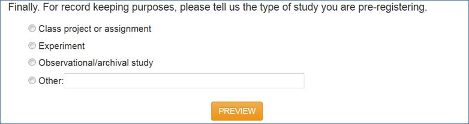
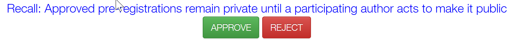
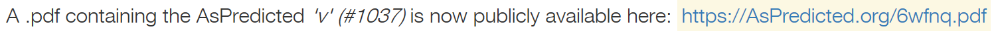
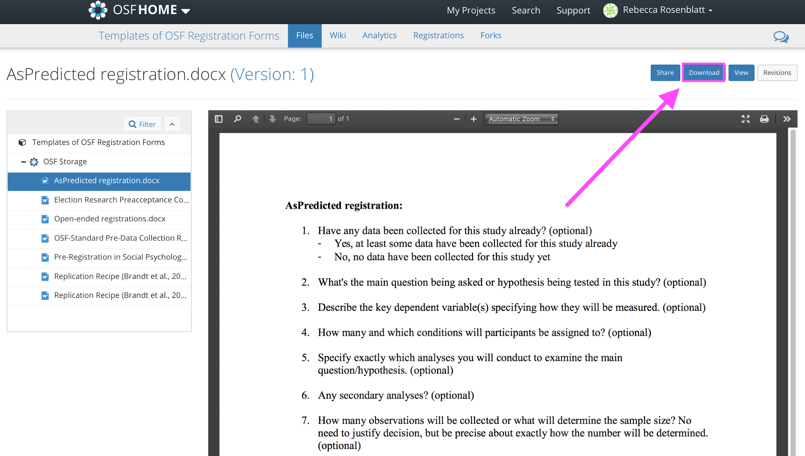
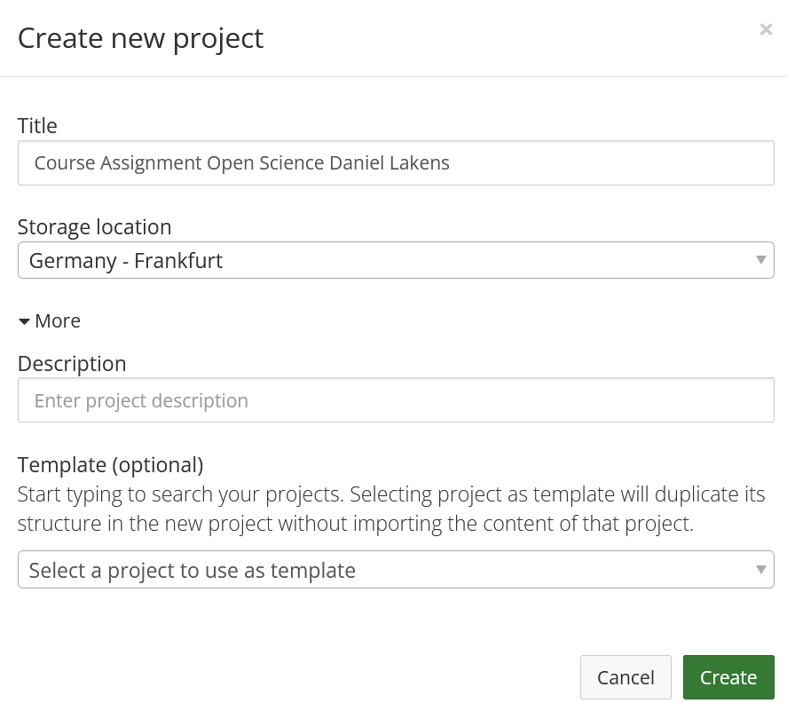
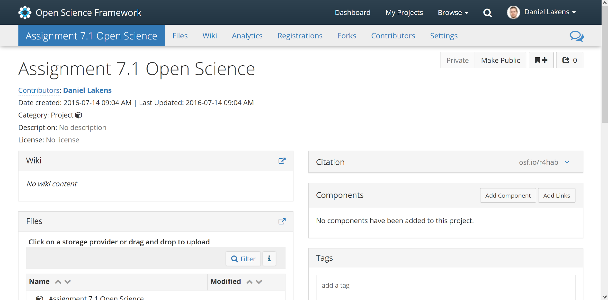
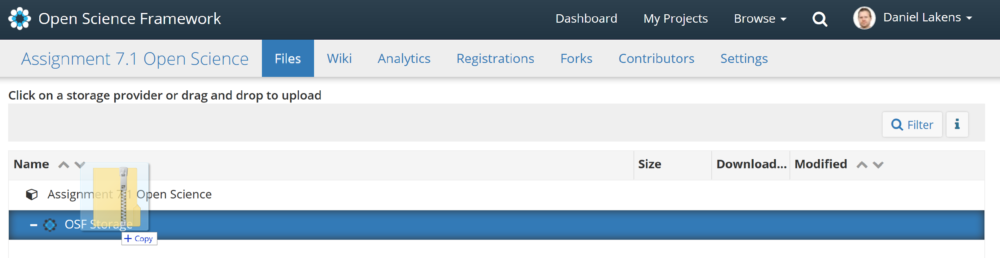
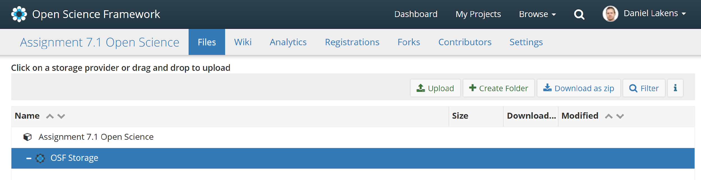

```{r, include = FALSE}
source("include/globals.R")
```

<!-- UPDATE TIER PROTOCOL https://osf.io/4cxed/ -->
<!-- ADD INFO TO PREREG SO PEOPLE CAN BE FOUND-->

# Preregistration and Transparency {#prereg}

For as long as data has been used to support scientific claims, people have tried to selectively present data in line with what they wish to be true. In his treatise ‘On the Decline of Science in England: And on Some of its Cases’ @babbage_reflections_1830 discusses what he calls cooking: 

(ref:babbagelab) Excerpt from Babbage, 1830.

```{r babbage, fig.margin = FALSE, echo = FALSE, fig.cap="(ref:babbagelab)"}
knitr::include_graphics("images/babbage.jpg")
```

The practice Babbage describes is still a problem, almost 200 years later. Researchers still make 'multitudes of observations' only to present those that support the story they want to tell. An example of a scientist who does this is Daryl Bem, a parapsychologist who studies whether people have extra-sensory perception that allows them to predict the future. In Figure \@ref(fig:bem) you can see the results and discussion from a study he performed [@bem_feeling_2011]. In this study, participants pressed a left or right button to predict whether a picture was hidden behind a left or right curtain. At the moment they made the decision, not even the computer had randomly determined where this picture would appear, so any performance better than average would be very surprising.

(ref:bemlab) Screenshot from the Results and Discussion section of Bem, 2011.

```{r bem, fig.margin=FALSE, echo=FALSE, fig.cap="(ref:bemlab)"}
knitr::include_graphics("images/bem.png")
```

If we take this study as it is (without pre-registration) it is clear there are 5 tests against guessing average (for erotic, neutral, negative, positive, and ‘romantic but non-erotic’ pictures). A Bonferroni correction would lead us to use an alpha level of 0.01 (an alpha of 0.05/5 tests) and the main result, that participants guessed the future position of erotic pictures above guessing average, with a *p*-value of 0.013, would not have allowed Bem to reject the null hypothesis, given the pre-specified alpha level.

Which of the five categories (erotic, neutral, negative, positive, and romantic but non-erotic pictures) would you have predicted people would perform better than guessing average at, if we had evolved the ability to predict the future? Do you think Bem predicted an effect for the erotic pictures? You might not trust that Bem predicted an effect only for this specific group of stimuli, and that he was 'cooking' - making multitudes of observations, and selecting the significant result, and that in the introduction to the study, he was **HARKing** - hypothesizing after the results are known [@kerr_harking_1998]. Do you think other researchers should simply trust that you predicted a reported outcome, if you performed a study with multiple conditions, and you found an effect in only one condition? 

## Preregistration of the Statistical Analysis Plan

In the past, researchers have proposed solutions to prevent bias in the literature due to inflated Type 1 error rates as a result of selective reporting. For example, Bakan [-@bakan_test_1966] discussed the problematic aspects of choosing whether or not to perform a directional hypothesis test after looking at the data. If a researcher chooses to perform a directional hypothesis test only when the two-sided hypothesis test yields a *p*-value between 0.05 and 0.10 (i.e., when a test yields *p* = 0.08, the researcher decides after seeing the result that a one-sided test was also warranted, and reports the *p*-value as 0.04, one-sided) then in practice the Type 1 error rate is doubled (i.e., is 0.10 instead of 0.05). Bakan (p. 431) writes: 

>How should this be handled? Should there be some central registry in which one registers one's decision to run a one- or two-tailed test before collecting the data? Should one, as one eminent psychologist once suggested to me, send oneself a letter so that the postmark would prove that one had pre-decided to run a one-tailed test?

De Groot [-@de_groot_methodology_1969] already pointed out the importance of specifying in advance, as well as possible, the research one plans to perform: 

*"Foremost among these latter is the recommendation to work out in advance the investigative procedure (or experimental design) on paper to the fullest possible extent. This 'blueprint' should comprise:*

* *a brief exposition of the theory;*
* *a formulation of the hypothesis to be tested;*
* *a precise statement of the deductions leading up to the predictions to be verified;*
* *a description of the instruments - in the broadest sense - to be used, complete with instructions for their manipulation;*
* *detailed operational definitions of the variables to be used; a statement about the measurement scales (nominal, ordinal, interval, ratio) in which the respective variables are to be read;*
* *a clearly defined statement of the respective universes to which the hypothesis and the concrete prediction(s) apply;*
* *an exact description of the manner in which the samples are to be drawn or composed;*
* *a statement of the confirmation criteria, including formulation of null hypotheses, if any, choice of statistical test(s), significance level and resulting confirmation intervals;*
* *for each of the details mentioned, a brief note on their rationale, i.e., a justification of the investigator's particular choices."*

With the rise of the internet, many improvements to science have emerged, one of which is that it has become feasible to create online [registries](https://en.wikipedia.org/wiki/List_of_clinical_trial_registries) that allow researchers to specify their study design, the sample plan, and statistical analysis plan before the data is collected. This makes it possible to see which predictions are confirmed, based on statistical analyses that are not influenced by looking at the results they give. This is important, because you can’t test a hypothesis on the data used to generate it. When exploring data, you can perform a hypothesis test, but you cannot *test* a hypothesis. In some fields, such as medical research, it has become required to register certain studies, such as clinical trials. For example, the [International Committee of Journal Editors](https://www.icmje.org/icmje-recommendations.pdf) writes:  

>the ICMJE requires, and recommends, that all medical journal editors require registration of clinical trials in a public trials registry at or before the time of first patient enrollment as a condition of consideration for publication. 

The use of **study registries** was promoted be the Food and Drug Administration (FDA) from 1997. In these registries a description of the study and contact information was provided with the main goal to make it easier for the public to take part in clinical trials. From 2000 onwards registries have increasingly been used to prevent bias, and regulations have become increasingly strict in terms of reporting both the primary outcome of studies before data collection, as well as updating the registry with the results after data collection is complete, although these rules are not always followed [@goldacre_compliance_2018]. 

The requirement to register the primary outcome of interest on [ClinicalTrials.gov](https://clinicaltrials.gov/) was correlated with a substantial drop in the number of studies that observed statistically significant results, which could indicate that removing flexibility in how data was analyzed prevented false positive results from being reported. Kaplan and Irvin [-@kaplan_likelihood_2015] analyzed the results of randomized controlled trials evaluating drugs or dietary supplements for the treatment or prevention of cardiovascular disease. They observed how 17 of 30 studies (57%) published before the requirement to register studies on ClinicalTrials.gov yielded statistically significant results, while only 2 out of 25 (8%) studies published after 2000 observed statistically significant results. Of course, correlation is not causation, so we can not conclude there is a causal effect. But if you go to the doctor when you are sick, and the doctor tells you that luckily there are two cures, one proven effective in a study published in 1996, and one from a study published in 2004, which cure would you pick?  

(ref:kaplan) Figure from Kaplan and Irvin (2015) showing the substantial drop in statistically significant results after the registration of primary outcomes was required on ClinicalTrials.gov. 

```{r kaplan2015, fig.margin = FALSE, echo = FALSE, fig.cap="(ref:kaplan)"}
knitr::include_graphics("images/kaplan2015.png")
```

One step beyond study registration is a novel publication format known as **Registered Reports**. Journals that publish Registered evaluate studies based on the introduction, method, and statistical analyses, but not on the results [@chambers_past_2022; @nosek_registered_2014]. The idea to review studies before data collection is not new, and has proposed repeatedly during the last half century [@wiseman_registered_2019]. As discussed in the section on [publication bias](#publicationbias), Registered Reports have a substantially larger probability of reporting findings that do not support the hypotheses compared to the traditional scientific literature [@scheel_excess_2021]. The benefits and downsides of publishing research as a Registered Report are still being examined, but one benefit is that you get feedback from expert reviewers at a time when you can still improve the study, instead of after data has already been collected.

## The value of preregistration

Preregistration has the primary goal to allow others to transparently evaluate the capacity of a test to falsify a prediction, or how *severely* a hypothesis has been tested [@lakens_value_2019]. The severity of a test is determined by how likely a prediction is proven wrong when it is wrong, and proven right when it is right. Researchers can make choices when analyzing their experiment that increase the probability their prediction will be statistically supported, even when it is wrong. When effect size estimates are biased, for example due to the desire to obtain a *significant* result, hypothesis tests performed on these estimates have inflated Type 1 error rates. The opposite is also true. When bias emerges due to the desire to obtain a *non-significant* test result, hypothesis tests will have an inflated Type 2 error rate, or reduced statistical power, and are more likely to not yield support for a prediction, even if the prediction was correct. The goal of preregistration is to prevent researchers from non-transparently reducing the capacity of the test to falsify a prediction, by allowing readers of their work to see how they planned to test their prediction before they had access to the data, and evaluate whether any changes from their original plan reduce how severely they tested their prediction.

Preregistration adds value for people who, based on their philosophy of science, increase their trust in claims that are supported by severe tests and predictive successes. Preregistration itself does not make a study better or worse compared to a non-preregistered study [@lakens_value_2019]. Instead, it merely allows researchers to transparently evaluate the [severity](#severity) of a test The severity of a test is in theory unrelated to whether a study is preregistered. However, in practice, there will almost always be a positive correlation between the ability to transparently evaluate the severity of a test and preregistration. Researchers can selectively report results, use optional stopping, or come up with a plausible hypothesis after the results are known, and theories rarely completely constrain the test of predictions. Nevertheless, it is important to remember that deviations from a preregistration could in theory lead to a *more severely* tested hypothesis (i.e., when the preregistration specified a bad statistical analysis plan). 

Preregistration is a tool, and researchers who use it should do so because they have a goal that preregistration facilitates. If the use of a tool is detached from a philosophy of science it risks becoming a heuristic. Researchers should not choose to preregister because it has become a new norm, but they should preregister because they can justify based on their philosophy of science how preregistration supports their goals. There are many types of research for which preregistration is not necessary. Although it is always good to be as transparent as possible when doing research, from a philosophy of science perspective, the unique value of preregistration is limited to research which aims to severely test predictions. Outside of this type of research, transparency (for example by sharing data, materials, and a lab notebook detailing decisions that were made) can be valuable to allow researchers to evaluate results in more detail. In addition to the primary goal of preregistration to allow others to evaluate how severely a prediction has been tested, researchers have reported secondary benefits of preregistering, such as feeling the preregistration improved their experimental design, analysis plan, and theoretical predictions [@sarafoglou_survey_2022]. Although it is not necessary to publicly preregister to reap these benefits, a public preregistration can motivate researchers to more carefully think about their study in advance.

## How to preregister

The more detail a preregistration document has, the easier it is for others to transparently evaluate the severity of the tests that are performed. Because it is difficult to come up with all aspects that one should include, researchers have created websites to guide researchers through this process (e.g., https://aspredicted.org/), including submission guidelines, and templates [@van_t_veer_pre-registration_2016]. The template by Van 't Veer and Giner-Sorolla is an excellent start, and is intended as a place to begin for people who have no experience preregistering their research. Another useful paper by @wicherts_degrees_2016 provides a checklist of aspects to consider when planning, executing, analyzing, and reporting research. 

(ref:preregcheclistlab) Screenshot of Table 1 in Wicherts et al., 2016, which depicts the checklist for preregistrations.

```{r preregcheclist, fig.margin=FALSE, echo=FALSE, fig.cap="(ref:preregcheclistlab)"}
knitr::include_graphics("images/preregchecklist.png")
```

Personally, I think that the 2018 update of the Journal Article Reporting Standards (JARS) [@appelbaum_journal_2018] should be used more widely. The reporting guidelines encompass more suggestions than needed for a preregistration document, but I would recommend using JARS both for your preregistration document and when writing up the final report, as it is a very well-thought through set of recommendations. Taking JARS into account when planning or reporting your research is likely to improve your research.

The Journal Article Reporting Standards inform you about information that needs to be present on the title page, the abstract of your paper, the introduction, the method, the results section, and the discussion. For example, JARS states that you should add an Author Note on the title page that includes "Registration information if the study has been registered". The method and result sections receive a lot of attention in JARS, and these two sections are also the most important in a preregistration if we want to allow others to evaluate the severity with which we tested hypotheses. Remember that a severe test has a high probability of finding a predicted effect if the prediction is correct, and a high probability of not finding a predicted effect if the prediction is incorrect. Practices that inflate the Type 1 error rate increase the possibility of finding a predicted effect if a prediction is actually wrong. Low power, unreliable measures, a flawed procedure, or a bad design increase the possibility of not finding an effect when the prediction was actually correct. Incorrect analyses risk answering a question that is unrelated to the prediction researchers set out to test (sometimes referred to as a [Type 3 error](https://en.wikipedia.org/wiki/Type_III_error#Kimball)). As we see, JARS aims to address these threats to the severity of a test by asking authors to provide detailed information in their methods and results sections. 

## Journal Article Reporting Standards

I will highlight those aspects that should be included in a preregistration document. However, I want to recommend reading through all the information that is recommended to include in manuscripts. As you will see, the requirements to report validity evidence for instruments (or admit that you are using an ad-hoc measure with unknown validity), awareness about the conditions participants were assigned to, and the reliability of measures might all be easier if you have already collected information about this previously (or if this information is available in the literature). I will focus on quantitative experimental studies with random assignment to conditions below (you can download the JARS table [here](https://apastyle.apa.org/jars/quant-table-1.pdf)), but JARS includes tables for [experiments without randomization](https://apastyle.apa.org/jars/quant-table-2b.pdf), [clinical trials](https://apastyle.apa.org/jars/quant-table-2c.pdf), [longitudinal designs](https://apastyle.apa.org/jars/quant-table-4.pdf), [meta-analyses](https://apastyle.apa.org/jars/quant-table-9.pdf), and [replication studies](https://apastyle.apa.org/jars/quant-table-6.pdf).

1. *Describe the unit of randomization and the procedure used to generate the random assignment sequence, including details of any restriction (e.g., blocking, stratification).*

2. *Report inclusion and exclusion criteria, including any restrictions based on demographic characteristics.* 

This prevents flexibility concerning the participants that will be included in the final analysis. 

3. *Describe procedures for selecting participants, including*
    - *Sampling method if a systematic sampling plan was implemented*
    - *Percentage of the sample approached that actually participated*

You might often not know what percentage of the sample you approach will participate, and getting this information might require some pilot data, as you might not be able to reach the desired final sample size (see below) with the sampling plan.

4. *Describe the sample size, power, and precision, including*
    + *Intended sample size*
    + *Determination of sample size, including*
        - *Power analysis, or methods used to determine precision of parameter estimates*
        - *Explanation of any interim analyses and stopping rules employed*

Clearly stating the intended sample size prevents practices such as optional stopping, which inflate the Type 1 error rate. Be aware (or if not, JARS will remind you) that you might end up with an achieved sample size that differs from the intended sample size, and consider possible reasons why you might not manage to collect the intended sample size. We discussed sample size justifications in the chapter on [power](#power). A sample size needs to be justified, as do the assumptions in a power analysis (e.g., is the expected effect size realistic, or is the [smallest effect size of interest](#sesoi) indeed of interest to others?). If you used [sequential analyses](#sequential), specify how you controlled the Type 1 error rate while analyzing the data repeatedly as it came in. 

5. *Describe planned data diagnostics, including*
    - *Criteria for post-data collection exclusion of participants, if any*
    - *Criteria for deciding when to infer missing data and methods used for imputation of missing data*
    - *Defining and processing of statistical outliers*
    - *Analyses of data distributions*
    - *Data transformations to be used, if any*
    
After collecting the data, the first step is to examine the data quality, and test assumptions for the planned analytic methods. It is common to exclude data from participants who did not follow instructions, and these decision procedures should be prespecified. At each preregistration you will discover additional unforeseen consequences that will be added to these sections. If data is missing, you might not want to remove a participant entirely, but use a method to impute missing data. Because outliers can have an undue influence on the results, you might want to preregister ways to mitigate the impact of outliers. For practical recommendations on how to classify, detect, and manage outliers, see [@leys_how_2019]. If you are planning to perform statistical tests that have assumptions (e.g., the assumption of normality for Welch's *t*-test) you need to preregister how you will decide whether these assumptions are met, and if not, what you will do.

6. *Describe the analytic strategy for inferential statistics and protection against experiment-wise error for*
    - *Primary hypotheses*
    - *Secondary hypotheses*
    - *Exploratory hypotheses*
    
The difference between these three levels of hypotheses is not adequately explained in the JARS material, but @cooper_reporting_2020 explains the distinction a *bit* more, although it remains quite vague. The way I would distinguish these three categories is as follows. First, a study is designed to answer a **primary hypothesis**. The Type 1 and Type 2 error rates for this primary hypothesis are as low as the researcher can afford to make them. **Secondary hypotheses** are questions that a researchers considers interesting when planning the study, but that are not the main goal of the study. A secondary hypotheses might concern additional variables that are collected, or even sub-group analyses that are deemed interesting from the outset. For these hypotheses, the Type 1 error rate is still controlled at a level the researchers considers justifiable. However, the Type 2 error rate is not controlled for secondary analyses. The effect that is expected on additional variables might be much smaller than the effect for the primary hypothesis, or analyses on subgroups will have smaller sample sizes. 

Finally, there is a left-over category of analyses that are performed in an article. I would refer to this category as **exploratory results**, not exploratory hypotheses, because a researcher might not have hypothesized these analyses at all, but comes up with these tests during data analysis. JARS requires researchers to report such results 'in terms of both substantive findings and error rates that may be uncontrolled'. An exploratory result might be deemed impressive by readers, or not, depending on their prior belief, but it has not been severely tested. All findings need to be independently replicated if we want to be able to build on them - but all else equal, this requirement is more imminent for exploratory results.

## What Does a Formalized Test of a Prediction Look Like?

A hypothesis test is a methodological procedure to evaluate a prediction that can be described on a conceptual level (e.g., "Learning how to preregister improves your research"), an operationalized level (e.g., "Researchers who have read this text will control their alpha level more carefully, and they will more precisely specify what would corroborate or falsify their prediction in a preregistration document"), and a statistical level (e.g., "An independent *t*-test comparing coded preregistration documents written by people who read this text will show a statistically lower number of ways in which the hypothesis could be tested, which implies more careful Type 1 error control, compared to people who did not read this text"). In a preregistration document, the goal should be to specify the hypothesis in detail at the statistical level. Furthermore, each statistical hypothesis should be clearly linked to the conceptual and operationalized level.

Preregistration is a relatively new practice for most researchers. It should not be surprising that there is often quite some room for improvement in the way researchers preregister. It is not sufficient to preregister - the goal is to preregister well enough so that others can evaluate the severity with which you tested your hypothesis. How do we do this? First, it is important to acknowledge that it is difficult to describe a hypothesis verbally. Just like we use notation to describe statistics because it removes ambiguity, verbal descriptions of hypotheses rarely sufficiently constrain potential flexibility in the data analysis. For example, in the verbal description of a statistical hypothesis in the previous paragraph, it is not clear what alpha level I plan to use for the *t*-test, whether I will perform Student's *t*-test or Welch's *t*-test, and many other parameters of the hypothesis test remain vague. Another issue is a lack of transparency about which statistical tests in the results section are related to the predictions in the introduction section. In some studies people perform multiple tests, and without a distinction between the primary and secondary hypotheses (as required by JARS) it is often not clear which pattern of results would falsify the researchers' predictions. The less clear it is when your prediction is falsified, the less severe the test.

In @lakens_improving_2020-2 we discuss how a good way to remove ambiguity in a hypothesis test described in a preregistration document is to make sure it is [machine readable](https://en.wikipedia.org/wiki/Machine-readable_document), so that it is easily processed by computers (who are notoriously bad at dealing with ambiguous descriptions). This means we need to clearly specify individual components that make it possible to evaluate a hypothesis test. A *hypothesis* is tested in an *analysis* that takes *data* as input and returns test *results*. Some of these test results will be compared to *criteria*, used in the *evaluation* of the test result. For example, imagine a *hypothesis* predicts that the mean in one group will be higher than the mean in another group. The *data* is *analyzed* with Welch's *t*-test, and if the *resulting* *p*-value is smaller than a specified *criterion* alpha (e.g., 0.01) the prediction is *evaluated* as being *corroborated*. Our prediction is *falsified* if we can reject effects deemed large enough to matter in an equivalence test, and the result is *inconclusive* otherwise.

The most transparent way to specify the statistical hypothesis is in **analysis code**. The gold standard for a preregistration is, I think, to create a simulated dataset that looks like the data you plan to collect, and write an analysis script that runs on the simulated data. Simulating data might sound difficult, but there are [great packages](https://debruine.github.io/faux/) for this in R, and an increasing number of tutorials. Since you will need to perform the analyses anyway, doing so before you collect the data helps you to carefully think through your experiment. By preregistering the analysis code, you make sure all steps in the data analysis are clarified, including assumption checks, exclusion of outliers, and the exact analysis you plan to run (including any parameters that need to be specified for the test).

In addition to the analysis code, you will need to specify how you will **evaluate** the test result. This is often not made explicit in preregistrations, but it is an essential part of a hypothesis test, and should also be prespecified, especially when there are multiple primary hypotheses, such as in our prediction that "Researchers who have read this text will become better at controlling their alpha level *and* more clearly specify what would corroborate or falsify their prediction". If our hypothesis really predicts that both of these outcomes should occur, then the evaluation of our hypothesis should specify that the prediction is falsified if only one of these two effects occurs. Researchers often implicitly treat a *p* > 0.05 as falsifying a prediction, but this is a common misconception of [*p*-values](#misconception1), and a hypothesis is often better falsified using a statistical test that can reject the presence of predicted outcomes, such as an [equivalence test](#equivalencetest). Specifying explicitly how you will evaluate a hypothesis makes it clear how your prediction will be proven wrong. 

## Are you ready to preregister a hypothesis test?

We often pretend that everything we do starts with a theory, and that we design an experiment to test theoretical predictions. But very often, the theory that we have is not strong enough to lead to testable predictions to begin with. In reality, especially early in research lines, we have more of a cyclical approach, where we test something, do an experiment to see what happens, use the insights we get to reformulate our theory, and design another experiment. The philosopher of science Van Fraassen summarizes this in his statement: "experimentation is the continuation of theory construction by other means." During this process, we often need to examine whether certain assumption we make hold. This often requires tests of **auxiliary hypotheses** concerning the measures and manipulations we use [@uygun_tunc_falsificationist_2022].

As you prepare a preregistration document, you might be faced with many uncertainties that you don't exactly know how to address. It might be that this is a signal that you are not yet ready to preregister a prediction. When testing hypotheses, corroborating a prediction should be impressive, and falsifying a prediction should be consequential for the theory you are testing. If you make arbitrary choices as you write down your predictions, the test might be neither impressive nor consequential. Sometimes you just want to collect some data to see what happens, without testing anything, and if that's the case, don't feel forced into a hypothesis testing straightjacket. Of course, such a study also does not allow you to make any claims that have been severely tested, but that should not be the goal of every study, especially in new research lines.

## Test Yourself

In this 'Test Yourself' assignment, we will not be answering multiple choice questions, but we will perform an assignment. In this assignment, you will define a theoretical hypothesis, translate it into a statistical hypothesis, design a study to test your hypothesis, collect the data, report the results, and publicly share the data, the analysis code, and the research report. An example of this assignment that I completed myself is available here: <https://osf.io/r4hab/>.

To keep the research project in this assignment feasible, the data collection should not take too much time. Learning how to collect data is an important skill, but it is not the goal of this assignment. Therefore, we will restrict the field of study to a research question about movie ratings. The data collection will consist of coding movie ratings on the [Internet Movie Database (IMDB)](https://www.imdb.com/). You can come up with any hypothesis you want, as long as we can test it based on the IMDB ratings of movies. This assignment will be peer-reviewed by fellow students. All the aspects that need to be included in the final assignment are indicated in bold.

We will preregister our hypothesis. As explained above, there are different levels of detail at which your can preregister your hypothesis. If this was a real research project, we would try to be as specific as possible. But for this class assignment, we will keep the preregistration as simple as possible. Therefore, we will use the AsPredicted template to preregister. You can use this template on [AsPredicted](https://aspredicted.org) if you have an institutional (e.g., university) email address, or you can use the template on the Open Science Framework if you do not have an institutional email address. 

Let’s start by defining a **theoretical hypothesis**. My favorite movie of all time is Fight Club. It stars Brad Pitt and Edward Norton. My theoretical hypothesis is that Brad Pitt and Edward Norton are both great actors, and because they are both great, the movies they play in are equally good. You can pick any hypothesis you like. For example, sequels to movies will be evaluated more negatively than the original movie, or movies with the word ‘Bad’ in the title are worse than movies with the word ‘Good’ in the title, or Marvel superhero movies are better than DC superhero movies. Be as creative as you want!

**Q1**: Write down your theoretical hypothesis.

To be able to test a theoretical hypothesis, we will need to operationalize how we will measure how good or bad a movie is. IMDB provides both the IMDB rating, and the metascore (provided by metacritic.com).


(ref:imdbratinglab) Screenshot of a IMDB and metacritic rating.

```{r imdbrating, out.width  = '40%', echo=FALSE, fig.cap="(ref:imdbratinglab)"}
knitr::include_graphics("images/imdbrating.png")
```

Which rating will you use? Or do you predict an effect on both ratings? I’ll just focus on the IMDB scores. In addition to operationalizing our measure, we need to explain in more detail which data will be used to test our prediction. What is the population of movies we are examining? Will we use all Marvel superheroes movies, or only those movies in the [Marvel Cinematic Universe](https://en.wikipedia.org/wiki/List_of_Marvel_Cinematic_Universe_films)? Will we randomly sample X movies from all the hits our IMDB search will give? Will we sort the search results based on the release date, and only use the X most recent movies? In my case, I will use the last 34 movies Edward Norton and Brad Pitt starred in from today, the moment I did the IMDB search.

**Q2**: Write down which dependent variables you will measure. 

The next step is to determine the sample size. This topic is discussed extensively in the chapter on [Sample Size Justification](#power). Normally we would choose to collect as much data as possible, and it’s quite easy to get the movie ratings for all movies Edward Norton and Brad Pitt starred in. However, copying numbers from a website into a spreadsheet is not the most educational part of this assignment. If this was real research, we would collect as much data as possible, but for this assignment, don’t overdo the data collection. Spend your time on learning other skills than copy-pasting. The main justification for the sample size will be **feasibility**: The number of observations that you can collect in a reasonable amount of time. 

In my example, I predicted no difference between two sets of movies, and I performed a power
analysis for an [equivalence test](#equivalencetest). I wanted to be pretty sure I can reject my smallest effect size of interest, so I’ll design a study with 90% power. For this educational assignment, I do not expect you to collect a huge amount of data. As long as I can exclude a large effect (Cohen’s *d* = 0.8 or larger) I’ll be happy for this assignment. As we saw in the chapter on [Effect Sizes](#effectsize), this is a very large effect, and it is kind of obvious a-priori that the difference in movie ratings will not be this large. So, the study does not really teach us anything we did not already know - but for educational purposes, this is not a problem. 

We need to translate our theoretical hypothesis to a statistical hypothesis.
Which statistical test will you do? I will calculate the 90% CI around the
effect size. When the 90% CI falls below, and excludes a Cohen’s *d* of 0.8, I
will consider the movie ratings of Edward Norton and Brad Pitt as equivalent.

**Q3**: Specify and justify your sample size.

We now need to translate our theoretical hypothesis into a statistical hypothesis. Which statistical test will you do? In my example, I decided that I will test my prediction by calculating a 90% confidence interval around the effect size. When the 90% CI does not include a Cohen’s *d* of 0.8, I will consider the movie ratings of Edward Norton and Brad Pitt as sufficiently similar to consider my prediction confirmed. Again, in a real study, you would in most cases want to specify a much smaller smallest effect size of interest.

**Q4**: Specify the statistical test you will conduct. Be as specific as possible - write down the analysis code if you can. Specify relevant parameters (such as the alpha level you will use, or the *r* scale for the Bayes Factor, etc.). You will most likely only have a primary hypothesis, but if you have secondary hypotheses, specify these as well. Look through the JARS recommendations above, and the checklist by @wicherts_degrees_2016, to make sure you did not miss any details.

Congratulations! By answering questions Q1 to Q4 you have completed the minimal requirements for a pre-registration of your study.

**Pre-registering your research**

There are different ways to preregister your research using the AsPredicted template. If you have a university (e.g., .edu) e-mail account, you can use the AsPredicted site. If you only have a Gmail account, or if you prefer to use the same platform for preregistering your study, as we will use to share the results and the data, scroll down for an explanation how to fill out the AsPredicted template through the **Open Science Framework**. Please note, we will complete the pre-registration template and upload it to the OSF, but we will not
formally pre-register on the OSF, as explained below.

## Pre-registering on AsPredicted

Go to <https://aspredicted.org/> and create a new AsPredicted pre-registration:

```{r 10.1, echo = FALSE}
knitr::include_graphics("images/9fafdf4597839aeb44b3882aace1133e.png")
```

Click the ‘create’ button. Fill in your name, e-mail, and institution.

```{r 10.2, echo = FALSE}
knitr::include_graphics("images/1308ce9af6a5ebe700b8ff58542bdab2.png")
```

Scroll down, and answer questions 1 to 9. At 2) paste your answer to Q1, at 3)
paste your answer to Q2, at 4) explain how many groups you will compare (e.g.,
2, Edward Norton vs. Brad Pitt), at 5) enter the answer at Q4, and at 7) enter
the answer from Q3. Answer the remaining questions. Please indicate you are
using AsPredicted for a ‘Class project or assignment’.

```{r 10.3, echo = FALSE}

```

Preview your pre-registration:

```{r 10.4, echo = FALSE, out.width  = '20%'}

```

hit ‘pre-register’. If everything looks OK, hit the ‘SUBMIT’ button.

```{r 10.5, echo = FALSE}
knitr::include_graphics("images/7aa826d5b815c5aa18b66cfb6bcd30fe.png")
```

Then, you need to approve the submission (and if you had co-authors, they would
also need to approve the submission). Click the link:

```{r 10.6, echo = FALSE}
knitr::include_graphics("images/c7691954684e51c29afa2aead98414c5.png")
```

Click the button to see your new pre-registration:

```{r 10.7, echo = FALSE, out.width  = '20%'}

```

And click APPROVE

```{r 10.8, echo = FALSE}

```

And click OK for the pop- up indicating this cannot be undone. We will make the
pre-registration public. If you do research, you don’t have to make your
pre-registrations public immediately, but in this assignment, we will do so.
Once again, click:

```{r 10.9, echo = FALSE, out.width  = '20%'}

```

Scroll down, and click:

```{r 10.10, echo = FALSE, out.width  = '20%'}

```

Click OK on the pop-up warning you that this cannot be undone.

Now you can download the .pdf file with your pre-registration:

```{r 10.11, echo = FALSE}

```

**Download the pdf file and save it** – you have to share it as part of this
assignment.

## Pre-registering on the Open Science Framework

If you could not use AsPredicted, or if you prefer to use the same platform for preregistering your study, as we will use to share the results and the data, go to [www.osf.io](http://www.osf.io) and create an account:

```{r 10.12, echo = FALSE}
knitr::include_graphics("images/7d6b26f83fee88df8bd46f30f4441844.png")
```

Then create a new project:

```{r 10.13, echo = FALSE}
knitr::include_graphics("images/2319f53e025e2b9c707f1062f478dc1a.png")
```

As a title, enter anything you will remember, for example Assignment 7.1 Open
Science. Click ‘create’ and then ‘Go to new project’.

```{r 10.14, echo = FALSE}
knitr::include_graphics("images/34c3f0068911af6749513b1584c4cac7.png")
```

After you have created your new project, make your project public. To do so,
click the **Make public** button in the top right of the project.

Then, go to this page on the OSF: <https://osf.io/zab38/wiki/home/>. This page
lists all of the registration forms as templates that you can view and download
onto your computer.

Open the AsPredicted Registration template as a Word Doc, and the file will
appear in a file viewer.

```{r 10.15, echo = FALSE}

```

On this page, click the **Download** button in the top right. Then open the
AsPredicted template on your computer.

Fill out the form on your computer, save, and name it: “prereg_assignment7.”
When you’re finished filling out the form, upload it to the OSF Storage on your
OSF project. For instructions on how to upload a file to a project, see this
help guide: <https://help.osf.io/hc/en-us/articles/360019930613-Upload-files>.

**In this assignment we will not go through the formal pre-registration process on the OSF. The reason for this is that the OSF registries website is intended to be a searchable database of all official scientific registrations and preregistrations. When you complete a registration, it will remain in [OSF Registries](https://osf.io/registries/) for ever, and there is no way to remove it. Only register formal scientific studies. If you want to complete a formal registration for a scientific study you will do in the future, you can check out the How-To** [here](https://help.osf.io/article/158-create-a-preregistration).**

Double click on your preregistration file to render it in the file viewer (as
the previous screenshot depicted). Copy the URL on this page, paste it in a word
document, and save it as ‘Pre-registration’. We will upload this later, so that
fellow students know where to find your pre-registration.

Go back to the main view of your project by clicking the project name in the top
left of the page.

## Collecting Data

Now that we have pre-registered our hypothesis let’s collect some data. Use the
normal IMDB search to find the movies you want, or the [advanced search
functions](http://www.imdb.com/search/).

I searched for [movies starring Brad Pitt as an actor, order based on release
data](http://www.imdb.com/filmosearch?role=nm0000093&explore=title_type&mode=detail&page=1&title_type=movie&ref_=filmo_ref_job_typ&sort=release_date,desc&job_type=actor),
and [the same for Edward
Norton](http://www.imdb.com/filmosearch?role=nm0001570&explore=title_type&mode=detail&page=1&title_type=movie&ref_=filmo_ref_job_typ&sort=release_date,desc&job_type=actor).

You can type in your data in any software you want to use – a spreadsheet, a
statistical software package, or even just in a text file. This will be your
**original data file**. I used a spreadsheet file.

It turns out that Edward Norton has acted in 32 movies, so we are 2 movies short
of our planned sample size of 34 movies. That happens, there is nothing we can
do about it, so we will just describe this in the research report.

We will use the [TIER documentation
protocol](https://www.projecttier.org/tier-protocol/) to keep our files
organized, and store the data in a way that will allow us to understand our own
data in the future, or allow other people to easily re-use our data. We
will then share this data on the [Open Science Framework](http://www.osf.io), a
website that allows you to store your research data, and whenever you are ready
to do so, make this data public and accessible for other researchers. You can
check my example of this assignment on the Open Science Framework
[here](https://osf.io/r4hab/).

The TIER protocol has become more detailed and extensive with each version, but for our project we do not need all folders or files. We will have a **Project** folder, in which you will put a [Read Me file](https://www.projecttier.org/tier-protocol/protocol-4-0/root/readme/) and the report summarizing your hypothesis, analysis, and results. We will also create a **Data folder**, in which there is a subfolder for the **Input Data Files** and a subfolder fort the **AnalysisData**. The data in the input data files folder is the datafile you used to store the movie ratings you have coded, and could be a spreadsheet document, or a text file. The input data file should not be changed during the analyses. That way, you always have an original version of your data, that is never changed or overwritten. In the **Metadata** folder, include a document that contains information about

1.  A citation or link to the website from which you downloaded the data (in our case, the IMDB).

2.  The data you downloaded, and a description of how others can access this data (e.g., the search terms you used).

3.  Some information that will allow readers to understand the original data. What does each column and row mean? For a real research project with a more complex dataset, you would create a ‘codebook’. In our simple datafile and for this assignment, that is not required.

4.  If you use existing datasets, a DOI (Digital Object Identifier) assigned to the dataset, if available. This is not needed for our project.

In the **AnalysisData** folder, save the analysis data file is the file stored from the statistical software you use, and which is used to perform the analyses on. It could be a Jamovi, JASP, STATA, SPSS, or other software file. You only work on the analysis data file. If you use R, and only read in the input data files in the format in which they are stored, the analysis data folder will be empty. 

## Analyzing the data

The next step is to analyze your data. Try to follow your pre-registered analysis plan. If you realize you need to make change to your original plan, note these changes while writing up the results. It is common that you did not think about every choice you need to make when completing a preregistration, especially if you perform a novel study. That is not a problem. Just transparently note where you needed to make additional choices that are not in the preregistration, or where you decided to deviate from the preregistration. For example, you can write: Deviating from the preregistration, I decided to exclude movies that start both Edward Norton and Brad Pitt. 

For the analysis you can do Frequentists tests, Bayesian tests, or both. The most important thing is to create an analysis script that can be directly run on the Analysis Data file, and that will exactly reproduce the analyses you will report in the Research Report. For example, do not just use the point and click options in SPSS, but paste the syntax for each analysis you perform. Make sure it is annotated (i.e., you add an explanation of what the code does) so that other could in principle understand which analysis in the analysis script is linked to which result in your research report. You will most likely only need a single script that you store in the **Scripts** folder (e.g., a single R file or a single SPSS syntax file), so you typically do not need to create subfolders. 

In the **Output** folder, save any output files generated by your analysis. For example, you can store the SPSS output file, or if you performed your analyses in an R Notebook, you can save an exported HTML file with your analyses and any figures that are generated by the analysis script. 

**Q5**: Write down the **relevant statistics in a result section**, and **don’t forget to interpret the results**. There are no requirements – peer reviewers will not grade how well you did your analysis, only that you analyzed your data. Introduce the data analysis with a short explanation of your hypothesis (you can take this from your pre-registration). End the data analysis with a short, one-sentence **conclusion**. Save this document as the ‘**Research Report**’ and place it in the top level of the ‘Replication Documentation’ folder.

## Sharing the report, data, and code{#sharing}

Now you have completed your research project, let’s share the results and the data! We will upload the **pre-registration, data, report, and analysis files** to the Open Science Framework (OSF). The Open Science Framework allows you to store data, materials, and analysis scripts for free, and make these files publicly available whenever you are ready.

Create a (free) account on the Open Science Framework (if you did not already do
so).

```{r 10.17, echo = FALSE}
knitr::include_graphics("images/7d6b26f83fee88df8bd46f30f4441844.png")
```

Then create a new project (if you did not yet do so to pre-register on the OSF directly). As a title, enter anything you will remember, but also something that other people will understand. Your file will be publicly available, so other researchers might want to know this is not a real research project, but an assignment for a course. For example, enter the title "Course Assignment Open Science". You can choose the storage location. General Data Protection Regulations in the European Union might require you to store the data on a server in the European Union. Click on the 'More' button and enter a short description. The title communicates this is likely a class assignment, but in the description, make this clear. Enter for example "This is a class assignment for course number XXXX at university YYYY". If you already created the project to preregister, click the 'Add a brief description to your project' field on the project page, below the title. You can also click on your name behind 'Contributors' and add some information to your profile. For a real research project, this will make it easier for people who want to use your data or code to contact you.  

```{r 10.18, echo = FALSE}

```

Click ‘create’ and then ‘Go to new project’.

```{r 10.19, echo = FALSE}
knitr::include_graphics("images/34c3f0068911af6749513b1584c4cac7.png")
```

You will see your new project page:

```{r 10.20, echo = FALSE}

```

Click on the ‘Files’ tab in the menu bar at the top of the screen. You can upload files to the OSF. There are two options. You can either zip the Project folder, and upload a single .zip file, or you can recreate the folder structure on the OSF.  To upload the zip file, just drag the zipped folder from your computer to the browser, and drop it onto the OSF Storage line, as shown in the picture below.

```{r 10.21, echo = FALSE}

```

Alternatively, you can recreate the folder structure. That’s what I’ll do, even though it is a bit more work, but it will allow people to preview all the files on the OSF. Click on the ‘OSF Storage’ line. Buttons will appear that allow you to +Create Folder. See below.

```{r 10.22, echo = FALSE}

```

Upload the **original data, the importable data, the analysis files, the research report, and the pre-registration file**. You can, but don’t have to, upload a meta-data document and a codebook. Uploading these in real research is important, but they are not the most important learning objective in this assignment.

The final result should look like the screenshot below:

```{r 10.23, echo = FALSE}
knitr::include_graphics("images/dec08b890995634acf624123962ed970.png")
```

Go back to the main page of your OSF project by clicking on the name of your project in the top left of the screen. **The final thing that we need to do is make it possible for others to access our files by making the project page public**. By default, the project is private, and you can use the OSF to privately store your research data. But you can also make the page public, whenever you are ready. **If the page is not public, it cannot be graded for a class assignment!**

Click the ‘Make Public’ button (highlighted by the red square in the picture below)

```{r 10.24, echo = FALSE}
knitr::include_graphics("images/791bc1160787ae06a961761fb260b687.png")
```

You will get a warning that you need to make sure there is no confidential information that is being shared, and that making data public can’t be undone.

```{r 10.25, echo = FALSE}
knitr::include_graphics("images/ae3d492ab7249bafc5969ba8345d58ca.png")
```

Click ‘Confirm’. Your research project is now publicly available. My example for this assignment is available here: <https://osf.io/r4hab/>.

**Q6**: As an answer to this assignment, share the link to your publicly accessible project page on the Open Science Framework. The files on the Open Science Framework page will be peer-reviewed by fellow students.
