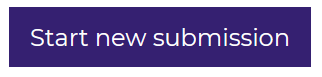
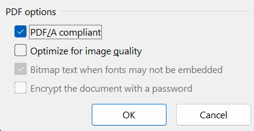
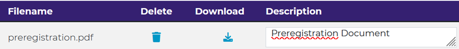
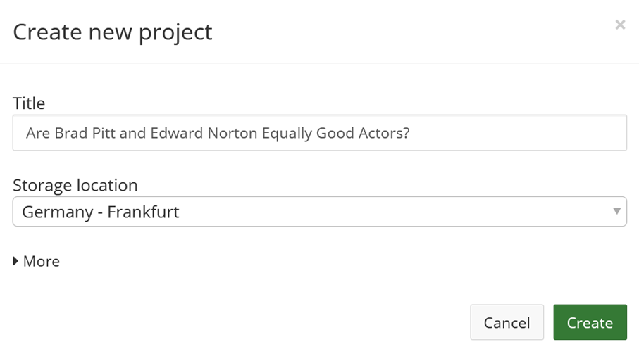
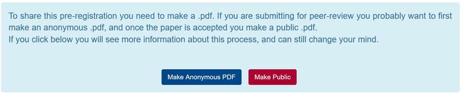

```{r, include = FALSE}
source("include/globals.R")
```

# Preregistration and Transparency {#prereg}

For as long as data has been used to support scientific claims, people have tried to selectively present data in line with what they wish to be true. An example of a scientist who did this is Daryl Bem, a parapsychologist who studies whether people have extra-sensory perception that allows them to predict the future. By using selective reporting, and publishing 9 studies in a top journal claiming that people could predict the future, Bem kick-started the replication crisis in psychology back in 2011. In Figure \@ref(fig:bem) you can see the results and discussion from a study he performed [@bem_feeling_2011]. In this study, participants pressed a left or right button to predict whether a picture was hidden behind a left or right curtain. At the moment they made the decision, not even the computer had randomly determined where this picture would appear, so any performance better than average would be very surprising.

(ref:bemlab) Screenshot from the Results and Discussion section of Bem, 2011.

```{r bem, fig.margin=FALSE, echo=FALSE, fig.cap="(ref:bemlab)"}
knitr::include_graphics("images/bem.png")
```

It is clear there are 5 tests against guessing average (for erotic, neutral, negative, positive, and ‘romantic but non-erotic’ pictures). A Bonferroni correction would lead us to use an alpha level of 0.01 (an alpha of 0.05/5 tests) and the main result, that participants guessed the future position of erotic pictures above guessing average, with a *p*-value of 0.013, would not have allowed Bem to reject the null hypothesis, given a pre-specified alpha level corrected for multiple comparisons.

Which of the five categories (erotic, neutral, negative, positive, and romantic but non-erotic pictures) would you have predicted people would perform better than guessing average at, if we had evolved the ability to predict the future? Do you think Bem actually predicted an effect for the erotic pictures only, before he had seen the data? You might not trust that Bem predicted an effect only for this specific group of stimuli, and that he was 'cooking' - making multitudes of observations, and selecting the significant result, only to **HARK** - hypothesize after the results are known [@kerr_harking_1998] in his introduction of the study. Do you think other researchers should simply trust that you predicted a reported outcome, if you performed a study with multiple conditions, and you found an effect in only one condition? Or should they be skeptical, and doubt they can take the claims in Bem's paper at face value? 

## Preregistration of the Statistical Analysis Plan

In the past, researchers have proposed solutions to prevent bias in the literature due to inflated Type 1 error rates as a result of selective reporting. For example, Bakan [-@bakan_test_1966] discussed the problematic aspects of choosing whether or not to perform a directional hypothesis test after looking at the data. If a researcher chooses to perform a directional hypothesis test only when the two-sided hypothesis test yields a *p*-value between 0.05 and 0.10 (i.e., when a test yields *p* = 0.08, the researcher decides after seeing the result that a one-sided test was also warranted, and reports the *p*-value as 0.04, one-sided) then in practice the Type 1 error rate is doubled (i.e., is 0.10 instead of 0.05). Bakan (p. 431) writes: 

>How should this be handled? Should there be some central registry in which one registers one's decision to run a one- or two-tailed test before collecting the data? Should one, as one eminent psychologist once suggested to me, send oneself a letter so that the postmark would prove that one had pre-decided to run a one-tailed test?

De Groot [-@de_groot_methodology_1969] already pointed out the importance to "work out in advance the investigative procedure (or experimental design) on paper to the fullest possible extent" which should include "a statement of the confirmation criteria, including formulation of null hypotheses, if any, choice of statistical test(s), significance level and resulting confirmation intervals" and "for each of the details mentioned, a brief note on their rationale, i.e., a justification of the investigator's particular choices." 

The rise of the internet has made it possible to create online [registries](https://en.wikipedia.org/wiki/List_of_clinical_trial_registries) that allow researchers to specify their study design, the sample plan, and statistical analysis plan before the data is collected. A time-stamp, and sometimes even a dedicated Digital Object Identifier (DOI) transparently communicates to peers that the research question and analysis plan were specified before looking at the data. This is important, because you can’t *test* a hypothesis on the data that is used to generate it. If you come up with a hypothesis by looking at data, the hypothesis might be true, but nothing has been done to severely test the hypothesis yet. When exploring data, you can perform a hypothesis test, but you cannot *test* a hypothesis. 

In some fields, such as medicine, it is now required to register certain studies, such as clinical trials. For example, the [International Committee of Journal Editors](https://www.icmje.org/icmje-recommendations.pdf) writes:  

>the ICMJE requires, and recommends, that all medical journal editors require registration of clinical trials in a public trials registry at or before the time of first patient enrollment as a condition of consideration for publication. 

The use of **study registries** has been promoted by the Food and Drug Administration (FDA) since 1997. In these registries a description of the study and contact information was provided with the main goal to make it easier for the public to take part in clinical trials. From 2000 onwards registries have increasingly been used to prevent bias, and regulations have become increasingly strict in terms of reporting both the primary outcome of studies before data collection, as well as updating the registry with the results after data collection is complete, although these rules are not always followed [@goldacre_compliance_2018]. 

The requirement to register the primary outcome of interest on [ClinicalTrials.gov](https://clinicaltrials.gov/) was correlated with a substantial drop in the number of studies that observed statistically significant results, which could indicate that removing flexibility in how data was analyzed prevented false positive results from being reported. Kaplan and Irvin [-@kaplan_likelihood_2015] analyzed the results of randomized controlled trials evaluating drugs or dietary supplements for the treatment or prevention of cardiovascular disease. They observed how 17 of 30 studies (57%) published before the requirement to register studies on ClinicalTrials.gov yielded statistically significant results, while only 2 out of 25 (8%) studies published after 2000 observed statistically significant results. Of course, correlation is not causation, so we can not conclude there is a causal effect. But if you go to the doctor when you are sick, and the doctor tells you that luckily there are two cures, one proven effective in a study published in 1996, and one from a study published in 2004, which cure would you pick?  

(ref:kaplan) Figure from Kaplan and Irvin (2015) showing the substantial drop in statistically significant results after the registration of primary outcomes was required on ClinicalTrials.gov. 

```{r kaplan2015, fig.margin = FALSE, echo = FALSE, fig.cap="(ref:kaplan)"}
knitr::include_graphics("images/kaplan2015.png")
```

When implemented perfectly, study registries allow the scientific community to know about the planned analyses before data collection, and the main result of the planned hypotheses. However, these results might not necessarily end up in the published literature, and this is especially a risk for studies where predictions are not confirmed. One step beyond study registration is a novel publication format known as **Registered Reports**. Journals that publish Registered evaluate studies based on the introduction, method, and statistical analyses, but not on the results [@chambers_past_2022; @nosek_registered_2014]. The idea to review studies before data collection is not new, and has proposed repeatedly during the last half century [@wiseman_registered_2019]. As discussed in the section on [publication bias](#publicationbias), Registered Reports have a substantially larger probability of reporting findings that do not support the hypotheses compared to the traditional scientific literature [@scheel_excess_2021]. 

The benefits and downsides of publishing research as a Registered Report are still being examined, but one benefit is that researchers get feedback from expert reviewers at a time where they can still improve the study, instead of after data has already been collected. Moving the process of criticism on a study from after the study has been performed (as in traditional peer review) to before the study has been performed (through Registered Reports, or by implementing 'Red Teams' @lakens_pandemic_2020 or methodological review boards @lakens_is_2023 at universities) is an idea worth exploring, and could make the process of scientific criticism more collaborative, as reviewers can help to improve a study, instead of deciding whether or not any flaws in a manuscript are too consequential to recommend publication. 

## The value of preregistration

Preregistration has the primary goal to allow others to transparently evaluate the capacity of a test to falsify a prediction, or how *severely* a hypothesis has been tested [@lakens_value_2019]. The severity of a test is determined by how likely a prediction is proven wrong when it is wrong, and proven right when it is right. During the research process researchers can make decisions that increase the probability their prediction will be statistically supported, even when it is wrong. For example, when Daryl Bem decided which of the 5 sets of stimuli to focus on in his results section, the choice to only focus on erotic stimuli (versus the mean of all stimuli, or the stimuli in another condition, such as negative pictures) was only justified by the fact that the *p*-value ended up being statistically significant.  The opposite can also happen, where researchers desire to obtain a *non-significant* test result, and where researchers make decisions that lead to a higher likelihood of not corroborating a prediction (e.g., by reducing the statistical power), even if the prediction was correct. The goal of preregistration is to prevent researchers from non-transparently reducing the capacity of the test to falsify a prediction by allowing readers of their work to see how they planned to test their prediction before they had access to the data, and evaluate whether any changes from their original plan reduce how severely they tested their prediction.

Preregistration adds value for people who, based on their philosophy of science, increase their trust in claims that are supported by severe tests and predictive successes. Preregistration itself does not make a study better or worse compared to a non-preregistered study [@lakens_value_2019]. Instead, it merely allows researchers to transparently evaluate the [severity](#severity) of a test. The severity of a test is in theory unrelated to whether a study is preregistered. However, in practice, whenever reward structures in science introduce researcher bias, preregistration is likely to increase the severity of tests. Preregistration would not add value when the correct analysis approach was completely clear to researchers and their readers, for example because the theory is so well specified that there is only on rational analysis plan. In most scientific fields, however, theories rarely completely constrain the test of predictions. Despite this, is important to recognize that there are cases where deviating from a preregistered analysis plan will lead to a *more severely* tested hypothesis. For example, if your preregistration failed to consider that some participants would be too drunk to respond meaningfully on your task, or when you forgot to specify what you would do if data was not normally distributed, then changing the original analysis plan would be seen by most fellow researchers as a more severe test, and not as a way to increase the probability you would find a statistically significant effect. If you transparently list all deviations from your analysis plan, and provide strong justifications for these deviations, the readers can draw their own conclusions about how severely a hypothesis has been tested. 

Preregistration is a tool, and researchers who use it should do so because they have a goal that preregistration facilitates. If the use of a tool is detached from a philosophy of science it risks becoming a heuristic. Researchers should not choose to preregister because it has become a new norm, but they should preregister because they can justify based on their philosophy of science how preregistration supports their goals. There are many types of research for which preregistration is not necessary. Although it is always good to be as transparent as possible when doing research, from a philosophy of science perspective, the unique value of preregistration is limited to research which aims to severely test predictions. Outside of this type of research, transparency (for example by sharing data, materials, and a lab notebook detailing decisions that were made) can be valuable to allow researchers to evaluate results in more detail. In addition to the primary goal of preregistration to allow others to evaluate how severely a prediction has been tested, researchers have reported secondary benefits of preregistering, such as feeling the preregistration improved their experimental design, analysis plan, and theoretical predictions [@sarafoglou_survey_2022]. Although it is not necessary to publicly preregister to reap these benefits, a public preregistration can motivate researchers to more carefully think about their study in advance.

## How to preregister

The more detail a preregistration document has, the easier it is for others to transparently evaluate the severity of the tests that are performed. Because it is difficult to come up with all aspects that one should include, researchers have created websites to guide researchers through this process (e.g., https://aspredicted.org/), including submission guidelines, and templates [@van_t_veer_pre-registration_2016]. The template by Van 't Veer and Giner-Sorolla is an excellent start, and is intended as a place to begin for people who have no experience preregistering their research. Another useful paper by @wicherts_degrees_2016 provides a checklist of aspects to consider when planning, executing, analyzing, and reporting research. 

(ref:preregcheclistlab) Screenshot of Table 1 in Wicherts et al., 2016, which depicts the checklist for preregistrations.

```{r preregcheclist, fig.margin=FALSE, echo=FALSE, fig.cap="(ref:preregcheclistlab)"}
knitr::include_graphics("images/preregchecklist.png")
```

Although these checklists were useful to introduce scientists to the idea of preregistration, it is important to raise the bar to the level we need to have high quality preregistrations that actually fulfill their goal to allow peer to evaluate the severity of a test. The first step towards this is for authors to follow reporting guidelines in their field. In psychology, this means following the Journal Article Reporting Standards (JARS) [@appelbaum_journal_2018]. The reporting guidelines encompass more suggestions than needed for a preregistration document, but I would recommend using JARS both for your preregistration document and when writing up the final report, as it is a very well-thought through set of recommendations. Taking JARS into account when planning or reporting your research is likely to improve your research.

The Journal Article Reporting Standards inform you about information that needs to be present on the title page, the abstract of your paper, the introduction, the method section, the results section, and the discussion. For example, JARS states that you should add an Author Note on the title page that includes "Registration information if the study has been registered". The method and result sections receive a lot of attention in JARS, and these two sections also deserve a lot of attention in a preregistration. Remember that a severe test has a high probability of finding a predicted effect if the prediction is correct, and a high probability of not finding a predicted effect if the prediction is incorrect. Practices that inflate the Type 1 error rate increase the possibility of finding a predicted effect if a prediction is actually wrong. Low power, unreliable measures, a flawed procedure, or a bad design increase the possibility of not finding an effect when the prediction was actually correct. Incorrect analyses risk answering a question that is unrelated to the prediction researchers set out to test (sometimes referred to as a [Type 3 error](https://en.wikipedia.org/wiki/Type_III_error#Kimball)). As we see, JARS aims to address these threats to the severity of a test by asking authors to provide detailed information in their methods and results sections. 

## Journal Article Reporting Standards

Although in the following I will focus on quantitative experimental studies with random assignment to conditions (you can download the JARS table [here](https://apastyle.apa.org/jars/quant-table-1.pdf)), JARS includes tables for [experiments without randomization](https://apastyle.apa.org/jars/quant-table-2b.pdf), [clinical trials](https://apastyle.apa.org/jars/quant-table-2c.pdf), [longitudinal designs](https://apastyle.apa.org/jars/quant-table-4.pdf), [meta-analyses](https://apastyle.apa.org/jars/quant-table-9.pdf), and [replication studies](https://apastyle.apa.org/jars/quant-table-6.pdf). The following items in the JARS table are relevant for a preregistration:

1. *Describe the unit of randomization and the procedure used to generate the random assignment sequence, including details of any restriction (e.g., blocking, stratification).*

2. *Report inclusion and exclusion criteria, including any restrictions based on demographic characteristics.* 

This prevents flexibility concerning the participants that will be included in the final analysis. 

3. *Describe procedures for selecting participants, including*
    - *Sampling method if a systematic sampling plan was implemented*
    - *Percentage of the sample approached that actually participated*

You might often not know what percentage of the sample you approach will participate, and getting this information might require some pilot data, as you might not be able to reach the desired final sample size (see below) with the sampling plan.

4. *Describe the sample size, power, and precision, including*
    + *Intended sample size*
    + *Determination of sample size, including*
        - *Power analysis, or methods used to determine precision of parameter estimates*
        - *Explanation of any interim analyses and stopping rules employed*

Clearly stating the intended sample size prevents practices such as optional stopping, which inflate the Type 1 error rate. Be aware (or if not, JARS will remind you) that you might end up with an achieved sample size that differs from the intended sample size, and consider possible reasons why you might not manage to collect the intended sample size. A sample size needs to be justified, as do the assumptions in a power analysis (e.g., is the expected effect size realistic, or is the [smallest effect size of interest](#sesoi) indeed of interest to others?). If you used [sequential analyses](#sequential), specify how you controlled the Type 1 error rate while analyzing the data repeatedly as it came in. 

Because there is a range of possible sample size justifications, I recommend using the online Shiny app that accompanies the [sample size justification](#power) chapter. The Shiny app can be found [here](https://shiny.ieis.tue.nl/sample_size_justification/). The Shiny app guides you through four steps. 

```{r, echo = FALSE}
if (knitr::is_latex_output()) {
} else {
  knitr::include_url("https://shiny.ieis.tue.nl/sample_size_justification/")
}
```

First, researchers should specify the population they are sampling from. To describe the sample, researchers can simply follow the JARS guidelines, such as the Quantitative Design Reporting Standards:

>Report major demographic characteristics (e.g., age, sex, ethnicity, socioeconomic status) and important topic-specific characteristics (e.g., achievement level in studies of educational interventions).
In the case of animal research, report the genus, species, and strain number or other specific identification, such as the name and location of the supplier and the stock designation. Give the number of animals and the animals' sex, age, weight, physiological condition, genetic modification status, genotype, health-immune status, drug or test naivete, and previous procedures to which the animal may have been subjected.
Report inclusion and exclusion criteria, including any restrictions based on demographic characteristics.

Researchers should also indicate if they can collect data from the entire sample (in which case the sample size justification is completed), and if not, which resource limitations they have (e.g., the time and money they have available for data collection).

In the second step, researchers should consider which **effects of interest** they can specify. Ideally, they are able to determine a smallest effect size of interest, but other approaches can also be used. In the third step researchers specify an **inferential goal** such as test a hypothesis, or measure an effect with accuracy. Finally, researchers should specify the total sample size (based on the number of participants and the number of observations per participant) and explain the informational value of the study (e.g., why is the sample size large enough to yield an informative answer to the research question?). After filling out the relevant fields in the Shiny app, researchers can download a PDF file that contains a complete sample size justification.

5. *Describe planned data diagnostics, including*
    - *Criteria for post-data collection exclusion of participants, if any*
    - *Criteria for deciding when to infer missing data and methods used for imputation of missing data*
    - *Defining and processing of statistical outliers*
    - *Analyses of data distributions*
    - *Data transformations to be used, if any*
    
After collecting the data, the first step is to examine the data quality, and test assumptions for the planned analytic methods. It is common to exclude data from participants who did not follow instructions, and these decision procedures should be prespecified. At each preregistration you will discover additional unforeseen consequences that will be added to these sections. If data is missing, you might not want to remove a participant entirely, but use a method to impute missing data. Because outliers can have an undue influence on the results, you might want to preregister ways to mitigate the impact of outliers. For practical recommendations on how to classify, detect, and manage outliers, see [@leys_how_2019]. If you are planning to perform statistical tests that have assumptions (e.g., the assumption of normality for Welch's *t*-test) you need to preregister how you will decide whether these assumptions are met, and if not, what you will do.

6. *Describe the analytic strategy for inferential statistics and protection against experiment-wise error for*
    - *Primary hypotheses*
    - *Secondary hypotheses*
    - *Exploratory hypotheses*
    
The difference between these three levels of hypotheses is not adequately explained in the JARS material, but @cooper_reporting_2020 explains the distinction a *bit* more, although it remains quite vague. The way I would distinguish these three categories is as follows. First, a study is designed to answer a **primary hypothesis**. The Type 1 and Type 2 error rates for this primary hypothesis are as low as the researcher can afford to make them. **Secondary hypotheses** are questions that a researcher considers interesting when planning the study, but that are not the main goal of the study. Secondary hypotheses might concern additional variables that are collected, or even sub-group analyses that are deemed interesting from the outset. For these hypotheses, the Type 1 error rate is still controlled at a level the researchers consider justifiable. However, the Type 2 error rate is not controlled for secondary analyses. The effect that is expected on additional variables might be much smaller than the effect for the primary hypothesis, or analyses on subgroups will have smaller sample sizes. Therefore, the study will yield an informative answer if a significant effect is observed, but a non-significant effect can not be interpreted because the study lacked power (both to reject the null hypothesis, are for an equivalence test). By labeling a question as a secondary hypothesis, a researcher specifies in advance that non-significant effects will not lead to clear conclusions. 

Finally, there is a left-over category of analyses that are performed in an article. I would refer to this category as **exploratory results**, not exploratory hypotheses, because a researcher might not have hypothesized these analyses at all, but comes up with these tests during data analysis. JARS requires researchers to report such results 'in terms of both substantive findings and error rates that may be uncontrolled'. An exploratory result might be deemed impressive by readers, or not, depending on their prior belief, but it has not been severely tested. All findings need to be independently replicated if we want to be able to build on them - but all else equal, this requirement is more imminent for exploratory results.

## What Does a Formalized Analytic Strategy Look Like?

A hypothesis test is a methodological procedure to evaluate a prediction that can be described on a **conceptual level** (e.g., "Learning how to preregister improves your research"), an **operationalized level** (e.g., "Researchers who have read this text will control their alpha level more carefully, and they will more precisely specify what would corroborate or falsify their prediction in a preregistration document"), and a **statistical level** (e.g., "An independent *t*-test comparing coded preregistration documents written by people who read this text will show a statistically lower number of ways in which the hypothesis could be tested, which implies more careful Type 1 error control, compared to people who did not read this text"). In a preregistration document, the goal should be to specify the hypothesis in detail at the statistical level. Furthermore, each statistical hypothesis should be clearly linked to the conceptual and operationalized level. In some studies people perform multiple tests, and it is often not clear which pattern of results would falsify the researchers' predictions. Currently, preregistrations differ widely in how detailed they are, and not all preregistration have sufficient detail to treat them as confirmatory tests of predictions [@waldron_not_2022]. 

(ref:expconf) Different study types plotted on a dimension from fully exploratory to fully confirmatory (from Waldron & Allen, 2022).

```{r expconf, fig.margin = FALSE, echo = FALSE, fig.cap="(ref:expconf)"}
knitr::include_graphics("images/expconf.png")
```

Preregistration is a relatively new practice for most researchers. It should not be surprising that there is often quite some room for improvement in the way researchers preregister. It is not sufficient to preregister - the goal is to preregister well enough so that others can evaluate the severity with which you tested your hypothesis. How do we do this? First, it is important to acknowledge that it is difficult to describe a hypothesis verbally. Just like we use notation to describe statistics because it removes ambiguity, verbal descriptions of hypotheses rarely sufficiently constrain potential flexibility in the data analysis. 

For example, in the verbal description of a statistical hypothesis in the previous paragraph (which read "An independent t-test comparing coded preregistration documents written by people who read this text will show a statistically lower number of ways in which the hypothesis could be tested, which implies more careful Type 1 error control, compared to people who did not read this text") it is not clear what alpha level I plan to use for the *t*-test, or whether I will perform Student's *t*-test or Welch's *t*-test. Researchers often implicitly treat a *p* > 0.05 as falsifying a prediction, but this is a common misconception of [*p*-values](#misconception1), and a hypothesis is often better falsified using a statistical test that can reject the presence of predicted outcomes, such as an [equivalence test](#equivalencetest). Specifying explicitly how you will evaluate a hypothesis makes it clear how your prediction will be proven wrong. 

In @lakens_improving_2020-2 we discuss how a good way to remove ambiguity in a hypothesis test described in a preregistration document is to make sure it is [machine readable](https://en.wikipedia.org/wiki/Machine-readable_document). Machines are notoriously bad at dealing with ambiguous descriptions, so if the hypothesis is understandable for a machine, it will be clearly specified. A *hypothesis* is tested in an *analysis* that takes *data* as input and returns test *results*. Some of these test results will be compared to *criteria*, used in the *evaluation* of the test result. For example, imagine a *hypothesis* predicts that the mean in one group will be higher than the mean in another group. The *data* is *analyzed* with Welch's *t*-test, and if the *resulting* *p*-value is smaller than a specified *criterion* alpha (e.g., 0.01) the prediction is *evaluated* as being *corroborated*. Our prediction is *falsified* if we can reject effects deemed large enough to matter in an equivalence test, and the result is *inconclusive* otherwise. In a clear preregistration of a hypothesis test, all these components (the analysis, the way results will be compared to criteria, and how results will be evaluated in terms of corroborating of falsifying a prediction) will be clearly specified.

The most transparent way to specify the statistical hypothesis is in **analysis code**. The gold standard for a preregistration is to create a simulated dataset that looks like the data you plan to collect, and write an analysis script that can be run on the dataset you plan to collect. Simulating data might sound difficult, but there are [great packages](https://debruine.github.io/faux/) for this in R, and an increasing number of tutorials. Since you will need to perform the analyses anyway, doing so before you collect the data helps you to carefully think through your experiment. By preregistering the analysis code, you make sure all steps in the data analysis are clear, including assumption checks, exclusion of outliers, and the exact analysis you plan to run (including any parameters that need to be specified for the test). 

In addition to sharing the analysis code, you will need to specify how you will **evaluate** the test result when the analysis code is run on the data you will collect. This is often not made explicit in preregistrations, but it is an essential part of a hypothesis test, especially when there are multiple primary hypotheses, such as in our prediction that "Researchers who have read this text will become better at controlling their alpha level *and* more clearly specify what would corroborate or falsify their prediction". If our hypothesis really predicts that both of these outcomes should occur, then the evaluation of our hypothesis should specify that the prediction is falsified if only one of these two effects occurs. 

## Are you ready to preregister a hypothesis test?{#readytopreregister}

It should often happen that the theory you use to make predictions is not strong enough to lead to falsifiable hypotheses. Especially early in research lines there are too many uncertainties about which analyses we will run, or which effects would be too small to matter. At these stages in the resear h process, it is more common to have a cyclical approach where researchers do an experiment to see what happens, use the insights to reformulate their theory, and design another experiment. The philosopher of science Van Fraassen summarizes this in his statement: "experimentation is the continuation of theory construction by other means." During this process, we often need to examine whether certain assumption we make hold. This often requires tests of **auxiliary hypotheses** concerning the measures and manipulations we use [@uygun_tunc_falsificationist_2022].

As you prepare a preregistration document, you might be faced with many uncertainties that you don't exactly know how to address. It might be that this is a sign that you are not yet ready to preregister a prediction. When testing hypotheses, corroborating a prediction should be impressive, and falsifying a prediction should be consequential for the theory you are testing. If you make arbitrary choices as you write down your predictions, the test might be neither impressive nor consequential. Sometimes you just want to collect data to describe, examine the relationship between variables, or explore boundary conditions, without testing anything. If that's the case, don't feel forced into a hypothesis testing straight-jacket [@scheel_why_2021]. Of course, such a study also does not allow you to make any claims that have been severely tested, but that should not be the goal of every study, especially in new research lines.

## Test Yourself

In this assignment we will go through the steps to complete a high-quality preregistration. This assignment will continue in the next chapter, where we will focus on a computationally reproducible analysis pipeline and implementing open science practices such as sharing data and code. **Open science** is a set of practices for reproducibility, transparency, sharing, and collaboration based on openness of data and tools that allows others to reuse and scrutinize research. You might want to complete this assignment for a real research project you are involved in. If you are not involved in any real research projects, you can perform a simple study analyzing publicly accessible data just for this assignment. I will illustrate this using a hypothesis that can be answered based on movie ratings on the [Internet Movie Database (IMDB)](https://www.imdb.com/). You can come up with any hypothesis you want based on another data source (but don't spend to much time on data collection, as that is not the goal if this assignment).

To organize your preregistration, you can follow templates others have created, which you can find at <https://osf.io/zab38/wiki/home/>. The default OSF preregistration template is good for hypothesis testing studies. Keep the JARS reporting guidelines in mind while writing your preregistration. 

One of my favorite movies is Fight Club. It stars Brad Pitt and Edward Norton. At a *conceptual level* my hypothesis is that Brad Pitt and Edward Norton are both great actors, and because they are both great actors, the movies they play in are equally good. At an *operationalized level* my hypothesis is that on average movies that star Brad Pitt and Edward Norton will receive the same rating in the Internet Movie Database. IMDB provides both an IMDB rating, and the metascore (provided by metacritic.com).

(ref:imdbratinglab) Screenshot of a IMDB and metacritic rating.

```{r imdbrating, out.width  = '40%', echo=FALSE, fig.cap="(ref:imdbratinglab)"}
knitr::include_graphics("images/imdbrating.png")
```

I will operationalize movie ratings as the IMDB scores, and movies that star Brad Pitt or Edward Norton as all movies they have appeared in, according to the following two search commands on IMDB: 

For Brad Pitt
http://www.imdb.com/filmosearch?role=nm0000093&explore=title_type&mode=detail&page=1&title_type=movie&ref_=filmo_ref_job_typ&sort=release_date,desc&job_type=actor 

For Edward Norton:
http://www.imdb.com/filmosearch?role=nm0001570&explore=title_type&mode=detail&page=1&title_type=movie&ref_=filmo_ref_job_typ&sort=release_date,desc&job_type=actor 

**Q1**: Write down your hypothesis on a *conceptual level*. In some research areas you might be able to capture this hypothesis in in a formal quantitative model, but more often you will describe this hypothesis verbally. Try to be as precise as possible, even though all verbal descriptions of hypotheses will inherently be limited. It is also useful to discuss whether the data has already been collected, or not, and explain whether your hypothesis is influenced by knowledge about the data (in a typical preregistration, data will not have been collected). 

**Q2**: Write down your hypothesis on an *operationalized level*. All variables in the study (i.e., independent and/or dependent variables) should be clearly specified.

The next steps are to specify the hypothesis on a statistical level. Sometimes resources limit the statistical questions one can answer. Whenever this is the case, it is useful to first perform a sample size justification. If this is not the case, it is more useful to first specify the statistical question and then calculate the required sample size. As I already know that the number of movies Brad Pitt and Edward Norton appear in is limited, I will first proceed with a sample size justification. 

**Q3**: Justify your sample size. I will use my own Shiny app to go through the steps of a [sample size justification](#power). 

1.1: Describe the population you are sampling from.

The population consists of all movies that Brad Pitt and Edward Norton starred in (up to March 2023) since the start of their career, as indexed by the internet movie database (www.imdb.com). The total number of observations is limited by the movies Brad Pitt and Edward Norton have appeared in too date, which is 62 and 39, respectively.

1.2: Can you collect data from the entire population?

yes. 

The total number of observations is limited by the movies Brad Pitt and Edward Norton have appeared in too date, which is 62 and 39, respectively.

2. Which Effect Sizes are of Interest?

The smallest effect size of interest is always a matter of discussion among peers. In this case, I personally believe a difference in movie ratings that is less than 0.5 on a 10 point scale (as used on the IMDB) is sufficiently small to support my prediction that movies with Brad Pitt and Edward Norton are equally good. In other words, if the raw difference is larger than -0.5 and smaller than 0.5, I will conclude the two sets of movies are rated equally well. 

The minimal statistically detectable effect given the number of movies (62 and 39) can be computed by examining the effect we have 50% power for in an independent *t*-test, for example as computed by G\*Power. Before we can compute the minimal statistically detectable effect, we need to specify our alpha level. We know our sample size is limited, and statistical power will be an issue. At the same time, we need to make a decision based on the available data, as it will take many years before we have a larger sample size. In such a context where the sample size is fixed, and a decision must be made, it is sensible to balance the Type 1 and Type 2 error in a compromise power analysis. Below, we determine an alpha level of 0.15 is a defensible decision. That means we have a rather high probability of incorrectly concluding the two groups of movies have the same rating, but we do so to reduce the probability of incorrectly concluding the two movies do not have the same rating, when they actually have. 

-- Sunday, March 05, 2023 -- 12:19:19

t tests - Means: Difference between two independent means (two groups)

Analysis:	Sensitivity: Compute required effect size 

Input:	Tail(s)	=	Two

	α err prob	=	0.15

	Power (1-β err prob)	=	0.5

	Sample size group 1	=	62

	Sample size group 2	=	39

Output:	Noncentrality parameter δ	=	1.4420104

	Critical t	=	1.4507883

	Df	=	99

	Effect size d	=	0.2947141

The Minimal Statistically Detectable Effect is thus d = 0.295.

A sensitivity analysis shows that given the sample size we can collect (n = 62 and 39), and the smallest effect size of interest (half a scale point), and assuming a standard deviation of movie ratings of sd = 0.9 (an estimate based on pilot data), statistical power is 91% is we assume the difference in movie ratings is exactly 0. It is possible that movie ratings actually differ slightly, and the difference is not exactly 0. If we assume the true difference in movie ratings is 0.1 power is still 86%. This decent statistical power is a direct consequence of increasing the alpha level. With a 5% Type 1 error rate, power would be 64% (assuming a true difference between movies of 0.1), and the combined error rate would be ((100 - 64) + 5) = 41% , but by increasing the alpha level to 15% the combined error rate has dropped to ((100 - 86) + 15) = 29%, which means the probability of making an error, assuming H0 and H1 are equally likely to be true, has been reduced. 

```{r, eval=FALSE}
TOSTER::power_t_TOST(
  n = c(62, 39),
  delta = 0.1,
  sd = 0.9,
  low_eqbound = -0.5,
  high_eqbound = 0.5,
  alpha = 0.05,
  type = "two.sample"
)
```


We can conclude that we will decent power for our planned test, given our smallest effect size of interest and our high alpha level.

3. Inferential goal

Our inferential goal a statistical test while controlling our error rates, and therefore, we plan to make a decision. We use the sensitivity analysis above to justify our error rates (but we could also have used a compromise power analysis by more formally minimizing the combined error rate, @maier_justify_2022). 

4. Informational Value of the Study

Finally, we evaluate the informational value of our study. First, we are using all available data, and we have tried to reduce the combined Type 1 and Type 2 error rate by somewhat balancing the two error rates. Our goal is to make a decision based on the available data. Our decision has a relatively high probability to be wrong, but the value of our study is that is allows us to make a decision as well as possible, given the available data. Therefore, if anyone else wants to know the answer to the question if movies starring Brad Pitt and Edward Norton are indeed equally good, our results will give the best possible answer we currently have available, even if there is substantial remaining uncertainty after the study. 

**Q4**: Write down your hypothesis on a *statistical level* and specify the code for this analysis. Be as specific as possible. Look through the JARS recommendations above, and the checklist by @wicherts_degrees_2016, to make sure you did not miss any details you need to specify (e.g., how will you pre-process the data, which software version will you use, etc.).

We can now specify the test we plan to perform on a statistical level. We do not expect any missing data or outliers, and will analyze all movie ratings in an equivalence test with equivalence bounds of -0.5 and 0.5, and alpha level of 0.15, and as group sizes are unequal Welch's *t*-test (which does not assume equal variances) will be performed @delacre_why_2017. The following analysis code (which I will run in R version 4.2.0, and TOSTER package version 0.4.1) assumes the data will be stored in the imdb_ratings dataframe with a column for the movie ratings for Brad Pitt (with the column name brad_pitt_score) and a column for the movie ratings for Edward Norton (with the column name edward_norton_score)

```{r, eval=FALSE}
TOSTER::t_TOST(
  x = imdb_ratings$brad_pitt_score,
  y = imdb_ratings$edward_norton_score,
  low_eqbound = -0.5,
  high_eqbound = 0.5,
  eqbound_type = "raw",
  alpha = 0.15,
  var.equal = FALSE
)
```

Finally, we need to specify our criteria and how we will evaluate the results. The t_TOST function will also perform a null-hypothesis significance test, which is convenient, because we can now consider our hypothesis supported if the equivalence test is significant at *p* < 0.15, or when the 70% confidence interval falls completely within the equivalence bounds. We can consider our hypothesis falsified if the null hypothesis significance test is significant at *p* < 0.15. If neither of the two tests is significant, our results are inconclusive. If both tests are significant, our hypothesis is also falsified, as there is an effect, but it is too small to matter. So more formally, our hypothesis is corroborated if the TOST *p* < 0.015 & NHST *p* > 0.015, it is falsified if NHST *p* < 0.015, and inconclusive otherwise. 

We have now completed a preregistration of a very simple study. In real studies, the preregistration process is often not this easy. A sample size justification often requires some [knowledge about the variables in your analysis](#knowyourmeasure), power analyses become more uncertain the more complex the analysis, and it might be challenging to make decisions about data pre-processing and how to deal with outliers. If you struggle with your preregistration, you might simply not be [ready to preregister](#readytopreregister). You might not be in the *[tightening phase](#looseningtightening)* or your research, or the equivalent of a phase 3 trial in clinical trials, and need to perform more descriptive research before you can perform a [real test](#reallytest) of your hypothesis. 

### Practical Aspects of an Online Preregistration

Over the last years multiple online services have been created that allow you to preregister your hypothesis plan. I will discuss three solutions: ZPID, OSF, and AsPredicted. In decreasing order, these three services differ in how high they set the bar for researchers to preregister on their platform. ZPID is specific for psychological science, the OSF is accessible for anyone, and AsPredicted requires an email address from an academic institution to preregister.

If you preregister, your preregistration will be archived. This will cost time (at ZPID due to manual checks) and money (because of long-term data storage). You should only preregister real studies (even though AsPredicted allows class assignments as preregistrations). For an assignment  it suffices to store a PDF file that contains all information related to your preregistration, without actually creating a time-stamped version in one of these databases.  

### Pre-registering on PsychArchives by ZPID

Go to https://pasa.psycharchives.org. Log in with your ORCID if you have one or can make one (which should be available to most people working or studying at a research institution), or make a dedicated Leibniz Psychology account.

Click ‘Start a new submission’

```{r psycharchives1, out.width  = '40%', echo = FALSE}

```

and scroll down to the preregistration option and click it. 
```{r psycharchives2, echo = FALSE}
knitr::include_graphics("images/psycharchives2.png")
```
 
You will see a recommendation to submit your preregistration in a PDF/A file, which is a PDF which does not allow certain restrictions that hinder long-term archiving. This already reveals how PsychArchives will ask you to meet certain standards that they deem best practices, that you might not think about yourself. This is a good thing!

In Microsoft word, you can save a file as a PDF/A compliant pdf file by choosing ‘File’> ‘Save As’, choose PDF from the dropdown menu, click on ‘More options…’ below the dropdown menu:

```{r psycharchives3, out.width  = '40%', echo = FALSE}
knitr::include_graphics("images/psycharchives3.png")
```
 
Click the ‘Options…’ button:

```{r psycharchives4, echo = FALSE}
knitr::include_graphics("images/psycharchives4.png")
```

And  check the box: PDF/A compliant

```{r psycharchives5, echo = FALSE}

```

When opening a PDF/A compliant PDF, some PDF readers will show a warning message:

```{r psycharchives6, echo = FALSE}
knitr::include_graphics("images/psycharchives6.png")
```

Click ‘Next’. You can now upload a preregistration document. PsychArchives will motivate you to add descriptions and meta-data to files. 

```{r psycharchives7, echo = FALSE}

```

You then choose a sharing level (level 0 means the file is for public use, level 1 is for scientific use only) and a license. Click ‘Save and Next’.

Now we see why PsychArchives is setting a higher bar then some other services, because we need to specify meta-data for our file. This meta-data will make the files we share (such as a preregistration, the paper based on this preregistration, and the data and code used in the paper) more easily findable, which is important if the scientific community wants to reap the benefits of open science in the future. This preregistration is not yet linked to any other files, but in a real research project, future submissions to PsychArchives would be linked to this preregistration. Adding good descriptions about files also helps others to find them in the future. 

When you submit your preregistration, you will see that your preregistration will be manually checked. Staff at PsychArchives will check whether your submission adheres to all guidelines. If not, you will be told what to improve, and have to resubmit the file. Note that this check is about the uploaded files and meta-data – staff does not check the quality of your preregistration!
  
```{r psycharchives8, echo = FALSE}
knitr::include_graphics("images/psycharchives8.png")
```

You can find the PsychArchives preregistration at the following persistent identifier link: https://doi.org/10.23668/psycharchives.12575 

### Pre-registering on the Open Science Framework

Go to [www.osf.io](http://www.osf.io), create an account or log in, and click the button 'Create new project'. Enter a title. If you are from Europe, and you want to adhere to the GDPR privacy regulations, make sure to select 'Germany' as the storage location. Click 'Create', and click 'Go to project'. 

```{r osf1, echo = FALSE}

```

Add a description, so that others will understand what this project is about, and a license, so that others know how they can re-use any material you are sharing.

You can choose to make your project public now, or to make it public later. It is common for researchers to make the project public upon publication, but if you are not worried about others re-using your content (and any ideas in it) you can make the project open immediately. To do so, click the 'Make public' button in the top right of the project.

To preregister a study, click the 'Registrations' button in the top bar, and click 'new registration'. 

**Reminder: You should not use the OSF to preregister just to practice how to preregister. The OSF registries website is intended to be a searchable database of all official scientific registrations and preregistrations. When you complete a registration, it will remain in [OSF Registries](https://osf.io/registries/) for ever, and there is no way to remove it. This costs money and reduces the usefulness of the database. Only register real studies.**

For hypothesis testing research the default OSF preregistration template will provide a useful structure to your preregistration. It will also allow you to upload supplementary files (such as the html file detailing our sample size justification that we created above). 

```{r osf2, echo = FALSE}
knitr::include_graphics("images/895c7caf7508910ae52cc2d09e06f31c.png")
```

You will be asked a range of relevant questions to complete. For a completed preregistration related to the study comparing movie ratings of movies starring Brad Pitt and Edward Norton, see: https://doi.org/10.17605/OSF.IO/RJYCP. Note that all pre-registrations on the OSF will become public after four years. This is the only platform where you will not be able to keep your preregistrations private indefinitely. 

To share your preregistration during the review process, the OSF allows you to create a 'view-only. link. As long as you did not enter identifying information in any of the files in your project, peer reviewers will be able to see your preregistration, without revealing your identity: https://help.osf.io/article/201-create-a-view-only-link-for-a-project.

### Pre-registering on AsPredicted

AsPredicted offers a preregistration service with a focus on simplicity. The website will not allow preregistrations that are too long. This can typically be accomplished by removing all justifications for choices from a preregistration document. This [makes life easier](#https://aspredicted.org/messages/why_limits.php) for people who need to read the preregistration. AsPredicted focuses on distinguishing exploratory from confirmatory research, but because not all deviations from an analysis plan reduce the severity of a test, I think it is important to make sure the word limit does not limit the ability of peers to evaluate whether changes to the original analysis plan increase or reduce the severity of a test. If you feel the word limit constrains you when writing your preregistration, you can use the AsPredicted template on the OSF to preregister. 

Go to <https://aspredicted.org/> and create a new AsPredicted pre-registration by clicking the 'create' button. Fill in your name, e-mail, and institution.

```{r aspredicted1, echo = FALSE}
knitr::include_graphics("images/aspredicted1.png")
```

Scroll down, and answer questions 1 to 11. At 2) paste your answer to Q1, at 3) paste your answer to Q2, at 4) explain how many groups you will compare (e.g., Edward Norton vs. Brad Pitt), at 5) and 6) enter the answer at Q4, and at 7) enter the answer from Q3. Answer the remaining questions. Please indicate at 10) that you are using AsPredicted for a ‘Class project or assignment’ if you want to complete an actual preregistration.

Preview your pre-registration, and submit the preregistration. If you have added co-authors, they need to approve the submission. AsPredicted gives you the option to make an anonymous PDF file for peer review purposes, or you can just make the preregistration public.

```{r aspredicted2, echo = FALSE}

```

To share your preregistration during the review process, AsPredicted allows you to download an anonymous PDF. You can see the preregistration corresponding to the research question above at: https://aspredicted.org/nx35m.pdf
