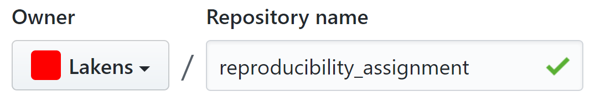
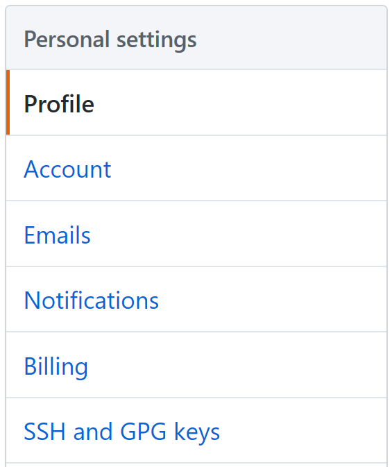
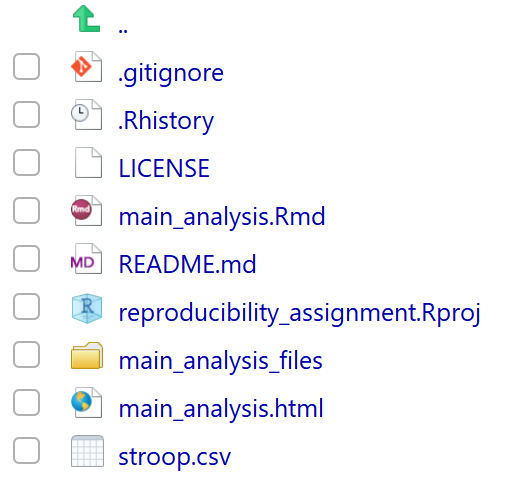
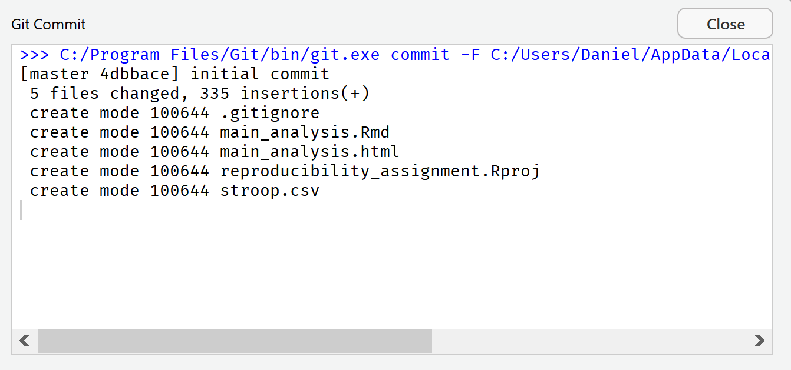
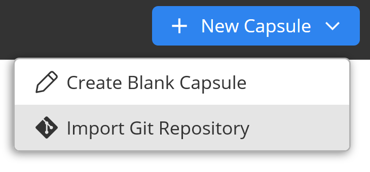

```{r, include = FALSE}
knitr::opts_chunk$set(error = FALSE, warning = FALSE, message = FALSE, out.width  = '100%', fig.width  = 8, fig.height = 5, fig.align  = 'center')
```

<!-- To do: Reread, add references, and check if it all still works.  -->

# Computational Reproducibility{#computationalreproducibility}

Technology has greatly improved how scientists work. The internet has made it
easy to share information – including data, materials, and code – and new
software and online platforms have emerged to facilitate the workflow of
scientists [@spellman_short_2015]. One important goal of a scientific workflow is to make sure that the
final work you publish is computationally reproducible. **Computational
reproducibility** means that when you use the **same data** as in the published
article, you can reproduce the **same results**. In other words, if the authors
of the published article send you their data and code, you should be able to get
the exact same numbers as they report in their article. Current research on the
computational reproducibility of scientific articles suggests it is often not
possible to run the original code on the data to reproduce results. Sometimes
the code will simply not run on the data, or not all analyses are part of the
code.

However, computational reproducibility is important, both for other scholars to
be able to verify your results, and to build on your results. We could consider
computational reproducibility a minimum standard of your own workflow. However,
meeting this standard requires training. When I was a PhD, we often had a
problem known as ‘data rot’. When I submitted an article for publication, and
received the reviews after several months, I could not always easily reproduce
my own analyses. For example, I might not have stored how I dealt with outliers,
and could not exactly reproduce the original results. Sometimes, ‘data rot’ had
eaten away at either my data or my analysis code, and it no longer worked.

Obviously, there is no such thing as ‘data rot’. The problem was I did not use a
reproducible workflow. In this assignment, we will learn what a computationally
reproducible workflow looks like, and how you can share computationally
reproducible results with your published paper. The goal in this assignment is
for someone else (or for yourself, one year from now) to be able to take your
data, run your code, and get exactly the same results as you reported in your
work.

Although there are multiple ways to achieve a fully reproducible workflow, in
this assignment I aim to introduce you to what I believe might be one emerging
standard for a fully reproducible workflow. You learn to work with a version
control system (such as GitHub, which integrates nicely with the Open Science
Framework) as you are programming in R, which stores previous versions of files.
You will then learn how to write a completely reproducible data analysis script
(including figures), that you can save as an HTML file or a PDF file, using
RMarkdown. Finally, we will take a look at Code Ocean, a novel online platform
that allows you to share computationally reproducible code online, making it
extremely easy for others to run (small variations of) your code. You will not
learn how to become an experienced programmer in this assignment, but you will
see what a fully reproducible workflow would look like, and get some initial
experience with tools you will most likely want to explore more in the future.

Getting software and code to work on your system might be a challenge, and
regrettably, I can’t offer ICT support. Differences between Windows, Linux, and
Apple operating systems means you might need to search the internet for
solutions to problems you run into – this is very normal, and even experienced
programmers do this all the time. If you get stuck, you can check what you did
against what the assignment should look like by visiting the public versions of
part of this assignment:

GitHub repository: <https://github.com/Lakens/reproducibility_assignment>

OSF project: <https://osf.io/jky8s/>

Code Ocean container: <https://codeocean.com/capsule/2529779/tree/v1>

## Step 1: Setting up a GitHub repository

If you haven’t created a GitHub account before, do so now. Go to
<https://github.com/> and create an account. Git is a version control system for
tracking changes in computer files and coordinating work on those files among
multiple people. Version control allows you to track changes to files and revert
back to previous versions if needed. GitHub and GitLab are web-based hosting
services that make it easier to use version control with Git. We will be using
GitHub because it is what I am most familiar with, and it integrates with
slightly more tools, but feel free to use GitLab instead.

If you have an account, you can create a new repository. A **repository** is a
collection of folders and files that make up your project. In the top-right of
the GitHub page, click the + symbol, and select ‘New repository’ from the
dropdown menu.

```{r cr1, echo = FALSE}
knitr::include_graphics("images/7a1725550cadb293b13fe058631a24ba.png")
```

The first thing to do is name your repository. When it comes to naming folders
and files, it is important to follow **best practices for file naming**:

- Keep names short, but clear. data_analysis_project is easier to understand
for others than dat_an_prjct

- Do not use spaces. Options include:

- Underscore: this_is_a_file.R (this is my personal favorite)

- Camelcase: ThisIsAFile.R

- Dashes: this-is-a-file.R

- No spaces: thisisafile.R

- If you want to number multiple sequential files, do not use 1_start, 2_end,
but use leading zeroes whenever you might number more than 10 files, so for
example 01, 02, etc., or 001, 002, etc.

- Do not use special characters such as \$\#&\*{}: in file names.

- If you want to use date information, use the YYYYMMDD format.

Let’s name our repository: reproducibility_assignment

```{r cr2, echo = FALSE}

```

You can add a short description (e.g., ‘This is an assignment to practice an
 open and reproducible data analysis workflow’). If you are an academic or
student, you can get an academic account, which gives some extra options, such
as keeping repositories private: <https://education.github.com/pack>

Click the checkbox before ‘Initialize this repository with a README’. A readme
file is a useful way to provide a more detailed description of your project,
that will be visible when people visit your GitHub project page.

You are also asked whether you want to add a **license**. Adding a license is a way to easily communicate to others how they can use the data, code, and materials that you will share in your GitHub repository. Note that not making a choice about a license is also a choice: if you do not add a license your work is under exclusive copyright by default, which means others can’t easily re-use it. You can [learn more about licenses](https://choosealicense.com/), but for now, a simple choice is the MIT license, which puts only very limited restrictions on reuse, but more restrictive licenses also exist. You can select the choice of license (such as  the MIT license) from the dropdown menu. It lets people do anything they want with your code as long as they provide attribution back to you and don’t hold you liable. There are also [creative commons
licenses](https://creativecommons.org/choose/) that you can use when you are sharing something else than software, such as research materials (for example, this educational material is shared under a [CC-BY-NC-SA 4.0](https://creativecommons.org/licenses/by-nc-sa/4.0) license).

We are now ready to create the repository. Click

```{r cr3, echo = FALSE, out.width  = '20%'}
knitr::include_graphics("images/ccb66558822a17c4a3ec6511c9bf5a7b.png")
```

It might feel unintuitive, but it is important to remember that you are not
expected to directly interact with your new GitHub repository through the GitHub
website. The repository page will give you information about the contents of the
repository, and the history of the files in the repository, but it is not
particularly easy to add files or download files directly through the website.
The idea is that you use other software to interact with your GitHub repository.

## Step 2: Cloning your GitHub repository into RStudio

R Studio can communicate with GitHub. To allow R Studio to work together with
GitHub, you first need to set up the system. A detailed explanation for
different operating systems is provided
[here](https://support.rstudio.com/hc/en-us/articles/200532077-Version-Control-with-Git-and-SVN).
First, download Git: <https://git-scm.com/downloads> for your operating system,
and install it (you can accept all defaults during the installation process). If
you haven’t done so already, download and install R:
<https://cran.r-project.org/>, and download and install the free version of R
Studio (scroll down for the installers):
<https://www.rstudio.com/products/rstudio/download/>.

In R Studio, go to Tools \> Global Options, and select the Git/SVN menu option.

```{r cr4, echo = FALSE}
knitr::include_graphics("images/cfc1e6fc415fb90fad16f4856338b890.png")
```

Check if the Git executable (“git.exe”) has been found automatically. If not,
you will need to click the ‘ Browse…’ button and find it manually. It will
always be in the location where you installed Git.

Click the ‘Create RSA Key…’ button. A window will appear:

```{r cr5a, echo = FALSE}
knitr::include_graphics("images/afd9d82e34e9fbff7e9d83c9b89e29c0.png")
```

You can close the window. Still under the RStudio options, click the blue
hyperlink ‘View public key’. A window will appear, telling you that you can use
CTRL+C to copy the key. Do so.

Go to GitHub, and got to settings and then select the option SSH and GPG keys:

```{r cr5b, echo = FALSE, out.width  = '50%'}
knitr::include_graphics("images/e2c7d8cad7b8127e20ad6caf6d2b84ea.png")
```

```{r cr6, echo = FALSE, out.width  = '50%'}

```

Click ‘New SSH key’

```{r cr7, echo = FALSE}
knitr::include_graphics("images/02ee9504ceacd79b3706f18e8497ed43.png")
```

Enter a name (e.g., RStudio) and paste the key in the correct window. Click ‘Add
SSH Key’. This will allow you to send code to from R Studio to your GitHub
repositories without having to enter your GitHub login name and password every
time. In other words, R Studio is now connected to your GitHub account and
repository. You are now ready to create a **version controlled project** in R
Studio.

**Restart RStudio**. In RStudio, go to File\>New Project:

```{r cr8, echo = FALSE}
knitr::include_graphics("images/7549d0317ad5f80afe7f3c6be4ad0ba3.png")
```

You get three choices. Choose the ‘Version Control’ option:

```{r cr9, echo = FALSE}
knitr::include_graphics("images/5eff851f02909023dac665978c716a9d.png")
```

Choose the ‘Git’ option:

```{r cr10, echo = FALSE}
knitr::include_graphics("images/a37a25fa7b6b9534d8f16154ce417be6.png")
```

We will be cloning the online GitHub repository we created. Cloning is a term
used in Git that means creating a local copy of all files in your repository on
your computer. You can copy-paste the URL from your GitHub repository (e.g.,
 <https://github.com/Lakens/reproducibility_assignment>). If you copy-paste this
URL in the top field, it will automatically create a Project directory name that
is similar to the name you gave your project on GitHub. You can select a folder
on your computer by clicking the ‘Browse’ button to indicate where you want to
save the local copy of your repository.

```{r cr11, echo = FALSE}
knitr::include_graphics("images/085ad47bd94f834aca501b87baa7c0eb.png")
```

Click ‘Create Project’. R will quickly download the files from your repository,
and open the new project. You will see that the project creation was successful
because the ‘Files’ tab in the RStudio interface shows we have downloaded some
files from our GitHub repository (the README.md and LICENSE files). RStudio also
created a .Rproj file and a .gitignore file. The **project file** is used to
store information about the project, and that is required to use GitHub.

```{r cr12, echo = FALSE}
knitr::include_graphics("images/386831c4f089bbb56758718619859308.png")
```

We can also see this is a version control project in the top right of the
interface, where there is now a ‘Git’ tab. If we click it, we see:

```{r cr13, echo = FALSE}
knitr::include_graphics("images/16361987bd66eec35a5b82b2efb9617b.png")
```

We see a range of buttons, such as the Diff, Commit, Pull, and Push buttons.
These will be used to interact with GitHub. Many computer programmers interact
with GitHub through the command line, such as:

**\$ git commit -m "This is a git commit message"**

Learning to use git through the command line is not needed for most people who
just want basic version control. Here, I will exclusively focus on version
control and git through the menu options in RStudio. It is now time to create a
file for which we want to control the versions we make of it.

## Step 3: Creating an R Markdown file

R Markdown files provide a way to save and execute code, while at the same time
allowing you to create reports of your data analysis (and even full scientific
 articles that you can submit for publication!). A complete introduction to R
Markdown is [available here](https://rmarkdown.rstudio.com/lesson-1.html). The
main strength of R Markdown documents is that they allow you to create a fully
reproducible document. This means that you do not just have some analysis code
in an R script, but a manuscript that combines text and code and that you can
**compile** to create a PDF or html version of the manuscript. HTML or PDF files
have the advantage that people can read them with regular software. The R
Markdown file contains code that performs the analyses **each time the document
is compiled**. Instead of copy-pasting values from your analysis software into a
word document, you combine code and text in the RMarkdown file to create a
manuscript where every number or figure can be traced back to the exact code
that generated it. That has the advantage that everyone can use your RMarkdown
file and generate the same document (e.g., your manuscript) as you.

You can still make errors in the analysis if you use R Markdown files. The
important difference is that you will be making programming errors that are
stored in the R Markdown document. Compared to a typo when copying numbers from
your analysis to a word document, errors in your analysis in your RMarkdown file
will lead to the same document. Because the document is reproducible, all errors
are reproducible as well. It is impossible to prevent all errors, but it is
possible to make them reproducible. This will make it easier to identify and
correct errors. I understand you might worry about others seeing your errors if
you allow them to see exactly what you have done. But **we all make mistakes**,
and it is important for science to be able to identify and correct these
mistakes. An important aspect of moving to a more reproducible workflow, and
sharing all files underlying your manuscript publicly, is that we will have to
learn to **accept that we all make errors**, and appreciate people who correct
them.

Let’s start by creating a new R Markdown document in R Studio by clicking New
File \> R Markdown…

```{r cr14, echo = FALSE}
knitr::include_graphics("images/f13fad91521fb984d12577416fa1fa99.png")
```

This gives you a new window where you can specify the title of your RMarkdown
document and an author name. Enter the title ‘Main Analysis’, and feel free to
change the Author subfield to anything you prefer. RMarkdown files can be
compiled (also referred to as ‘knitted’) into an HTML file, a PDF document, or a
word document. To generate PDF files you need to install MiKTex which we won’t
do for this assignment ([a good tutorial how to install MiKTeX is available
here](https://medium.com/@sorenlind/create-pdf-reports-using-r-r-markdown-latex-and-knitr-on-windows-10-952b0c48bfa9)).
So leave the default output format to HTML and click OK.

```{r cr15, echo = FALSE}
knitr::include_graphics("images/be373a55333121dee2669025ba9fff3d.png")
```

Let’s start by saving the new file: Click the save button, and save the file
under the name ‘main_analysis.Rmd’. Because we are working in an R Studio
project, the file will automatically be saved in the same folder as all other
files in this project. If you look at the files tab in the bottom right pane,
you will see the new file appear. Now let’s take a look at the R Markdown file.

The R Markdown file by default includes several sections to get you started.
First, there is a header section. In the header section, there is code that
determines how the final document is rendered. This section is sensitive, in the
sense that it needs to be programmed exactly right – including spaces and tabs –
so it is not recommended to change it too much without looking up detailed
documentation on how to change this section. If you want the technical details:
A R Markdown file is fed to knitr software, which creates a normal markdown
file, which then uses pandoc software to generate the specific document you
requested. All of this happens automatically.

```{r cr16, echo = FALSE}
knitr::include_graphics("images/fd284f329222582a56ecb4906f99afee.png")
```

The header is followed by a **set-up** section where you can define general
options for the entire R Markdown file. Then, we see the two main sections:
**Markdown code**, which is a markup language in plain text formatting syntax
that can be easily converted into HTML or other formats. Then, we see **R code**
that is used to analyze data or create figures. To see the final result of this
code, hit the

```{r cr17, echo = FALSE, out.width  = '20%'}
knitr::include_graphics("images/270645a5be86fa1d9d534f78b8ca0724.png")
```

Knit button in the toolbar at the top of the pane.

Either a new window will appear that allows you to view the HTML file that was
created, or your document will appear in the ‘viewer’ tab in RStudio. You see
the formatted HTML document that combined both text and the output of R code.

```{r cr18, echo = FALSE}
knitr::include_graphics("images/9405a78d629bc5abd36ba8b31c42cfd9.png")
```

Close the window – we are now ready to analyze our data.

## Step 4: Reproducible Data Analysis in R Studio

Delete all text from \#\# R Markdown on down – only keep the header and set-up
sections of the default document.

First, we need to analyze some data. We will download this data directly from an
existing GitHub repository I created. Students in an introduction to psychology
course performed a simple Stroop experiment. During the Stroop, participants
named the colors in a congruent trial (e.g., the word 'red' written in a red
font) and incongruent trial (e.g., the word 'red' written in a green font). The
time they took to name all words was recorded in seconds (e.g., 21.3 seconds)
for both the congruent and incongruent trial. There are four columns in the
dataset:

- Participant Number

- Response Time for Congruent Stimuli

- Response Time for Incongruent Stimuli

- Year of Data Collection

Click the button ‘+C Insert’ to insert code – a dropdown menu will be visible.
Select R.

```{r cr19, echo = FALSE, out.width  = '50%'}
knitr::include_graphics("images/2f929ee323a9f222c85675f5fc45672f.png")
```

In the R Markdown file, you’ll see a new section of R code that starts with
three backticks followed by {r} and ends with three backticks. You can also just create these sections by
manually typing in these two lines.

Copy-paste the code below – make sure to get all the text – and paste it between
the start line and the end line of the R code chunk. Note that
there is not hard return between 'str' and 'oop.txt' – when copy-pasting this,
you probably need to correct this.

```{r, eval = FALSE}
stroop_data <- read.table("https://raw.githubusercontent.com/Lakens/Stroop/master/stroop.txt",
sep = "\\t", header = TRUE)`

write.table(stroop_data, file = "stroop.csv", quote = F, row.names = F)
```

After copy-pasting the text, the code section should look like this (again, be
aware of any difficulties when copy-pasting text from a PDF file into RStudio):

```{r cr20, echo = FALSE}
knitr::include_graphics("images/6d87836ecdcc9b06891059acc43930a2.png")
```

This code creates a data.frame called ‘stroop_data” that contains data, and then
saves this data in a .csv file called ‘stroop.csv’. Click the Knit button:

```{r cr21, echo = FALSE, out.width  = '20%'}
knitr::include_graphics("images/270645a5be86fa1d9d534f78b8ca0724.png")
```

to look at the document. You should see something like:

```{r cr22, echo = FALSE}
knitr::include_graphics("images/5bad7d8cde23291c2d67ff65897d60c4.png")
```

This might not look very impressive – but the real action is in the file pane in
the bottom right part of the screen. Close the window showing the HTML output
and look at the file pane. You should now see a bunch of files:

```{r cr23, echo = FALSE}

```

One file is stroop.csv – this is our data file of the Stroop data that we
downloaded from the internet and saved to our project folder, using R code.

There is really no need to keep downloading the file from the internet when we
can also just load it from the local folder. So let’s change the code. We won’t
completely delete this code – we will just **comment it out** by placing a \# in
front of it. This way, we can still remember where we downloaded the code from,
but we won’t use the code.

Because it is always important to **provide comments in the code you write**,
add the explanation:

\#run only once to download the data

above the line where we downloaded the code. Then, select the lines of code in
the chunk, and click (on windows) CTRL+SHIFT+C (or click ‘Code’ in the toolbar
and then ‘comment/uncomment lines’). This should add \# in front of all lines,
making it comments instead of code that is executed every time. You should end
up with:

```{r cr24, echo = FALSE}
knitr::include_graphics("images/0061d311bf4819c08afde5f9b110f9b6.png")
```

Now we need to add a line of code that we will run, and with which we will load
the stroop.csv dataset from the local folder. Underneath the last commented out
line of code, but within the R code block, add:

`stroop_data <- read.csv("stroop.csv", sep = " ", header = TRUE)`

```{r cr25, echo = FALSE}
knitr::include_graphics("images/f14461f73699f865e4850e99990606f2.png")
```

Click save, or press CTRL+S, to save the file. Knit the file. We see:

```{r cr26, echo = FALSE}
knitr::include_graphics("images/f860eea02424968a1c0ca4afc5b583df.png")
```

Close the HTML file. We’ve done quite a lot of work. It would be a shame if this
work was lost. So this seems to be the perfect time to save a version of our R
Markdown file, not just locally, but also on GitHub.

## Step 5: Committing and Pushing to GitHub

It is time to store our changes in the cloud, on GitHub. This process takes two
steps. First, we record the changes to the repository (aka the code and files we
created), which is called ‘**commit**’. This does not require an internet
connection, because we are just recording the changes locally. However, then we
want to make sure these recorded changes are also stored on GitHub, which
requires you to **push** the files to GitHub.

If we look at the Git tab in the top right pane in R Studio, we see the Commit
button, the Push button, and we see a bunch of files. The status of these files
is indicated by two question marks in yellow. These question marks indicate
these files are not yet tracked by GitHub. Let’s change this.

```{r cr27, echo = FALSE}
knitr::include_graphics("images/ca36fd42cb6d9189534590e5cfcb9411.png")
```

Click the commit button. A menu opens. You can choose to ‘stage’ the changes
that have been made. Staging basically mean selecting which of the files you
want to record, or **commit**. You can do this in several ways, such as double
clicking each file, or selecting all files and clicking ‘Enter’. When staging
all files, the yellow question marks change to a green ‘A’ symbol. Every commit
should be accompanied by a **commit message** where you describe which changes
you have made – after all, we are recording our changes. You can type in
anything you want – it is common to write something like ‘initial commit’ the
first time you commit changes. The menu should look like the screenshot below:

```{r cr28, echo = FALSE}
knitr::include_graphics("images/df26ee077662dda7148be10da4c410e8.png")
```

Now we are ready to **commit** these changes. Click the ‘Commit’ button. A new
window opens that shows all changes that have been committed. We see that 5
files have changed. You can close this window and close the previous menu.

```{r cr29, echo = FALSE}

```

R Studio now reminds you that there is a difference between the local copy of
your repository, and the remote version of the repository on GitHub. In the Git
tab you see a reminder: “Your branch is ahead of ‘origin/master’ by 1 commit.”.

```{r cr30, echo = FALSE}
knitr::include_graphics("images/b3c606d72795bf88e1b7a04dbce381bb.png")
```

This means the files we have updated and recorded on our computer with a commit
are not yet synchronized with the **remote repository** on GitHub. We can solve
that by ‘pushing’ (aka synchronizing) the changes to the remote repository.
Simply click the **push** button:

```{r cr31, echo = FALSE, out.width  = '20%'}
knitr::include_graphics("images/7a363782af473d6da3e79f3a088d527b.png")
```

Another pop-up window appears:

```{r cr32, echo = FALSE}
knitr::include_graphics("images/8b77f09c9c2cad752ec90ecdfa42e566.png")
```

This window informs us there were no errors, and we successfully pushed the
changes to the remote version of the repository. You can close this window.

You can check that you successfully pushed all files to GitHub by visiting the
GitHub page for your repository in the browser. You should see something like:

```{r cr33, echo = FALSE}
knitr::include_graphics("images/9eb79724ec82b5a99d62938388c43d3a.png")
```

Congratulations on your first GitHub push! If you want to read a more extensive introduction to Git, see @vuorre_curating_2018. 

## Step 6: Reproducible Data Analysis

So far, we have only read in data. The goal of an R Markdown file is to create a manuscript that contains a fully **reproducible data analysis**. In this assignment, I cannot teach you how to analyze data in R (but I can highly recommend learning it – there are plenty of excellent online resources). Instead of programming from scratch, visit [this raw text version of the R Markdown  file](https://raw.githubusercontent.com/Lakens/reproducibility_assignment/master/main_analysis.Rmd) that will analyze the Stroop data. In the website, select all text (CTRL+A), copy it (CTRL+C). Then go to your main_analysis.Rmd file in R Studio. Select all text (CTRL+A) and hit delete. That’s right – delete everything. You don’t need to worry about losing anything – you have a **version controlled file** in your GitHub repository, which means you can always go back to a previous version! In the (now empty) main_analysis.Rmd file, press CTRL+V and paste all text. The file should look like the screenshot below. 

This R Markdown file does a number of things, which we will explain in detail
below. For example, it will automatically install libraries it needs, load the
data, and create a report in HTML. You can hit the Knit button, and the HTML
document should load. You should see output as in the second screenshot below.

```{r cr34, echo = FALSE}
knitr::include_graphics("images/23a19f01f3a23b3673656ee78860caf5.png")
```

```{r cr35, echo = FALSE}
knitr::include_graphics("images/79166b6bcc909e9e9e7fb0dd365fc8b2.png")
```

```{r cr36, echo = FALSE}
knitr::include_graphics("images/dc72012da17d44752af4ab572c6c20d2.png")
```

It is important to note that none of the numbers that are in this text are
static, or copy-pasted. They are all calculated at the moment that the document
is created, directly from the raw data. The same is true for the figures, which
are created from the raw data the moment the manuscript is compiled. If you have
access to the .Rmd (RMarkdown) file, you can perfectly **reproduce** the
reported data analysis.

Since we have made substantial changes, this is the perfect moment to **commit**
and **push** the changes to GitHub! Go to the Git tab in the top right pane.
Click ‘Commit’. The window below will open. If the main_analysis.Rmd file is
selected, you will see red and green chunks of text. These tell you what was old
(red) and what is new (green).

```{r cr37, echo = FALSE}
knitr::include_graphics("images/045aa0f44f3615a30aeaac241042fa3a.png")
```

Select all files that have changed, and ‘stage’ them (for example by pressing
 enter). The checkboxes in front of the files, under the ‘Staged’ column, should
be checked.

```{r cr38, echo = FALSE}
knitr::include_graphics("images/3d314b695f0d424b8792e4d179f6f4d3.png")
```

Type in a commit message, such as ‘update mean analysis’ in the ‘commit message’
field. Press the ‘Commit’ button. Close the window that pops up to inform you
about the result of the commit. Then click ‘push’. Close the window that informs
you about the push command, and close the commit window. You can always visit
the GitHub repository online and look at the full history of your document to
see all changes that have been made.

Let’s take a look at some sections of our new R Markdown document. First the
header:

```{r cr39, echo = FALSE}
knitr::include_graphics("images/5be3bc1c3f5a2ebf2d16d19430312057.png")
```

This sets general options for the code chunks in the R Markdown file. The echo,
warning, and message = FALSE hide the code chunks, warning messages, and other
messages, where the ‘include=true’ will make all figures appear in the text. You
can set some of these variables to TRUE, and hit Knit to see what they change.
Sometimes you might want to share the HTML file with all code visible, for
example when sharing with collaborators.

If you scroll down, you can see the introduction text, the code that generates
the first figure, and the code that performs the analyses. These variables are
used in the Result section. Let’s look at this section:

```{r cr40, echo = FALSE}
knitr::include_graphics("images/aab442e8c104cb1444a88b7a3a987de5.png")
```

This section shows how you can **mix text and R code**. The start of this code
is normal text. The \*M\* is still normal text (the \* and \* make sure the M is italicized, just as further down the \~av\~ indicates these letters should be subscript), but then you see R code. In R Markdown you can embed R code within \`r\`.
Any R code within the two backticks will be executed. In this case, the mean
of the Congruent reaction times is calculated, and rounded to 2 digits. You can
see this number in the text.

Learning to program takes time. You can see some things are quite tricky to
program. For example, the code:


```{r, eval = FALSE}
ifelse(ttest_result$p.value > 0.001," = ", " < ")
ifelse(ttest_result$p.value > 0.001, formatC(round(ttest_result$p.value,
 digits=3), digits=3, format="f"), "0.001")
```

is a lot of code to make sure the exact *p*-value is reported, unless this
p-value is smaller than 0.001, in which case ‘p \< 0.001’ is printed (the papaja
package below makes reporting statistics a lot easier!). The first time you need
to program something like this takes a lot of time – but remember you can re-use
code in the future, and you can steal a lot of code from others! You can
complete a full introduction to Markdown
[here](https://rmarkdown.rstudio.com/articles_intro.html).

### Extra: APA formatted manuscripts in papaja

If you want to write a reproducible manuscript in **APA style** (common in for
example psychology) you might want to try out the R package
[papaja](https://github.com/crsh/papaja) created by Frederik Aust. Install the
papaja package. **Restart RStudio**.Then, create a new R Markdown document, but
instead of selecting the document option, select the ‘From Template’ option, and
select the template APA article (6th edition) provided by the papaja package.

```{r cr41, echo = FALSE}
knitr::include_graphics("images/b4edc7f85821527cd6f98a1c76dfc47d.png")
```

You will see a template with a lot of fields for you to fill in, such as the
title, author names and affiliation, the author note, the abstract, etc. Papaja
takes care that all this information ends up in a nice lay-out – exactly
following the APA rules. This means that if you have installed MiKTeX (to be
 able to convert to PDF), you can knit the document to a pdf, and submit an APA
formatted document that is completely reproducible. For a tutorial covering all
options in papaja, including how to add citations:
<https://crsh.github.io/papaja_man/index.html>

```{r cr42, echo = FALSE}
knitr::include_graphics("images/50d0fc917605c24a8839a66437f9c18b.png")
```

## Step 7: Organizing Your Data and Code

It is important to always **organize your data files and analysis files**. This
helps others to quickly find the files you are looking for. In general, I
recommend the **TIER protocol**: <https://www.projecttier.org/tier-protocol/>.
If share a datafile that is slightly larger than the one in this example, make
sure you add a codebook so others understand what all variables mean. For a nice package that can help you to generate a machine readable codebook, see @arslan_how_2019.

When you are organizing your code, **take great care to make sure that any personally identifying information in your data is stored safely**. Open science is great, but you are responsible to share data responsibly. This means that you need to **ask participants permission to share their data** in the informed consent form (a [useful  resource](https://www.uu.nl/en/research/research-data-management/guides/informed-consent-for-data-sharing)
is the Research Data Management Support page of the University of Utrecht).
Whenever you collect personal data, make sure you [handle this data responsibly](https://www.uu.nl/en/research/research-data-management/guides/handling-personal-data). Information specialists at your university library should be able to help. 

## Step 8: Archiving Your Data and Code

Although we have uploaded our data and code to GitHub, when you publish your article and want to **share your data and code**, it is important to remember that GitHub is not a data repository that guarantees long term data storage.
GitHub is currently owned by Microsoft, and companies can choose to do with their free service whatever they want. This makes it less suitable to link to GitHub in scientific articles, because articles be around decades from now. For scientific publications, you will want to link to a stable long-term data repository. For a **list of data repositories**, click [HERE](http://journals.plos.org/plosone/s/data-availability#loc-recommended-repositories).
We will use the Open Science Framework (OSF) in this assignment as a stable data storage, because it is very easy to just integrate our GitHub repository within an OSF project.

Log in to the OSF at <https://osf.io/> (create an account if you haven’t already  done so). Click ‘Create new project’. Give your project a name (for example ‘Stroop Reproducible Analysis Assignment’).

It is again important to add a **license** to your work, also on your OSF project. After having created a project, you can click ‘Add a license’:

```{r cr43, echo = FALSE}
knitr::include_graphics("images/372c6ba890617ecf396d540bed85698c.png")
```

You can again choose an MIT license. You will have to fill in a year, and the copyright holders – in this case, that is you, so fill in your name (it will appear in the license text). Then click

```{r cr44, echo = FALSE, out.width  = '20%'}
knitr::include_graphics("images/e137b9bdf5f301150dc3c06b6f3eb5ca.png")
```

Although we could upload all our files to the OSF, we can also simply link our
GitHub project to the OSF. In the menu bar of the OSF project, click on
‘Add-ons’. In the list, scroll to GitHub:

```{r cr45, echo = FALSE}
knitr::include_graphics("images/e25382896d7b290ad6649a6f2d5c13a2.png")
```

Follow the step-by-step guide to connect to GitHub provided by the OSF:
<https://help.osf.io/hc/en-us/articles/360019929813-Connect-GitHub-to-a-Project>

Select your repository that contains the reproducibility assignment and click
‘Save’.

```{r cr46, echo = FALSE}
knitr::include_graphics("images/7570fb87913b1d687a9b8a3a72948e24.png")
```

Click the title of the OSF project page to go back to the main project page. You
will now see in the ‘Files’ pane that the GitHub repository is linked:

```{r cr47, echo = FALSE}
knitr::include_graphics("images/4ecc8e0af472a95a3f01baf3af0538cf.png")
```

This is a good moment to click the ‘Make Public’ button in the top right of your
project. After making the project public, people will be able to find it on the
OSF. If you don’t want to make your project public just yet, but you do want to
give others access to your files, you can create a **‘View-only’ link** on the
OSF. Go to ‘Contributors’ and click the +Add button next to View-only links. For
a step-by-step guide, see [this
tutorial](https://help.osf.io/hc/en-us/articles/360019930333-Create-a-View-only-Link-for-a-Project).

```{r cr48, echo = FALSE}
knitr::include_graphics("images/fd54022300a51d07de93673aac3fb508.png")
```

You can use a view-only link to share access to your files only with reviewers. You can create an anonymized view-only link to hide your contributor names in the project - this is particularly useful in **blinded peer review**. Giving access to the files during peer review greatly helps reviewers – it will be a lot easier for them to answer any questions they might have about your materials, data, or code. Be aware it means that people you don’t know will have access to your files. So far, I don’t know of any negative experiences with this process, but it is important to be aware that others have access to your files before they are published.

The OSF page now just links to the files on the GitHub page. It does not independently store them. This means we do not yet have a **long term stable data storage solution**.

To create a snapshot of all files in the GitHub repository that will be stored for a long time, you have to create a **Registration** of your project. We will not create a Registration of your project in this assignment. Creating a registration starts several formal procedures: data in linked repositories (such as GitHub) are stored by the OSF, and the project appears in the list of registrations. You should only register when you want to create a stable copy of your work. Below you see an example of the files in an OSF project that has been registered. You see that the GitHub repository that was linked to the project has been turned into an Archive of GitHub – this creates a stable version of the project, as it was at the moment you registered.

```{r cr49, echo = FALSE}
knitr::include_graphics("images/e0b28289fbe42988cbe04111e4aee6ad.png")
```

A good moment to create a stable version of your project is when your manuscript is accepted for publication. You can create a Registration and use the Digital Object Identifier (DOI) to link to the code, data, and materials in the paper (you can add this link to the DOI to the manuscript as you check the proofs of your article before it is published). Note that it is recommended to link to the materials using the **DOI**. The DOI is a persistent link (meaning it will keep  working) where a website address might change. A registration does not automatically get a DOI. After creating the Registration, you need to click the ‘Create DOI’ link to create a persistent object identifier.

```{r cr50, echo = FALSE}
knitr::include_graphics("images/502f57cf747457838ed0a0e2c5af0496.png")
```

If you are ready to create a Registration, follow the instructions on the OSF: <https://help.osf.io/article/158-create-a-preregistration>. As an example of a Registration that was made to store all work related to one of my scientific publications, see <https://doi.org//10.17605/OSF.IO/9Z6WB> (this link is itself an example of how to link to an OSF project using a DOI).

### EXTRA: Sharing Reproducible Code on Code Ocean

If you have used the workflow above to create a reproducible manuscript, you might want to make it easy for other people to explore your data and code. People can simply clone your GitHub repository – but this still requires them to install the software you used, and even if they have R installed, it requires them to install the packages you used to analyze your data. This can potentially lead to reproducibility problems. Packages in R update and change over time, and code that works on one machine might not run well on another computer. Furthermore, even when shared perfectly, downloading all files and getting the code up and running takes time. Several solutions exist, such as
[Packrat](https://rstudio.github.io/packrat/rstudio.html), which is a dependency management system for R, or [Docker](http://www.docker.com), which can create a container that works as a virtual machine that includes a computing environment including all the libraries, code and data that you need to reproduce an analysis [@wiebels_leveraging_2021].

Here, I’ll focus on a software solution that is designed to be easier to use than Docker, but provides many of the same benefits, called [Code Ocean](https://codeocean.com/). Code Ocean is a cloud-based computational reproducibility platform. You can create a computing capsule that runs online and contains all packages your code needs to run. Although Code Ocean does not (yet) guarantee long term storage of data and code, it is an interesting way to make your reproducible code available to fellow researchers, and makes it very easy for researchers (or reviewers) to make small changes to your code, and examine the results. Create a (free) account on CodeOcean. Go to the dashboard.
Click the ‘New Capsule’ button and choose the option ‘Import Git Repository.

```{r cr51, echo = FALSE}

```

Enter the web address of your GitHub repository and click import.

```{r cr52, echo = FALSE}
knitr::include_graphics("images/51f0dab67e96b317ef54a0affabe14d6.png")
```

Click on ‘Environment’ in the left pane. In the middle pane, click the R icon to
select the programming language. At the time of writing, the default language is
3.5.3, but you can click on ‘2 more versions’ and select R 3.6.

```{r cr53, echo = FALSE}
knitr::include_graphics("images/d6a90fd36fce0555b797e269cdd8c992.png")
```

We need to set up the Code Ocean environment to contain the packages we need.
Click +Add behind apt-get, and type pandoc and click the return key two times
(no need to specify a version of pandoc). Click +Add behind R (CRAN) and type in
ggplot2, and click return twice (no need to select a specific version). Click
+Add again, and type reshape2, click return twice. Click add once more, and type
rmarkdown and click return twice.

```{r cr54, echo = FALSE}
knitr::include_graphics("images/7be787e67b7e874fa88cfc2daae850b4.png")
```

In the left pane, drag and drop the main_analysis.Rmd file into the ‘code’ folder, and the ‘stroop.csv’ file into the ‘data’ folder. Select the code folder, and click the + button in the bar on the top of the left pane to add a
file. Name the file ‘run.sh’. This file will tell Code Ocean what to run. Select the file. The middle pane will be empty. Add the following code:

`\#!/bin/bash`

`Rscript -e "rmarkdown::render(input = 'main_analysis.Rmd', \\`

`output_dir = '../results', clean = TRUE)"`

We need to make one final change. Select the main_analysis.Rmd. Scroll down to
line 28 where the data is read in. Change:

`stroop_data \<- read.csv("stroop.csv", sep = " ", header = TRUE)`

to

`stroop_data \<- read.csv("../data/stroop.csv", sep = " ", header = TRUE)`

We are no all done! Click the ‘Reproducible Run’ button in the right pane. You
will get output:

```{r cr55, echo = FALSE}
knitr::include_graphics("images/6c4278d56ff2d9101052c74a61783b43.png")
```

Click on the ‘main_analysis.html’. You will see the script has generated our
reproducible results. Commit the changes. You could (in principle – for this
assignment we won’t) make this completely reproducible container openly
available and share it with your published paper.

```{r cr56, echo = FALSE}
knitr::include_graphics("images/f8904ae8e964bd88b2c21078ea9e81f9.png")
```

There is now a completely reproducible analysis file online. Anyone can not just
reproduce your data analysis – they can go into the main_analysis.Rmd file, and
change anything they want in your code, and run it again. For example, let’s say
you dislike the black straight line in the first scatterplot, and you want it to
be red. It is easy to change ‘black’ to ‘red’ in line 42, and re-run the
analysis, and you will get a figure with a red line. Although that might in
itself not be very exciting, the ability to easily re-analyze data might be
useful in more realistic scenarios. For example, imagine you are reviewing a
paper where the researchers do not plot the data. Without having to install any
software, you can just type in hist(stroop_data\$Congruent) after the data has
been read in (e.g., on line 30), run the code again, and you will see a
histogram for the reaction times in the Congruent condition. Give it a try.

## Some points for improvement in computational reproducibility

We recently tried to computationally reproduce Registered Reports published in the psychological literature [@obels_analysis_2020]. We noticed some issues that, if solved, would easily improve the computational reproducibility of your work. 

First, always add a codebook to data files. We already noted this above, and yes, it is a bit of work and not that fun to do, but it is very essential to include a codebook when you share data. Data is easier to understand and more reusable if variables and their values are clearly described. Researchers should ensure that the codebook and variable names are in the same language as the article. 

Second, annotate code so it is clear what the code does. Well-annotated code makes clear what the analysis code does, in which order scripts should be run if there are multiple scripts (e.g., to pre-process the raw data, compute sum scores, analyze the results, and generate graphs), and which output each section of analysis code generates. Sometimes it might even be helpful to, from the final manuscript, copy-paste the sentences in the results section back into the code file, so it is very clear how sentences in the manuscript relate to the code file. It also helps to clearly structure code (e.g., using a README) so others know which output analysis code creates and in which order code should be run. 

Third, check whether the code you shared still reproduces all analyses after revisions - researchers often make changes during the peer review process, but forget to update their analysis files. 

Finally, remember that most code in R relies on specific libraries (also called packages). List all the packages that the code needs to run at the top of the script. Because packages update, it is necessary to report the version numbers of packages that were used (for example using packrat, or copying the output of the sessionInfo() function as a comment in the script). Remember that folder names and folder structures differ between computers, and therefore you should use relative locations (and not “c:/user/myfolder/code”). RStudio projects and the 'here' package provide an easy way to use relative paths. When multiple scripts are used in the analysis, include the order in which scripts should be performed on the data in a README file. 

## Conclusion

In this assignment, we used a number of platforms and software solutions, such as GitHub, the Open Science Framework, R Studio, R, and R Markdown. Following through the example here is not the same as being able to use these tools in your research. Learning to use these tools will take time. There will be many frustrations when the code or software doesn’t work as you want, or when you have gotten your local and remote GitHub repositories so much out of sync you just need to delete everything on your local computer and re-download all files from GitHub (git reset --hard [HEAD] is your friend). There are a lot of resources available online to find answers, or to ask for help. In my experience, it is some work, but it is doable, even if you have very limited knowledge of programming. You can get a basic reproducible workflow up and running by simply using all the steps described here, and then learn new skills as you need them. Learning these skills is appreciated both within and outside of academia (which is useful for PhD students) and will quickly save you time (e.g., when recreating figures for a revision, or when analyzing very similar datasets in the future). A reproducible workflow also improves the quality of your scientific work, and makes it easier for other scientists to re-use your work in the future.
