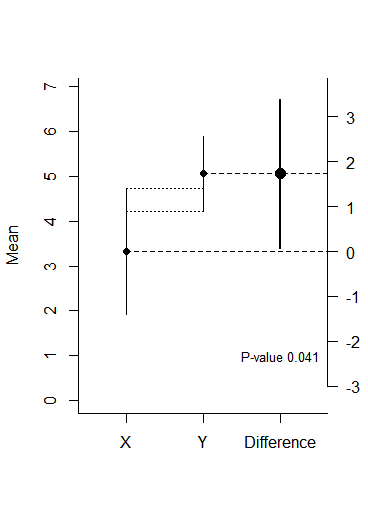
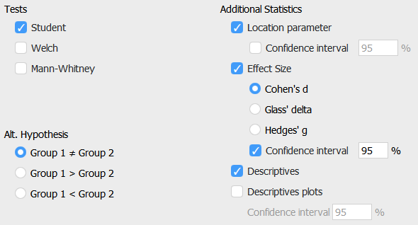

# Confidence Intervals{#confint}

As Kelley and Rausch @kelley_sample_2006 explain, it is misleading to report point estimates without illustrating the uncertainty surrounding that estimate. Pretending as if the outcome of your statistical test is the final and exact answer is misleading, and you should always communicate the remaining uncertainty when you report statistical analyses. Here, we will examine this question in detail by learning how to think about, calculate, and report confidence intervals around estimates from samples.

### Population vs. Samples

In statistics, we differentiate between the population and the sample. The population is everyone you are interested in, such as all people in the world, elderly who are depressed, or people who buy innovative products. Your sample is everyone you were able to measure from the population you are interested in. We similarly distinguish between a parameter and a statistic. A parameter is a characteristic of the population, while a statistic is a characteristic of a sample. Sometimes, you have data about your entire population. For example, we have measured the height of all the people who have ever walked on the moon. We
can calculate the average height of these twelve individuals, and so we know the true parameter. We do not need inferential statistics. However, we do not know the average height of all people who have ever walked on the earth. Therefore, we need to estimate this parameter, using a statistic based on a sample. 

In addition to the goal of observing a significant difference in a study (for example a *p* \< .05), researchers can have the goal of estimating a parameter accurately (regardless of whether this estimate differs from the null-hypothesis or not). Confidence intervals can be calculated around any statistic in your data.

Confidence intervals are a statement about the percentage of confidence intervals that contain the true parameter value. This behavior of confidence intervals is nicely visualized on this website by Kristoffer Magnusson: <http://rpsychologist.com/d3/CI/>. We see blue dots that represent means from a sample, fall around a red vertical line, which represents the true value of the parameter in the population. We see the blue dots do not always fall exactly on the red line. This illustrates the important fact that there is always variation in samples.

The horizontal lines around the blue dots are the confidence intervals. By default, the visualization shows 95% confidence intervals. Most of the lines are black, but some are red. In fact, in the long run, 95% of the horizontal bars will be black, and 5% will be red. 

We can now see what is meant by the sentence “Confidence intervals are a statement about the percentage of confidence intervals that contain the true parameter value“. For 95% of the samples, the red line (the population parameter) is contained within the 95% confidence interval around the sample mean.

As we will see when we turn to the formulas for confidence intervals, sample means and their confidence intervals depend on the sample size. The larger the sample size, the smaller the confidence intervals. 

### The relation between confidence intervals and *p*-values {#relatCIp}

There is a direct relationship between the CI of an effect size and the statistical difference from 0 of the effect. For example, if an effect is statistically different (*p* \< 0.05) from 0 in a two-sided *t*-test with an alpha of .05, the 95% CI for the mean difference between two groups will never include zero. Confidence intervals are usually said to be more informative than *p*-values, because they do not only provide information about the statistical difference from 0 of an effect but they also communicate the precision of the effect size estimate. If 0 is not contained in the confidence interval around the mean difference, the effect is statistically different from zero – it might be a false positive, but the *p*-value will be smaller than 0.05.

Confidence intervals are often used in forest plots that communicate the results from a meta-analysis. In the plot below, we see 4 rows. Each row shows the effect size estimate from one study (in Hedges’ g). For example, study 1 yielded an effect size estimate of 0.44, with a confidence interval around the effect size from 0.08 to 0.8. The horizontal black line, similarly to the visualization we played around with before, is the width of the confidence interval. When it does not touch the effect size 0 (indicated by a black vertical line) the effect is statistically significant.


We can see, based on the fact that the confidence intervals do not overlap with 0, that studies 1, 2, and 4 were statistically significant.The light blue diamond is the meta-analytic effect size. Instead of using a black horizontal line, the upper limit and lower limit of the confidence interval are indicated by the left and right points of the diamond. The center of the diamond is the meta-analytic effect size estimate. A meta-analysis calculates the effect size by combining and weighing all studies. The confidence interval for a meta-analytic effect size estimate is always narrower than that for a single study, because of the combined sample size of all studies included in the meta-analysis.

### The Standard Error and 95% Confidence Intervals

To calculate a confidence interval, we need the standard error. The standard error (SE) estimates the variability between sample means that would be obtained after taking several measurements from the same population. It is easy to confuse it with the standard deviation, which is the degree to which individuals within the sample differ from the sample mean. Formally, statisticians distinguish between σ and $\widehat{\sigma}$, where the hat means the value is estimated from a sample, and the lack of a hat means it is the population value – but I’ll leave out the hat, even when I’ll mostly talk about estimated values based on a sample in the formulas below. Mathematically (where σ is the standard
deviation),

Standard Error (SE) = σ/√n

The standard error of the sample will tend to zero with increasing sample size, because the estimate of the population mean will become more and more accurate. The standard deviation of the sample will become more and more similar to the population standard deviation as the sample size increases, but it will not become smaller. Where the standard deviation is a statistic that is descriptive of your sample, the standard error describes bounds on a random sampling process.

The Standard Error is used to construct confidence intervals (CI) around sample estimates, such as the mean, or differences between means, or whatever statistics you might be interested in. To calculate a confidence interval around a mean (indicated by the Greek letter mu: μ), we use the *t* distribution with the corresponding degrees of freedom (*df* : in a one-sample *t*-test, the degrees of freedom are n-1):

μ±*t*df, 1-(α/2) × SE

With a 95% confidence interval, the α = 0.05, and thus the critical *t*-value for the degrees of freedom for 1- α /2, or the 0.975th quantile is calculated. Remember that a *t*-distribution has slightly thicker tails than a Z-distribution. Where the 0.975th quantile for a Z-distribution is 1.96, the value for a *t*-distribution with for example df = 19 is 2.093. This value is multiplied by the standard error, and added (for the upper limit of the confidence interval) or subtracted (for the lower limit of the confidence
interval) from the mean.

### Overlapping Confidence Intervals

Confidence intervals are often used in plots. In the example below, you see three estimates (the dots), surrounded by three lines (the 95% confidence intervals). The left two dots (X and Y) represent the **means** of the independent groups X and Y on a scale from 0 to 7 (see the axis from 0-7 on the left side of the plot). The dotted lines between the two confidence intervals visualize the overlap between the confidence intervals around the means. The two confidence intervals around means in columns X and Y are commonly shown in a
figure in a scientific article. The third dot, slightly larger, is the **difference** between X and Y, and slightly thicker line visualizes the confidence interval of the difference. The difference score uses the axis on the right (from -3 to 3). In the plot below, the mean of group X is 3.3, the mean of group Y is 5.1, and the difference is 1.8.

The width of the confidence interval depends on the sample size, the confidence interval level, and the standard error, as you have seen before. In the plot on the left below, the sample size was 50 people in each group, while on the right, the sample size was 500 people in each group. The difference in the width of the confidence intervals is substantial. It is also clear that accurate estimates require large samples.




As mentioned earlier, when a 95% confidence interval does not contain 0, the effect is statistically different from 0. For a *t*-test, this is true for the confidence interval around an effect size, or around a mean difference, because the mean difference, or the standardized mean difference (the effect size) are directly related to the significance test. In the plots above, the mean difference and the 95% confidence interval around it are visible on the right of each plot. When this 95% confidence interval does not contain 0, the t-test is significant at an alpha of 0.05. But the two confidence intervals around the
individual means can be more difficult to interpret in relation to whether the means differ enough to be statistically significant. Open CI_Overlap.R, and run the code. It will generate plots like the one above. Run the entire script as often as you want (notice the variability in the *p*-values due to the relatively low power in the test!), to answer the following question. The *p*-value in the plot will tell you if the difference is statistically significant, and what the *p*-value is.

Q6: How much do two 95% confidence intervals around individual means from
independent groups overlap when the effect is only just statistically
significant (*p* ≈ 0.05) at an alpha of 0.05?

A) When the 95% confidence interval around one mean does not contain the mean of
the other group, the groups differ significantly from each other.

B) When the 95% confidence interval around one mean does not overlap with the
95% confidence interval of the mean of the other group, the groups differ
significantly from each other.

C) When the overlap between two confidence intervals is approximately half of
one side of the confidence interval, the groups differ significantly from each
other.

D) There is no relationship between the overlap of the 95% confidence intervals
around two independent means, and the *p*-value for the difference between these
groups.

Note that this visual overlap rule can only be used when the comparison is made between independent groups, not between dependent groups! The 95% confidence interval around effect sizes is therefore typically more easily interpretable in relation to the significance of a test.

### Prediction Intervals

Even though 95% of future confidence intervals will contain the true parameter, a 95% confidence interval will not contain 95% of future individual observations. Sometimes, researchers want to predict the interval within which a single value will fall. This is called the prediction interval. It is always much wider than a confidence interval. The reason is that individual observations can vary substantially, but means of future samples (which fall within a normal confidence interval 95% of the time) will vary much less.

Open the file CI_mean.R. Run the entire script. This scripts will simulate a single sample with a population mean of 100 and standard deviation of 15, and calculate the mean (M) and standard deviation (sd) of the sample. The black dotted line illustrates the true mean. 95% of the CI should contain the true mean (100).


The orange background illustrates the 95% confidence interval, calculated as we did manually before. The lighter yellow background illustrates the 95% prediction interval (PI). To calculate it, we need a slightly different formula for the standard error, namely:

Standard Error (SE) = σ\*√(1+1/N)

When we rewrite the formula used for the confidence interval to σ\*√(1/N), we see the difference between a confidence interval and the prediction interval is in the “1+” which always leads to wider intervals. Prediction intervals are **wider**, because they are constructed so that they will contain **a future single value** 95% of the time.

### Capture Percentages

One thing people find difficult to understand is why a 95% confidence interval does not provide us with the interval where 95% of future means will fall. The % of means that falls within a single confidence interval is called the **capture percentage**. A 95% confidence interval is only a 95% capture percentage when the statistic (such as an effect size) you observe in a single sample happens to be exactly the same as the true parameter. This situation is illustrated in the picture below. The observed effect size (dot) falls exactly on the true effect size (vertical dotted line). In this case, and *only in this case*, 95% of future means will fall within this 95% confidence interval.


However, you can’t know whether your observed effect size happens to be exactly the same as the population effect size. When this is not the case (and it is almost never exactly the case) less than 95% of future effect sizes will fall within the CI from your current sample. The right side of the figure illustrates this. Let’s assume we observed an effect size much lower to the true effect size. We know that effect sizes from the sample are randomly distributed around the true effect size. Very often, we should find effect size estimates in our sample that fall outside the 95% confidence interval of the single sample we happen to have observed. So, the percentage of future means that fall within a single confidence interval depends upon which single confidence interval you happened to observe! In the long run, a 95% CI has an 83.4% capture probability [@cumming_confidence_2006].

Let’s experience this through simulation. The simulation in the R script generates a large number of additional samples, after the initial one that was plotted. The simulation returns the number of CI that contains the mean (which should be 95% in the long run). The simulation also returns the % of means from future studies that fall within the 95% of the original study, or the capture percentage. It differs from (and is often lower, but sometimes higher, than) the confidence interval.

Q8: Run the simulations multiple times. Look at the output you will get in the R
console. For example: “95.077 % of the 95% confidence intervals contained the
true mean” and “The capture percentage for the plotted study, or the % of values
within the observed confidence interval from 88.17208 to 103.1506 is: 82.377 %”.
While running the simulations multiple times, look at the confidence interval
around the sample mean, and relate this to the capture percentage. Which
statement is true?

A) The farther the sample mean is from the true population mean, the lower the
capture percentage.

B) The farther the sample mean is from the true population mean, the higher the
capture percentage.

Q9: Simulations in R are randomly generated, but you can make a specific
simulation reproducible by setting the seed of the random generation process.
Copy-paste “set.seed(1000)” to the first line of the R script, and run the
simulation. The sample mean should be 94. What is the capture percentage? (Don’t
forget to remove the set.seed command if you want to generate more random
simulations!).

A) 95%

B) 42.1%

C) 84.3%

D) 89.2%

Capture percentages are rarely directly used to make statistical inferences. The
main reason we discuss them here is really to prevent the common
misunderstanding that 95% of future means fall within a single confidence
interval: Capture percentages clearly show that is not true. Prediction
intervals are also rarely used in psychology, but are more common in data
science.

In this assignment you have learned why it is important to provide a measure of the uncertainty of your estimates. We have discussed the correct interpretation of confidence intervals, the meaning of prediction intervals, and the difference between a confidence interval and a capture percentage. 

## Computing Confidence Intervals around Effect Sizes

### MOTE 

Currently the easiest and most complete solution to calculating effect sizes and confidence intervals is [MOTE](https://www.aggieerin.com/shiny-server/) made by Dr. Erin Buchanan and her lab. The website comes with a full collections of tutorials, comparisons with other software packages, and demonstration videos giving incredible accessible overviews of how to compute effect sizes for a wide range of tests. For example, the video below gives an overview for an independent *t*-test

<iframe width="560" height="315" src="https://www.youtube.com/embed/kH3UOoFh9Ng?start=9" frameborder="0" allow="accelerometer; autoplay; encrypted-media; gyroscope; picture-in-picture" allowfullscreen></iframe>

MOTE is also available as an R package [@buchanan_mote_2017]. It contains many useful functions, such as ways to compute effect sizes from summary statistics, which provide output that can conveniently be embedded in an R Markdown document:


```r
library(MOTE)

res <- d.ind.t(m1 = 1.7, m2 = 2.1, sd1 = 1.01, sd2 = 0.96, n1 = 77, n2 = 78, a = .05)
res$statistic
```

```
## [1] "$t$(153) = -2.53, $p$ = .013"
```

```r
res$estimate
```

```
## [1] "$d_s$ = -0.41, 95\\% CI [-0.72, -0.09]"
```

Although many solutions exists to compute Cohen's d, MOTE sets itself apart by allowing researchers to compute effect sizes and confidence intervals for many additional effect sizes, such as (partial) omega squared for between subjects ANOVA ($\omega^{2}$ and $\omega^{2}_p$), generalized omega squared for ANOVA ($\omega^{2}_G$), Epsilon squared for ANOVA ($\varepsilon^{2}$) and (partial) generalized eta squared for ANOVA ($\eta^{2}_G$), as well as Hedges' g (bias corrected Cohen's d). If you are want to compute effect sizes and their confidence intervals, this is the first resource you should try. 

### JASP

Free statistical software [JAPS](https://jasp-stats.org/) is a strong alternative to SPSS that (unlike SPSS) allows users to compute Cohen's d and the confidence interval for both independent and dependent *t*tests.

<div class="figure" style="text-align: center">

<p class="caption">(\#fig:jasp1)JASP menu option allows you to select Cohen's d and a CI around it.</p>
</div>

<div class="figure" style="text-align: center">

<p class="caption">(\#fig:jasp2)JASP output returns Cohen's d and the confidence interval around it.</p>
</div>

JASP also allows you to compute omega squared $\omega^{2}$, the less biased version of $\varepsilon^{2}$ and 


### ESCI software

For people who prefer to use [ESCI software](https://thenewstatistics.com/itns/esci/) by Geoff Cumming, ESCI also has an option to provide 95% CI around Cohen's d, both for independent as for dependent *t*-tests. However, the option is slightly hidden - you need to scroll to the right, where you can check a box which is placed out of view.

<div class="figure" style="text-align: center">

<p class="caption">(\#fig:esci)ESCI software has a somewhat hidden option to compute 95% CI around Cohen's d for within and between *t*-tests.</p>
</div>

### MBESS

MBESS is another R package that has a range of options to compute effect sizes and their confidence intervals [@kelley_confidence_2007]. The code below reproduces the example for MOTE above.


```r
library(MBESS)

# Cohen's d
smd(Mean.1 = 1.7, 
    Mean.2 = 2.1, 
    s.1 = 1.01, 
    s.2 = 0.96, 
    n.1 = 77, 
    n.2 = 78)
```

```
## [1] -0.406028
```

```r
# Hedges' g
smd(Mean.1 = 1.7, 
    Mean.2 = 2.1, 
    s.1 = 1.01, 
    s.2 = 0.96, 
    n.1 = 77, 
    n.2 = 78, 
    Unbiased = TRUE)
```

```
## [1] -0.4040338
```

To get the confidence interval for the proportion of variance (r², or η², or partial η²) in a fixed factor analysis of variance we need the ci.pvaf function. We need to specify the F-value, degrees of freedom,  the sample size, and the confidence level.


```r
ci.pvaf(F.value=5.72, df.1=1, df.2=198, N=200, conf.level=.90)
```

```
## $Lower.Limit.Proportion.of.Variance.Accounted.for
## [1] 0.002600261
## 
## $Probability.Less.Lower.Limit
## [1] 0.05
## 
## $Upper.Limit.Proportion.of.Variance.Accounted.for
## [1] 0.07563493
## 
## $Probability.Greater.Upper.Limit
## [1] 0.05
## 
## $Actual.Coverage
## [1] 0.9
```

For within designs, the MBESS package returns an error. For example:


```r
ci.pvaf(F.value = 25.73, df.1 = 2, df.2 = 28, N = 18, conf.level = 0.9)
```

```
## Error in ci.pvaf(F.value = 25.73, df.1 = 2, df.2 = 28, N = 18, conf.level = 0.9): N must be larger than df.1+df.2
```

This error is correct in between-subjects designs (where the sample size is larger than the degrees of freedom) but this is not true in within-designs (where the sample size is smaller than the degrees of freedom for many of the tests). Thankfully, Ken Kelley (who made the MBESS package) helped me out in an e-mail by pointing out you could just use the R Code within the ci.pvaf function and adapt it. Just change the F-value, confidence level, and the df.1 and df.2.


```r
Lims <- conf.limits.ncf(F.value = 7, conf.level = 0.90, df.1 <- 4, df.2 <- 50)
Lower.lim <- Lims$Lower.Limit/(Lims$Lower.Limit + df.1 + df.2 + 1)
Upper.lim <- Lims$Upper.Limit/(Lims$Upper.Limit + df.1 + df.2 + 1)
Lower.lim
```

```
## [1] 0.1418798
```

```r
Upper.lim
```

```
## [1] 0.4630716
```

### Why should you report 90% CI for eta-squared?

You will see that in the code above I used a 90% CI for effect sizes calculated for an *F*-test. The reason for this is explained by [Karl Wuensch](http://core.ecu.edu/psyc/wuenschk/StatHelp/StatHelp.htm), a leader in the field of applied statistics education, who has gone out of his way to explain this in a very clear document, including examples, [which you can find here](http://core.ecu.edu/psyc/wuenschk/docs30/CI-Eta2-Alpha.doc). If you don’t want to read it, you should know that while Cohen’s d can be both positive and negative, r² or η² are squared, and can therefore only be positive. This is related to the fact that *F*-tests (as commonly used in ANOVA) are one-sided. If you calculate a 95% CI, you can get situations where the confidence interval includes 0, but the test reveals a statistical difference with a *p* < .05 (for a more mathematical explanation, see @steiger_beyond_2004. This means that a 95% CI around Cohen's d equals a 90% CI around η² for exactly the same test. 

As a final detail, because eta-squared cannot be smaller than zero, the lower bound for the confidence interval can not be smaller than 0. This means that a confidence interval for an effect that is not statistically different from 0 has to start at 0. You report such a CI as 90% CI [.00; .XX]  where the XX is the upper limit of the CI. 


## Calculating Confidence Intervals around Standard Deviations.

If we calculate a standard deviation (SD) from a sample, this value is an
estimate of the true value in the population. In small samples, our estimate can
be quite far off. But due to the law of large numbers, as our sample size
increases, we will be measuring the standard deviation more accurately. Since
the sample standard deviation is an estimate with uncertainty, we can calculate
a 95% confidence interval around it.

Expressing the uncertainty in our estimate of the standard deviation can be
useful. When researchers plan to simulate data, or perform an a-priori power
analysis, they need accurate estimates of the standard deviation. For
simulations, the standard deviation needs to be accurate because we want to
generate data that will look like the real data we will eventually collect. For
power analyses, we often want to think about the smallest effect size of
interest (SESOI), which can be specified as the difference in means which you
care about. To perform a power analysis, we also need to specify the expected
standard deviation of the data. Sometimes researchers will use pilot data to get
an estimate of the standard deviation. Since the estimate of the population
standard deviation based on a pilot study has some uncertainty, confidence
intervals might be a useful way to quantify the amount of uncertainty.

**Open the R code Confidence_Intervals_for_Standard_Deviations.R** to calculate
the confidence interval around a standard deviation from a sample. You can also
use [this free GraphPad
calculator](https://www.graphpad.com/quickcalcs/CISD1.cfm) to calculate
confidence intervals for standard deviations. Run lines 1 to 3 to load the pwr
package. Lines 5 to 8 specify the alpha level (and thus the 1-α confidence
interval), the number of observations (n), the population standard deviations
(st_dev), and the smallest effect size a researcher is interested in (SESOI).
The code calculates the critical values for the upper and lower confidence
interval (lines 11 and 12), and then calculates the confidence interval for the
standard deviation (lines 15 and 16).


```r
#Install pwr package if needed
if (!require(pwr)) {install.packages('pwr')}
library(pwr)

alpha_level <- 0.05 #set alpha level
n <- 100 #set number of observations
st_dev <- 1 #set true standard deviation
SESOI <- 0.5 #set smallest effect size of interest (raw mean difference)

# calculate lower and upper critical values c_l and c_u
c_l <- sqrt((n - 1)/qchisq(alpha_level/2, n - 1, lower.tail = FALSE))
c_u <- sqrt((n - 1)/qchisq(alpha_level/2, n - 1, lower.tail = TRUE))

# calculate lower and upper confidence interval for sd
st_dev * c_l
```

```
## [1] 0.8780068
```

```r
st_dev * c_u
```

```
## [1] 1.161675
```

```r
# d based on lower bound of the 95CI around the SD
SESOI/(st_dev * c_l)
```

```
## [1] 0.5694716
```

```r
# d based on upper bound of the 95CI around the SD
SESOI/(st_dev * c_u)
```

```
## [1] 0.4304129
```

```r
pwr.t.test(d = SESOI/(st_dev * c_l), power = 0.9, sig.level = 0.05)
```

```
## 
##      Two-sample t test power calculation 
## 
##               n = 65.7764
##               d = 0.5694716
##       sig.level = 0.05
##           power = 0.9
##     alternative = two.sided
## 
## NOTE: n is number in *each* group
```

```r
pwr.t.test(d = SESOI/(st_dev * c_u), power = 0.9, sig.level = 0.05)
```

```
## 
##      Two-sample t test power calculation 
## 
##               n = 114.4061
##               d = 0.4304129
##       sig.level = 0.05
##           power = 0.9
##     alternative = two.sided
## 
## NOTE: n is number in *each* group
```

```r
# Power analysis for true standard deviation for comparison
pwr.t.test(d = SESOI/st_dev, power = 0.9, sig.level = 0.05)
```

```
## 
##      Two-sample t test power calculation 
## 
##               n = 85.03128
##               d = 0.5
##       sig.level = 0.05
##           power = 0.9
##     alternative = two.sided
## 
## NOTE: n is number in *each* group
```

**Q1**: If you run lines 5 to 16 you will see that with an alpha level of 0.05,
100 observations, and a true standard deviation of 1, the 95% CI is [0.88;
1.16]. **Change the assumed population standard deviation from 1 to 2** in line
7. Keep all other settings the same. What is the 95% CI around the standard
deviation of 2 with 100 observations (run lines 5 to 16)?

A) 95% CI [1.38; 3.65]

B) 95% CI [1.76; 2.32]

C) 95% CI [1.82; 2.22]

D) 95% CI [1.84; 2.20]

**Q2**: **Change the assumed population standard deviation back from 2 to 1** in
line 7. **Lower the sample size from 100 to 20** in line 6. This will inform us
about the width of the confidence interval for a standard deviation when we run
a pilot study with 20 observations. Keep all other settings the same. What is
the 95% CI around the standard deviation of 1 with 20 observations (run lines 5
to 16)?

A) 95% CI [0.91; 1.11]

B) 95% CI [0.82; 1.28]

C) 95% CI [0.76; 1.46]

D) 95% CI [1.52; 2.92]

**Q3**: If we want the 95% CI around the standard deviation of 1 to be at most
0.05 away from the assumed population standard deviation, how large should our
number of observations be? Note that this means we want the 95% CI to fall
within 0.95 and 1.05. But notice from the calculations above that the
distribution of the sample standard deviations is not symmetrical. Standard
deviations can’t be smaller than 0 (because they are the square rooted
variance). So in practice the question is: What is the smallest number of
observations for the upper 95% CI to be smaller than 1.05? Replace n on line 6
with each of these values.

A) n = 489

B) n = 498

C) n = 849

D) n = 948

Let’s explore what the consequences of an inaccurate estimate of the population
standard deviation are on a-priori power analyses. Let’s imagine we want to
perform an a-priori power analysis for a smallest effect size of interest of
half a scale point (on a scale from 1-5) on a measure that has an (unknown) true
population standard deviation of 1.2.

**Q4**: **Change the number of observations in line 6 to 50**. **Change the
assumed population standard deviation in line 7 to 1.2**. Keep the SESOI in line
8 to 0.5. The 95% confidence interval for the standard deviation based on a
sample of 50 observation ranges from 1.002 to 1.495 (run lines 5 to 16 to
confirm). To perform an a-priori power analysis we need to calculate Cohen’s d,
which is the difference divided by the standard deviation. In our example, we
want to at least observe a difference of 0.5. What is Cohen’s d (SESOI/SD) for
the lower bound of the 95% confidence interval (where SD = 1.002) or the upper
bound (where SD = 1.495)? **You can perform these calculations by running lines
19 and 21**.

A) d = 0.33 and d = 0.50

B) d = 0.40 and d = 0.60

C) d = 0.43 and d = 0.57

D) d = 0.29 and d = 0.55

If we draw a sample of 50 observations we can happen to observe a value that,
due to random variation, is much smaller or much larger than the true population
value. We can examine the effect this has on the number of observations that we
think will be required when we perform an a-priori power analysis.

**Q5**: An a-priori power analysis is performed that uses the estimate of
Cohen’s d based on the lower 95% CI of the standard deviation. Which statement
is true?

A) Because the lower bound of the 95% CI is **smaller** than the true population
SD, Cohen’s d is **smaller**, and the a-priori power analysis will yield a
sample size that is **smaller** than the sample size we really need.

B) Because the lower bound of the 95% CI is **smaller** than the true population
SD, Cohen’s d is **larger**, and the a-priori power analysis will yield a sample
size that is **larger** than the sample size we really need.

C) Because the lower bound of the 95% CI is **smaller** than the true population
SD, Cohen’s d is **smaller**, and the a-priori power analysis will yield a
sample size that is **larger** than the sample size we really need.

D) Because the lower bound of the 95% CI is **smaller** than the true population
SD, Cohen’s d is **larger**, and the a-priori power analysis will yield a sample
size that is **smaller** than the sample size we really need.

**Q6**: Let’s check if our answer on the previous question was correct. We still
have an alpha level of 0.05, n = 50, a standard deviation of 1.2, and a SESOI of
0.5. Run lines 23 and 24. The first power analysis uses Cohen’s d based on the
lower bound of the 95% confidence interval. The second power analysis uses the
upper bound of the 95% confidence interval. (There is also a third power
analysis based on the (in real-life situations unknown) true standard deviation,
just for comparison, on line 27). Which statement is true?

A) The sample size per group is 68 when calculating the effect size based on the
lower bound on the 95% CI around the standard deviation, and 86 when using the
upper bound of the 95% CI around the standard deviation.

B) The sample size per group is 68 when calculating the effect size based on the
lower bound on the 95% CI around the standard deviation, and 123 when using the
upper bound of the 95% CI around the standard deviation.

C) The sample size per group is 86 when calculating the effect size based on the
lower bound on the 95% CI around the standard deviation, and 123 when using the
upper bound of the 95% CI around the standard deviation.

D) The sample size per group is 86 when calculating the effect size based on the
lower bound on the 95% CI around the standard deviation, and 189 when using the
upper bound of the 95% CI around the standard deviation.

It is clear sample sizes from a-priori power analyses depend strongly on an
accurate estimate of the standard deviation. Keep into account that **estimates
of the standard deviation have uncertainty**. Use **validated or existing
measures for which accurate estimates of the standard deviation in your
population of interest are available**, so that you can rely on a better
estimate of the standard deviation in power analyses.

Some people argue that **if you have such a limited understanding of the
measures you are using that you do not even know the standard deviation of the
measure in your population of interest, you are not ready to use that measure to
test a hypothesis.** Think back to the lecture on whether you really wanted to
test a hypothesis. If you are doing a power analysis but realize you have no
idea what the standard deviation is, maybe you first need to spend more time
validating the measures you are using.

When performing simulations or power analyses the same cautionary note can be
made for estimates of correlations between dependent variables. When you are
estimating these values from a sample, and want to perform simulations and/or
power analyses, be aware that all estimates have some uncertainty. Try to get
estimates which are as accurate as possible from pre-existing data. If possible,
be a bit more conservative in sample size calculations based on estimated
parameters, just to be sure.


© Daniel Lakens, 2019. This work is licensed under a [Creative Commons
Attribution-NonCommercial-ShareAlike 4.0
License](http://creativecommons.org/licenses/by-nc-sa/4.0/)
