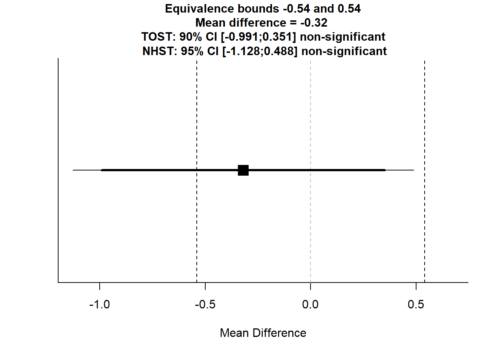

Researchers often manipulate something they are interested in, but need to make sure their manipulation does not introduce any confounds. In a study where researchers are manipulating fatigue by asking participants to carry heavy boxes around, the researchers want to ensure the manipulation does not inadvertently alter participants’ moods. The researchers assess positive and negative emotions using the PANAS. Let’s assume in one specific experiment, positive mood in the experimental fatigue condition (m1 = 4.55, sd1 = 1.05, n1 = 15) did not differ from the mood in the the control condition (m2 = 4.87, sd2 = 1.11, n2 = 15). The researchers conclude: “Mood did not differ between conditions, *t* = -0.81, *p* = .42”. Let’s assume we consider any effect less extreme than *d* = -0.5 or *d* = 0.5 too small to be meaningful (even though d = 0.5 is of course still quite a substantial difference).


```r
# Old TOSTER function
TOSTER::TOSTtwo(m1 = 4.55, m2 = 4.87, sd1 = 1.05, sd2 = 1.11, n1 = 15, n2 = 15, low_eqbound_d = -0.5, high_eqbound_d = 0.5)
```

```
## Note: this function is defunct. Please use tsum_TOST instead
```

```
## TOST results:
## t-value lower bound: 0.558 	p-value lower bound: 0.291
## t-value upper bound: -2.18 	p-value upper bound: 0.019
## degrees of freedom : 27.91
## 
## Equivalence bounds (Cohen's d):
## low eqbound: -0.5 
## high eqbound: 0.5
## 
## Equivalence bounds (raw scores):
## low eqbound: -0.5402 
## high eqbound: 0.5402
## 
## TOST confidence interval:
## lower bound 90% CI: -0.991
## upper bound 90% CI:  0.351
## 
## NHST confidence interval:
## lower bound 95% CI: -1.128
## upper bound 95% CI:  0.488
## 
## Equivalence Test Result:
## The equivalence test was non-significant, t(27.91) = 0.558, p = 0.291, given equivalence bounds of -0.540 and 0.540 (on a raw scale) and an alpha of 0.05.
```

```
## 
```

```
## 
## Null Hypothesis Test Result:
## The null hypothesis test was non-significant, t(27.91) = -0.811, p = 0.424, given an alpha of 0.05.
```

```
## 
```

```
## NHST: don't reject null significance hypothesis that the effect is equal to 0 
## TOST: don't reject null equivalence hypothesis
```



```r
# New TOSTER function
res <- TOSTER::tsum_TOST(m1 = 4.55, m2 = 4.87, sd1 = 1.05, sd2 = 1.11,
                  n1 = 15, n2 = 15, low_eqbound = -0.5, high_eqbound = 0.5,
                  eqbound_type = "SMD", bias_correction = TRUE)
```

```
## Warning: setting bound type to SMD produces biased results!
```

```r
plot(res)
```


