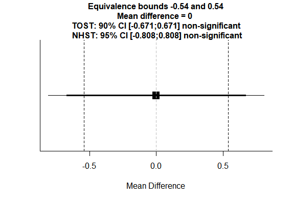

Equivalence Testing

*Most information in this exercise comes from “*[Equivalence Testing for
Psychological Research: A
Tutorial](https://www.google.nl/url?sa=t&rct=j&q=&esrc=s&source=web&cd=1&cad=rja&uact=8&ved=0ahUKEwjZvKWw9cLYAhUMEVAKHWUuBkYQFggvMAA&url=https%3A%2F%2Fosf.io%2Fqmgtn%2F%3Faction%3Ddownload&usg=AOvVaw0d0zoOK1xip3VF6eXUgMQI)*”
by Lakens, Scheel, and Isager, and my article “*[Equivalence Tests: A Practical
Primer for t Tests, Correlations, and
Meta-Analyses](https://www.ncbi.nlm.nih.gov/pmc/articles/PMC5502906/pdf/10.1177_1948550617697177.pdf)*”.
See these two articles for more examples and information on equivalence
testing.*

Scientists should be able to provide support for the null hypothesis. A
limitation of null-hypothesis significance testing is that the null-hypothesis
can be rejected, but not accepted. When you perform a statistical test, and the
outcome is a *p*-value larger than the alpha level (α), the only formally
correct conclusion is that the data are not surprising, assuming the null
hypothesis is true. It is not possible to conclude that there is *no* effect –
our test might simply have lacked the statistical power to detect it. So how can
you ever falsify a prediction? In this assignment, we will examine how to
provide support for the lack of a meaningful effect.

In Frequentist statistics, we can make a statement about the absence of a
meaningful effect using **equivalence testing**. Equivalence testing can be used
to test whether an observed effect is surprisingly small, assuming a meaningful
effect exists in the population. The test is a simple variation of widely used
null hypothesis significance tests (NHST). To understand the idea behind
equivalence tests, it is useful to realize the null hypothesis we test against
can be any numerical value. When we compare two groups, we often test whether we
can reject that the difference between these groups is zero. If you look at
Figure 1A on the next page, you can see a point null hypothesis at an effect
size of 0, and the two-sided alternative hypothesis of an effect that is
different from 0.

Sometimes we want to reject values other than zero. Imagine a researcher who is
interested in voluntary participation in a national program to train young
infants’ motor skills. The researcher wants to test whether more boys than girls
are brought into the program by their parents. Because the human sex ratio of
newborn boys to girls is not exactly 1:1, we should not expect 50% of
participants to be boys. On average, 103 boys are born for every 100 girls
(United States & Central Intelligence Agency, 2016), so approximately 50.74% of
applicants should be boys, and 49.26% should be girls. If boys and girls were
exactly equally likely to be brought into the program by their parents, we would
not expect a difference of zero, but 50.74% - 49.26% = 1.5% more boys. Rather
than testing against a null hypothesis of 0 difference, the researcher tests
against a null hypothesis of 0.015.

*Figure 1*: Illustration of null hypotheses (H0) and alternative hypotheses (H1)
for different types of significance tests. A) NHST: Tests if the hypothesis (H0)
that an effect is equal to 0 can be rejected. B) Minimal effects test: Tests if
the hypothesis (H0) that an effect is larger than ∆L and smaller than ∆U can be
rejected. C) Equivalence test: Tests if the hypothesis (H0) that an effect is
smaller than ∆L or larger than ∆U can be rejected. D) Inferiority test: Tests if
the hypothesis (H0) that an effect is larger than ∆ can be rejected.

Alternatively, the researcher could decide that even if the true ratio in the
population is not exactly 0.015, the null hypothesis should consist of a **range
of values** around the difference in proportions of 0.015 that can be considered
trivially small. The researcher could for example test if the difference is
smaller than -0.005, or larger than 0.035. This test against two bounds, with H0
being a range rather than one value (see Figure 1B), is known as a two-sided
**minimal effects test** (Murphy & Myors, 1999).

**Equivalence tests** can be seen as the opposite of minimal effects tests: They
examine whether the presence of effects that are large enough to be considered
meaningful can be rejected (see Figure 1C). An equivalence test consists of two
one-sided tests (and is therefore also called the **TOST** procedure). We test
whether the observed effect is statistically larger than the lower equivalence
bound (indicated by ΔL.in Figure 1) and statistically smaller than the upper
equivalence bound (indicated by ΔU.in Figure 1). In our example, the researcher
can perform an equivalence test to examine whether the gender difference in
participants is not as large or larger than the **smallest effect size of
interest** (**SESOI**). After an extensive discussion with experts, the
researcher decides that as long as the difference in proportions is not more
extreme than 6%, the gender difference is too small to care about. Given an
expected true difference in the population of 0.015, the researcher will test if
the observed difference falls outside the boundary values (or **equivalence
bounds**) of -0.045 and 0.075 by performing a one-sided test against -0.045 and
another one-sided test against 0.075. If differences more extreme than these
boundary values can be rejected in two one-sided tests (TOST), the researcher
will conclude statistical equivalence, the gender difference will be considered
trivially small, and no money will be spent on addressing a gender difference in
participation. Both one-sided tests need to be statistically significant to
conclude equivalence. It is custom to report only the one-sided test with the
largest *p*-value (because if this is significant, so is the other one-sided
test) when reporting an equivalence test.

Equivalence testing originates from the field of pharmacokinetics where
researchers might want to show that a new, cheaper, drug works just as well as
an existing drug. A very simple equivalence testing approach is the
‘two-one-sided t-tests’ (TOST) procedure (Schuirmann, 1987), which tests whether
the observed effect is larger than the lower equivalence bound, and smaller than
the upper equivalence bound.

In equivalence tests the null hypothesis is that there *is* a true effect more
extreme than a smallest effect size of interest (SESOI), as defined by the upper
and lower equivalence bounds (indicated by ΔU and ΔL.in Figure 1) That’s right –
the null-hypothesis is now that there *is* an effect, and we are going to try to
reject it (with a *p* \< 0.05). The alternative hypothesis is that the effect is
anywhere in the *equivalence range*. The equivalence range is a range of effect
sizes that are deemed equivalent to the absence of an effect that is worthwhile
to examine (e.g., ΔL = -0.3 to ΔU = 0.3, where Δ is a difference that can be
defined by either standardized differences such as δ, or raw differences such as
1 scale point or 50 milliseconds). If the *p*-value for both tests indicates the
observed data is surprising, assuming –ΔL or ΔU are true, we can follow a
Neyman-Pearson approach to statistical inferences and reject effect sizes more
extreme than the equivalence bounds.

If we have a clear directional hypothesis we might only be interested in whether
an observed effect is not larger than some effect we deem meaningful, which
means we can test for inferiority (see Figure 1D), where we test whether the
observed effect size is statistically lower than the SESOI (indicated by Δ). In
an **inferiority test** we only care about effects is surprisingly smaller than
one equivalence bound.

When null-hypothesis significance testing and equivalence tests are used, there
are four possible outcomes of a study. These four cases are illustrated in the
figure below (adapted from [Lakens,
2017](http://journals.sagepub.com/eprint/IW7EgmfBewJdICjP9YYX/full)). A mean
difference of Cohen’s d = 0.5 (either positive or negative) is specified as a
smallest effect size of interest in an independent *t*-test (see the vertical
dashed lines at -0.5 and 0.5). Data is collected, and one of four possible
outcomes is observed (squares are the observed effect size, thick lines the 90%
CI, and thin lines the 95% CI). A 90% confidence interval (1-2α) is used instead
of a 95% confidence interval (1-α) because two one-sided tests (each with an
alpha of 5%) are performed.

*Figure 2.* Four possible outcomes when combining NHST and equivalence tests.

We can conclude statistical equivalence if we find the pattern indicated by A:
The confidence interval overlaps with 0, but not with the smallest effect size
of interest. The *p*-value from the traditional NHST is not significant (*p* \>
0.05), and the *p*-value for the equivalence test is significant (*p* ≤ 0.05).
Thus, we conclude the effect is statistically equivalent: It does not differ
from 0, and it is too small to be considered meaningful. We can also conclude
the effect is significant, and that the possibility that the effect is large
enough to matter cannot be rejected, under pattern B, which means we can reject
the null, and the effect might be large enough to care about. Using equivalence
tests, we can also observe pattern C: An effect is statistically significant,
but also smaller than anything we care about. In other words, we can conclude
there is an effect, but it lacks **practical significance** – it is too small to
matter in practice. Finally, we can observe pattern D, where we cannot reject an
effect of 0, nor an effect that is large enough to care about. We thus remain
**undecided** – we need more data to draw a conclusion.

It is worth pointing out how equivalence tests prevent 2 common
misinterpretations of *p*-values. First, equivalence tests allow one to
distinguish between the **absence of a meaningful effect** after finding *p* \>
.05 in NHST, and **inconclusive** results (patterns A vs D), thus illustrating
why one can’t conclude there is no effect after observing *p* \> .05. Second,
equivalence test allows one to identify **statistically significant but
practically insignificant** results (pattern C) when both the NHST and
equivalence test yield *p* \< .05.

Testing for equivalence is just as simple as performing the normal statistical
tests you already use today. You don’t have to learn any new statistical theory.
Given how easy it is to use equivalence tests, and how much they improve your
statistical inferences, it is surprising how little they are used, but I’m
confident that will change in the future. The TOST procedure entails performing
two one-sided tests to examine whether the observed data is surprisingly larger
than a lower equivalence boundary (ΔL), or surprisingly smaller than an upper
equivalence boundary (ΔU):

|   | $$t_{L} = \frac{{\overline{M}}_{1} - {\overline{M}}_{2} - \Delta_{L}}{\sigma\sqrt{\frac{1}{n_{1}} + \frac{1}{n_{2}}}}$$ and $$t_{U} = \frac{{\overline{M}}_{1} - {\overline{M}}_{2}{- \Delta}_{U}}{\sigma\sqrt{\frac{1}{n_{1}} + \frac{1}{n_{2}}}}$$ | (1) |
|---|------------------------------------------------------------------------------------------------------------------------------------------------------------------------------------------------------------------------------------------------------|-----|

Where *M* indicates the means of each sample, *n* is the sample size, and σ is
the pooled standard deviation:

|   | σ= $$\sqrt{\frac{\left( n_{1} - 1 \right)\text{SD}_{1}^{2} + \left( n_{2} - 1 \right)\text{SD}_{2}^{2}}{n_{1} + \ n_{2} - 2}}$$ | (2) |
|---|---------------------------------------------------------------------------------------------------------------------------------|-----|

The formulas are highly similar to the normal formula for the *t*-statistic. The
difference between a NHST *t*-test and the TOST procedure is that the lower
equivalence boundary ΔL and the upper equivalence boundary ΔU are subtracted
from the mean difference between groups (in a normal t-test, we compare the mean
difference against 0, and thus the delta drops out of the formula because it is
0).

The TOST procedure for a *t*-test is identical to calculating a 90% CI around
the effect, and checking whether this 90% CI falls completely within the
equivalence range (see Figure 2 above).

In this assignment we will perform equivalence tests using the TOSTER package in
R - if you want to follow along below, you can install TOSTER in R using:
install.packages('TOSTER'). It works by entering summary statistics into a
function, and providing all the information you need to perform and report an
equivalence test. **You can also download a spreadsheet** to perform these
calculations: <https://osf.io/qzjaj/>

Let’s assume we performed a study where we have two independent groups, a
control and experimental condition, and we are interested in the average score
of participants on some validated questionnaire, measured using a 7-point scale.
We want to know if there is a difference between means. Before we collect the
data, we considered an effect size of d = 0.4 the smallest effect size of
interest, and therefore set the lower equivalence bound to d = -0.4 and the
upper equivalence bound to d = 0.4. After collecting the data, we have 130
participants in the control group and 134 participants in the experimental
group. The control group score was *M* = 4.2, *SD* = 1.1, and the experimental
group score was *M* = 4.3, *SD* = 1.2.

We now have all the information we need to perform an equivalence test. In R,
the function will look like:

TOSTtwo(m1 = 4.2, m2 = 4.3, sd1 = 1.1, sd2 = 1.2, n1 = 130, n2 = 134,
low_eqbound_d = -0.4, high_eqbound_d = 0.4)

TOSTtwo is the function name for the TOST procedure for two independent groups.
It needs as input the means (m1 and m2), the standard deviations (sd1 and sd2),
the sample sizes in each group (n1 and n2) and you need to specify the
equivalence bounds, which for the TOSTtwo function should be in standardized
scores (Cohen’s d – you can use the TOSTtwo.raw function to enter equivalence
bounds in unstandardized mean differences). Note that you need to consistently
fill in the information for one group at m1, sd1, and n1, and for the other
group as m2, sd2, n2. Also note that the lower equivalence bound is entered as a
negative value, because we are testing against d = -0.4.

When you run this single line of code, you will receive written output, and a
figure:

TOST results:

t-value lower bound: 2.55 p-value lower bound: 0.006

t-value upper bound: -3.96 p-value upper bound: 0.00005

degrees of freedom : 261.17

Equivalence bounds (Cohen's d):

low eqbound: -0.4

high eqbound: 0.4

Equivalence bounds (raw scores):

low eqbound: -0.4604

high eqbound: 0.4604

TOST confidence interval:

lower bound 90% CI: -0.334

upper bound 90% CI: 0.134

NHST confidence interval:

lower bound 95% CI: -0.379

upper bound 95% CI: 0.179

Equivalence Test Result:

The equivalence test was significant, t(261.17) = 2.545, p = 0.00575, given
equivalence bounds of -0.460 and 0.460 (on a raw scale) and an alpha of 0.05.

Null Hypothesis Test Result:

The null hypothesis test was non-significant, t(261.17) = -0.706, p = 0.481,
given an alpha of 0.05.

Based on the equivalence test and the null-hypothesis test combined, we can
conclude that the observed effect is statistically not different from zero and
statistically equivalent to zero.

Just like the default *t*-test in R, the TOSTtwo function will by default
calculate Welch’s *t*-test (instead of student’s *t*-test). This is actually the
recommended default (see [Delacre, Lakens, and Leys,
2017](https://www.rips-irsp.com/articles/10.5334/irsp.82/)), but you can request
Student’s *t*-test by adding var.equal=TRUE as an argument to the TOSTtwo
function.

The TOST results provide the two one-sided tests, one against the lower bound of
d = -0.4 which yields a *t*-value of 2.545 and a *p*-value of 0.00575, and the
test against the upper bound of d = 0.4 yields a *t*-value of -3.957536 and a
*p*-value of 0.00005. The output also provides a written summary (remember that
it is custom to only report the largest *p*-value) which after rounding reads:
Using alpha = 0.05 the equivalence test based on Welch's *t*-test was
significant, *t*(261.167) = 2.55, *p* = 0.006. Because the equivalence test is
significant, we can reject effects d \< -0.4 and d \> 0.4, and therefore reject
effects we found large enough to be meaningful when we designed the study.

TOST is performed against equivalence bounds that are considered the smallest
effect size of interest. The SESOI can sometimes be determined objectively, for
example based on just noticeable differences which are clear quantifiable
theoretical predictions. In lieu of objective justifications, the SESOI should
ideally be based on a cost-benefit analysis (for example, which effect sizes are
large enough to be worth studying). Since both costs and benefits are
necessarily subjective, the SESOI will vary across researchers, fields, and
time. The goal of setting a SESOI is to clearly justify why designing a study
that has a high probability of rejecting effects more extreme than the specified
equivalence bounds contributes to our knowledge base (see Lakens, 2017, Lakens,
Scheel, & Isager, 2018). A SESOI should be chosen such that inferences based on
it answer a meaningful question. In the study above, we can conclude equivalence
using bounds of d = -0.4 and d =0.4 – but someone else is free to consider an
effect size of d = 0.2 meaningful, and design a much larger study to examine
such a relatively small effect size.

The picture provided with the output provides the raw equivalence bounds (both
raw and standardized equivalence bounds are provided in the output as well)
which in this case translate to mean differences of -0.46 and 0.46. It is good
to always look at, and think about, the raw equivalence bounds. These should
make sense, even when you chose to use standardized equivalence bounds. We also
see the observed mean difference (in this case, -0.1), and the 90% confidence
interval (related to the TOST procedure) and the 95% confidence interval
(related to the NHST test).

**Q1)** When the 90% CI around an effect size falls within the equivalence
range, the observed effect is statistically smaller than the smallest effect
size of interest. Based on your knowledge about confidence intervals, and
looking at the picture above, when you lower the equivalence range from -0.4 –
0.4 to -0.3 – 0.3, what is needed for the equivalence test to be significant
(assuming the effect size estimate and standard deviation remains the same)?

A) A larger effect size.

B) A lower alpha level.

C) A larger sample size.

D) Lower statistical power.

To answer questions 2 through 9, open the EquivalenceTesting.R script. The
script will allow you to perform the TOST procedure for the questions below by
filling in the summary statistics. To help you along, I have already copied the
function and all arguments – you just need to fill in the correct values for
each function, and interpret the output.

**Q2)** Researchers often manipulate something they are interested in. To ensure
their manipulation does not inadvertently alter participants’ moods, they assess
positive and negative emotions using the PANAS. Let’s assume in one specific
experiment, positive mood in one condition (*M1* = 4.55, *SD1* = 1.05, *n1* =
15) did not differ from the mood in the other condition (*M2* = 4.87, *SD2* =
1.11, *n2* = 15). The researchers conclude: “*Mood did not differ between
conditions, t = 0.81, p =.42*”. Let’s assume we consider any effect larger than
*d*=-0.5 and smaller than *d* = 0.5 equivalent (even though *d* = 0.5 is
actually a medium effect size!). Use the R code for the independent *t*-test,
and fill in the 8 numbers (note: you need to fill in -0.5, not 0.5, as the lower
equivalence bound). Were the authors correct in concluding mood did not differ
between conditions, given the equivalence range of -0.5 to 0.5?

**Use 0.05 as the alpha level for all questions in this assignment.**

A) Yes

B) No

**Q3)** If we increase the sample size in the above example to 150 participants
in each condition, and assuming the means and standard deviations remain the
same, which conclusion would we draw?

A) Equivalent: The difference in mood is not statistically significant, and it
is statistically equivalent.

B) Undetermined: The difference in mood is not statistically significant, and it
is not statistically equivalent.

C) Not zero, and not meaningful: The difference in mood is statistically
significant, and it is statistically equivalent.

D) Not zero, and meaningful: The difference in mood is statistically
significant, and it is not statistically equivalent.

When should you consider an effect too small to be meaningful? This is clearly a
subjective choice, and what you consider meaningful can change over time.
Ideally, you can determine the equivalence range either based on practical
considerations or theoretical considerations. For example, if an advertisement
campaign increases sales, but not enough to earn back the cost of the
advertising campaign, you might decide that the advertising campaign has an
effect smaller than your smallest effect size of interest. Alternatively, you
might believe, based on available theories, that a delay in response selection
in a Stroop experiment where people respond verbally is larger than 20
milliseconds.

The choice for a smallest effect size of interest is also relevant when
performing a power analysis. Because it is often unclear which effect size you
can expect (after all, if you already knew the effect size, you would not need
to do the experiment!) researchers sometimes make sure they have sufficient
power for the smallest effect size they find interesting. Although it might be
difficult to decide upon a SESOI, you might find it much easier to decide upon a
maximum sample size you are willing to collect, and look at the effect size you
can reject in an equivalence test. This can be examined using power analyses.
Just as with a normal t-test, you can perform a power analysis for an
equivalence test, which is very useful when designing a study.

We used an equivalence range of *d*=-0.5 to *d* = 0.5 in question 2, even with a
sample size of 15 participants in each condition. One might wonder if that
sample size actually gave us sufficient statistical power to detect equivalence.
The TOSTER package also has functions for power analysis. The powerTOSTtwo
function can be used to calculate the required sample size, the observed power,
or the required equivalence bounds to achieve a desired power given a sample
size. If we run the function:

powerTOSTtwo(alpha = 0.05, N = 15, low_eqbound_d = -0.5, high_eqbound_d = 0.5)

we are calculating the power we have when we have 15 participants in each group
(N =15), bounds of -0.5 and 0.5, and we use an alpha of 0.05. The function
returns the following information:

The statistical power is 0 % for equivalence bounds of -0.5 and 0.5.

This might look like a mistake. How can we have 0 power? The answer becomes
obvious if we look at what would happen in the study described in question 2
when we would have observed exactly the same means in both groups, so a mean
difference of 0 (but the same sample sizes in each group, and the same standard
deviations). This hypothetical scenario is plotted in the figure below:

We see the 90% confidence interval is so wide (due to the small sample size and
given the standard deviations) that it will ALWAYS include either the lower or
the upper equivalence bound. The 90% confidence interval is simply so wide that
it will never fall within the equivalence bounds. Thus, there is 0 probability
that we can conclude equivalence. The sample size is simply too small. We can
see power analysis is very important in general, but especially when performing
equivalence tests.

**Q4)** We might wonder how wide our bounds would need to be, to have decent
power to conclude equivalence. Let’s aim for 90% power, and use an alpha of 0.01
for our test. The powerTOSTtwo function can be used to calculate how wide our
equivalence bounds would need to be, to have 90% power with 15 participants in
each condition and an alpha of 0.01 (this power analysis assumes the true effect
size is 0 – more advanced power analyses can be performed with PASS software).
Which equivalence bounds should a researcher use if they want 90% power with 15
participants and an alpha of 0.01? Round the answer to two digits after the
decimal.

A) d = -1.07 and d = 1.07

B) d = -1.20 and d = 1.20

C) d = -1.32 and d = 1.32

D) d = -1.45 and d = 1.45

You can see that with such a small sample, **we can only reject effect sizes
that are very large** (d \> 1). Is it interesting to perform a study where you
can only reject effects that are very large? It depends. Most effect sizes
studied in for example psychology, but also many other social sciences, are much
smaller. Asking ‘can we reject very large effects’ is therefore not very
interesting (unless a theory explicitly predicts only very large effects,
obviously!)

**Q5)** The most common use of power analysis is to determine the sample size
needed to design a study with high power to detect a significant effect. If we
want to have 90% power, use an alpha of 0.01, and use equivalence bounds of d =
-0.5 and d = 0.5, how many participants **in each group** or condition should we
collect? Use the code in the R file.

A) 87

B) 105

C) 127

D) 254

**Q6)** Change the equivalence range to -0.1 and 0.1. To be able to reject
effects outside such a very narrow equivalence range, you’ll need a large sample
size. With an alpha of 0.01, and a desired power of 0.9 (or 90%), how many
participants would you need in each group?

A) 2165

B) 2604

C) 3155

D) 6310

You can see it takes a very large sample size to have high power to reliably
reject very small effects. This should not be surprising – it also requires a
very large sample size to *detect* small effects!

**Q7)** You can do equivalence tests for all tests. The TOSTER package has
functions for t-tests, correlations, differences between proportions, and
meta-analyses. Let’s do an equivalence test for a meta-analysis. Hyde, Lindberg,
Linn, Ellis, and Williams (2008) report that effect sizes for gender differences
in mathematics tests across the 7 million students in the US represent trivial
differences, where a trivial difference is specified as an effect size smaller
then d = 0.1. The table with Cohen’s d and se is reproduced below:

| **Grades**  | **d + se**       |
|-------------|------------------|
| Grade 2     | 0.06 +/- 0.003   |
| Grade 3     | 0.04 +/- 0.002   |
| Grade 4     | \-0.01 +/- 0.002 |
| Grade 5     | \-0.01 +/- 0.002 |
| Grade 6     | \-0.01 +/- 0.002 |
| Grade 7     | \-0.02 +/- 0.002 |
| Grade 8     | \-0.02 +/- 0.002 |
| Grade 9     | \-0.01 +/- 0.003 |
| Grade 10    | 0.04 +/- 0.003   |
| Grade 11    | 0.06 +/- 0.003   |

For grade 2, when we perform an equivalence test with boundaries of d = -0.1 and
d = 0.1, using an alpha of 0.01, which conclusion can we draw? Use the TOSTER
function TOSTmeta, and enter the alpha, effect size (ES), standard error (se),
and equivalence bounds.

A) Equivalent: The difference in test scores is not statistically significant,
and it is statistically equivalent.

B) Undetermined: The difference in test scores is not statistically significant,
and it is not statistically equivalent.

C) Not zero, and not meaningful: The difference in test scores is statistically
significant, and it is statistically equivalent.

D) Not zero, and meaningful: The difference in test scores is statistically
significant, and it is not statistically equivalent.

**Q8)** Olson, Fazio, and Hermann (2007) reported correlations between implicit
and explicit measures of self-esteem, such as the IAT, Rosenberg’s self-esteem
scale, a feeling thermometer, and trait ratings. In Study 1 71 participants
completed the self-esteem measures. Because no equivalence bounds are mentioned,
we can see which equivalence bounds the researchers would have 50% power to
detect (the bounds a study has 50% power for, is related to the bounds that can
just be detected with p \< .05, see Lakens, Scheel, and Isager, 2018 or this
[blog
post](http://daniellakens.blogspot.nl/2017/05/how-power-analysis-implicitly-reveals.html)).
Use the powerTOSTr function (which is used for correlations, and when the
equivalence bounds are set based on *r*). Which boundaries do we have 50% power
for, with an alpha of 0.05, and 71 participants? Round the bounds to 2 digits
after the decimal.

A) r = -0.19 and r = 0.19

B) r = -0.21 and r = 0.21

C) r = -0.27 and r = 0.27

D) r = -0.32 and r = 0.32

**Q9)** The correlations observed by Olson et al (2007), Study 1, are presented
in the table below (significant correlations are flagged by an asterisk).

| Measure             | IAT | Rosenberg | Feeling thermometer | Trait ratings |
|---------------------|-----|-----------|---------------------|---------------|
| IAT                 | \-  | \-.12     | \-.09               | \-.06         |
| Rosenberg           |     | \-        | .62\*               | .09           |
| Feeling thermometer |     |           | \-                  | .29\*         |
| Trait ratings       |     |           |                     | \-            |

We can test each correlation for equivalence, for example the correlation
between the IAT and the Rosenberg self-esteem scale of -0.12, given 71
participants. When you test all 4 non-significant correlations (-0.12, -0.09,
-0.06, and 0.09) for equivalence, using an alpha of 0.05 and equivalence bounds
of *r* = -0.2 and *r* = 0.2, how many are statistically equivalent?

A) 0

B) 1

C) 2

D) 3

**Conclusion**

It is important to be able to provide support for the null-hypothesis, if you
want to be able to test theories that predict no effect, or when you want to be
able to falsify theory that predicts an effect. Allowing the possibility for
your prediction to be wrong is very important. According to Lakatos, even though
we rarely outright reject our hypotheses, we enter a degenerative research line
when our predictions do not work out. Finally, being able to conclude an effect
is too small to be worthwhile to examine enables us to improve our statistical
inferences.

You will always have to make assumptions about the alternative hypothesis,
either by specifying an equivalence region consisting of a range of effect sizes
you find meaningful, or by specifying a prior distribution. You can use either
Frequentist or Bayesian approaches to test absence of evidence (or even both!).
Don’t simply conclude that a *p* \> 0.05 means there is no effect – instead,
provide quantitative arguments for the conclusion that there is no effect, for
example by using equivalence tests.

**References**

Lakens, D. (2017). Equivalence Tests: A Practical Primer for t Tests,
Correlations, and Meta-Analyses. Social Psychological and Personality Science,
8(4), 355–362. https://doi.org/10.1177/1948550617697177

Lakens, D., Scheel, A. M., & Isager, P. M. (2018). Equivalence Testing for
Psychological Research: A Tutorial. Advances in Methods and Practices in
Psychological Science, 1(2), 259–269. https://doi.org/10.1177/2515245918770963

Murphy, K. R., & Myors, B. (1999). Testing the hypothesis that treatments have
negligible effects: Minimum-effect tests in the general linear model. Journal of
Applied Psychology, 84(2), 234–248.

Schuirmann, D. J. (1987). A comparison of the two one-sided tests procedure and
the power approach for assessing the equivalence of average bioavailability.
Journal of Pharmacokinetics and Biopharmaceutics, 15(6), 657–680.

© Daniel Lakens, 2019. This work is licensed under a [Creative Commons
Attribution-NonCommercial-ShareAlike 4.0
License](http://creativecommons.org/licenses/by-nc-sa/4.0/)
