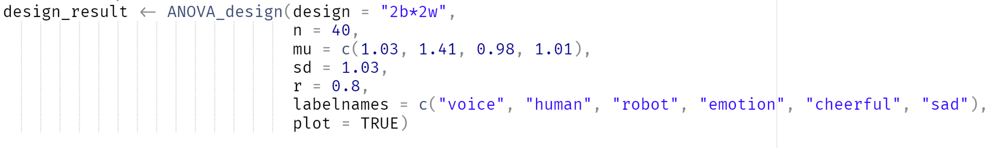
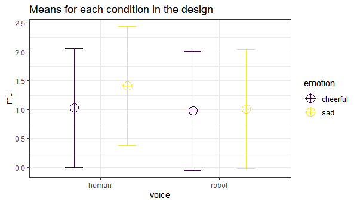
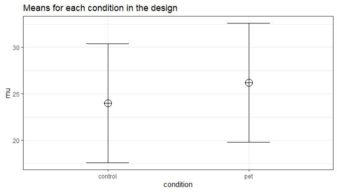
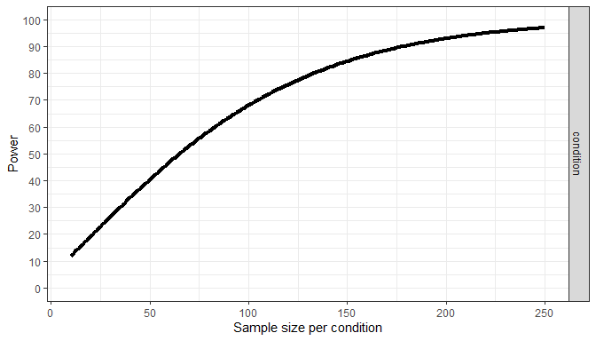

# Power Analysis for ANOVA Designs

Whereas power analysis for simple designs (e.g., a *t*-test or correlation) is
relatively straightforward, performing an a-priori power analysis for ANOVA
designs is more complex. Although the basic principles remain the same, to
understand how to design well-powered ANOVA designs it is important to realize
what impacts the effect size for an ANOVA. In my experience, it is often a good
idea to think about the data you expect to observe when performing a power
analysis (e.g., the means, standard deviations, and correlations between
variables), but this is especially true for power analysis for ANOVA designs.

Another issue with power analyses for ANOVA designs is that software that is
available is not that intuitive to use. Although G\*Power is excellent software,
it requires a lot of expertise to use, and is not that transparent about the
input it requires. Together with Aaron Caldwell I have created an R package and
Shiny App that lets you do simulation-based power analysis for ANOVA designs. We
will use this package to get a better understanding of power analysis, and power
analysis for ANOVA designs specifically. The basic approach is to first specify
the design, and then to simulate datasets from these specifications, perform the
planned statistical test on these datasets, and compute how many results are
statistically significant.

You will notice that one of the greatest challenges in simulation based power
analyses is coming up with values that you should expect. Despite this
difficulty, I believe it is far more informative to perform power analyses based
on means, standard deviations, and correlations, than just saying you will
expect a ‘medium’ effect size. Indeed, one of the main lessons in this
assignment should be that effect sizes in ANOVA designs are difficult to
predict, and specifying the pattern you expect is a better way to do power
analysis.

In completely novel lines of research where you have no good expectations, you
might want to start with **sequential analyses**, or first perform a pilot study
and estimate the standard deviation of your measure. Often, related studies have
been done and you can use values from these studies to estimate parameters in
the power analysis, perhaps being somewhat conservative. It is recommended to
use validated measures, and for such measures there will often be some
information available about standard deviations in similar populations.

You can use this Shiny app: <http://shiny.ieis.tue.nl/anova_power/> for most
parts of the assignment, and to perform power analyses in the future.

# Simulation-based power analysis

There are two ways to calculate the statistical power of an ANOVA design based
on simulations. The first is to **repeatedly simulate data** for each condition
based on the means, sample size, standard deviation, and correlation, under
specific statistical assumptions (i.e., normally distributed data). The
`ANOVA_power` function allows you to perform power analyses based on repeatedly
simulating normally distributed data. A second approach is to simulate a dataset
that has *exactly* the desired properties - every cell of the design has n
datapoints that have the desired mean and standard deviation, and correlation
between groups (for a within design). By performing an ANOVA on this dataset, we
can calculate the required statistics from the ANOVA result to calculate the
statistical power. The `ANOVA_exact` function allows you to calculate power
based on this approach. The `ANOVA_power` function is a bit more flexible (e.g.,
we can use different ways to correct for multiple comparisons, or in future
versions of the package allow you to simulate more realistic datasets that are
not normally distributed), but the `ANOVA_exact` function is much faster (and
takes seconds, instead of minutes or hours for a large number of simulations).

## An Example: 2 by 2 Mixed Design

Imagine you plan to perform a study in which participants interact with an
artificial voice assistant that sounds either like a human or like a robot, and
who sounds either cheerful or sad. In the example below, 1000 simulations for a
2\*2 mixed design (first factor, voice, is manipulated between participants, the
second factor, emotion, is manipulated within participants) are performed. The
sample size is 40 in each between subject condition (so 80 participants in
total), the assumed population standard deviation is 1.03, the correlation for
the within factors is 0.8, and the means are 1.03, 1.41, 0.98, 1.01. No
correction for multiple comparisons is applied. The alpha level used as a
significance threshold is set to 0.05 for this simulation.

A more detailed explanation of the functions in the Superpower package is
provided at the end of the document (and in the Superpower help files in R). As
a short summary, the **ANOVA_design** function requires specifying a design, the
sample size (n), the pattern of means (mu), the standard deviations (sd), the
correlation between dependent variables (r), and labelnames if you wish. The
simulation functions (**ANOVA_power** which is slow but more flexible, and
**ANOVA_exact** which is fast but cannot correct for multiple comparisons) then
simulate data based on these designs and compute power. As we see more R
packages and Shiny apps emerge that can perform simulation-based power analyses
for users, without requiring users to program the simulation themselves, it is
worth pointing out that **learning how these packages work will require time**.
The more complex the designs that power is calculated for, the more time is
needed to figure out how to enter the required input and perform the simulation.
Nevertheless, this should be a lot more efficient than programming all these
simulations from scratch yourself!

**Open the ANOVA_power_analysis.R script**, and **run the first 17 lines** to 1)
install Superpower from GitHub, and 2) install required R packages and load
them. **NOTE 1: You might get a pop-up that asks you “Would you like to use a
personal library instead?”** If so, click ‘YES’. If you run into issues,
remember you can complete most of this exercise using the online shiny app.

**NOTE 2: It makes sense to first update all packages by going to the ‘packages’
tab in RStudio (or in the menu go to Tools \> Check for package updates), and
clicking the ‘Update’ button. Updating all packages could take some time,
depending on how many packages you have installed, and how long ago you updated
them.**

**Run lines 21 to 27** to execute the ANOVA_design function and generate a plot
of the means. Do not yet perform the power analysis with the code on line 30 –
let’s first examine our intuitions about the effect sizes we should expect based
on the design we specified.

**Q1:** Look at the figure above. The means are 1.03, 1.41, 0.98, 1.01, and the
emotion variable is manipulated within, and the voice variable between. The
standard deviation for each condition is 1.08 and the correlation between
dependent variables 0.8. **We will check if you are correct later, and it is ok
if this is very difficult to get right – indeed, that is the main lesson!**
Which statement do you think is true?

A) The main effect of emotion is larger than the voice\*emotion interaction,
which is larger than the main effect of voice.

B) The main effect of voice is larger than the voice\*emotion interaction, which
is larger than the main effect of emotion.

C) The voice\*emotion interaction is larger than the main effect of voice, which
is larger than the main effect of emotion.

D) The voice\*emotion interaction is larger than the main effect of emotion,
which is larger than the main effect of voice.

**Run line 30** to perform the power analysis and check your answer to the
previous question. The result for the power simulation is printed and has two
sections (which can be suppressed by setting verbose = FALSE). The **first
table** provides power (from 0 to 100%) and effect sizes (partial eta-squared)
for the **ANOVA** result. We see the power for the main effects of factor voice
(17.43%), emotion (79.39%), and the voice\*emotion interaction (66.03%). Was
your intuition correct? It is very likely that is was very difficult to answer
the previous question. Hopefully simulating different ANOVA designs in this
assignment will boost your intuition!

~~~~~~~~~~~~~~~~~~~~~~~~~~~~~~~~~~~~~~~~~~~~~~~~~~~~~~~~~~~~~~~~~~~~~~~~~~~~~~~~
# Simulate data using ANOVA_exact function and print results
~~~~~~~~~~~~~~~~~~~~~~~~~~~~~~~~~~~~~~~~~~~~~~~~~~~~~~~~~~~~~~~~~~~~~~~~~~~~~~~~

~~~~~~~~~~~~~~~~~~~~~~~~~~~~~~~~~~~~~~~~~~~~~~~~~~~~~~~~~~~~~~~~~~~~~~~~~~~~~~~~
ANOVA_exact(design_result)
~~~~~~~~~~~~~~~~~~~~~~~~~~~~~~~~~~~~~~~~~~~~~~~~~~~~~~~~~~~~~~~~~~~~~~~~~~~~~~~~

~~~~~~~~~~~~~~~~~~~~~~~~~~~~~~~~~~~~~~~~~~~~~~~~~~~~~~~~~~~~~~~~~~~~~~~~~~~~~~~~

~~~~~~~~~~~~~~~~~~~~~~~~~~~~~~~~~~~~~~~~~~~~~~~~~~~~~~~~~~~~~~~~~~~~~~~~~~~~~~~~

~~~~~~~~~~~~~~~~~~~~~~~~~~~~~~~~~~~~~~~~~~~~~~~~~~~~~~~~~~~~~~~~~~~~~~~~~~~~~~~~
Power and Effect sizes for ANOVA tests
~~~~~~~~~~~~~~~~~~~~~~~~~~~~~~~~~~~~~~~~~~~~~~~~~~~~~~~~~~~~~~~~~~~~~~~~~~~~~~~~

~~~~~~~~~~~~~~~~~~~~~~~~~~~~~~~~~~~~~~~~~~~~~~~~~~~~~~~~~~~~~~~~~~~~~~~~~~~~~~~~
              power  partial_eta_squared    cohen_f        non_centrality
~~~~~~~~~~~~~~~~~~~~~~~~~~~~~~~~~~~~~~~~~~~~~~~~~~~~~~~~~~~~~~~~~~~~~~~~~~~~~~~~

~~~~~~~~~~~~~~~~~~~~~~~~~~~~~~~~~~~~~~~~~~~~~~~~~~~~~~~~~~~~~~~~~~~~~~~~~~~~~~~~
voice         17.43               0.0134    0.1166         1.0604
~~~~~~~~~~~~~~~~~~~~~~~~~~~~~~~~~~~~~~~~~~~~~~~~~~~~~~~~~~~~~~~~~~~~~~~~~~~~~~~~

~~~~~~~~~~~~~~~~~~~~~~~~~~~~~~~~~~~~~~~~~~~~~~~~~~~~~~~~~~~~~~~~~~~~~~~~~~~~~~~~
emotion       79.39               0.0922    0.3187         7.9225
~~~~~~~~~~~~~~~~~~~~~~~~~~~~~~~~~~~~~~~~~~~~~~~~~~~~~~~~~~~~~~~~~~~~~~~~~~~~~~~~

~~~~~~~~~~~~~~~~~~~~~~~~~~~~~~~~~~~~~~~~~~~~~~~~~~~~~~~~~~~~~~~~~~~~~~~~~~~~~~~~
voice:emotion 66.03               0.0689    0.2721         5.7734
~~~~~~~~~~~~~~~~~~~~~~~~~~~~~~~~~~~~~~~~~~~~~~~~~~~~~~~~~~~~~~~~~~~~~~~~~~~~~~~~

~~~~~~~~~~~~~~~~~~~~~~~~~~~~~~~~~~~~~~~~~~~~~~~~~~~~~~~~~~~~~~~~~~~~~~~~~~~~~~~~

~~~~~~~~~~~~~~~~~~~~~~~~~~~~~~~~~~~~~~~~~~~~~~~~~~~~~~~~~~~~~~~~~~~~~~~~~~~~~~~~

~~~~~~~~~~~~~~~~~~~~~~~~~~~~~~~~~~~~~~~~~~~~~~~~~~~~~~~~~~~~~~~~~~~~~~~~~~~~~~~~
Power and Effect sizes for contrasts
~~~~~~~~~~~~~~~~~~~~~~~~~~~~~~~~~~~~~~~~~~~~~~~~~~~~~~~~~~~~~~~~~~~~~~~~~~~~~~~~

~~~~~~~~~~~~~~~~~~~~~~~~~~~~~~~~~~~~~~~~~~~~~~~~~~~~~~~~~~~~~~~~~~~~~~~~~~~~~~~~
                                                            power effect_size
~~~~~~~~~~~~~~~~~~~~~~~~~~~~~~~~~~~~~~~~~~~~~~~~~~~~~~~~~~~~~~~~~~~~~~~~~~~~~~~~

~~~~~~~~~~~~~~~~~~~~~~~~~~~~~~~~~~~~~~~~~~~~~~~~~~~~~~~~~~~~~~~~~~~~~~~~~~~~~~~~
p_voice_human_emotion_cheerful_voice_human_emotion_sad      94.92      0.5833
~~~~~~~~~~~~~~~~~~~~~~~~~~~~~~~~~~~~~~~~~~~~~~~~~~~~~~~~~~~~~~~~~~~~~~~~~~~~~~~~

~~~~~~~~~~~~~~~~~~~~~~~~~~~~~~~~~~~~~~~~~~~~~~~~~~~~~~~~~~~~~~~~~~~~~~~~~~~~~~~~
p_voice_human_emotion_cheerful_voice_robot_emotion_cheerful  5.53     -0.0485
~~~~~~~~~~~~~~~~~~~~~~~~~~~~~~~~~~~~~~~~~~~~~~~~~~~~~~~~~~~~~~~~~~~~~~~~~~~~~~~~

~~~~~~~~~~~~~~~~~~~~~~~~~~~~~~~~~~~~~~~~~~~~~~~~~~~~~~~~~~~~~~~~~~~~~~~~~~~~~~~~
p_voice_human_emotion_cheerful_voice_robot_emotion_sad       5.08     -0.0194
~~~~~~~~~~~~~~~~~~~~~~~~~~~~~~~~~~~~~~~~~~~~~~~~~~~~~~~~~~~~~~~~~~~~~~~~~~~~~~~~

~~~~~~~~~~~~~~~~~~~~~~~~~~~~~~~~~~~~~~~~~~~~~~~~~~~~~~~~~~~~~~~~~~~~~~~~~~~~~~~~
p_voice_human_emotion_sad_voice_robot_emotion_cheerful      45.39     -0.4175
~~~~~~~~~~~~~~~~~~~~~~~~~~~~~~~~~~~~~~~~~~~~~~~~~~~~~~~~~~~~~~~~~~~~~~~~~~~~~~~~

~~~~~~~~~~~~~~~~~~~~~~~~~~~~~~~~~~~~~~~~~~~~~~~~~~~~~~~~~~~~~~~~~~~~~~~~~~~~~~~~
p_voice_human_emotion_sad_voice_robot_emotion_sad           40.35     -0.3883
~~~~~~~~~~~~~~~~~~~~~~~~~~~~~~~~~~~~~~~~~~~~~~~~~~~~~~~~~~~~~~~~~~~~~~~~~~~~~~~~

~~~~~~~~~~~~~~~~~~~~~~~~~~~~~~~~~~~~~~~~~~~~~~~~~~~~~~~~~~~~~~~~~~~~~~~~~~~~~~~~
p_voice_robot_emotion_cheerful_voice_robot_emotion_sad       5.93      0.0461
~~~~~~~~~~~~~~~~~~~~~~~~~~~~~~~~~~~~~~~~~~~~~~~~~~~~~~~~~~~~~~~~~~~~~~~~~~~~~~~~

The result for the power simulation reveals power is highest for the main effect
of emotion, which is the within-subjects factor, and for which the means are
highly correlated (0.8). Power is higher for strongly positively correlated (*r*
\> 0.5) within comparisons than uncorrelated between participants variables.
Power is lower for the interaction, and very low for the between participant
main effect of voice.

An ANOVA is typically followed up with simple comparisons. A statistical
hypothesis often predicts not just an interaction, but also **the shape of an
interaction**. For example, when looking at the plot of our design above, we
might be specifically interested in comparing the independent effect for the
cheerful vs. sad human voice assistant, and the difference between sad robot and
sad human voice assistants. The **second table** *(Power and Effect sizes for
contrasts)* provides the power for *t*-tests for all comparisons (94.92%, 5.53%,
5.08%, 45.39%, 40.35%, and 5.93%), and the effect sizes (Cohen’s d for
between-subject contrasts, and Cohen’s $$d_{z}$$ for within-subject contrasts,
see [Lakens,
2013](https://www.frontiersin.org/articles/10.3389/fpsyg.2013.00863/full)).
Power is relatively high for the within-participant comparison for human sad and
human cheerful voices (94.92%). Even though the mean difference is almost the
same as for the comparison between a sad-human voice assistant and a sad-robot
voice assistant, since this latter comparison is a between-participants
comparison, power is much lower (40.35%).

One take-home message is that **it is a good idea to manipulate variables within
participants whenever possible**.

## Power in a Two Group One-Way ANOVA

Imagine we aim to design a study to test the hypothesis that giving people a pet
will increase their life satisfaction. We have an **experimental condition**
where people who have no pet get one, and a **control condition** where people
who have no pet do not get one, and randomly assign participants to either
condition. We expect pets to increase life-satisfaction compared to the control
condition. Based on work by Pavot and Diener (1993) we believe that we can
expect responses on the life-satisfaction scale to have a mean of approximately
24 in our population, with a standard deviation of 6.4. We expect having a pet
increases life satisfaction by approximately 2.2 scale points for participants
who get a pet (so a mean score of 26.2). We plan to collect data from 200
participants in total, with 100 participants in each condition. We examine the
statistical power our design would have to detect the differences we predict.
**Run lines 34 to 41**.

~~~~~~~~~~~~~~~~~~~~~~~~~~~~~~~~~~~~~~~~~~~~~~~~~~~~~~~~~~~~~~~~~~~~~~~~~~~~~~~~
design_result <- ANOVA_design(design = "2b",
                   n = 100, 
                   mu = c(24, 26.2), 
                   sd = 6.4, 
                   labelnames = c("condition", "control", "pet"),
                   plot = TRUE)
ANOVA_exact(design_result, alpha_level = 0.05)
plot_power(design_result, min_n = 10, max_n = 250, plot = TRUE)
~~~~~~~~~~~~~~~~~~~~~~~~~~~~~~~~~~~~~~~~~~~~~~~~~~~~~~~~~~~~~~~~~~~~~~~~~~~~~~~~

Power and Effect sizes for ANOVA tests

power partial_eta_squared cohen_f non_centrality

condition 67.69 0.029 0.1727 5.9082

Power and Effect sizes for contrasts

Power effect_size

p_condition_control_condition_pet 67.69 0.3437

The result of the simulation shows that we have exactly the same power for the
ANOVA, as we have for the *t*-test for the simple comparison (67.69%). This
**must be so**, because when there are only two groups, these tests are
mathematically identical. In a study with 100 participants per condition, based
on the parameters we have specified, we would have quite low power. For our
example, Cohen’s d (the standardized mean difference) is 2.2/6.4, or d = 0.3437
for the difference between the control condition and having pets. We see this
power value in the section reporting the results for contrasts. The effect size
for the ANOVA is a Cohen’s f of 0.1727, which is exactly half as large as
Cohen’s d in a two-group between participant design. We can use this effect size
to compute the expected power for the simple comparison using the pwr package.

~~~~~~~~~~~~~~~~~~~~~~~~~~~~~~~~~~~~~~~~~~~~~~~~~~~~~~~~~~~~~~~~~~~~~~~~~~~~~~~~
library(pwr)
pwr.t.test(d = 2.2/6.4,
           n = 100,
           sig.level = 0.05,
           type="two.sample",
           alternative="two.sided")$power
~~~~~~~~~~~~~~~~~~~~~~~~~~~~~~~~~~~~~~~~~~~~~~~~~~~~~~~~~~~~~~~~~~~~~~~~~~~~~~~~

~~~~~~~~~~~~~~~~~~~~~~~~~~~~~~~~~~~~~~~~~~~~~~~~~~~~~~~~~~~~~~~~~~~~~~~~~~~~~~~~
## [1] 0.6768572
~~~~~~~~~~~~~~~~~~~~~~~~~~~~~~~~~~~~~~~~~~~~~~~~~~~~~~~~~~~~~~~~~~~~~~~~~~~~~~~~

The results match our simulation. We can also use the pwr.anova.test function,
which yields the same result as the power.t.test.

~~~~~~~~~~~~~~~~~~~~~~~~~~~~~~~~~~~~~~~~~~~~~~~~~~~~~~~~~~~~~~~~~~~~~~~~~~~~~~~~
pwr.anova.test(n = 100,
               k = 2,
               f = 0.171875,
               sig.level = 0.05)$power
~~~~~~~~~~~~~~~~~~~~~~~~~~~~~~~~~~~~~~~~~~~~~~~~~~~~~~~~~~~~~~~~~~~~~~~~~~~~~~~~

~~~~~~~~~~~~~~~~~~~~~~~~~~~~~~~~~~~~~~~~~~~~~~~~~~~~~~~~~~~~~~~~~~~~~~~~~~~~~~~~
## [1] 0.6768572
~~~~~~~~~~~~~~~~~~~~~~~~~~~~~~~~~~~~~~~~~~~~~~~~~~~~~~~~~~~~~~~~~~~~~~~~~~~~~~~~

This analysis tells us that running the study with 100 participants in each
condition is quite likely to *not* yield a significant test result, even if our
expected pattern of differences is true (because the Type 2 error rate is
32.31%). This is clearly not optimal. If we perform a study, we would prefer the
statistical power to be higher.

**Q2**: How many participants do we need for our design to have 90% power
(rounded to the nearest digit)? Increase the number of participants in the
ANOVA_design code until, based on the specified design, 90% power is reached.

A: 166 participants per condition.

B: 173 participants per condition.

C: 179 participants per condition.

D: 187 participants per condition.

## The plot_power function

Simulation based power analyses require you to increase the sample size until
power is high enough to reach your desired Type 2 error rate. To facilitate this
trial and error process you can use the `plot_power` function to plot the power
across a range of sample sizes to produce a power curve.

The `plot_power` function simulates power for the specified ANOVA design up to a
sample size of `max_n` using the `ANOVA_exact` function. Although it is
relatively fast, with large sample size it can take some time to produce. **Run
the code on line 44 to create the plot.** In the figure below we can easily see
that, assuming the true pattern of means and standard deviations represents our
expected pattern of means and standard deviations, we have 80% power around 135
participants per condition, 90% power around 180 participants per condition, and
95% power around 225 participants per condition.

~~~~~~~~~~~~~~~~~~~~~~~~~~~~~~~~~~~~~~~~~~~~~~~~~~~~~~~~~~~~~~~~~~~~~~~~~~~~~~~~
plot_power(design_result, min_n = 10, max_n = 250, plot = TRUE)
~~~~~~~~~~~~~~~~~~~~~~~~~~~~~~~~~~~~~~~~~~~~~~~~~~~~~~~~~~~~~~~~~~~~~~~~~~~~~~~~

Because the true pattern of means is always unknown, it is sensible to examine
the power across a range of scenarios. For example, if the difference in means
is somewhat smaller, because the means are 24 and 26 instead of 24 and 26.2, we
can compare the power curve above with the power curve for a slightly less
optimistic scenario (where the true effect size is slightly smaller). **Adjust
the mu (means) from 24, 26.2 to 24, 26**. Run the code.

~~~~~~~~~~~~~~~~~~~~~~~~~~~~~~~~~~~~~~~~~~~~~~~~~~~~~~~~~~~~~~~~~~~~~~~~~~~~~~~~
design_result <- ANOVA_design(design = "2b",
                   n = 100, 
                   mu = c(24, 26), 
                   sd = 6.4, 
                   labelnames = c("condition", "control", "pet"),
                   plot = TRUE)
ANOVA_exact(design_result, alpha_level = 0.05)
plot_power(design_result, max_n = 250, plot = TRUE)
~~~~~~~~~~~~~~~~~~~~~~~~~~~~~~~~~~~~~~~~~~~~~~~~~~~~~~~~~~~~~~~~~~~~~~~~~~~~~~~~

**Q3**: If the expected mean difference is 2 instead of 2.2, and looking at the
power plot generated by the code, at which sample size per condition do we
achieve 90% power?

A: around approximately n = 150.

B: around approximately n = 190.

C: around approximately n = 220.

D: around approximately n = 250.

It could be that in addition to a slightly smaller effect size, the standard
deviation is slightly larger than we expected as well. This will reduce the
power even further, and is thus an even less optimistic scenario. Let’s assume
the true standard deviation is 6.8 instead of 6.4, in addition to the smaller
mean difference examined in question 3 above. Run the code:

~~~~~~~~~~~~~~~~~~~~~~~~~~~~~~~~~~~~~~~~~~~~~~~~~~~~~~~~~~~~~~~~~~~~~~~~~~~~~~~~
design_result <- ANOVA_design(design = "2b",
                   n = 180, 
                   mu = c(24, 26), 
                   sd = 6.8, 
                   labelnames = c("condition", "control", "pet"),
                   plot = TRUE)
ANOVA_exact(design_result, alpha_level = 0.05)
plot_power(design_result, min_n = 10, max_n = 250, plot = TRUE)
~~~~~~~~~~~~~~~~~~~~~~~~~~~~~~~~~~~~~~~~~~~~~~~~~~~~~~~~~~~~~~~~~~~~~~~~~~~~~~~~

**Q4**: If the expected mean difference is 2 and in addition the standard
deviation is 6.8 instead of 6.4, and looking at the power plot generated by the
code, at which sample size per condition do we achieve 90% power?

A: around approximately n = 190

B: around approximately n = 220.

C: around approximately n = 245.

D: the graph does not reach 90% power with n = 250, so \> 250 per group.

As these different plots make clear, your study never really has a **known**
statistical power. Because the true effect size (i.e., the pattern of means and
standard deviations) is unknown, the true power of your study is unknown. A
study has 90% power *assuming a specific effect size*, but if the effect size is
different than what you expected, the true power can be either higher or lower.
We should therefore always talk about the ‘expected’ power when we do an
a-priori power analysis, and provide a good justification for our expectations
(i.e., for the expected pattern of means, standard deviations, and
correlations). Performing **sensitivity analyses** (like the plots above) is
recommended.

## Three between subject conditions

Let’s move from two conditions to three conditions – since an ANOVA was
developed as an extension of a *t*-test to situations when there are more than
two groups. Imagine we aim to design a study to test the hypothesis that giving
people a pet to take care of will increase their life satisfaction. We have a
control condition, a ‘cat’ pet condition, and a ‘dog’ pet condition. We can
simulate a One-Way ANOVA with a specified alpha level, sample size, and effect
size, and see the statistical power we would have for the ANOVA and the
follow-up comparisons. We expect all pets to increase life-satisfaction compared
to the control condition. Obviously, we also expect the people who are in the
‘dog’ pet condition to have even greater life-satisfaction than people in the
‘cat’ pet condition. Based on work by Pavot and Diener (1993) we again assume
that we can expect responses on the life-satisfaction scale to have a mean of
approximately 24 in our population, with a standard deviation of 6.4. We expect
having a pet increases life satisfaction with approximately 2.2 scale points for
participants who get a cat, and 2.6 scale points for participants who get a
[dog](https://www.instagram.com/yoshimitsu_the_dachshund/). We initially
consider collecting data from 150 participants in total, with 50 participants in
each condition. But before we proceed with the data collection, we examine the
statistical power our design would have to detect the differences we predict.
You can use the code in the assignment to look at this new problem. Run all the
code that is part of **\# Question 5 and 6**.

~~~~~~~~~~~~~~~~~~~~~~~~~~~~~~~~~~~~~~~~~~~~~~~~~~~~~~~~~~~~~~~~~~~~~~~~~~~~~~~~
design_result <- ANOVA_design(design = "3b",
                   n = 180, 
                   mu = c(24, 26.2, 26.6), 
                   sd = 6.4, 
                   labelnames = c("condition", "control", "cat", "dog"),
                   plot = TRUE)
ANOVA_exact(design_result, alpha_level = 0.05)
plot_power(design_result, min_n = 10, max_n = 250, plot = TRUE)
~~~~~~~~~~~~~~~~~~~~~~~~~~~~~~~~~~~~~~~~~~~~~~~~~~~~~~~~~~~~~~~~~~~~~~~~~~~~~~~~

~~~~~~~~~~~~~~~~~~~~~~~~~~~~~~~~~~~~~~~~~~~~~~~~~~~~~~~~~~~~~~~~~~~~~~~~~~~~~~~~
ANOVA_exact(design_result)
~~~~~~~~~~~~~~~~~~~~~~~~~~~~~~~~~~~~~~~~~~~~~~~~~~~~~~~~~~~~~~~~~~~~~~~~~~~~~~~~

~~~~~~~~~~~~~~~~~~~~~~~~~~~~~~~~~~~~~~~~~~~~~~~~~~~~~~~~~~~~~~~~~~~~~~~~~~~~~~~~
## Power and Effect sizes for ANOVA tests
##           power partial_eta_squared cohen_f non_centrality
## condition 47.69              0.0315  0.1804         4.7852
## 
## Power and Effect sizes for contrasts
##                                   power effect_size
## p_condition_control_condition_cat 39.83      0.3437
## p_condition_control_condition_dog 52.05      0.4063
## p_condition_cat_condition_dog      6.10      0.0625
~~~~~~~~~~~~~~~~~~~~~~~~~~~~~~~~~~~~~~~~~~~~~~~~~~~~~~~~~~~~~~~~~~~~~~~~~~~~~~~~

The result shows that you would have quite low power with 50 participants, both
for the overall ANOVA (47.69%), as for the follow up comparisons (approximately
40% power for the control vs cat condition, just above 50% for the control vs
dogs condition), and a really low power (around 6%, just above the Type 1 error
rate of 5%) for the expected difference between cats and dogs. For our example,
Cohen’s d (the standardized mean difference, or the mean difference divided by
the standard deviation) is 2.2/6.4, or d = 0.34375 for the difference between
the control condition and cats, 2.6/6.4 of d = 0.40625 for the difference
between the control condition and dogs, and 0.4/6.4 or d = 0.0625 for the
difference between cats and dogs as pets. Especially this last effect size is
incredibly small, and would require a very large sample size to detect.

It is clear we would need to collect more participants in each group to increase
our power. Let’s plot a power curve across a range of sample sizes to see how
much we need to increase the sample size to have sufficient power for the ANOVA.

~~~~~~~~~~~~~~~~~~~~~~~~~~~~~~~~~~~~~~~~~~~~~~~~~~~~~~~~~~~~~~~~~~~~~~~~~~~~~~~~
plot_power(design_result, min_n = 10, max_n = 250, plot = TRUE)
~~~~~~~~~~~~~~~~~~~~~~~~~~~~~~~~~~~~~~~~~~~~~~~~~~~~~~~~~~~~~~~~~~~~~~~~~~~~~~~~

**Q5**: For the specified design above, and looking at the power plot generated
by the code, at which sample size per condition do we achieve 90% power?

A: around approximately n = 120.

B: around approximately n = 135.

C: around approximately n = 175.

D: around approximately n = 200.

We should also check the power for the comparison of the control condition and
the cat condition.

**Q6**: Enter the correct answer for question 5 as the sample size (replacing
the n = 50 in line 49 – so we are simulating power for a study with a different
sample size per group). What statement is true if we use an alpha level of 0.05
for each of the three simple comparisons?

A) We have more than 80% power for all three comparisons.

B) We have more than 80% power when comparing the dog condition against the
control condition but for the other two simple comparisons, power is too low.

C) We have more than 80% power when comparing the dog condition against the
control condition and when comparing the cat condition against the control
condition, but for comparison between dogs and cats power is too low.

D) We have less than 80% power for all three comparisons.

Note that if you want to correct for three multiple comparisons, the code below
(which is based on a slower simulation, but allows you to correct for multiple
comparisons using the holm procedure) will show power is even lower after
adjusting the alpha level for multiple comparisons.

~~~~~~~~~~~~~~~~~~~~~~~~~~~~~~~~~~~~~~~~~~~~~~~~~~~~~~~~~~~~~~~~~~~~~~~~~~~~~~~~
ANOVA_power(design_result,
            alpha = 0.05, 
            nsims = 1000, 
            p_adjust = "holm"))
~~~~~~~~~~~~~~~~~~~~~~~~~~~~~~~~~~~~~~~~~~~~~~~~~~~~~~~~~~~~~~~~~~~~~~~~~~~~~~~~

Power for the ANOVA might be 90%, but power for the simple comparison can be
much lower. In case you are interested: We would need 5380 participants to have
90% power for the comparison between people who received a dog versus a cat as a
pet! This is possible if you can easily collect data, but might make this
specific question impossible to reliably answer if data collection is costly.
Realizing you can’t reliably study a question is an important aspect of a-priori
power analysis.

**Q7**: What is the relation between the power for the main effect in a One-Way
ANOVA, and the power for planned comparisons between all possible combinations
of the 2 groups?

A: The effect size for the planned contrasts is at least half as big as the
effect size for the main effects of the ANOVA.

B: The effect size for the ANOVA is at least half as big as the effect size for
the planned contrasts.

C: The effect size for the planned contrasts is always smaller than the effect
size for any of the effects in an ANOVA when there are more than 2 groups.

D: The effect size for the ANOVA can be either larger, the same, or smaller than
the effect size of any of the planned contrasts.

## Power in Repeated Measures ANOVA

In a repeated measures design, multiple observations are collected from the
**same participants**. In the simplest case, where there are two repeated
observations, a repeated measures ANOVA equals a dependent or paired *t*-test.

### Two within conditions

To illustrate the effect of correlated observations, we start by simulating data
for a medium effect size for a dependent (or paired, or within-subject)
*t*-test. Let’s first look at G\*power. If we want to perform an a-priori power
analysis, we are asked to fill in the effect size $$d_{z}$$. As Cohen (1988)
writes, “The Z subscript is used to emphasize the fact that our raw score unit
is no longer X or Y, but Z”, where Z are the difference scores of X-Y. You can
see the dz in G\*power when selecting the option to calculate power for a
dependent *t*-test:

Within designs can have greater power to detect differences than between designs
because **the repeated observations are correlated**, and a within design
requires less participants because **each participant provides multiple
observations**. One difference between an independent *t*-test and a dependent
*t*-test is that an independent *t*-test has 2(n-1) degrees of freedom (where n
is the sample size per group), while a dependent *t*-test has (n-1) degrees of
freedom. The total sample size needed in a two-group within-design (NW) relative
to the sample needed in two-group between-designs (NB), assuming normal
distributions, and ignoring the difference in degrees of freedom between the two
types of tests, is (from Maxwell & Delaney, 2004, p. 561, formula 45):

$$
N_{W} = \frac{N_{B}(1 - \rho)}{2}
$$

The division by 2 in the equation is due to the fact that in a two-condition
within design every participant provides two data-points. The extent to which
this reduces the sample size compared to a between-subject design depends on the
correlation ($$\rho$$) between the two dependent variables, as indicated by the
1-$$\text{\ ρ}$$ part of the equation. If the correlation is 0, a within-subject
design needs half as many participants as a between-subject design (e.g., 64
instead of 128 participants), simply because every participant provides 2
datapoints. **The higher the correlation, the larger the relative benefit of
within designs**, and whenever the correlation is negative (up to -1) the
relative benefit disappears. **A positive correlation reduces the standard
deviation of the difference scores**, which increases the standardized mean
difference, and thus increases power, compared to a between participant design,
but **a negative correlation increases the standard deviation of the difference
scores** compared to a between design, lowering the standardized effect size,
and reducing the power. For a longer explanation, see [my
blog](http://daniellakens.blogspot.com/2016/11/why-within-subject-designs-require-less.html).

Whereas in an independent *t*-test pairs of observations are uncorrelated, in a
within design pairs of observations are correlated. This has an effect on the
standard deviation of the difference scores. In turn, because the standardized
effect size is the mean difference divided by the standard deviation of the
difference scores, the correlation has an effect on the standardized mean
difference in a within design, Cohen’s $$d_{z}$$. The relation, as Cohen (1988,
formula 2.3.7) explains, is:

$$
\sigma_{z} = \sigma\sqrt{2(1 - \rho)}
$$

Therefore, the relation between dz and d is $$\sqrt{2(1 - \rho)}$$. As Cohen
(1988) writes: "In other words, a given difference between population means for
matched (dependent) samples is standardized by a value which is $$\sqrt{2(1 -
\rho)}$$ as large as would be the case were they independent. If we enter a
correlation of 0.5 in the formula, we get $$\sqrt{2(0.5)} = 1$$. When the
correlation is 0.5, d = $$d_{z}$$. When there is a strong correlation between
dependent variables, for example r = 0.9, we get $$d = d_{z}\sqrt{2(1 - 0.9)}$$,
and a $$d_{z}$$ of 1 would be a d = 0.45. Reversely, $$d_{z} =
\frac{d}{\sqrt{2(1 - r)}}$$, so with a r = 0.9, a d of 1 would be a $$d_{z}$$ =
2.24. Some consider this increase in $$d_{z}$$ compared to d when observations
are strongly correlated an ‘inflation’ when estimating effect sizes, but since
the reduction in the standard deviation of the difference scores due to the
correlation makes it easier to distinguish signal from noise in a hypothesis
test, it leads to a clear power benefit.

**Q8**: Although we often say that within designs have more power than between
designs, and practically speaking this is often true in psychology, it is not
necessarily true. For which values of the correlation will the power in a within
subject design actually decrease compared to a between subject design?

A: Only when the correlation between dependent variables is -1.

B: Only when the correlation between dependent variables is smaller than -0.5.

C: Only when the correlation between dependent variables is smaller than 0.0.

D: When the correlation between dependent variables is smaller than 0.5.

There is no equivalent $$f_{z}$$ for Cohen’s f for a within subject ANOVA with
more than 2 groups, but **the correlation between dependent variables always
factors into a power analysis, both for a dependent t-test, and for a repeated
measures ANOVA**.

**Run lines 63 to 71.** We perform a power analysis for a design with 2 groups,
with 34 participants, a correlation among repeated measures of 0.5, and an alpha
of 0.05. In this case, let’s assume we simulate responses when instructing
people to make a decision quickly or more slowly. We simulate data with means
-0.25 and 0.25, and set the sd to 1. This means we have a mean difference of
0.5, and a Cohen’s d of 0.5/1 = 0.5. For 2 groups we can calculate Cohen’s f as
d/2, so f = 0.25. We also calculate partial eta-squared for the ANOVA, which
equals $$\frac{f^{2}}{f^{2} + 1}$$, or $$\frac{0.0625}{0.0625\  + 1}$$, or
0.05882353. Note that these calculations ignore the correlation between
dependent variables – and in the output below, we will see a calculated Cohen’s
f and partial eta-squared that are much larger than the values we calculated
here, because they do incorporate the correlation. Some software calculates
effect sizes while ignoring the correlation (for example G\*Power) while other
software incorporates the correlation (e.g., SPSS) – this is important to keep
in mind!

~~~~~~~~~~~~~~~~~~~~~~~~~~~~~~~~~~~~~~~~~~~~~~~~~~~~~~~~~~~~~~~~~~~~~~~~~~~~~~~~
design_result <- ANOVA_design(design = "2w",
                              n = 34, 
                              mu = c(-0.25, 0.25), 
                              sd = 1, 
                              r = 0.5,
                              labelnames = c("speed", "fast", "slow"),
~~~~~~~~~~~~~~~~~~~~~~~~~~~~~~~~~~~~~~~~~~~~~~~~~~~~~~~~~~~~~~~~~~~~~~~~~~~~~~~~

~~~~~~~~~~~~~~~~~~~~~~~~~~~~~~~~~~~~~~~~~~~~~~~~~~~~~~~~~~~~~~~~~~~~~~~~~~~~~~~~
                        plot = TRUE)
~~~~~~~~~~~~~~~~~~~~~~~~~~~~~~~~~~~~~~~~~~~~~~~~~~~~~~~~~~~~~~~~~~~~~~~~~~~~~~~~

~~~~~~~~~~~~~~~~~~~~~~~~~~~~~~~~~~~~~~~~~~~~~~~~~~~~~~~~~~~~~~~~~~~~~~~~~~~~~~~~
ANOVA_exact(design_result)
~~~~~~~~~~~~~~~~~~~~~~~~~~~~~~~~~~~~~~~~~~~~~~~~~~~~~~~~~~~~~~~~~~~~~~~~~~~~~~~~

~~~~~~~~~~~~~~~~~~~~~~~~~~~~~~~~~~~~~~~~~~~~~~~~~~~~~~~~~~~~~~~~~~~~~~~~~~~~~~~~
## Power and Effect sizes for ANOVA tests
##       power partial_eta_squared cohen_f non_centrality
## speed 80.78              0.2048  0.5075            8.5
## 
## Power and Effect sizes for contrasts
##                         power effect_size
## p_speed_fast_speed_slow 80.78         0.5
~~~~~~~~~~~~~~~~~~~~~~~~~~~~~~~~~~~~~~~~~~~~~~~~~~~~~~~~~~~~~~~~~~~~~~~~~~~~~~~~

The results of the exact simulation approach reveal we have 80.777% power. Note
that the simulation calculates Cohen’s $$d_{z}$$ effect sizes for simple
comparisons - which here given the correlation of 0.5 is also dz = 0.5 for a
medium effect size.

**Q9**: We repeat the simulation, and the only difference is a correlation
between dependent variables of 0.7. **Change the value for the correlation in
line 67 from r = 0.5 to r = 0.7**. Which statement is true?

A) Power has **decreased** to 74.5%, Cohen’s dz has **decreased** to 0.4655

B) Power has **increased** to 95.47%, Cohen’s dz has **increased** to 0.6455

C) Power has **decreased** to 74.5%, Cohen’s dz has **increased** to 0.6455

D) Power has **increased** to 95.47%, Cohen’s dz has **decreased** to 0.4655

**Q10**: What is Cohen’s dz?

A) The effect size for independent *t*-tests, that ignores the correlation
between variables.

B) The effect size used in dependent *t*-tests, that ignores the correlation
between variables.

C) The effect size used in independent *t*-tests, that takes into account the
correlation between variables.

D) The effect size used in dependent *t*-tests, that takes into account the
correlation between variables.

### Power in Repeated Measures ANOVA with More than 2 Groups

We will examine a repeated measures experiment with 3 within-participant
conditions, to illustrate how a repeated measures ANOVA extends a dependent
*t*-test. In the example for a two-group within design we provided a specific
formula for the sample size benefit for two groups. The sample size needed in
within-designs (NW) with more than 2 conditions, relative to the sample needed
in between-designs (NB), assuming normal distributions and compound symmetry,
and ignoring the difference in degrees of freedom between the two types of
tests, is (from Maxwell & Delaney, 2004, p. 562, formula 47):

$$
N_{W} = \frac{N_{B}(1 - \rho)}{a}
$$

Where a is the number of within-subject levels.

We can perform power analyses for within designs using simulations. We set n =
20 for the simulation, and the correlation between dependent variables to 0.8.
In this case, we simulate data with means -0.3061862, 0.0000000, and 0.3061862,
the alpha level is 0.05, and set the sd to 1. This means the true effect size f
= 0.25. The effect size is thus identical to that used in the previous example
of a dependent *t*-test or two group ANOVA, but the pattern of means is
different. **Run lines 75 to 83**. The results of the simulation show power is
96.9%. We can see this is in line with the power estimate from G\*power:

## Simulating More Complex Designs

One of the benefits of simulations is that we can perform power analyses for
more complex designs, for which no analytic solutions exist. For the following
power analysis, we will use the ANOVA_power function, because it allows us to
control for multiple comparisons. Although researchers often do not control for
multiple comparisons in exploratory ANOVA designs, they should, because errors
inflate quite rapidly due to multiple comparisons (although as with all
statistics, different statisticians value different things, and not everyone
thinks error control is equally important – see [the
comments](http://daniellakens.blogspot.com/2016/01/error-control-in-exploratory-anovas-how.html)).

**Run lines 88 to 107.** The simulation will take a while, so read on as it
runs. First, we simulate a 2x2 within design with means as specified below. We
also specify the correlation between each comparison (as you can see in the
correlation matrix that is printed). We did not label the factors, so they are
indicated by default labels, but the correlation between the condition a1_b1 and
a2_b2 is r = 0.4, but the correlation is higher for most other between
participant variables. Note that power analysis software such as G\*power does
not allow you to perform power analyses for such designs. Let’s examine the
results. **Please note that your results will differ slightly, because we are
not using the exact calculation, but we are simulating datasets 1000 times.**

Power and Effect sizes for ANOVA tests

power effect_size

anova_a 52.7 0.1034

anova_b 95.5 0.2451

anova_a:b 57.0 0.1116

Power and Effect sizes for contrasts

power effect_size

p_a_a1_b_b1_a_a1_b_b2 55.6 -0.323521

p_a_a1_b_b1_a_a2_b_b1 75.7 0.402522

p_a_a1_b_b1_a_a2_b_b2 5.1 -0.002677

p_a_a1_b_b2_a_a2_b_b1 96.0 0.552530

p_a_a1_b_b2_a_a2_b_b2 23.8 0.196067

p_a_a2_b_b1_a_a2_b_b2 98.8 -0.652523

**Re-run line 107, but change “none” into “holm”.** Now we can compare the power
we have when correcting for multiple comparisons using the [Holm
procedure](https://en.wikipedia.org/wiki/Holm%E2%80%93Bonferroni_method) for
both the ANOVA (2 main effects and one interaction) and the 6 simple comparisons
that we could perform. The results are printed below:

Power and Effect sizes for ANOVA tests

power effect_size

anova_a 43.6 0.1034

anova_b 91.0 0.2451

anova_a:b 47.7 0.1116

Power and Effect sizes for contrasts

power effect_size

p_a_a1_b_b1_a_a1_b_b2 35.0 -0.323521

p_a_a1_b_b1_a_a2_b_b1 53.1 0.402522

p_a_a1_b_b1_a_a2_b_b2 1.4 -0.006677

p_a_a1_b_b2_a_a2_b_b1 83.1 0.552530

p_a_a1_b_b2_a_a2_b_b2 13.2 0.196067

p_a_a2_b_b1_a_a2_b_b2 95.0 -0.652523

We see that power is reduced, and so is the Type 1 error rate. The simple
comparison indicated with “p_a_a1_b_b1_a_a2_b_b2” compares the two cells with
means of 2 – so the true difference is 0. The Type 1 error rate varies as you
simulate data. When we did not control for Type 1 errors, 5.1% of results of
this single comparison were statistically significant, which is very close to
the Type 1 error rate (your results can vary a bit – increase the number of
simulations for more accurate results). After using the Holm correction for
multiple comparisons, the Type 1 error rate is 1.4. The overall error rate for
the 6 tests is controlled at the 5% level with the Holm correction, but this
also means a lower alpha is used. This subsequently has an effect on the power
of the tests.

This shows how it is important to incorporate corrections for multiple
comparisons in your power analyses, and simulations can do so in a very flexible
manner. Simulating designs by specifying the pattern of means, standard
deviations, and correlations is a good way to build intuitions about the effect
sizes you can expect in ANOVA designs.

For more information on how to perform power analysis for ANOVA designs using
Superpower, see: <https://arcaldwell49.github.io/SuperpowerBook/>

**References**

Cohen, J. (1988). Statistical power analysis for the behavioral sciences (2nd
ed). Hillsdale, N.J: L. Erlbaum Associates.

Lakens, D. (2013). Calculating and reporting effect sizes to facilitate
cumulative science: A practical primer for t-tests and ANOVAs. Frontiers in
Psychology, 4. <https://doi.org/10.3389/fpsyg.2013.00863>

Lakens, D., & Caldwell, A. R. (2019). Simulation-Based Power-Analysis for
Factorial ANOVA Designs. <https://doi.org/10.31234/osf.io/baxsf>

Maxwell, S. E., & Delaney, H. D. (2004). Designing experiments and analyzing
data: A model comparison perspective (2nd ed). Mahwah, N.J: Lawrence Erlbaum
Associates.

© Daniel Lakens, 2019. This work is licensed under a [Creative Commons
Attribution-NonCommercial-ShareAlike 4.0
License](http://creativecommons.org/licenses/by-nc-sa/4.0/).
