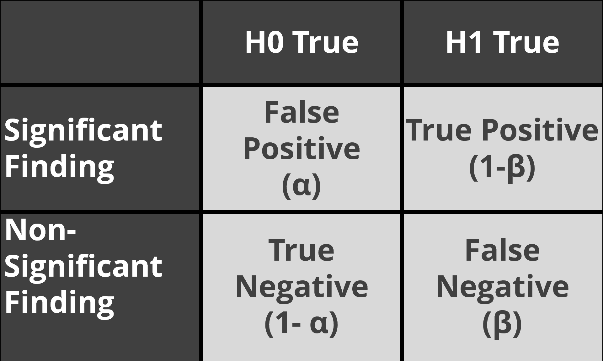

Science is a cumulative process, and we should evaluate lines of research, not
single studies. Researchers are advised to design studies that will provide
informative data, but sometimes you need to look at sets of studies before
patterns become clear. A commonly used lower limit for statistical power is 80%,
which means you will find a non-significant result in one out of five studies,
when there is a true effect. Because the true effect size is never known, you
should think about your study not as having a specific power, but as having a
power curve. Given the sample size you collect, the statistical power is high
for a range of true effect sizes, but it will be low for another range of
non-zero true effect sizes that are still interesting.

Whenever you perform studies where power is not 99.99%, you should expect to
find mixed results when examining true effects. Indeed, some researchers have
pointed out that *not* finding mixed results can be very unlikely (or ‘too good
to be true’) in a set of studies (Francis, 2014; Schimmack, 2012). We don’t have
a very good feeling for what real patterns of studies look like, because we are
continuously exposed to a scientific literature that does not reflect reality.
Almost all multiple study papers in the scientific literature present only
statistically significant results, even though this is unlikely.

The probability of observing a significant or non-significant result in a study
depends on the Type 1 error rate (α), the statistical power of the test (1-β),
and the probability that the null-hypothesis is true (cf. Ioannidis, 2005;
Wacholder, Chanock, Garcia-Closas, El ghormli, & Rothman, 2004). A study might
examine a *true effect*, which means the alternative hypothesis (H1) is true
(e.g., a correlation that differs from zero) or it might examine a *null
effect*, which means the null-hypothesis (H0) is true (e.g., a correlation that
is zero). When performing a statistical test on data, the test result might be
statistically significant at a specified alpha level (*p* \< α) or not. Thus,
there are four possible outcomes of a study:

1) False positives or Type 1 errors (you observe a significant test result when
H0 is true)

2) False negatives or Type 2 errors (you observe a non-significant result when
H1 is true)

3) True negatives (a non-significant result when H0 is true)

4) True positives (a significant test result when H1 is true)

To get a feeling for which results you can expect in the long run, we will use
binomial probabilities. As an example of a binomial probability, consider the
probability of observing *k* heads when flipping a coin *n* times. The observed
data are generated by a statistical distribution determined by the unknown
parameter θ, which ranges from 0 to 1, and is the true probability of getting
heads (e.g., 0.5 for a fair coin). A logical question in a coin-flipping example
would be to determine the probability of observing *k* number of heads in *n*
coin flips, assuming a fair coin (θ = 0.5). The probability of observing *k*
significant results in *n* studies is:

|   | \\frac{n!}{k!\\left( n - k \\right)!}\*\\theta\^{k}\*\\left( 1 - \\theta \\right)\^{n - k} | (1) |
|---|--------------------------------------------------------------------------------------------|-----|

The first term indicates the number of possible combinations of results (e.g.,
when two out of three studies are significant, either the first, the second, or
the third study is non-significant, which gives three combinations), which is
multiplied by the probability of observing significant results in each of the
*k* significant studies, which is then multiplied by the probability of
observing non-significant results in the remaining studies. This is known as the
binomial likelihood function. When H0 is true, the probability of significant
results equals the alpha level, and thus when the alpha level is carefully
controlled (e.g., in pre-registered studies) θ = 0.05. When H1 is true, the
probability of observing a significant result depends on the power, e.g., θ =
0.80 for studies with 80% power.

Open the online shiny app made in R which will perform these binomial likelihood
calculations for you: <http://shiny.ieis.tue.nl/mixed_results_likelihood/>. The
app displays binomial likelihoods for sets of studies.

By default, the settings in the app show the results for a situation when 2 out
of 3 studies are significant, a Type 1 error rate of 5% is used, and the power
for the studies is assumed to be 80%. The text below the figure shows that 2 out
of 3 significant results should happen 38% of the time when there is a true
effect, and power is 80%. Scroll down, and take a look at the table. In the left
column, you can see the probabilities of 0, 1, 2, or 3 significant results when
there is no effect (so you only observe Type 1 errors), and in the right columns
you can see these probabilities for when there is a true effect.

**Q1:** Which statement is correct when you perform 3 studies?

A) When H1 is true, alpha = 0.05, and power = 0.80, it is almost as likely to
observe one or more non-significant results (48.8%) as it is to observe only
significant results (51.2%).

B) When alpha = 0.05 and power = 0.80, it is extremely rare that you will find 3
significant results (0.0125%), regardless of whether H0 is true or H1 is true.

C) When alpha = 0.05 and power = 0.80, 2 out of 3 statistically significant
results is the most likely outcome overall (38.4%) when H1 is true.

D) When alpha = 0.05 and power = 0.80, the probability of finding at least one
false positive (a significant result when H0 is true) in three studies is 5%.

**Q2:** Sometimes in lines of three studies, you’ll find a significant effect in
one study, but there is no effect in the other two related studies. Assume the
two related studies were not exactly the same in every way (e.g., you have
changed the manipulation, or the procedure, or some of the questions). It could
be that the two other studies did not work because of minor differences that had
some effect you do not fully understand yet. Or it could be that the single
significant result was a Type 1 error, and H0 was true in all three studies.
Which statement below is correct, assuming a 5% Type 1 error rate and 80% power?

A) All else being equal, the probability of a Type 1 error in one of three
studies is 5% when there is no true effect in all three studies, and the
probability of finding exactly 1 in three significant effects, assuming 80%
power in all three studies, is 80%, which is substantially more likely.

B) All else being equal, the probability of a Type 1 error in one of three
studies is 13.5% when there is no true effect in all three studies, and the
probability of finding exactly 1 in three significant effects, assuming 80%
power in all three studies (and thus a true effect), is 9.6%, which is slightly,
but not substantially less likely.

C) All else being equal, the probability of a Type 1 error in one of three
studies is 85.7% when there is no true effect in all three studies, and the
probability of finding exactly 1 in three significant effects, assuming 80%
power in all three studies (and thus a true effect) (and thus a true effect), is
0.8%, which is substantially less likely.

D) It is not possible to know the probability you will observe a Type 1 error if
you perform 3 studies.

The idea that most studies have 80% power is slightly optimistic. **Examine the
correct answer to the previous question across a range of power values** (e.g.,
50% power, and 30% power).

**Q3:** Several papers suggest it is a reasonable assumption that the power in
the psychological literature might be around 50%. Set the number of studies to
4, the number of successes also to 4, and the assumed power slider to 50%, and
look at the table at the bottom of the app. How likely is it to observe 4
significant results in 4 studies, assuming there is a true effect?

A) 6.25%

B) 12.5%

C) 25%

D) 37.5%

Imagine you perform 4 studies, and 3 show a significant result. **Change these
numbers in the online app. Leave the power at 50%**. The output in the text
tells you:

*When the observed results are equally likely under H0 and H1, the likelihood
ratio is 1. Benchmarks to interpret Likelihood Ratios suggest that when 1\<LR\<8
there is weak evidence, when 8\<LR\<32 there is moderate evidence, and when
LR\>32, there is strong evidence.*

*The data are more likely under the alternative hypothesis than the null
hypothesis with a likelihood ratio of 526.32*

These calculations show that, assuming you have observed three significant
results out of four studies, and assuming each study had 50% power, it is 526
times more likely to have observed these data when the alternative hypothesis is
true, than when the null hypothesis is true. In other words, it is 526 times
more likely to find a significant effect in three studies when you have 50%
power, than to find three Type 1 errors in a set of four studies.

**Q4**: Maybe you don’t think 50% power is a reasonable assumption. How low can
the power be (rounded to 2 digits), for the likelihood to remain higher than 32
in favor of H1 when observing 3 out of 4 significant results?

A) 5% power

B) 17% power

C) 34% power

D) 44% power

The main take home message of these calculations is to understand that 1) mixed
results are supposed to happen, and 2) mixed results can contain strong evidence
for a true effect, across a wide range of plausible power values. The app also
tells you how much evidence, in a rough dichotomous way, you can expect. This is
useful for our educational goal. But when you want to evaluate results from
multiple studies, the formal way to do so is by performing a meta-analysis.

The above calculations make a very important assumption: The Type 1 error rate
is controlled at 5%. If you try out many different tests in each study, and only
report the result that yielded a p \< 0.05, these calculations no longer hold.

**Q5**: Go back to the default settings of 2 out of 3 significant results, but
now set the Type 1 error rate to 20%, to reflect a modest amount of p-hacking.
Under these circumstances, what is the **highest** likelihood in favor of H1 you
can get if you explore all possible values for the true power?

A) Approximately 1

B) Approximately 4.63

C) Approximately 6.70

D) Approximately 62.37

As the scenario above shows, *p*-hacking makes studies extremely uninformative.
**If you inflate the error rate, you quickly destroy the evidence in the data.**
You can no longer determine whether the data is more likely when there is no
effect, than when there is an effect. Sometimes researchers complain that people
who worry about *p*-hacking and try to promote better Type 1 error control are
missing the point, and that other things (better measurement, better theory,
etc.) are more important. I fully agree that these aspects of scientific
research are at least as important as better error control. But better measures
and theories will require decades of work. Better error control can be
accomplished today, if researchers would stop inflating their error rates by
flexibly analyzing their data. And as this assignment shows, inflated rates of
false positives very quickly make it difficult to learn what is true from the
data we collect. Because of the relative ease with which this part of scientific
research can be improved, and because we can achieve this today (and not in a
decade) I think it is worth stressing the importance of error control, and
publish more realistic looking sets of studies.

**Q6**: Some ‘prestigious’ journals (which, when examined in terms of scientific
quality such as reproducibility, reporting standards, and policies concerning
data and material sharing, are quite low quality despite their prestige) only
publish manuscripts with a large number of studies, which should all be
statistically significant. If we assume an average power in psychology of 50%,
only 3.125% of 5 study articles should contain exclusively significant results.
If you pick up a random issue from such a prestigious journal, and see 10
articles, each reporting 5 studies, and all manuscripts have exclusively
significant results, would you trust the reported findings more, or less, than
when all these articles had reported mixed results? Why?

**Q7**: Unless you will power all your studies at 99.99% for the rest of your
career (which would be slightly inefficient, but great if you don’t like
insecurity), you will observe mixed results in lines of research. How do you
plan to deal with mixed results in lines of research?

The take-away message of this assignment is that you should expect mixed results
under many circumstances, and that dichotomously ignoring non-significant
results is not wise. A formal meta-analysis is the best way to evaluate sets of
studies. But understanding what realistic patterns of results in research lines
should look like is hopefully a first step in making you realize you should
think meta-analytically.

© Daniel Lakens, 2019. This work is licensed under a [Creative Commons
Attribution-NonCommercial-ShareAlike 4.0
License](http://creativecommons.org/licenses/by-nc-sa/4.0/).
