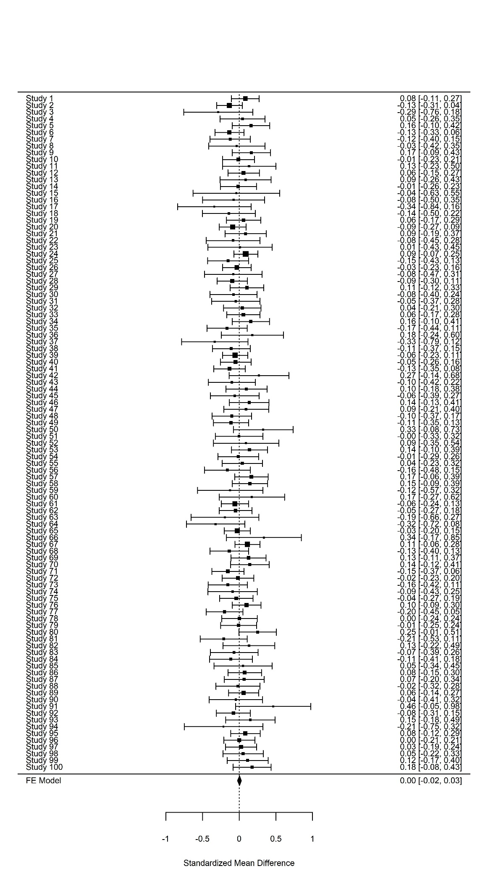
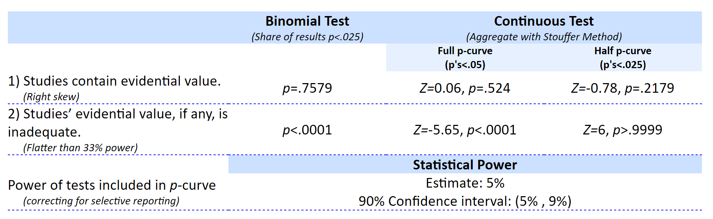

Publication bias is one of the biggest challenges that science faces.
**Publication bias** is the practice of selectively submitting and publishing
scientific research, often based on whether or not the results are
‘statistically significant’ or not. The scientific literature is dominated by
these statistically significant results. At the same time, we know that many
studies researchers perform do not yield significant results. When scientists
only have access to significant results, but not to all results, they are
lacking a complete overview of the evidence for a hypothesis. In extreme cases,
selective reporting can lead to a situation where there are hundreds of
statistically significant results in the published literature, but no true
effect because there are even more non-significant studies that are not shared.
This is known as the **file-drawer problem**, when non-significant results are
hidden away in file-drawers (or nowadays, folders on your computer) and not
available to the scientific community. Every scientist should work towards
solving the publication bias, because it is extremely difficult to learn what is
likely to be true as long as scientists do not share all their results.

Publication bias can only be fixed by making all your research results available
to fellow scientists, irrespective of the *p*-value of the main hypothesis test.
In the past, this has not been done, and as a consequence, we have to try to
detect the extent to which publication bias impacts our ability to accurately
evaluate the literature. Several techniques to detect publication bias have been
developed, and this continues to be a very active field of research. All
techniques are based on specific assumptions, which you should consider before
applying a test. There is no silver bullet: None of these techniques can fix
publication bias. None of them can tell you with certainty what the true
meta-analytic effect size is corrected for publication bias. The best these
methods can do is detect publication bias caused by specific mechanisms, under
specific conditions.

There are some older methods that you will read in some meta-analyses, but which
are no longer recommended. The first is known as **fail-safe N**. The idea was
to calculate the number of non-significant results one would need to have in
file-drawers before an observed meta-analytic effect size estimate would no
longer be statistically different from 0. I won’t explain how it is calculated,
because it does not work (even the person who developed it acknowledges this),
it is misleading, and a kitten dies each time someone uses it. Currently, the
only use fail-safe N has is as a tool to identify meta-analyses that are not
state-of-the-art.

# Funnel Plots

A second approach is known as the ‘trim-and-fill’ technique. Before we can
explain what trim-and-fill aims to do, it’s useful to explain a common way to
visualize meta-analyses which is known as a **funnel plot**. In a funnel plot,
the x-axis is used to plot the effect size of each study, and the y-axis is used
to plot the ‘precision’ of each effect size. Typically, the y-axis is used to
plot the standard error of each effect size estimate. The larger the study, the
more precise the effect size estimate, the smaller the standard error, and thus
the higher up in the funnel plot the study will be. Note that the y-axis has 0
at the top. That means that an infinitely precise study would be at the top of
the graph. In the funnel plot below, there are no studies with a standard error
less than 0.066, which means that there are no studies in the meta-analysis with
such large sample sizes that they have this high level of precision.

You see a white triangle against the gray background, which is what gives the
funnel plot its name. The funnel indicates the 95% CI around the meta-analytic
effect size estimate (indicated by the horizontal vertical line at 0.4 in the
plot above. That is, if the true effect size is d = 0.4 in the plot above, we
should expect 95% of the effect size estimates to fall within the funnel. If
sample sizes are small, effect size estimates will vary more around the true
effect size (as you can see at the bottom of the funnel), and if sample sizes
are larger, the effect size estimates vary more narrowly around the true effect
size (as you can see at the top of the funnel). Some points fall outside the
funnel plot (when the funnel plot is based on the 95% CI, 5% of the effects
should fall outside of the funnel, in the long run). In real life meta-analyses,
it isn’t very likely that all studies are sampled from a population with a true
effect size of d = 0.4. Thus, the figure above is an idealistic representation.
When the number of studies in a meta-analysis is small, it is very difficult to
interpret a funnel-plot.

Sometimes, it can be useful to center the funnel at 0, instead of at the
meta-analytic effect size estimate. Below, you can see the same data as above,
but now presented against a background of a funnel centered at 0. The funnel now
indicates the effect sizes we should expect if there is no true effect. Studies
that fall outside the funnel have a 95% confidence interval that does not
include 0. These studies will thus be statistically significant. Therefore, a
funnel centered at zero allows you to easily see which studies are statistically
significant, and which are not. When there is no publication bias, as in the
figure below, effect sizes should be distributed randomly around the true effect
size. This means there will be a reasonable number of non-significant effects.

If there is extreme publication bias, as in the figure below, all the points
within the funnel would be missing. Instead of normal variation around the true
effect size, there is asymmetry in the effect size distribution. Several
techniques that aim to detect publication bias focus on this asymmetry.

**Q1**: What happens when there is publication bias because researchers only
publish statistically significant results (p \< alpha), and you calculate the
effect size in a meta-analysis? Compare the two figures above to help answer
this question.

A) The meta-analytic effect size estimate is **identical** whether there is
publication bias (where researchers publish only effects with p \< alpha) or no
publication bias.

B) The meta-analytic effect size estimate is **closer to the true effect size**
when there is publication bias (where researchers publish only effects with p \<
alpha) compared to when there is no publication bias.

C) The meta-analytic effect size estimate is **higher** when there is
publication bias (where researchers publish only effects with p \< alpha)
compared to when there is no publication bias.

D) The meta-analytic effect size estimate is **lower** when there is publication
bias (where researchers publish only effects with p \< alpha) compared to when
there is no publication bias.

# Trim and Fill

Trim and fill is a technique that aims to augment a dataset by adding
hypothetical ‘missing’ studies (that may be in the ‘file-drawer’). The procedure
starts by removing (‘trimming’) small studies that bias the meta-analytic effect
size, then estimates the true effect size, and ends with ‘filling’ in a funnel
plot with studies that are assumed to be missing due to publication bias. In the
picture below, you can see the same data as above, but now with added unfilled
circles which represent ‘imputed’ studies. If you look closely, you’ll see these
points each have a mirror image on the opposite side of the meta-analytic effect
size estimate (this is clearest in the lower half of the funnel plot).

Trim-and-fill is not created to examine publication bias based on whether
studies yield significant p-values, or not. Instead, it's created for
publication bias caused by effects that are strongly (perhaps even
significantly!) in the opposite direction of the remaining studies or the effect
a researcher wants to find. Think of a meta-analysis on the benefits of some
treatment, where the 8 studies that revealed the treatment actually makes people
feel much worse are hidden in the file drawer.

Trim-and-fill is not very good under many realistic publication bias scenarios.
The method is criticized for its reliance on the strong assumption of symmetry
in the funnel plot. When publication bias is based on the *p*-value of the study
(arguably the most important source of publication bias in many fields) the
trim-and-fill method does not perform well enough to yield a corrected
meta-analytic effect size estimate that is close to the true effect size
(Peters, Sutton, Jones, Abrams, & Rushton, 2007; Terrin, Schmid, Lau, & Olkin,
2003). When the assumptions are met, it can be used as a **sensitivity
analysis.** When the difference between the trim-and-fill corrected effect size
estimate and the uncorrected meta-analytic effect size estimate is small,
publication bias due to the *p*-value of the individual studies is unlikely to
change the conclusions of the meta-analysis. Researchers should not report the
trim-and-fill corrected effect size estimate as a realistic estimate of the true
effect size if there would not be publication bias (Peters et al., 2007). Many
meta-analysts make this error, but regrettably, that’s not how trim-and-fill can
be used.

# PET-PEESE

A more novel class of solutions to publication bias is **meta-regression**.
Instead of plotting a line through individual data-points, in meta-regression a
line is plotted through data points that each represent a study. As with normal
regression, the more data meta-regression is based on, the more precise the
estimate is, and therefore, the more studies in a meta-analysis, the better
meta-regression will work in practice. If the number of studies is small, all
bias detection tests lose power, and this is something that one should keep in
mind when using meta-regression. Furthermore, regression requires sufficient
variation in the data, which in the case of meta-regression means a wide range
of sample sizes (recommendations indicate meta-regression performs well if
studies have a range from 15 to 200 participants in each group – which is not
typical for most research areas in psychology). Meta-regression techniques
typically estimate the population effect size if precision was perfect (so when
the standard error = 0).

One meta-regression technique is known as PET-PEESE (for a discussion, see
Stanley, 2017). It consists of a ‘precision-effect-test’ (PET) which can be used
in a Neyman-Pearson framework to test whether there is a true effect beyond the
inflation due to selective reporting. The PET test works as follows: When the
95% CI around the PET estimate at the intercept SE = 0 does not contain an
effect size of 0, we can reject the null hypothesis of no true effect.

The estimated effect size for PET is calculated with: d = β0 + β1SEi + ui where
d is the estimated effect size, SE is the standard error, and the equation is
estimated using weighted least squares (WLS), with 1/SE2i as the weights. The
PET estimate underestimates the effect size when there is a true effect.
Therefore, the PET-PEESE procedure recommends first using PET to test whether
there is a true effect or not. If PET suggests there is a true effect, then
PEESE should be used to estimate the meta-analytic effect size. In PEESE, the
standard error (used in PET) is replaced by the variance (i.e., the standard
error squared): d = γ0 + γ1SE2i + ui, which Stanley and Doucouliagos (2014) find
reduces the bias of the estimated meta-regression intercept.

PET-PEESE has limitations, as all bias detection techniques have. The biggest
limitations are that it does not work well when there are few studies, all
studies in a meta-analysis have small sample sizes, or when there is large
heterogeneity in the meta-analysis (Stanley, 2017). When these situations apply
(and they will in practice), PET-PEESE might not be a good approach.
Furthermore, there are some situations where there might be a correlation
between sample size and precision, which in practice will often be linked to
heterogeneity in the effect sizes included in a meta-analysis. For example, if
true effects are different across studies, and people perform power analyses
with accurate information about the expected true effect size, large effect
sizes in a meta-analysis will have small sample sizes, and small effects will
have large sample sizes. Meta-regression is, like normal regression, a way to
test for an association, but you need to think about the causal mechanism behind
the association.

# P-curve Analysis

Another novel approach to examining publication bias is *p*-curve analysis. This
is a meta-analytic technique that does not focus on effect sizes, but analyzes
the *p*-values of the statistical tests for the main hypothesis in a paper
(Simonsohn, Nelson, & Simmons, 2014a). A similar meta-analytic technique is
*p*-uniform (van Assen, van Aert, & Wicherts, 2015). When the null-hypothesis is
true, *p*-values are uniformly distributed (see week 1 of my first MOOC). When
there is a true effect p-values are skewed to the right, which means there
should be more small *p*-values (e.g., *p* = 0.01) than high *p*-values (*p* =
0.04) in a set of studies.

*P*-curve analysis tests whether the curve of the *p*-values is flatter than
what would be expected if the studies you analyze had 33% power (which suggests
the distribution looks more like one expected when the null-hypothesis is true),
or more right-skewed than a uniform *p*-value distribution (which suggests the
studies might have examined a true effect and had at least some power). As an
example, let’s consider Figure 3 from Simonsohn and colleagues (2014). The
authors compared 20 papers in the Journal of Personality and Social Psychology
that used a covariate in the analysis, and 20 studies that did not use a
covariate. The authors suspected that researchers might add a covariate in their
analyses to try to find a *p*-value smaller than 0.05, when the first analysis
they tried did not yield a significant effect. This is exactly what they found.

When you look at the *p*-curve, you can see five points in the blue line.
*P*-curve analysis is performed *only* on statistically significant results,
based on the assumption that these are always published. Thus, it looks at the
distribution of *p*-values below 0.05, and the 5 points illustrate all
*p*-values between 0 and 0.01, 0.01 and 0.02, 0.02 and 0.03, 0.03 and 0.04, and
0.04 and 0.05. In the figure on the right, you see a relatively normal
right-skewed *p*-value distribution with more low than high *p*-values. The
*p*-curve analysis shows the blue line in the right figure is more right-skewed
than the uniform red line (where the red line is the distribution you’d expect
if there was no true effect).

In the left figure we see the opposite pattern, with mainly high *p*-values
around 0.05, and almost no *p*-values around 0.01. Because the blue line is
significantly less right-skewed than the green line, the *p*-curve analysis
suggests this set of studies lacks ‘evidential value’. Using the term
‘evidential value’ is not formally correct when talking about *p*-values
(evidence is always relative, and better reserved for when talking about
likelihoods for example), so it’s best to interpret this as ‘the data do not
look as if they come from a *p*-value distribution that reflects the presence of
a true effect’.

P-curve analysis is a useful tool. But it is important to correctly interpret
what a *p*-curve analysis can tell you. A right-skewed *p*-curve does not prove
that there is no bias, or that the hypothesis is true. A flat *p*-curve does not
prove that the theory is incorrect, but it does show that the studies you
analyzed do not provide evidence for the presence of a true effect. When many
people have studied a particular topic, and the result is a flat *p*-value
distribution, this is probably not an effect you want to build on. The two tests
for right-skewed and a flat distribution perform relatively well even when there
is some heterogeneity in the effect size distribution.

# TIVA

The Test of Insufficient Variance (TIVA) is another new meta-analytic method
(published on a
[blog](https://replicationindex.wordpress.com/2014/12/30/the-test-of-insufficient-variance-tiva-a-new-tool-for-the-detection-of-questionable-research-practices/)
instead of in a scientific article!) developed by Uli Schimmack. It also uses
*p*-values from reported tests, and builds on the relationship between
*p*-values and Z-values. If all studies examine the same fixed effect, the
Z-scores related to *p*-values should follow a normal distribution, and
individual studies should vary as a function of sampling variability. The
variance of an unbiased set of Z-scores is not smaller than 1. The variance can
be larger than 1, for example, when the studies have different true effects.

In biased sets of studies, the variance of the Z-scores can be smaller than 1.
When non-significant studies are not published, the variance decreases. Another
reason for low variance is the use of flexibility during the data-analysis, such
as performing multiple analyses, but only reporting those analyses that yield a
significant result.

TIVA tests whether the variance that is observed is surprising, assuming the
dataset is unbiased. A significant *p*-value for the TIVA test allows you to
reject the hypothesis that the studies are unbiased. Uli Schimmack shows how the
studies reported by Bem (2011) in his article on pre-cognition are biased, which
suggests that the observed effect size in these studies is inflated. TIVA
provides a more powerful test than related tests aimed to detect the presence of
publication bias, such as the Test for Excessive Significance (Ioannidis &
Trikalinos, 2007).

**Let’s Detect Some Bias!**

**Open DetectingPublicationBias.R**. The script simulates a meta-analysis based
on a standardized mean difference. In line 9, you can specify the number of
studies that are simulated. In line 10, you can specify the publication bias by
specifying the percentage of significant results. When set to 1, all studies are
significant, when set to 0, all studies will be non-significant (we will for now
ignore the possibility that Type 1 errors will occur and could be published).
The unbiased percentage depends on the power (if there is a true effect) or the
Type 1 error rate. By default, two groups are simulated based on equal
population means of 100 (lines 12-15) . Thus, there is no true effect. The
default settings will simulate 100 studies (a decent sized meta-analysis) when
there is no publication bias. So let’s start by looking at what unbiased
research looks like.

**Run the entire script**. Your output will differ slightly from the results
below, because we are simulating studies and there will be random variation.
Results for a fixed effects meta-analysis are returned:

Fixed-Effects Model (k = 100)

Test for Heterogeneity:

Q(df = 99) = 69.8889, p-val = 0.9883

Model Results:

estimate se zval pval ci.lb ci.ub

0.0044 0.0128 0.3408 0.7332 -0.0207 0.0294

\---

Signif. codes: 0 ‘\*\*\*’ 0.001 ‘\*\*’ 0.01 ‘\*’ 0.05 ‘.’ 0.1 ‘ ’ 1

We see there are 100 studies in the meta-analysis (k = 100), and there is no
statistically significant heterogeneity (*p* = 0.988, which is not surprising
because we programmed the simulation so that there is no heterogeneity). We also
get the results for the meta-analysis. The meta-analytic estimate is d = 0.0044.
The meta-analytic effect size is very close to 0 (and the true effect size is
indeed 0). The standard error around this estimate is 0.0128. With 100 studies,
we have a very accurate estimate of the true effect size. The Z-value for the
test against d = 0 is 0.34, and the *p*-value for this test is 0.7332. There is
no statistically significant difference. The CI around the effect size estimate
(-0.02, 0.03) includes 0.

The script also generates 2 plots. You can find these under the ‘plots’ tab in
RStudio, and browse through the plots using the arrows:

.

The first plot is a forest plot, and the second plot is a funnel plot. The
forest plot looks a bit crammed (to get all 100 studies on one page) but we see
they randomly vary around 0 as they should. The small diamond at the bottom is
the meta-analytic effect size estimate and the 95% CI around it (see the plot on
the next page).

We also see a beautifully unbiased funnel plot. The meta-analytic effect size
estimate of 0.0044 is indicated by the triangle at the top of the figure. All
studies (the black dots) fall within the white triangle, which indicates the 95%
CI around 0 for different standard errors (and thus, for studies of different
sizes). Studies with a small standard error (and thus a large number of
observations) are at the top, while studies with less observations have a larger
standard error, and are on the bottom of the plot.

Now that we know what a real null effect looks like, let’s introduce bias. **In
line 10, change publication bias from 0 to 1**. We now have extreme publication
bias – only significant results end up in the meta-analysis – even though the
true effect size is 0. Take a look at the forest plot on the next page, which is
created by running the code up to **line 70**.

**Q2**: The forest plot in the figure looks quite peculiar. What do you notice?

A) All effect sizes are quite similar, suggesting large sample sizes and highly
accurate effect size measures.

B) The studies look as if they were designed based on perfect a-priori power
analyses, all yielding just significant results.

C) The studies have confidence intervals that only just fail to include 0,
suggesting most studies are only just statistically significant. This suggests
publication bias.

D) All effects are in the same direction, which suggests that one-sided tests
have been performed, even though these might not have been preregistered.

All studies are significant. A fixed effect meta-analytic effect size estimate
is indicated on the bottom of the plot, and is estimated to be d = 0.30. We can
also look at the meta-analysis results:

Fixed-Effects Model (k = 100)

Test for Heterogeneity:

Q(df = 99) = 61.4466, p-val = 0.9989

Model Results:

estimate se zval pval ci.lb ci.ub

0.2985 0.0130 22.9412 \<.0001 0.2730 0.3240 \*\*\*

\---

Signif. codes: 0 ‘\*\*\*’ 0.001 ‘\*\*’ 0.01 ‘\*’ 0.05 ‘.’ 0.1 ‘ ’ 1

**Q3**: Which statement is true?

A) With extreme publication bias, individual studies can be significant, but the
standard errors are so large that the meta-analytic effect size estimate is not
significantly different from 0.

B) With extreme publication bias, all individual studies are significant, and
the meta-analytic effect size estimate will be severely inflated, such that it
can give the impression there is overwhelming support for H1 when H0 is true.

C) With extreme publication bias, all individual studies are significant, but
meta-analytic effect size estimates are automatically corrected for publication
bias, and the meta-analytic effect size estimate is thus always quite reliable.

D) Regardless of whether there is publication bias, the meta-analytic effect
size estimate is severely biased, and it should never be considered a reliable
estimate of the population.

Let’s explore how PET-PEESE meta-regression attempts to give us an unbiased
effect size estimate, under specific assumptions of how publication bias is
caused. **Run the code up to line 96**. This should generate a plot similar to
the one below. In addition to the funnel, we see 3 lines through the plots. The
vertical line at d = 0.3 is the meta-analytic effect size estimate, which is
upwardly biased because we are averaging over statistically significant studies
only. There are 2 additional lines, which are the meta-regression lines for
PET-PEESE based on the formulas detailed earlier in this assignment. The
straight line gives us the PET estimate at a SE of 0 (an infinite sample, at the
top of the plot), indicated by the circle. The dotted line around this PET
estimate is the 95% confidence interval around the estimate. In this case, the
95% CI contains 0, which means that based on the PET estimate, we cannot reject
a meta-analytic effect size of 0. Note that even with 100 studies, the 95% CI is
quite wide. Meta-regression is, just like normal regression, only as accurate as
we have data. This is one limitation of PET-PEESE meta-regression: With small
numbers of studies in the meta-analysis, it has low accuracy.

The general procedure for PET-PEESE is to perform PET, and if we can reject an
effect of 0, the PEESE estimate is the best estimate for the unbiased effect
size (the diamond at SE = 0). The PEESE estimate is d = 0.18, but this should
not be used since we can not reject the null based on the PET estimate. The only
difference between PET and PEESE is that PET is based on the standard error,
while the PEESE estimate uses the variance.

**Q4**: Which statement is true?

A) Using PET-PEESE meta-regression we can show that the true effect size is d =
0 (based on the PET estimate).

B) Using PET-PEESE meta-regression we can show that the true effect size is d =
0.18 (based on the PEESE estimate).

C) Using PET-PEESE meta-regression we can show that the true effect size is d =
0.30 (based on the normal meta-analytic effect size estimate).

D) Using PET-PEESE meta-regression we can conclude there is reason to worry.
Although we can’t be certain, the normal meta-analytic effect size estimate
seems to be affected (maybe severely) by some form of bias.

**Run lines 114 to 120.** Remember, your results may be slightly different due
to random variation. Let’s explore our biased meta-analysis with other bias
detection tools. In the console window, you can read the output for the TIVA
test:

\> var.z

[1] 0.0420303

\> round(tiva.p,3)

[1] 0

The variance is very small (0.04, much lower than 1) and a test against the
normal variance we would expect shows the observed variance is statistically
different from 1 (*p* \< 0.001). This suggests strong bias, and there is no good
reason to assume the normal meta-analytic effect size estimate is accurate.

Finally, the script provides the test statistics for the 100 simulated *t*-tests
that are included in the meta-analysis. The first few rows look like:

t(108)=2.31710930681301

t(70)=2.48647673764339

t(196)=2.56979399991668

t(352)=2.42571063239848

t(106)=2.2036103963091

**Run line 112** to get all 100 rows of *t*-test statistics. Copy these 100
rows, and go to the online p-curve app. <http://www.p-curve.com/app4/> where you
can paste all test results, and click the ‘Make the p-curve’ button. NOTE: **the
p-curve app will give an error if you enter the simulations without publication
bias** – if all test statistics yield a *p* \> 0.05, the *p*-curve cannot be
computed. The output will look something like the graph below. In almost all
simulations, the result of the *p*-curve analysis will show that there is no
evidential value in the set of studies, and there is clear lack of evidential
value.

**Q5**: Take a look at the figure and output table of the p-curve app above
(which might differ somewhat from the result you got in your simulation). Which
interpretation of the output is correct?

A) Based on the continuous Stouffer’s test for the full *p*-curve, we can
conclude there is no evidence in the data.

B) Based on the continuous Stouffer’s test for the full *p*-curve, we can
conclude the observed *p*-value distribution is not skewed enough to be
interpreted as the presence of a true effect size, and it is flatter than we
would expect if the studies had 33% power. **Therefore, we can conclude the
theory that generated these studies is wrong**.

C) Based on the continuous Stouffer’s test for the full *p*-curve, we can
conclude the observed *p*-value distribution is not skewed enough to be
interpreted as the presence of a true effect size, and it is flatter than we
would expect if the studies had 33% power. **Therefore, we can conclude these
studies do not provide support for the theory that generated these studies**.

D) Based on the continuous Stouffer’s test for the full *p*-curve, we can
conclude the observed *p*-value distribution is not skewed enough to be
interpreted as the presence of a true effect size, and it is flatter than we
would expect if the studies had 33% power. **Therefore, we can conclude these
studies are based on fabricated data**.

**Q6**: The picture above comes from a publication by Carter & McCullough (2014)
who re-analyzed a meta-analysis on ego-depletion by Hagger et al. (2010).
Looking at this data, the PET effect size estimate is not statistically
different from zero. A subsequent Registered Replication Report in which one
ego-depletion paradigm was replicated by many labs failed to observe a
significant effect as well (Hagger et al., 2015). It seems plausible that there
might be no true effect. But if there is no true effect, Type 1 errors should
occur both left and right from the funnel plot, in a two-sided test. There is
one statistically significant effect in the opposite direction, but with almost
200 studies in the meta-analysis, there should be at least 5. To explain this,
we have to assume there is not just publication bias based on whether the
*p*-value is statistically significant, but also based on whether the effect is
in the expected direction or not. What do you think? Is publication bias strong
enough such that it would lead to the suppression of significant effects in the
direction opposite to the prediction, or would such effects be published anyway?

**Q7**: As indicated earlier, there might be an explanation for a correlation
between the sample size and the effect size in the ego-depletion literature
(visualized in the meta-analysis in the previous question) that is unrelated to
publication bias. This is known as ‘small study effects’, and is used to
describe any reason why smaller studies might show larger effects. What could be
a reason smaller studies show larger effects?

# Conclusion

Publication bias is a big problem in science. It is present in almost all
meta-analyses performed on the primary hypothesis test in scientific articles,
because these articles are much more likely to be submitted and accepted for
publication if this test is statistically significant. Meta-analytic effect size
estimates that are not corrected for bias will almost always overestimate the
true effect size. Publication bias inflates the effect size estimate to an
unknown extent – but it could even be the case that the true effect size is
zero! Meta-analyses should always carefully examine the impact of publication
bias on the meta-analytic effect size estimate. There is a lot of activity in
the literature on tests for publication bias. There are many different tests,
and you need to carefully check the assumptions of each test before applying it.
Most tests don’t work well when there is large heterogeneity, and heterogeneity
is quite likely. I’d currently recommend applying multiple tests that should,
based on the literature, give informative results based on the studies in your
meta-analysis. When you plan to perform a meta-analysis, you should always
examine whether there is publication bias. Given that bias detection tests is an
active field, read up on the latest work in this area. None of the bias
detection techniques discussed in this assignment will be a silver bullet, but
they will be better than naively interpreting the uncorrected effect size
estimate from the meta-analysis.

© Daniel Lakens, 2019. This work is licensed under a [Creative Commons
Attribution-NonCommercial-ShareAlike 4.0
License](http://creativecommons.org/licenses/by-nc-sa/4.0/).
