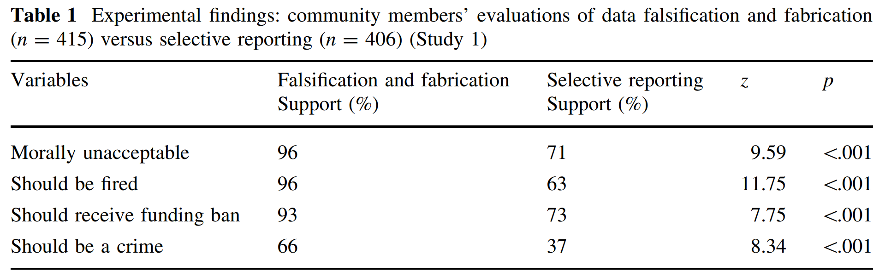

When doing research, it is important to be guided by what are considered **good
research practices**. Good research practices have the goal to maximize the
quality and reliability of research. What are considered good research practices
has remained rather stable over time on an abstract level, but in practice the
implementation of these behaviors change over time as a function of social,
political, and technological developments. For example, it is increasingly seen
as a good research practice to share all underlying data for the research you
report. The internet and the cloud make it easy to store and share data with
others, and funders increasingly expect the data from research they fund to be
open whenever possible.

The abstract principles upon which Codes of Conduct for Research Integrity are
built vary slightly between different documents (there is a European Code of
Conduct, a Dutch Code of Conduct, and a Code of Conduct of Eindhoven University
of Technology that I personally have to adhere to). However, at the core of most
codes of conduct are 1) honesty, 2) reliability and trustworthiness, 3)
transparency or openness, 4) independence, and 5) responsibility.

Fabricating data is making up results and recording them as if they were real.
Data fabrication is a research practice that is outright dishonest. There have
been a [substantial number of
cases](https://en.wikipedia.org/wiki/List_of_scientific_misconduct_incidents)
where researchers have fabricated complete datasets in dozens of experiments.
This is an extreme case of data fabrication. But data fabrication can be done on
a much smaller scale as well. Note that it can be fine to **simulate** data to
perform a power analysis – one should just not present such data as if it was
collected from real participants.

Imagine collecting data for a study. As part of the study, it is your task to
ask the age of participants and their gender, for the demographic statistics to
be reported when describing the sample. After collecting all the data, you
notice you have forgotten to collect the demographic data for two individuals.
You might be tempted to, based on your memory, guess the demographic statistics
of these two individuals, to not have to admit you have made a mistake during
the data collection when you wrote up the demographic information. However, this
would also constitute data fabrication.

**Mistakes happen. The more transparent researchers work, the more visible these
mistakes will become.** Honesty means you need to admit when you made a mistake
when it has happened – and even if you try your best, mistakes will happen.

**Q1**: Try to define ‘data fabrication’ in a single sentence. Start the
sentence with ‘Data fabrication is any process through which’. Your definition
should cover all forms of data fabrication that are dishonest, but it should not
cover honest processes, such as *simulating* datasets.

As far as we know, data fabrication is relatively rare (although we only catch
people who do something that others have been able to figure out– there might be
more fraudsters then we know!). However, there are more subtle ways to alter the
data you have collected to get the results you want. For example, researchers
might delete datapoints from a dataset because these are identified as
‘outliers’ (but mainly just help to make a result statistically significant). If
the results go against what you wanted to find, researchers can also choose to
hide the results from others. Although these actions are not data fabrication,
they also impact the knowledge that is shared with others, and can undermine the
reliability and trustworthiness of research findings.

The [Netherlands Code of Conduct for Research
Integrity](https://www.vsnu.nl/files/documents/Netherlands%20Code%20of%20Conduct%20for%20Research%20Integrity%202018.pdf)
states: “*Do not fabricate data or research results and do not report fabricated
material as if it were fact. Do justice to all research results obtained. Do not
remove or change results without explicit and proper justification. Do not add
fabricated data during the data analysis.*”

Take a moment to think about what is meant with ‘Doing justice to all research
results obtained’. This is clearly a more abstract description of good research
practices than ‘do not fabricate data’. We are entering a category of behaviors
where not simply the **action**, but **the intention behind the action** starts
to matter.

Imagine you are analyzing your data, and one participant has entered an age of
117 in a text-entry question in an experiment they performed behind a computer.
Although it is not impossible to have this age, it is perhaps more likely that
the participant intended to enter the value 17. Should you change the value to
17? Now imagine you have measured the amount of time (in seconds) people browse
a website using the system clock on your computer, which is extremely accurate,
and time measurement is perfectly reliable. There is an experimental condition,
and a control condition. There is no statistically significant difference
between the two groups. However, if you change the data of one participant in
the control condition from 117 seconds to 17 seconds, the difference between
groups is statistically significant, and confirms the prediction you made when
designing the study.

**Q2**: What is the difference between these two situations? Why is the second
recoding of 117 to 7 a violation of the code of conduct for research integrity,
according to the quote from the Netherlands Code of Conduct for Research
Integrity three paragraphs above this question? If you write up the average age
of participants after having changed the age of this one participant from 117 to
17, what do you need to provide in addition to the statement ‘the mean age of
participants was 20.4’ when this number is based on data you changed?

Under the explanation of what is meant with ‘Transparency’ The Netherlands Code
of Conduct for Research Integrity says ‘If parts of the research or data are not
to be made public, the researcher must provide a good account of why this is not
possible’. The practice of sometimes reporting results, but other times not
reporting results is referred to as **selective reporting**.

When it comes to selective reporting, it is again the intention of the
researcher that matters. It might make sense to not report a study that was
flawed (e.g., there was a programming mistake in the experiment, or all
participants misunderstood the instructions and provided useless input). It
might also make sense to not extensively report a study that was badly designed
– for example, you thought a manipulation would have a specific effect, but the
manipulation does not work as intended. However, even such data might be useful
to others, and the knowledge that the manipulation you thought would have a
specific effect has no effect might prevent others in the future of making the
same mistake. It would at least sometimes be beneficial for science if such
results were shared in some way. But, as we will see below, researchers also
choose to selectively report studies based on whether the results were
statistically significant or not.

**Q3**: A scientist performs several experiments, but only shares the results of
those experiments that, after looking at the results, yield an outcome that
supported their predictions. This scientist never shares the results of
experiments that fail to support their predictions. How morally acceptable or
unacceptable do you think the actions of this scientist are?

**Q4**: A scientist performs several experiments, but only shares the results of
those experiments that, after looking at the results, are judged to have been
well-designed. This scientist never shares the results of experiments that,
after looking at the data, are judged to be badly designed. How morally
acceptable or unacceptable do you think the actions of this scientist are?

**Q5**: A scientist performs one experiment in which several dependent variables
are analyzed in multiple ways, but only shares the results of those analyses
that, after looking at the results, yield an outcome that supported their
predictions. This scientist never shares the results of analyses that fail to
support their predictions. How morally acceptable or unacceptable do you think
the actions of this scientist are?

Regardless of your answers above, current practice is that researchers do
selectively report studies. When Franco, Malhotra, & Simonovits (2014) examined
what happened to 106 studies part of a large collaborative national
representative survey, they found that if the results yielded non-significant
effects, 31 studies were not written up, 7 were written up but not published
yet, and 10 were published. When results showed strong (statistically
significant) effects, only 4 had not been written up, 31 were written up but not
yet published, and 56 were published. There is clear evidence researchers
selectively report results that confirmed their hypotheses.

When there is publication bias, **research that appears in the published
literature is systematically unrepresentative of the real population of
completed studies**. Some solutions to combat publication bias have been
developed. One is known as [clinicaltrials.gov](https://clinicaltrials.gov/).
This is a database of privately and publicly funded clinical studies conducted
around the world, which must be registered before they begin. If researchers are
required to register all trials they perform, we would have an unbiased record
of all studies that are performed, regardless of the result. Furthermore, when
the study is completed, researchers are required to report the results (although
not all researchers do this). Another solution is known as Registered Reports.
In a Registered Report researchers submit a manuscript containing the
introduction and methods, before the data is collected. The research proposal is
peer reviewed. If it is accepted, researchers can collect and publish the
results, regardless of whether the result supported their hypothesis or not.
This prevents publication bias, and allows researchers to publish research
regardless of the results.

A recent study by Pickett and Roche (2017) examined the public perception of
data fabrication, and selective reporting. Their results are in the table below.
As you can see, selective reporting is judged to be morally unacceptable by a
large proportion of the public (71% believe it is morally unacceptable), and the
majority of the public thinks there should be consequences when it is done
(e.g., 73% believe such researchers should receive a funding ban). How do these
percentages in the study by Pickett and Roche reflect your own judgments about
how morally acceptable or unacceptable selective reporting is?

In addition to selectively reporting studies, researchers have admitted to
selectively reporting conditions in an experiment, or selectively reporting
analyses that they performed. In the table below, from a paper by Fiedler &
Schwarz, 2015, you can see a list of questionable research practices.

The black bars are the percentage of researchers who admit to doing the
questionable research practice listed, based on an initial study by John et al
(2012). The grey bars are based on slightly reworded questions (Fiedler &
Schwarz, 2015), asking how often they at least once performed this behavior. The
white bars are how frequently researchers performed these questionable research
practices. The two prevalence bars provide information combining how many
scholars performed the behaviors at least once, and how often they perform these
behaviors. These are combined to get an indication of not just how many people
did questionable research practices once, but how many times we can expect
papers in the literature to be affected by them. All these practices go against
the code of conduct of research integrity. The percentages are, I think,
worryingly high.

**Q6**: Assuming the results observed by Pickett and Roche, as well as the
results by John et al, and Fiedler and Schwarz, are accurate and representative,
there seems to be a large divide between current research practices, and what
the general public think is morally acceptable. Do you think this divide is
problematic? Do you think that if the general public was perfectly aware of
current practices related to selective reporting, they would have a reason to
evaluate the ways scientists work negatively, or do you think that with a good
explanation of current practices, the general public would evaluate current
practices positively?

**Q7**: Given that researchers admit to using questionable research practices,
they must have some benefits. What are benefits of using questionable research
practices?

**Q8**: What are downsides of using questionable research practices?

To improve research practices, we have seen many scientific fields move towards
greater transparency. This includes sharing data and materials, clearer
reporting of choices that were made during the data analysis, and
pre-registering planned studies. It is almost impossible to prevent all fraud,
but making research more transparent will make it easier to detect questionable
research practices, such as selective reporting. At the same time, universities
need to train people in research ethics, and make sure there is a climate where
researchers (including you!) feel comfortable to do the right thing.

**Grade Yourself**

For this assignment, you will grade yourself. You will be able to check
suggested answers below (which are an indication of what would be a good answer,
although not exhaustive – your answer might highlight correct important points
not mentioned in the answers below). Read through the answers below and
determine a grade for your own answers. Use a grading from 1 (very bad answer)
to 10 (excellent answer). Be honest.

**Answer Q1**: Data fabrication is any process through which data are generated
that can pass for real data, but that are not based on real underlying
observations that were actually made by a researcher. The data are nevertheless
presented as if they are based real observations.

*Score yourself between 1 (no answer) to 10 (perfect answer) points. Your grade
should be higher, the better you indicated fabricated data look similar to real
observations, and that they are intentionally presented as if they are real.*

**Answer Q2**: The difference between the two cases is that in the second case,
a researcher has the intention to generate an outcome that is in line with the
outcome they want to observe. In terms of the quote by the Netherlands Code of
Conduct of Research Integrity, what is missing is “*explicit and proper
justification*”. What you need to provide if you report an average based on a 17
instead of a 117 is a footnote or statement indicating what you did (‘We changed
one age value of 117 to 17’) and the justification for this (‘because we
strongly suspected the value was a type on the participant was actually 17 years
old’).

*Score yourself between 1 (no answer) to 10 (perfect answer) points. Your grade
should be higher, the more aspects of the answer you provided (explaining the
difference between the two cases based on the absence of a proper justification,
specifying which aspect of the Netherlands Code of Conduct of Research Integrity
is missing in the second case, and that you need to describe what you have
changed, and the justification for changing it.*

**Q3, Q4, Q5, and Q6 are your personal opinion, and are not graded.**

**Answer Q7**: 1) because they are biased towards presenting support for their
hypothesis to the world, 2) because they are much more strongly rewarded in
their career for publishing results that ‘work’ than null results, and thus
spend their time on the former, and 3) even if researchers would try to publish
the results, journals are less likely to accept them for publication, 4) It is
easier to publish a paper with a coherent story (only significant results). In
general, we can expect the benefits of questionable research practices to be for
individual scientists in the short run.

*Score yourself between 1 (no answer) to 10 (perfect answer) points. Your grade
should be higher, the more of reasons you provided, including, but not limited
to, the three above.*

**Answer Q8**: For an individual scientist, the risk is colleagues find out, and
lose prestige (or in extreme cases, their job). Failures to replicate their work
might also impact their prestige. For society, a downside is that scientific
research is not as reliable as it should be. For science, a downside could be
that the reputation of science, and the trust people place in science, is
damaged. In general, we can expect the costs for questionable research practices
are for society in the long run.

*Score yourself between 1 (no answer) to 10 (perfect answer) points. Your grade
should be higher, the more of reasons you provided, including, but not limited
to, the three above.*

If, after all this work on research ethics, you are feeling like you need
something to cheer you up, this video might help:
<https://youtu.be/ZaNtz76dNSI>.

Daniel Lakens, 2019

This work is licensed under a [Creative Commons
Attribution-NonCommercial-ShareAlike 4.0
License](http://creativecommons.org/licenses/by-nc-sa/4.0/).
