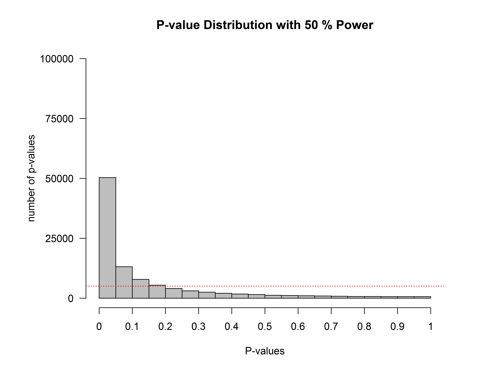
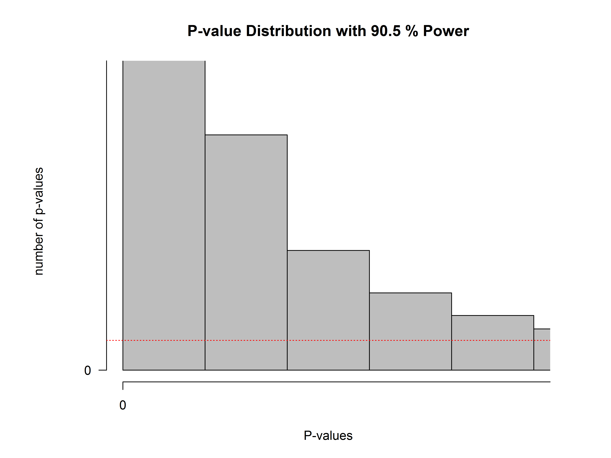

Which *p*-values can you expect to observe if there is a true effect, and you
repeat the same study one-hundred thousand times? And which *p*-values can you
expect if there is no true effect, and you repeat the same study one-hundred
thousand times? Take a moment to try to answer these two questions for yourself,
before you will learn the answer in this assignment.

In your life, you might never do enough studies to get a feel for which
*p*-values you should expect Luckily, we can easily simulate studies, calculate
a *p*-value for each simulated study, and see what happens. Understanding which
*p*-values you can expect is very important, because it will help you to better
interpret *p*-values.

Which *p*-values you can expect is completely determined by the **statistical
power** of the study, or the probability that you will observe a significant
effect, if there is a true effect. The statistical power ranges from 0 to 1.
Let’s get started by performing some simulations. Open the file
WhichPvaluesCanYouExpect.R. The first two lines of the script will install pwr
(a package to perform power calculations). In line 7 you can set the number of
simulations (the higher the number the more accurate the results, but the longer
it takes – leave them at 100.000 for this assignment). The script simulates
one-sample *t*-tests. The idea is that we simulate IQ scores for a group of
people (line 10 determines the sample size, which is set to 26 by default). We
know the standard deviation of IQ scores is 15 (specified in line 11). For now,
we will set the mean IQ score in the simulated group to 106 (specified in line
9), which we will compare to the average IQ score of all people (which is known
to be 100 – that’s how IQ tests are normalized). We are testing if the people in
our simulated sample have an IQ that differs from the average (and we know the
correct answer is ‘yes’, because we made it so in the simulation).

In the simulation, we generate *n* (by default 26) normally distributed IQ
scores with a mean of *M* (106 by default) and a standard deviation of 15 (the
code to simulate data is in line 18). We then perform a one-sample *t*-test
(line 19) and store the *p*-value (line 20). Run the script by selecting all
lines (click on the script, hit CTRL+A to select all lines, and then hit
CTRL+ENTER to run the entire script).

The script will take a while to run, simulating 100.000 studies, and then it
will create a plot of all observed *p*-values that should look similar to the
one below.

On the x-axis we see *p*-values from 0 to 1 in 20 bars, and on the y-axis we see
how frequently these *p*-values were observed. There is a horizontal red dotted
line that indicates an alpha of 5% (located at a frequency of 100.000\*0.05 =
5000) – but you can ignore this line for now. In the title of the graph, the
statistical power that is achieved in the simulated studies is given (assuming
an alpha of 0.05): The studies have 50% power.

Q1: Since the statistical power is the probability of observing a statistically
significant result, if there is a true effect, we can also see the power in the
figure itself. Where?

A) We can calculate the number of *p*-values larger than 0.5, and divide them by
the number of simulations.

B) We can calculate the number of *p*-values in the first bar (which contains
all ‘significant’ *p*-values from 0.00 to 0.05) and divide the *p*-values in
this bar by the total number of simulations.

C) We can calculate the difference between *p*-values above 0.5 minus the
*p*-values below 0.5, and divide this number by the total number of simulations.

D) We can calculate the difference between *p*-values above 0.5 minus the
*p*-values below 0.05, and divide this number by the number of simulations.

Q2: Change the sample size in line 10 from n\<-26 to n\<-51. Run the simulation
by selecting all lines and pressing CTRL+Enter. What is the power in the
simulation now that we have increased the sample size from 26 people to 51
people?

A) 55% C) 80%

B) 60% D) 95%

Q3) If you look at the distribution of *p*-values, what do you notice?

A) The *p*-value distribution is exactly the same as with 50% power

B) The *p*-value distribution is much steeper than with 50% power

C) The *p*-value distribution is much flatter than with 50% power

D) The *p*-value distribution is much more normally distributed than with 50%
power

Feel free to increase and decrease the sample size and see what happens if you
run the simulation. When you are done exploring, make sure that n\<-51 in line
10.

Q4) What would happen when there is no true difference between our simulated
samples and the average IQ score? In this situation, we have no probability to
observe an effect, so you might say we have ‘0 power’. Some people prefer to say
power is not defined when there is no true effect. I tend to agree, but we can
casually refer to this as 0 power. Change the mean IQ score in the sample to 100
(set M\<-106 to M\<-100 in line 9) There is now no difference between the
average IQ score, and the mean IQ in our simulated sample. Run the script again.
What do you notice?

A) The *p*-value distribution is exactly the same as with 50% power

B) The *p*-value distribution is much steeper than with 50% power

C) The *p*-value distribution is basically completely flat (ignoring some minor
variation due to random noise in the simulation)

D) The *p*-value distribution is normally distributed

The question below builds on the simulation above where there was no true
difference between the groups.

Q5) Look at the leftmost bar in the plot, and look at the frequency of
*p*-values in this bar What is the formal name for this bar?

A) The power (or true positives)

B) The true negatives

C) The Type 1 error (or false positives)

D) The Type 2 error (or false negatives)

When there is no true effect, *p*-values are what is called **‘uniformly
distributed under the null’**. Every *p*-value is equally likely when the null
hypothesis is true, and every bar in the graph will contain 5% of all the
*p*-values (as indicated by the dotted red line). When there is no true effect,
a *p*-value of 0.08 is just as likely as a *p*-value of 0.98. This is important
to realize. When there is no true effect, *p*-values are uniformly distributed.
When there is a true effect, the *p*-value distribution depends on the power,
and the higher the power, the more *p*-values fall below 0.05, and the steeper
the *p*-value distribution becomes.

Let’s take a look at just the *p*-values below 0.05. The goal of the next few
steps in this assignment is to cure you from a bi-polar *p*-value disorder,
where people incorrectly think all *p*-values \> 0.05 are support for the
null-hypothesis, and all *p*-values below 0.05 are support for the alternative
hypothesis. Bear with me for the next few steps – it will be worth it. In line
15, you will find the variable that determines how many bars there are, in the
statement bars\<-20. Change it to bars\<-100. We will now get 1 bar for
*p*-values between 0 and 0.01, one bar for *p*-values between 0.01 and 0.02, and
100 bars in total. The red dotted line will now indicate the frequency of
*p*-values when the null hypothesis is true, where every bar contains 1% of the
total number of *p*-values. We only want to look at *p*-values below 0.05, and
we will cut off the plot at 0.05. In line 33, change xlim = c(0, 1) to xlim =
c(0, 0.05). Instead of seeing all *p*-values between 0 and 1, we will only see
*p*-values between 0 and 0.05. Re-run the simulation (still with *M*\<-100). We
see the same uniform distribution, but now every bar contains 1% of the
*p*-values, so the *p*-value distribution is very flat and almost impossible to
see (we will zoom in on the y-axis later this assignment). The red line now
clearly gives the frequency for each bar, assuming the null hypothesis is true.

Change the mean in the simulation in line 9 to M\<-107 (remember n is still 51
in line 10). Re-run the simulation. It’s clear we have very high power. Most
*p*-values are in the left-most bar, which contains all *p*-values between 0.00
and 0.01.

Q6) The plot from the last simulation tells you we have 90.5% power. This is the
power if we use an alpha of 5%. But we can also use an alpha of 1%. What is the
statistical power we have in the simulated studies when we would use an alpha of
1%, looking at the graph? Pick the answer closest to the answer from your
simulations.

A) \~90%

B) \~75%

C) \~50%

D) \~5%

To be able to look at the *p*-values around 0.03 and 0.04, we will zoom in on
the y-axis as well. In line 33 change ylim=c(0, nSims) to ylim = c(0, 10000).
Re-run the script. You’ll get a plot that looks like the one below:

Change the mean in our sample to 108 in line 9 (*M*\<-108), and leave the sample
size at 51. Run the simulation. Look at how the distribution has changed
compared to the graph above.

Look at the fifth bar from the left. This bar now contains all the *p*-values
between 0.04 and 0.05. You will notice something peculiar. Remember that the red
dotted line indicates the frequency in each bar, assuming the null hypothesis is
true. See how the bar with *p*-values between 0.04 and 0.05 is lower than the
red line. We have simulated studies with 96% power. When power is very high,
*p*-values between 0.04 and 0.05 are very rare – they occur less than 1% of the
time (most *p*-values are smaller than 0.01). When the null hypothesis is true,
*p*-values between 0.04 and 0.05 occur exactly 1% of the time (because
*p*-values are uniformly distributed). Now ask yourself: When you have very high
power, and you observe a *p*-value between 0.04 and 0.05, is it more likely that
the null-hypothesis is true, or that the alternative hypothesis is true? Given
that you are more likely to observe *p*-values between 0.04 and 0.05 when the
null hypothesis is true, than when the alternative hypothesis is true, you
should interpret a *p*-value significant with an alpha of 0.05 as more likely
when the null hypothesis is true, than when the alternative hypothesis is true.
I said I’d cure you from your bi-polar *p*-value disorder, didn’t I?

In our simulations, we know there is a true effect or not, but in the real
world, you don’t know. When you have very high power, use an alpha level of
0.05, and find a *p*-value of *p* = .045, the data is surprising, assuming the
null hypothesis is true, but it is even *more* surprising, assuming the
alternative hypothesis is true. This shows how a significant *p*-value is not
always evidence for the alternative hypothesis.

Q7) When you know you have very high (e.g., 98%) power for the smallest effect
size you care about, and you observe a *p*-value of 0.045, what is the correct
conclusion?

A) The effect is significant, and provides strong support for the alternative
hypothesis.

B) The effect is significant, but it is without any doubt a Type 1 error.

C) With high power, you should use an alpha level that is smaller than 0.05, and
therefore, this effect can not be considered significant.

D) The effect is significant, but the data are more likely under the null
hypothesis than under the alternative hypothesis.

If this sounds counterintuitive, that’s understandable. This is known a
[Lindley’s paradox](https://en.wikipedia.org/wiki/Lindley's_paradox). A result
can be unlikely when the null hypothesis is true, but it can be even more
unlikely assuming the alternative hypothesis is true, **and power is very
high**. For this reason, some researchers have suggested using lower alpha
levels in very large sample sizes, and this is probably sensible advice. Other
researchers have suggested using Bayesian statistics (which we will encounter in
assignment 2.2), which is also sensible advice. Note that it is quite unlikely
to find a paradoxically high *p*-value (e.g., of *p* = 0.045) when the
alternative hypothesis is true – but it will happen.

Q8) Play around with the sample size and the mean IQ in the group (lines 9 and
10, and thus, with the statistical power in the simulated studies). Look at the
simulation result for the bar that contains *p*-values between 0.04 and 0.05.
The red line indicates how many *p*-values would be found in this bar if the
null-hypothesis was true (and is always at 1%). At the very best, how much more
likely is a *p*-value between 0.04 and 0.05 to come from a *p*-value
distribution representing a true effect, than it is to come from a *p*-value
distribution when there is no effect? You can answer this question by seeing how
much higher the bar of *p*-values between 0.04 and 0.05 can become. If at best
the bar in the simulation is five times as high at the red line (so the bar
shows 5% of *p*-values end up between 0.04 and 0.05, while the red line remains
at 1%), then at best *p*-values between 0.04 and 0.05 are five times as likely
when there is a true effect than when there is no true effect.

A) At best, *p*-values between 0.04 and 0.05 are equally likely under the
alternative hypothesis, and under the null hypothesis.

B) At best, *p*-values between 0.04 and 0.05 are approximately 4 times more
likely under the alternative hypothesis, than under the null hypothesis.

C) At best, *p*-values between 0.04 and 0.05 are \~10 times more likely under
the alternative hypothesis, than under the null hypothesis.

D) At best, *p*-values between 0.04 and 0.05 are \~30 times more likely under
the alternative hypothesis, than under the null hypothesis.

For this reason, statisticians warn that *p*-values just below 0.05 (e.g.,
between 0.04 and 0.05) are at the very best weak support for the alternative
hypothesis. If you find *p*-values in this range, consider replicating the
study, or if that’s not possible, interpret the result at least a bit
cautiously.

If you are interested in the mathematical explanation of *p*-value
distributions, instead of the current explanation that is based on simulations,
you can read [Hung, O’Neill, Bauer, & Kohne,
1997](http://www.jstor.org/stable/2533093?seq=1#page_scan_tab_contents).

© Daniel Lakens, 2016. This work is licensed under a [Creative Commons
Attribution-NonCommercial-ShareAlike 4.0
License](http://creativecommons.org/licenses/by-nc-sa/4.0/).
