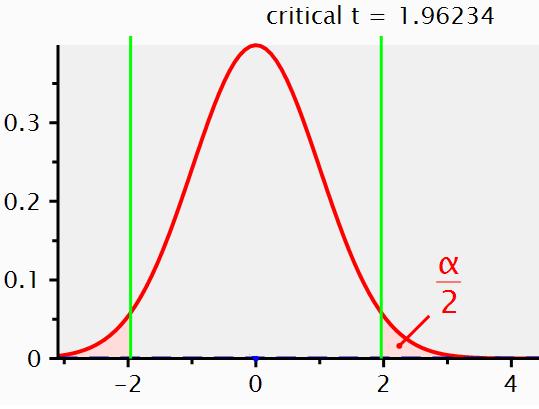
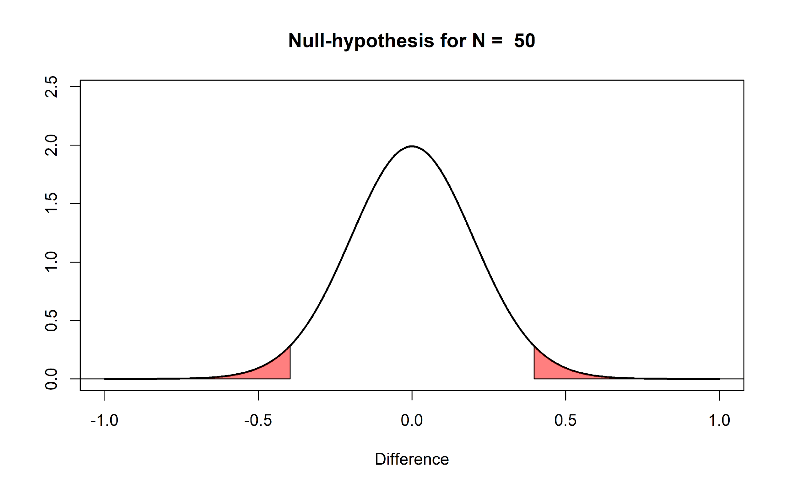
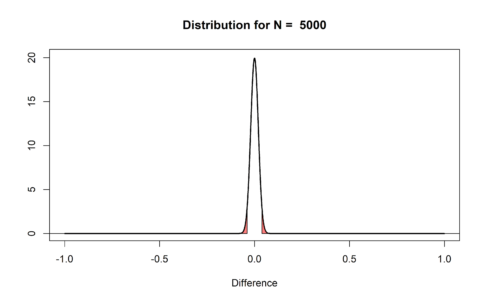
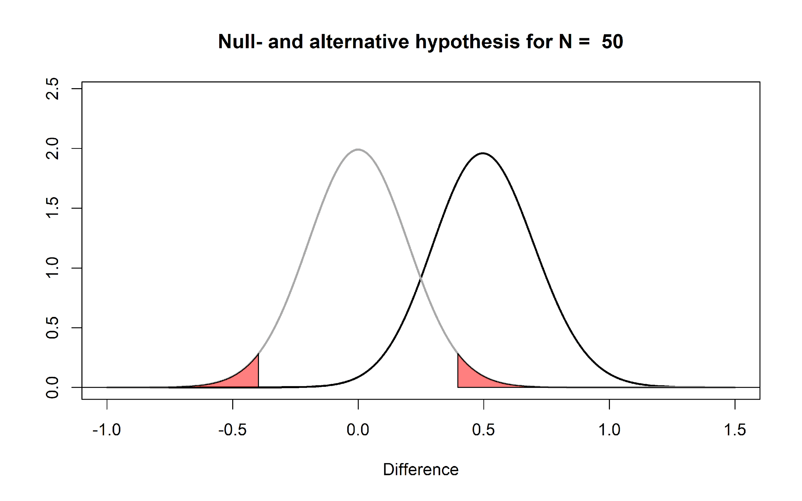
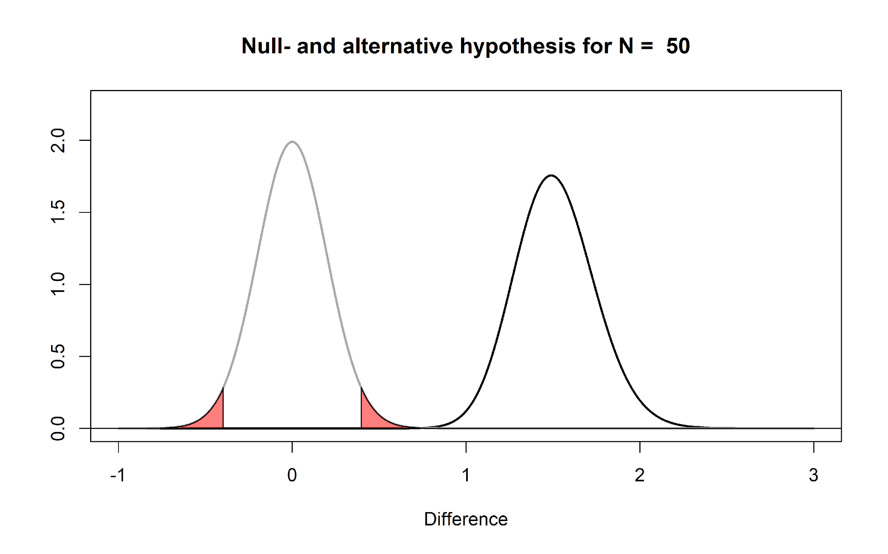
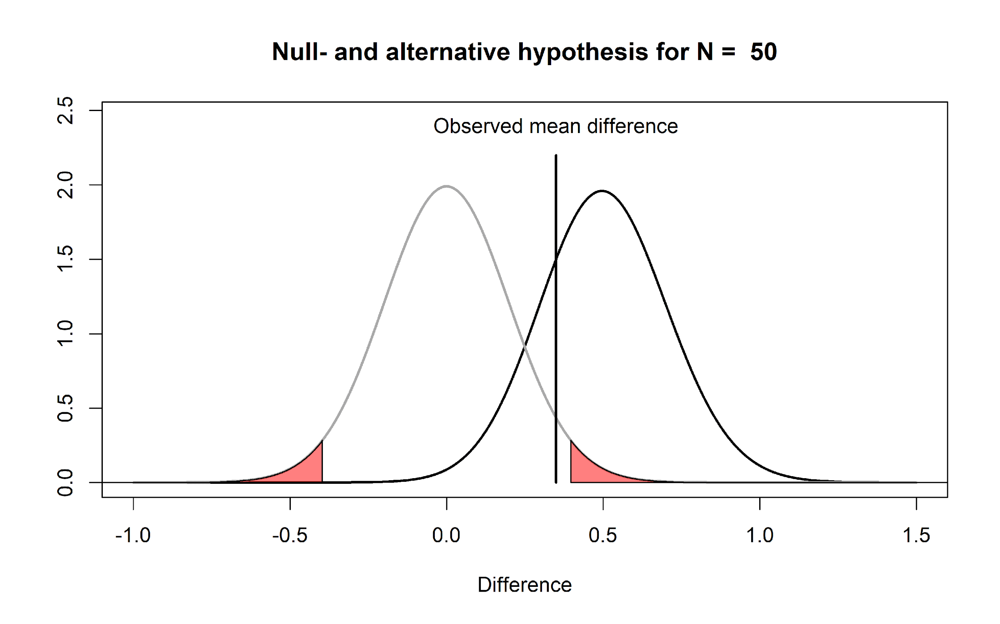
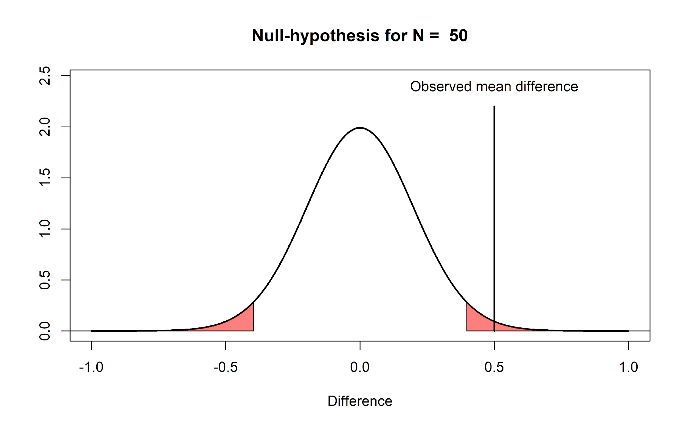
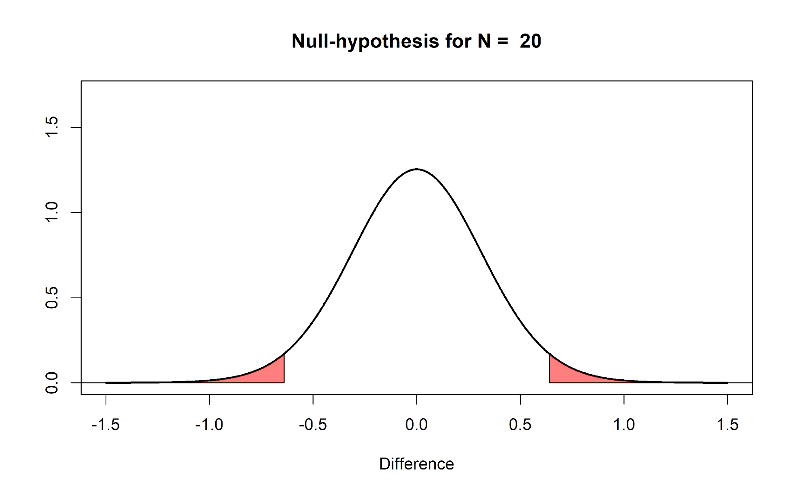

For decades statisticians have complained about how researchers misunderstand
*p*-values. Rozeboom (1997) has referred to null hypothesis significance testing
(NHST) as "surely the most bone-headedly misguided procedure ever
institutionalized in the rote training of science students" (p. 335). And still,
here we are, as part of your rote training, teaching you about *p*-values and
hypothesis tests.

One of the biggest problems with *p*-values is that the people who use them
typically don’t understand how to interpret *p*-values. I think one reason that
*p*-values are commonly misunderstood is that teachers rarely take enough time
to really explain what they mean. Some things aren’t easy to remember, like the
prepositions that have the 3rd (dative) case in German. When I was fifteen my
German teacher spent hours rhythmically tapping on his desk with his wedding
ring as students would, on each tap, recite ‘aus, bei, mit, nach, zeit, von,
zu’. I am now more than twice as old as when I learned these seven prepositions,
but I remember them to this day. If we expect people to truly understand what
*p-*values mean, we should probably repeatedly explain this until it clicks. So
here we go!

**A p-value is the probability of the observed data, or more extreme data, under
the assumption that the null hypothesis is true.** The goal of this assignment
is to understand what this means, and perhaps more importantly, what this
doesn’t mean. First, we need to know what ‘the assumption that the null
hypothesis is true’ looks like, and which data we should expect if the null
hypothesis is true. Although the null hypothesis can be any value, in this
assignment we will assume the null hypothesis is specified as a mean difference
of 0. For example, we might be interested in calculating the difference between
a control condition and an experimental condition on a dependent variable.

It is useful to distinguish the **null hypothesis** (the prediction that the
mean difference in the population is exactly 0) and the **null model** (a model
of the data we should expect when we collect data when the null hypothesis is
true). The null hypothesis is a point at 0, but the null model is a
distribution. It is visualized in textbooks or power analysis software using
pictures as you can see below, with *t*-values on the horizontal axis, and a
critical *t*-value somewhere between 1.96 – 2.00 (depending on the sample size).
This is done because the statistical test when comparing two groups is based on
the *t*-distribution, and the *p*-value is statistically significant when the
*t*-value is larger than a critical *t*-value.

I personally find things become a lot clearer if you plot the null model as mean
differences instead of *t*-values. So below, you can see a null model for the
mean differences we can expect when compare two groups of 50 observations where
the true difference between the two groups is 0, and the standard deviation is
in each group is 1[^1].

[^1]: Because the standard deviation is 1, you can also interpret the mean
differences as a Cohen’s *d* effect size. So this is also the distribution you
can expect for a Cohen's d of 0, when collecting 50 observations.

The first thing to notice is that we expect that the mean of the null model is
0. Looking at the x-axis, we see the plotted distribution is centered on 0. But
even if the mean difference in the population is 0 that does not imply every
sample we draw from the population will give a mean difference of exactly zero.
There is variation around the population value, as a function of the standard
deviation and the sample size.

The y-axis of the graph represents the **density**, which provides an indication
of the relative likelihood of measuring a particular value of a continuous
distribution. We can see that the most likely mean difference is the true
population value of zero, and that larger differences from zero become
increasingly less likely. The graph has two areas that are colored red. These
areas represent 2.5% of the most extreme values in the left tail of the
distribution, and 2.5% of the most extreme values in the right tail of the
distribution. Together, they make up 5% of the most extreme mean differences we
would expect to observe, given our number of observations, when the true mean
difference is exactly 0. When a mean difference in the red area is observed, the
corresponding statistical test will be **statistically significant at a 5% alpha
level**. In other words, not more than 5% of the observed mean differences will
be far enough away from 0 to be considered surprising. Because the null
hypothesis is true, observing a ‘surprising’ mean difference in the red areas is
a Type 1 error.

Let’s assume that the null model in the Figure above is true, and that we
observe a mean difference of 0.5 between the two groups. This observed
difference falls in the red area in the right tail of the distribution. This
means that the observed mean difference is *relatively* surprising, under the
assumption that the true mean difference is 0. If the true mean difference is 0,
the probability density functions shows that we should not expect a mean
difference of 0.5 very often. If we calculate a *p*-value for this observation,
it would be lower than 5%. The probability of observing a mean difference that
is at least far away from 0 as 0.5 (either to the left from the mean, or to the
right, when we do a two-tailed test) is less than 5%.

**Q1**: When the sample size in each group of an independent *t*-test is 50
observations (see the Figure above), which statement is correct?

A) The mean of the differences you will observe between the two groups is always
0.

B) The mean of the differences you will observe between the two groups is always
different from 0.

C) Observing a mean difference of +0.5 or -0.5 is considered surprising,
assuming the null hypothesis is true.

D) Observing a mean difference of +0.1 or -0.1 is considered surprising,
assuming the null hypothesis is true.

One reason why I prefer to plot the null model in raw scores instead of
*t*-values is that you can see how the null model changes when the sample size
increases. When we collect 5000 instead of 50 observations, we see the null
model is still centered on 0 – but in our null model we now expect most values
will fall very close around 0.

The distribution is much narrower because the distribution of mean differences
is based on the standard error of the difference between means. This value is
calculated based on the standard deviation and the sample size, as follows:

$$
\sqrt{\frac{\sigma_{1}^{2}}{n_{1}} + \frac{\sigma_{2}^{2}}{n_{2}}}
$$

This formula shows that the standard deviations of each group (σ) are squared
and divided by the sample size of that group, added together, after which the
square root is taken. The larger the sample size the bigger the number we divide
by, and thus the smaller standard error of the difference between means. In our
n = 50 example this is:

$$
\sqrt{\frac{1^{2}}{50} + \frac{1^{2}}{50}}
$$

The standard error of the differences between means is thus 0.2 for n = 50 in
each group, and for n = 5000 it is 0.02. Assuming a normal distribution 95% of
the observations fall between 1.96\*SE. So for 50 samples per group, the mean
differences should fall between -1.96 \* 0.2 = -0.392, and +1.96 \* 0.2 = 0.392,
and we can see the red areas start from approximately -0.392 to 0.392 for n =
50. For 5000 samples per group, the mean differences should fall between -1.96
\* 0.02, and +1.96 \* 0.02; in other words between -0.0392 to 0.0392 for n =
5000. Due to the larger sample size with n = 5000 observations per group, we
should expect to observe mean differences in our sample closer to 0 compared to
our null model when we had only 50 observations.

**Q2:** In what sense are the null models in the two previous figures (for n =
50 and n = 5000) similar, and in what sense are they different?

A) In both cases, the distributions are centered on zero, and the critical
*t*-value is between 1.96 and 2 (for a two-sided test, depending on the sample
size). But the larger the sample size, the closer to 0 the mean differences fall
that are considered ‘surprising’.

B) In both cases, a *t*-value of 0 is the most likely outcome, but the critical
*t*-value is around 0.4 for n = 50, and around 0.05 for n = 5000.

C) In both cases, means will vary in exactly the same way around 0, but the Type
1 error rate is much smaller when n = 5000 than when n = 50.

D) Because the standard error is much larger for n = 50 than for n = 5000, it is
much more likely that the null hypothesis is true for n = 50.

If we collected n = 5000, and we would again observe a mean difference of 0.5,
it should be clear that this same difference is even more surprising than it was
when we collected 50 observations. We are now almost ready to address common
misconceptions about *p*-values, but before we can do this, we need to introduce
a model of the data when the null is *not* true. If we are not sampling data
from a model where the true mean difference is 0, what does our alternative
model look like? Some software (such as g\*power, see the picture below) will
visualize both the null model (red curve) and the alternative model (blue curve)
in their output:

When we do a study, we rarely already know what the true mean difference is (if
we already knew, why would we do the study?). But let’s assume there is an
all-knowing entity. Following Paul Meehl, we will call this all-knowing entity
‘Omniscient Jones’. Before we collect our sample of 50 observations, Omniscient
Jones already knows that the true mean difference in the population is 0.5.
Again, we should expect some variation around 0.5 in this alternative model. The
figure below shows the expected data pattern when the null hypothesis is true
(now indicated by a grey line) and it shows an **alternative model**, assuming a
true mean difference of 0.5 exists in the population (indicated by a black
line).

But Omniscient Jones could have said the true difference was much larger. Let’s
assume we do another study, but now before we collect our 50 observations,
Omniscient Jones tells us that the true mean difference is 1.5. The null model
does not change, but the alternative model now moves over to the right.

You can play around with the alternative and null models in this online app:
<http://shiny.ieis.tue.nl/d_p_power/>. The app allows you to specify the sample
size in each group of an independent *t*-test (from 2 to infinity), the mean
difference (from 0 to 2), and the alpha level. In the plot, the red areas
visualize Type 1 errors. The blue area visualizes the Type 2 error rate (which
we will discuss below). The app also tells you the critical value: There is a
vertical line (with n = 50 this line falls at a mean difference of 0.4) and a
verbal label that says: “Effects larger than 0.4 will be statistically
significant”. Note that the same is true for effects smaller than -0.4, even
though there is no second label there, but the app shows the situation for a
two-sided independent *t*-test.

You can see that on the left of the vertical line that indicates the critical
mean difference there is a blue area that is part of the alternative model. This
is the Type 2 error rate (or 1 - the power of the study). If a study has 80%
power, 80% of the mean differences we will observe should fall on the right of
the critical value indicated by the line. If the alternative model is true, but
we observe an effect smaller than the critical value, the observed *p*-value
will be larger than 0.05, even when there is a true effect. You can check in the
app that the larger the sample size, the further to the right the entire
alternative distribution falls, and thus the higher the power. You can also see
that the larger the sample size, the narrower the distribution, and the less of
the distribution will fall below the critical value (as long as the true
population mean is larger than the critical value). Finally, the larger the
alpha level, the further to the left the critical mean difference moves, and the
smaller the area of the alternative distribution that falls below the critical
value.

The app also plots 3 graphs that illustrate the power curves as a function of
different alpha levels, sample sizes, or true mean differences. Play around in
the app by changing the values. Get a feel for how each variable impacts the
null- and alternative models, the mean difference that will be statistically
significant, and the Type 1 and Type 2 error rates.

**Q3:** Open the app, and make sure it is set to the default settings of a
sample size of 50 and an alpha level of 0.05. Look at the distribution of the
null model. Set the sample size to 2. Set the sample size to 5000. The app will
not allow you to plot data for a ‘group’ size of 1, but with n = 2 you will get
a pretty good idea of the range of values you can expect when the true effect is
0, and when you collect single observations (n = 1). Given your experiences with
the app as you change different parameters, which statement is true?

A) When the null hypothesis is true and the standard deviation is 1, if you
randomly take 1 observation from each group and calculate the difference score,
the differences will fall between -0.4 and 0.4 for 95% of the pairs of
observations you will draw.

B) When the null hypothesis is true and the standard deviation is 1, with n = 50
per group, 95% of studies where data is collected will observe in the long run a
mean difference between -0.4 and 0.4.

C) In any study with n = 50 per group, even when the SD is unknown and it is not
known if the null hypothesis is true, you should rarely observe a mean
difference more extreme than -0.4 or 0.4.

D) As the sample size increases, the expected distribution of means become
narrower for the null model, but not for the alternative model.

So far, several aspects of null models should have become clear. First of all,
the population value in a traditional null hypothesis is a value of 0, but in
any sample you draw, the observed difference falls in a distribution centered on
0, and will thus most often be slightly larger or smaller than 0. Second, the
width of this distribution depends on the sample size and the standard
deviation. The larger the sample size in the study, the narrower the
distribution will be around 0. Finally, when a mean difference is observed that
falls in the tails of the null model, this can be considered *surprising*. The
further away from the null-value, the more surprising this result is. But when
the null model is true, these surprising values will happen with a probability
specified by the alpha level (and are called Type 1 errors). Remember that a
Type 1 error occurs when a researcher concludes there is a difference in the
population, while the true mean difference in the population is zero.

**Q4:** Open the app once more with the default settings. Set the slider for the
alpha level to 0.01 (while keeping the mean difference at 0.5 and the sample
size at 50). Compared to the critical value when alpha = 0.05, which statement
is true?

A) Compared to an alpha of 0.05, only *less* extreme values are considered
surprising when an alpha of 0.01 is used, and only differences larger than 0.53
scale points (or smaller than -0.53) will now be statistically significant.

B) Compared to an alpha of 0.05, only *less* extreme values are considered
surprising when an alpha of 0.01 is used, and only differences larger than 0.33
scale points (or smaller than -0.33) will now be statistically significant.

C) Compared to an alpha of 0.05, only *more* extreme values are considered
surprising when an alpha of 0.01 is used, and only differences larger than 0.53
scale points (or smaller than -0.53) will be statistically significant.

D) Compared to an alpha of 0.05, only *more* extreme values are considered
surprising when an alpha of 0.01 is used, and only differences larger than 0.33
scale points (or smaller than -0.33) will now be statistically significant.

We are now finally ready to address some common misconceptions about *p*-values.
Let’s go through a list of common misconceptions that have been reported in the
scientific literature. Some of these examples might sounds like semantics. It is
easy to at first glance think that the statement communicates the right idea,
even if the written version is not formally correct. However, when a statement
is not formally correct, it is wrong. And exactly because people so often
misunderstand *p-*values, it is worth it to be formally correct about how they
should be interpreted.

**Misunderstanding 1: A non-significant p-value means that the null hypothesis
is true.**

A common version of this misconception is reading a sentence such as ‘because
*p* \> 0.05 we can conclude that there is no effect’. Another version of such a
sentence is ‘there was no difference, (*p* \> 0.05)’.

Before we look at this misconception in some detail, I want to remind you of one
fact that is easy to remember, and will enable you to recognize many
misconceptions about *p*-values: *p*-values are a statement about the
probability of **data**, not a statement about the probability of a
**hypothesis** or the probability of a **theory**. Whenever you see *p*-values
interpreted as a probability of a theory or a hypothesis, you know something is
not right. Examples of statements about a hypothesis are ‘The null hypothesis is
true’, or ‘The alternative hypothesis is true’, because both these statements
say that the probability that the null or alternative model is true is 100%. A
subtler version is a statement such as ‘the observed difference is not due to
chance’. The observed difference is only ‘due to chance’ (instead of due to the
presence of a real difference) when the null hypothesis is true, and as before,
this statement implies it is 100% probable that the null hypothesis is true.

When you conclude that ‘there is no effect’ or that ‘there is no difference’ you
are similarly claiming that it is 100% probable that the null hypothesis is
true. But since *p*-values are statements about the probability of data, you
should refrain from making statements about the probability of a theory solely
based on a *p*-value. That’s ok. *P*-values were designed to help you identify
surprising results from a noisy data generation process (aka the real world).
They were not designed to quantify the probability that a hypothesis is true.

Let’s take a concrete example that will illustrate why a non-significant result
does not mean that the null hypothesis is true. In the figure below, Omniscient
Jones tells us the **true mean difference is 0.5**. We can see this, because the
alternative distribution which visualized the probability of the mean
differences we should expect when the null hypothesis is true is centered on
0.5. We have **observed a mean difference of 0.35**. This value is not extreme
enough to be statistically different from 0. We can see this, because the value
does not fall within the red area of the null model (and hence, the *p*-value is
not smaller than our alpha level).

Nevertheless, we see that observing a mean difference of 0.35 is not only quite
likely given that the true mean difference is 0.5, but observing a mean
difference of 0.35 is much more likely under the alternative model, than under
the null model. You can see this by comparing the height of the density curve at
a difference of 0.35 for the null model, which is approximately 0.5, and the
height of the density curve for the alternative model, which is approximately
1.5.

All the *p*-value tells us is that a mean difference of 0.35 is not extremely
surprising, if we assume the null hypothesis is true. There can be many reasons
for this. In the real world, where we have no Omniscient Jones to tell us about
the true mean difference, it is possible that there is a true effect, as
illustrated in the figure above.

So what should we say instead? The solution is subtle, but important. Let’s
revisit the two examples of incorrect statements we made earlier. First,
‘because *p* \> 0.05 we can conclude that there is no effect’ is incorrect,
because there might very well be an effect (and remember *p*-values are
statements about data, not about the probability that there is an effect or is
no effect). Fisher’s interpretation of a *p*-value was that we can conclude a
rare event has happened, **or** that the null hypothesis is false (he writes
literally: “Either an exceptionally rare chance has occurred, or the theory of
random distribution is not true”). This might sound like it is a statement about
the probability of a theory, but it is really just stating the two possible
scenarios under which low *p*-values occur (when you have made a Type 1 error,
**or** when the alternative hypothesis is true). Both remain possible, and we do
not quantify the probability of either possible reality (e.g., we are not saying
it is 95% probable that the null hypothesis is false). From a Neyman-Pearson
perspective a *p* \> .05 means that we can not act as if the null hypothesis can
be rejected, without maintaining our desired error rate of 5%.

If you are interested in concluding an effect is absent, null hypothesis testing
is not the tool to use. A null hypothesis test answers the question ‘can I
reject the null hypothesis with a desired error rate’. If you can not do this,
and *p* \> 0.05, no conclusion can be drawn based only on the *p*-value
(remember the concept of 無 ‘mu’: the answer is neither yes nor no). Luckily,
statistical approaches have been developed to ask questions about the absence of
an effect such as equivalence testing, Bayes factors, and Bayesian estimation
(see Harms & Lakens, 2018, for an overview). In the assignment in week 6 we will
learn about equivalence tests in more detail.

The second incorrect statement was ‘there was no difference’’. This statement is
somewhat easier to correct. You can instead write ‘there was no **statistically
significant** difference’. Granted, this is a bit tautological, because you are
basically saying that the *p*-value was larger than the alpha level in two
different ways, but at least this statement is formally correct. The difference
between ‘there was no difference’ and ‘there was no statistically significant
difference’ might sound like semantics, but in the first case you are formally
saying ‘the difference was 0’ while in the second you are saying ‘there was no
difference large enough to yield a *p* \< .05’. Although I have never seen
anyone do this, a more informative message might be ‘because given our sample
size of 50 per group, and our alpha level of 0.05, only observed differences
more extreme than 0.4 could be statistically significant, and our observed mean
difference was 0.35, we could not reject the null hypothesis’. If this feels
like a very unsatisfactory conclusion, remember that a null hypothesis test was
not designed to draw interesting conclusions about the absence of effects – you
will need to learn about equivalence tests to get a more satisfactory answers
about null effects.

**Q5:** Why can’t you conclude that the null hypothesis is true, when you
observe a statistically non-significant *p*-value (*p* \> alpha)?

A) When calculating *p*-values you always need to take the prior probability
into account.

B) You need to acknowledge the probability that you have observed a Type 1
error.

C) The null hypothesis is never true.

D) You need to acknowledge the probability that you have observed a Type 2
error.

**Misunderstanding 2: A significant p-value means that the null hypothesis is
false.**

This is the opposite misconception from the one we discussed previously.
Examples of incorrect statements based on this misconception are ‘*p* \< .05,
therefore there is an effect’, or ‘there is a difference between the two groups,
*p* \< .05’. As before, both these statements imply it is 100% probable that the
null model is false, and an alternative model is true.

As a simple example of why such extreme statements are incorrect, imagine we
generate a series of numbers in R using the following command:

rnorm(n = 50, mean = 0, sd = 1)

This command generates **50 random observations** from a distribution with a
**mean of 0** and a **standard deviation of 1** (in the long run – the mean and
standard deviation will vary in each sample that is generated). Imagine we run
this command once, and we observe a mean of 0.5. The figure below visualizes
this scenario. We can perform a one-sample *t*-test against 0, and this test
tells us, with a *p* \< .05, that the data we have observed is surprisingly
different from 0, assuming the random number generator in R functions as it
should and generates data with a true mean of 0.

The significant *p*-value does not allow us to conclude that the null hypothesis
(“the random number generator works”) is false. It is true that the mean of the
50 samples we generated was surprisingly extreme. But a low *p*-value simply
tells us that an observation is *surprising*. We should observe such surprising
observations with a low probability when the null hypothesis is true – but they
still happen. Therefore, a significant result does not mean an alternative
hypothesis is true – the result can also be a Type 1 error, and in the example
above, Omniscient Jones knows that this is the case.

Let’s revisit the incorrect statement ‘*p* \< .05, therefore there is an
effect’. A correct interpretation of a significant *p*-value requires us to
acknowledge the possibility that our significant result might be a Type 1 error.
Remember that Fisher would conclude that “**Either an exceptionally rare chance
has occurred, or the theory of random distribution is not true**”. A correct
interpretation in terms of Neyman Pearson statistics would be: “**we can act as
if the null hypothesis is false, and we would not be wrong more than 5% of the
time in the long run**”. Note the specific use of the word ‘act’, which does not
imply anything about whether this specific hypothesis is true or false, but
merely states that if we act as if the null-hypothesis is false any time we
observe *p* \< alpha, we will not make an error more than alpha percent of the
time.

Both these formally correct statements are a bit long. In scientific articles,
we often read a shorter statement such as: ‘we can reject the null hypothesis’,
or ‘we can accept the alternative hypothesis’. These statements might be made
with the assumption that readers will themselves add ‘with a 5% probability of
being wrong, in the long run’. But it might be useful to add ‘with a 5% long run
error rate’ at least the first time you make such a statement in your article to
remind readers.

In the example above we have a very strong **subjective prior probability** that
the random number generator in R works. Alternative statistical procedures to
incorporate such prior beliefs are **Bayesian statistics** (week 2) or **false
positive report probabilities** (week 3). In frequentist statistics, the idea is
that you need to **replicate** your study several times. You will observe a Type
1 error every now and then, but you are unlikely to observe a Type 1 error three
times in a row. Alternatively, you can **lower the alpha level** in a single
study to reduce the probability of a Type 1 error rate.

**Q6:** Why can’t you conclude that the alternative hypothesis is true, when you
observe a statistically significant *p*-value (*p* \< alpha)?

A) When calculating *p*-values you always need to take the prior probability
into account.

B) You need to acknowledge the probability that you have observed a Type 1
error.

C) The alternative hypothesis is never true.

D) You need to acknowledge the probability that you have observed a Type 2
error.

**Misunderstanding 3: A significant p-value means that a practically important
effect has been discovered.**

A common concern when interpreting *p*-values is that ‘significant’ in normal
language implies ‘important’, and thus a ‘significant’ effect is interpreted as
an ‘important’ effect. However, **the question whether an effect is important is
completely orthogonal to the question whether it is different from zero, or even
how large the effect is**. Not all effects have practical impact. The smaller
the effect, the less likely such effects will be noticed by individuals, but
such effects might still have a large impact on a societal level. Therefore, the
general take home message is that **statistical significance does not answer the
question whether an effect matters in practice, or is ‘practically important’**.
To answer the question whether an effect matters, you need to present a
**cost-benefit analysis**.

This issue of practical significance most often comes up in studies with a very
large sample size. As we have seen before, with an increasing sample size, the
width of the density distribution around the null-value becomes more and more
narrow, and the values that are considered surprising fall closer and closer to
zero.

**Q7:** Go to the app: <http://shiny.ieis.tue.nl/d_p_power/>. Set the sample
size to 50000, the mean difference to 0.5, and the alpha level to 0.05. Which
effects will, when observed, be statistically different from 0?

A) Effects more extreme than -0.01 and 0.01

B) Effects more extreme than -0.04 and 0.04

C) Effects more extreme than -0.05 and 0.05

D) Effects more extreme than -0.12 and 0.12

If we plot the null model for a very large sample size (e.g., n = 10000 per
group) we see that even very small mean differences (differences more extreme
than a mean difference of 0.04) will be considered ‘surprising’. This still
means that if there really is no difference in the population, you will observe
differences larger than 0.04 less than 5% of the time, in the long run, and 95%
of the observed differences will be smaller than a mean difference of 0.04. But
it becomes more difficult to argue for the practical significance of such
effects. Imagine that a specific intervention is successful in changing people’s
spending behavior, and when implementing some intervention people save 12 cents
per year. It is difficult to argue how this effect will make any individual
happier. However, if this money is combined, it will yield over 2 million, which
could be used to treat diseases in developing countries, where it would have a
real impact. The cost of the intervention might be considered too high if the
goal is to make individuals happier, but it might be consider worthwhile if the
goal is to raise 2 million for charity.

Not all effects in psychology are additive (we can not combine or transfer an
increase in happiness of 0.04 scale points), so it is often more difficult to
argue for the importance of small effects in subjective feelings. A cost-benefit
analysis might show small effects matter a lot, but whether or not this is the
case can not be inferred from a *p*-value.

Note that nothing about this is a problem with the interpretation of a *p*-value
per se: A *p* \< 0.05 still correctly indicates that, if the null hypothesis is
true, we have observed data that should be considered surprising. However, just
because data is surprising, does not mean we need to care about it. It is mainly
the verbal label ‘significant’ that causes confusion here – it is perhaps less
confusing to think of a ‘significant’ effect as a ‘surprising’ effect, but not
necessarily as an ‘important’ effect.

**Misunderstanding 4: If you have observed a significant finding, the
probability that you have made a Type 1 error (a false positive) is 5%.**

This misinterpretation is one possible explanation of the incorrect statement
that a *p*-value is ‘the probability that the data are observed by chance.’
Assume we collect 20 observations, and Omniscient Jones tells us the null
hypothesis is true (as in the example above where we generated random numbers in
R). This means we are sampling from the distribution in the figure below.

If this is our reality, it means that 100% of the time that we observe a
significant result, it is a false positive (or Type I error). Thus, 100% of our
significant results are Type 1 errors.

It is important to distinguish probabilities **before** collecting the data and
analyzing the result, and probabilities **after** collecting data and analyzing
the results. What the Type 1 error rate controls, is that from all studies we
will perform in the **future** where **the null hypothesis is true**, not more
than **5%** of our observed mean differences will fall in the red tail areas.
But **after** we have seen that **our data falls in the tail areas with p \<
alpha**, and we know that the null hypothesis is true, these observed
significant effects are **always a Type 1 error**. If you read carefully, you
will notice that this misunderstanding is cause by differences in the question
that is asked. "**If I have observed a p \< .05, what is the probability that
the null hypothesis is true**?" is a different question than "**If the null
hypothesis is true, what is the probability of observing this (or more extreme)
data”**. Only the latter question is answered by a *p*-value. The first question
can not be answered without making a subjective judgment about the probability
that the null hypothesis is true prior to collecting the data (see the lectures
on **Bayesian statistics** in week 2).

**Q8:** Let’s assume that the random number generator in R works, and we use
rnorm(n = 50, mean = 0, sd = 1) to generate 50 observations, and the mean of
these observations is 0.5, which in a one-sample *t*-test yields a *p*-value of
0.03, which is smaller than the alpha level (which we have set to 0.05). What is
the probability that we have observed a significant difference (*p* \< alpha)
just by chance?

A) 3%

B) 5%

C) 95%

D) 100%

**Misunderstanding 5: One minus the p-value is the probability that the effect
will replicate when repeated.**

It is impossible to calculate the
[probability](https://www.ncbi.nlm.nih.gov/pubmed/21534683) that an effect will
replicate, based on only the *p*-value. The main reason for this is that we do
not know the true mean difference. If we were Omniscient Jones, and we knew the
true mean difference (e.g., a difference between the two groups of 0.5 scale
points) we would know the **statistical power** of our test. The statistical
power is the probability that we will find a significant result, if the
alternative model is true (i.e. if there is a true effect). For example, reading
the text in the left bar in the app, we see that with N = 50 per group, and
alpha level of 0.05, and a true mean difference of 0.5, the probability of
finding a significant result (or the statistical power) is 69.69%. If we would
observe a significant effect in this scenario (e.g., *p* = 0.03) it is not true
that there is a 97% probability that an exact replication of the study (with the
same sample size) would again yield a significant effect. **The probability that
a study yields a significant effect is determined by the statistical power** -
not by the *p*-value in a previous study.

What we can generally take away from this last misunderstanding is the fact that
the probability of replication depends on the presence versus the absence of a
true effect. In other words, as stated above, *if a true effect exists* then the
level of statistical power informs us about how frequently we should yield a
significant result (e.g., 80% power means we should observe significant result
80% of the time). On the other hand, *if the effect is null (or non-existent)*
then significant results will be observed only 5% of the time in the long run
(i.e. the Type 1 error rate given an alpha of 0.05). Therefore, *either* the
statistical power *or* the alpha level equals the probability of replication,
depending on if there *is* or *isn’t* a true effect.

  
**Q9:** Which statement is true?

A) The probability that a replication study will yield a significant result is
1-*p*.

B) The probability that a replication study will yield a significant result is
1-*p* multiplied by the probability that the null hypothesis is true.

C) The probability that a replication study will yield a significant result is
equal to the statistical power of the replication study (if there is a true
effect), or the alpha level (if there is no true effect).

D) The probability that a replication study will yield a significant result is
equal to the statistical power of the replication study + the alpha level.

**Conclusion**

Probabilities are confusing, and the interpretation of a *p*-value is not
intuitive. Instead of complaining that researchers don’t understand what
*p*-values mean, we should try to explain common misconceptions multiple times,
in multiple ways. I hope that working through this assignment has helped you. I
can also highly recommend the article on misunderstandings of p-values by
Greenland, Senn, Rothman, Carlin, Poole, Goodman, & Altman (2016). Let’s repeat
the main lessons in this assignment a final time by answering the following
questions, which you can now hopefully answer correctly!

**Q10:** Does a non-significant *p*-value (i.e., *p* = 0.65) mean that the null
hypothesis is true?

A) No - the result could be a Type 2 error, or a false negative.

B) Yes, because it is a true negative.

C) Yes, if the *p*-value is larger than the alpha level the null hypothesis is
true.

D) No, because you need at least two non-significant *p*-values to conclude the
null hypothesis is true.

**Q11:** What is a correct way to present a non-significant *p*-value (e.g., *p*
= 0.34 assuming an alpha level of 0.05 is used in an independent *t*-test)?

A) The null hypothesis was confirmed, *p* \> 0.05

B) There was no difference between the two conditions, *p* \> 0.05

C) The observed difference was not statistically different from 0.

D) The null hypothesis is true.

**Q12:** Does observing a significant *p*-value (*p* \< .05) mean that the null
hypothesis is false?

A) No, because *p* \< .05 only means that the alternative is true, not that the
null hypothesis is wrong.

B) No, because *p*-values are never a statement about the probability of a
hypothesis or theory.

C) Yes, because an exceptionally rare event has occurred.

D) Yes, because the difference is statistically significant.

**Q13:** Is a statistically significant effect always a practically important
effect?

A) No, because in extremely large samples, extremely small effects can be
statistically significant, and small effects are never practically important.

B) No, because the alpha level could in theory be set to 0.20, and in that case
a significant effect is not practically important.

C) No, because how important an effect is depends on a cost-benefit analysis,
not on how surprising the data is under the null hypothesis.

D) All of the above are true.

**Q14:** What is the correct definition of a *p*-value?

A) A *p*-value is the probability that the null hypothesis is true, given data
that is as extreme or more extreme than the data you have observed.

B) A *p*-value is the probability that the alternative hypothesis is true, given
data that is as extreme or more extreme than the data you have observed.

C) A *p*-value is the probability of observing data that is as extreme or more
extreme than the data you have observed, assuming the alternative hypothesis is
true.

D) A *p*-value is the probability of observing data that is as extreme or more
extreme than the data you have observed, assuming the null hypothesis is true.

**References**

Harms, C., & Lakens, D. (2018). Making “Null Effects” Informative: Statistical
Techniques and Inferential Frameworks. PsyArXiv.
<https://doi.org/10.17605/OSF.IO/48ZCA>

Greenland, S., Senn, S. J., Rothman, K. J., Carlin, J. B., Poole, C., Goodman,
S. N., & Altman, D. G. (2016). Statistical tests, P values, confidence
intervals, and power: a guide to misinterpretations. European Journal of
Epidemiology, 31(4), 337–350. <https://doi.org/10.1007/s10654-016-0149-3>

Daniel Lakens, 2018

This work is licensed under a [Creative Commons
Attribution-NonCommercial-ShareAlike 4.0
License](http://creativecommons.org/licenses/by-nc-sa/4.0/).
