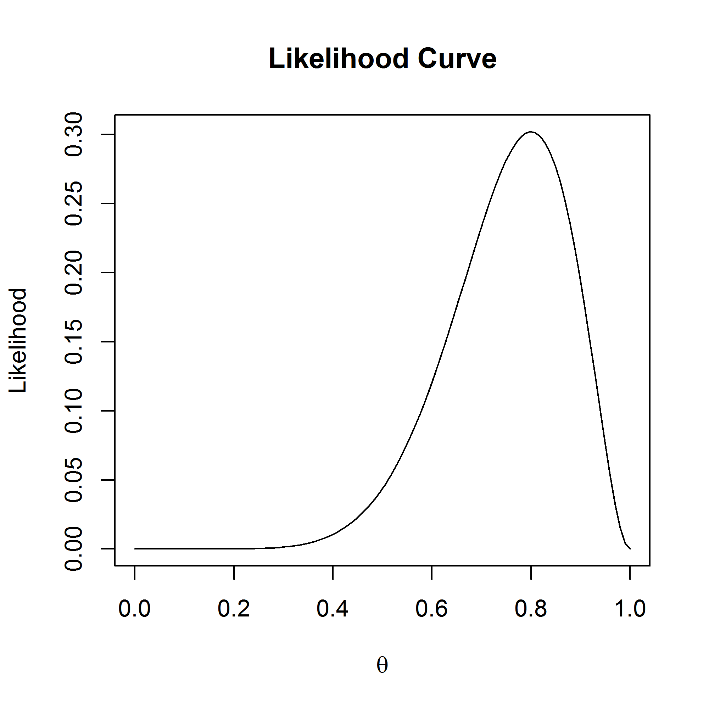
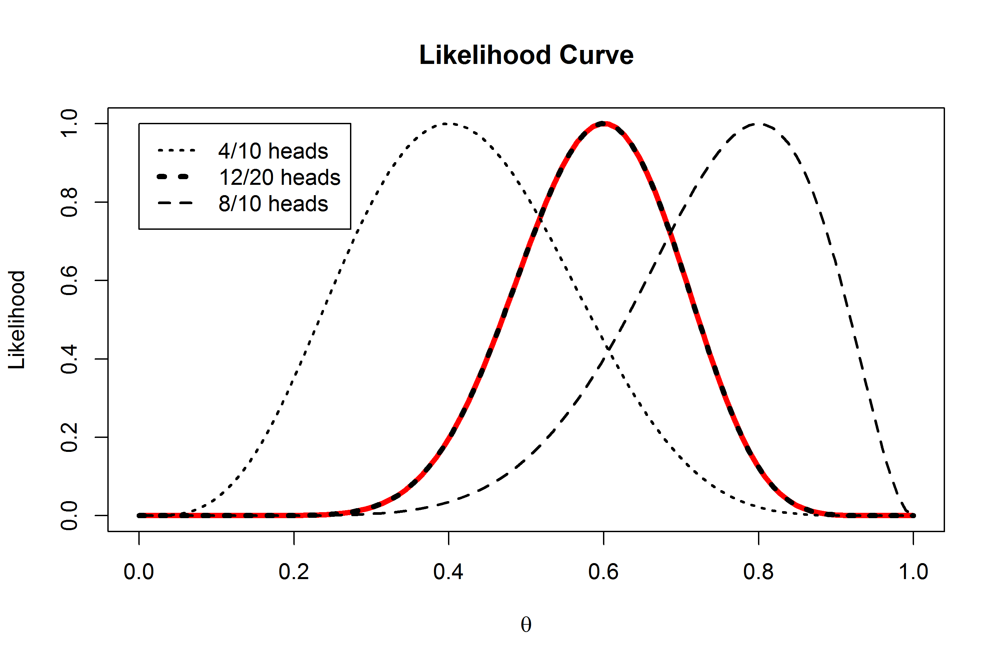
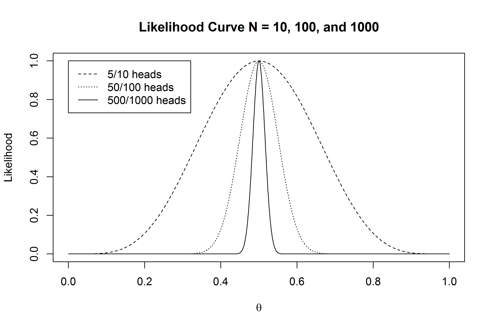
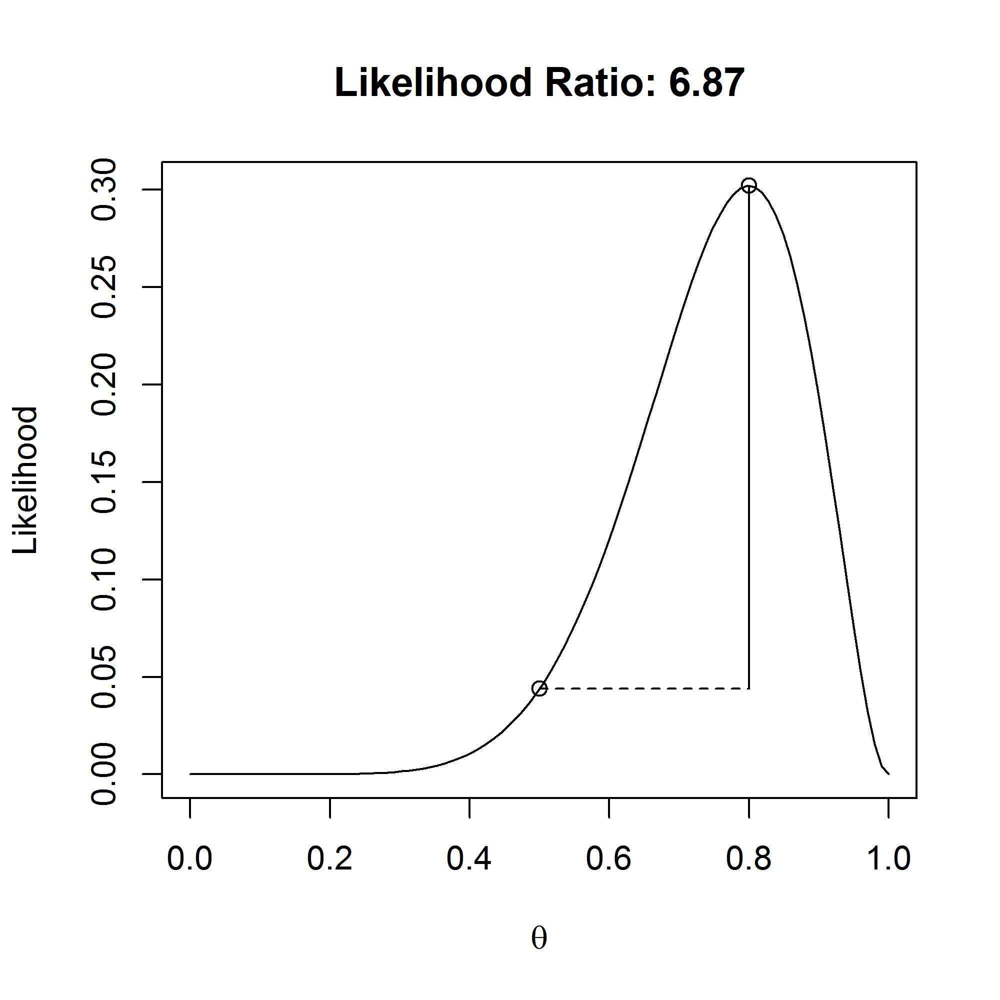
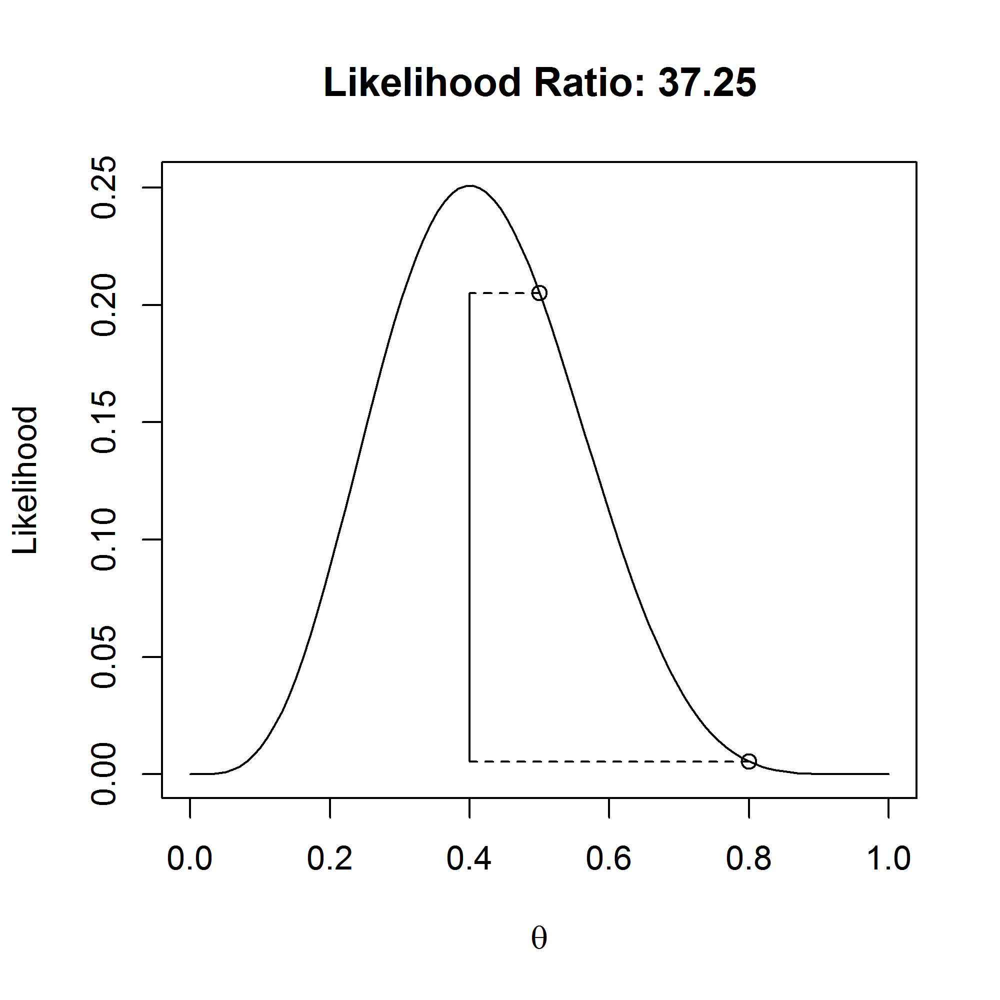
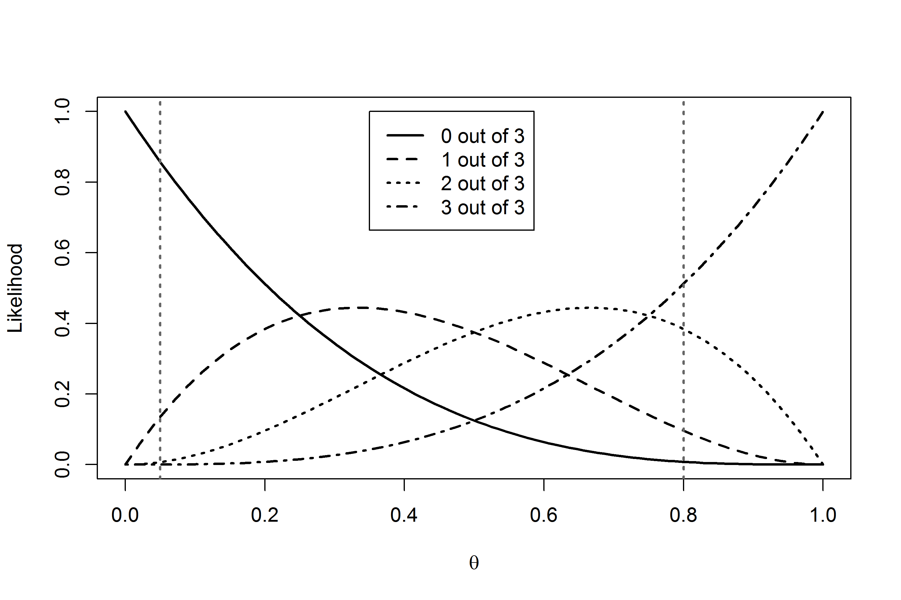
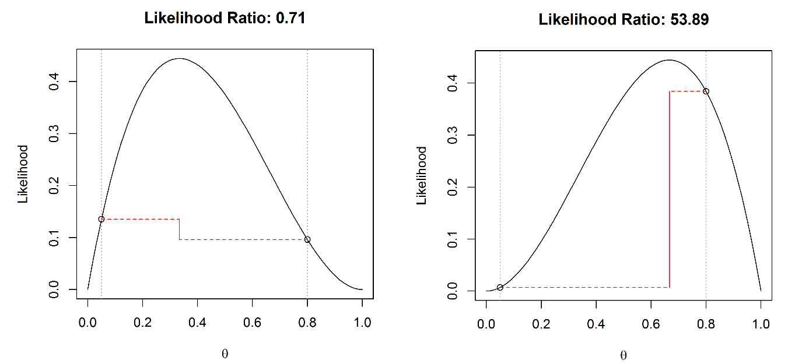

*Most information in this exercise comes from Yudi Pawitan’s book ‘In all
likelihood: Statistical modelling and inference using likelihood’ and Alex Etz’s
blog posts on*
[likelihoods](http://alexanderetz.com/2015/04/15/understanding-bayes-a-look-at-the-likelihood/)*.*

Likelihood approaches to statistical inferences can be seen as a third way to
draw inferences from data, separate from Frequentist and Bayesian statistics. At
the same time, likelihood functions are an important part of Bayesian
statistics, so a better understanding of likelihoods will also make it easier to
understand Bayesian statistics later. Where Frequentist and Bayesian statistics
only allow probability-based inferences, the likelihood approach suggests that
inference is possible directly from the likelihood function.

We can use likelihood functions to say something about unknown quantities. Let’s
imagine you flip a coin 10 times, and it turns up heads 8 times. What is the
true probability (which we will indicate by the Greek letter theta, θ) of this
coin landing on heads?

The **binomial probability** of observing *x* successes in *n* studies is:

$$
P\left( \theta;x \right) = \frac{n!}{x!\left( n - x \right)!}*\theta^{x}*{(1 - \ \theta)}^{n - x}
$$

where θ is the probability of a success. The first term indicates the number of
possible combinations of results (e.g., you could start out with eight
successes, end with eight successes, or any of the other possible combinations),
which is multiplied by the probability of observing one success in each of the
trials, which is then multiplied by the probability of observing no success in
the remaining trials.

Q1: Let’s assume you expect this is a fair coin. What is the binomial
probability of observing 8 heads out of 10 coin flips, when θ = 0.5?

A) 0.044

B) 0.05

C) 0.5

D) 0.8

Let’s assume we don’t have any other information about this coin. (You might
believe most coins are fair; such priors will be discussed when we talk about
Bayesian statistics). The equation P(θ;x) gives the probability of observing x
successes from n trials when a coin’s probability of success is θ. Based on the
data we have observed, we can ask the question: which value of θ will make the
observed data **most likely**? To answer this question, we can plug in the
values for x and n into P(θ) and then find which value of θ maximizes this
function. Fisher calls this maximum likelihood estimation, and published it when
he was 22 as a third year undergraduate (in addition to contributing to a huge
number of areas in statistics, he is also one of the greatest biologists since
Darwin). Since θ can be any value between 0 and 1, we can plot all values in
what is known as the *likelihood curve*, so we can see the maximum more easily.

All possible values for *θ* from 0 to 1 are on the x-axis, and the likelihood
function P(θ;x) is on the y-axis. It should not be surprising that the best
guess we have is that the true parameter is 8 out of 10, or θ = 0.8, with a
likelihood function value of 0.30 (the highest point on the y-axis). It is
important to know that the value of the likelihood itself has no meaning in
isolation. In this sense, it differs from a probability. The likelihood of 0.30
does not mean much in isolation, but we can compare likelihoods of the same
curve, and compare different values of θ. You can read off any other value for
any other θ, and see that for low values (e.g., 0.2), our observed data are not
very likely.

Probabilities and likelihoods are related, but different. Note how the equation
for P involves both information about the data (x, n) and information about the
parameter (θ). To compute a **probability**, we view θ as fixed (for instance,
for a fair coin, we plug in θ=.5) and then estimate the probability of different
outcomes (x, n). The resulting function is the probability mass function. To
compute **likelihood**, we instead view our data as fixed (e.g., observing 5
heads out of 10 coin tosses), and we view P as a function of theta, estimating
the value that maximizes the likelihood of our particular sample.

Likelihoods are an example of statistical inference: We have observed some data,
and we use this data to draw an inference about different parameters. More
formally, the likelihood function is the (joint) density function evaluated at
the observed data. Likelihood functions can be calculated for many different
models (binomial distributions, normal distributions, etc., see Millar, 2011).

Q2: The likelihood curve rises up and falls down, except at the extremes, when 0
heads or only heads are observed. Open the PlotLikelihood.R script, and plot the
likelihood curves for 0 heads by changing the number of successes in line 3 to
0, and running the script. What does the likelihood curve look like?

A) The likelihood curve is a horizontal line.

B) The script returns and error message: it is not possible to plot the
likelihood curve for 0 heads.

C) The curve starts at its highest point at θ = 0, and then the likelihood
decreases as θ increases.

D) The curve starts at its lowest point at θ = 0, and then the likelihood
increases as θ increases.

Likelihoods can easily be combined. Imagine we have two people flipping the same
coin independently. One person observes eight heads out of 10 flips, and the
other observes 4 heads out of 10 flips. You might believe that this should give
the same likelihood curve as one person flipping a coin 20 times, and observing
12 heads, and indeed, it does. In the plot below, all likelihood curves are
standardized by dividing the curve by the maximum of each likelihood curve. This
is why all curves now have a maximum of 1, and we can more easily compare
different likelihood curves.

The curve on left is for 4 out of 10 heads, the one on the right is for 8 out of
10 heads. The black dotted curve in the middle is for 12 out of 20 heads. The
red curve, exactly underneath the 12 out of 20 heads curve, is calculated by
multiplying the likelihood curves: L(θcombined) *=* L(θ = 0.8) \* L(θ = 0.4). In
the plot below, you can see that multiplying the likelihood curves for 4/10
heads and 8/10 heads (the red line) gives the same likelihood curve as that of
12/20 heads (black dotted line).

In the plot below, 10, 100, and 1000 coin flips are plotted, which yield 5, 50,
and 500 heads, respectively. The likelihood curves are again standardized to
make them more easily comparable. As the sample size increases, the curves
become more narrow (the dashed line is for *n* = 10, the dotted line is for *n*
= 100, and the solid line is for *n* = 1000). This means that as the sample size
increases, our data become increasingly less likely under any other distribution
but one where the true value is is θ=0.5. Or, in other words, we have collected
increasingly strong evidence for θ = 0.5, compared to most other possible
values.

We can use the likelihood to compare possible values of θ. For example, we might
believe the coin we flipped was fair, even though we flipped eight out of ten
heads. A fair coin will have θ = 0.5, while we observed θ = 0.8. The likelihood
tells us the relative preference we might have for different possible
parameters. How much more likely is our observed data under the hypothesis that
this is an unfair coin that will on average give heads 80% of the time, compared
to the alternative theory that this is a fair coin which should give heads 50%
of the time?

We can calculate the likelihood ratio:

$$
\frac{L(\theta = 0.8)}{L(\theta = 0.5)}
$$

Which is 0.302/0.044=6.87. In the plot below, both circles show the points on
the likelihood curve for L(θ = 0.5) and L(θ = 0.8).

We can subjectively interpret this likelihood ratio, which tells us an unfair
coin that our observed data is 6.87 times more likely under the hypothesis that
this coin will give 80% heads than under the hypothesis that this is a fair
coin. How convincing is this? Let’s round the likelihood ratio to 7, and imagine
two bags of marbles. One bag contains 7 blue marbles. The second contains 7
marbles, each one a different color of the rainbow, so violet, indigo, blue,
green, yellow, orange, and red. Someone randomly picks one of the two bags,
draws a marble, and shows it to you. The marble is blue: How certain are you
this marble came from the bag with all blue marbles, compared to the bag with
rainbow coloured marbles? This is how strong the likelihood ratio tells us to
believe our data were generated by an unfair coin with 80% heads is over a fair
coin with 50% heads, given that we have flipped 8 heads in 10 tosses.

Note that likelihood ratios give us the relative evidence for one specified
hypothesis, over another specified hypothesis. The likelihood ratio can be
calculated for any two hypothesized values. For example, in the graph below, the
likelihood ratio is calculated that compares the hypothesis for a fair coin (θ =
0.5) with the alternative hypothesis that the coin produces 80% heads (θ = 0.8),
when we have observed 4 heads out of 10 coin flips. We see that the observed
data are 0.2050/0.0055=37.25 times more likely (ignoring rounding differences –
and try to calculate these numbers by hand using the formula on page 1) under
the hypothesis that this is a fair coin is than under the hypothesis that this
is a coin that gives 80% heads.

A likelihood ratio of 1 means the data are equally likely under both hypotheses.
Values further away from 1 indicate that the data are more likely under one
hypothesis than the other. The ratio can be expressed in favor of one hypothesis
over the other (for example L(θ = 0.5)/L(θ = 0.8) or vice versa (L(θ = 0.8)/[L(θ
= 0.5). This means the likelihood ratio of 37.25 is equivalent to a likelihood
ratio of 1/37.25 = 0.02685. Likelihood ratios range from 0 to infinity, and the
closer to zero or infinity, the stronger the relative evidence for one over the
other. We will later see that likelihood ratios are a special case of a more
general statistic called a Bayes Factor.

Q3: Get a coin out of your wallet. Flip it 13 times, and count the number of
heads. Open the R file CalculateLikelihoodRatio.R to calculate the likelihood of
your observed results under the hypothesis that your coin is fair, compared to
the hypothesis that the coin is not fair. In line 3, set the number of successes
to the number of heads you observed. In line 5, change the 0 in 0/13 to the
number of heads you have observed (or leave it to 0 if you didn’t observe any
heads at all!). Run the script to calculate the likelihood ratio. What is the
likelihood ratio of a fair compared to a non-fair coin (or H0/H1) that flips
heads as often as you have observed, based on the observed data? Round your
answer to 2 digits after the decimal.

Earlier we mentioned that with increasing sample sizes, we had collected
stronger relative evidence. Let’s say we would want to compare L(θ = 0.4) with
L(θ = 0.5).

Q4: What is the likelihood ratio for 5 out of 10 heads?

Q5: What is the likelihood ratio for 50 out of 100 heads?

Q6: What is the likelihood ratio for 500 out of 1000 heads?

Likelihoods are relative evidence. Just because the data are more likely under
one possible value of θ than another value, doesn’t mean that the data have come
from either of these two distributions. Other values might generate even higher
likelihood values. For example, consider the situation where we flip a coin 100
times, and observe 50 heads. We compare θ = 0.3 versus θ = 0.8, and find that
the likelihood ratio is 803462, implying that there is 803461 times more
evidence in the data for θ = 0.3 than for θ = 0.8. That might sound pretty
conclusive evidence for θ = 0.3. But it is only relative evidence for θ = 0.3
compared to θ = 0.8. If we look at the likelihood function, we clearly see that,
not surprisingly, θ = 0.5 is the value that maximizes the likelihood function
(you can recreate this plot in R if you want to). The likelihood function will
always peak at the observed sample proportion.

Q7: When comparing two hypotheses (*θ* = X vs *θ* = Y), a likelihood ratio of:

A) 0.02 means that there is not enough evidence in the data for either of the
two hypotheses.

B) 5493 means that hypothesis θ = X is most supported by the data.

C) 5493 means that hypothesis θ = X is much more supported by the data than θ =
Y.

D) 0.02 means that the hypothesis that the data are 2% more likely under the
hypothesis that θ = X than under the hypothesis that θ = Y.

**Likelihoods of sets of studies**

Let’s imagine we have two bags. There are twenty marbles in each bag. In one
bag, we know there are 19 blue marbles, and one red marble. The red marble
represents a Type 1 error, the blue marbles represent true negatives, and this
bag represents a situation where we perform a statistical test where the
null-hypothesis is true. In the other bag, there is a number of blue and red
marbles. The red marbles represent true positives, blue marbles represent false
negatives, and this bag represents a situation where the alternative hypothesis
is true. We don’t know the true power, or the percentage of red marbles, but we
can make a guess. For example, we might believe 16 out of 20 (or 80%) of the
marbles are red.

We perform 3 studies, by drawing a marble three times (with replacement) from
one of the two bags. We don’t know which of the bags we are drawing from. We
could be drawing from the bag where the null hypothesis is true or the bag where
the alternative hypothesis is true. There are 4 possible outcomes. Either 0 out
of 3, 1 out of 3, 2 out of 3, or 3 out of 3 red balls are drawn. We can plot
these four likelihood curves (see the figure below – you can plot these curves
one at a time using the R script).

Each curve has the maximum likelihood estimate at the outcome: θ = 0 for 0 out
of 3 red balls, θ = 0.33 for 1 out of 3, θ = 0.66 for 2 out of 3, and θ = 1 from
3 out of 3. We know that for the bag where the null hypothesis is true, θ =
0.05, or the Type 1 error rate. If we believe our studies would have 80% power
when the alternative hypothesis is true, we can assume θ = 0.8. In the plot
below, we see the four likelihood curves, and two vertical lines at θ = 0.05 and
θ = 0.8.

We can calculate likelihood ratios for θ = 0.05 vs. θ = 0.80 for the different
outcomes. Below, the likelihood ratios are visualized for 1 out of 3 and 2 out
of 3 red balls, or significant results. We see that only 1 out of 3 findings
(below, left) is slightly more likely when the null hypothesis is true, but the
likelihood ratio of 0.71 is not very far from 1. However, with 2 out of 3
significant results (below, right), it is clear that this result is much more
likely when studies are performed with 80% power than if we assume we observed
two out of three Type 1 errors. Indeed, when two out of three studies are
significant, the likelihood ratio provides pretty strong relative evidence for a
situation where the alternative hypothesis is true, even when the assumed power
is much lower.

Although we can’t formally evaluate the probability that the alternative
hypothesis is true based on these likelihood ratios (we instead need Bayesian
statistics), we can see that when multiple studies are performed, but not all
studies are statistically significant, we are gathering more and more evidence
for the hypothesis that a true effect is examined, rather than that all
significant studies are Type 1 errors.

The graphs above with the four likelihood curves also shows when a researcher is
more likely to observe mixed results than consistent results. This occurs for
all values of θ where the likelihood curve for mixed results is higher than the
likelihood curves for 0 out of *n*, or *n* out of *n* significant results. More
formally, mixed results are more likely than consistent results when power drops
below *n*/(*n*+1) percent, or increases above 1-(*n*/(*n*+1)). For example, when
performing three studies, it is more likely to observe mixed results than only
significant or only non-significant effects when power is lower than
3/(3+1)=0.75, and higher than 1-(3/(3+1))=0.25.

We have seen how likelihood functions allow us to evaluate the relative
likelihood of the data we have collected under different possible true values of
the parameter (or different hypotheses). In this assignment, we have focused on
binomial likelihoods, but likelihood functions exist for many different
distributions (e.g., Poisson, normal, etc.). We have applied this basic
understanding of binomial likelihoods to the likelihood that a set of studies
with mixed results (e.g., 2 out of 3 significant results) occurs when we are
making Type 1 errors compared to when we have a specific level of power. We will
continue using binomial likelihoods when we learn about Bayesian statistics.

© Daniel Lakens, 2016. This work is licensed under a [Creative Commons
Attribution-NonCommercial-ShareAlike 4.0
License](http://creativecommons.org/licenses/by-nc-sa/4.0/)
