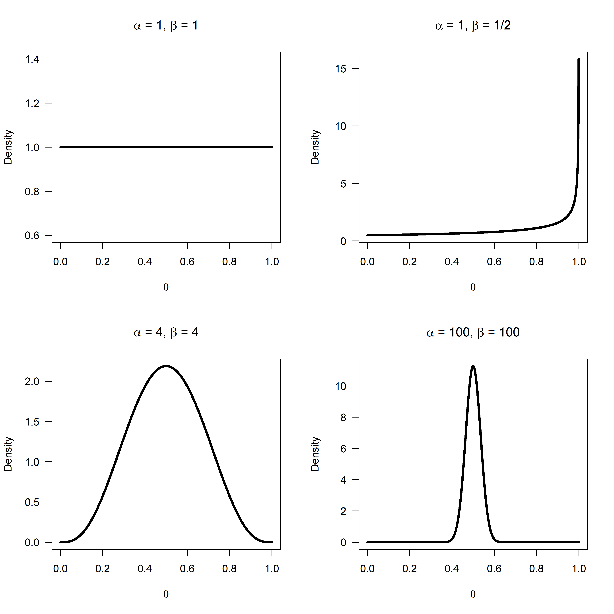
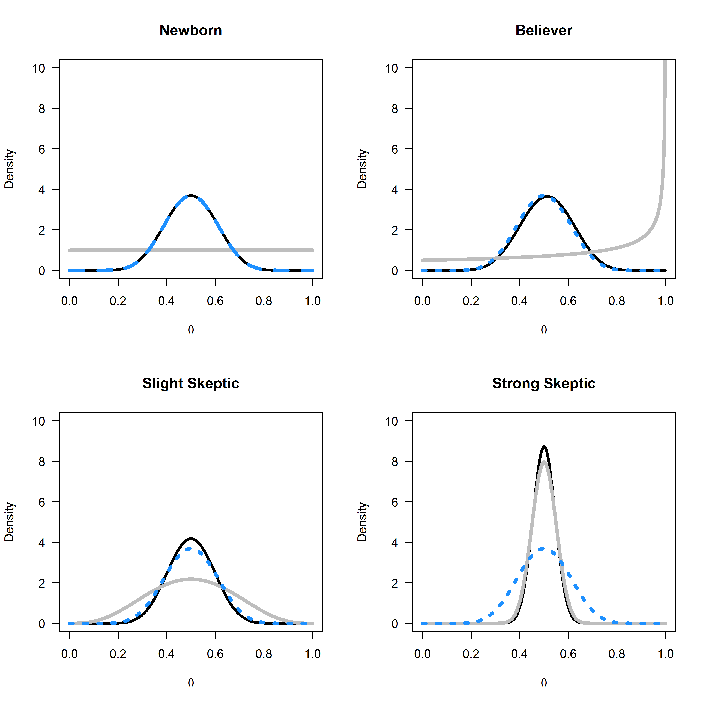
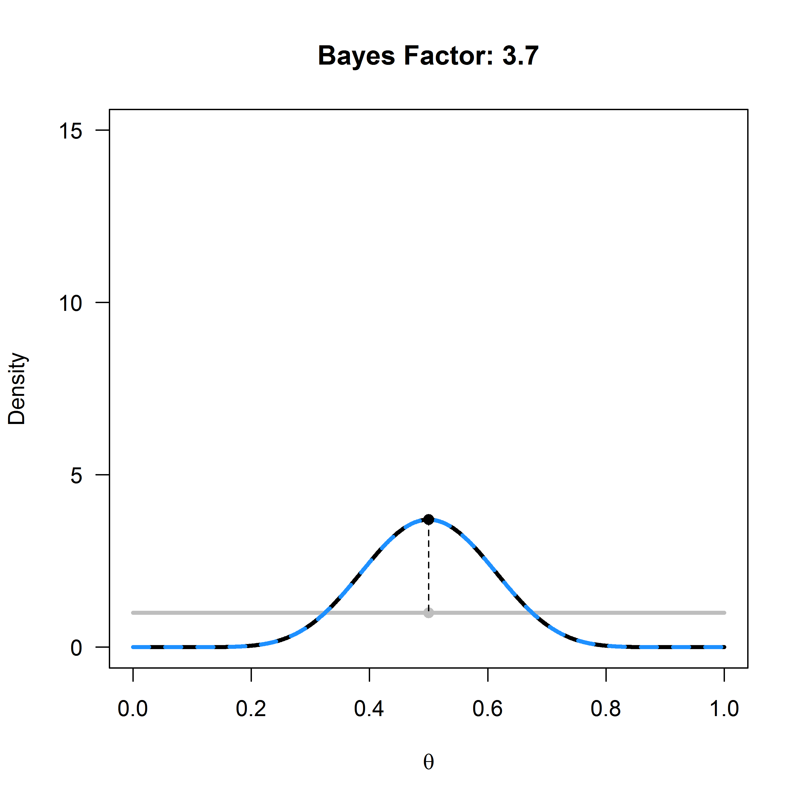
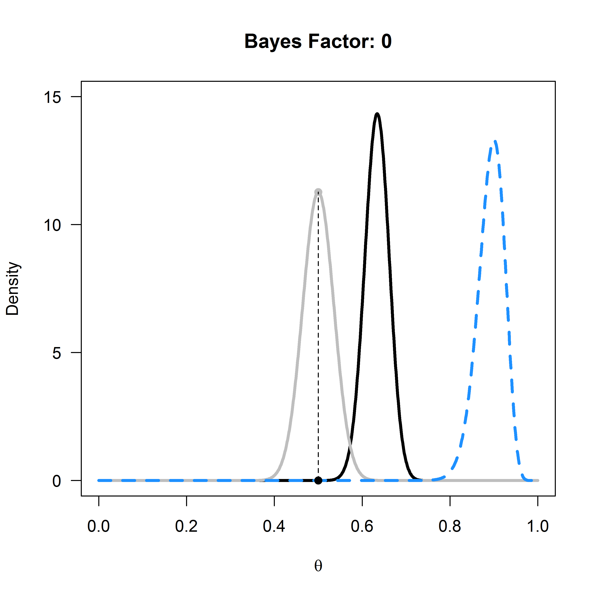
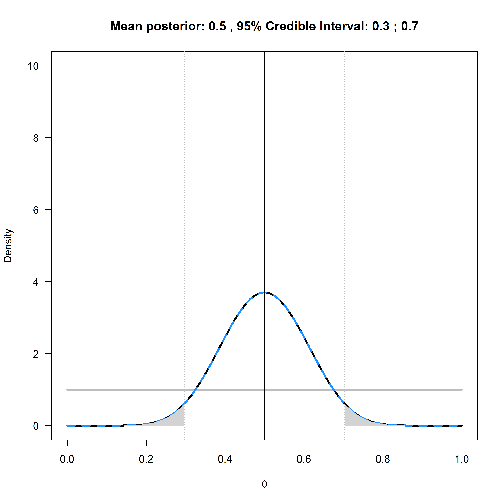

*Most information in this exercise comes Simon Jackman’s book ‘ Bayesian
Analysis for the Social Sciences’, Lee & Wagenmakers course on* [Bayesian
cognitive modeling](https://bayesmodels.com/)*, Alex Etz’s blog post on*
[updating priors via the
likelihood](http://alexanderetz.com/2015/07/25/understanding-bayes-updating-priors-via-the-likelihood/)*,
Jim Granges’ blog post on* [(pesky?)
priors](https://jimgrange.wordpress.com/2016/01/18/pesky-priors/)*.*

When we do research, we often start with a prior belief that a hypothesis is
true. Then, we collect data, and we use this data to update our belief that a
theory is true. Bayesian statistics allows you to update prior beliefs into
posterior probabilities in a logically consistent manner. Before we have
collected data, the **prior odds** of Hypothesis 1 (H1) over the null-hypothesis
(H0) are P(H1)/P(H0), After we have collected data, we have the **posterior
odds** P(H1\|D)/P(H0\|D), which you can read as the probability of H1, given the
data, divided by the probability of H0, given the data. There are different
approaches to Bayesian statistics. In this assignment we will first discuss
Bayes factors, and then Bayesian estimation.

**Bayes factor**

One approach in Bayesian statistics focusses on the comparison of different
models that might explain the data (referred to as **model comparison**). In
Bayesian statistics, the probability of data under a specified model (D\|P(H0)
is a number that expressed what is sometimes referred to as the absolute
**evidence**, and more formally referred to as a marginal likelihood. The
marginal likelihood uses prior probabilities to average the likelihood across
the parameter space. For example, assume we have a simple model *M* that is
based on a single parameter, that can take on two values, X and Y, and that
a-prior we believe the probability of both values is p(X) = 0.4 and p(Y) = 0.6.
We collect data, and calculate the likelihood for both these parameter values,
which is p(D\|X) = 0.02 and p(D\|Y) = 0.08. The marginal likelihood of our model
*M* is then P(D\|M) = 0.4 × 0.02 + 0.6 × 0.08 = 0.056. Most often, models have
continuously varying parameters, and the marginal likelihood formula is based on
an integral, but the idea remains the same.

When comparing models, we do not use the absolute evidence for a model, but the
relative evidence for models we are comparing. The relative evidence is
calculated by dividing the marginal likelihood for one model by the marginal
likelihood for another model, and this ratio of relative evidence based on these
marginal likelihoods is called the **Bayes factor**. The Bayes factor represents
how much we have updated our beliefs, based on observing the data. We can
express Bayes factors to indicate how much more likely H1 is given the data
compared to H0 (often indicated by B10) or as how much more likely H0 has become
compared to H1 (B01), and B10 = 1/B01. Similar to likelihood ratios, a Bayes
factor of 1 did not change our beliefs for one model compared to the other
model. A very large Bayes factor for H1 over H0 has increased our belief in H1,
and a Bayes Factor close for H1 over H0 to 0 has increased our belief in H0. If
our prior belief in H1 was very, very low (e.g., your belief in unicorns) even a
large Bayes factor that supports the presence of a unicorn might not yet
convince you that unicorns are real – but you have updated your belief in
unicorns, and now believe they are at least more likely then they were before
(even if you still think unicorns are very unlikely to exist). The contribution
of the Bayes Factor and the prior in calculating the posterior odds is clear in
the following formula:

$$
\frac{P(H1|D)}{P(H0|D)} = \ \frac{P(D|H1)}{P(D|H0)}\  \times \ \frac{P(H1)}{P(H0)}
$$

$$
Posterior\ Probability = \ Bayes\ Factor\  \times \ Prior\ Probability
$$

A Bayesian analysis of data requires specifying the prior. Here, we will
continue our example based on a binomial probability, such as a coin flip. In
the likelihood example, we compared two point hypotheses (e.g., θ = 0.5 vs. θ =
0.8). In Bayesian statistics, parameters are considered to be random variables,
and the uncertainty or degree of belief with respect to the parameters is
quantified by **probability distributions**.

A binomial probability lies between 0 and 1. You could draw any probability
density you want over 0 and 1, and turn it into a prior, but for good reasons
(simplicity, mostly) a beta-prior is often used for binomial probabilities. The
shape of the beta-prior depends on two parameters, α and β. Note that these are
the same Greek letters as used for the Type 1 error rate and Type 2 error rate,
but that is purely coincidental! The α and β in binomial probabilities are
unrelated to error rates, and the use of the same letters is mainly due to a
lack of creativity among statisticians and the limited choice the alphabet gives
us. It also does not help that β is one of the parameters of the Beta
distribution. Try to keep these different Beta’s apart! The probability density
function is:

$$
\int_{}^{}{\left( x,\ \alpha,\ \beta \right) = \ \frac{1}{B(\alpha,\beta)}}x^{\alpha - 1}{(1 - x)}^{\beta - 1}
$$

where *B(α, β)* is the beta function. Understanding the mathematical basis of
this function is beyond the scope of this assignment, but you can read more on
[Wikipedia](https://en.wikipedia.org/wiki/Beta_distribution) or in [John
Kruschke](https://sites.google.com/site/doingbayesiandataanalysis/)’s book if
interested. The beta-prior for a variety of values for α and β can be seen in
the figure below.

These beta densities reflect different types of priors. Let’s assume you are
approached by a street merchant who tries to sell you a special coin with heads
and tails that, when flipped, will almost always turn up heads. The α = 1, β = 1
prior is what a newborn baby would have as a prior, without any idea of what to
expect when you flip a coin, and thus every value of θ is equally likely. The α
= 1, β = 1/2 prior is what a true believer would have as a prior. The sales
merchant tells you the coin will turn up heads almost every time, and thus, you
believe it will turn up heads almost every time. The α = 4, β = 4, and the α =
100, β = 100 priors are for slightly and extremely skeptical people. With an α =
4, β = 4 prior, you expect the coin will be fair, but you are willing to believe
a wide range of other true values is possible (the curve is centered on 0.5, but
the curve is wide, allowing for very high and low values of θ). With the α =
100, β = 100 prior you are really convinced coins are fair, and believe there
will be only a very slight bias, at most (the curve is again centered on 0.5,
and a skeptic believes the θ will lie between 0.4 and 0.6 – a much narrower
range compared to the slightly skeptic individual).

Let’s assume the newborn baby, the true believer, the slightly skeptic and the
extreme skeptic all buy the coin, flip it n = 20 times, and observe x = 10
heads. This outcome can be plotted as a binomial distribution with 10 heads out
of 20 trials, or as a Beta(11, 11) distribution.

The newborn baby had a prior Beta distribution with α = 1 and β = 1, which
equals a binomial likelihood distribution for 0 heads out of 0 trials. The
posterior is a Beta distribution with Beta(α\*, β\*), where:

α\* = α + x = 1 + 10= 11

β\* = β + n – x = 1 + 20 – 10 = 11

Or calculating these values more directly from the α and β of the prior and
likelihood:

α\* = αprior + αlikelihood – 1 = 1 + 11 - 1= 11

β\* = βprior + βlikelihood - 1 = 1 + 11 – 1 = 11

Thus, the posterior distribution for the newborn is a Beta(11,11) distribution.
This equals a binomial likelihood function for 10 heads out of 20 trials, or
Beta(11,11) distribution. In other words, the posterior distribution is
identical to the likelihood function when a uniform prior is used.

Q1: The true believer had a prior of Beta(1,0.5). After observing 10 heads out
of 20 coin flips, what is the posterior distribution, given that α\* = α + x and
β\* = β + n – x?

A) Beta(10, 10)

B) Beta(11, 10.5)

C) Beta(10, 20)

D) Beta(11, 20.5)

Q2: The strong skeptic had a prior of Beta(100,100). After observing 50 heads
out of 100 coin flips, what is the posterior distribution, given that α\* = α +
x and β\* = β + n – x?

A) Beta(50, 50)

B) Beta(51, 51)

C) Beta(150, 150)

D) Beta(151, 151)

Take a look at the top left graph below. Given 10 heads out of 20 coin flips, we
see the prior distribution of the newborn (the horizontal grey line), the
likelihood (the blue dotted line) and the posterior (the black line).

For the true believer the posterior distribution is not centered on the maximum
likelihood of the observed data, but just a bit in the direction of the prior.
The slightly skeptic and the strong skeptic end up with a much stronger belief
in a fair coin after observing the data, but mainly because they already had a
stronger prior that the coin was fair.

**Updating our belief**

Now that we have a distribution for the prior, and a distribution for the
posterior, we can see in the graphs below for which values of θ our belief has
increased. Everywhere where the black line (of the posterior) is higher than the
grey line (of the prior) our belief in that θ has increased.

The Bayes Factor is used to quantify this increase in relative evidence. Let’s
calculate the Bayes Factor for the hypothesis that the coin is fair for the
newborn. The Bayes Factor is simply the value of the posterior distribution at θ
= 0.5, divided by the value of the prior distribution at θ = 0.5:

BF10 = Beta(θ = 0.5, 11, 11)/Beta(θ = 0.5, 1, 1) = 3.70/1 = 3.70

You can check this in an online Bayes Factor calculator by Jeff Rouder and
Richard Morey: <http://pcl.missouri.edu/bf-binomial>. At successes, fill in 10,
at trials, fill in 20. We want to calculate the Bayes Factor for the point null
value of θ = 0.5, so fill in 0.5. The α and β for the prior are both 1, given
the newborns prior of Beta(1,1). Clicking ‘submit query’ will give you the Bayes
Factor of 3.70.

Open the R script BinomialBayesFactor.R. This script requires 5 input parameters
(identical to the Bayes Factor calculator website used above). These are the
hypothesis you want to examine (e.g., when evaluating whether a coin is fair, θ
= 0.5), the total number of trials (e.g., 20 flips), the number of successes
(e.g., 10 heads), and the α and β values for the Beta distribution for the prior
(e.g., α = 1 and β = 1 for a uniform prior). Run the script. It will calculate
the Bayes Factor, and plot the prior (grey), likelihood (dashed blue) and
posterior (black). For the example of 20 flips, 10 heads, and the newborn prior,
the plot looks like this:

We see that for the newborn, θ = 0.5 has become more probable, but so has θ =
0.4.

Q3: Change the hypothesis in the first line from 0.5 to 0.675, and run the
script. If you were testing the idea that this coin returns 67.5% heads, which
statement is true?

A) Your belief in this hypothesis, given the data, would have decreased.

B) Your belief in this hypothesis, given the data, would have stayed the same.

C) Your belief in this hypothesis, given the data, would have increased.

Q4: Change the hypothesis in the first line back to 0.5. Let’s look at the
increase in the belief of the hypothesis θ = 0.5 for the strong skeptic after 10
heads out of 20 coin flips. Change the α for the prior in line 4 to 100 and the
β for the prior in line 5 to 100. Run the script. Compare the Figure from R to
the increase in belief for the newborn (in the plot on the previous page). Which
statement is true?

A) The belief in the hypothesis that θ = 0.5, given the data, has **increased**
for the strong skeptic, but **not** as much as it has for the newborn.

B) The belief in the hypothesis that θ = 0.5, given the data, has **increased**
for the strong skeptic, **exactly as much** as it has for the newborn.

C) The belief in the hypothesis that θ = 0.5, given the data, has **increased**
for the strong skeptic, and **much more** than it has for the newborn.

D) The belief in the hypothesis that θ = 0.5, given the data, has **decreased**
for the strong skeptic.

Let’s assume the strong skeptic, who believes the coin is fair with a prior of
Beta(100, 100), buys the coin and flips it 100 times. Surprisingly, the coin
comes up heads 90 out of 100 flips. We can re-run the script, changing n in line
2 to 100, x in line 3 to 90, and setting α to 100 and β to 100 in lines 4 and 5.
Running the script gives the following graph:

We see the grey prior distribution, the dashed blue likelihood based on the
data, and the posterior distribution in black. The Bayes Factor of 0 represents
the substantial drop in belief that the coin is fair – indeed, this now seems an
untenable hypothesis, even for the strong skeptic. It shows how data can update
your belief. Where a newborn would now completely believe that the true θ for
the coin is somewhere around 0.9, the strong skeptic has more reason to believe
the θ is around 0.65, due to the strong prior conviction that the coin is fair.
Given enough data, even this strong skeptic will become convinced that the coin
will return heads most of the time as well.

We can now also see the difference between a likelihood inference approach, and
a Bayesian inference approach. In likelihood inference, you can compare
different values of θ for the same likelihood curve (e.g., θ = 0.5 vs θ = 0.8)
and calculate the likelihood ratio. In Bayesian inference, you can compare the
difference between the prior and the posterior for the same value of θ, and
calculate the Bayes Factor.

If you have never seen Bayes Factors before, you might find it difficult to
interpret the numbers. As with any guideline (e.g., interpreting effect sizes as
small, medium, and large) there is criticism on the use of benchmarks. On the
other hand, you have to start somewhere in getting a feel for what Bayes Factors
mean. A Bayes factor between 1 and 3 is considered ‘not worth more than a bare
mention’, larger than 3 (or smaller than 1/3) is considered ‘substantial’, and
larger than 10 (or smaller than 1/10) is considered ‘strong’. These labels refer
to the increase in how much you believe a specific hypothesis, not in the
posterior belief in that hypothesis. If you think extra-sensory perception is
extremely implausible, a single study with a BF = 14 will increase your belief,
but you will now think extra-sensory perception is pretty much extremely
implausible.

**Bayesian Estimation**

The posterior distribution summarizes our belief about the expected number of
heads when flipping a coin after seeing the data, by averaging over our prior
beliefs and the data (or the likelihood). The mean of a Beta distribution can be
calculated by α/(α+β). We can thus easily calculate the mean of a posterior
distribution, which is the expected value based on our prior beliefs and the
data.

We can also calculate a **credible interval** around the mean, which is a
Bayesian version of a confidence interval with a slightly different
interpretation. Instead of the Frequentist interpretation where a parameter has
one (unknown) true value, the Bayesian approach considers the data fixed, but
allow the parameter to vary. In Bayesian approaches, probability distributions
represent our degree of belief. When calculating a credible interval, one is
saying ‘I believe it is 95% probable (given my prior and the data) that the true
parameter falls within this credible interval’. A 95% credible interval is
simply the area of the posterior distribution between the 0.025 and 0.975
quantiles.

A credible interval and a confidence interval are the same, when a uniform prior
(e.g., Beta(1,1)) is used. In this case, credible interval is numerically
identical to the confidence interval. Only the interpretation differs. Whenever
an informed prior is used, the credible interval and confidence interval differ.
If the chosen prior is not representative of the truth, the credible interval
will not be representative of the truth, but it is always a correct
formalization of your beliefs. For a single confidence interval, the probability
that it contains the true population parameter is either 0 or 1. Only in the
long run will 95% of confidence intervals contain the true population parameter.
These are important differences between Bayesian credible intervals and
Frequentist confidence intervals to keep in mind.

Open the BinomialPosteriorMean.R script and run it. The script will plot the
mean for the posterior when 10 heads out of 20 coin flips are observed, given a
uniform prior. The script will also use the ‘binom’ package to calculate the
posterior mean, credible interval, and **highest density interval (HDI)**. The
highest density interval is an alternative to the credible interval that works
better when the posterior beta distribution is skewed (and is identical when the
posterior distribution is symmetrical. We won’t go into the calculations of the
HDI here.

The plot above is the output of running the script. The posterior mean is
identical to the Frequentist mean, but this is only the case when the mean of
the prior equals the mean of the likelihood.

Q5: Assume the outcome of 20 coin flips had been 18 heads. Change x to 18 in
line 2 and run the script. Remember that the mean of the prior Beta(1,1)
distribution is α/(α+β), or 1/(1+1) = 0.5. The Frequentist mean is simply x/n,
or 18/20=0.9. Which statement is true?

A) The frequentist mean is **higher** than the mean of the posterior, because
the mean of the posterior is **closer** to the mean of the prior distribution.

B) The frequentist mean is **lower** than the mean of the posterior, because the
mean of the posterior is **closer** to the mean of the prior distribution.

C) The frequentist mean is **higher** than the mean of the posterior, because
the mean of the posterior is **further from** to the mean of the prior
distribution.

D) The frequentist mean is **lower** than the mean of the posterior, because the
mean of the posterior is **further from** to the mean of the prior distribution.

Q6: What is, today, your best estimate of the probability that the sun rises
every day? Assume you were born with an uniform Beta(1,1) prior. The sun can
either rise, or it does not. Assume you have seen the sun every day since you
were born, which means there has been a continuous string of successes for every
day you have been alive. It is ok to estimate the days you have been alive by
just multiplying your age by 365 days. What is your best estimate of the
probability that the sun will rise?

Q7: What would have been the best estimate from a Frequentist perspective?

Q8: Reflect in 100 words on whether you believe observing only confirming
evidence should ever lead to an estimate of 100%, or whether there should always
be some small remaining doubt.

This exercise shows the essence of Bayesian inference, where we decide upon a
prior distribution, collect data and calculate a marginal likelihood, and use
these to calculate a posterior distribution. From this posterior distribution,
we can estimate the mean and the 95% credible interval. For any specific
hypothesis, we can calculate the relative evidence for a posterior model,
compared to a prior model, through the Bayes Factor. Thus, we can use Bayesian
statistics to quantify relative evidence, which can inform us how much we should
believe, or update our beliefs, in theories.

This work is licensed under a [Creative Commons
Attribution-NonCommercial-ShareAlike 4.0
License](http://creativecommons.org/licenses/by-nc-sa/4.0/).
