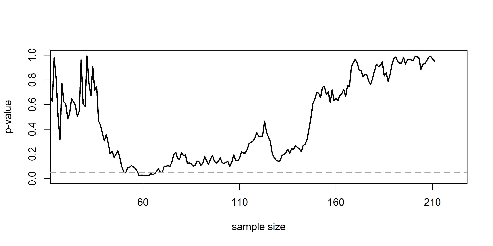
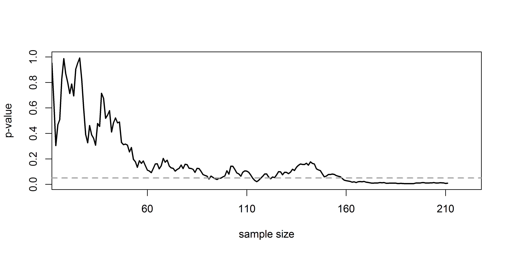
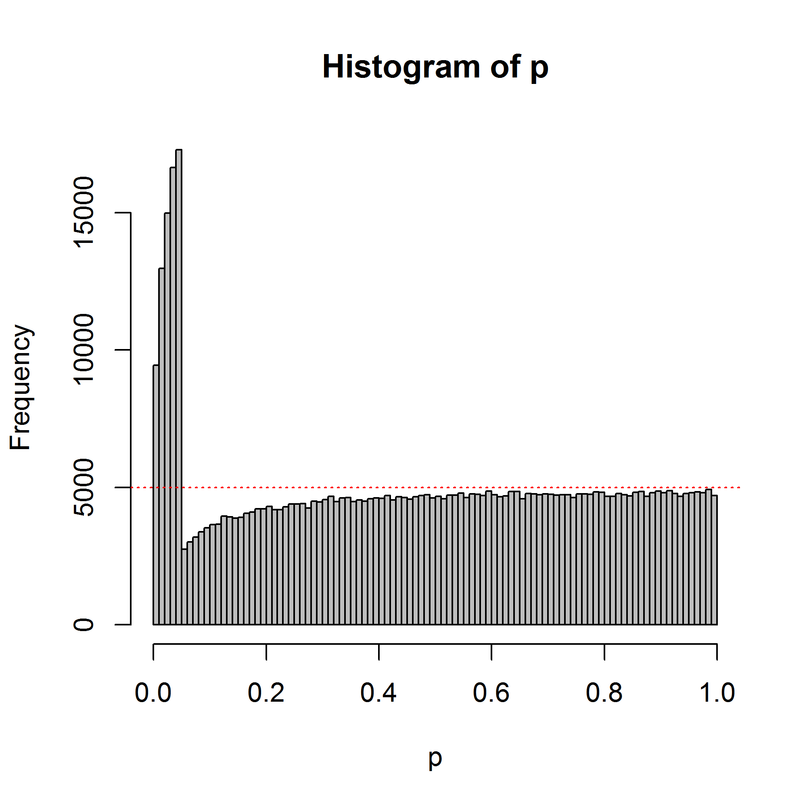

The Type 1 error rate in behavioral research (the probability of saying there is
an effect, when there is no effect) is often set at 0.05. In recent years,
researchers have become increasingly aware of research practices that inflate
the Type 1 error rate. This means that the *true* Type 1 error rate is higher,
or inflated, above the nominal Type 1 error rate set by the researcher.
[Simmons, Nelson, and Simonsohn
(2011)](http://www.haas.berkeley.edu/groups/online_marketing/facultyCV/papers/nelson_false-positive.pdf)
describe a number of research practices that lead to a situation where
researchers are likely to say there is an effect, when there is no effect (i.e.,
make a Type 1 error) more than 5% of the time, in the long run. In essence, all
these practices have to do with multiple comparisons – looking at your data
multiple times, or performing a significance test for the same hypothesis in
several different ways.

Here, we will focus on one way in which multiple comparisons inflate the Type 1
error rate known as **optional stopping**. In optional stopping, a researcher
repeatedly analyzes the data, continues the data collection when the test result
is not statistically significant, but stops when a significant effect is
observed. We will learn why optional stopping can be efficient, but that you
have to do it right, by controlling the Type 1 error rate.

Let’s first take a look how p-values behave as you collect data. Open the
PlotSingleP-ValueOverTime.R script and run it. This script will simulate an
ongoing data collection. After 10 participants in each condition, a *p*-value is
calculated by performing an independent *t*-test, and this *t*-test is then
repeated after every additional participant you collect. Then, all these
*p*-values are plotted as a function of the increasing sample size.

For example, in the Figure below, you see the *p*-value plotted on the y-axis
(from 0 to 1) and the sample size plotted on the x-axis (from 0 to 200). For
this simulation, the true effect size (specified in line 3 of the script) was 0,
meaning there is no true effect. We can thus only observe true negatives or
false positives. We will talk more about effect sizes in video 4.1, 4.2, and
4.3. For now, just know that the effect size expresses the strength of the
effect you are examining.

As the sample size increases, the *p*-value slowly moves up and down (remember
from lecture 1.2 that when there is no true effect, *p*-values are uniformly
distributed). In the figure below, the *p*-value drops below the grey line
(indicating a *p*-value of 0.05) around 51 and 60 participants in each
condition.

If you only look at the data once (when all participants are collected) the
*p*-value would fall below 0.05 only 5% of the time (given that the true effect
size is 0). You can check whether the *p*-value drops below 0.05 in your
simulation by looking at the graph, but the script also returns the lowest
*p*-value for all looks.

Q1: Run the script 20 times, and count how often the lowest *p*-value ends up
below 0.05 (we will calculate the long run probability of this happening through
more extensive simulations later).

If there is a true effect, we can only observe a true positive or a false
negative. Change the effect size on line 3 from D \<- 0.0 to D \<- 0.3. This is
a relatively small true effect, and with 200 participants in each condition, we
have 85% power (or an 85% probability of finding a significant effect). Run the
script again. Below is one possible example of the trajectory of *p*-values as
the sample size increases.

Q2: Run the script 20 times. Take a good look at the variation in the *p*-value
trajectory. Remember that at N = 200, 85% of the times the *p*-value should have
ended up below 0.05. The script returns the sample size the *p*-value is the
lowest (which is often, but not always, at the maximum sample size, when there
is a true effect) and the sample size at which the *p*-value drops below 0.05
for the first time. Which statement is true?

A) If the *p*-value drops below 0.05, it stays below 0.05.

B) The *p*-value randomly moves between 0 and 1, and will every now and then end
up below 0.05.

C) The *p*-value often drops below 0.05 well before 200 participants in each
condition. In around 50% of the simulations, this already happens at N = 100.

D) The *p*-value will typically move below 0.05 and stay there for some time,
but given a large enough sample, it will always move back up to *p* \> 0.05.

Q3: Change the effect size in line 3 to D \<- 0.8, which can be regarded as a
large effect. Run the script 20 times. Take a good look at the variation in the
*p*-value trajectory. Which statement is true?

A) The *p*-value randomly moves between 0 and 1, and will every now and then end
up below 0.05.

B) The *p*-values drop below and stay below 0.05 much earlier than when the true
effect size is 0.3.

C) *p*-values are meaningful when effect sizes are large (e.g., d = 0.8), but
meaningless when effect sizes are small (e.g., d = 0.3).

D) When you examine a large effect, whenever a *p*-value drops below 0.05, it
will always stay below 0.05 as the sample size increases.

Set the D \<- 0.8 back to D \<- 0.3. In line 1, change the total number of
participants you are willing to collect to n = 2000. Run the simulation a couple
of times. In Fight Club, Chuck Palahniuk writes “On a long enough time line, the
survival rate for everyone drops to zero.” We can paraphrase that and say: “With
a large enough sample size, the *p*-value for every simulation drops to zero (if
there’s a true effect).” The problem is that we often don’t exactly know *when*,
and therefore, especially if we are uncertain about how big the true effect size
is, it is very difficult to determine the sample size you need to collect.

Now, we are ready to appreciate the desirability of optional stopping. If we are
able to look multiple times during the data collection, we can just stop
whenever the data is surprising enough (or the *p*-value is low enough), which
is very efficient. However, if we look at the data multiple times, and stop
whenever the *p*-value is lower than an alpha level of 0.05, we will observe
false positives more than 5% of the time (in the long run – think back about the
simulations you’ve performed earlier!). We can examine how much the Type 1 error
inflates by performing simulations.

Open the OptionalStoppingSim.R file. This simulation will perform multiple
independent *t*-tests on simulated data, looking multiple times until the
maximum sample size is reached. In the first four lines, you can set the most
important parameters of the simulation. First, the maximum sample size in each
condition (e.g., 100). Then, the number of looks (e.g., 5). At best, you can
look at the data after every participant (e.g., with 100 participants, you can
look 100 times – or actually 98 times, because you need more than 2 participants
in each condition for a *t*-test!). You can set the number of simulations (the
more, the clearer the pattern will be, but the longer the simulation takes), and
the alpha level (e.g., 0.05). Since you can only make a Type 1 error when there
is no true effect, the effect size is set of 0 in these simulations.

When you perform only a single test, the Type 1 error rate is the probability of
finding a *p*-value lower than your alpha level, when there is no effect. In an
optional stopping scenario where you look at the data twice, the Type 1 error
rate is the probability of finding a *p*-value lower than your alpha level at
the first look, **and** the probability of **not** finding a *p*-value lower
than your alpha level at the **first** look, but finding a *p*-value lower than
your alpha level at the **second** look. This is a *conditional probability*,
which makes error control a little bit more complex than when multiple looks are
completely independent.

So how much does optional stopping inflate the Type 1 error rate? And which
*p*-values can we expect under optional stopping?

Start by running the simulation without changing any values, so simulating 100
participants in each condition, looking 5 times at your data, with an alpha of
0.05. Note the 50.000 simulations take a while! You should see something similar
to the graph below (which is based on 500.000 simulations to make the pattern
very clear).

We see 100 bars, one for each % (so one for all *p*-values between 0.00 and
0.01, one for *p*-values between 0.01and 0.02, etc.). There is a horizontal line
that indicates where all *p*-values should fall, is they would be uniformly
distributed (as they should be when there is no true effect).

Q4: Looking at the graph, which statement is true?

A) Optional stopping does not impact the Type 1 error rate.

B) Optional stopping inflates the Type 1 error rate. We can see this in the
first five bars (*p*-values between 0.00 and 0.05), which are substantially
higher than the horizontal line.

C) Optional stopping inflates the Type 1 error rate. We can see this in the bars
just above 0.05, which dip substantially below the uniform distribution that
should be present if there is no true effect.

You also get written output from the simulation script. One summary gives you
the Type 1 error rate for each individual look. One summary gives the Type 1
error rate when optional stopping is used.

Q5: Which statement is true?

A) At each look, the Type 1 error rate is higher than the alpha level (0.05).
When using optional stopping (and reporting only the lowest *p*-value), the Type
1 error rate is higher than 0.05.

B) At each look, the Type 1 error rate is approximately equal to the alpha level
(0.05). When using optional stopping (and reporting only the lowest *p*-value),
the alpha level also approximately equals the alpha level (0.05).

C) At each look, the Type 1 error rate is approximately equal to the alpha level
(0.05). When using optional stopping, the Type 1 error rate is also higher than
the alpha level (0.05).

Q6: Change the number of looks to **2** (in line 2), and leave all other
settings the same. Run the simulation again. What is the Type 1 error rate using
optional stopping, rounded to 2 digits? (Note that due to small number of
simulations, the exact alpha level you get might differ a little bit from the
answer options below).

A) 0.05

B) 0.08

C) 0.12

D) 0.18

As Wagenmakers (2007, p 779) notes: *“a user of NHST could always obtain a
significant result through optional stopping (i.e., analyzing the data as they
accumulate and stopping the experiment whenever the p-value reaches some desired
significance level)”*. This is correct. It’s true that the *p*-value will always
drop below the alpha level at some point in time. But, we need a rather large
number of observations. We can calculate the maximum Type 1 error rate due to
optional stopping for any maximum sample size. For example, remember the studies
on pre-cognition by Daryl Bem (2011). Some researchers suggested optional
stopping might have played a role in these studies. The largest sample size in
the 9 reported studies was 200. Bem (2011) performed one-sided t-tests, while we
will simulate independent two-sided *t*-tests, but regardless of this
difference, the results will be informative. What is the maximum Type 1 error
rate when optional stopping is used when collecting 200 participants in each
condition, and looking 200 times (or 198 times, given that you can’t perform a
*t*-test on a sample size of 1 or 2 people)? Set the number of participants to
**200**, the number of looks to **200**, the number of simulations to **10000**
(this simulation will take even longer!), and the alpha to **0.05**.

Q7: What is maximum Type 1 error rate when collecting 200 participants in each
condition of an independent *t*-test, using optional stopping, rounded to 2
digits? (Note that the simulation will take a while, but still, due to the
relatively small number of simulations, the exact alpha level you get might
differ a little bit from the answer options below – choose the answer option
closest to your result).

A) 0.05 C) 0.20

B) 0.11 D) 0.41

At Wikipedia, look at the entry about the Pocock boundary:
<https://en.wikipedia.org/wiki/Pocock_boundary> . There are ethical reasons to
look at the data, while data is being collected. These are clear in medicine,
but similar arguments can be made for other research areas (see Lakens, 2014).
Researchers often want to look at the data multiple times. This is perfectly
fine, as long as they design a study with a number of looks in advance, and
control their Type 1 error rate.

The Pocock boundary provides a very easy way to control the type 1 error rate in
sequential analyses. Sequential analysis is the formal way to do optional
stopping. Researchers should use a slightly lower alpha level for each look, the
make sure the overall alpha level (after all looks) is not larger than 5%.

Q8: Set the number of participants to **100**, the number of looks to **5**, and
the number of simulations to **50000**. In the Wikipedia article on the Pocock
boundary, find the corrected alpha level for 5 looks at the data. Change the
alpha level in the simulation to this value. Run the simulation. Which of the
following statements is true?

A) The Type 1 error rate at each look is approximately 0.03, and the overall
alpha level is approximately 0.05.

B) The Type 1 error rate at each look is approximately 0.03, and the overall
alpha level is approximately 0.15.

C) The Type 1 error rate at each look is approximately 0.016, and the overall
alpha level is approximately 0.05.

D) The Type 1 error rate at each look is approximately 0.016, and the overall
alpha level is approximately 0.08.

Q9: Look at the graph of the *p*-value distribution when using the Pocock
boundary, and compare it to the graph you got when not using the Pocock
boundary. You can flip back and forth between plots you have generated in
RStudio using the blue arrows on the plots tab:

Which statement is true?

A) **Without** Pocock’s boundary, **small** *p*-values (e.g., *p* = 0.01) are
**more** likely than slightly **higher** *p*-values (*p* = 0.04). **With**
Pocock’s boundary, **small** *p*-values (e.g., *p* = 0.01) are **also more**
likely than slightly **higher** *p*-values (*p* = 0.04).

B) **Without** Pocock’s boundary, **small** *p*-values (e.g., *p* = 0.01) are
**more** likely than slightly **higher** *p*-values (*p* = 0.04). **With**
Pocock’s boundary, **small** *p*-values (e.g., *p* = 0.01) are **less** likely
than slightly **higher** *p*-values (*p* = 0.04).

C) **Without** Pocock’s boundary, **small** *p*-values (e.g., *p* = 0.01) are
**less** likely than slightly **higher** *p*-values (*p* = 0.04). **With**
Pocock’s boundary, **small** *p*-values (e.g., *p* = 0.01) are **more** likely
than slightly **higher** *p*-values (*p* = 0.04).

D) **Without** Pocock’s boundary, **small** *p*-values (e.g., *p* = 0.01) are
**less** likely than slightly **higher** *p*-values (*p* = 0.04). **With**
Pocock’s boundary, **small** *p*-values (e.g., *p* = 0.01) are **also less**
likely than slightly **higher** *p*-values (*p* = 0.04).

This assignment shows that optional stopping can quickly increase the Type 1
error rate. Researchers should only look at their data, and stop when the result
is statistically significant, if they have correctly controlled their Type 1
error rate (for example by using sequential analyses, see Lakens, 2014).
Sequential analyses are still unconventional. If you want to use sequential
analyses, it is recommended to *pre-register* your study. When you pre-register
a study, you describe in advance which analyses you plan to run, and how you’ll
control your Type 1 error rate for these planned analyses. We will discuss
pre-registration in a later lecture.

This work is licensed under a [Creative Commons
Attribution-NonCommercial-ShareAlike 4.0
License](http://creativecommons.org/licenses/by-nc-sa/4.0/).
