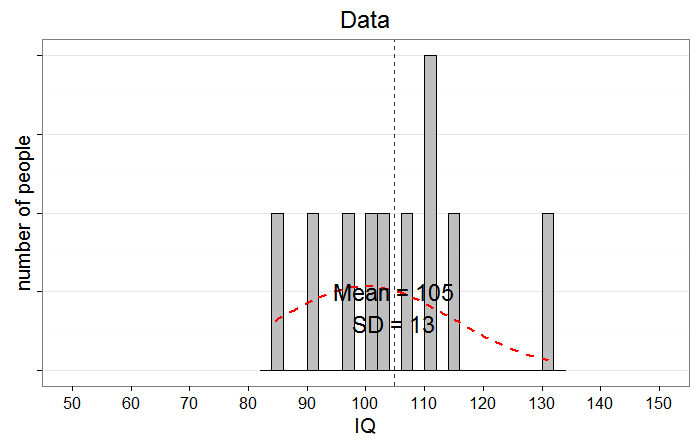
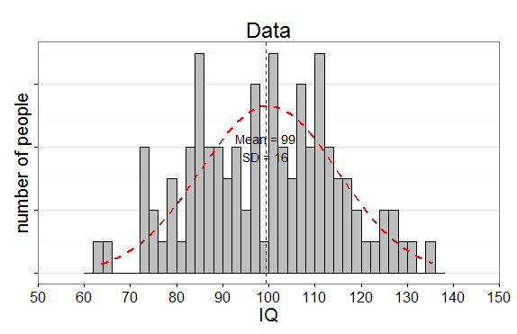
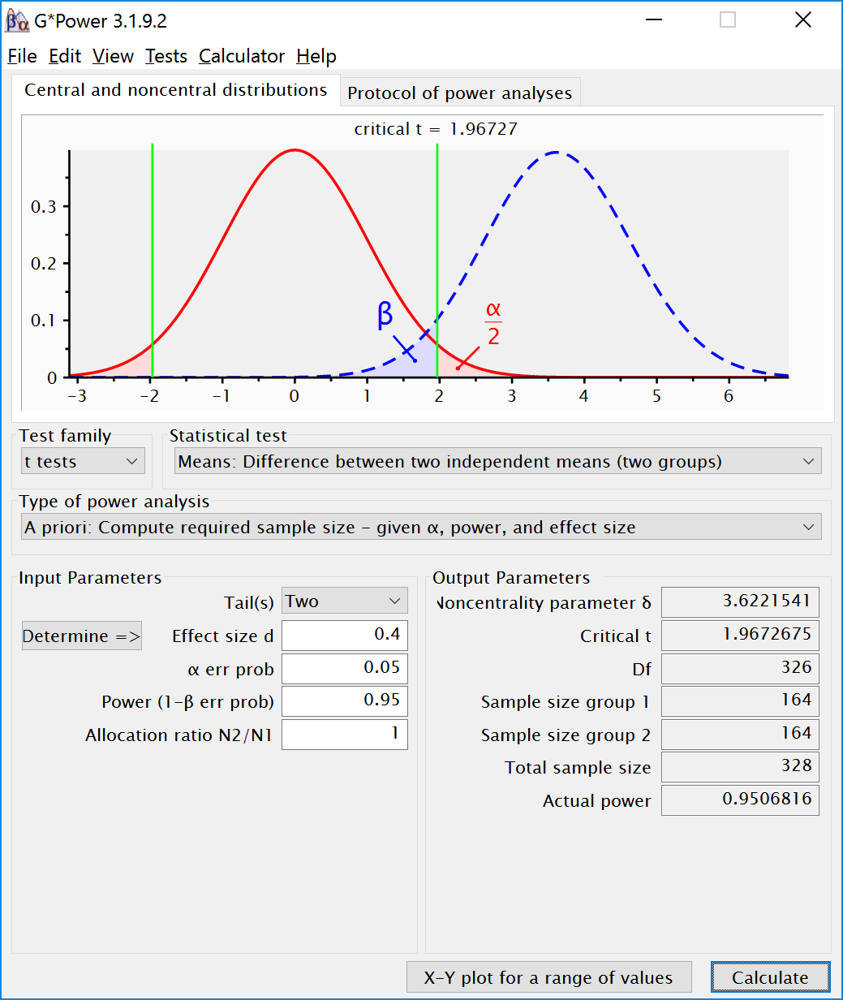
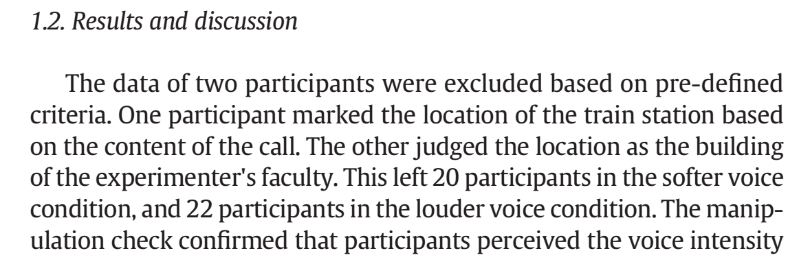
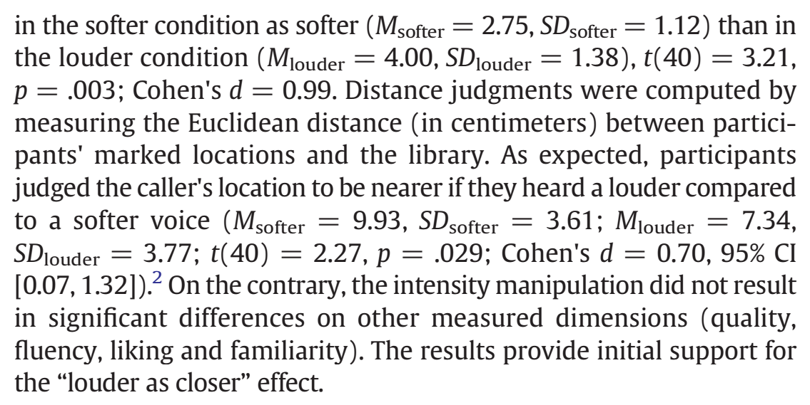
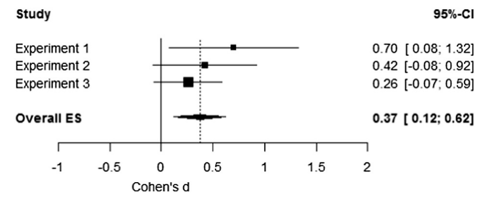
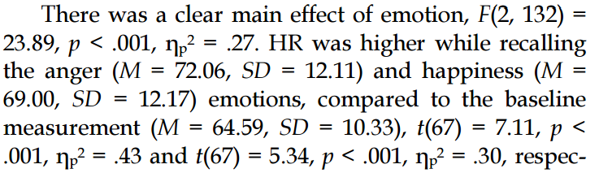
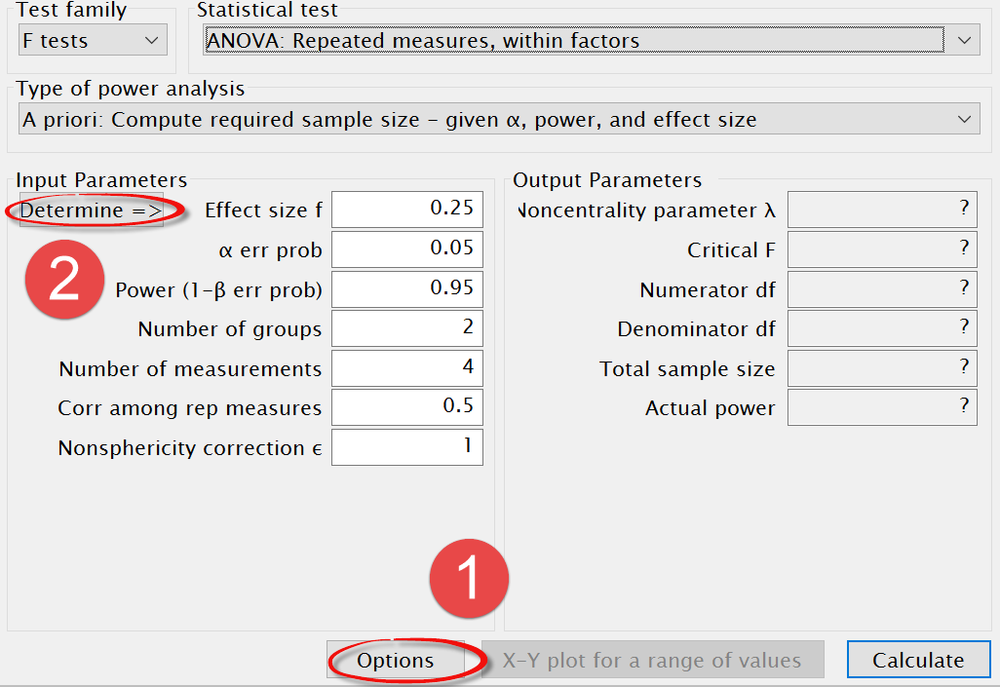
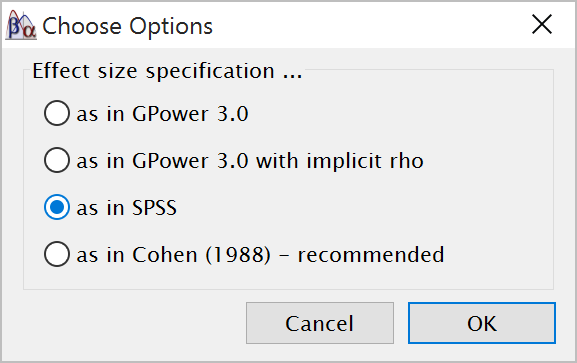

People find it difficult to think about random variation. Our mind is more
strongly geared towards recognizing patterns than randomness. In this
assignment, we will learn what random variation looks like, and how to reduce
variation by running well-powered studies.

# Variation in single samples

Intelligence tests have been designed such that the mean Intelligence Quotient
of the entire population of adults is 100, with a standard deviation of 15. This
will not be true for every sample we draw from the population. Let’s get a feel
for what the IQ scores from a sample look like. Which IQ scores will people in
our sample have?

We will start by manually calculating the mean and standard deviation of a
random sample of 10 individuals. Their IQ scores are: 91.15, 86.52, 75.64,
115.72, 95.83, 105.44, 87.10, 100.81, 82.63, and 106.22. If we sum these 10
scores and divide them by 10, we get the mean of our sample: 94.71. We can also
calculate the standard deviation from our sample. First, we subtract the overall
mean (94.71) from each individual IQ score. Then, we square these differences
and then sum these squared differences (giving 1374.79). We divide this sum of
the squared difference by the sample size minus 1 (10-1=9), and finally take the
square root of this value, which gives the standard deviation: 12.36. Open
Simulate One Group.R, select all the code, and run it, to randomly simulate 10
IQ scores, and plot them.

Above is one example (yours will differ). The grey bars indicate the frequency
with which each IQ score was observed. The red dotted line illustrates the
hypothetical normal distribution for the population (we will return to this
later). Both the mean, as well as the standard deviation, differ from the true
mean of the population. Write down the mean and standard deviation in your
sample. Simulate 9 more samples of 10 individuals. Write down the mean and
standard deviation from each simulated group.

Q1) What is the difference in IQ points between the highest and the lowest mean
from your 10 simulations?

Imagine we did not yet know what the mean IQ was in our population (where M =
100), or the standard deviation (where SD = 15), and that we would only have
access to one dataset. Our estimate might be rather far off. This type of
variation is perfectly normal in small samples of 10 participants, given the
current standard deviation.

Q2) The variability in the means is determined by the standard deviation of the
measurement. In real life, the standard deviation can be reduced by for example
using multiple and reliable measurements (which is why an IQ test has not just
one question, but many different questions). It’s not always possible to reduce
the standard deviation in the real world, but it is possible in our simulation.
Change the *sd* = 15 in line 7 to *sd* = 2. And simulate 10 new samples. What
happens?

A) There is no difference between the **means** when *sd* = 15 compared to when
*sd* = 2.

B) There is no difference between the **standard deviations** when *sd* = 15
compared to when *sd* = 2.

C) With *sd* = 2, the variation in means has **increased** substantially
compared to *sd* = 15.

D) With *sd* = 2, the variation in means has **decreased** substantially
compared to *sd* = 15.

Change the *sd* = 2 in line 7 back to *sd* = 15. Let’s simulate a larger sample,
of 100 participants by changing the *n* = 10 in line 6 of the R script to n=100.
One sample is plotted below. We are slowly seeing what is known as the **normal
distribution** (and the frequency scores start to resemble the red dotted line
illustrating the normal distribution of the population). This is the well-known
bell shaped curve that represents the distribution of many variables in
scientific research (although some other types of distributions are quite common
as well). The mean and standard deviation are much closer to the true mean and
standard deviation, and this is true for most of the simulated samples.

Q3) Simulate at least 10 samples with *n* = 10, and 10 samples with *n* = 100.
Look at the distribution of the data you have simulated. Which statement below
is true?

A) With small samples, it is very clear the data does not come from a population
where IQ scores are normally distributed.

B) With small samples, it is very clear the data comes from a population where
IQ scores are normally distributed.

C) The data always come from a population where IQ scores are normally
distributed, but this is very difficult to see, especially when *n* = 10, but
sometimes also when *n* = 100.

D) The data always come from a population where IQ scores are normally
distributed. This can easily be seen when we compare the true population normal
distribution (the red dotted line) against the data.

Let’s simulate really large samples of 1000 people (run the code a number of
times, setting n=1000 in line 6). Not every simulated study of 1000 people will
yield the true mean and standard deviation, but it will happen quite often. And
although the distribution is very close to a normal distribution, even with 1000
people it is not perfect.

# Planning for Accuracy

As we have seen above, the accuracy with which you can estimate the IQ of a
population depends on the sample size. It is easy to calculate the sample size
you need for a given level of accuracy when you know the standard deviation and
the percentage of means that should fall within a desired range. Let’s assume
you want 95% of the results to estimate the mean IQ within an error range of 2
IQ points. You first convert the 95% confidence interval (see the assignment on
confidence intervals) to a *z*-score (*z* = 1.96), and use the formula:

*N* = (Z \* SD/error)2

In this example, (1.96\*15/2)2 = 216 people (rounded down). Feel free to check
this number by running the code with n = 216 100 times. In the long run, only 5%
of the time will the mean IQ from the sample fall outside the desired accuracy
range of 98-102. In your 100 simulations, it might happen fewer or more often,
but in thousands of studies, it will end up being 5%!

# Variation in *p*-values, statistical power, and a-priori power analysis

Earlier, we learned how *p*-values are a function of the power of the study. You
have seen the p-value distribution when simulating large numbers of studies, but
here we will take a look at studies at an individual level, to more directly
experience their variation. First, take 11 minutes to look at Geoff Cumming’s
video [Dance of the p-values](https://www.youtube.com/watch?v=5OL1RqHrZQ8). He
very clearly explains how *p*-values vary substantially, even when you repeat
the experiment in exactly the same manner.

Regardless of the statistics you calculate (effect sizes, likelihoods,
confidence intervals, or *p*-values), we always just have the means, standard
deviations, and the sample size to calculate with. All the different statistics
vary to the same extent, because they are based on the same data. What we often
want, is to limit the part of the *p*-value distribution where *p*-values will
vary. In power analysis, we calculate the sample size that is required to reach
a certain probability of observing a *p*-value smaller than our chosen alpha
level. The *p*-values will still vary, but they will remain below our
significance threshold, most of the time. Indeed, is we design well-powered
experiments, we can turn the dance of the *p*-values into the march of the
*p*-values. The goal is to have one after the other *p*-values behave in a
consistent and predictable manner, with respect to our significance threshold.

Open MarchOfThePvalues.R. The default setting simulates an independent *t*-test,
with two groups of IQ scores that differ by 6 IQ points (lines 14 and 15).
Because the standard deviation is 15, the standardized effect size Cohen’s *d* =
0.4. With 50 participants in each condition, we have approximately 50% power
with an alpha of 0.05. The simulation generates one study at a time, and tell
you the *p*-value for each study. It also includes one of 5 emoticons:

**:( for p-values larger than 0.10**

**(._.) for p-values between 0.10 and 0.05**

**(\^.\^) for p-values between 0.01 and 0.05**

**:) for p-values between 0.001 and 0.01, and**

**:D for p-values below 0.001.**

Select all the lines, and run the script. The *p*-values for 100 simulated
studies will appear, one every 0.5 seconds. Look at the range of *p*-values, and
get a good feel for the randomness in studies with 50% power. Now let’s turn
this dance with a lot of variability in a march. To achieve this, we need to
determine the sample size that will reduce the likelihood of observing
*p*-values \> 0.05. The way to choose this sample size is through **power
analysis**.

Statistical power is a function of the effect size, the alpha level, and the
sample size. The true effect size is what you measure, so you can’t determine it
yourself. The alpha level is typically set to 0.05. That means you can only
directly influence the sample size, if you want to achieve a specific power.
Therefore, in what is known as a-priori power analysis, you determine the sample
size required to achieve a certain level of statistical power, given an alpha
level, and assuming a certain effect size.

In our simulation, we know the effect size (we will discuss different ways to
estimate the effect size when it is not known later).

Widely used free software for power analysis is G\*Power software, which you can
download from here: <http://www.gpower.hhu.de/>. Install G\*Power. Let’s
calculate the sample size we need to achieve 95% power for our independent
*t*-test where the true effect size is *d* = 0.4, and where we use an alpha
level of 0.05. In all the drop-down menus (Test family, statistical test, Type
of power analysis, tails), follow the selections in the screenshot below. Fill
in 0.4 in the ‘Effect size d’ field, and 0.95 in the ‘Power (1-β err prob)’
field. Then click ‘calculate; to get the same power calculation:

We see we need 164 people in each group (so 328 people in total) to achieve 95%
power with an effect size of 0.4. Let’s check this in the MarchOfThePvalues.R
script. In line 8, change n\<-50 into n\<-164. Select all lines, and run the
simulation.

You should see a lot of **:D**, **:)**, and **(\^.\^)**. In the 100 simulations,
there will be some non-significant results – there will be 5% in the long run,
with 95% power. Note that dividing *p*-values in 5 categories makes it look like
there is still some variation, but from a Neyman-Pearson perspective, we are
really only interested in a distinguishing signal from noise, or happy faces
from sad faces, and we want to limit the sad faces to 5%, in the long run, when
there is a true effect. If we had programmed the simulation with just a
dichotomous output and , the result would be very repetitive. This is why you
want to design high-powered studies: They provide informative results. But they
also require a larger sample size.

Q4) We never know the true effect size in real studies. One approach people
often use in a-priori power analyses is to set the smallest effect size of
interest. For example, using the benchmarks by Cohen, we know *d* = 0.2 is a
small effect. We might decide that if we do not observe an effect size of 0.2 or
larger, we are not interested in the effect. Use G\*power to calculate how many
participants we need in each group, in an independent *t*-test, with an alpha
level of 0.05 for a two-sided test, to get 0.95 power to observe an effect size
of *d* = 0.2.

A) 51 C) 290

B) 242 D) 651

A second way in which people often determine the effect size, is by calculating
the effect sizes observed in a previous study, and using these to determine the
effect size in a follow-up experiment. First, download my effect size
calculation spreadsheet. You can use it to fill in the test statistics from an
article, and it will calculate the effect sizes it can. Go to
<https://osf.io/wgsi3/> and download the From_R2D2 spreadsheet.

Let’s take a look at the ‘louder=closer’ effect, from [Zhang, Lakens, &
IJsselsteijn,
2015](https://www.researchgate.net/publication/273326280_The_illusion_of_nonmediation_in_telecommunication_Voice_intensity_biases_distance_judgments_to_a_communication_partner),
who showed that participants estimated their conversation partner (who they
communicated with over the telephone or over Skype) was closer, when they heard
their voice louder (i.e., the volume of the telephone or computer was louder).

Q5) Fill in the statistics for the main effect of caller location as a function
of the loudness of the voice over the telephone, *t*(40) = 2.27. Check the
effect size calculation using the From_R2D2 spreadsheet if we calculated the
reported effect size correctly. You can fill in *N* = 42 (for a *t*-test, N is
the degrees of freedom + 2) and *t* = 2.27. Note that we reported Cohen’s *d*
for the sample (in the spreadsheet, indicated by Cohen’s *ds*). If you want to
repeat this study with 90% power, use G\*power to calculate how many
participants you would you need in each group, assuming the Cohen’s *d* of 0.7
is the true effect size, and the alpha level is 0.05 for a two-sided test.

A) 24 C) 44

B) 36 D) 55

Q6: For power analyses, it is best to use unbiased effect size estimates. Redo
the power analysis, now using Hedges’ *g*, which you can also get from the
From_R2D2 spreadsheet. If you want to repeat this study with 90% power, how many
participants would you need in each group?

A) 26 C) 66

B) 46 D) 86

Q7: It is very risky to base the power analysis on a single study. Due to
publication bias, single studies often overestimate the true effect size,
sometimes substantially. A third approach is to use the effect size from a
meta-analytic effect size estimate. As it turns out (and as is often the case),
the effect size for the loudness = closer effect observed by Zhang, Lakens, &
IJsselsteijn in Study 1 was overestimated. After three studies, the authors
perform a meta-analysis. Below, we see three lines with the effect sizes and
confidence intervals for each study. On the bottom line, we see the overall
meta-analytic effect size of 0.37.

Based on an a-priori power analysis, how many participants would you need in
each group if you wanted to achieve 90% power? (Note that formally, Hedges’ g
would be better again, but with very large samples or meta-analytic estimates,
the difference is often too small to matter).

A) 59 C) 126

B) 111 D) 155

Q8) Let’s try a more complex example, where we calculate the power for a
repeated measures design. In a repeated measures design, [Lakens
(2013)](https://14b4ee02-a-62cb3a1a-s-sites.googlegroups.com/site/lakens2/Lakens%20-%20in%20press%20IEEE%20TOAC%20-%20Using%20a%20Smartphone%20to%20Measure%20Heart%20Rate%20Changes%20during%20Recalled%20Happiness%20and%20Anger.preprint.pdf?attachauth=ANoY7crnszXFbdpg_f0acu5iHCnoU4rQD_5JUAoGQyn4igMv4cAoykRFXihffZ1GRwvkibvu8Xl8T5SkeWCd4N4QQ_U8MVsagMZfiBxyCsBbbOXmSzyQvL9hItyDho3n-G7EagSlJtEOvWyl9_EFZX1wqf9F817lSR-vNMWpql0QCHQc8No4hRmWSwhNxjql2SMD6oYLxtiSvZQo3CbhIRYNFj7nyTL-kkccIxuoM1KBWPDp_bqgjOGQYGgO0RMOBuWGZq2TGvIxPrBzcIo2si5oEwsCg3yV2dTyY882lJHCQW0UJ_avKlGRwJ2o25ExCIEZ06c3_UkoG8urI8wwLp8M-13wK_Md1ZPu7-IQvFsVQdtjm9B3vlM%3D&attredirects=0)
asked students from the TU Eindhoven to measure their heart rate with their
smartphone. Students took three measurements: A baseline measurement, one
measurement while they were thinking back to a time they were feeling happy, and
once while they thought back to a time when they were sad. The results were as
follows (look at the main effect of emotion):

For ANOVA designs, the effect size needed to perform a power analysis is partial
eta squared or ηp2. This is reported in the result section, but I have blocked
it out. An easy to use spreadsheet to calculate eta squared available from
<https://osf.io/sjgv4/> (the unbiased effect sizes are only accurate for a
one-way ANOVA, but eta-squared is also accurate for a repeated measures design.
Enter the degrees of freedom for the effect (2) and error (132) and the
*F-*value (23.89) in the From_R2D2 spreadsheet.

Q8) What is the ηp2?

A) 0.24 C) 0.26

B) 0.25 D) 0.27

It is better to use unbiased effect size estimates in power analyses, but for
now we will use ηp2. To perform a power analysis in G\*power for the repeated
measures interaction, from test family, choose *F*-tests, from Statistical test
choose: ANOVA: Repeated Measures, Within Factors (after all, the three emotion
measurements for Baseline, Happy, and Angry were taken within subjects) and set
the type of power analysis A priori. First do two things:

G\*Power needs the effect size f (which is Cohen’s f). We can calculate this
from partial eta squared (or ωp²), but in a within design, there is a tricky
issue: G\*power by default expects a different calculated partial eta-squared
than software programs such as SPSS and the spreadsheet provide. To tell
G\*power we will be using the (arguably) default version of partial eta squared
(or ωp²), first click the ‘Options’ button (see below)

Check the ‘as in SPSS’ checkbox. This tricky step is only required when using
partial eta squared (or partial omega squared) for **within subject designs**,
but then it is very important not to forget it.

Then click ‘Determine’ (point 2 above). In the window that opens, click the
‘Direct’ radio button and type in ηp2 (rounded to 2 digits after the decimal) in
the window. Click ‘Calculate’ to get the Effect size f(U) of 0.608, and click
Calculate and transfer this f to the main window. You can now fill in the
remaining numbers. The ‘α error prob’ is fine at 0.05. Set power to 90%, the
number of groups to 1 (we have one group, and everyone does all three
measurements), set the number of measurements to 3, and you can ignore the
nonsphericity correction. Click ‘calculate’ to get a total sample size to
achieve 90% power with an alpha of 0.05.

Q9) Which sample size is required to achieve 90% power?

A) 20 C) 42

B) 22 D) 58

We’ve seen there can be a lot of variation in single studies. You can plan the
sample size to achieve a certain accuracy, or to achieve a certain probability
of observing a *p* \< 0.05 in an a-priori power analysis. It is very important
that, regardless of the approach you use, you carefully consider the sample size
you will collect. Power analysis is one approach, but remember effect size
estimates from the published literature are often upwardly biased. Some journals
now expect researchers to explicitly justify their sample size when they submit
their research for publication, so make sure you know how to justify your sample
size!

© Daniel Lakens, 2016. This work is licensed under a [Creative Commons
Attribution-NonCommercial-ShareAlike 4.0
License](http://creativecommons.org/licenses/by-nc-sa/4.0/)
