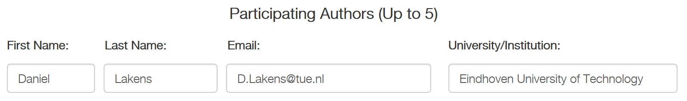
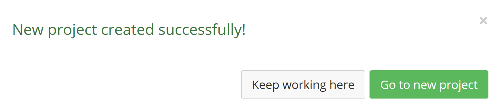
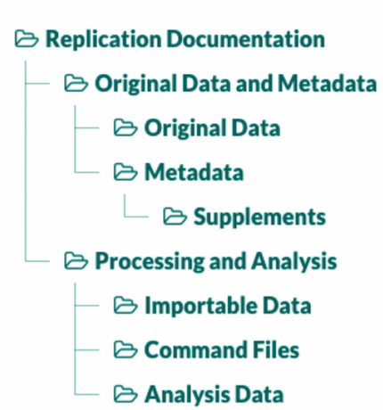
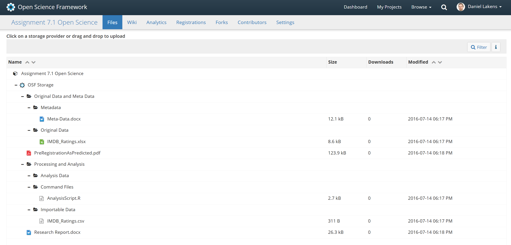

In this assignments, you will define a theoretical hypothesis, translate it into
a statistical hypothesis, design a study to test your hypothesis, collect the
data, report the results, create a reproducible analysis file, and publicly
share the data, the analysis file, and the research report publicly online.
Learning these Open Science practices will allow you to share all aspects of
your research with others. To keep the research project in this assignment
feasible, the data collection will consist of movie ratings on the IMDB. You can
come up with any hypothesis you want, as long as we can test it based on the
IMDB ratings of movies! This assignment will be peer-reviewed by fellow
students. All the aspects that need to be included in the final assignment are
indicated in **bold**.

Let’s start by defining a **theoretical hypothesis**. My favorite movie of all
time is Fight Club. It stars Brad Pitt and Edward Norton. My theoretical
hypothesis is that Brad Pitt and Edward Norton are both great actors, and
because they are both great, the movies they play in are equally good. You can
pick any hypothesis you like. For example, sequels to movies will have lower
IMDB ratings than the original movie, movies with the word ‘Bad’ in them have
lower ratings than movies with the word ‘Good’ in them, or Marvel superhero
movies are better than DC superhero movies. Be as creative as you want.

Q1) Write down your **theoretical hypothesis**.

IMDB will provide both the IMDB rating, and the metascore (provided by
metacritic.com). Which will you use? Or do you predict an effect on both DV’s?
I’ll just focus on the IMDB scores. We need to explain in more detail which
datapoints we will collect. Will we randomly sample X movies from all the hits
our IMDB search will give? Sort our search results based on the release date,
and use the X most recent movies? In my case, I will use the X last movies
Edward Norton and Brad Pitt starred in from today, the moment I did the IMDB
search.

Q2) Write down which **dependent variables** you will measure.

**Justify your sample size**. I predict no difference, and thus I’ll do a power
analysis for an equivalence test (see Assignment 6). I want to be pretty sure I
can reject my smallest effect size of interest, so I’ll design a study with 90%
power. For this educational assignment, I do not expect you to collect a huge
amount of data. As long as I can exclude a large effect (Cohen’s *d* = 0.8 or
larger) I’ll be happy for this assignment. The power analysis estimates that the
sample size we need to show the difference between the ratings for movies
starring Edward Norton and Brad Pitt is smaller than Cohen’s *d* = 0.8 (assuming
the true effect size is 0, and with an alpha of 0.05, when I aim for 90% power)
is 34 movie ratings from Brad Pitt, and 34 movie ratings from Edward Norton.
Obviously, your sample size justification might be based on accuracy, or
feasibility (e.g., the amount of time you have) – any justification can be
valid.

Note: Normally we would choose to collect as much data as possible, and it’s
quite easy to get the movie ratings for all movies Edward Norton and Brad Pitt
starred in. However, copying numbers from a website into a spreadsheet is not
the most educational part of this assignment. If this was real research, we
would collect as much data as possible, but for this assignment, don’t overdo
the data collection. Spend your time on learning other skills than copy-pasting.

Q3) **Justify your sample size**. Which alpha level do you find acceptable? Is
your test one-sided or two-sided? Will you use sequential analyses, and adjust
your alpha level? Which power do you want? Which effect size do you expect? Or
how accurately do you want to estimate the effect? Or what number of
observations is feasible to collect, given your time and resources?

We need to translate our theoretical hypothesis to a statistical hypothesis.
Which statistical test will you do? I will calculate the 90% CI around the
effect size. When the 90% CI falls below, and excludes a Cohen’s *d* of 0.8, I
will consider the movie ratings of Edward Norton and Brad Pitt as equivalent.

Q4) **Specify the statistical test you will conduct**. Specify relevant
parameters (such as the alpha level you will use, the *r* scale for the Bayes
Factor, etc.).

In other research, you might need to think of more things, such additional
analyses you want to do, how you will correct for multiple comparisons, or how
you will deal with outliers, or what you will do if the assumptions of the test
are violated. But for now, this is enough.

Congratulations! By answering questions Q1 to Q4 you have completed the
pre-registration of your study. Let’s make it formal.

**Pre-registering your research**

We will be using the AsPredicted template to pre-register. If you have a
university (e.g., .edu) e-mail account, you can use the AsPredicted site. If you
only have a Gmail account, scroll down for an explanation how to fill out the
AsPredicted template through the Open Science Framework. Please note, we will
complete the pre-registration template and upload it to the OSF, but we will not
formally pre-register on the OSF, as explained below.

**Pre-registering on AsPredicted**

Go to <https://aspredicted.org/> and create a new AsPredicted pre-registration:

Click the ‘create’ button. Fill in your name, e-mail, and institution.

Scroll down, and answer questions 1 to 9. At 2) paste your answer to Q1, at 3)
paste your answer to Q2, at 4) explain how many groups you will compare (e.g.,
2, Edward Norton vs. Brad Pitt), at 5) enter the answer at Q4, and at 7) enter
the answer from Q3. Answer the remaining questions. Please indicate you are
using AsPredicted for a ‘Class project or assignment’.

Preview your pre-registration:

hit ‘pre-register’. If everything looks OK, hit the ‘SUBMIT’ button.

Then, you need to approve the submission (and if you had co-authors, they would
also need to approve the submission). Click the link:

Click the button to see your new pre-registration:

And click APPROVE

And click OK for the pop-up indicating this can not be undone. We will make the
pre-registration public. If you do research, you don’t have to make your
pre-registrations public immediately, but in this assignment, we will do so.
Once again, click:

Scroll down, and click:

Click OK on the pop-up warning you that this can not be undone.

Now you can download the .pdf file with your pre-registration:

**Download the pdf file and save it** – you have to share it as part of this
assignment.

**Pre-registering on the Open Science Framework**

Go to [www.osf.io](http://www.osf.io) and create an account:

Then create a new project:

As a title, enter anything you will remember, for example Assignment 7.1 Open
Science. Click ‘create’ and then ‘Go to new project’.

After you have created your new project, make your project public. To do so,
click the **Make public** button in the top right of the project.

Then, go to this page on the OSF: <https://osf.io/zab38/wiki/home/>. This page
lists all of the registration forms as templates that you can view and download
onto your computer.

Open the AsPredicted Registration template as a Word Doc, and the file will
appear in a file viewer.

On this page, click the **Download** button in the top right. Then open the
AsPredicted template on your computer.

Fill out the form on your computer, save, and name it: “prereg_assignment7.”
When you’re finished filling out the form, upload it to the OSF Storage on your
OSF project. For instructions on how to upload a file to a project, see this
help guide: <https://help.osf.io/hc/en-us/articles/360019930613-Upload-files>.

**In this assignment we will not go through the formal pre-registration process
on the OSF. The reason for this is that the OSF registries website is intended
to be a searchable database of all official scientific registrations and
preregistrations. When you complete a registration, it will remain in** [OSF
Registries](https://osf.io/registries/) **for ever, and there is no way to
remove it. Only register formal scientific studies. If you want to complete a
formal registration for a scientific study you will do in the future, you can
check out the How-To**
[here](http://help.osf.io/m/registrations/l/524205-register-your-project)**.**

Double click on your preregistration file to render it in the file viewer (as
the previous screenshot depicted). Copy the URL on this page, paste it in a word
document, and save it as ‘Pre-registration’. We will upload this later, so that
fellow students know where to find your pre-registration.

Go back to the main view of your project by clicking the project name in the top
left of the page.

**Collecting Data**

Now that we have pre-registered our hypothesis let’s collect some data. Use the
normal IMDB search to find the movies you want, or the [advanced search
functions](http://www.imdb.com/search/).

I searched for [movies starring Brad Pitt as an actor, order based on release
data](http://www.imdb.com/filmosearch?role=nm0000093&explore=title_type&mode=detail&page=1&title_type=movie&ref_=filmo_ref_job_typ&sort=release_date,desc&job_type=actor),
and [the same for Edward
Norton](http://www.imdb.com/filmosearch?role=nm0001570&explore=title_type&mode=detail&page=1&title_type=movie&ref_=filmo_ref_job_typ&sort=release_date,desc&job_type=actor).

You can type in your data in any software you want to use – a spreadsheet, a
statistical software package, or even just in a text file. This will be your
**original data file**. I used a spreadsheet file.

It turns out that Edward Norton has acted in 32 movies, so we are 2 movies short
of our planned sample size of 34 movies. That happens, there is nothing we can
do about it, so we will just describe this in the research report.

We will use the [TIER documentation
protocol](https://www.haverford.edu/project-tier/protocol-v2) to keep our files
organized, and store the data in a way that will allow me to understand our own
data in the future, or allow other people to reproduce the data analysis. We
will then share this data on the [Open Science Framework](http://www.osf.io), a
website that allows you to store your research data, and whenever you are ready
to do so, make this data public and accessible for other researchers. You can
check my example of this assignment on the Open Science Framework
[here](https://osf.io/r4hab/).

You can [download the folder
structure](https://www.haverford.edu/sites/default/files/Replication-Documentation.zip)
you need in a zip file, and unzip the folder structure to your working directory
for this research project. It should look like this:

Place your original data in the ‘Original Data’ folder. It will remain here,
unchanged, so we always have a version of the original dataset. In the meta-data
folder, include a document that contains information about

1.  A citation to the website from which you downloaded the data.

2.  The data you downloaded, and a description of how others can access this
    data (e.g., the search terms you used).

3.  Some information that will allow readers to understand the original data.
    This information should be similar to a ‘codebook’. In our simple datafile,
    this will be straightforward, but in larger datasets, this requires careful
    work.

4.  If you use existing datasets, a DOI (Digital Object Identifier) assigned to
    the dataset, if available. This is not needed for our project.

In the ‘Importable Data’ folder, **store a copy of your data that can be used by
the statistical software you are using**. For example, it is often easiest to
import a comma separated value document into a statistics program. If you have
entered the data in a spreadsheet, you might want to store that data in a .csv
file, and place the .csv file in the ‘Importable Data’ folder. Maybe you
directly typed in the data in your statistical software. In this case, the
importable data file is a copy of the original data.

The next step is to analyze your data. Try to follow your pre-registered
analysis plan. If you realize you need to make change to your original plan,
note these changes while writing up the results. You can do Frequentists tests,
Bayesian tests, or both. The most important thing here is to create an analysis
script, that can be directly run on the importable data file, and that will
exactly reproduce the analyses you will report in the Research Report. For
example, do not just point and click in SPSS, but paste the syntax for each
analysis you perform. Make sure it is annotated (i.e., you add an explanation of
what the code does) so that other could in principle understand which analysis
in the analysis script is linked to which result in your research report. Save
your **analysis file** in the ‘Command File’ folder.

Q5) Write down the **relevant statistics in a result section**, and **don’t
forget to interpret the results**. There are no requirements – peer reviewers
will not grade how well you did your analysis, only that you analyzed your data.
Introduce the data analysis with a short explanation of your hypothesis (you can
take this from your pre-registration). End the data analysis with a short,
one-sentence **conclusion**. Save this document as the ‘**Research Report**’ and
place it in the top level of the ‘Replication Documentation’ folder.

Now you have completed your research project, let’s share the results and the
data! We will upload the **pre-registration, data, report, and analysis files**
to the Open Science Framework (OSF). The Open Science Framework allows you to
store data, materials, and analysis scripts for free, and make these files
publically available whenever you are ready.

Create a (free) account on the Open Science Framework (if you did not already do
so).

Then create a new project (if you did not yet do so to pre-register on the OSF
directly):

As a title, enter anything you will remember, for example Assignment 7.1 Open
Science. Click ‘create’ and then ‘Go to new project’.

You will see your new project page:

Click on the ‘Files’ tab. You can upload files to the OSF. There are two
options. You can either zip the Replication Document folder, and upload a single
.zip file, or you can recreate the folder structure on the OSF. That’s what I’ll
do, even though it is a bit more work, but it will allow people to preview all
the files on the OSF. To upload the zip file, just drag the zipped folder from
your computer to the browser, and drop it onto the OSF Storage line, as shown in
the picture below.

Alternatively, you can recreate the folder structure. Click on the ‘OSF Storage’
line. Buttons will appear that allow you to +Create Folder. See below.

Upload the **original data, the importable data, the analysis files, the
research report, and the pre-registration file**. You can, but don’t have to,
upload a meta-data document and a codebook. Uploading these in real research is
important, but they are not the most important learning objective in this
assignment.

The final result should look like the screenshot below:

Go back to the main page of your OSF project by clicking on the name of your
project in the top left of the screen. **The final thing that we need to do is
make it possible for others to access our files by making the project page
public**. By default, the project is private, and you can use the OSF to
privately store your research data. But you can also make the page public,
whenever you are ready. **If the page is not public, fellow students can’t peer
review it!**

Click the ‘Make Public’ button (highlighted by the red square in the picture
below)

You will get a warning that you need to make sure there is no confidential
information that is being shared, and that making data public can’t be undone.

Click ‘Confirm’. Your research project is now publicly available. My example for
this assignment is available here: <https://osf.io/r4hab/>.

Q6) As an answer to this assignment, share the link to your publicly accessible
project page on the Open Science Framework. The files on the Open Science
Framework page will be peer-reviewed by fellow students. If you followed all
steps in this assignments, you will receive a ‘pass’ grade.

© Daniel Lakens, 2016. This work is licensed under a [Creative Commons
Attribution-NonCommercial-ShareAlike 4.0
License](http://creativecommons.org/licenses/by-nc-sa/4.0/)
