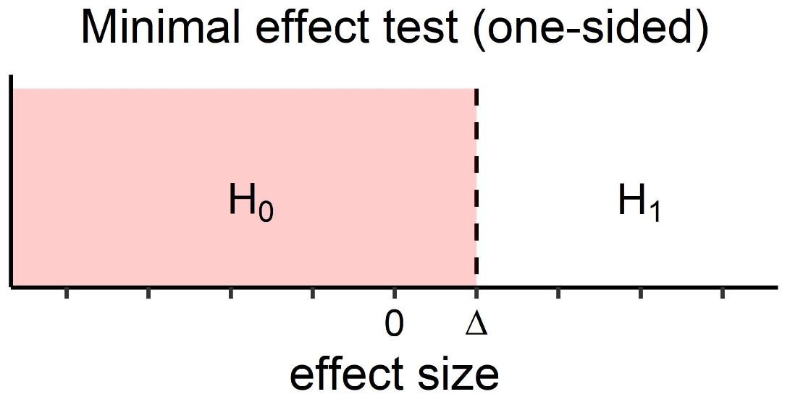
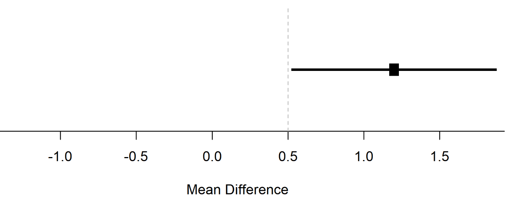
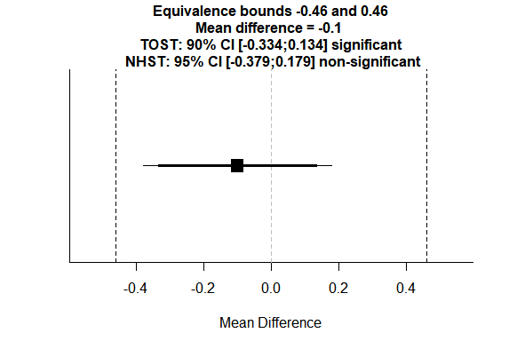

# Severe Tests and Risky Predictions {#severity}

According to Mayo @mayo_statistical_2018 "a claim is severely tested to the extent it has been subjected to and passed a test that probably would have found flaws, were they present."
"The severity requirement gives a minimal principle based on the fact that
highly insevere tests yield bad evidence, no tests (BENT)."

Our minimal requirement for evidence insists that data only provide
genuine or reliable evidence for H if H survives a severe test – a test
H would probably have failed if false.

What we want is an error statistical approach that controls and
assesses a test’s stringency or severity

So significance tests reflect statistical modus tollens, and its reasoning
follows severe testing – BUT, an isolated low P-value won’t suffice to
infer a genuine effect, let alone a research claim. Here’s a list of fallacies of
rejection.
1. The reported (nominal) statistical significance result is spurious (it’s not
even an actual P-value). This can happen in two ways: biasing selection
effects, or violated assumptions of the model.
2. The reported statistically significant result is genuine, but it’s an isolated
effect not yet indicative of a genuine experimental phenomenon. (Isolated
low P-value ≠> H: statistical effect.)
3. There’s evidence of a genuine statistical phenomenon but either (i) the
magnitude of the effect is less than purported, call this a magnitude error,4
or (ii) the substantive interpretation is unwarranted (H ≠> H*).

One last thing. Viewing statistical inference as severe testing doesn’t mean
our sole goal is severity. “Shun error” is not a terribly interesting rule to follow.
To merely state tautologies is to state objectively true claims, but they are
vacuous. We are after the dual aims of severity and informativeness.

The biggest source of handwringing about statistical inference these days
boils down to the fact it has become very easy to infer claims that have been
subjected to insevere tests.

Dienes: The problem though is no different from falsifying any theory. We have to set up a severe
test and make a methodological decision. A test is severe if an outcome has very different
probabilities assuming the hypothesis is true rather than false. We can conventionally decide
that if the set-up allows an outcome very unlikely given the hypothesis, then the test is
severe. Survival of the test then corroborates the hypothesis. Lakatos (1970) presumed that
this Popperian analysis became the same as significance or hypothesis testing in statistics
(see Chapter 3) as taught in most statistics textbooks for scientists.

According to Meehl: "A theory is corroborated to the extent that we have subjected it to such risky tests; the more dangerous tests it has survived, the bet-ter corroborated it is. If I tell you that Meehl’s theory of climate predicts that it will rain sometime next April, and this turns out to be the case, you will not be much impressed with my “predictive success.” Nor will you be impressed if I predict more rain in April than in May, even showing three asterisks (for p < .001) in my t-test table! If I predict from my theory that it will rain on 7 of the 30 days of April, and it rains on exactly 7, you might perk up your ears a bit, but still you would be inclined to think of this as a “lucky coincidence.” But suppose that I specify which 7 days in April it will rain and ring the bell; then you will start getting seriously interested in Meehl’s meteorological conject-ures. Finally, if I tell you that on April 4th it will rain 1.7 inches (.66 cm), and on April 9th, 2.3 inches (.90 cm) and so forth, and get seven of these correct within reasonable tolerance, you will begin to think that Meehl’s theory must have a lot going for it. You may believe that Meehl’s theory of the weather, like all theories, is, when taken literally, false, since probably all theories are false in the eyes of God, but you will at least say, to use Popper’s language, that it is beginning to look as if Meehl’s theory has considerable verisimili-tude, that is, “truth-likeness.”"

Popper (1959): "In the book, a sharp distinction is made between the idea of the probability of a hypothesis, and its degree of corroboration. It is asserted that if we say of a hypothesis that it is well corroborated, we do not say more than that it has been severely tested (it must be thus a hypothesis with a high degree of testability) and that it has stood up well to the severest tests we were able to design so far."

For example, there are tests of a1—that
is to say, attempts to refute a1 by discovering some deviation from
circularity—which are not tests of a2; but there could be no genuine
test of a2 which would not, at the same time, be an attempt to refute a1.
Thus a1 can be more severely tested than a2, it has the greater degree of
testability; and if it stands up to its more severe tests, it will attain a
higher degree of corroboration than a2 can attain.

## Testing Range Predictions

The goal of a hypothesis test is to carefully examine whether predictions that are derived from a scientific theory hold up under scrutiny. Not all predictions we can test are equally exciting. For example, if a researcher asks two groups to report their mood on a scale from 1 to 7, and then predicts the difference between these groups will fall within a range of -6 to +6, we know in advance that it must be so. No result can **falsify** the prediction, and therefore finding a result that **corroborates** the prediction is completely trivial and a waste of time.

To demonstrate our theory has good predictive validity, we need to divide all possible states of the world into a set we consider to be predicted by our theory, and a set that we do not consider predicted by our theory. We can then collect data, and if the results are in line with our prediction (repeatedly, across replication studies), our theory gains **verisimilitude** – it seems to be related to the truth. We can never know the truth, but by corroborating theoretical predictions, we can hope to get closer to it.

The most common division of states of the world that are predicted and that are not predicted by a theory in null-hypothesis significance testing is the following: An effect of exactly zero is *not* predicted by a theory, and all other effects are taken to corroborate the theoretical prediction. Here, I want to explain why this is a very weak hypothesis test. In certain lines of research, it might even be a pretty trivial prediction. Luckily, it is quite easy to perform much stronger tests of hypotheses. I’ll also explain how to do so in practice.

### Risky Predictions

Take a look at the three circles below. Each circle represents all possible outcomes of an empirical test of a theory. The blue line illustrates the state of the world that was observed in a (hypothetical) perfectly accurate study. The line could have fallen anywhere on the circle. We performed a study and found one specific outcome. The black area in the circle represents the states of the world that will be interpreted as *falsifying* our prediction, whereas the white area illustrates the states in the world we predicted, and that will be interpreted as *corroborating* our prediction.

(\#fig:risky1)Three circles vizualizing predictions that exclude different parts of the world.

In the figure on the left, only a tiny fraction of states of the world will falsify our prediction. This represents a hypothesis test where only an infinitely small portion of all possible states of the world is not in line with the prediction. A common example is a two-sided null-hypothesis significance test, which forbids (and tries to reject) only the state of the world where the true effect size is exactly zero.

In the middle circle, 50% of all possible outcomes falsify the prediction, and 50% corroborates it. A common example is a one-sided null-hypothesis test. If you predict the mean is *larger than* zero, this prediction is falsified by all states of the world where the true effect is either *equal to* zero, or *smaller than* zero. This means that half of all possible states of the world can no longer be interpreted as corroborating your prediction. The blue line, or observed state of the world in the experiment, happens to fall in the white area for the middle circle, so we can still conclude the prediction is supported. However, our prediction was already slightly riskier than in the circle on the left representing a two-sided test.

In the scenario in the right circle, almost all possible outcomes are not in line with our prediction – only 5% of the circle is white. Again, the blue line, our observed outcome, falls in this white area, and our prediction is confirmed. However, now our prediction is confirmed in a very risky test. There were many ways in which we could be wrong – but we were right regardless.

Although our prediction is confirmed in all three scenarios above, philosophers of science such as Popper and Lakatos would be most impressed after your prediction has withstood the most severe test (i.e., in the scenario illustrated by the right circle). Our prediction was most specific: 95% of possible outcomes were judged as falsifying our prediction, and only 5% of possible outcomes would be interpreted as support for our theory. Despite this high hurdle, our prediction was corroborated. Compare this to the scenario on the left – almost any outcome would have supported our theory. That our prediction was confirmed in the scenario in the left circle is hardly surprising.

### Systematic Noise

The scenario in the left, where only a very small part of all possible outcomes is seen as falsifying a prediction, is very similar to how people commonly use null-hypothesis significance tests. In a null-hypothesis significance test, any statistically significant effect that is not zero is interpreted as support for a theory. Is this impressive? That depends on the possible states of the world. According to Meehl, there are many situations where null-hypothesis significance tests are performed, but the true difference is highly unlikely to be exactly zero. Meehl is especially worried about research where there is room for **systematic noise**, or the **crud factor**.

Systematic noise can only be excluded in an ideal experiment. In this ideal experiment, there is perfect random assignment to conditions, and only one single thing can cause a difference, such as in a **randomized controlled trial**. Perfection is notoriously hard to achieve in practice. In any close to perfect experiment, there can be tiny factors that, although not being the main goal of the experiment, lead to differences between the experimental and control condition. Participants in the experimental condition might read more words, answer more questions, need more time, have to think more deeply, or process more novel information. Any of these things could slightly move the true effect size away from zero – without being related to the independent variable the researchers aimed to manipulate. This is why Meehl calls it *systematic* noise, and not *random* noise: The difference is reliable, but not due to something you are **theoretically interested** in.

Many experiments are not even close to perfect and consequently have a lot of room for systematic noise. And then there are many studies where there isn’t even random assignment to conditions, but where data is correlational. As an example of correlational data, think about research examining differences between women and men. If we examine differences between men and women, the subjects in our study can not be randomly assigned to a condition. In such non-experimental studies, it is possible that ‘**everything is correlated to everything**’. Or slightly more formally (Orben & Lakens, 2019), crud can be defined as the epistemological concept that, in correlational research, all variables are connected through multivariate causal structures which result in real non-zero correlations between all variables in any given dataset.

For example, men are on average taller than women, and as a consequence it is more common for a man to be asked to pick an object from a high shelf in a supermarket, than vice versa. If we then ask men and women ‘how often do you help strangers’ this average difference in height has some tiny but systematic effect on their responses. In this specific case, systematic noise moves the mean difference from zero to a slightly higher value for men – but an unknown number of other sources of systematic noise are at play, and these all interact, leading to an unknown final true population difference that is very unlikely to be exactly zero.

Null-Hypothesis Significance Tests are so common we rarely think about whether they are the right question to ask. But **when you perform a null-hypothesis test, you should justify why the null-hypothesis is an interesting hypothesis to test against**. This is not always self-evident, and sometimes the null hypothesis is simply not very interesting. Whenever you do research, look at your hypothesis tests and ask yourself whether **the null hypothesis was justified**. Was it plausible that the null hypothesis was true? And was it an interesting value to test against?

I think there are experiments that, for all practical purposes, are controlled enough to make a point null-hypothesis a valid and realistic model to test against. However, I also think that these experiments do not encompass all the current uses of null-hypothesis testing. There are many experiments where a test against a null-hypothesis is performed, while the point null-hypothesis is not reasonable to entertain, and we can’t expect the difference to be exactly zero.

In those studies (e.g., as in the experiment examining differences between men and women above) it is much more impressive to have a theory that is able to predict how big an effect is (approximately). In other words, we should aim for theories that make **point predictions**, or a bit more reasonably, given that most sciences have a hard time predicting a single exact value, **range predictions**.

### Range Predictions

Making more risky *range predictions* has some important benefits over the widespread use of null-hypothesis tests. These benefits mean that even if a null-hypothesis test is defensible, it would be preferable if you could test a range prediction.

Making a more risky prediction gives your theory higher **verisimilitude**. You will get more credit in darts when you correctly predict you will hit the bullseye, than when you correctly predict you will hit the board. Many sports work like this, such as figure skating or gymnastics. The riskier the routine you perform, the more points you can score, since there were many ways the routine could have failed if you lacked the skill. Similarly, you get more credit for the predictive power of your theory when you correctly predict an effect will fall within 0.5 scale points of 8 on a 10 point scale, than when you predict the effect will be larger than the midpoint of the scale. A theory
allows you to make predictions, and a good theory allows you to make precise predictions.

Range predictions allow you to design a study that can be **falsified based on clear criteria**. If you specify the bounds within which an effect should fall, any effect that is either smaller or larger will falsify the prediction. For a traditional null-hypothesis test, a significant effect of 0.0000001 will officially still fall in the possible states of the world that support the theory. However, it is practically impossible to falsify such tiny differences from zero, because doing so would require huge resources. 

### Directional Tests

Researchers often have a directional hypothesis when comparing two groups (e.g., the reaction times in the implicit association test are slower in the incongruent block compared to the congruent block). In these situations, researchers can choose to use either a two-sided test or a one-sided test. One-sided tests are more powerful than two-sided tests. If you design a test with 80% power, a one-sided test requires [approximately](https://gist.github.com/Lakens/ef232b3bbbec3258a251cdce26f91945) **78% of the total sample of a two-sided test**. This means that the use of one-sided tests would make researchers more efficient. In addition, a one-sided test is a riskier prediction than a two-sided test. We have limited all possible outcomes that we predict by 50%, which is quite impressive.

(\#fig:onsided)Vizualization of a diferectional (or one-sided) hypothesis test.

Many researchers have reacted negatively to the “widespread overuse of two-tailed testing for directional research hypotheses tests” (Cho & Abe, 2013). Others argue that directional tests should not be used. I think a fair summary of this discussion is that 1) directional tests should always be pre-registered (I agree), 2) they require smaller sample sizes, and therefore you will end up with less evidence (which is true, but if you want a specific amount of evidence, you should design studies to achieve a desired level of evidence instead of designing studies where error rates are controlled), and 3) when results in both directions are practically relevant, such as in medical research where we care both about improving lives, and not making lives worse, directional tests might only be desirable in very specific circumstances (I agree). Although these caveats are important, in many cases researchers make directional predictions. They would consider their predictions proven wrong by an effect of 0, or an effect in the opposite direction. Effects of 0, or effects in the opposite direction, might be interesting enough to follow up on. But if the question is whether some manipulation leads to a positive effect, a result of a one-sided test is the logical answer to that question.

Two-sided tests are so common we rarely think about whether they are the
right question to ask. But if you make a directional prediction, it often makes
sense to perform a directional test. When you read the literature, look at the main hypothesis in the introduction. Did the hypothesis make a one-sided prediction? Then take a look at the result section. Was the hypothesis tested in a two-sided test?

### Minimal Effect Tests

A directional test can use a null-hypothesis of an effect of 0, but we can also perform a hypothesis test not against 0, but against a smallest effect size of interest. This is known as a minimal effect test. In a minimal effect test, the null-hypothesis is any value smaller than the values we care about. For example, imagine we have designed an after-school training program to improve the language ability of young children. This program has a positive effect whenever we can reject the null hypothesis of an effect size of 0. But the training program also has costs, and if it improved language ability 0.00001 on a standardize test where students can score between 0 and 100, it will not be worth implementing the training program. Based on a cost-benefit analysis, a team of experts has decided the training program is worth the costs if the improvement is larger than 5%. Therefore, they test against a smallest effect of interest (Δ) of 5, instead of testing against 0. The null hypothesis is now any effect up to 5%. We reject the null hypothesis if the observed effect is statistically larger than 5%.

(\#fig:minimaleffect)Vizualization of a minimal effect test.

Many of the criticisms on *p*-values in null-hypothesis tests where H0 = 0 disappear when *p*-values are calculated for a minimal effect test. In a traditional hypothesis test with at least some systematic noise (meaning the true effect differs slightly from zero) all studies where the null is not exactly true will lead to a significant effect with a large enough sample size. This makes it a boring (i.e., not risky) prediction, and we will end up stating there is a ‘significant’ difference for tiny irrelevant effects. I expect this problem will become more important now that it is easier to get access to Big Data.

However, we don’t want just any effect to become statistically significant – we want **theoretically or practically relevant** effects to be significant, but not **theoretically or practically irrelevant** effects. A minimal effect test achieves this. If we predict effects larger than 5%, an effect of 1% might be statistically different from 0 in a huge sample, but it is not **practically relevant**.

### Range Predictions in PRactice

In a null-hypothesis test (visualized below) we compare the observed mean (the black square) and the 95% confidence interval (the length of the horizontal line through the square) against the hypothesis that the difference is 0 (indicated by the dotted vertical line at 0). Let’s imagine the test yields a *p* = 0.047. If we use an alpha level of 0.05, this is just below the alpha threshold. The observed difference (indicated by the square) has a confidence interval that ranges from almost close to 0 to 1.4. We can reject the null, but beyond that, we haven’t learned much.

(\#fig:NHST1)NHST with a wide confidence interval.

In the example above, we were testing against a mean difference of 0. But there is no reason why a hypothesis test should be limited to test against a mean difference of 0. For example, let’s assume effects smaller than 0.5 are considered too small to matter. In this case, we can perform a minimal effect test against 0.5 instead of 0. In the figure below, we again see a *p* = 0.047 result, but now for a much riskier test, namely against a smallest effect of interest of 0.5.

(\#fig:risktest1)Minimal effect test with a wide confidence interval.

People often report a manipulation check in their articles. For example, based on previous work, they have selected 20 positive words and 20 negative words, and use these in an experiment. They might ask participants after the study to evaluate these words as a manipulation check. For example, in one of the articles that were part of my PhD thesis, I wrote:

>*Manipulation check*. Positive words were judged as more positive (*M* = 6.51)
than negative words (*M* = 1.80), and a paired-samples *t*-test indicated this
difference was significant, *t*(32) = 29.06, *p* \< .001.

The positive and negative stimuli were evaluated on a 7-point scale. **Given that they were explicitly selected to be extremely positive and negative, is this test really contributing something**? You might argue that at least it confirms that they differ, but in practice, we are reaching a foregone conclusion. Are we happy when the difference in evaluation is simply greater than zero? Imagine I repeat the experiment with 2000 participants, and used positive words and negative words that differed statistically from each other. However, the manipulation check shows the mean of positive words is 4.10, and the mean of negative words is 3.90. I argue that the difference between words is again statistically significant. Is this a valid replication? Probably not. The real question was perhaps not if the evaluations of these two groups differ, but **how much they minimally need to differ to lead to the predicted effects**. Is a difference of 6.51-1.80 = 4.71 scale points needed? Is a difference of 0.20 scale points sufficient as well? 

When you read the literature, look at the null-hypothesis tests (whether Bayesian or frequentist) and judge if the question of whether the effect is zero is interesting, or if the authors might actually have been implicitly arguing for the presence of some unspecified minimal effect. **If you were able to specify this minimal effect, would it have made more sense to report a minimal effect test for some of the hypothesis tests**?

Meehl (1967 – yes, that is more than 40 years ago!) compared the use of statistical tests in psychology and physics, and notes that in physics, researchers make point predictions. One way to test point predictions is to examine whether the observed mean falls between an upper and lower bound. Such a test is visualized in the figure below. We have set bounds of -0.5 and 0.5, and predict our observed mean falls within these bounds. Note that the bounds happen to be symmetric around 0, but you can set the bounds wherever you like.

(\#fig:intervaltest)Test of an interval hypothesis.

If you have learned about **equivalence testing** (see Lakens, Scheel, & Isager, 2018, and later in this course), you might recognize the practice of specifying these bounds (referred to as equivalence bounds) to examine whether the effect falls within an equivalence range – a range of values close enough to 0 to find the effects too small to matter. An equivalence test is basically a specific version of a range prediction, where the goal is to reject effects that are large enough to matter, so that we can conclude the effect is **practically equivalent to zero**.

But you can use equivalence tests to test any range. Let’s revisit our manipulation check example from above. The difference in means (in a dependent *t*-test) was 4.71 (6.51 - 1.80). We can test this difference against 0 in a one-sample *t*-test (which is the same as testing the two means against each other in a dependent *t*-test). But we can also perform a minimal effect test. Let’s start with the modest prediction that the difference in means should be not just larger than 0, but larger than 1. In other words, we aim to test the difference score against a lower bound of 1. We have no upper bound we want to test against, and in the test below, we simply fill in a very large value (a
difference of 10, while the maximum difference on a 7 point scale is 6) so that the test result is mainly determined by the one-sided test against a difference of 1 (the equivalence test used here reports the highest *p*-value from the pair of two one-sided tests). If we would perform this test, we would find:

Equivalence Test Result:

The equivalence test was significant, t(32) = 22.892, p =
0.00000000000000000000104, given equivalence bounds of 1.000 and 10.000 (on a
raw scale) and an alpha of 0.05.

Null Hypothesis Test Result:

The null hypothesis test was significant, t(32) = 29.062, p =
0.00000000000000000000000142, given an alpha of 0.05.

(\#fig:intervalresult)The result of an interval hypothesis test.

Although Meehl prefers **point predictions that lie within a certain range**, he doesn’t completely reject the use of null-hypothesis significance testing. When he asks ‘Is it ever correct to use null-hypothesis significance tests?’ his own answer is ‘Of course it is’ (Meehl, 1990). **There are times, such as very early in research lines, where researchers do not have good enough models, or reliable existing data, to make point or range predictions**. Other times, two competing theories are not more precise than that one predicts rats in a maze will learn *something*, while the other theory predicts the rats will learn *nothing*. As Meehl writes: “When I was a rat psychologist, I unabashedly employed significance testing in latent-learning experiments; looking back I see no reason to fault myself for having done so in the light of my present methodological views.”

There are no good or bad statistical approaches – all statistical approaches are just answers to questions. **What matters is asking the best possible question**. It makes sense to allow traditional null-hypothesis tests early in research lines, when theories do not make more specific predictions than that ‘something’ will happen. But we should also push ourselves to develop theories that make more precise range predictions, and then test these more specific predictions. More mature theories should be able to predict effects in some range – even when these ranges are relatively wide.

Cho, H.-C., & Abe, S. (2013). Is two-tailed testing for directional research
hypotheses tests legitimate? Journal of Business Research, 66(9), 1261–1266.
<https://doi.org/10.1016/j.jbusres.2012.02.023>

Lakens, D., Scheel, A. M., & Isager, P. M. (2018). Equivalence Testing for
Psychological Research: A Tutorial. *Advances in Methods and Practices in
Psychological Science*, 2515245918770963. <https://doi.org/10/gdj7s9>

Meehl, P. E. (1967). Theory-testing in psychology and physics: A methodological
paradox. Philosophy of Science, 103–115.

Meehl, P. E. (1990). Appraising and amending theories: The strategy of
Lakatosian defense and two principles that warrant it. *Psychological Inquiry*,
*1*(2), 108–141.

Orben, A., & Lakens, D. (2019). Crud (Re)defined.
https://doi.org/10.31234/osf.io/96dpy

## Verisimilitude, Belief, and Progress in Psychological Science

Does science offer a way to learn what is true about our world? According to the perspective in philosophy of science known as *scientific realism*, the answer is ‘yes’. Scientific realism is the idea that successful scientific theories that have made novel predictions give us a good reason to believe these theories make statements about the world that are at least partially true. Known as the *no miracle argument*, only realism can explain the success of science, which consists of repeatedly making successful predictions (Duhem, 1906), without requiring us to believe in miracles.

Not everyone thinks that it matters whether scientific theories make true statements about the world, as scientific realists do. Laudan (1981) argues against scientific realism based on a pessimistic meta-induction: If theories that were deemed successful in the past turn out to be false, then we can reasonably expect all our current successful theories to be false as well. Van Fraassen (1980) believes it is sufficient for a theory to be ‘empirically adequate’, and make true predictions about things we can observe, irrespective of whether these predictions are derived from a theory that describes how the
unobservable world is in reality. This viewpoint is known as *constructive empiricism*. As Van Fraassen summarizes the constructive empiricist perspective (1980, p.12): “Science aims to give us theories which are empirically adequate; and acceptance of a theory involves as belief only that it is empirically
adequate”. 

The idea that we should ‘believe’ scientific hypotheses is not something scientific realists can get behind. Either they think theories make true statements about things in the world, but we will have to remain completely agnostic about when they do (Feyerabend, 1993), or they think that corroborating novel and risky predictions makes it reasonable to believe that a theory has some ‘truth-likeness’, or *verisimilitude*. The concept of verisimilitude is based on the intuition that a theory is closer to a true statement when the
theory allows us to make more true predictions, and less false predictions. When data is in line with predictions, a theory gains verisimilitude, when data are not in line with predictions, a theory loses verisimilitude (Meehl, 1978). Popper clearly intended verisimilitude to be different from belief (Niiniluoto, 1998). Importantly, verisimilitude refers to how close a theory is to the truth, which makes it an ontological, not epistemological question. That is, verisimilitude is a function of the degree to which a theory is similar to the truth, but it is not a function of the degree of belief in, or the evidence for,
a theory (Meehl, 1978, 1990). It is also not necessary for a scientific realist that we ever know what is true – we just need to be of the opinion that we can move closer to the truth (known as comparative scientific realism, Kuipers, 2016).

Attempts to formalize verisimilitude have been a challenge, and from the perspective of an empirical scientist, the abstract nature of this ongoing discussion does not really make me optimistic it will be extremely useful in everyday practice. On a more intuitive level, verisimilitude can be regarded as the extent to which a theory makes the most correct (and least incorrect) statements about specific features in the world. One way to think about this is using the ‘possible worlds’ approach (Niiniluoto, 1999), where for each basic state of the world one can predict, there is a possible world that contains each unique combination of states.

For example, consider the experiments by Stroop (1935), where color related words (e.g., RED, BLUE) are printed either in congruent colors (i.e., the word RED in red ink) or incongruent colors (i.e., the word RED in blue ink). We might have a very simple theory predicting that people automatically process irrelevant information in a task. When we do two versions of a Stroop experiment, one where people are asked to read the words, and one where people are asked to name the colors, this simple theory would predict slower responses on incongruent trials, compared to congruent trials. A slightly more advanced theory predicts that congruency effects are dependent upon the salience of the word dimension and color dimension (Melara & Algom, 2003). Because in the standard Stroop experiment the *word* dimension is much more salient in both
tasks than the *color* dimension, this theory predicts slower responses on incongruent trials, but only in the color naming condition. We have four possible worlds, two of which represent predictions from either of the two theories, and two that are not in line with either theory.

|         | Responses Color Naming | Responses Word Naming |
|---------|------------------------|-----------------------|
| World 1 | Slower                 | Slower                |
| World 2 | Slower                 | Not Slower            |
| World 3 | Not Slower             | Slower                |
| World 4 | Not Slower             | Not Slower            |

In an unpublished working paper, Meehl (1990b) discusses a ‘box score’ of the number of successfully predicted features, which he acknowledges is too simplistic. No widely accepted formalized measure of verisimilitude is available to express the similarity between the successfully predicted features by a
theory, although several proposals have been put forward (Niiniluoto, 1998; Oddie, 2013, for an example based on Tversky's (1977) contrast model, see Cevolani, Crupi, & Festa, 2011). However, even if formal measures of verisimilitude are not available, it remains a useful concept to describe theories that are assumed to be closer to the truth because they make novel predictions (Psillos, 1999).

As empirical scientists, our main job is to decide which features are present in our world. Therefore, we need to know if predictions made by theories are corroborated or falsified in experiments. To be able to falsify a theory, it needs to forbid certain states of the world (Lakatos, 1978). This is not easy, especially for probabilistic statements, which is the bread and butter of psychological science. Where a single black swan is clearly observable, probabilistic statements only reach their true predicted value in infinity, and every finite sample will have some variation around the predicted value.
However, according to Popper, probabilistic statements can be *made* falsifiable by interpreting probability as the relative frequency of a result in a specified hypothetical series of observations, and decide that reproducible regularities are not attributed to randomness (Popper, 2002). Even though any finite sample
will show some variation, we can decide upon a limit of the variation. Researchers can use the limit of variation that is allowed as a *methodological rule*, and decide whether a set of observations falls in a ‘forbidden’ state of the world, or in a ‘permitted’ state of the world, according to some theoretical
prediction.

This *methodological falsification* (Lakatos, 1978) is clearly inspired by a Neyman-Pearson perspective on statistical inferences. Popper (2002, p. 168) acknowledges feedback from the statistician Abraham Wald, who developed statistical decision theory based on the work by Neyman and Pearson (Wald, 1992). Lakatos (1978, p. 25) writes how we can make predictions falsifiable by “specifying certain rejection rules which may render statistically interpreted evidence 'inconsistent' with the probabilistic theory” and notes: “this
methodological falsificationism is the philosophical basis of some of the most interesting developments in modern statistics. The Neyman-Pearson approach rests completely on methodological falsificationism”. To use methodological falsification, Popper describes how empirical researchers need to decide upon an interval within which the predicted value will fall. We can then calculate for any number of observations the probability that our value will indeed fall within this range, and design a study such that this probability is very high, or that it’s complementary probability, which Popper denotes by ε, is small. We can recognize this procedure as a Neyman-Pearson hypothesis test, where ε is the Type 2 error rate. In other words, high statistical power, or when the null is true, a very low alpha level, can corroborate a hypothesis.

Popper distinguishes between subjective probabilities (where the degree of probability is expressed as feelings of certainty, or, belief), and objective probabilities (where probabilities are relative frequencies with which an event occurs in a specified range of observations. Popper strongly believed that the corroboration of tests was based on Frequentist, not Bayesian, probabilities (Popper, p. 434): “As to degree of corroboration, it is nothing but a measure of the degree to which a hypothesis h has been tested, and of the degree to which it has stood up to tests. It must not be interpreted, therefore, as a degree of
the rationality of our belief in the truth of h [the hypothesis]”. For a scientific realist, who believes the main goal of scientists is to identify features of the world that corroborate or falsify theories, what matters is whether theories are truthlike, not whether you *believe* they are truthlike. As Taper and Lele (2011) express this viewpoint: “It is not that we believe that Bayes' rule or Bayesian mathematics is flawed, but that from the axiomatic foundational definition of probability Bayesianism is doomed to answer questions irrelevant to science. We do not care what you believe, we barely care what we believe, what we are interested in is what you can show.” Indeed, if the goal is to identify the presence or absence of features in the world to develop more truth-like theories, we mainly need procedures that allow us to make choices about the presence or absence of these features with high accuracy. Subjective belief plays no role in these procedures.

To identify the presence or absence of features with high accuracy, we need a statistical procedure that allows us to make decisions while controlling the probability we make an error. This idea is translated into practice in hypothesis testing procedures put forward by Neyman and Pearson (1933): “We are inclined to think that as far as a particular hypothesis is concerned, no test based upon the theory of probability can by itself provide any valuable evidence of the truth or falsehood of that hypothesis. But we may look at the purpose of tests from another view-point. Without hoping to know. whether each separate hypothesis is true or false, we may search for rules to govern our behaviour with regard to them, in following which we insure that, in the long run of experience, we shall not be too often wrong.” Any procedure with good error control can be used (although Popper stresses that these findings should also be replicable). Some authors prefer likelihood ratios where error rates have maximum bounds (Royall, 1997; Taper & Ponciano, 2016), but in general, frequentists hypothesis tests are used where both the Type 1 error rate and the Type 2 error rate are controlled.

Meehl (1978) believes “the almost universal reliance on merely refuting the null hypothesis as the standard method for corroborating substantive theories in the soft areas is a terrible mistake, is basically unsound, poor scientific strategy, and one of the worst things that ever happened in the history of psychology”. Meehl is of this opinion, not because hypothesis tests are not useful, but because they are not used to test risky predictions. Meehl remarks that “When I was a rat psychologist, I unabashedly employed significance testing in latent-learning experiments; looking back I see no reason to fault myself for having done so in the light of my present methodological views” (Meehl, 1990a). When one theory predicts rats learn nothing, and another theory predicts rats learn *something*, even Meehl believed testing the difference between an experimental and control group was a useful test of a theoretical prediction. However, Meehl believes that many hypothesis tests are used in a way such that they actually do not increase the verisimilitude of theories are all. If you predict gender differences, you will find them more often than not in a large enough sample. Because people can not be randomly assigned to gender conditions, the null hypothesis is most likely false, not predicted by any theory, and therefore rejecting the null hypothesis does not increase the verisimilitude of any theory. But as a scientific realist, Meehl believes accepting or rejecting predictions is a sound procedure, as long as you test risky predictions in procedures with low error rates. Using such procedures, we have observed an asymmetry in the Stroop experiments, where the interference effect is much
greater in the color naming task than in the word naming task, which leads us to believe the theory that takes into account the salience of the word and color dimensions has higher truth-likeness.

From a scientific realist perspective, Bayes Factors or Bayesian posteriors do not provide an answer to the main question of interest, which is the verisimilitude of scientific theories. Belief can be used to decide which questions to examine, but it can not be used to determine the truth-likeness of a theory. Obviously, if you reject realism, and follow anti-realist philosophical viewpoints such as Fraassen’s constructive empiricism, then you also reject verisimilitude, or the idea that theories can be closer to an unobservable and unknowable truth. I understand most psychologists do not choose their statistical approaches to follow logically from their philosophy on science, and instead follow norms or hypes. But I think it is useful to at least reflect upon basic questions. What is the goal of science? Can we approach the truth, or can we only *believe* in hypotheses? There should be some correspondence between your choice of statistical inferences, and your philosophy of science. 

References

Cevolani, G., Crupi, V., & Festa, R. (2011). Verisimilitude and belief change
for conjunctive theories. *Erkenntnis*, *75*(2), 183.

Feyerabend, P. (1993). *Against method* (3rd ed). London ; New York: Verso.

Kuipers, T. A. F. (2016). Models, postulates, and generalized nomic truth
approximation. *Synthese*, *193*(10), 3057–3077.
https://doi.org/10.1007/s11229-015-0916-9

Lakatos, I. (1978). *The methodology of scientific research programmes: Volume
1: Philosophical papers* (Vol. 1). Cambridge University Press.

Laudan, L. (1981). A confutation of convergent realism. *Philosophy of Science*,
*48*(1), 19–49.

Meehl, P. E. (1978). Theoretical Risks and Tabular Asterisks: Sir Karl, Sir
Ronald, and the Slow Progress of Soft Psychology. *Journal of Consulting and
Clinical Psychology*, *46*, 806–834.

Meehl, P. E. (1990a). Appraising and amending theories: The strategy of
Lakatosian defense and two principles that warrant it. *Psychological Inquiry*,
*1*(2), 108–141.

Meehl, P. E. (1990b). *Corroboration and verisimilitude: Against Lakatos’ “sheer
leap of faith.”* Working Paper, MCPS-90-01). Minneapolis: University of
Minnesota, Center for Philosophy of Science. Retrieved from
http://meehl.umn.edu/sites/g/files/pua1696/f/146corroborationverisimilitude.pdf

Melara, R. D., & Algom, D. (2003). Driven by information: A tectonic theory of
Stroop effects. *Psychological Review*, *110*(3), 422–471.
https://doi.org/10.1037/0033-295X.110.3.422

Neyman, J., & Pearson, E. S. (1933). On the Problem of the Most Efficient Tests
of Statistical Hypotheses. *Philosophical Transactions of the Royal Society of
London A: Mathematical, Physical and Engineering Sciences*, *231*(694–706),
289–337. https://doi.org/10.1098/rsta.1933.0009

Niiniluoto, I. (1998). Verisimilitude: The Third Period. *The British Journal
for the Philosophy of Science*, *49*, 1–29.

Niiniluoto, I. (1999). *Critical Scientific Realism*. Oxford University Press.

Oddie, G. (2013). The content, consequence and likeness approaches to
verisimilitude: compatibility, trivialization, and underdetermination.
*Synthese*, *190*(9), 1647–1687. https://doi.org/10.1007/s11229-011-9930-8

Popper, K. R. (2002). *The logic of scientific discovery*. London; New York:
Routledge.

Psillos, S. (1999). *Scientific realism: how science tracks truth*. London; New
York: Routledge.

Royall, R. (1997). *Statistical Evidence: A Likelihood Paradigm*. London ; New
York: Chapman and Hall/CRC.

Stroop, J. R. (1935). Studies of interference in serial verbal reactions.
*Journal of Experimental Psychology*, *18*(6), 643.

Taper, M. L., & Lele, S. R. (2011). Philosophy of Statistics. In P. S.
Bandyophadhyay & M. R. Forster (Eds.), *Evidence, evidence functions, and error
probabilities* (pp. 513–531). Elsevier, USA.

Taper, M. L., & Ponciano, J. M. (2016). Evidential statistics as a statistical
modern synthesis to support 21st century science. *Population Ecology*, *58*(1),
9–29.

Tversky, A. (1977). Features of similarity. *Psychological Review*, *84*(4),
327.

Van Fraassen, B. C. (1980). *The scientific image*. Oxford : New York: Clarendon
Press ; Oxford University Press.

Wald, A. (1992). Statistical Decision Functions. In S. Kotz & N. L. Johnson
(Eds.), *Breakthroughs in Statistics* (pp. 342–357). Springer New York.
https://doi.org/10.1007/978-1-4612-0919-5_22

