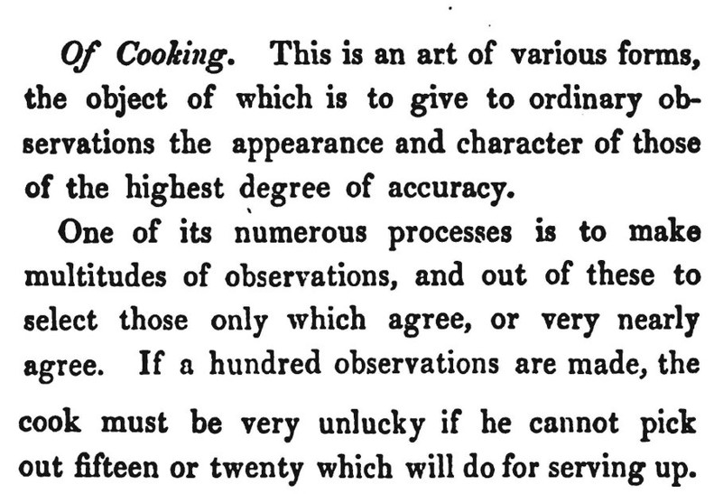
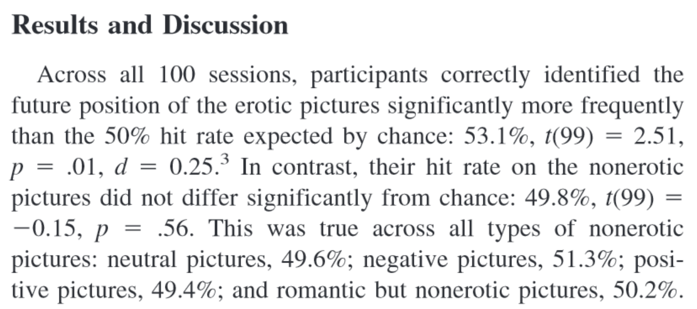
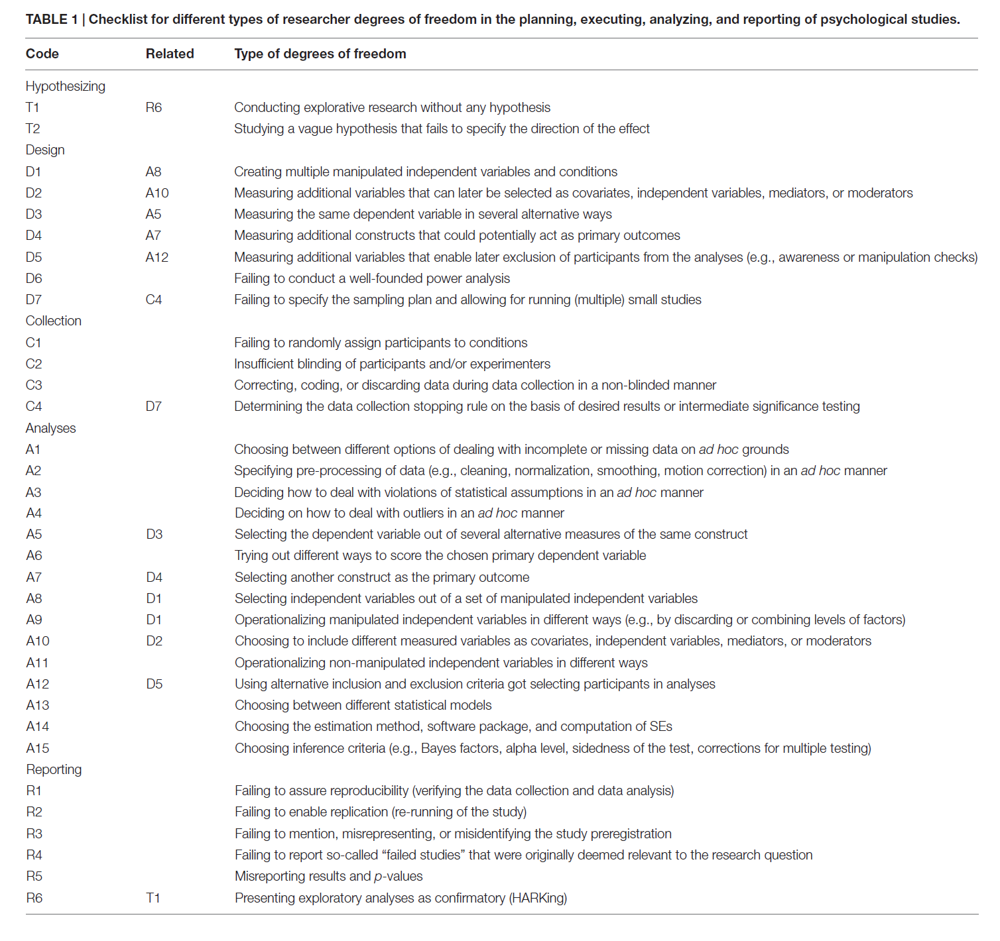

# Preregistration and Transparency {#prereg}

For as long as data has been used to support scientific claims people have tried to selectively present data in line with what they wish to be true. In his treatise ‘On the Decline of Science in England: And on Some of its Cases’ Babbage @babbage_reflections_1830 discusses what he calls cooking: 

<div class="figure" style="text-align: center">

<p class="caption">(\#fig:babbage)Excerpt from Babbage, 1830.</p>
</div>

The practice Babbage describes is still a problem, almost 200 years later. Researchers still make 'multitudes of observations' only to present those that support the story they want to tell. An example of a scientist who does this is Daryl Bem, a parapsychologist who studies whether people have extra-sensory perception that allows them to predict the future. In Figure \@ref(fig:bem) you see the results and discussion from a study he performed [@bem_feeling_2011]. In this study participants pressed a left or right button to predict whether a picture was hidden behind a left or right curtain. At the moment they made the decision, not even the computer had randomly determined where this picture would appear, so any performence better than average would be very surprising.

<div class="figure" style="text-align: center">

<p class="caption">(\#fig:bem)Screenshot from the Results and Discussion section of Bem, 2011.</p>
</div>

If we take this study as it is (without pre-registration) it is clear there are 5 tests against guessing average (for erotic, neutral, negative, positive, and ‘romantic but non-erotic’ pictures). A Bonferroni correction would lead us to use an alpha level of 0.01 (an alpha of 0.05/5 tests) and the main result, that participants guessed the future position of erotic pictures above guessing average, with a *p*-value of 0.013, would not have allowed Bem to reject the null-hypothesis, given the pre-specified alpha level.

Which of the five categories (erotic, neutral, negative, positive, and romantic but non-erotic pictures) would you have predicted that people would perform better than guessing average at, if we had evolved the ability to predict the future? Do you think Bem predicted an effect for the erotic pictures? You might not trust Bem predicted an effect only for this specific group of stimuli, and that he was 'cooking' - making multitudes of observations, and selecting the significant result, and that in the introduction to the study, he was HARKing - hypothesizing after the results are known [@kerr_harking_1998]. Do you think others researchers should simply trust that you predicted a reported outcome, if you performed a study with multiple conditions, and you found an effect in only one condition? 

<!-- # ```{r bemmeta, fig.margin=FALSE, echo=FALSE, fig.cap="Screenshot from a meta-analysis published by Bem and colleagues, 2015."} -->
<!-- # knitr::include_graphics("images/bemmeta.png") -->
<!-- # ``` -->

<!-- @bem_must_2011 explicitly says he predicted this specific test. I personally think Bem isn't telling the truth. I know this is a harsh thing to say, but in a meta-analysis of precognition studies [@bem_feeling_2015] the only studies Bem shares are all significant or marginally significant, and all confidence intervals in Figure \@ref(fig:bemmeta) show a pattern you will recognize from the chapter on [publication bias](#bias). In other words, even when he could have emptied his filedrawer in his own meta-analyses, he didn't. Furthermore, in this [interview](https://slate.com/health-and-science/2017/06/daryl-bem-proved-esp-is-real-showed-science-is-broken.html) he also admitted that "I used data as a point of persuasion, and I never really worried about, ‘Will this replicate or will this not?" (see also [this post](https://www.susanblackmore.uk/daryl-bem-psi-ganzfeld/) by Susan Blackmore).  -->

<!-- I see absolutely no reason to believe the research Bem publishes without a preregistration document for the study he performed (or for any studies he will perform in the future, for that matter). It would be great if we could trust all scientists, but cases like Daryl Bem show that we can't. As @vazire_quality_2017 writes: "Without high levels of transparency in scientific publications, consumers of scientific manuscripts are in a similar position as buyers of used cars – they cannot reliably tell the difference between lemons and high quality findings." So being transparent is a good way to allow others to evaluate the quality of your findings. -->

## The value of preregistration

In the past researchers have proposed solutions to prevent bias in the literature due to inflated Type 1 error rates as a result of selective reporting. For example, Bakan (1966) discussed the problematic aspects of choosing whether or not to perform a directional hypothesis test after looking at the data. If a researcher chooses to perform a directional hypothesis test only when the two-sided hypothesis test yields a *p*-value between 0.05 and 0.10 (i.e., when a test yields *p* = 0.08, the researcher decides after seeing the result that a one-sided test was also warranted, and reports the *p*-value as 0.04, one-sided) then in practice the Type 1 error rate is doubled (i.e., is 0.10 instead of 0.05). Bakan (p. 431) writes: “How should this be handled? Should there be some central registry in which one registers one's decision to run a one- or two-tailed test before collecting the data? Should one, as one eminent psychologist once suggested to me, send oneself a letter so that the postmark would prove that one had pre-decided to run a one-tailed test?”

With the rise of the internet it has become feasible to create online registries that allow researchers to specify their research design, data collection, and the planned analyses before the data is collected. This makes it possible to see which predictions are confirmed, based on statistical analyses that are not influences by looking at the results they give. Instead of choosing which of 5 dependent variables yield a significant result, and than writing an introduction that pretends to have predicted this effect, a practice known as HARKing [@kerr_harking_1998], the reported analyses actually test the predictions researchers had before they looked at the data.

Preregistration has the goal to allow others to transparently evaluate the capacity of a test to falsify a prediction [@lakens_value_2019]. When effect size estimates are biased, for example due to the desire to obtain a *significant* result, hypothesis tests performed on these estimates have inflated Type 1 error rates. When bias emerges due to the desire to obtain a *non-significant* test result hypothesis tests have reduced statistical power. The goal of preregistration is not simply to control the Type 1 error rate in hypothesis tests, but to prevent researchers from non-transparently reducing the capacity of the test to falsify a prediction in general. 

Preregistration adds value for people who, based on their philosophy of science, increase their trust in claims that are supported by severe tests and predictive successes. Preregistration itself does not make a study better or worse compared to a non-preregistered study. Instead, it merely allows researchers to transparently evaluate the [severity](#severity) of a test [@lakens_value_2019]. The severity of a test is in theory unrelated to whether it is preregistered. However, in practice there will almost always be a correlation between the ability to transparently evaluate the severity of a test and preregistration, both because researchers can often selectively report results, use optional stopping, or come up with a plausible hypothesis after the results are known, and because theories rarely completely constrain the test of predictions.

Preregistration is a tool, and researchers who use it should do so because they have a goal that preregistration facilitates. If the use of a tool is detached from a philosophy of science it risks becoming a heuristic. Researchers should not choose to preregister because it has become a new norm, but they should preregister because they can justify based on their philosophy of science how preregistration supports their goals. There are many types of research for which preregistration is not necessary. Although it is always good to be as transparent as possible when doing research, from a philosophy of science perspective, the unique value of preregistration is limited to research which aims to severely test predictions.

<!-- ## Registered Reports -->

<!-- Anne's study, summary of what and how and where to get information. -->

<!-- ## Preregister your study? -->

<!-- If the previous sections have convinced you that, for at least some of the hypothesis testing studies you perform, it is useful to preregister your research, logical questions are: *How* and *Where*? -->

<!-- ADD -->

### How to preregister

The more detail a preregistration document has, the easier it is for others to transparently evaluate the severity of the tests that are performed. Because it is difficult to come up with all aspects that one should include, researchers have created websites to guide researchers through this process (e.g., https://aspredicted.org/), submission guidelines, as well as templates [@van_t_veer_pre-registration_2016]. The template by Van 't Veer and Giner-Sorolla is an excellent start, and is intended as a place to start for people who have no experience preregistering their research. Another useful paper by @wicherts_degrees_2016 provides a checklist of aspects to consider when planning, executing, analyzing, and reporting research. 

<div class="figure" style="text-align: center">

<p class="caption">(\#fig:preregcheclist)Screenshot Table 1, summarizing the checklist for preregistrations by Wicherts et al., 2016.</p>
</div>

Personally, I think that the 2018 update of the Journal Article Reporting Standards (JARS) [@appelbaum_journal_2018] should be used more widely. The reporting guidelines encompass more suggestions than needed for a preregistration document, but I would recommend using JARS both for your preregistration document, as when writing up the final report, as it is a very well-thought through set of recommendations. Taking JARS into account when planning or reporting your research is likely to improve your research.

The Journal Article Reporting Standards inform you about information that needs to be present on the title page, the abstract of your paper, the introduction, the method, the results section, and the discussion. For example, JARS states that you should add an Author Note on the title page that includes "Registration information if the study has been registered". The method and result sections receive a lot of attention in JARS, and these two sections are also the most important in a preregistration if we want to allow others to evaluate the severity with which we tested hypotheses. Remember that a severe test has a high probability of finding a predicted effect if the prediction is correct, and a high probability of not finding a predicted effect if the prediction is incorrect. Practices that inflate the Type 1 error rate increase the possibility of finding a predicted effect if a prediction is actually wrong. Low power, unreliable measures, a flawed procedure, or a bad design increase the possibility of not finding an effect when the prediction was actually correct. Incorrect analyses risk answering a question that is unrelated to the prediction researchers set out to test (sometimes referred to as a [Type 3 error](https://en.wikipedia.org/wiki/Type_III_error#Kimball)). As we see, JARS aims to address these threats to the severity of a test by asking authors to provide detailed information in their methods and results sections. 

I will highlight those aspects that should be included in a preregistration document. However, I want to recommend reading through all information that is recommended to include in manuscripts. As you will see, the requirements to report validity evidence for instruments (or admit that you are using an ad-hoc measure with unknown validity), awareness about the conditions participants were assigned to, and the reliability of measures might all be easier if you have already collected information about this previously (or if this information is available in the literature). I will focus on quantitative experimental studies with random assignment to conditions below (you can download the JARS table [here](https://apastyle.apa.org/jars/quant-table-1.pdf)), but JARS includes tables for [experiments without randomization](https://apastyle.apa.org/jars/quant-table-2b.pdf), [clinical trials](https://apastyle.apa.org/jars/quant-table-2c.pdf), [longitudinal designs](https://apastyle.apa.org/jars/quant-table-4.pdf), [meta-analyses](https://apastyle.apa.org/jars/quant-table-9.pdf), and [replication studies](https://apastyle.apa.org/jars/quant-table-6.pdf)Journal Article R.

1. *Describe the unit of randomization and the procedure used to generate the random assignment sequence, including details of any restriction (e.g., blocking, stratification).*

2. *Report inclusion and exclusion criteria, including any restrictions based on demographic characteristics.* 

This prevents flexibility concerning the participants that will be included in the final analysis. 

3. *Describe procedures for selecting participants, including*
    - *Sampling method if a systematic sampling plan was implemented*
    - *Percentage of sample approached that actually participated*

You might often not know which percentage you approach will participate, which might require some pilot data, as you might not be able to reach the desired final sample size (see below) with the sampling plan.

4. *Describe the sample size, power, and precision, including*
    + *Intended sample size*
    + *Determination of sample size, including*
        - *Power analysis, or methods used to determine precision of parameter estimates*
        - *Explanation of any interim analyses and stopping rules employed*

Clearly stating the intended sample size prevents practices such as optional stopping, which inflate the Type 1 error rate. Be aware (or if not, JARS Will remind you) that you might end up with an achieved sample size that differs from the intended sample size, and consider possible reasons why you might not manage to collect the intended sample size. We discussed sample size justifications in the chapter on [power](#power). A sample size needs to be justified, as do the assumptions in a power analysis (e.g., is the expected effect size realistic, or is the [smallest effect size of interest](#sesoi) indeed of interest to others?). If you used [sequential analyses](#sequential), specify how you controlled the Type 1 error rate while analyzing the data repeatedly as it came in. 

5. *Describe planned data diagnostics, including*
    - *Criteria for post-data collection exclusion of participants, if any*
    - *Criteria for deciding when to infer missing data and methods used for imputation of missing data*
    - *Defining and processing of statistical outliers*
    - *Analyses of data distributions*
    - *Data transformations to be used, if any*
    
After collecting the data, the first step is to examine the data quality, and test assumptions for the planned analytic methods. It is common to exclude data from participants who did not follow instructions, and these decision procedures should be prespecified. Each preregistration you will discover additional unforeseen consequences that will be added to these sections. If data is missing, you might not want to remove a participant entirely, but use a method to impute missing data. Because outliers can have an undue influence on the results, you might want to preregister ways to mitigate the impact of outliers. For practical recommendations on how to classify, detect, and manage outliers, see [@leys_how_2019]. If you are planning to perform statistical tests that have assumptions (e.g., the assumption of normality for Welch's *t*-test) you need to preregister how you will decide whether these assumptions are met, and if not, what you will do.

6. *Describe the analytic strategy for inferential statistics and protection against experiment-wise error for*
    - *Primary hypotheses*
    - *Secondary hypotheses*
    - *Exploratory hypotheses*
    
The difference between these three levels of hypotheses is not adequately explained in the JARS material, but @cooper_reporting_2020 explains the distinction a *bit* more, although it remains quite vague. The way I would distinguish these three categories is as follows. First, a study is designed to answer a **primary hypothesis**. The Type 1 and Type 2 error rates for this primary hypothesis are as low as the researcher can afford to make them. **Secondary hypotheses** are questions that a researchers considers interesting when planning the study, but that are not the main goal of the study. A secondary hypotheses might concern additional variables that are collected, or even sub-group analyses that are deemed interesting from the outset. For these hypotheses, the Type 1 error rate is still controlled at a level the researchers considers justifiable. However, the Type 2 error rate is not controlled for secondary analyses. The effect that is expected on additional variables might be much smaller than the effect for the primary hypothesis, or analyses on subgroups will have smaller sample sizes. 

Finally, there is a left-over category of analyses that are performed in an article. I would refer to this category as **exploratory results**, not exploratory hypotheses, because a researcher might not have hypothesized these analyses at all, but comes up with these tests during data analysis. JARS requires researchers to report such results 'in terms of both substantive findings and error rates that may be uncontrolled'. An exploratory result might be deemed impressive by readers, or not, depending on their prior belief, but it has not been severely tested. All findings need to be independently replicated if we want to be able to build on them - but all else equal, this requirement is more imminent for exploratory results.

## What Does a Formalized Test of a Prediction Look Like?

A hypothesis test is a methodological procedure to evaluate a prediction that can be described on a conceptual level (e.g., "Learning how to preregister improves your research"), an operationalized level (e.g., "Researchers who have read this text will control their alpha level more carefully, and they will more precisely specify what would corroborate or falsify their prediction in a preregistration document"), and a statistical level (e.g., "An independent *t*-test comparing coded preregistration documents written by people who read this text will show a statistically lower number of ways in which the hypothesis could be tested, which implies more careful Type 1 error control, compared to people who did not read this text"). In a preregistration document, the goal should be to specify the hypothesis in detail at the statistical level,. Furthermore, each statistical hypothesis should be clearly linked to the conceptual and operationalized level.

Preregistration is a relatively new practice for most researchers. It should not be surprising that there of often quite some room for improvement in the way researchers preregister. It is not sufficient to preregister - the goal is to preregister well enough so that others can evaluate the severity with which you tested your hypothesis. How do we do this? First, it is important to acknowledge that it is difficult to describe a hypothesis verbally. Just like we use notation to describe statistics because it removes ambiguity, verbal descriptions of hypotheses rarely sufficiently constrain potential flexibility in the data analysis. For example, in the verbal description of a statistical hypothesis in the previous paragraph, it is not clear what alpha level I plan to use for the *t*-test, whether I will perform Student's *t*-test or Welch's *t*-test, and many other parameters of the hypothesis test remain vague. Another issue is a lack of transparency about which statistical tests in the results section are related to the predictions in the introduction section. In some studies people perform multiple tests, and without a distinction between the primary and secondary hypotheses (as required by JARS) it is often not clear which pattern of results would falsify the researchers' predictions. The less clear it is when your prediction is falsified, the less severe the test.

In @lakens_improving_2020 we discuss how a good way to remove ambiguity in a hypothesis test described in a preregistration document is to make sure it is [machine readable](https://en.wikipedia.org/wiki/Machine-readable_document), so that it is easily processed by computers (who are notoriously bad at dealing with ambiguous descriptions). This means we need to clearly specify individual components that make it possible to evaluate a hypothesis test. A *hypothesis* is tested in an *analysis* that takes *data* as input and returns test *results*. Some of these tests results will be compared to *criteria*, used in the *evaluation* of the test result. For example, imagine a *hypothesis* predicts that a mean in one group will be higher than the mean in another group. The *data* is *analyzed* with Welch's *t*-test, and if the *resulting* *p*-value is smaller than a specified *criterion* alpha (e.g., 0.01) the prediction is *evaluated* as being *corroborated*. Our prediction is *falsified* if we can reject effects deemed large enough to matter in an equivalence test, and the result is *inconclusive* otherwise.

The most transparent way to specify the statistical hypothesis is in **analysis code**. The gold standard for a preregistration is, I think, to create a simulated dataset that looks like the data you plan to collect, and write down an analysis script that runs on the simulated data. Simulating data might sound difficult, but there are [great packages](https://debruine.github.io/faux/) for this in R. Since you will need to perform the analyses anyway, doing so before you collect the data helps you to carefully think through your experiment. By preregistering the analysis code, you make sure all steps in the data analysis, including assumption checks, exclusion of outliers, the exact analysis you plan to run (including any parameters that need to be specified for the test).

In addition to the analysis code, you will need to specify how you will **evaluate** the test result. This is often not made explicit in preregistrations, but it is an essential part of a hypothesis test, and should also be prespecified, especially when there are multiple primary hypotheses, such as in our prediction that "Researchers who have read this text will better control their alpha level *and* more clearly specify what would corroborate or falsify their prediction". If our hypothesis really predicts both of these outcomes should occur, then the evaluation of our hypothesis should specify the prediction is falsified if only one of these two effects occurs. Researchers often implicitly treat a *p* > 0.05 as falsifying a prediction, but this is a common misconception of [*p*-values](#misconception1), and a hypothesis is often better falsified using a statistical test that can reject the presence of predicted outcomes, such as an equivalence test. Specifying explicitly how you will evaluate a hypothesis makes it clear how your prediction will be proven wrong. 

## Are you ready to preregister a hypothesis test?

We often pretend that everything we do starts with a theory, and that we design an experiment to test theoretical predictions. But very often, the theory that we have is not strong enough to lead to testable predictions to begin with. In reality, especially early in research lines, we have more of a cyclical approach, where we test something, do an experiment to see what happens, use the insights we get to reformulate our theory, and design another experiment. The philosopher of science Van Fraassen summarizes this in his statement: "experimentation is the continuation of theory construction by other means." During this process, we often need to examine whether certain assumption we make hold. This often requires tests of **auxiliary hypotheses** concerning the measures and manipulations we use.

As you prepare a preregistration document, you might be faced with many uncertainties that you don't exactly know how to address. It might be that this is a signal that you are not yet ready to preregister a prediction. When testing hypotheses, corroborating a prediction should be impressive, and falsifying a prediction should be consequential for the theory you are testing. If you make arbitrary choices as you write down your predictions, the test might be neither impressive nor consequential. Sometimes you just want to collect some data to see what happens, without testing anything, and if that's the case, don't feel forced into a hypothesis testin straightjacket.

## Test Yourself

In this 'Test Yourself' assignment, we will not be answering multiple choice questions, but we will perform an assignment. In this assignment, you will define a theoretical hypothesis, translate it into a statistical hypothesis, design a study to test your hypothesis, collect the data, report the results, and publicly share the data, the analysis code, and the research report. An example of this assignment that I completed myself is available here: <https://osf.io/r4hab/>.

To keep the research project in this assignment feasible, the data collection should not take too much time. Learning how to collect data is an important skill, but it is not the goal of this assignment. Therefore, we will restrict the field of study to a research question about movie ratings. The data collection will consist of coding movie ratings on the [Internet Movie Database (IMDB)](https://www.imdb.com/). You can come up with any hypothesis you want, as long as we can test it based on the IMDB ratings of movies. This assignment will be peer-reviewed by fellow students. All the aspects that need to be included in the final assignment are indicated in bold.

We will preregister our hypothesis. As explained above, there are different levels of detail at which your can preregister your hypothesis. If this was a real research project, we would try to be as specific as possible. But for this class assignment, we will keep the preregistration as simple as possible. Therefore, we will use the AsPredicted template to preregister. You can use this template on [AsPredicted](https://aspredicted.org) if you have an institutional (e.g., university) email address, or you can use the template on the Open Science Framework if you do not have an institutional email address. 

Let’s start by defining a **theoretical hypothesis**. My favorite movie of all time is Fight Club. It stars Brad Pitt and Edward Norton. My theoretical hypothesis is that Brad Pitt and Edward Norton are both great actors, and because they are both great, the movies they play in are equally good. You can pick any hypothesis you like. For example, sequels to movies will be evaluated more negatively than the original movie, or movies with the word ‘Bad’ in the title are worse than movies with the word ‘Good’ in the title, or Marvel superhero movies are better than DC superhero movies. Be as creative as you want!

**Q1**: Write down your theoretical hypothesis.

To be able to test a theoretical hypothesis, we will need to operationalize how we will measure how good or bad a movie is. IMDB provides both the IMDB rating, and the metascore (provided by metacritic.com).

<div class="figure" style="text-align: center">

<p class="caption">(\#fig:imdbrating)Screenshot of a IMDB and metacritic rating.</p>
</div>

Which rating will you use? Or do you predict an effect on both ratings? I’ll just focus on the IMDB scores. In addition to operationalizing our measure, we need to explain in more detail which which data will be used to test our prediction. What is the population of movies we are examining? Will we use all Marvel superheroes movies, or only those movies in the [Marvel Cinematic Universe](https://en.wikipedia.org/wiki/List_of_Marvel_Cinematic_Universe_films)? Will we randomly sample X movies from all the hits our IMDB search will give? Will we sort the search results based on the release date, and only use the X most recent movies? In my case, I will use the last 34 movies Edward Norton and Brad Pitt starred in from today, the moment I did the IMDB search.

**Q2**: Write down which dependent variables you will measure. 

The next step is to determine the sample size. This topic is discussed extensively in the chapter on [Sample Size Justification](#power). Normally we would choose to collect as much data as possible, and it’s quite easy to get the movie ratings for all movies Edward Norton and Brad Pitt starred in. However, copying numbers from a website into a spreadsheet is not the most educational part of this assignment. If this was real research, we would collect as much data as possible, but for this assignment, don’t overdo the data collection. Spend your time on learning other skills than copy-pasting. The main justification for the sample size will be **feasibility**: The number of observations that you can collect in a reasonable amount of time. 

In my example, I predicted no difference between two sets of movies, and I performed a power
analysis for an [equivalence test](#equivalencetest). I wanted to be pretty sure I can reject my smallest effect size of interest, so I’ll design a study with 90% power. For this educational assignment, I do not expect you to collect a huge amount of data. As long as I can exclude a large effect (Cohen’s *d* = 0.8 or larger) I’ll be happy for this assignment. As we saw in the chapter on [Effect Sizes](#effectsize), this is a very large effect, and it is kind of obvious a-priori that the difference in movie ratings will not be this large. So, the study does not really teach us anything we did not already know - but for educational purposes, this is not a problem. 

We need to translate our theoretical hypothesis to a statistical hypothesis.
Which statistical test will you do? I will calculate the 90% CI around the
effect size. When the 90% CI falls below, and excludes a Cohen’s *d* of 0.8, I
will consider the movie ratings of Edward Norton and Brad Pitt as equivalent.

**Q3**: Specify and justify your sample size.

We now need to translate our theoretical hypothesis into a statistical hypothesis. Which statistical test will you do? In my example, I decided that I will test my prediction by calculating a 90% confidence interval around the effect size. When the 90% CI does not include a Cohen’s *d* of 0.8, I will consider the movie ratings of Edward Norton and Brad Pitt as sufficiently similar to consider my prediction confirmed. Again, in a real study, you would in most cases want to specify a much smaller smallest effect size of interest.

**Q4**: Specify the statistical test you will conduct. Be as specific as possible - write down the analysis code if you can. Specify relevant parameters (such as the alpha level you will use, or the *r* scale for the Bayes Factor, etc.). You will most likely only have a primary hypothesis, but if you have secondary hypotheses, specify these as well. Look through the JARS recommendations above, and the checklist by @wicherts_degrees_2016, to make sure you did not miss any details.

Congratulations! By answering questions Q1 to Q4 you have completed the minimal requirements for a pre-registration of your study.
