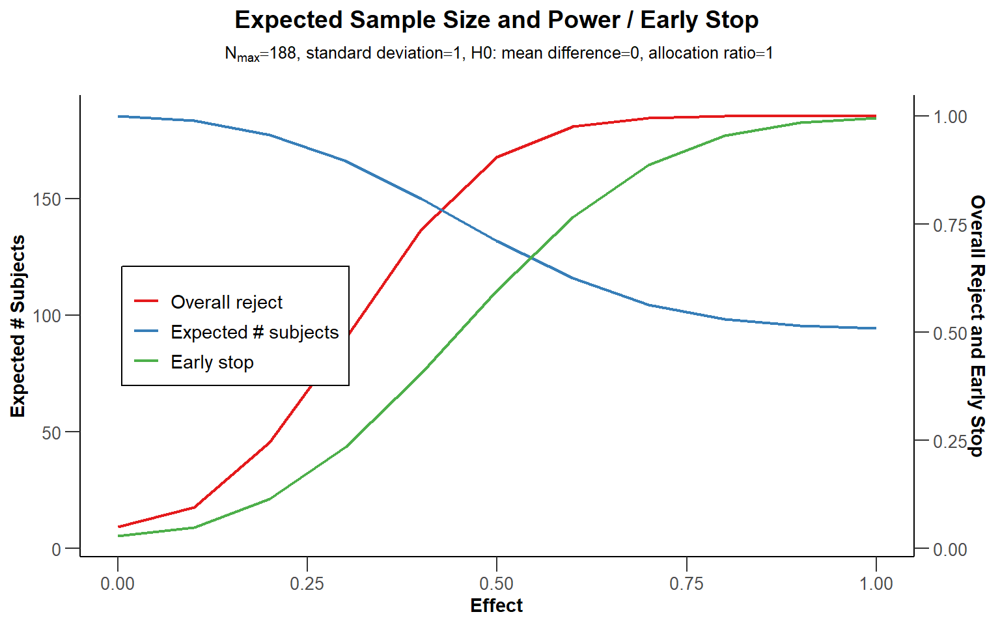
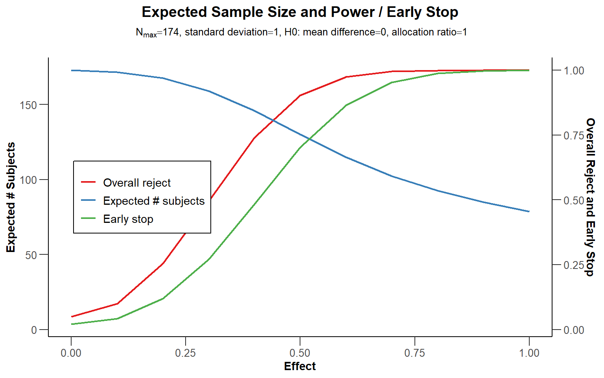

# Sequential Analysis {#sequential}

NOT COMPLETED

Imagine you design a study, determine the sample size you will collect based on an a-priori power analysis with a desired 80% power, have collected data, analyzed the results, and you find a *p*-value for your primary hypothesis of *p* = 0.09. You believe this might be a Type 2 error, and you are willing to collect more data to examine your hypothesis. In the past, researchers would often use a practice called **optional stopping** where they would continue the data collection, without adjusting the alpha level for multiple comparisons [@fiedler_questionable_2015; @john_measuring_2012]. However, this inflates the Type 1 error rate. Luckily, there is a solution to be able to stop the data collection when an effect is significant, and continue up to the maximum sample size you are willing to collect when it is not significant: **sequential analysis**. In sequential analysis a researcher designs a study such that they are able to perform **interim analyses**, say when 25%, 50%, and 75% of the data is collected. At each interim analysis a test is performed at a corrected alpha level, that over all planned analyses maintains the desired Type 1 error rate. For example, each of four analyses might be performed using an alpha level of 0.0091. The analysis at the first interim analysis yields a *p* = 0.21, data collection would continue. If at the second interim analysis a *p* = 0.007 is observed, data collection is terminated, and the null hypothesis is rejected. Even though the researcher repeatedly analyses the data, the corrected alpha level guarantees that the Type 1 error rate remains at 5%. 

Although the use of sequential analyses is not common, they have a long history. As early as 1929, Dodge and Romig realized that analyzing the data sequentially was more efficient than doing so once [@dodge_method_1929]. Wald, who popularized the idea of sequential tests of hypotheses in -@wald_sequential_1945, performed his work during the second world war. He was only allowed to publish his findings after the war had ended, because as he writes in a historical note: 

>Because of the substantial savings in the expected number of observations effected by the sequential probability ratio test, and because of the simplicity of this test procedure in practical applications, the National Defense Research Committee considered these developments sufficiently useful for the war effort to make it desirable to keep the results out of the reach of the enemy, at least for a certain period of time. The author was, therefore, requested to submit his findings in a restricted report which was dated September, 1943.

In other words, we have a method that so substantially increases the efficiency of hypothesis tests that it would not be shared with the enemy during war time - yet few researchers outside of medicine currently use it! In medicine, efficiency is not just a matter of money, but also of saving lives. If a drug shows it substantially increases the probability that people will survive a disease, it is deemed ethical to terminate a trial early, and administer the treatment to patients enrolled in the control group as well. Sequential analyses are established procedures, and have been developed in great detail over the last decades [@proschan_statistical_2006; @jennison_group_2000; @wassmer_group_2016]. Here, we will explain the basics of how to control error rates in sequential analyses, and perform a-priori power analysis and compare when sequential designs will be more or less efficient than fixed designs. 

## Choosing alpha levels for sequential analyses.

In sequential designs researchers will collect data with the plan to analyze the data at various times during the data collections. For example, a researcher plans to collect data from 200 participants and plans to analyse the data after 100 participants are collected, and once again after 200 participants are collected. Each analyses is called a **look**, so there are in total 2 looks at the data planned, with one interim analysis, and one final analysis. Not all looks have to occur in practice. If the analysis reveals a statistically significant result at look 1, data collection can be terminated. It is also possible to stop the data collection at look 1 because a predicted effect is absent, and continuing the data collection is not deemed worthwhile, which is called **stopping for futility**.

If one would analyze the data at multiple looks without correcting the alpha level, the Type 1 error rate would inflate [@armitage_repeated_1969]. As Armitage and colleagues show, with equally spaced looks, the alpha level inflates to 0.142 after 5 looks, 0.374 after 100 looks, and 0.530 after 1000 looks. Looking at the data twice is conceptually similar to deciding if a result is significant if one of two dependent variables shows a statistically significant effect. However, an important difference is that in the case of sequential analyses the multiple tests are not independent, but dependent. A test at look to combines the old data collected at look 1 with the new data at look 2. This means the Type 1 error rate inflates less quickly compared to independent tests, and we will see below this enables more efficient and flexible solutions to controlling error rates.

The solution to control Type 1 error inflation is again conceptually similar to a multiple comparison problem. By lowering the alpha level at each look, the Type 1 error rate can be controlled. They way the alpha level is reduced differs, however.  To control the Type 1 error rate, we would lower the alpha level for each test, for example using the Bonferroni procedure where each test would be performed at $\alpha/2$. In sequential analyses we similarly adjust the alpha level. It is even possible to just use a Bonferroni correction [@wassmer_group_2016]. But because the data is dependent (at look 2 we combine the data we collected at look 1 with the new data, so the data covary) the way to correct alpha levels can be done more efficiently. If you combine multiple looks at the data with multiple comparisons, you would first correct the alpha level for multiple looks, and then correct the alpha level at each look for the multiple comparison correction. Because the alpha level is corrected, it does not matter which statistical test you perform at each look, all that matters is that the *p*-value is compared to the corrected alpha level.

### Pocock correction

We will start with the Pocock correction, which is the simplest way to correct the alpha level for multiple looks. Conceptually, it is very similar to the Bonferroni correction. We can see at the [Wikipedia page for the Pocock correction](https://en.wikipedia.org/wiki/Pocock_boundary) that with 2 interim analyses the alpha level for each look is 0.0294, for three looks it is 0.0221, for 4 looks it is 0.0182, and for 5 looks it is 0.0158. We see the correction is slightly more efficient than using a Bonferroni correction (in which case the alpha levels would be 0.025, 0.0167, 0.0125, and 0.01). Applying the Pocock procedure requires 1) specifying the number of looks in advance, and 2) equally spaced looks, where each batch of observations has the same size (e.g., looking after 25, 50, 75 and 100 observations). 

Note that we can accurately calculate the alpha levels that should be used to 4 digits after the decimal points, but the [alpha level you will observe for all tests in your lifetime probably has too much variability](http://daniellakens.blogspot.com/2020/01/observed-alpha-levels-why-statistical.html) to worry too much about anything after 3 digits after the decimal point (and maybe even 2). We will compute alpha levels in this tutorial with higher precision than you need to care about in real life.

We will use multiple packages in R to compute corrected alpha levels for each look, such as [gsDesign](https://cran.r-project.org/web/packages/gsDesign/index.html), [rpact](https://cran.r-project.org/web/packages/rpact/index.html), and [ldbounds](https://cran.r-project.org/web/packages/ldbounds/index.html). RPact is also available as a [Shiny app](https://rpact.shinyapps.io/public/).


```r
# Use Rpact to specify a design with 2 looks and Pocock correction
library(rpact)
design <- getDesignGroupSequential(
  kMax = 2,
  typeOfDesign = "P",
  sided = 2,
  alpha = 0.05,
  beta = 0.1
)
summary(design)
```

```
## Sequential analysis with a maximum of 2 looks (group sequential design)
## 
## Pocock design, two-sided overall significance level 5%, power 90%, 
## undefined endpoint.
## 
## Stage                                  1      2 
## Information rate                     50%   100% 
## Efficacy boundary (z-value scale)  2.178  2.178 
## Cumulative alpha spent            0.0294 0.0500 
## Overall power                     0.5893 0.9000
```

"What happens to the alpha level if you have 3 looks in total?


```r
# Make sure you have rpact installed
library(rpact)
design <- getDesignGroupSequential(
  kMax = 3,
  typeOfDesign = "P",
  sided = 2,
  alpha = 0.05,
  beta = 0.1
)
summary(design)
```

```
## Sequential analysis with a maximum of 3 looks (group sequential design)
## 
## Pocock design, two-sided overall significance level 5%, power 90%, 
## undefined endpoint.
## 
## Stage                                  1      2      3 
## Information rate                   33.3%  66.7%   100% 
## Efficacy boundary (z-value scale)  2.289  2.289  2.289 
## Cumulative alpha spent            0.0221 0.0379 0.0500 
## Overall power                     0.3890 0.7311 0.9000
```

`rpact` makes it easy to plot the boundaries (based on the critical values) for each look. We see the critical values are higher than the 1.96 we would use for a fixed design with a 5% alpha level, namely: 2.2894781, 2.2894781, 2.2894781. 

<div class="figure" style="text-align: center">

<p class="caption">(\#fig:boundplot1)Plot of critical boundaries at each look for a 2 look design with a Pocock correction.</p>
</div>

We can also use the `gsDesign` package (not that the gsDesign package reports one-sided alpha levels, and thus returns a one-sided alpha level of 0.0147, instead of the two-sided alpha level 0.294. You will need to double the alpha level for a two-sided test (or just use rpact, which reports two-sided alpha levels when asked).


```r
seq_design <- gsDesign(
  k = 2, # k = number of looks = 2
  test.type = 2,
  alpha = .025, # gsDesign computes one-sided alpha levels, so we halve alpha
  sfu = "Pocock"
)

gsBoundSummary(seq_design)
```

```
##                Analysis               Value Efficacy Futility
##               IA 1: 50%                   Z   2.1783  -2.1783
##  N/Fixed design N: 0.55         p (1-sided)   0.0147   0.0147
##                             ~delta at bound   0.9061  -0.9061
##                         P(Cross) if delta=0   0.0147   0.0147
##                         P(Cross) if delta=1   0.5893   0.0000
##                   Final                   Z   2.1783  -2.1783
##   N/Fixed design N: 1.1         p (1-sided)   0.0147   0.0147
##                             ~delta at bound   0.6407  -0.6407
##                         P(Cross) if delta=0   0.0250   0.0250
##                         P(Cross) if delta=1   0.9000   0.0000
```

It is also possible to recreate these analyses in the GroupSeq package, which has a GUI based interface. Run 'groupseq(mode = "g")' in R, and the three screenshots below create the same output. 

<div class="figure" style="text-align: center">

<p class="caption">(\#fig:groupseq1)Screenshot of the GroupSeq GUI to choose a task.</p>
</div>

<div class="figure" style="text-align: center">

<p class="caption">(\#fig:groupseq2)Screenshot of the GroupSeq GUI to compute bounds.</p>
</div>

<div class="figure" style="text-align: center">

<p class="caption">(\#fig:groupseq3)Screenshot of the output of the GroupSeq GUI.</p>
</div>

The analysis can also be performed in the rpact [shiny app](https://rpact.shinyapps.io/public/) which also allows users to create all plots through simple menu options, and download a complete report of the analyses (e.g., for a preregistration document). The rpact shiny app is the easiest resource to use from all options discussed here.

<div class="figure" style="text-align: center">

<p class="caption">(\#fig:rpactshiny)Screenshot of rpact Shiny app.</p>
</div>

## Comparing Spending Functions

It can be useful to explicitly compare different types of designs. As explained before, the Pocock correction maintains a fixed alpha level at each look. The O'Brien-Fleming correction uses a higher threshold for early looks, but has the advantage that the final look occurs closer to the uncorrected alpha level. Because the alpha level is very similar at the last look, so is the total required sample size. Lowering the alpha level means the sample size needs to be increased to maintain the same desired level of statistical power, so different spending functions also require a different increase in the final sample size (to compensate for the lower alpha level, while maintaining the same statistical power). Sequential designs always need to be planned for a slightly larger total sample size at the final look, although as we will see below, because we can expect to stop at earlier looks, on average sample size will be smaller when using sequential designs compared to fixed designs. 


```r
#O'Brien & Fleming design, 3 equally spaced stages
d1 <- getDesignGroupSequential(typeOfDesign = "OF", kMax = 5) 
# Pocock design
d2 <- getDesignGroupSequential(typeOfDesign = "P", kMax = 5)

designSet <-getDesignSet(designs = c(d1, d2), 
                         variedParameters = "typeOfDesign")
plot(designSet, type = 1)
```

<div class="figure" style="text-align: center">

<p class="caption">(\#fig:spending-comparison)Comparison of the Pocock and O'Brien-Fleming boundaries.</p>
</div>

We see that at each of the 5 looks the critical value for our test is higher than 1.96 (the critical value without correcting for multiple looks, assuming a normal distribution, indicated by the black dashed line). The Pocock correction (P, blue line) has the same critical value at each look: 2.4131803, 2.4131803, 2.4131803, 2.4131803, 2.4131803, while the critical values decrease for each look with the O'Brien-Fleming correction (OF, red line): 4.5617423, 3.2256389, 2.6337232, 2.2808712, 2.0400732. The first three looks use an alpha level that is stricter than the Pocock spending function, but the last two use a much less strict threshold, and the last look occurs at a level quite close to an alpha level without any correction. As we will see below, this is quite efficient, without requiring a noticeable increase in the sample size due to a lower alpha level at the last look.

Another design, not discussed in the rest of this test, is the design proposed by Haybittle and Peto. Adjust the plot code (changing OF to HP) to see what it looks like.  


```r
# Make sure you have rpact installed
library(rpact)
d1 <- getDesignGroupSequential(typeOfDesign = "HP",
                               kMax = 5) 
# Pocock
d2 <- getDesignGroupSequential(typeOfDesign = "P",
                               kMax = 5)

designSet <-getDesignSet(designs = c(d1, d2), 
                         variedParameters = "typeOfDesign")
plot(designSet, type = 1)
```


## Sample Size for Sequential Designs

Sequential designs require somewhat more participants than a fixed design at the final look, depending on how much the alpha level at this look is lowered due to the correction for multiple comparisons. Due to early stopping, sequential designs will on average require less participants. 
 
Let's first examine how many participants we would need in a fixed design, where we only analyze our data once. We have an alpha level of 0.05, and a Type 2 (beta) error of 0.1 - in other words, the desired power is 90%. We will perform one test, and assuming a normal distribution our critical Z-score would be 1.96, for an alpha level of 5%. 


```r
# specify the design
seq_design <- getDesignGroupSequential(
  kMax = 1,
  typeOfDesign = "P",
  sided = 2,
  alpha = 0.05,
  beta = 0.1
)
# print a summary
summary(seq_design)
```

```
## Fixed sample analysis
## 
## Pocock design, two-sided significance level 5%, power 90%, undefined endpoint.
## 
## Stage                             Fixed 
## Efficacy boundary (z-value scale) 1.960
```

```r
# perform a power analysis using rpact
# By setting the alternative to 0.5 and the stDev to 1, we assume a Cohen's d of 0.5 for the alternative hypothesis.
power_res <- getSampleSizeMeans(
  design = seq_design,
  groups = 2,
  alternative = 0.5, 
  stDev = 1, 
  allocationRatioPlanned = 1,
  normalApproximation = FALSE)

power_res
```

```
## Design plan parameters and output for means:
## 
## Design parameters:
##   Critical values                              : 1.96 
##   Two-sided power                              : FALSE 
##   Significance level                           : 0.0500 
##   Type II error rate                           : 0.1000 
##   Test                                         : two-sided 
## 
## User defined parameters:
##   Alternatives                                 : 0.5 
## 
## Default parameters:
##   Mean ratio                                   : FALSE 
##   Theta H0                                     : 0 
##   Normal approximation                         : FALSE 
##   Standard deviation                           : 1 
##   Treatment groups                             : 2 
##   Planned allocation ratio                     : 1 
## 
## Sample size and output:
##   Number of subjects fixed                     : 170.1 
##   Number of subjects fixed (1)                 : 85 
##   Number of subjects fixed (2)                 : 85 
##   Lower critical values (treatment effect scale) : -0.303 
##   Upper critical values (treatment effect scale) : 0.303 
##   Local two-sided significance levels          : 0.0500 
## 
## Legend:
##   (i): values of treatment arm i
```

We see we need 85 participants in each group, (or 86, since we always round the number of observations up, as we can not collect 0.03 of a participant), and so we need 172 participants in total (see G\*Power, which rounds up values correctly). Because this is a fixed design, we can also compute this sample size using the `pwr` package in R or any other power analysis software.


```r
pwr.t.test(
  d = 0.5,
  sig.level = 0.05,
  power = 0.9,
  type="two.sample",
  alternative="two.sided"
)$n
```

```
## [1] 85.03128
```

We can now examine our design above with 2 looks, a Pocock correction, a 2 sided test with an alpha of 0.05. We will look 2 times, and expect a true effect of d = 0.5.


```r
# Our 2 look design
seq_design <- getDesignGroupSequential(
  kMax = 2,
  typeOfDesign = "P",
  sided = 2,
  alpha = 0.05,
  beta = 0.1
  )

# Compute the sample size we need
power_res <- getSampleSizeMeans(
  design = seq_design,
  groups = 2,
  alternative = 0.5, 
  stDev = 1, 
  allocationRatioPlanned = 1,
  normalApproximation = FALSE)

summary(power_res)
```

```
## Sample size calculation for a continuous endpoint
## 
## Sequential analysis with a maximum of 2 looks (group sequential design), overall 
## significance level 5% (two-sided).
## The sample size was calculated for a two-sample t-test, H0: mu(1) - mu(2) = 0, 
## H1: effect = 0.5, standard deviation = 1, power 90%.
## 
## Stage                                         1      2 
## Information rate                            50%   100% 
## Efficacy boundary (z-value scale)         2.178  2.178 
## Overall power                            0.5893 0.9000 
## Expected number of subjects               132.0 
## Number of subjects                         93.5  187.1 
## Cumulative alpha spent                   0.0294 0.0500 
## Two-sided local significance level       0.0294 0.0294 
## Lower efficacy boundary (t)              -0.458 -0.321 
## Upper efficacy boundary (t)               0.458  0.321 
## Exit probability for efficacy (under H0) 0.0294 
## Exit probability for efficacy (under H1) 0.5893 
## 
## Legend:
##   (t): treatment effect scale
```

It is important to know that `rpact` returns the *total* number of subjects at look 1 (94, so 94/2 = 47 in each group), and the total sample size at look 2 (188, so 188/2 = 94 in each group). This means that at the second look, we are now collecting 188 instead of 172 participants. This is a consequence of lowering our alpha level at each look (from 0.05 to 0.0294). To compensate for the loss of power, we need to increase our sample size. HOwever, this is compensated by the fact that sometimes we will stop after look 1, and thus on average we will collect less participants (even though we might sometimes collect more participants than we would have, had we not used a sequential design). `rpact` also computes the expected number of participants, in the long run, if the true effect size is d = 0.5.


```r
power_res$expectedNumberOfSubjectsH1
```

```
## [1] 131.9571
```

So, in the long run, if the true effect size is d = 0.5, we will collect 132 observations (66 per condition), instead of 172 in total (or 86 per condition). 

If we had expected an effect size of d = 0.4, what would the total sample size we needed to collect for 90% power be?


```r
# Make sure you have rpact installed
library(rpact)
seq_design <- getDesignGroupSequential(
  kMax = 2,
  typeOfDesign = "P",
  sided = 2,
  alpha = 0.05,
  beta = 0.1
  )

# Compute the sample size we need
power_res <- getSampleSizeMeans(
  design = seq_design,
  groups = 2,
  alternative = 0.4, 
  stDev = 1, 
  allocationRatioPlanned = 1,
  normalApproximation = FALSE)

power_res$expectedNumberOfSubjectsH1
```

```
## [1] 205.328
```


Because power is a curve, and the true effect size is always unknown, it is useful to plot power across a range of possible effect sizes, so that we can explore the expected sample size, in the long run, if we use a sequential design, for different true effect sizes.


```r
# Use getPowerMeans and set max N to 188 based on analysis above
sample_res <- getPowerMeans(
  design = seq_design,
  groups = 2,
  alternative = seq(0,1,0.1), 
  stDev = 1, 
  allocationRatioPlanned = 1,
  maxNumberOfSubjects = 188, #rounded up from 187.0829
  normalApproximation = TRUE)

plot(sample_res, type = 6)
```


The blue line indicates the expected number of observations we need to collect. Not surprisingly, when the true effect size is 0, we will almost always continue data collection to the end. We will only stop if we observe a Type 1 error, which is rare, and thus the expected number of observations is very close to 120. On the other side of the graph we see the scenario for when the true effect size is d = 1. With such a large effect size, we will have high power at our first look, and we will almost always be able to stop at the first look. If the true effect size is 0.5, we see we can expect to collect 132 participants on average.

The Pocock correction leads to a substantially lower alpha level at the last look, which requires an increase in sample size to compensate. As we saw before, the O'Brien-Fleming spending function does not require such a severe reduction in the alpha level at the last look. Let's see how well this performs. With 2 looks, this design would not need an increase in sample size at all, yet lower the expected number of observations we would collect to 145. However, let's add 2 additional looks at the data, for 4 looks in total.    


```r
# Now a 4 look OF design
seq_design <- getDesignGroupSequential(
  kMax = 4,
  typeOfDesign = "OF",
  sided = 2,
  alpha = 0.05,
  beta = 0.1
  )
summary(seq_design)
```

```
## Sequential analysis with a maximum of 4 looks (group sequential design)
## 
## O'Brien & Fleming design, two-sided overall significance level 5%, power 90%, 
## undefined endpoint.
## 
## Stage                                   1       2       3       4 
## Information rate                      25%     50%     75%    100% 
## Efficacy boundary (z-value scale)   4.049   2.863   2.337   2.024 
## Cumulative alpha spent            <0.0001  0.0042  0.0209  0.0500 
## Overall power                      0.0080  0.2930  0.6960  0.9000
```

```r
power_res <- getSampleSizeMeans(
  design = seq_design,
  groups = 2,
  alternative = 0.5, 
  stDev = 1, 
  allocationRatioPlanned = 1,
  normalApproximation = FALSE)

summary(power_res)
```

```
## Sample size calculation for a continuous endpoint
## 
## Sequential analysis with a maximum of 4 looks (group sequential design), overall 
## significance level 5% (two-sided).
## The sample size was calculated for a two-sample t-test, H0: mu(1) - mu(2) = 0, 
## H1: effect = 0.5, standard deviation = 1, power 90%.
## 
## Stage                                          1       2       3       4 
## Information rate                             25%     50%     75%    100% 
## Efficacy boundary (z-value scale)          4.049   2.863   2.337   2.024 
## Overall power                             0.0080  0.2930  0.6960  0.9000 
## Expected number of subjects                130.5 
## Number of subjects                          43.5    86.9   130.4   173.8 
## Cumulative alpha spent                   <0.0001  0.0042  0.0209  0.0500 
## Two-sided local significance level       <0.0001  0.0042  0.0194  0.0429 
## Lower efficacy boundary (t)               -1.370  -0.631  -0.415  -0.309 
## Upper efficacy boundary (t)                1.370   0.631   0.415   0.309 
## Exit probability for efficacy (under H0) <0.0001  0.0042  0.0167 
## Exit probability for efficacy (under H1)  0.0080  0.2850  0.4031 
## 
## Legend:
##   (t): treatment effect scale
```

```r
sample_res <- getPowerMeans(
  design = seq_design,
  groups = 2,
  alternative = seq(0,1,0.1), 
  stDev = 1, 
  allocationRatioPlanned = 1,
  maxNumberOfSubjects = 174, 
  normalApproximation = TRUE)
```

We see that with 4 looks, we will not need to increase the maximum sample size a lot, as we only need 174 instead of 172 participants.


```r
power_res$maxNumberOfSubjects
```

```
## [1] 173.8317
```

There is a noticeable reduction in the average number of samples we can expect to collect, if the true effect size is d = 0.5.


```r
power_res$expectedNumberOfSubjectsH1
```

```
## [1] 130.5056
```

If we plot this expected sample size across different true effect sizes, we see that we become more efficient - only at the cost of 1) analyzing our data 4 times, and 2) needing to preregister our analysis plan. Preregistration is required, because sequential analyses give a lot of additional freedom that can possibly inflate error rates substantially. So performing computations as performed here, and preregistering your analysis plan, is required - but worth it. 


```r
plot(sample_res, type = 6)
```



We can redo the power analysis in for the original 2 look design in gsDesign. The graph shows that if the true effect size is d = 0.5 we have approximately 59% power after the first look, and 90% power after the second look, given our adjusted alpha level. 


```r
seqdesign <- gsDesign(
  k = 2, # k = number of looks = 2
  test.type = 2,
  alpha = .025,
  beta = 0.1,
  sfu = "Pocock",
  # gsDesign calculates d as a within subjects d. 
  # We need the /sqrt(2) to turn it from d_z into d
  delta = 0.5/sqrt(2), 
  delta0 = 0,
  delta1 = 0.5
) # spending function = Pocock

# All required info is in:
seqdesign
```

```
## Symmetric two-sided group sequential design with
## 90 % power and 2.5 % Type I Error.
## Spending computations assume trial stops
## if a bound is crossed.
## 
##              
##   Analysis N   Z   Nominal p  Spend
##          1 47 2.18    0.0147 0.0147
##          2 93 2.18    0.0147 0.0103
##      Total                   0.0250 
## 
## ++ alpha spending:
##  Pocock boundary.
## 
## Boundary crossing probabilities and expected sample size
## assume any cross stops the trial
## 
## Upper boundary (power or Type I Error)
##           Analysis
##    Theta      1      2 Total E{N}
##   0.0000 0.0147 0.0103 0.025 91.1
##   0.3536 0.5893 0.3107 0.900 65.2
## 
## Lower boundary (futility or Type II Error)
##           Analysis
##    Theta      1      2 Total
##   0.0000 0.0147 0.0103 0.025
##   0.3536 0.0000 0.0000 0.000
```

```r
# We can look at the sample sizes as expected compared to a fixed design
plot(seqdesign, plottype = 2)
```



### Alpha spending functions

The Pocock and O'Brien-Fleming spending functions we discussed so far have an important limitation [@proschan_statistical_2006]. They require a pre-specified number of looks (e.g., 4) that is equally spaced (e.g., after 25%, 50%, 75%, and 100%). It is not always possible to stop data collection exactly after for example the 50th participant, because you need to pause data collection to analyze the data, which might not be possible if additional sessions are scheduled on the day the 50th observation is collected. An important contribution to the sequential testing literature was made by Lan and DeMets -@lan_discrete_1983 who created **alpha spending functions**, where the boundary at the decision time does not depend on the future decision times or the total number of decision times.

We see the O'Brien-Fleming-like alpha spending function is quite similar to the discrete O'Brien-Fleming bounds. 

<div class="figure" style="text-align: center">

<p class="caption">(\#fig:spending-comparison-2)Comparison of the O'Brien-Fleming boundaries and the O'Brien-FLiming-like alpha spending function.</p>
</div>

There is a wide range of alpha spending functions possible. In addition to a Pocock-type and O'Brien-Fleming-type alpha spending function `rpact` has the Kim & DeMets alpha spending function and the Hwang, Shi & DeCani alpha spending function, but users can also specify a custom spending function. Again, the main benefit of these spending functions is that neither the number nor the timing of the looks needs to be specified in advance, which makes alpha spending approaches much more flexible. However, it is important that the decision to perform an interim analysis is not based on collected data, as this can still increase the Type 1 error rate.

<!-- ```{r spending-comparison-3, fig.margin=FALSE, echo=FALSE, fig.cap="Comparison of different alpha spending functions."} -->
<!-- #Pocock type -->
<!-- d1 <- getDesignGroupSequential(typeOfDesign = "asP", -->
<!--                                kMax = 5)  -->
<!-- # OF-like continuous spending function -->
<!-- d2 <- getDesignGroupSequential(typeOfDesign = "asOF", -->
<!--                                kMax = 5) -->

<!-- d3 <- getDesignGroupSequential(typeOfDesign = "asKD", -->
<!--                                kMax = 5) -->

<!-- d4 <- getDesignGroupSequential(typeOfDesign = "asHSD", -->
<!--                                kMax = 5) -->

<!-- designSet <-getDesignSet(designs = c(d1, d2, d3, d4),  -->
<!--                          variedParameters = "typeOfDesign") -->
<!-- plot(designSet, -->
<!--      type = 1) -->

<!-- ``` -->

### Updating Boundaries During an Experiment

Although alpha spending functions control the Type 1 error rate even when there are deviations from the pre-planned looks, this does require recalculating the boundaries based on the amount of information that has been observed. In this example, we follow an [rpact vignette](https://vignettes.rpact.org/html/rpact_boundary_update_example.html). Imagine a two-sided design with an O'Brien-Fleming-type alpha-spending function, and alpha of 0.025, a desired power of 90%, with 3 looks, planned when 50%, 75%, and 100% of our maximum sample has been collected.     


```r
# Original design:
seq_design <- getDesignGroupSequential(
  sided = 2,
  kMax = 3,
  alpha = 0.05,
  beta = 0.1,
  informationRates = c(0.5, 0.75, 1),
  typeOfDesign = "asOF"
)

# Initial sample size calculation
sampleSizeResult <- getSampleSizeMeans(
  design = seq_design,
  groups = 2,
  alternative = 0.5,
  stDev = 1,
  allocationRatioPlanned = 1,
  normalApproximation = FALSE
)

# Summarize design
summary(sampleSizeResult)
```

```
## Sample size calculation for a continuous endpoint
## 
## Sequential analysis with a maximum of 3 looks (group sequential design), overall 
## significance level 5% (two-sided).
## The sample size was calculated for a two-sample t-test, H0: mu(1) - mu(2) = 0, 
## H1: effect = 0.5, standard deviation = 1, power 90%.
## 
## Stage                                         1      2      3 
## Information rate                            50%    75%   100% 
## Efficacy boundary (z-value scale)         2.963  2.359  2.014 
## Overall power                            0.2580 0.6853 0.9000 
## Expected number of subjects               132.3 
## Number of subjects                         86.6  129.9  173.2 
## Cumulative alpha spent                   0.0031 0.0193 0.0500 
## Two-sided local significance level       0.0031 0.0183 0.0440 
## Lower efficacy boundary (t)              -0.656 -0.419 -0.308 
## Upper efficacy boundary (t)               0.656  0.419  0.308 
## Exit probability for efficacy (under H0) 0.0031 0.0162 
## Exit probability for efficacy (under H1) 0.2580 0.4273 
## 
## Legend:
##   (t): treatment effect scale
```

The a-priori power analysis shows that, assuming an effect size of 0.5, we plan to look after 87, 130, 174 observations. Now imagine that due to logistical issues, we do not have to ability to analyze the data until we have collected data from 95, instead of 87, participants. So our first look at the data does not occur at 50% of our sample, but at 95/174 = 54.6%. We can recalculate the alpha levels we should use for this and future looks, and update our sample size calculation. This reveals we should use an alpha level of 0.0048 for the current look (instead of 0.0031). and the next look should occur after 131 participants in total, not 130. We see the differences are not very substantial, but if the deviation from the planned looks increases, the changes might become more impactful. Note that even if the number of looks was not pre-planned, we would use similar calculations at each look, but instead increase the number of looks (e.g., perform an analysis with 1 interim look at time = 95/174, and if the second look occurs after 146 participants, we would run an analysis with two interim looks, one at 95/174 and a second at 146/174, see Proschan et al., 2006, chapter 5). 


```r
seq_design_2 <- getDesignGroupSequential(
  sided = 2,
  kMax = 3,
  alpha = 0.05,
  beta = 0.1,
  informationRates = c(95/174, 0.75, 1),
  typeOfDesign = "asOF"
)

summary(seq_design_2)
```

```
## Sequential analysis with a maximum of 3 looks (group sequential design)
## 
## O'Brien & Fleming type alpha spending design, two-sided overall 
## significance level 5%, power 90%, undefined endpoint.
## 
## Stage                                  1      2      3 
## Information rate                   54.6%    75%   100% 
## Efficacy boundary (z-value scale)  2.818  2.370  2.015 
## Cumulative alpha spent            0.0048 0.0193 0.0500 
## Overall power                     0.3445 0.6838 0.9000
```

```r
# Update power analysis

power_update_1 <- getPowerMeans(
  design = seq_design_2,
  groups = 2,
  alternative = 0.5, 
  stDev = 1, 
  allocationRatioPlanned = 1,
  maxNumberOfSubjects = 174, 
  normalApproximation = TRUE)
summary(power_update_1)
```

```
## Power calculation for a continuous endpoint
## 
## Sequential analysis with a maximum of 3 looks (group sequential design), overall 
## significance level 5% (two-sided).
## The results were calculated for a two-sample t-test (normal approximation), 
## H0: mu(1) - mu(2) = 0, H1: effect = 0.5, standard deviation = 1, 
## maximum number of subjects = 174.
## 
## Stage                                         1      2      3 
## Information rate                          54.6%    75%   100% 
## Efficacy boundary (z-value scale)         2.818  2.370  2.015 
## Overall power                            0.3516 0.6917 0.9045 
## Expected number of subjects               131.4 
## Number of subjects                         95.0  130.5  174.0 
## Cumulative alpha spent                   0.0048 0.0193 0.0500 
## Two-sided local significance level       0.0048 0.0178 0.0439 
## Lower efficacy boundary (t)              -0.578 -0.415 -0.306 
## Upper efficacy boundary (t)               0.578  0.415  0.306 
## Exit probability for efficacy (under H0) 0.0048 0.0145 
## Exit probability for efficacy (under H1) 0.3516 0.3401 
## 
## Legend:
##   (t): treatment effect scale
```


What if we had look even later, after 105 participants? Which alpha level should we have used for the first interim test?"


```r
# Make sure you have rpact installed
library(rpact)
seq_design_2 <- getDesignGroupSequential(
  sided = 2,
  kMax = 3,
  alpha = 0.05,
  beta = 0.1,
  informationRates = c(105/174, 0.75, 1),
  typeOfDesign = "asOF"
)

# Update power analysis

power_update_1 <- getPowerMeans(
  design = seq_design_2,
  groups = 2,
  alternative = 0.5, 
  stDev = 1, 
  allocationRatioPlanned = 1,
  maxNumberOfSubjects = 174, 
  normalApproximation = TRUE)

summary(power_update_1)
```

```
## Power calculation for a continuous endpoint
## 
## Sequential analysis with a maximum of 3 looks (group sequential design), overall 
## significance level 5% (two-sided).
## The results were calculated for a two-sample t-test (normal approximation), 
## H0: mu(1) - mu(2) = 0, H1: effect = 0.5, standard deviation = 1, 
## maximum number of subjects = 174.
## 
## Stage                                         1      2      3 
## Information rate                          60.3%    75%   100% 
## Efficacy boundary (z-value scale)         2.660  2.388  2.016 
## Overall power                            0.4610 0.6894 0.9043 
## Expected number of subjects               132.3 
## Number of subjects                        105.0  130.5  174.0 
## Cumulative alpha spent                   0.0078 0.0193 0.0500 
## Two-sided local significance level       0.0078 0.0170 0.0438 
## Lower efficacy boundary (t)              -0.519 -0.418 -0.306 
## Upper efficacy boundary (t)               0.519  0.418  0.306 
## Exit probability for efficacy (under H0) 0.0078 0.0115 
## Exit probability for efficacy (under H1) 0.4610 0.2284 
## 
## Legend:
##   (t): treatment effect scale
```

```r
# So the answer is 0.0078
```


## Test for (non-)inferiority

In an equivalence test, it is common to compare the observed effect against an upper and lower bound of the equivalence range. `rpact` supports **non-inferiority and inferiority tests**, where the null hypothesis is one of the equivalence bound (e.g., d = 0.5) and the alternative hypothesis is an effect of 0. In essence, this is a directional equivalence test where we consider an effect too small to be meaningful (inferior) if it is smaller than the upper bound of the equivalence range, for example d = 0.5 - also when the effect is on the opposite direction (e.g., d =  0.7). Alternatively, we can be interested in showing an effect is not smaller than the lower equivalence bound, for example d = -0.5, which allows us to conclude the effect is not more negative (non-inferior) than the smallest effect we care about. We can first examine a normal power analysis for a non-inferiority test for a fixed design for 90% power.


```r
# First for no sequential design
# Corresponds to PASS software
sampleSizeNoninf <- getSampleSizeMeans(
  thetaH0 = -0.5,
  alternative = 0.0,
  stDev = 1,
  alpha = 0.05,
  beta = 0.1,
  sided = 1,
  normalApproximation = FALSE
)
sampleSizeNoninf
```

```
## Design plan parameters and output for means:
## 
## Design parameters:
##   Critical values                              : 1.645 
##   Significance level                           : 0.0500 
##   Type II error rate                           : 0.1000 
##   Test                                         : one-sided 
## 
## User defined parameters:
##   Theta H0                                     : -0.5 
##   Alternatives                                 : 0 
## 
## Default parameters:
##   Mean ratio                                   : FALSE 
##   Normal approximation                         : FALSE 
##   Standard deviation                           : 1 
##   Treatment groups                             : 2 
##   Planned allocation ratio                     : 1 
## 
## Sample size and output:
##   Number of subjects fixed                     : 138.4 
##   Number of subjects fixed (1)                 : 69.2 
##   Number of subjects fixed (2)                 : 69.2 
##   Critical values (treatment effect scale)     : -0.218 
## 
## Legend:
##   (i): values of treatment arm i
```

Now, we can repeat the analysis, but first specify our original sequential design, with the small deviation that we need to specify a one-sided test. In practice, this will yield identical results as a power analysis for an equivalence test with symmetrical equivalence bounds and an expected true effect size of zero. However, the use of one-sided test often also directly reflects our hypothesis interest, so it might often be the test that reflects your research question.


```r
seq_design <- getDesignGroupSequential(
  kMax = 2,
  typeOfDesign = "P",
  sided = 1,
  alpha = 0.05,
  beta = 0.1
)

sampleSizeNoninf <- getSampleSizeMeans(
  design = seq_design,
  thetaH0 = -0.5,
  alternative = 0.0,
  stDev = 1,
  normalApproximation = FALSE
)
sampleSizeNoninf
```

```
## Design plan parameters and output for means:
## 
## Design parameters:
##   Information rates                            : 0.500, 1.000 
##   Critical values                              : 1.875, 1.875 
##   Futility bounds (non-binding)                : -Inf 
##   Cumulative alpha spending                    : 0.03037, 0.05000 
##   Local one-sided significance levels          : 0.03037, 0.03037 
##   Significance level                           : 0.0500 
##   Type II error rate                           : 0.1000 
##   Test                                         : one-sided 
## 
## User defined parameters:
##   Theta H0                                     : -0.5 
##   Alternatives                                 : 0 
## 
## Default parameters:
##   Mean ratio                                   : FALSE 
##   Normal approximation                         : FALSE 
##   Standard deviation                           : 1 
##   Treatment groups                             : 2 
##   Planned allocation ratio                     : 1 
## 
## Sample size and output:
##   Reject per stage [1]                         : 0.6195 
##   Reject per stage [2]                         : 0.2805 
##   Early stop                                   : 0.6195 
##   Maximum number of subjects                   : 153.6 
##   Maximum number of subjects (1)               : 76.8 
##   Maximum number of subjects (2)               : 76.8 
##   Number of subjects [1]                       : 76.8 
##   Number of subjects [2]                       : 153.6 
##   Expected number of subjects under H0         : 151.2 
##   Expected number of subjects under H0/H1      : 137 
##   Expected number of subjects under H1         : 106 
##   Critical values (treatment effect scale) [1] : -0.0654 
##   Critical values (treatment effect scale) [2] : -0.1950 
## 
## Legend:
##   (i): values of treatment arm i
##   [k]: values at stage k
```

We see that compared to a fixed design, our maximum sample size has increased from 139 to 154. However, if there really is no effect (d = 0, the alternative hypothesis of our non-inferiority test is true) then we should expect to collect on average 106 observations, in the long run. Of course, as we have seen above, more efficient designs can be designed.

If we had tested against a lower bound of d = -0.3, which sample size would we need?


```r
# Make sure you have rpact installed
library(rpact)
seq_design <- getDesignGroupSequential(
  kMax = 2,
  typeOfDesign = "P",
  sided = 1,
  alpha = 0.05,
  beta = 0.1
)

sampleSizeNoninf <- getSampleSizeMeans(
  design = seq_design,
  thetaH0 = -0.3,
  alternative = 0.0,
  stDev = 1,
  normalApproximation = FALSE
)
sampleSizeNoninf
```

```
## Design plan parameters and output for means:
## 
## Design parameters:
##   Information rates                            : 0.500, 1.000 
##   Critical values                              : 1.875, 1.875 
##   Futility bounds (non-binding)                : -Inf 
##   Cumulative alpha spending                    : 0.03037, 0.05000 
##   Local one-sided significance levels          : 0.03037, 0.03037 
##   Significance level                           : 0.0500 
##   Type II error rate                           : 0.1000 
##   Test                                         : one-sided 
## 
## User defined parameters:
##   Theta H0                                     : -0.3 
##   Alternatives                                 : 0 
## 
## Default parameters:
##   Mean ratio                                   : FALSE 
##   Normal approximation                         : FALSE 
##   Standard deviation                           : 1 
##   Treatment groups                             : 2 
##   Planned allocation ratio                     : 1 
## 
## Sample size and output:
##   Reject per stage [1]                         : 0.6195 
##   Reject per stage [2]                         : 0.2805 
##   Early stop                                   : 0.6195 
##   Maximum number of subjects                   : 423.8 
##   Maximum number of subjects (1)               : 211.9 
##   Maximum number of subjects (2)               : 211.9 
##   Number of subjects [1]                       : 211.9 
##   Number of subjects [2]                       : 423.8 
##   Expected number of subjects under H0         : 417.4 
##   Expected number of subjects under H0/H1      : 378 
##   Expected number of subjects under H1         : 292.5 
##   Critical values (treatment effect scale) [1] : -0.0409 
##   Critical values (treatment effect scale) [2] : -0.1173 
## 
## Legend:
##   (i): values of treatment arm i
##   [k]: values at stage k
```

```r
# So the answer is 424 in total, 212 in each group
```

## Stopping for futility

To declare that a meaningful effect is absent, one should specify a smallest effect size of interest, and perform an equivalence test. However, sometimes you might not be able to justify a choice for a smallest effect size of interest. In such study designs, it is still possible to decide to stop a study at an interim look because continuing data collection is impossible of unlikely to yield a significant effect. 

In the most extreme case, it will be impossible for the additional data you collect to lead to a statistically significant result. To illustrate this in a hypothetical scenario, imagine that after collecting 90 out of 100 observations, the observed effect size is very close to zero. The critical effect size in an independent *t*-test with 50 participants in each group and an alpha level of, say, 0.02, is d = 0.47. If your primary dependent variable is measured on a 7 point Likert scale, it might be that even if every of the remaining 5 participants in group 1 answer 1, and every of the remaining participants in group 2 answers 7, the effect size in the total group of 100 participants can never reach the critical effect size. If the goal of your study was to detect  significant effect, at this point you know for a fact that goal will not be reached. Stopping a study at an interim analysis because the final result will not yield a significant effect is called **curtailment**.

In less extreme cases, it might still be possible for the study to observe a significant effect, but the probability is extremely low. The probability of finding a significant result, given the data that have been observed up to an interim analysis, is called **conditional power**. Let's imagine that in our previous example, after 50 observations, we also observed an effect zero close to zero, and we would have 25% power to find a significant result, for some expected effect size. Wassmer and Brannath -@wassmer_group_2016 write, due to the direct relation between conditional power and p-values, stopping the trial if the conditional power is lower than some desired threshold is equivalent to stopping a study if the *p*-value is larger than some critical level. `rpact` allows us to compute conditional power. Let's assume that in our 2-stage design, after the first interim analysis, we observe an effect of d = 0.1, while we expected d = 0.5. What is the probability that, if the true effect size is d = 0.5, we find a significant result after adding the second batch of 94 participants? 


```r
# Our 2 look design
seq_design <- getDesignGroupSequential(
  kMax = 2,
  typeOfDesign = "P",
  sided = 2,
  alpha = 0.05,
  beta = 0.1
)

dataMeans <- getDataset(
  n1 = c(94), 
  n2 = c(94), 
  means1 = c(1.1), #for directional test, means 1 > means 2
  means2 = c(1),
  stDevs1 =c(1), 
  stDevs2 =c(1))

# Get analysis results
# Effect sizes are raw effect sizes, not standardized.
stage_res <- getStageResults(seq_design, 
                   equalVariances = TRUE,
                   dataInput = dataMeans)

# Compute conditional power after the first look
getConditionalPower(design = seq_design,
                    stageResults = stage_res, 
                    nPlanned = c(94),
                    thetaH1 = 0.5,
                    assumedStDev = 1)
```

```
## Conditional power results means:
## 
## User defined parameters:
##   Planned sample size                          : NA, 94 
##   Assumed effect under alternative             : 0.5 
##   Assumed standard deviation                   : 1 
## 
## Default parameters:
##   Planned allocation ratio                     : 1 
## 
## Output:
##   Conditional power                            : NA, 0.511
```

We see the answer if that we have 51% power. At this point, one might decide to stop for **futility**. You might decide it is not worth continuing the data collection. One the one hand, 51% power is not nothing, but on the other hand, your expectation that the true effect size is d = 0.5 has become somewhat less likely. One might choose to perform a **conditional power analysis**, and increase the sample size you were willing to collect. Given that we have already collected data, it seems intuitive to calculate condition power not based on the effect size we originally expected, but by updating our prior belief about the true effect size given the observed data. This Bayesian alternative is called **predictive power** [@spiegelhalter_monitoring_1986]. You will probably want to consult a statistician before making these choices.


Repeat the conditional power analysis above, assuming you now think the true effect size is d = 0.3, instead of d = 0.5.")


```r
# Make sure you have rpact installed
library(rpact)
# Our 2 look design
seq_design <- getDesignGroupSequential(
  kMax = 2,
  typeOfDesign = "P",
  sided = 2,
  alpha = 0.05,
  beta = 0.1
)

dataMeans <- getDataset(
  n1 = c(94), 
  n2 = c(94), 
  means1 = c(1.1), #for directional test, means 1 > means 2
  means2 = c(1),
  stDevs1 =c(1), 
  stDevs2 =c(1))

# Get analysis results
# Effect sizes are raw effect sizes, not standardized.
stage_res <- getStageResults(seq_design, 
                   equalVariances = TRUE,
                   dataInput = dataMeans)

# Compute conditional power after the first look
getConditionalPower(design = seq_design,
                    stageResults = stage_res, 
                    nPlanned = c(94),
                    thetaH1 = 0.3,
                    assumedStDev = 1)
```

```
## Conditional power results means:
## 
## User defined parameters:
##   Planned sample size                          : NA, 94 
##   Assumed effect under alternative             : 0.3 
##   Assumed standard deviation                   : 1 
## 
## Default parameters:
##   Planned allocation ratio                     : 1 
## 
## Output:
##   Conditional power                            : NA, 0.1731
```

```r
# So the answer is conditional power is 17.31%
```

Stopping for futility has benefits and downsides [@schoenfeld_procon_2005]. The biggest problem with stopping for futility is that it makes it impossible to interpret negative results. We do not learn whether the effect is too small to be meaningful, as we would learn in an equivalence test. Clearly, designing a study is most informative if we specify a smallest effect of interest, and perform a formal equivalence test. However, when specifying a smallest effect size of interest is not possible, stopping for futility might be an alternative to carefully consider. Stopping for futility does not impact the Type 1 error rate of a study because we are not declaring an effect if no effect is present. 

As an illustration of a simple stopping rule for futility. let's imagine a researcher is willing to stop for futility because the observed effect size is zero or in the wrong direction. This is only possible in a directional (one-sided) test. In other words, if we predict an effect larger than zero (e.g., d = 0.5), and we observe an effect ≤ 0, we will stop the data collection . Note that it is perfectly possible, due to random variation, that we observe an effect size smaller than 0, especially in small noisy samples where the true effect size is large. But this simple stopping rule will illustrate the basic idea of stopping for futility. In Figure \@ref(fig:futility1) the red line indicates critical values to declare a significant effect. For example if we observe a *Z*-value larger than 2.134 at the second interim analysis, we can stop the study and reject the null hypothesis. However, if at the second interim analysis we observe a *Z*-score smaller than or equal to 0, the observed effect size is either 0 or smaller, and we can stop the trial for futility.

<div class="figure" style="text-align: center">

<p class="caption">(\#fig:futility1)O'Brien-Fleming-type boundaries for 3 looks to declare a significant effect (red line) or to stop for futility (blue line).</p>
</div>

Instead of setting the *z*-scores for futility manually, we can also compute bounds based on a beta-spending function. At the last look in our sequential design, which we designed to have 90% power, we are willing to accept the null-hypothesis with a 10% error rate. Just as we are willing to distribute our Type 1 error rate across interim analyses, we might be willing to stop for futility at earlier looks, even if we are then making a Type 2 error. If there actually is no effect, such designs are more efficient. One can choose binding and non-binding beta-spending functions (meaning one has to stop, or one can continue on) - the latter is typically recommended. Adding futility bounds based on beta-spending functions reduce power, and increase the required sample size to reach a desired power, but this is on average compensated by the fact you studies stop earlier due to futility, and can thus make designs more efficient. In the plot below, we use an O'Brien-Fleming type design for both the alpha-spending function and the beta-spending function.


```r
# Formal beta spending function
design <- getDesignGroupSequential(
  sided = 1,
  alpha = 0.05,
  beta = 0.1,
  informationRates = c(0.33, 0.67, 1),
  typeOfDesign = "asOF",
  typeBetaSpending="bsOF",
  bindingFutility = FALSE
)

plot(design)
```


### Sequential analyses using Bayes factors.

There is a discussion in the literature about when optional stopping is a problem for Bayesians. The answer, as always, depends on what type of Bayesian you are. Subjective Bayesians are not interested in error rates. They continuously update personal beliefs based on the data, and they never make a dichotomous claim or decision purely based on the data. Empirical Bayesians often stress that Bayes factors are continuous measures of evidence, but also introduce dichotomous thresholds. For example, [submission guidelines](https://media.nature.com/original/nature-cms/uploads/ckeditor/attachments/4825/RegisteredReportsGuidelines_NatureHumanBehaviour.pdf) for Nature Human Behavior state "For inference by Bayes factors, authors must be able to guarantee data collection until the Bayes factor is at least 10 times in favour of the experimental hypothesis over the null hypothesis (or vice versa)." If you aim to claim your statistical hypothesis is supported or not based on the on whether the Bayes factors is high or low, you can make erroneous claims, and optional stopping can inflate error rates. 

Controlling long run error rates is always a frequentist procedure (even if the statistic that is computed to make dichotomous claims is a Bayes factor). Unlike in the case of frequentist sequential analyses, there are no analytical solutions to control error rates when Bayes factors are computed at each interim analysis, but simulation approaches have been developed for sequential hypothesis testing with Bayes factors [@schonbrodt_sequential_2017]. In these approaches, one still needs to make an assumption about the true effect size, as the true effect size impacts the error rates, but one also needs to specify the number of looks in advance (or compute error rates for a worst case scenario where you analyse data after every look), and (as always when using Bayes factors) make a decision about the prior. A downside of Bayesian sequential analyses is that if you commit to continuing data collection until you read a Bayes factor threshold of for example 10, you might need to collect hundreds, or even thousands, of observations, depending on the true effect size. This can make studies difficult to plan. One can specify a maximum sample size, but then studies will remain inconclusive. An online app to examine the sample sizes required in sequential hypothesis tests using Bayes factors is available [online](http://shinyapps.org/apps/BFDA/), and accompanies a tutorial paper [@stefan_tutorial_2019].

### Reporting results after a sequential analysis.

When reporting results for a sequential analyses, there are two things to keep in mind. First, whenever we stop a study early because of a significant effect, there is a risk that we stopped on a random high estimate. This means the effect sizes is larger than the true effect size. Approaches have been developed to correct effect size estimates for single studies. These correction aim to retrieve an accurate effect size estimate from  a study that was designed with the goal to examine whether the null hypothesis could be rejected. As @schonbrodt_sequential_2017 show, a meta-analysis of studies that used sequential designs will yield an accurate effect size, because studies that stop early, and have smaller sample sizes, are weighed less and are compensated by the larger studies that did not stop early. Although researchers are free to report adjusted effect size estimates after a sequential design, it might be more important not to confuse the question a study is designed to answer. If you want to accurately estimate an effect size, design a study based on parameter accuracy. If you want to efficiently examined whether you can reject the null hypothesis, design a study where you perform a sequential analysis.

The same issue occurs when reporting *p*-values. A *p*-value is the probability of observing a result at least as extreme as the result that was observed, given that the null hypothesis is true. When using sequential analyses, more than
one analysis is performed, and the definition of a result “at least as extreme” needs to be redefined. The recommended procedure to determine what “at least as extreme” means is to order the outcomes of a series of sequential analyses in terms of the stage at which the study was stopped, where earlier stopping is more extreme than later stopping, and where studies with higher Z-values are more extreme, when different studies are stopped at the same time [@proschan_statistical_2006]. This is referred to as **stagewise ordering**. Similalry, procedures exist to compute adjusted confidence intervals for sequential designs. `rpact` allows one to compute stagewise ordered *p*-values for some designs (e.g., *t*-tests). For practical purposes, reporting these adjusted estimates might be less important in studies design to test a hypothesis efficiently, while controlling error rates, and reporting a normal *p*-value, effect size estimate, and confidence interval will most likely suffice, as long as one keeps in mind that the sequential design has a small impact on these values, and that accurate effect size estimates require a meta-analytic estimate from multiple studies, some of which stopped earlier, and some at the final look.


```r
# Our 2 look design
seq_design <- getDesignGroupSequential(
  kMax = 2,
  typeOfDesign = "P",
  sided = 2,
  alpha = 0.05,
  beta = 0.1
)

# Specify our observed data after N = 188
# Note, you enter the means and sd for each batch.
# So for the second look, you ignore the 94 observations from look 1
# Alternatively use overallN1 etc, see help file

dataMeans <- getDataset(
  n1 = c(94,94), 
  n2 = c(94,94), 
  means1 = c(1.1,1.5), #for directional test, means 1 > means 2
  means2 = c(1,1),
  stDevs1 =c(1,1), 
  stDevs2 =c(1,1))

# Get analysis results
# Effect sizes are raw effect sizes, not standardized.
getAnalysisResults(seq_design, 
                   equalVariances = TRUE,
                   dataInput = dataMeans)
```

```
## [PROGRESS] Stage results calculated [0.0319 secs] 
## [PROGRESS] Conditional power calculated [0.0264 secs] 
## [PROGRESS] Conditional rejection probabilities (CRP) calculated [0.002 secs] 
## [PROGRESS] Repeated confidence interval of stage 1 calculated [0.8318 secs] 
## [PROGRESS] Repeated confidence interval of stage 2 calculated [0.5575 secs] 
## [PROGRESS] Repeated confidence interval calculated [1.39 secs] 
## [PROGRESS] Repeated p-values of stage 1 calculated [0.1606 secs] 
## [PROGRESS] Repeated p-values of stage 2 calculated [0.1586 secs] 
## [PROGRESS] Repeated p-values calculated [0.3191 secs] 
## [PROGRESS] Final p-value calculated [0.001 secs] 
## [PROGRESS] Final confidence interval calculated [0.0599 secs]
```

```
## Analysis results (means of 2 groups, group sequential design):
## 
## Design parameters:
##   Information rates                            : 0.500, 1.000 
##   Critical values                              : 2.178, 2.178 
##   Futility bounds (non-binding)                : -Inf 
##   Cumulative alpha spending                    : 0.02939, 0.05000 
##   Local one-sided significance levels          : 0.01469, 0.01469 
##   Significance level                           : 0.0500 
##   Test                                         : two-sided 
## 
## User defined parameters: not available
## 
## Default parameters:
##   Normal approximation                         : FALSE 
##   Direction upper                              : TRUE 
##   Theta H0                                     : 0 
##   Equal variances                              : TRUE 
## 
## Stage results:
##   Cumulative effect sizes                      : 0.1, 0.3 
##   Cumulative (pooled) standard deviations      : 1.000, 1.007 
##   Stage-wise test statistics                   : 0.686, 3.428 
##   Stage-wise p-values                          : 0.2469204, 0.0003745 
##   Overall test statistics                      : 0.686, 2.887 
##   Overall p-values                             : 0.246920, 0.002055 
## 
## Analysis results:
##   Assumed standard deviation                   : 1.007 
##   Actions                                      : continue, reject 
##   Conditional rejection probability            : 0.01656, NA 
##   Conditional power                            : NA, NA 
##   Repeated confidence intervals (lower)        : -0.2202, 0.0728 
##   Repeated confidence intervals (upper)        : 0.4202, 0.5272 
##   Repeated p-values                            : >0.5, 0.007427 
##   Final stage                                  : 2 
##   Final p-value                                : NA, 0.03132 
##   Final CIs (lower)                            : NA, 0.02666 
##   Final CIs (upper)                            : NA, 0.4864 
##   Median unbiased estimate                     : NA, 0.2702
```

