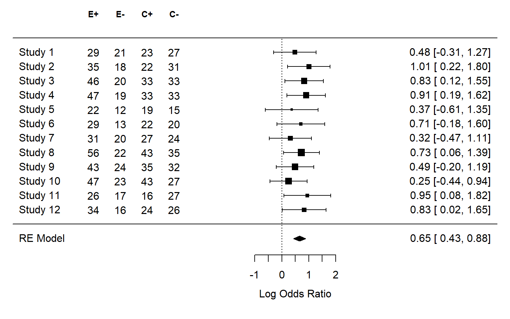

# Meta-analysis{#meta}

Every single study is just a data-point in a future meta-analysis. If you draw small samples from a population, the mean and standard deviation in the sample can differ considerably from the mean and standard deviation in the population. There is great variability in small samples. Parameter estimates from small samples are very imprecise, and therefore the 95% confidence intervals around effect sizes are very wide. Indeed, this led Cohen (1994) to write “I suspect that the main reason [confidence intervals] are not reported is that they are so embarrassingly large!” If we want a more precise estimate of our parameter of interest, such as the mean difference or correlation in the population, we need either run extremely large single studies, or alternatively, combine data from several studies by performing a meta-analysis. The most common approach to combine studies is to perform a meta-analysis of effect size estimates.

You can perform a meta-analysis for a set of studies in a single article you plan to publish (often called an internal meta-analysis), or you can search the literature for multiple studies reported in as many different articles as possible, and perform a meta-analysis on all studies others have published. An excellent introduction to meta-analyses is provided in the book by @borenstein_introduction_2009. There is commercial software you can use to perform meta-analyses, but I highly recommend against using such software. Almost all commercial software packages lack transparency, and do not allow you to share your analysis code and data with other researchers. In this assignment, we will be using R to perform a meta-analysis of effect sizes, using the `metafor` package by @viechtbauer_conducting_2010. An important benefit of using `metafor` is that your meta-analysis can be made completely reproducible.  If you plan to perform a narrative review, it is relatively little additional effort to also code the effect sizes and sample size, and perform an effect size meta-analysis, and to code the statistical test and *p*-value, to perform a *p*-curve or *z*-curve analysis.  

## Random Variation

People find it difficult to think about random variation. Our mind is more
strongly geared towards recognizing patterns than randomness. In this
assignment, we will learn what random variation looks like, and how to reduce
variation by running well-powered studies.

## Variation in single samples

Intelligence tests have been designed such that the mean Intelligence Quotient of the entire population of adults is 100, with a standard deviation of 15. This will not be true for every sample we draw from the population. Let’s get a feel for what the IQ scores from a sample look like. Which IQ scores will people in our sample have?

We will start by manually calculating the mean and standard deviation of a random sample of 10 individuals. Their IQ scores are: 91.15, 86.52, 75.64, 115.72, 95.83, 105.44, 87.10, 100.81, 82.63, and 106.22. If we sum these 10 scores and divide them by 10, we get the mean of our sample: 94.71. We can also calculate the standard deviation from our sample. First, we subtract the overall mean (94.71) from each individual IQ score. Then, we square these differences and then sum these squared differences (giving 1374.79). We divide this sum of
the squared difference by the sample size minus 1 (10-1=9), and finally take the
square root of this value, which gives the standard deviation: 12.36. Open Simulate One Group.R, select all the code, and run it, to randomly simulate 10 IQ scores, and plot them.

<div class="figure" style="text-align: center">

<p class="caption">(\#fig:plot-hist-iq-1)10 random datapoints with mean = 100 and sd = 15 in the population.</p>
</div>

Above is one example of a randomly simulated dataset of 10 points. The grey bars indicate the frequency with which each IQ score was observed. The red dotted line illustrates the normal distribution based on the mean and sd of the population. Both the observed mean (97), as well as the observed standard deviation (14), differ from the true population values. If we simulate 4 additional datasets, we see both the mean and the standard deviation vary.


Imagine we did not yet know what the mean IQ was in our population (where M = 100), or the standard deviation (where SD = 15), and that we would only have access to one dataset. Our estimate might be rather far off. This type of variation is perfectly normal in small samples of 10 participants, given the current standard deviation. The variability in the means is determined by the standard deviation of the measurement. In real life, the standard deviation can be reduced by for example using multiple and reliable measurements (which is why an IQ test has not just one question, but many different questions). But we can make sure our sample mean is closer to the population mean by increasing the sample size.

A new simulated sample with 100 participants is plotted below. We are slowly seeing what is known as the **normal distribution** (and the frequency scores start to resemble the red dotted line illustrating the normal distribution of the population). This is the well-known
bell shaped curve that represents the distribution of many variables in scientific research (although some other types of distributions are quite common as well). The mean and standard deviation are much closer to the true mean and standard deviation, and this is true for most of the simulated samples.

<div class="figure" style="text-align: center">

<p class="caption">(\#fig:plot-hist-iq-2)100 random datapoints with mean = 100 and sd = 15 in the population.</p>
</div>

For a final example, let’s simulate a really large sample of 1000 observation. Not every simulated study of 1000 people will yield the true mean and standard deviation, but it will happen quite often. And although the distribution is very close to a normal distribution, even with 1000 people it is not perfect.

<div class="figure" style="text-align: center">

<p class="caption">(\#fig:plot-hist-iq-3)1000 random datapoints with mean = 100 and sd = 15 in the population.</p>
</div>

## Variance in two groups, and their difference.

Now, assume we have a new IQ training program that will increase peoples IQ score with 6 points. People in condition 1 are in the control condition – they do not get IQ training. People in condition 2 get IQ training. Let’s simulate 10 people in each group, assuming the IQ in the control condition is 100, and in the experimental group is 106 (the SD is still 15 in each group).

<div class="figure" style="text-align: center">

<p class="caption">(\#fig:plot-group1)Simulated sample of independent groups.</p>
</div>

The two groups differ in how close they are to their true means, and as a consequence, the difference between groups varies as well. Note that this difference is the main variable in statistical analyses when comparing two groups in for example a *t*-test. In this specific simulation, we got quite extreme results, with a score of 96 (when the population mean is 100) and a score of 111 (when the population mean is 106). So in this sample, due to random variation, we would get an overestimate of the true effect. Let's simulate 4 additional datasets to see the variation. 


<div class="figure" style="text-align: center">

<p class="caption">(\#fig:plot-group2)Four simulated samples of independent groups.</p>
</div>

We see that there is quite some variation, up to the point that in one simulation the sample means are in the opposite direction of the population means. Again, increasing the sample size will mean that, in the long run, the sample means will get closer to the population means, and that we are more accurately estimation the difference between conditions. With 250 observations in each group, a randomly simulated set of observations for the two groups might look like Figure \@ref(fig:plotgroup3). Note that this difference might not look impressive, but when you perform an independent *t*-test, the difference would pass a significance test with a very low alpha level. It is always recommended to plot your raw data. 

<div class="figure" style="text-align: center">

<p class="caption">(\#fig:plotgroup3)Simulated sample of 250 independent observations</p>
</div>

## Correlations between two groups

Now let’s simulate a correlation between two variables. We will continue with our example of IQ scores, but now we search for fraternal (so not identical) twins, and measure their IQ. From the literature, we know the true correlation of IQ scores between fraternal twins is around r = 0.55. We find 30 fraternal twins, measure their IQ’s, and plot the relation between the IQ of both individuals. In this simulation, we assume all twins have a mean IQ of 100 with a standard deviation of 15. 

The correlation is calculated based on the IQ scores of one fraternal twin (x) and the IQ scores of the other fraternal twin (y) for each pair of twins, and the total number of pairs (N). In the numerator of the formula, the number of pairs is multiplied by the sum of the product of x and y, and from this value the sum of x multiplied by the sum of y is subtracted. In the denominator, the square root is taken from the number of pairs multiplied by the sum of x squared, from which the sum of x, which is then squared, is subtracted, and multiplied by the same calculation but now for y. 

$$r=\frac{n \Sigma x y-(\Sigma x )(\Sigma y)}{\sqrt{[n \Sigma x^{2}-(\Sigma x)^{2}][n \Sigma y^{2}-(\Sigma y)^{2}]}}$$
When we randomly simulate observations for 30 twins, we get the following result.

<div class="figure" style="text-align: center">

<p class="caption">(\#fig:plot-cor1)Correlation based on 30 pairs.</p>
</div>

On the x-axis, we see the IQ score of one twin, and one the y-axis we see the IQ score of the second twin. The black dotted diagonal line illustrates the true correlation (0.55), while the yellow line shows the observed correlation (in this case, r = 0.43). The slope of the yellow line is determined by the observed correlation, but the position of the line is influenced by the mean IQ scores in both groups (in this simulation, the mean on the y-axis is 105, somewhat below 100, and the mean on the x-axis is 102, also slightly above 100. The blue area is the 95% confidence interval around the observed correlation. As we saw in the section on [confidence intervals](#confint), 95% of the time (in the long run) the blue area will contain the true correlation (the dotted black line). Increasing the sample size to 300 narrows the confidence interval considerably, and will guarantee that the sample correlation is much closer to the true correlation.

<div class="figure" style="text-align: center">

<p class="caption">(\#fig:plot-cor2)Correlation based on 30 pairs.</p>
</div>

## Mixed Results{#mixed}

Science is a cumulative process, and we should evaluate lines of research, not single studies. Researchers are advised to design studies that will provide informative data, but sometimes you need to look at sets of studies before patterns become clear. A commonly used lower limit for statistical power is 80%, which means you will find a non-significant result in one out of five studies, when there is a true effect. Whenever you perform studies where power is not 99.99%, you should expect to find mixed results when examining true effects. Indeed, some researchers have pointed out that *not* finding mixed results can be very unlikely (or ‘too good to be true’) in a set of studies [@francis_frequency_2014; @schimmack_ironic_2012]. We don’t have a very good feeling for what real patterns of studies look like, because we are continuously exposed to a scientific literature that does not reflect reality. Almost all multiple study papers in the scientific literature present only statistically significant results, even though this is unlikely.

In the chapter on [likelihoods](#likelihoods) we saw how mixed results are to be expected, and can be strong evidence for the alternative hypothesis. It is not only the case that mixed results should be expected, but exclusively observing statistically significant results, especially when the statistical power is low, is very surprising. The [online Shiny app we used to compute binomial likelihoods](http://shiny.ieis.tue.nl/mixed_results_likelihood/) displays, if you scroll to the bottom of the page, binomial probabilities to find multiple significant findings given a specific assumption about the power of the tests. Francis [@francis_frequency_2014] used these binomial likelihoods to calculate the test of excessive significance [@ioannidis_exploratory_2007] for 44 articles published in the journal Psychological Science between 2009 and 2012 that contained four studies or more. He found that for 36 of these articles, the likelihood of observing four significant results, given the average power computed based on the observed effect sizes, was less than 10%. Given his choice of an alpha of 0.10, this binomial probability is a hypothesis test, and allows the claims (at a 10% alpha level) that whenever the binomial probability of the number of statistically significant results is lower than 10%, the data is surprising, and we can reject the hypothesis that this is an unbiased set of studies. In other words, it is unlikely that this many significant results would be observed, suggesting that publication bias or other selection effects have played a role in these articles. 

One of these 44 articles had been co-authored by myself [@jostmann_weight_2009]. At this time, I knew little about statistical power and publication bias, and beyond accused of improper scientific conduct was stressful. And yet, the accusations were correct - we had selectively reported results, and selectively reported analyses that worked. Having received virtually no training on this topic, we educated ourselves, and uploaded an unpublished study to the website psychfiledrawer.org (which no longer exists) to share our filedrawer. Some years later, we assisted when Many Labs 3 included one of the studies we had published in the set of studies they were replicating [@ebersole_many_2016], and when a null result was observed, we wrote "We have had to conclude that there is actually no reliable evidence for the effect" [@jostmann_short_2016]. I hope this educational materials prevents others from making a fool of themselves like we did. 

A more powerful test than the Test for Excessive Significance is the Test of Insufficient Variance proposed by Uli Schimmack (published on a [blog](https://replicationindex.wordpress.com/2014/12/30/the-test-of-insufficient-variance-tiva-a-new-tool-for-the-detection-of-questionable-research-practices/) instead of in a scientific journal). It also uses *p*-values from reported tests, and builds on the relationship between *p*-values and *Z*-values. If all studies examine the same fixed effect, the Z-scores related to p-values should follow a normal distribution, and individual studies vary as a function of sampling variability. The variance of an unbiased set of Z-scores is not smaller than 1. The variance can be larger than 1, for example when the studies have different true effects. In biased sets of studies, for example when significant results are selectively reported, the variance of the *Z*-scores can be smaller than 1. When non-significant studies are not published, the variance decreases. Another reason for low variance is the use of flexibility during the data-analysis, such as analyzing the data in multiple ways, ad only reporting tests that yield a significant result. TIVA tests whether the variance that is observed is surprising, assuming the dataset is unbiased. A significant p-value for the TIVA test allows you to reject the hypothesis that the studies are unbiased. Uli Schimack shows how the studies reported by @bem_feeling_2011 in his article on pre-cognition are biased. The online [p-checker Shiny app](https://shinyapps.org/apps/p-checker) by Felix Schönbrodt allows you to perform the test of excessive significance, TIVA, and a related bias test, the R-Index.  

Understanding what realistic patterns of results in research lines should look like is hopefully a first step in making you realize you should think meta-analytically. Unless researchers will power all their studies at 99.99% for the rest of their career, they should  observe mixed results in lines of research. Not sharing non-significant results is a violation of the code of research integrity, and due to technological advances, there are many ways to share non-significant results. At the very least, you can publicly share the data and results in an online repository (such as the Open Science Framework). Another way to share mixed results, especially when performing multiple similar studies, is by performing a meta-analysis. 

## Introduction to Meta-Analysis

Every single study is just a data-point in a future meta-analysis. If you draw small samples from a population, the mean and standard deviation in the sample can differ considerably from the mean and standard deviation in the population. There is great variability in small samples. Parameter estimates from small samples are very imprecise, and therefore the 95% confidence intervals around effect sizes are very wide. Indeed, this led Cohen (1994) to write “I suspect that the main reason [confidence intervals] are not reported is that they are so embarrassingly large!” If we want a more precise estimate of our parameter of interest, such as the mean difference or correlation in the population, we need either run extremely large single studies, or alternatively, combine data from several studies by performing a **meta-analysis**. The most common approach to combine studies is to perform a meta-analysis of effect size estimates.

You can perform a meta-analysis for a set of studies in a single article you plan to publish (often called an **internal meta-analysis**), or you can search the literature for multiple studies reported in as many different articles as possible, and perform a meta-analysis on all studies others have published. An excellent introduction to meta-analyses is provided in the book by Borenstein, Hedges, Higgins, and Rothstein @borenstein_introduction_2009. There is commercial software you can use to perform meta-analyses, but I highly recommend *against* using such software. Almost all commercial software packages lack transparency, and do not allow you to share your analysis code and data with other researchers. In this assignment, we will be using R to perform a meta-analysis of effect sizes, using the **metafor** package by Viechtbauer @viechtbauer_conducting_2010. An important benefit of using metafor is that your meta-analysis can be made completely reproducible.

## A single study meta-analysis

Let’s first begin with something you will hardly ever do in real life: a meta-analysis of a single study. This is a little silly, because a simple *t*-test or correlation will tell you the same thing – but it is educational to compare a *t*-test with a meta-analysis of a single study, before we look at how multiple studies are combined into a meta-analysis.

A difference between an independent *t*-test and a meta-analysis is that a *t*-test is performed on the raw data, while a meta-analysis is typically performed on the effect size(s) of individual studies. The `metafor` R package contains a very useful function called `escalc` that can be used to calculate effect sizes, their variances, and confidence intervals around effect size estimates. So let’s start by calculating the effect size to enter into our meta-analysis. As explained in the chapter on [effect sizes](#effectsize) the two main effect sizes used for meta-analyses of continuous variables are the standardized mean difference (*d*) or the correlation (*r*), although it is of course also possible to perform meta-analyses on dichotomous variables (we will see an example below). The code below will calculate the **standardized mean difference** (SMD) from two independent groups from **means** (specified by m1i and m2i), **standard deviations** (sd1i and sd2i), and the number of observations in each group (n1i and n2i). By default, `metafor` computes the effect size ‘**Hedges’ g**’ which is the unbiased version of Cohen’s *d* (see the section on [Cohen's d](#cohend) in the chapter on Effect Sizes).


```r
library(metafor)
g <- escalc(measure = "SMD",
            n1i = 50, # sample size in group 1
            m1i = 5.6, # observed mean in group 1
            sd1i = 1.2, # observed standard deviation in group 1
            n2i = 50, # sample size in group 2
            m2i = 4.9, # observed mean in group 2
            sd2i = 1.3) # observed standard deviation in group 2
g
```

```
##       yi     vi 
## 1 0.5553 0.0415
```

The output gives you Hedge’s *g* (under the `yi` column, which always returns the effect size, in this case the standardized mean difference) and the variance of the effect size estimate (under `vi`). As explained in Borenstein, Hedges, Higgins, and Rothstein (2009, formula 4.18 to 4.24) the standardized mean difference Hedges’ *g* is calculated by dividing the difference between means by the pooled standard deviation, multiplied by a correction factor, J:

$$
J = (1 - \ \ 3/(4df - 1))
$$

$$
g = J \times \ \left( \frac{{\overline{X}}_{1} - {\overline{X}}_{2}}{S_{\text{within}}} \right)
$$

and a very good approximation of the variance of the standardized mean
difference (SMD) Hedges’ g is provided by:

$$
Vg = J^{2} \times \left( \frac{n_{1} + n_{2}}{n_{1}n_{2}} + \frac{g^{2}}{2(n_{1} + n_{2})} \right)
$$

The variance of the standardized mean difference depends only on the sample size (n1 and n2) and the value of the standardized mean difference itself. **To perform the required calculations for a meta-analysis, you need the effect sizes and their variance**. This means that if you have coded the effect sizes and the sample sizes (per group) from studies in the literature, you have the information you need to perform a meta-analysis. You do not need to manually calculate the effect size and its variance using the two formula above – the `escalc` function does this for you. We can now easily perform a single study meta-analysis using the `rma` function in the `metafor` package:


```r
meta_res <- rma(yi, vi, data = g)
meta_res
```

```
## 
## Random-Effects Model (k = 1; tau^2 estimator: REML)
## 
## tau^2 (estimated amount of total heterogeneity): 0
## tau (square root of estimated tau^2 value):      0
## I^2 (total heterogeneity / total variability):   0.00%
## H^2 (total variability / sampling variability):  1.00
## 
## Test for Heterogeneity:
## Q(df = 0) = 0.0000, p-val = 1.0000
## 
## Model Results:
## 
## estimate      se    zval    pval   ci.lb   ci.ub 
##   0.5553  0.2038  2.7243  0.0064  0.1558  0.9547  ** 
## 
## ---
## Signif. codes:  0 '***' 0.001 '**' 0.01 '*' 0.05 '.' 0.1 ' ' 1
```

Under 'Model Results' we find the effect size Hedges’ g (0.5552575) and the standard error (0.2038175), the *Z*-test statistic testing the mean difference against the null-hypothesis (2.7242881), and the 95% confidence interval [ci.lb = 0.1557826; ci.ub = ] around the effect size (the interval width can be specified using the ‘level =’ option). We also see the *p*-value for the test of the meta-analytic effect size against 0. In this case we can reject the null-hypothesis (*p* = 0.006444).

In a meta-analysis, a *Z*-test is used to examine whether the null-hypothesis can be rejected. This assumes a normally distributed random effect size model. Normally, you would analyze data from a single study with two groups using a *t*-test, which not surprisingly uses a *t*-distribution. If the sample size is large enough, the *Z* and *t* distribution are very similar. I don't know why statistical computations sometimes care a lot about a small amount of bias (the difference between the effect size *d* and *g*, for example) and sometimes not (the difference between *Z* and *t*), but meta-analysts seem happy with *Z*-scores (with large enough sample sizes (which is commonly true in a meta-analysis) the difference between a *Z*-test and *t*-test is tiny). If we directly compare a single-study meta-analysis based on a *Z*-test with a *t*-test, we will see some tiny differences in the results. 

As explained in the chapter on [effect sizes](#effectsize) we can directly calculate the effect size Hedges’ *g* (and it's 95% confidence interval) using MOTE [@buchanan_mote_2017]. The MOTE package uses the *t*-distribution when calculating confidence intervals around the effect size (and we can see this makes only a tiny difference compared to using the *Z*-distribution in a meta-analysis with 50 observations in each group). 


```r
# Calculate Hedges g and perform t-test with MOTE 
MOTE_res <- MOTE::g.ind.t(m1 = 5.6, 
                          m2 = 4.9, 
                          sd1 = 1.2, 
                          sd2 = 1.3, 
                          n1 = 50, 
                          n2 = 53, 
                          a = 0.05)
MOTE_res$statistic
```

```
## [1] "$t$(101) = 2.83, $p$ = 0.00553819625499491"
```

```r
MOTE_res$p
```

```
## [1] 0.005538196
```

The *t*-value is 2.8348536, and the *p*-value is 0.0055382. 


```r
# Calculate Hedges g with MOTE 
MOTE_res$estimate
```

```
## [1] "$d_{g}$ = 0.55, 95\\% CI [0.16, 0.94]"
```

The results are very similar to those computed when performing a meta-analysis, with *g* = 0.55, 95% CI[0.16; 0.94], where the effect size and the upper bound for the confidence interval differ only 0.01 after rounding. 

It is common to visualize the results of a meta-analysis using a forest plot (see Figure \@ref(fig:metaforest)). We see the effect size for Study 1 marked by the black square at 0.56, and the confidence interval is visualized by lines extending to 0.16 on the left and 0.95 on the right. The numbers are printed on the right-hand side of the forest plot. On the lower half of the forest plot, we see a stretched-out diamond. The diamond summarizes the meta-analytic effect size estimate, with the center being at the meta-analytic effect size estimate, and the left and right endpoints at the 95% confidence interval of the meta-analytic effect size estimate. Because we only have a single study, the meta-analytic effect size estimate is the same as the effect size estimate for our single study.

<div class="figure" style="text-align: center">

<p class="caption">(\#fig:metaforest)Forest plot for a single study.</p>
</div>

## Simulating meta-analyses of mean standardized differences

Meta-analyses get a bit more exciting when we are using them to analyze results from multiple studies. When multiple studies are combined in a meta-analysis, effect size estimates are not simply averaged, but they are **weighed** by the **precision** of the effect size estimate, which is determined by the sample size of the study. Thus, the larger the sample size of an individual study, the more weight it gets in the meta-analysis, meaning that it has more influence on the meta-analytic effect size estimate.

One intuitive way to learn about meta-analyses is to simulate studies and meta-analyze them. 


```r
set.seed(94)
nSims <- 12 # number of simulated studies
m1 <- 106 # population mean group 1
sd1 <- 15 # standard deviation group 1
m2 <- 100 # population mean group 2
sd2 <- 15 # standard deviation group 1
metadata <- data.frame(yi = numeric(0), vi = numeric(0)) # create empty dataframe

for (i in 1:nSims) { # for each simulated study
  n <- sample(30:80, 1) # pick a sample size per group
  x <- rnorm(n = n, mean = m1, sd = sd1) 
  y <- rnorm(n = n, mean = m2, sd = sd2)
  metadata[i,1:2] <- escalc(n1i = n, n2i = n, m1i = mean(x), m2i = mean(y), 
                          sd1i = sd(x), sd2i = sd(y), measure = "SMD")
}
result <- rma(yi, vi, data = metadata, method = "FE")
par(mar=c(5,4,0,2))
forest(result)
```

<div class="figure" style="text-align: center">

<p class="caption">(\#fig:meta-sim)Forest plot for 12 simulated studies.</p>
</div>

We see 12 rows, one for each study, each with their own effect size and confidence interval. If you look closely, you can see the squares that indicate the effect size estimate for each study differ in size. The larger the sample size, the bigger the square. Study 3 had a relatively small sample size, which can be seen both by the small square, and the relatively wide confidence interval. Study 2 had a larger sample size, and thus a slightly larger square and narrower confidence interval. At the bottom of the graph we find the meta-analytic effect size and its confidence interval, both visualized by a diamond and numerically. The model is referred to as a FE Model, or **Fixed Effect (FE) model**. The alternative approach is a RE Model, or **Random Effects (RE) model** (the difference is discussed below).

You might notice that the first two studies in the meta-analysis were not statistically significant. Take a moment to think for yourself if you would have continued this research line, after not finding an effect twice in a row. If you feel like it, run the code above several times (remove the set.seed or you will get the same result each time) and see how often this happens with a population effect size and range of sample sizes in this simulation. As should be clear from the section on [mixed results](#mixed), it is important to think meta-analytically, because in the long run there will be situations where you will find one or two non-significant results early in a research line, even when there is a true effect. 

Let's also look at the result of the meta-analysis, which is a bit more interesting now that we have 12 studies:


```r
result
```

```
## 
## Fixed-Effects Model (k = 12)
## 
## I^2 (total heterogeneity / total variability):   0.00%
## H^2 (total variability / sampling variability):  0.83
## 
## Test for Heterogeneity:
## Q(df = 11) = 9.1824, p-val = 0.6051
## 
## Model Results:
## 
## estimate      se    zval    pval   ci.lb   ci.ub 
##   0.3655  0.0564  6.4777  <.0001  0.2549  0.4761  *** 
## 
## ---
## Signif. codes:  0 '***' 0.001 '**' 0.01 '*' 0.05 '.' 0.1 ' ' 1
```


We see a test for **heterogeneity**, a topic we will return to [below](#heterogeneity). We see the model results, which in this specific simulation yielded a meta-analytic effect size estimate of 0.37. The confidence interval around the effect size estimate [0.25; 0.48] is much narrower than we saw before for a single study. This is because the 12 studies we simulated together have quite a large sample size, and the larger the sample size, the smaller the standard error, and thus the narrower the confidence interval is. The meta-analytic effect size estimate is statistically different from 0 (*p* \< 0.0001) so we can reject the null hypothesis if we use an alpha level of 0.05.

### Fixed Effect vs Random Effects

There are two possible models when performing a meta-analysis. One model, known as a fixed effect model, assumes there is one effect size that generates the data in all studies in the meta-analysis. This model assumes there is no variation between individual studies – all have exactly the same true effect size. The perfect example of this is the simulations we have done so far. We specified a single true effect in the population, and generated random samples
from this population effect.

Alternatively, one can use a model where the true effect differs in some way in each individual study. We don’t have a single true effect in the population, but a range of **randomly distributed** true effect sizes (hence the ‘random effects’ model). Studies differs in some way from each other (or some sets of studies differ from other sets), and their true effect sizes differ as well. Note the difference between a fixed effect model, and a random effect**s** model, in that the plural ‘effects’ is used only in the latter. Borenstein et al
(2009) state there are two reasons to use a fixed effect model: When all studies are functionally equivalent, and when your goal is *not* to generalize to other populations. This makes the random effects model generally the better choice, although some people have raised the concern that random-effects models give more weight to smaller studies, which can be more biased. By default, metafor will use a random effects model. We used the method="FE" command to explicitly ask for a fixed effect model. In the meta-analyses we will simulate in the rest of this assignment we will leave out this command and simulate random effects meta-analyses.

### Simulating meta-analyses for dichotomous outcomes

Although meta-analyses on mean differences are very common, a meta-analysis can be performed on many different effect sizes. To show a slightly less common example, let’s simulate a meta-analysis based on odds ratios. Sometimes the main outcome in an experiment is a dichotomous variable, such as the success or failure on a task. In such study designs we can calculate risk ratios, odds ratios, or risk differences as the effect size measure. Risk differences are sometimes judged easiest to interpret, but odds ratios are most often used for a meta-analysis because they have attractive statistical properties. An **odds ratio** is a ratio of two odds. To illustrate how an odds ratio is calculated, it is useful to consider the four possible outcomes in a 2 x 2 table of outcomes:

|              | Success | Failure | N      |
|:-------------|:-------:|:-------:|:------:|
| Experimental | *A*     | *B*     | *n1*   |
| Control      | *C*     | *D*     | *n2*   |

The odds ratio is calculated as: 
$$OR = \ \frac{\text{AD}}{\text{BC}}$$
The meta-analysis is performed on log transformed odds ratios (because log transformed odds ratios are symmetric around 1, see Borenstein et al., 2009), and thus the log of the odds ratio is used, which has a variance which is approximated by: 
$$\text{Var}\left( \log\text{OR} \right) = \ \frac{1}{A} + \frac{1}{B} + \frac{1}{C} + \frac{1}{D}$$

Let’s assume that we train students in using a spaced learning strategy (they work through a textbook every week instead of cramming the week before the exam). Without such training, 70 out of 100 students succeed in passing the course after the first exam, but with this training, 80 out of 100 students
pass.

|              | Success | Failure | N   |
|--------------|---------|---------|-----|
| Experimental | 80      | 20      | 100 |
| Control      | 70      | 30      | 100 |

The odds of passing in the experimental group is 80/20, or 4, while odds in the control condition are 70/30, or 2.333. The ratio of these two odds is then: 4/2.333 = 1.714, or:

$$
OR = \ \frac{80 \times 30}{20\  \times 70} = 1.714
$$

We can simulate studies with dichotomous outcomes, where we set the percentage of successes and
failures in the experimental and control condition. In the script below, by default the percentage of success in the experimental condition is 70%, and in the control condition it is 50%.


```r
library(metafor)
set.seed(5333)
nSims <- 12 #number of simulated experiments

pr1 <- 0.7 # Set percentage of successes in Group 1
pr2 <- 0.5 # Set percentage of successes in Group 2

ai <- numeric(nSims) # set up empty vector for successes group 1
bi <- numeric(nSims) # set up empty vector for failures group 1
ci <- numeric(nSims) # set up empty vector for successes group 2
di <- numeric(nSims) # set up empty vector for failures group 2

for (i in 1:nSims) { #for each simulated experiment
  n <- sample(30:80, 1)
  x <- rbinom(n, 1, pr1) #produce simulated participants (1 = success, 0 is failure)
  y <- rbinom(n, 1, pr2) #produce simulated participants (1 = success, 0 is failure)
  ai[i] <- sum(x == 1) #Successes Group 1
  bi[i] <- sum(x == 0) #Failures Group 1
  ci[i] <- sum(y == 1) #Successes Group 2
  di[i] <- sum(y == 0) #Failures Group 2
}

# Combine data into dataframe
metadata <- cbind(ai, bi, ci, di)
# Create escalc object from metadata dataframe 
metadata <- escalc(measure = "OR", 
                   ai = ai, bi = bi, ci = ci, di = di, 
                   data = metadata)
# Perform Meta-analysis
result <- rma(yi, vi, data = metadata)
# Create forest plot. Using ilab and ilab.xpos arguments to add counts
forest(result, 
       ilab = cbind(metadata$ai, metadata$bi, metadata$ci, metadata$di), 
       xlim = c(-10, 8), 
       ilab.xpos = c(-7, -6, -5, -4))
text(c(-7,-6,-5,-4), 14.7, c("E+", "E-", "C+", "C-"), font = 2, cex = .8) # add labels
```



The forest plot presents the studies and four columns of data after the study label, which contain the number of successes and failures in the experimental groups (E+ and E-), and the number of successes and failures in the control group (C+ and C-). Imagine we study the percentage of people who get a job
within 6 months after a job training program, compared to a control condition. In Study 1, which had 50 participants in each condition, 29 people in the job training condition got a job within 6 months, and 21 did not get a job. In the control condition, 23 people got a job, but 27 did not. The effect size estimate for the random effects model is 0.65. Feel free to play around with the script, adjusting the number of studies, or the sample sizes in each study, to examine the effect it has on the meta-analytic effect size estimate.

We can also get the meta-analytic test results by printing the test output. We see that there was no heterogeneity in this meta-analysis. This is true (we simulated identical studies) but also highly unlikely to ever happen in real life, where variation in effect sizes between studies included in a meta-analysis is a much more realistic scenario. 


```r
# Print result meta-analysis
result
```

```
## 
## Random-Effects Model (k = 12; tau^2 estimator: REML)
## 
## tau^2 (estimated amount of total heterogeneity): 0 (SE = 0.0645)
## tau (square root of estimated tau^2 value):      0
## I^2 (total heterogeneity / total variability):   0.00%
## H^2 (total variability / sampling variability):  1.00
## 
## Test for Heterogeneity:
## Q(df = 11) = 4.8886, p-val = 0.9364
## 
## Model Results:
## 
## estimate      se    zval    pval   ci.lb   ci.ub 
##   0.6548  0.1132  5.7824  <.0001  0.4328  0.8767  *** 
## 
## ---
## Signif. codes:  0 '***' 0.001 '**' 0.01 '*' 0.05 '.' 0.1 ' ' 1
```

### Heterogeneity{#heterogeneity}

Although researchers often primarily use meta-analysis to compute a meta-analytic effect size estimate, and test whether this effect is statistically different from zero, **an arguably much more important use of meta-analyses is to explain variation between (sets of) studies**. This variation among (sets of) studies is referred to as **heterogeneity**. One goal of meta-analyses is not just to code effect sizes and estimate the meta-analytic effect size, but to code factors in studies that can explain heterogeneity, and examine which of these factors account for heterogeneity. This can help in theory evaluation or theory development. Tests have been developed to examine whether the studies included in a meta-analysis vary more than would be expected if the underlying true effect size in all
studies was the same, and measures have been developed to quantify this variation.

If all studies have the same true population effect size, the only source of variation is random error. If there are real differences between (sets of) studies, there are two sources of variation, namely random variation from study to study, *and* real differences in effect sizes in (sets of) studies.

A classical measure of heterogeneity is Cochran’s Q statistic, which is the weighted sum of the squared differences between effect size estimates in each study, and the meta-analytic effect size estimate. The Q statistic can be used to test whether the absence of heterogeneity can be statistically rejected (by comparing it to the expected amount of variation, which is the degrees of freedom, *df*, or the number of studies -1, see Borenstein et al., 2009), but it can have low power if the number of studies in the meta-analysis is small [@huedo-medina_assessing_2006].

On theoretical grounds one might argue that some heterogeneity will always happen in a meta-analysis, and therefore it is more interesting to quantify the extent to which there is heterogeneity. The I² index measures the extent of true heterogeneity. It is calculated as follows: $$I^{2} = \ \frac{(Q - k - 1)}{Q} \times 100\%$$, where the k is the number of studies (and k-1 is the degrees of freedom). I² ranges from 0 to 100 and can be interpreted as the percentage of the total variability in a set of effect sizes that is due to heterogeneity. When I² = 0 all variability in the effect size estimates can be explained by within-study error, and when I² = 50 half of the total variability can be explained by true heterogeneity. I² values of 25%, 50%, and 75% can be interpreted as low, medium, and high heterogeneity.

The script below simulates a similar meta-analysis to the example for dichotomous outcomes above, but with a small variation. The first half of the simulated experiments are based on the population success
rates 0.7 and 0.2, but the second half of the simulated experiments are based on the population success rates 0.9 and 0.7. Thus, in this set of studies the odds ratio differs for the first half of the studies, compared to the second half (successes in Group 1 and 2 are set to 0.2 and 0.7 for the first half, but to 0.7 and 0.9 in the second half). There is true heterogeneity. We use the `confint` function in the metafor package to report both the I² statistic, and its confidence interval.


```r
library(metafor)
set.seed(2942)
nSims <- 12 # Number of simulated experiments

pr1 <- 0.7 # Set percentage of successes in Group 1
pr2 <- 0.2 # Set percentage of successes in Group 2

ai <- numeric(nSims) # set up empty vector for successes group 1
bi <- numeric(nSims) # set up empty vector for failures group 1
ci <- numeric(nSims) # set up empty vector for successes group 2
di <- numeric(nSims) # set up empty vector for failures group 2

for (i in 1:nSims/2) { # for half (/2) of the simulated studies
  n <- sample(30:80, 1)
  x <- rbinom(n, 1, pr1) # produce simulated participants (1 = success, 0 is failure)
  y <- rbinom(n, 1, pr2) # produce simulated participants (1 = success, 0 is failure)
  ai[i] <- sum(x == 1) # Successes Group 1
  bi[i] <- sum(x == 0) # Failures Group 1
  ci[i] <- sum(y == 1) # Successes Group 2
  di[i] <- sum(y == 0) # Failures Group 2
}

pr1 <- 0.9 #Set percentage of successes in Group 1
pr2 <- 0.7 #Set percentage of successes in Group 2

for (i in (nSims/2 + 1):(nSims)) { #for the other half (/2) of each simulated study
  n <- sample(30:80, 1)
  x <- rbinom(n, 1, pr1) # produce simulated participants (1 = success, 0 is failure)
  y <- rbinom(n, 1, pr2) # produce simulated participants (1 = success, 0 is failure)
  ai[i] <- sum(x == 1) # Successes Group 1
  bi[i] <- sum(x == 0) # Failures Group 1
  ci[i] <- sum(y == 1) # Successes Group 2
  di[i] <- sum(y == 0) # Failures Group 2
}

# Combine data into dataframe
metadata <- cbind(ai, bi, ci, di)
# Create escalc object from metadata dataframe 
metadata <- escalc(measure = "OR", 
                   ai = ai, bi = bi, ci = ci, di = di, 
                   data = metadata)
# Perform Meta-analysis
result <- rma(yi, vi, data = metadata)
# Print result meta-analysis
result
```

```
## 
## Random-Effects Model (k = 12; tau^2 estimator: REML)
## 
## tau^2 (estimated amount of total heterogeneity): 0.3174 (SE = 0.2429)
## tau (square root of estimated tau^2 value):      0.5634
## I^2 (total heterogeneity / total variability):   56.53%
## H^2 (total variability / sampling variability):  2.30
## 
## Test for Heterogeneity:
## Q(df = 11) = 25.7650, p-val = 0.0070
## 
## Model Results:
## 
## estimate      se    zval    pval   ci.lb   ci.ub 
##   1.8125  0.2190  8.2764  <.0001  1.3833  2.2417  *** 
## 
## ---
## Signif. codes:  0 '***' 0.001 '**' 0.01 '*' 0.05 '.' 0.1 ' ' 1
```

```r
confint(result) # Get confidence interval for indices of heterogeneity
```

```
## 
##        estimate   ci.lb   ci.ub 
## tau^2    0.3174  0.0355  1.2286 
## tau      0.5634  0.1883  1.1084 
## I^2(%)  56.5308 12.6888 83.4276 
## H^2      2.3005  1.1453  6.0341
```

Based on the test for heterogeneity, we can reject the null hypothesis that there is no heterogeneity in the meta-analysis. Tests for heterogeneity themselves have Type 1 and Type 2 error rates, and with a small number of studies (such as in our example, n = 12) tests for heterogeneity can have low power. If you remove the set.seed command and run the code multiple times, you will see that the test for heterogeneity will often not be significant, even though there is true heterogeneity in the simulation. In large meta-analyses, power can be so high that the test always yields a *p*-value small enough to reject the null hypothesis, but then it is important to look at the I² estimate. 

### Improving the reproducibility of meta-analyses{#metareporting}

Although meta-analyses do not provide definitive conclusions, they are typically interpreted as state-of-the-art empirical knowledge about a specific effect or research area. Large-scale meta-analyses often accumulate a massive number of citations and influence future research and theory development. It is therefore essential that published meta-analyses are of the highest possible quality.

At the same time, the conclusions from meta-analyses are often open for debate and are subject to change as new data becomes available. We recently proposed practical recommendations to increase the reproducibility of meta-analyses to facilitate quality control, improve reporting guidelines, allow researchers to re-analyze meta-analyses based on alternative inclusion criteria, and future-proof meta-analyses by making sure the collected meta-analytic data is shared so that continuously accumulating meta-analyses can be performed, and so that novel statistical techniques can be applied on the collected data as they become available [@lakens_reproducibility_2016]. The need for the improvement in reproducibility of meta-analysis is clear - a recent review of 150 meta-analyses in Psychological BUlletin revealed that only 1 meta-analysis shared the statistical code [@polanin_transparency_2020]. This is unacceptable in the current day and age. Following the recommendations summarized in Table \@ref(tab:table-rec1) should substantially improve the state-of-the-art in meta-analyses.


Table: (\#tab:table-rec1)Six practical recommendations to improve the quality and reproducibility of meta-analyses.

|What?                         |How?                                                                                                                                                                                                                                                                                                                                                                                                                                                                                                                                                       |
|:-----------------------------|:----------------------------------------------------------------------------------------------------------------------------------------------------------------------------------------------------------------------------------------------------------------------------------------------------------------------------------------------------------------------------------------------------------------------------------------------------------------------------------------------------------------------------------------------------------|
|Facilitate cumulative science |Disclose all meta-analytic data (effect sizes, sample sizes for each condition, test statistics and degrees of freedom, means, standard deviations, and correlations between dependent observations) for each data point. Quote relevant text from studies that describe the meta-analytic data to prevent confusion, such as when one effect size is selected from a large number of tests reported in a study. When analyzing subgroups, include quotes from the original study that underlie this classification, and specify any subjective decisions. |
|Facilitate quality control    |Specify which effect size calculations are used and which assumptions are made for missing data (e.g., assuming equal sample sizes in each condition, imputed values for unreported effect sizes), if necessary for each effect size extracted from the literature. Specify who extracted and coded the data, knowing it is preferable that two researchers independently extract effect sizes from the literature.                                                                                                                                        |
|Use reporting guidelines      |A minimal requirement when reporting meta-analyses is to adhere to one of the reporting standards (e.g., PRISMA). The reporting guidelines ask authors of meta-analyses to report essential information that should be made available either in the main text of the article, or by providing a completed checklist as supplementary material during review and after publication.                                                                                                                                                                         |
|Preregister                   |Whenever possible, pre-register the meta-analysis research protocol to distinguish between confirmatory and exploratory analyses. Perform a prospective meta-analysis where possible.                                                                                                                                                                                                                                                                                                                                                                      |
|Facilitate reproducibility    |Allow others to re-analyze the data to examine how sensitive the results are to subjective choices such as inclusion criteria. Always include a link to data files that can be directly analyzed with statistical software, either by providing completely reproducible scripts containing both the data and the reported analyses in free software (e.g., R), or at the very minimum a spreadsheet that contains all meta-analytic data that can easily analyzed in any statistical program.                                                              |
|Recruit expertise             |Consider consulting a librarian before you start the literature search, and a statistician before coding the effect sizes, for advice on how make the literature search and effect size calculations reproducible.                                                                                                                                                                                                                                                                                                                                         |
