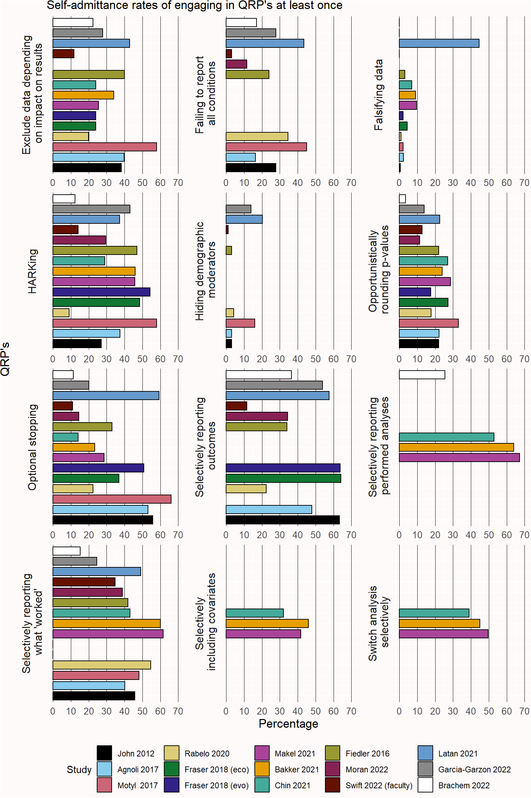
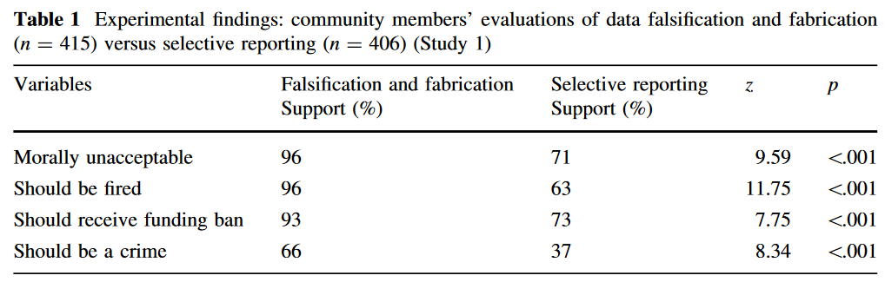

# Research Integrity {#integrity}

When doing research, it is important to be guided by responsible conduct of research, or more colloquially, **good research practices**. Good research practices are professional standards that have the goal to maximize the quality and reliability of research. On an abstract level beliefs about good research practices do not change substantially over time. But in practice the implementation good research practices changes as a function of social, political, and technological developments. For example, it is increasingly seen as a good research practice to share all data underlying the research you report. This was difficult before the internet, but has become much easier now free data repositories exist online. As a consequence, we increasingly see that research funders expect data collected with their grants to be open whenever possible. 

A distinction is made between **research integrity** and **research ethics**. Research integrity is a set of principles based on professional standards. Research ethics is a set of moral principles, such as autonomy, beneficence, non-maleficence, and justice [@gillon_medical_1994]. The principle of autonomy leads to research practices such as informed consent, the requirement to be truthful to participants, and confidentiality. From the principle of non-maleficence it follows that researchers should avoid research that harms participants, or research that is too burdensome [@varkey_principles_2021]. 

The professional standards in Codes of Conduct for Research Integrity vary slightly between documents [@komic_research_2015]. In this chapter, I will discuss both the [European Code of Conduct for Research Integrity]( https://allea.org/code-of-conduct/), and the [Netherlands Code of Conduct for Research Integrity](https://www.nwo.nl/en/netherlands-code-conduct-research-integrity). Throughout this chapter, code of conduct for research integrity will be abbreviated to 'code of conduct'. You might have to adhere to other codes of conduct, depending on where you work.

As the European code of conduct states, “A basic responsibility of the research community is to formulate the principles of research, to define the criteria for proper research behaviour, to maximise the quality and robustness of research, and to respond adequately to threats to, or violations of, research integrity.” Codes of conduct are always living documents, because what we believe is ‘proper research behavior’ changes over time. There are certain core principles you will see underlying all codes of conduct of research integrity, such as honesty, transparency, scrupulousness, accountability, reliability, respect, and independence. These underlying principles are translated into more specific behaviors that are considered proper behavior – both for researchers, as for research institutions. Have you ever read the code of conduct? If not, then your institution is already in violation of the code of conduct, as it is their responsibility to “develop appropriate and adequate training in ethics and research integrity to ensure that all concerned are made aware of the relevant codes and regulations”.

The Dutch Code of Conduct for Research integrity states to "Conduct research that can be of scientific, scholarly and/or societal relevance". Of course, you might perform a study for purely *educational* purposes, and the study you perform does not have to have any additional value (although it is always nice of it does). But researchers should prevent **research waste**, where they perform studies that have little to no value. Chalmers and Glasziou [-@chalmers_avoidable_2009] discuss four sources of research waste: Choosing the wrong questions for research, doing studies that are unnecessary, or poorly designed (which is why you need to evaluate the value of the information you will collect, as explained in the chapter on [sample size justification](#power])), failure to report research promptly or at all (as explained in the chapter on [bias](#bias)), and biased or unusable reports of research (which can be prevented by reporting your study so it can be included in a future [meta-analysis](#reportmeta)). The Dutch code of conduct also explicitly states researchers should "Make sure that your research design can answer the research question". As you can see, many of the topics discussed in this textbook relate to preventing research waste, and are thereby related to research integrity.  

As discussed in the chapter on [pregistration and transparency](#sharing) researchers should share their data when possible, which is also in the code of conduct: "As far as possible, make research findings and research data public subsequent to completion of the research. If this is not possible, establish valid reasons for their non-disclosure." As discussed below, the General Data Protection Regulation (GDPR) requires European researchers to ask permission to share data that is collected. Old informed consent forms did not have such a question, and even often stated that data would be destroyed several years after data collection. This is a good example of updated professional standards, because nowadays, it is much more common to expect data to be available alongside the published article for perpetuity. You will therefore want to make sure you use updated consent forms that allow you to share the data you collect. 

Younger researchers sometimes feel that their supervisors require them to act in ways that are not in line with the code of conduct. Some young researchers would not go along with such pressures, but others explicitly say they are willing to violate the code of conduct if this will get them closer to completing their PhD [@van_de_schoot_use_2021]. Others trust their supervisors to know what is the right thing to do, even though supervisors themselves might feel forced to act in ways that violate the code of conduct by *their* managers. Not surprisingly, pressuring people you have power over to violate the code of conduct is a violation of the code of conduct. For example, the Netherlands code of conduct states that “As a supervisor, principal investigator, research director or manager, refrain from any action which might encourage a researcher to disregard any of the standards in this chapter”.

Some researchers have noted how hypercompetition in science for research grants, as well as how researchers are individually rewarded for the number of published articles, can lead to unethical behavior [@edwards_academic_2017; @anderson_perverse_2007]. The Netherlands code of conduct stresses the importance of creating an open, safe, and inclusive research culture where researchers can discuss such pressures, as well as how to guarantee good research practices are always followed. If you want to report and discuss suspected irregularities that you perceive as a violation of the code of conduct, universities typically have both internal and external confidential advisors that you can reach out to, and sometimes it is even possible to report these suspicions completely anonymously through services such as [SpeakUp](https://peopleintouch.com/). I would highly recommend, both for scientific integrity as well as for your own well-being, to discuss problematic behavior that you encounter with people you can trust, such as a confidential advisor.

We would not have problems with researchers violating the code of conduct if doing the right thing was always the easiest thing to do. Violating the code of conduct can come with immediate individual rewards, such as a higher probability of publishing a paper in a high impact journal, and it comes at long term collective costs for the reliability of scientific research, which can also impact the public's trust in science [@wingen_no_2020; @anvari_replicability_2018]. Social scientists might recognize this situation as a social dilemma, where what is best for the individual is not aligned with what is best for the collective. Changes in incentives structures can perhaps align individual and collective rewards. One way is to find and punish researchers who knowingly violate the code of conduct (for an example, see this story about [Brian Wansink](https://www.vox.com/science-and-health/2018/9/19/17879102/brian-wansink-cornell-food-brand-lab-retractions-jama)). New [bias detection tests](#p-value-meta-analysis) such as *p*-curve and *z*-curve analysis can also be used to identify researchers who have systematically used questionable research practices (discussed in the next section). In the end, even though it might sound idealistic, I believe all scientists should put science first. If you pursue a career in science at a public university you are paid by tax money to generate reliable knowledge. Nothing you do while pursuing additional goals, such as a successful career, should get in the way of the responsibility society has trusted you with, which is generating reliable and trustworthy knowledge.

## Questionable Research Practices {#QRP}

Although in theory all researchers should follow the code of conduct for research integrity, many researchers do not. Researchers across scientific disciplines admit to certain practices that have been dubbed ‘questionable research practices’. This name is somewhat unfortunate, as most of these practices are not questionable at all, but directly violate the code of conduct. That they are nevertheless referred to as ‘questionable’ is mainly because many researchers were not aware of the problematic nature of these practices, and slowly needed to accept how problematic they always were. 

Questionable research practices generally describe practices that violate the requirement from the code of conduct to "Make sure that the choice of research methods, data analysis, assessment of results and consideration of possible explanations is not determined by non-scientific or non-scholarly (e.g. commercial or political) interests, arguments or preferences." In additional to commercial or political interests, many scientists have an interest in publishing scientific articles, as doing so is good for their career. Questionable research practices make it easier for researchers to publish their article, either because they increase the probability of being able to report statistically significant results, or because they hide imperfections, which makes the results seem more convincing than they are. These practices come at the expense of the truth. 

Researcher admit to engaging in questionable research practices, and depending on the community of researchers surveyed, several problematic practices are engaged in at least once by many scholars. Figure \@ref(fig:qrp) summarizes the results from 14 different surveys [@latan_crossing_2021; @swift_questionable_2022; @moran_i_2022; @agnoli_questionable_2017; @makel_both_2021; @chin_questionable_2021; @bakker_questionable_2021; @motyl_state_2017; @fiedler_questionable_2016; @fraser_questionable_2018; @john_measuring_2012; @rabelo_questionable_2020]. However, coding of open ended questions suggest there is substantial measurement error when participants answer these items, so it is unclear whether the percentages in Figure \@ref(fig:qrp) directly translate into the percentage of researchers actually engaging in questionable practices [@motyl_state_2017].

Many researchers selectively publish only those results or analyses with significant results, despite the Dutch code of conduct stipulating that researchers should "Do justice to all research results obtained." and the European code of conduct stating that "Authors and publishers consider negative results to be as valid as positive findings for publication and dissemination." Registered Reports have been an important step in aligning research practices with the code of conduct when it comes to publishing null results.

Researchers also flexibly analyse their data by selectively reporting conditions, measures, covariates, and a host of other data analytic strategies that inflate the Type 1 error rate, and increase the probability of obtaining a statistically significant result. Preregistration has been an important step of increasing the transparency of data-driven choices in the analyses reported in scientific articles, and allows researchers to evaluate whether any deviations from the statistical analysis plan decrease the severity of the test, or increase it  [@lakens_value_2019]. With increasing awareness of the problematic nature of these practices, hopefully we will see a strong decline in their occurrence, and researchers will learn correct approaches to maintain some flexibility in their analyses (for example by replacing optional stopping by [sequential analysis](#sequential). @wigboldus_encourage_2016 make the important distinction between questionable research practices, and questionable reporting practices. Whenever in doubt, transparently reporting the decisions you made while analyzing data should give researchers all the information they need to evaluate the reported results.

(ref:qrp) Self-admittance of engaging in a questionable research practices at least once from 14 surveys among a variety of samples of researchers .

(\#fig:qrp)(ref:qrp)

## Fabrication, Falsification, and Plagiarism

Beyond questionable research practices, fabricating data is making up results and recording them as if they were real, and falsification is manipulating manipulating aspects of research, including data, without any scientific justification. Data fabrication is a research practice that is outright dishonest. There have been a [substantial number of cases](https://en.wikipedia.org/wiki/List_of_scientific_misconduct_incidents) where researchers have fabricated complete datasets in dozens of experiments. Some examples were already mentioned in the chapter on [bias detection](#bias). It can be difficult to prove fabrication, as researchers often keep bad records of data collection. For example, Susannah Cahalan makes a convincing case in her book '[The Great Pretender](https://www.npr.org/2019/11/13/777172316/the-great-pretender-investigates-a-landmark-moment-in-psychiatric-history)' that the famous study by David Rosehan ‘[On being sane in insane places](https://en.wikipedia.org/wiki/Rosenhan_experiment#Accusation_of_hoax)’ was largely made up. In the study,  healthy confederates who pretended to hear voices were admitted as in-patients suffering from schizophrenia. Her detailed investigation raises severe doubts the study was performed as described (see also @scull_rosenhan_2023).

One might hope falsification and fabrication is rare, but a recent large scale survey in The Netherlands yielded prevalence estimates around 4% [@gopalakrishna_prevalence_2022]. Data fabrication can also occur on a smaller scale. Imagine collecting data for a study. As part of the study, it is your task to ask the age of participants and their gender, for the demographic statistics to be reported when describing the sample. After collecting all the data, you notice you have forgotten to collect the demographic data for two individuals. You might be tempted to, based on your memory, guess the demographic statistics of these two individuals, to not have to admit you have made a mistake during the data collection when you wrote up the demographic information. However, this would also constitute data fabrication. You should instead transparently mention a mistake was made. Mistakes happen, and it is important to create a culture where people can admit mistakes, so that we can learn from them and prevent them in the future [@bishop_fallibility_2018]. 

Note that it can be fine to **simulate** data to perform a power analysis – one should just not present such data as if it was collected from real participants. The Dutch code of conduct states: “Do not fabricate data or research results and do not report fabricated material as if it were fact. Do justice to all research results obtained. Do not remove or change results without explicit and proper justification. Do not add fabricated data during the data analysis.” 

The European code of conduct defines plagiarisms as: using other people’s work and ideas without giving proper credit to the original source, thus violating the rights of the original author(s) to their intellectual outputs." It is possible to re-use text, but the source should be cited, and quotation marks should be used to identify the text as a quote from another source. A special case of plagiarism is 'self-plagiarism' or text recycling where the same text by the same author is used in different articles. There is disagreement about how problematic this practice is [@bird_self-plagiarism_2008], which is to be expected, as there will always be some academics with a diverging opinion. In general, researchers are not supposed to re-use large portions of previous work and present it as new work just to increase their number of published articles. But many researchers believe it is perfectly fine to re-use descriptions from method sections if you need to communicate the same information in a new paper [@pemberton_text_2019]. The guidelines by the Committee on Publication Ethics (COPE) similarly [state](https://publicationethics.org/text-recycling-guidelines): 

>The guidelines cover how to deal with text recycling both in a submitted manuscript and a published article and include situations where text recycling may be acceptable as well as those where it is unlikely to be. For example, it may be entirely appropriate to have overlap in a methods section of a research article (referring to a previously used method) with citation of the original article. However, undisclosed overlap, or overlap in the results, discussion, or conclusions is unlikely to be acceptable.

Self-plagiarism is thus mainly seen as problematic when researchers use it to publish very similar content multiple times purely to make it look like they are more productive. 

There are additional problematic research practices beyond fabrication, falsification, plagiarism, and QRP's. @gopalakrishna_prevalence_2022 also considered behavior such as insufficiently mentoring or supervising junior researchers, unfairly reviewing articles or grants, and inadequate note-taking of the research done as questionable practices. 

## Informed consent and data privacy

When collecting data from participants outside of naturalistic observations in the public space, they should consent to participate in research. A consent form that participants read and sign before data collection is important both for research ethics, as for data privacy. The consent form explains the goal of the study, highlights that participation is voluntary and that participants can stop when they want, explains any risks and benefits (such as payment), informs them about data privacy issues, and details who participants can contact if there are any issues with the study.

Consent is also the legal basis for the use of personal data in the General Data Protection Regulation ([GDPR](https://gdpr.eu/)). The consent form should identify the data controller and the contact details of the Data Protection Officer, and a description of the participants' rights (e.g., to withdraw the data up to a certain amount of time after the study), and information about where and how long data is stored and shared [@hallinan_information_2023]. According to the GDPR there are special categories of personal data that you can only collect with informed consent, such as racial or ethnic origin, political opinions, religious or philosophical beliefs, genetic or biometric data data, and questions about a person’s sex life or sexual orientation. When collecting such data, it should be necessary for the research purpose. Data privacy officers at your university can assist you in this process.

Open data is important - but it is essential to maintain data privacy when sharing data in a public repository. This means carefully removing any personal identifiers (names, IP addresses, ID numbers of participants from data panels, etc) from the dataset before publicly sharing the data. If you use a version control system make sure that the identifying information is absent from the initial version of the data files you will share, as other users will not just have access to the latest version of the file, but also to the complete file history. For a good overview on the GDPR and research, see this information from [Groningen University](https://www.rug.nl/digital-competence-centre/privacy-and-data-protection/gdpr-research/).

## Conflicts of Interest

A **conflict of interest** in research is any situation in which a researcher has interests in the outcome of the research that may lead to a personal advantage that can get in the way of generating true knowledge. A central feature of a conflict of interest is that there are two competing interests: one for doing good research, and one for failing to do good research. For example, a researcher might receive additional income as a consultant for a company, while working on a study that evaluates a product this company produces, such as a novel drug. If the study shows the drug does not have any benefits compared to existing drugs, a researcher might worry that honestly communicating this research finding will make the company decide to no longer hire their services as a consultant. Or a researcher might work for an advocacy organization and perform a study on the same topic that examines how many people are impacted by this topic, where high estimates might be in the interest of the advocacy organization. An argument can be made that scientists have a conflict of interest whenever they publish a scientific paper, as publishing is good for the career of a scientist, and studies are easier to publish when 

Simply having a conflict of interest is not a violation of the code of conduct, as long as researchers are transparent about it. The European code of conduct states: "All authors disclose any conflicts of interest and financial or other types of support for the research or for the publication of its results." Conflicts of interest can also emerge when you review the scientific work of peers (e.g., grant proposals, or scientific articles). Here, personal relationships can become a conflict of interest, either because you are very close friends with a researcher, or because you feel the other researcher is a rival or competitor. In those situations, you should again declare your conflict of interest, and an editor or grant review panel will typically try to find another reviewer. 

## Research ethics{#ethics}

Before you perform research most institutions require you to obtain permission from an **ethical review board** (ERB), or sometimes called an institutional review board (IRB). Specific types of research might be reviewed by specialized boards. For example, medical research is reviewed a medical ethics review committee (METC), and animal research by an animal ethics committee. The goal of ethics review is to balance two goals: to protect subjects and to enable research that will benefit society [@whitney_balanced_2016]. The Declaration of Helsinki provides an important basis of the evaluation of research on human subjects. It highlights the right of individuals for self-determination and the right to make informed decisions whether they want to participate or stop participating in research.

The Declaration of Helsinki builds on the [Nuremberg Code](https://en.wikipedia.org/wiki/Nuremberg_Code), a set of ethical principles developed after the second world war in response to unethical research Nazi doctors performed on unconsenting prisoners in concentration camps (for an ethical discussion about whether this unethical research should be used and cited, see @caplan_how_2021 and @moe_should_1984). Another example of unethical experiments on human subjects is the [Tuskegee syphilis study](https://en.wikipedia.org/wiki/Tuskegee_Syphilis_Study) where 400 African American men with syphilis were included in a study to examine the effects of the disease when untreated. The men included in the study did not give consent to go untreated and did not receive their diagnosis. The study ended up continuing for 40 years. 
Although most studies that are performed at universities have a much lower risk of harm, it is still important to evaluate the possible harm to participants against the benefits for science. Researchers might show negative stimuli, or ask participants to remember events they experienced as negative, which can still be experienced as harmful. There might be equally effective alternatives that can be used when designing a study, that will still allow a researcher to answer their research question. In addition to preventing harm, researchers must inform participants about the study and ask for their consent to participate. The information in the informed consent should be truthful. If it is necessary to lie to participants in the informed consent about the study they will perform (for example, the participants believe they will interact with other participants, but these people are actually confederates and part of the study) this should be explained after data collection has been completed in a **debriefing**. Researchers should also maintain the **confidentiality** of participants. Take special care when collecting open questions when you plan to share the data in a public repository. 

## Test Yourself

**Q1**: Try to define ‘data fabrication’ in a single sentence. Start the sentence with ‘Data fabrication is any process through which’. Your definition should cover all forms of data fabrication that are dishonest, but it should not cover honest processes, such as *simulating* datasets.

**Q2**: Imagine you are analyzing your data, and one participant has entered an age of 117 in a text-entry question in an experiment they performed behind a computer. Although it is not impossible to have this age, it is perhaps more likely that the participant intended to enter the value 17. Should you change the value to 17? Now imagine you have measured the amount of time (in seconds) people browse a website using the system clock on your computer, which is extremely accurate, and time measurement is perfectly reliable. There is an experimental condition, and a control condition. There is no statistically significant difference between the two groups. However, if you change the data of one participant in the control condition from 117 seconds to 17 seconds, the difference between groups is statistically significant, and confirms the prediction you made when designing the study.

What is the difference between these two situations? Why is the second recoding of 117 to 7 a violation of the code of conduct for research integrity, according to the quote from the Netherlands Code of Conduct for Research Integrity three paragraphs above this question? If you write up the average age of participants after having changed the age of this one participant from 117 to 17, what do you need to provide in addition to the statement ‘the mean age of participants was 20.4’ when this number is based on data you changed?

**Q3**: The practice of sometimes reporting results, but other times not reporting results is referred to as **selective reporting**. When it comes to selective reporting, it is again the intention of the researcher that matters. It might make sense to not report a study that was flawed (e.g., there was a programming mistake in the experiment, or all participants misunderstood the instructions and provided useless input). It might also make sense to not extensively report a study that was badly designed – for example, you thought a manipulation would have a specific effect, but the manipulation does not work as intended. However, even such data might be useful to others, and the knowledge that the manipulation you thought would have a specific effect has no effect might prevent others in the future of making the same mistake. It would at least sometimes be beneficial for science if such results were shared in some way. But, as we will see below, researchers also choose to selectively report studies based on whether the results were statistically significant or not.

A scientist performs several experiments, but only shares the results of those experiments that, after looking at the results, yield an outcome that supported their predictions. This scientist never shares the results of experiments that fail to support their predictions. How morally acceptable or unacceptable do you think the actions of this scientist are?

**Q4**: A scientist performs several experiments, but only shares the results of those experiments that, after looking at the results, are judged to have been well-designed. This scientist never shares the results of experiments that, after looking at the data, are judged to be badly designed. How morally acceptable or unacceptable do you think the actions of this scientist are?

**Q5**: A scientist performs one experiment in which several dependent variables are analyzed in multiple ways, but only shares the results of those analyses that, after looking at the results, yield an outcome that supported their predictions. This scientist never shares the results of analyses that fail to support their predictions. How morally acceptable or unacceptable do you think the actions of this scientist are?

Current practice is that researchers do selectively report studies. When @franco_publication_2014 examined what happened to 106 studies part of a large collaborative national representative survey, they found that if the results yielded non-significant effects, 31 studies were not written up, 7 were written up but not published yet, and 10 were published. When results showed strong (statistically significant) effects, only 4 had not been written up, 31 were written up but not yet published, and 56 were published. There is clear evidence researchers selectively report results that confirmed their hypotheses, as we discussed in the chapter on [bias](#bias).

A recent study by Pickett and Roche [-@pickett_questionable_2017] examined the public perception of data fabrication, and selective reporting. Their results are summarized in the table below. As you can see, selective reporting is judged to be morally unacceptable by a large proportion of the public (71% believe it is morally unacceptable), and the majority of the public thinks there should be consequences when it is done (e.g., 73% believe such researchers should receive a funding ban). How do these percentages in the study by Pickett and Roche reflect your own judgments about how morally acceptable or unacceptable selective reporting is?

(ref:pickettroche) Table from Pickett and Roche (2017) showing judgments of how moral selective reporting1 and data fraud are in the eyes of members of the general public. 

(\#fig:pickettroche)(ref:pickettroche)

**Q6**: Assuming the results observed by Pickett and Roche, as well as the results by studies on questionable research practices summarized in Figure \@ref(fig:qrp) are accurate and representative, there seems to be a large divide between current research practices, and what the general public think is morally acceptable. Do you think this divide is problematic? Do you think that if the general public was perfectly aware of current practices related to selective reporting, they would have a reason to evaluate the ways scientists work negatively, or do you think that with a good explanation of current practices, the general public would evaluate current practices positively?

**Q7**: Given that researchers admit to using questionable research practices, they must have some benefits. What are benefits of using questionable research practices?

**Q8**: What are downsides of using questionable research practices?

To improve research practices, we have seen many scientific fields move towards greater transparency. This includes sharing data and materials, clearer reporting of choices that were made during the data analysis, and pre-registering planned studies. It is almost impossible to prevent all fraud, but making research more transparent will make it easier to detect questionable research practices, such as selective reporting. At the same time, universities need to train people in research ethics, and make sure there is a climate where researchers (including you!) feel comfortable to do the right thing. 

## Grade Yourself

For this assignment, you will grade yourself. You will be able to check suggested answers below (which are an indication of what would be a good answer, although not exhaustive – your answer might highlight correct important points not mentioned in the answers below). Read through the answers below and determine a grade for your own answers. Use a grading from 1 (very bad answer) to 10 (excellent answer). Be truthful and just.

**Answer Q1**: Data fabrication is any process through which data are generated that can pass for real data, but that are not based on real underlying observations that were actually made by a researcher. The data are nevertheless presented as if they are based real observations.

*Score yourself between 1 (no answer) to 10 (perfect answer) points. Your grade should be higher, the better you indicated fabricated data look similar to real observations, and that they are intentionally presented as if they are real.*

**Answer Q2**: The difference between the two cases is that in the second case, a researcher has the intention to generate an outcome that is in line with the outcome they want to observe. In terms of the quote by the Netherlands Code of Conduct of Research Integrity, what is missing is “*explicit and proper justification*”. What you need to provide if you report an average based on a 17 instead of a 117 is a footnote or statement indicating what you did (‘We changed one age value of 117 to 17’) and the justification for this (‘because we strongly suspected the value was a type on the participant was actually 17 years old’).

*Score yourself between 1 (no answer) to 10 (perfect answer) points. Your grade should be higher, the more aspects of the answer you provided (explaining the difference between the two cases based on the absence of a proper justification, specifying which aspect of the Netherlands Code of Conduct of Research Integrity is missing in the second case, and that you need to describe what you have changed, and the justification for changing it.*

**Q3, Q4, Q5, and Q6 are your personal opinion, and are not graded.**

**Answer Q7**: 1) because they are biased towards presenting support for their hypothesis to the world, 2) because they are much more strongly rewarded in their career for publishing results that ‘work’ than null results, and thus spend their time on the former, and 3) even if researchers would try to publish the results, journals are less likely to accept them for publication, 4) It is easier to publish a paper with a coherent story (only significant results). In general, we can expect the benefits of questionable research practices to be for individual scientists in the short run.

*Score yourself between 1 (no answer) to 10 (perfect answer) points. Your grade should be higher, the more of reasons you provided, including, but not limited to, the three above.*

**Answer Q8**: For an individual scientist, the risk is colleagues find out, and lose prestige (or in extreme cases, their job). Failures to replicate their work might also impact their prestige. For society, a downside is that scientific research is not as reliable as it should be. For science, a downside could be that the reputation of science, and the trust people place in science, is damaged. In general, we can expect the costs for questionable research practices are for society in the long run.

*Score yourself between 1 (no answer) to 10 (perfect answer) points. Your grade should be higher, the more of reasons you provided, including, but not limited
to, the three above.*

If, after all this work on research integrity you feel like you need something to cheer you up, [this video](https://youtu.be/ZaNtz76dNSI) might help.
